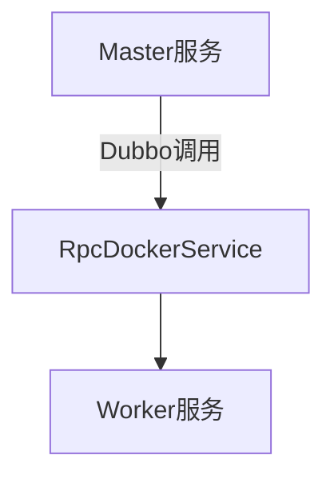
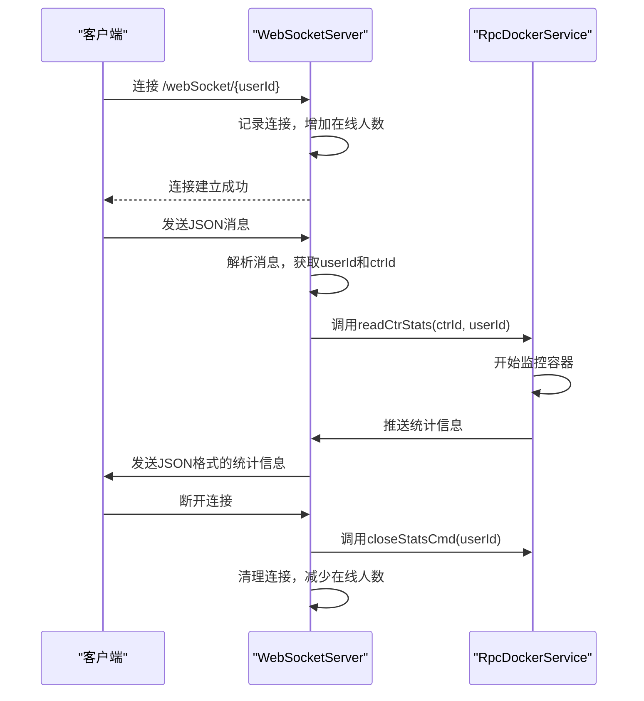

# API参考

<cite>
**本文档引用的文件**
- [UserController.java](file://yun-docker-master/src/main/java/com/lfc/yundocker/controller/UserController.java)
- [ContainerController.java](file://yun-docker-master/src/main/java/com/lfc/yundocker/controller/ContainerController.java)
- [RpcDockerService.java](file://yun-docker-api/src/main/java/com/lfc/yundocker/service/RpcDockerService.java)
- [RpcDockerServiceImpl.java](file://yun-docker-worker/src/main/java/com/lfc/yundocker/worker/rpc/RpcDockerServiceImpl.java)
- [WebSocketServer.java](file://yun-docker-worker/src/main/java/com/lfc/yundocker/worker/websocket/WebSocketServer.java)
- [UserRegisterRequest.java](file://yun-docker-common/src/main/java/com/lfc/yundocker/common/model/dto/user/UserRegisterRequest.java)
- [UserLoginRequest.java](file://yun-docker-common/src/main/java/com/lfc/yundocker/common/model/dto/user/UserLoginRequest.java)
- [CtrRunRequest.java](file://yun-docker-common/src/main/java/com/lfc/yundocker/common/model/dto/CtrRunRequest.java)
- [BaseResponse.java](file://yun-docker-common/src/main/java/com/lfc/yundocker/common/model/dto/BaseResponse.java)
- [Result.java](file://yun-docker-common/src/main/java/com/lfc/yundocker/common/model/vo/Result.java)
- [ErrorCode.java](file://yun-docker-common/src/main/java/com/lfc/yundocker/common/model/enums/ErrorCode.java)
- [CommonConstant.java](file://yun-docker-common/src/main/java/com/lfc/yundocker/common/constant/CommonConstant.java)
- [application.yml](file://yun-docker-master/src/main/resources/application.yml)
- [CtrStatsRequestMessage.java](file://yun-docker-common/src/main/java/com/lfc/yundocker/common/model/dto/message/CtrStatsRequestMessage.java)
- [CtrStatsResponseMessage.java](file://yun-docker-common/src/main/java/com/lfc/yundocker/common/model/dto/message/CtrStatsResponseMessage.java)
</cite>

## 目录
1. [RESTful API](#restful-api)
2. [Dubbo RPC接口](#dubbo-rpc接口)
3. [WebSocket接口](#websocket接口)

## RESTful API

本系统提供基于HTTP的RESTful API接口，所有接口均通过`/api`前缀访问，返回数据统一封装在`Result`对象中。

### 用户管理接口

#### 用户注册
- **HTTP方法**: POST
- **URL路径**: `/api/user/register`
- **请求头要求**: 无特殊要求
- **权限要求**: 无需登录
- **请求体JSON结构**:
```json
{
  "userAccount": "string",
  "userPassword": "string",
  "checkPassword": "string"
}
```
引用`UserRegisterRequest`类，包含用户账号、密码和确认密码。
- **响应格式**: `Result<Long>`，返回注册用户的ID
- **错误码说明**:
  - `400`: 参数错误（账号、密码或确认密码为空）
  - `500`: 系统错误

**Section sources**
- [UserController.java](file://yun-docker-master/src/main/java/com/lfc/yundocker/controller/UserController.java#L50-L63)
- [UserRegisterRequest.java](file://yun-docker-common/src/main/java/com/lfc/yundocker/common/model/dto/user/UserRegisterRequest.java#L1-L23)

#### 用户登录
- **HTTP方法**: POST
- **URL路径**: `/api/user/login`
- **请求头要求**: 无特殊要求
- **权限要求**: 无需登录
- **请求体JSON结构**:
```json
{
  "userAccount": "string",
  "userPassword": "string"
}
```
引用`UserLoginRequest`类，包含用户账号和密码。
- **响应格式**: `Result<LoginUserVO>`，返回登录用户信息
- **错误码说明**:
  - `400`: 参数错误（账号或密码为空）
  - `500`: 系统错误

**Section sources**
- [UserController.java](file://yun-docker-master/src/main/java/com/lfc/yundocker/controller/UserController.java#L72-L84)
- [UserLoginRequest.java](file://yun-docker-common/src/main/java/com/lfc/yundocker/common/model/dto/user/UserLoginRequest.java#L1-L21)

#### 用户注销
- **HTTP方法**: POST
- **URL路径**: `/api/user/logout`
- **请求头要求**: 需要包含有效的认证token
- **权限要求**: 需要登录
- **请求体**: 无
- **响应格式**: `Result<Boolean>`，返回注销结果
- **错误码说明**:
  - `400`: 参数错误（request为空）

**Section sources**
- [UserController.java](file://yun-docker-master/src/main/java/com/lfc/yundocker/controller/UserController.java#L115-L122)

#### 获取当前登录用户
- **HTTP方法**: GET
- **URL路径**: `/api/user/get/login`
- **请求头要求**: 需要包含有效的认证token
- **权限要求**: 需要登录
- **请求体**: 无
- **响应格式**: `Result<LoginUserVO>`，返回当前登录用户信息
- **错误码说明**: 无特定错误码

**Section sources**
- [UserController.java](file://yun-docker-master/src/main/java/com/lfc/yundocker/controller/UserController.java#L130-L134)

#### 用户信息更新（个人）
- **HTTP方法**: POST
- **URL路径**: `/api/user/update/my`
- **请求头要求**: 需要包含有效的认证token
- **权限要求**: 需要登录
- **请求体JSON结构**: 引用`UserUpdateMyRequest`类
- **响应格式**: `Result<Boolean>`，返回更新结果
- **错误码说明**:
  - `400`: 参数错误
  - `500`: 操作错误

**Section sources**
- [UserController.java](file://yun-docker-master/src/main/java/com/lfc/yundocker/controller/UserController.java#L294-L307)

### 容器管理接口

#### 获取我的容器列表
- **HTTP方法**: POST
- **URL路径**: `/api/container/list/page`
- **请求头要求**: 需要包含有效的认证token
- **权限要求**: 需要登录
- **请求体JSON结构**: 引用`PageRequest`类，包含分页信息
- **响应格式**: `Result<Page<ContainerVO>>`，返回容器分页列表
- **错误码说明**:
  - `400`: 参数错误
  - `500`: 参数错误（分页大小超过20）

**Section sources**
- [ContainerController.java](file://yun-docker-master/src/main/java/com/lfc/yundocker/controller/ContainerController.java#L48-L69)

#### 启动或停止容器
- **HTTP方法**: GET
- **URL路径**: `/api/container/startOrStop`
- **请求头要求**: 需要包含有效的认证token
- **权限要求**: 需要登录
- **请求参数**: `containerId`（容器ID）
- **响应格式**: `Result<String>`，返回操作结果信息
- **错误码说明**:
  - `400`: 参数错误（containerId为空）
  - `500`: 系统错误（操作失败）

**Section sources**
- [ContainerController.java](file://yun-docker-master/src/main/java/com/lfc/yundocker/controller/ContainerController.java#L78-L88)

#### 重启容器
- **HTTP方法**: GET
- **URL路径**: `/api/container/restart`
- **请求头要求**: 需要包含有效的认证token
- **权限要求**: 需要登录
- **请求参数**: `containerId`（容器ID）
- **响应格式**: `Result<String>`，返回操作结果信息
- **错误码说明**:
  - `400`: 参数错误（containerId为空）
  - `500`: 系统错误（操作失败）

**Section sources**
- [ContainerController.java](file://yun-docker-master/src/main/java/com/lfc/yundocker/controller/ContainerController.java#L97-L107)

#### 创建（运行）容器
- **HTTP方法**: POST
- **URL路径**: `/api/container/run`
- **请求头要求**: 需要包含有效的认证token
- **权限要求**: 需要登录
- **请求体JSON结构**: 引用`CtrRunRequest`类，包含镜像ID、主机端口、容器端口和容器名称
- **响应格式**: `Result<String>`，返回操作成功信息
- **错误码说明**:
  - `400`: 参数错误
  - `402`: 余额不足（ErrorCode.INSUFFICIENT_BALANCE）
  - `500`: 系统错误

**Section sources**
- [ContainerController.java](file://yun-docker-master/src/main/java/com/lfc/yundocker/controller/ContainerController.java#L117-L132)
- [CtrRunRequest.java](file://yun-docker-common/src/main/java/com/lfc/yundocker/common/model/dto/CtrRunRequest.java#L1-L35)

#### 删除容器
- **HTTP方法**: GET
- **URL路径**: `/api/container/remove`
- **请求头要求**: 需要包含有效的认证token
- **权限要求**: 需要登录
- **请求参数**: `containerId`（容器ID）
- **响应格式**: `Result<String>`，返回操作结果信息
- **错误码说明**:
  - `400`: 参数错误（containerId为空）
  - `500`: 系统错误（操作失败）

**Section sources**
- [ContainerController.java](file://yun-docker-master/src/main/java/com/lfc/yundocker/controller/ContainerController.java#L142-L152)

#### 下载容器日志
- **HTTP方法**: GET
- **URL路径**: `/api/container/downloadLog`
- **请求头要求**: 需要包含有效的认证token
- **权限要求**: 需要登录
- **请求参数**: `containerId`（容器ID）
- **响应格式**: 直接返回日志文件流
- **错误码说明**:
  - `400`: 参数错误（containerId为空）

**Section sources**
- [ContainerController.java](file://yun-docker-master/src/main/java/com/lfc/yundocker/controller/ContainerController.java#L161-L170)

## Dubbo RPC接口

Dubbo RPC接口用于主服务与工作节点之间的远程通信，基于Dubbo框架实现。

### RpcDockerService接口

`RpcDockerService`接口定义了Docker操作的远程调用方法。

#### 调用协议与配置
- **协议**: Dubbo协议
- **序列化方式**: 默认序列化
- **超时设置**: 5000毫秒（在`application.yml`中配置）
- **重试策略**: 不重试（retries: 0）



**Diagram sources**
- [application.yml](file://yun-docker-master/src/main/resources/application.yml#L3-L12)
- [RpcDockerService.java](file://yun-docker-api/src/main/java/com/lfc/yundocker/service/RpcDockerService.java#L1-L143)
- [RpcDockerServiceImpl.java](file://yun-docker-worker/src/main/java/com/lfc/yundocker/worker/rpc/RpcDockerServiceImpl.java#L1-L440)

#### 镜像操作方法

##### 拉取镜像
- **方法签名**: `InspectImageResponse pullImage(String image)`
- **参数**: 镜像名称
- **返回值**: 镜像信息（InspectImageResponse）
- **异常**: `InterruptedException`

**Section sources**
- [RpcDockerService.java](file://yun-docker-api/src/main/java/com/lfc/yundocker/service/RpcDockerService.java#L18-L19)
- [RpcDockerServiceImpl.java](file://yun-docker-worker/src/main/java/com/lfc/yundocker/worker/rpc/RpcDockerServiceImpl.java#L53-L72)

##### 删除镜像
- **方法签名**: `boolean removeImage(String image)`
- **参数**: 镜像名称
- **返回值**: 操作结果（true表示成功）
- **异常**: 无

**Section sources**
- [RpcDockerService.java](file://yun-docker-api/src/main/java/com/lfc/yundocker/service/RpcDockerService.java#L26-L27)
- [RpcDockerServiceImpl.java](file://yun-docker-worker/src/main/java/com/lfc/yundocker/worker/rpc/RpcDockerServiceImpl.java#L75-L78)

#### 容器操作方法

##### 运行容器
- **方法签名**: `String runCtr(String imageId, Integer hostPort, Integer containerPort, String name)`
- **参数**: 镜像ID、主机端口、容器端口、容器名称
- **返回值**: 容器ID
- **异常**: 无

**Section sources**
- [RpcDockerService.java](file://yun-docker-api/src/main/java/com/lfc/yundocker/service/RpcDockerService.java#L37-L38)
- [RpcDockerServiceImpl.java](file://yun-docker-worker/src/main/java/com/lfc/yundocker/worker/rpc/RpcDockerServiceImpl.java#L83-L107)

##### 创建容器
- **方法签名**: `String createCtr(String image)` 或 `String createCtr(String image, String filePath)`
- **参数**: 镜像名称，可选的文件路径（用于挂载目录）
- **返回值**: 容器ID
- **异常**: 无

**Section sources**
- [RpcDockerService.java](file://yun-docker-api/src/main/java/com/lfc/yundocker/service/RpcDockerService.java#L46-L62)
- [RpcDockerServiceImpl.java](file://yun-docker-worker/src/main/java/com/lfc/yundocker/worker/rpc/RpcDockerServiceImpl.java#L116-L135)

##### 启动容器
- **方法签名**: `boolean startCtr(String cid)`
- **参数**: 容器ID
- **返回值**: 操作结果（true表示成功）
- **异常**: 无

**Section sources**
- [RpcDockerService.java](file://yun-docker-api/src/main/java/com/lfc/yundocker/service/RpcDockerService.java#L104-L105)
- [RpcDockerServiceImpl.java](file://yun-docker-worker/src/main/java/com/lfc/yundocker/worker/rpc/RpcDockerServiceImpl.java#L321-L324)

##### 停止容器
- **方法签名**: `boolean stopCtr(String cid)`
- **参数**: 容器ID
- **返回值**: 操作结果（true表示成功）
- **异常**: 无

**Section sources**
- [RpcDockerService.java](file://yun-docker-api/src/main/java/com/lfc/yundocker/service/RpcDockerService.java#L113-L114)
- [RpcDockerServiceImpl.java](file://yun-docker-worker/src/main/java/com/lfc/yundocker/worker/rpc/RpcDockerServiceImpl.java#L333-L337)

##### 重启容器
- **方法签名**: `boolean restartCtr(String cid)`
- **参数**: 容器ID
- **返回值**: 操作结果（true表示成功）
- **异常**: 无

**Section sources**
- [RpcDockerService.java](file://yun-docker-api/src/main/java/com/lfc/yundocker/service/RpcDockerService.java#L140-L141)
- [RpcDockerServiceImpl.java](file://yun-docker-worker/src/main/java/com/lfc/yundocker/worker/rpc/RpcDockerServiceImpl.java#L434-L438)

##### 删除容器
- **方法签名**: `boolean removeCtr(String cid)`
- **参数**: 容器ID
- **返回值**: 操作结果（true表示成功）
- **异常**: 无

**Section sources**
- [RpcDockerService.java](file://yun-docker-api/src/main/java/com/lfc/yundocker/service/RpcDockerService.java#L131-L132)
- [RpcDockerServiceImpl.java](file://yun-docker-worker/src/main/java/com/lfc/yundocker/worker/rpc/RpcDockerServiceImpl.java#L422-L425)

##### 查看容器日志
- **方法签名**: `byte[] logCtr(String cid)`
- **参数**: 容器ID
- **返回值**: 日志文件字节数组
- **异常**: `BusinessException`（Docker错误）

**Section sources**
- [RpcDockerService.java](file://yun-docker-api/src/main/java/com/lfc/yundocker/service/RpcDockerService.java#L123-L124)
- [RpcDockerServiceImpl.java](file://yun-docker-worker/src/main/java/com/lfc/yundocker/worker/rpc/RpcDockerServiceImpl.java#L346-L413)

##### 读取容器统计数据
- **方法签名**: `void readCtrStats(String cid, Long userId)`
- **参数**: 容器ID、用户ID
- **返回值**: 无（通过WebSocket异步推送）
- **异常**: 无

**Section sources**
- [RpcDockerService.java](file://yun-docker-api/src/main/java/com/lfc/yundocker/service/RpcDockerService.java#L70-L71)
- [RpcDockerServiceImpl.java](file://yun-docker-worker/src/main/java/com/lfc/yundocker/worker/rpc/RpcDockerServiceImpl.java#L196-L259)

##### 关闭监控统计命令
- **方法签名**: `void closeStatsCmd(Long userId)`
- **参数**: 用户ID
- **返回值**: 无
- **异常**: 无

**Section sources**
- [RpcDockerService.java](file://yun-docker-api/src/main/java/com/lfc/yundocker/service/RpcDockerService.java#L78-L79)
- [RpcDockerServiceImpl.java](file://yun-docker-worker/src/main/java/com/lfc/yundocker/worker/rpc/RpcDockerServiceImpl.java#L268-L278)

## WebSocket接口

WebSocket接口用于实时推送容器的监控统计数据。

### WebSocket连接
- **连接URL**: `ws://host:8088/api/webSocket/{userId}`
- **路径参数**: `userId`（用户ID）
- **连接建立**: 客户端连接时，服务端记录用户连接并增加在线人数统计
- **连接关闭**: 客户端断开连接时，服务端自动清理资源并关闭对应的统计命令



**Diagram sources**
- [WebSocketServer.java](file://yun-docker-worker/src/main/java/com/lfc/yundocker/worker/websocket/WebSocketServer.java#L1-L175)
- [RpcDockerServiceImpl.java](file://yun-docker-worker/src/main/java/com/lfc/yundocker/worker/rpc/RpcDockerServiceImpl.java#L196-L259)

### 消息帧格式
- **客户端发送消息格式**:
```json
{
  "userId": 123,
  "ctrId": "container123"
}
```
引用`CtrStatsRequestMessage`类，用于启动容器监控。

- **服务端推送消息格式**:
```json
{
  "cpuTotalUsage": 123.4,
  "perCpuUsage": [10, 20, 30],
  "onlineCpus": 4,
  "memoryUsage": 128.5,
  "memoryMaxUsage": 256.0,
  "memoryLimit": 512.0,
  "numProcess": 5,
  "rxBytes": 1024.0,
  "txBytes": 512.0,
  "ioValue": 2048.0
}
```
引用`CtrStatsResponseMessage`类，包含容器的CPU、内存、网络和IO使用情况。

### 事件类型
- **连接事件**: `@OnOpen` - 客户端连接时触发
- **消息事件**: `@OnMessage` - 客户端发送消息时触发
- **关闭事件**: `@OnClose` - 客户端断开连接时触发
- **错误事件**: `@OnError` - 发生错误时触发

### 客户端交互模式
1. 客户端建立WebSocket连接，传入用户ID
2. 客户端发送包含用户ID和容器ID的JSON消息，请求监控特定容器
3. 服务端接收消息后，调用`readCtrStats`方法开始监控容器
4. 服务端定期通过WebSocket推送容器的实时统计数据
5. 客户端断开连接时，服务端自动停止监控并清理资源

**Section sources**
- [WebSocketServer.java](file://yun-docker-worker/src/main/java/com/lfc/yundocker/worker/websocket/WebSocketServer.java#L1-L175)
- [CtrStatsRequestMessage.java](file://yun-docker-common/src/main/java/com/lfc/yundocker/common/model/dto/message/CtrStatsRequestMessage.java#L1-L17)
- [CtrStatsResponseMessage.java](file://yun-docker-common/src/main/java/com/lfc/yundocker/common/model/dto/message/CtrStatsResponseMessage.java#L1-L69)

## API调用示例

### RESTful API示例

#### 用户注册curl命令
```bash
curl -X POST http://localhost:8088/api/user/register \
  -H "Content-Type: application/json" \
  -d '{
    "userAccount": "testuser",
    "userPassword": "password123",
    "checkPassword": "password123"
  }'
```

#### 用户登录curl命令
```bash
curl -X POST http://localhost:8088/api/user/login \
  -H "Content-Type: application/json" \
  -d '{
    "userAccount": "testuser",
    "userPassword": "password123"
  }'
```

#### 运行容器curl命令
```bash
curl -X POST http://localhost:8088/api/container/run \
  -H "Content-Type: application/json" \
  -H "X-Access-Token: your_token_here" \
  -d '{
    "imageId": "nginx:latest",
    "hostPort": 8080,
    "containerPort": 80,
    "name": "my-nginx"
  }'
```

### Dubbo RPC Java调用示例
```java
// 获取Dubbo服务引用
RpcDockerService rpcDockerService = applicationContext.getBean(RpcDockerService.class);

// 拉取镜像
InspectImageResponse image = rpcDockerService.pullImage("nginx:latest");

// 运行容器
String containerId = rpcDockerService.runCtr(image.getId(), 8080, 80, "my-nginx");

// 启动容器
boolean started = rpcDockerService.startCtr(containerId);
```

### WebSocket客户端示例
```javascript
// 建立WebSocket连接
const userId = 123;
const ws = new WebSocket(`ws://localhost:8088/api/webSocket/${userId}`);

ws.onopen = function(event) {
  console.log('WebSocket连接已建立');
  
  // 发送监控请求
  const message = {
    userId: userId,
    ctrId: 'container123'
  };
  ws.send(JSON.stringify(message));
};

ws.onmessage = function(event) {
  const stats = JSON.parse(event.data);
  console.log('收到容器统计信息:', stats);
  // 更新UI显示
};

ws.onclose = function(event) {
  console.log('WebSocket连接已关闭');
};
```

**Section sources**
- [UserController.java](file://yun-docker-master/src/main/java/com/lfc/yundocker/controller/UserController.java)
- [ContainerController.java](file://yun-docker-master/src/main/java/com/lfc/yundocker/controller/ContainerController.java)
- [RpcDockerService.java](file://yun-docker-api/src/main/java/com/lfc/yundocker/service/RpcDockerService.java)
- [WebSocketServer.java](file://yun-docker-worker/src/main/java/com/lfc/yundocker/worker/websocket/WebSocketServer.java)