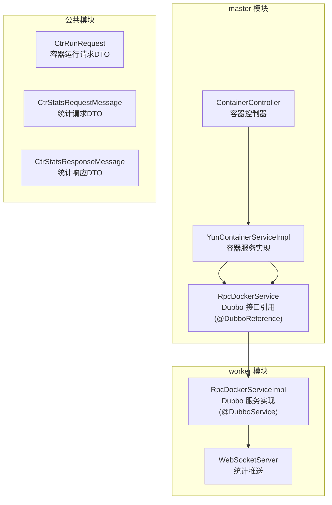
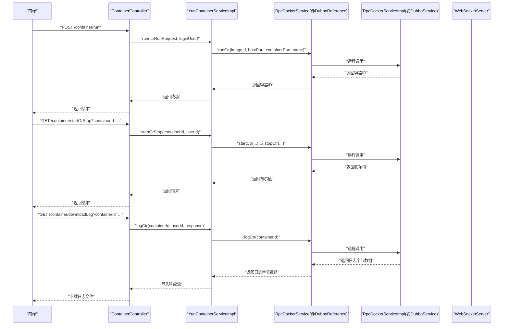
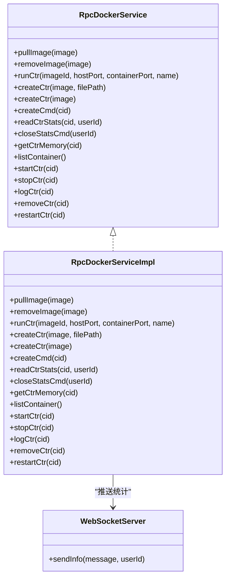
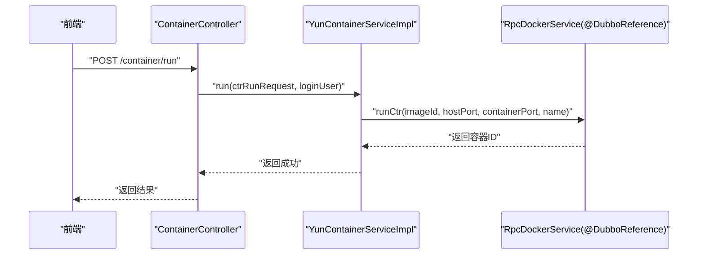
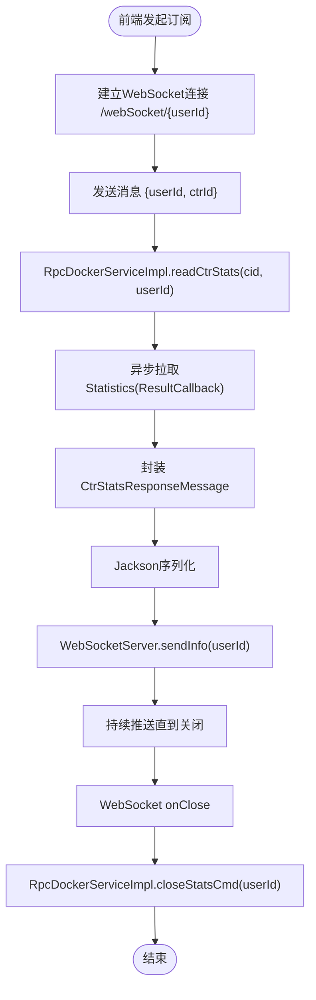
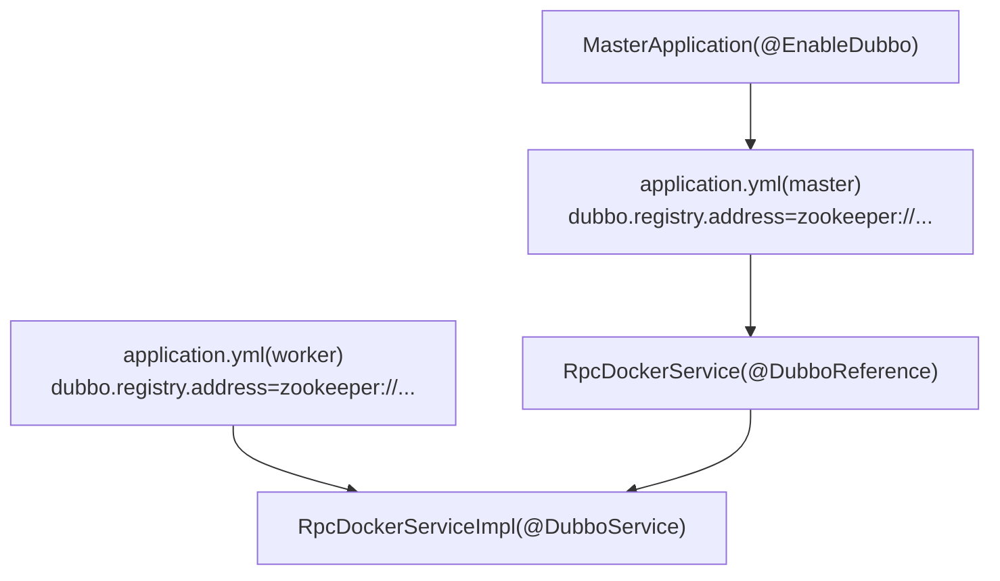

# Dubbo RPC API

<cite>
**本文引用的文件**
- [RpcDockerService.java](file://yun-docker-api/src/main/java/com/lfc/yundocker/service/RpcDockerService.java)
- [RpcDockerServiceImpl.java](file://yun-docker-worker/src/main/java/com/lfc/yundocker/worker/rpc/RpcDockerServiceImpl.java)
- [YunContainerServiceImpl.java](file://yun-docker-master/src/main/java/com/lfc/yundocker/service/impl/YunContainerServiceImpl.java)
- [ContainerController.java](file://yun-docker-master/src/main/java/com/lfc/yundocker/controller/ContainerController.java)
- [CtrRunRequest.java](file://yun-docker-common/src/main/java/com/lfc/yundocker/common/model/dto/CtrRunRequest.java)
- [CtrStatsRequestMessage.java](file://yun-docker-common/src/main/java/com/lfc/yundocker/common/model/dto/message/CtrStatsRequestMessage.java)
- [CtrStatsResponseMessage.java](file://yun-docker-common/src/main/java/com/lfc/yundocker/common/model/dto/message/CtrStatsResponseMessage.java)
- [WebSocketServer.java](file://yun-docker-worker/src/main/java/com/lfc/yundocker/worker/websocket/WebSocketServer.java)
- [application.yml（master）](file://yun-docker-master/src/main/resources/application.yml)
- [application-dev.yml（master）](file://yun-docker-master/src/main/resources/application-dev.yml)
- [application-prod.yml（master）](file://yun-docker-master/src/main/resources/application-prod.yml)
- [application.yml（worker）](file://yun-docker-worker/src/main/resources/application.yml)
- [application-dev.yml（worker）](file://yun-docker-worker/src/main/resources/application-dev.yml)
- [application-prod.yml（worker）](file://yun-docker-worker/src/main/resources/application-prod.yml)
- [MasterApplication.java](file://yun-docker-master/MasterApplication.java)
- [EmbeddedZooKeeper.java](file://embedded-zookeeper/src/main/java/com/lfc/zookeeper/EmbeddedZooKeeper.java)
- [pom.xml（root）](file://pom.xml)
- [pom.xml（worker）](file://yun-docker-worker/pom.xml)
</cite>

## 目录
1. [简介](#简介)
2. [项目结构](#项目结构)
3. [核心组件](#核心组件)
4. [架构总览](#架构总览)
5. [详细组件分析](#详细组件分析)
6. [依赖分析](#依赖分析)
7. [性能考虑](#性能考虑)
8. [故障排查指南](#故障排查指南)
9. [结论](#结论)
10. [附录](#附录)

## 简介
本文件面向“云Docker”项目的Dubbo RPC接口文档，聚焦 RpcDockerService 接口及其在 worker 节点的实现。文档覆盖以下要点：
- 调用协议：基于 Dubbo 的远程方法调用
- 序列化方式：Hessian2（由 Dubbo 默认序列化栈提供）
- 超时与重试：master 端全局超时与重试策略
- 负载均衡：默认使用随机策略（可按需扩展）
- 方法参数与返回值：参数多为基本类型或 DTO 类，返回值涵盖字符串、布尔值、集合与字节数组
- 隐式传参：通过 userId 等参数在调用链路上传递用户身份
- 服务暴露与引用：@DubboService（worker）与 @DubboReference（master）
- Java 调用示例：在 master 模块中通过 RPC 触发 worker 执行 Docker 命令，并处理异步响应与异常

## 项目结构
该项目采用多模块结构，包含 API 定义、通用模型、master 控制层与业务服务、worker RPC 实现与 WebSocket 统计推送等模块。

图表来源
- [ContainerController.java](file://yun-docker-master/src/main/java/com/lfc/yundocker/controller/ContainerController.java#L1-L173)
- [YunContainerServiceImpl.java](file://yun-docker-master/src/main/java/com/lfc/yundocker/service/impl/YunContainerServiceImpl.java#L1-L318)
- [RpcDockerService.java](file://yun-docker-api/src/main/java/com/lfc/yundocker/service/RpcDockerService.java#L1-L143)
- [RpcDockerServiceImpl.java](file://yun-docker-worker/src/main/java/com/lfc/yundocker/worker/rpc/RpcDockerServiceImpl.java#L1-L440)
- [CtrRunRequest.java](file://yun-docker-common/src/main/java/com/lfc/yundocker/common/model/dto/CtrRunRequest.java#L1-L35)
- [CtrStatsRequestMessage.java](file://yun-docker-common/src/main/java/com/lfc/yundocker/common/model/dto/message/CtrStatsRequestMessage.java#L1-L17)
- [CtrStatsResponseMessage.java](file://yun-docker-common/src/main/java/com/lfc/yundocker/common/model/dto/message/CtrStatsResponseMessage.java#L1-L69)
- [WebSocketServer.java](file://yun-docker-worker/src/main/java/com/lfc/yundocker/worker/websocket/WebSocketServer.java#L1-L175)

章节来源
- [MasterApplication.java](file://yun-docker-master/MasterApplication.java#L1-L24)
- [application.yml（master）](file://yun-docker-master/src/main/resources/application.yml#L1-L60)
- [application.yml（worker）](file://yun-docker-worker/src/main/resources/application.yml#L1-L51)

## 核心组件
- RpcDockerService：定义容器与镜像管理的远程方法集合，位于 yun-docker-api 模块，供 master 通过 Dubbo 引用调用。
- RpcDockerServiceImpl：worker 端实现，负责实际调用 Docker Java 客户端执行 Docker 命令，并通过 WebSocket 推送统计信息。
- YunContainerServiceImpl：master 端业务服务，持有 @DubboReference RpcDockerService，协调容器生命周期与统计订阅。
- ContainerController：master 端控制器，接收前端请求，调用 YunContainerServiceImpl 并处理异步日志下载与统计订阅。
- DTO 类：CtrRunRequest、CtrStatsRequestMessage、CtrStatsResponseMessage，承载请求与统计数据结构。

章节来源
- [RpcDockerService.java](file://yun-docker-api/src/main/java/com/lfc/yundocker/service/RpcDockerService.java#L1-L143)
- [RpcDockerServiceImpl.java](file://yun-docker-worker/src/main/java/com/lfc/yundocker/worker/rpc/RpcDockerServiceImpl.java#L1-L440)
- [YunContainerServiceImpl.java](file://yun-docker-master/src/main/java/com/lfc/yundocker/service/impl/YunContainerServiceImpl.java#L1-L318)
- [ContainerController.java](file://yun-docker-master/src/main/java/com/lfc/yundocker/controller/ContainerController.java#L1-L173)
- [CtrRunRequest.java](file://yun-docker-common/src/main/java/com/lfc/yundocker/common/model/dto/CtrRunRequest.java#L1-L35)
- [CtrStatsRequestMessage.java](file://yun-docker-common/src/main/java/com/lfc/yundocker/common/model/dto/message/CtrStatsRequestMessage.java#L1-L17)
- [CtrStatsResponseMessage.java](file://yun-docker-common/src/main/java/com/lfc/yundocker/common/model/dto/message/CtrStatsResponseMessage.java#L1-L69)

## 架构总览
Master 侧通过 Dubbo 消费 RpcDockerService，Worker 侧以 @DubboService 暴露服务。统计信息通过 WebSocket 从 Worker 推送到 Master 端前端。

图表来源
- [ContainerController.java](file://yun-docker-master/src/main/java/com/lfc/yundocker/controller/ContainerController.java#L1-L173)
- [YunContainerServiceImpl.java](file://yun-docker-master/src/main/java/com/lfc/yundocker/service/impl/YunContainerServiceImpl.java#L1-L318)
- [RpcDockerService.java](file://yun-docker-api/src/main/java/com/lfc/yundocker/service/RpcDockerService.java#L1-L143)
- [RpcDockerServiceImpl.java](file://yun-docker-worker/src/main/java/com/lfc/yundocker/worker/rpc/RpcDockerServiceImpl.java#L1-L440)

## 详细组件分析

### RpcDockerService 接口与方法族
- 方法族概览
  - 镜像相关：pullImage、removeImage
  - 容器生命周期：createCtr、runCtr、startCtr、stopCtr、restartCtr、removeCtr、listContainer
  - 容器命令：createCmd
  - 统计与日志：readCtrStats、closeStatsCmd、getCtrMemory、logCtr

- 参数与返回值
  - runCtr(imageId, hostPort, containerPort, name)：参数为基本类型与字符串；返回容器ID（字符串）
  - createCtr(image, filePath)：挂载目录场景；返回容器ID（字符串）
  - createCtr(image)：无挂载目录场景；返回容器ID（字符串）
  - createCmd(cid)：在指定容器中创建并执行命令；无返回值
  - readCtrStats(cid, userId)：订阅统计；无返回值
  - closeStatsCmd(userId)：关闭统计；无返回值
  - getCtrMemory(cid)：返回内存使用（double）
  - listContainer()：返回容器列表（List<Container>）
  - startCtr(cid)、stopCtr(cid)、restartCtr(cid)、removeCtr(cid)：返回布尔值
  - logCtr(cid)：返回日志字节数组（byte[]）

- 隐式传参
  - 通过 userId 参数在统计订阅与关闭场景中传递用户身份，便于 WebSocketServer 与 RpcDockerServiceImpl 建立映射与清理。

章节来源
- [RpcDockerService.java](file://yun-docker-api/src/main/java/com/lfc/yundocker/service/RpcDockerService.java#L1-L143)
- [CtrStatsRequestMessage.java](file://yun-docker-common/src/main/java/com/lfc/yundocker/common/model/dto/message/CtrStatsRequestMessage.java#L1-L17)
- [CtrStatsResponseMessage.java](file://yun-docker-common/src/main/java/com/lfc/yundocker/common/model/dto/message/CtrStatsResponseMessage.java#L1-L69)

### worker 端实现 RpcDockerServiceImpl
- 服务暴露
  - 使用 @DubboService 注解暴露 RpcDockerService 接口，供 master 消费。
- Docker 命令执行
  - 镜像：pullImage、removeImage
  - 容器：createCtr、runCtr、startCtr、stopCtr、restartCtr、removeCtr、listContainer
  - 命令：createCmd
  - 统计：readCtrStats、closeStatsCmd、getCtrMemory
  - 日志：logCtr
- 统计推送
  - readCtrStats 通过 ResultCallback 异步拉取统计，封装为 CtrStatsResponseMessage，使用 Jackson 序列化并通过 WebSocketServer 推送给前端。
- 异常处理
  - 对 Docker 操作异常统一抛出 BusinessException，便于上层捕获与降级。

图表来源
- [RpcDockerService.java](file://yun-docker-api/src/main/java/com/lfc/yundocker/service/RpcDockerService.java#L1-L143)
- [RpcDockerServiceImpl.java](file://yun-docker-worker/src/main/java/com/lfc/yundocker/worker/rpc/RpcDockerServiceImpl.java#L1-L440)
- [WebSocketServer.java](file://yun-docker-worker/src/main/java/com/lfc/yundocker/worker/websocket/WebSocketServer.java#L1-L175)

章节来源
- [RpcDockerServiceImpl.java](file://yun-docker-worker/src/main/java/com/lfc/yundocker/worker/rpc/RpcDockerServiceImpl.java#L1-L440)
- [WebSocketServer.java](file://yun-docker-worker/src/main/java/com/lfc/yundocker/worker/websocket/WebSocketServer.java#L1-L175)

### master 端服务与控制器
- 服务实现 YunContainerServiceImpl
  - 通过 @DubboReference 引用 RpcDockerService
  - run：组装 CtrRunRequest，调用 rpcDockerService.runCtr，并持久化容器信息与扣减余额
  - startOrStop：根据状态调用 startCtr/stopCtr
  - restart/remove：调用 restartCtr/removeCtr
  - readStats：调用 readCtrStats 订阅统计
  - logCtr：调用 logCtr 获取日志字节数组并写入 HttpServletResponse
- 控制器 ContainerController
  - 提供容器分页、启动/停止、重启、删除、运行、下载日志等接口
  - 通过 UserService 获取登录用户，作为隐式传参的一部分

图表来源
- [ContainerController.java](file://yun-docker-master/src/main/java/com/lfc/yundocker/controller/ContainerController.java#L1-L173)
- [YunContainerServiceImpl.java](file://yun-docker-master/src/main/java/com/lfc/yundocker/service/impl/YunContainerServiceImpl.java#L1-L318)
- [CtrRunRequest.java](file://yun-docker-common/src/main/java/com/lfc/yundocker/common/model/dto/CtrRunRequest.java#L1-L35)

章节来源
- [YunContainerServiceImpl.java](file://yun-docker-master/src/main/java/com/lfc/yundocker/service/impl/YunContainerServiceImpl.java#L1-L318)
- [ContainerController.java](file://yun-docker-master/src/main/java/com/lfc/yundocker/controller/ContainerController.java#L1-L173)
- [CtrRunRequest.java](file://yun-docker-common/src/main/java/com/lfc/yundocker/common/model/dto/CtrRunRequest.java#L1-L35)

### 统计订阅流程（异步推送）
- 订阅
  - 前端通过 WebSocket 连接 /webSocket/{userId}
  - 发送包含 userId 与 ctrId 的消息，触发 RpcDockerServiceImpl.readCtrStats
- 推送
  - 通过 ResultCallback 异步拉取 Statistics，封装为 CtrStatsResponseMessage
  - 使用 Jackson 序列化后通过 WebSocketServer.sendInfo 推送
- 关闭
  - WebSocket 断开时，通过 WebSocketServer.onClose 调用 RpcDockerServiceImpl.closeStatsCmd 清理回调

图表来源
- [WebSocketServer.java](file://yun-docker-worker/src/main/java/com/lfc/yundocker/worker/websocket/WebSocketServer.java#L1-L175)
- [RpcDockerServiceImpl.java](file://yun-docker-worker/src/main/java/com/lfc/yundocker/worker/rpc/RpcDockerServiceImpl.java#L1-L440)
- [CtrStatsResponseMessage.java](file://yun-docker-common/src/main/java/com/lfc/yundocker/common/model/dto/message/CtrStatsResponseMessage.java#L1-L69)

## 依赖分析
- Dubbo 与注册中心
  - master 与 worker 均通过 application.yml 配置 dubbo.registry.address=zookeeper://...，使用 Zookeeper 作为注册中心
  - master 端启用 @EnableDubbo，worker 端通过 @DubboService 暴露服务
- 序列化
  - 项目使用 Dubbo 默认序列化栈，Hessian2 作为主要序列化方式
- Docker 客户端
  - worker 通过 docker-java 客户端执行 Docker 命令
- WebSocket
  - worker 侧提供 WebSocketServer，用于统计推送

图表来源
- [MasterApplication.java](file://yun-docker-master/MasterApplication.java#L1-L24)
- [application.yml（master）](file://yun-docker-master/src/main/resources/application.yml#L1-L60)
- [application-dev.yml（master）](file://yun-docker-master/src/main/resources/application-dev.yml#L1-L70)
- [application-prod.yml（master）](file://yun-docker-master/src/main/resources/application-prod.yml#L1-L71)
- [application.yml（worker）](file://yun-docker-worker/src/main/resources/application.yml#L1-L51)
- [application-dev.yml（worker）](file://yun-docker-worker/src/main/resources/application-dev.yml#L1-L64)
- [application-prod.yml（worker）](file://yun-docker-worker/src/main/resources/application-prod.yml#L1-L64)

章节来源
- [pom.xml（root）](file://pom.xml#L31-L69)
- [pom.xml（worker）](file://yun-docker-worker/pom.xml#L29-L60)
- [EmbeddedZooKeeper.java](file://embedded-zookeeper/src/main/java/com/lfc/zookeeper/EmbeddedZooKeeper.java#L1-L40)

## 性能考虑
- 超时与重试
  - master 端 consumer.timeout=5000ms，retries=0；建议对耗时操作（如日志下载、统计订阅）在业务层做超时控制与重试策略
- 统计推送
  - 使用 ResultCallback 异步拉取，避免阻塞；注意在关闭时及时清理回调，防止资源泄漏
- 日志下载
  - 采用流式写入 HttpServletResponse，避免一次性加载大文件导致内存压力
- 负载均衡
  - 默认随机策略；若存在多个 worker 实例，建议在 provider 端配置更合适的负载均衡策略（如一致性哈希）

[本节为通用指导，无需列出具体文件来源]

## 故障排查指南
- 注册中心不可用
  - 确认 zookeeper 地址配置正确，且 EmbeddedZooKeeper 已启动或外部 Zookeeper 正常
- 超时异常
  - 检查 master 端 consumer.timeout 是否过短；对日志下载与统计订阅场景适当放宽
- 统计订阅异常
  - 确认 WebSocketServer 与 RpcDockerServiceImpl 的 userId 映射是否正确；断开连接时是否调用 closeStatsCmd
- Docker 操作异常
  - 检查 docker-java 客户端配置与 Docker daemon 连接；异常统一包装为 BusinessException

章节来源
- [application-dev.yml（master）](file://yun-docker-master/src/main/resources/application-dev.yml#L1-L70)
- [application-prod.yml（master）](file://yun-docker-master/src/main/resources/application-prod.yml#L1-L71)
- [application-dev.yml（worker）](file://yun-docker-worker/src/main/resources/application-dev.yml#L1-L64)
- [application-prod.yml（worker）](file://yun-docker-worker/src/main/resources/application-prod.yml#L1-L64)
- [EmbeddedZooKeeper.java](file://embedded-zookeeper/src/main/java/com/lfc/zookeeper/EmbeddedZooKeeper.java#L1-L40)

## 结论
本项目通过 Dubbo 将 master 与 worker 解耦，以 RpcDockerService 为契约，实现容器全生命周期管理与统计订阅推送。master 侧以控制器与服务层编排业务，worker 侧以实现类对接 Docker 客户端并提供异步统计推送能力。整体架构清晰、职责分离，具备良好的扩展性与可维护性。

[本节为总结性内容，无需列出具体文件来源]

## 附录

### 调用协议与序列化
- 协议：Dubbo
- 序列化：Hessian2（由 Dubbo 默认序列化栈提供）
- 超时与重试：master 端 consumer.timeout=5000ms，retries=0
- 负载均衡：默认随机策略（可按需扩展）

章节来源
- [application.yml（master）](file://yun-docker-master/src/main/resources/application.yml#L1-L60)
- [pom.xml（root）](file://pom.xml#L31-L69)

### 服务暴露与引用配置
- 服务暴露：worker 端使用 @DubboService 暴露 RpcDockerServiceImpl
- 服务引用：master 端使用 @DubboReference 引用 RpcDockerService
- 启用 Dubbo：master 端 @EnableDubbo

章节来源
- [RpcDockerServiceImpl.java](file://yun-docker-worker/src/main/java/com/lfc/yundocker/worker/rpc/RpcDockerServiceImpl.java#L1-L440)
- [YunContainerServiceImpl.java](file://yun-docker-master/src/main/java/com/lfc/yundocker/service/impl/YunContainerServiceImpl.java#L1-L318)
- [MasterApplication.java](file://yun-docker-master/MasterApplication.java#L1-L24)

### Java 调用示例（步骤说明）
- 在 master 模块中，通过 @DubboReference 引用 RpcDockerService
- 在业务方法中调用相应方法（如 runCtr、startCtr、stopCtr、logCtr、readCtrStats）
- 对于日志下载：先调用 rpcDockerService.logCtr 获取字节数组，再写入 HttpServletResponse 输出流
- 对于统计订阅：前端建立 WebSocket 连接并发送 {userId, ctrId}，后端在 RpcDockerServiceImpl.readCtrStats 中订阅并推送

章节来源
- [YunContainerServiceImpl.java](file://yun-docker-master/src/main/java/com/lfc/yundocker/service/impl/YunContainerServiceImpl.java#L1-L318)
- [ContainerController.java](file://yun-docker-master/src/main/java/com/lfc/yundocker/controller/ContainerController.java#L1-L173)
- [RpcDockerServiceImpl.java](file://yun-docker-worker/src/main/java/com/lfc/yundocker/worker/rpc/RpcDockerServiceImpl.java#L1-L440)
- [WebSocketServer.java](file://yun-docker-worker/src/main/java/com/lfc/yundocker/worker/websocket/WebSocketServer.java#L1-L175)