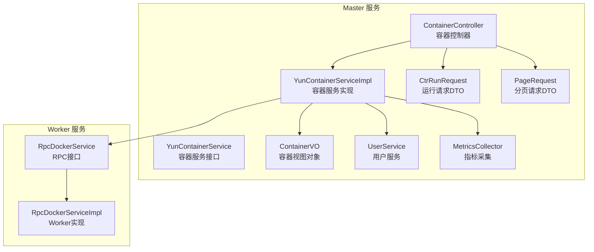
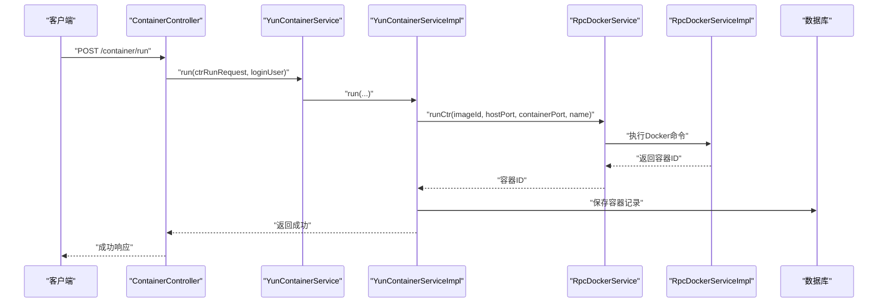
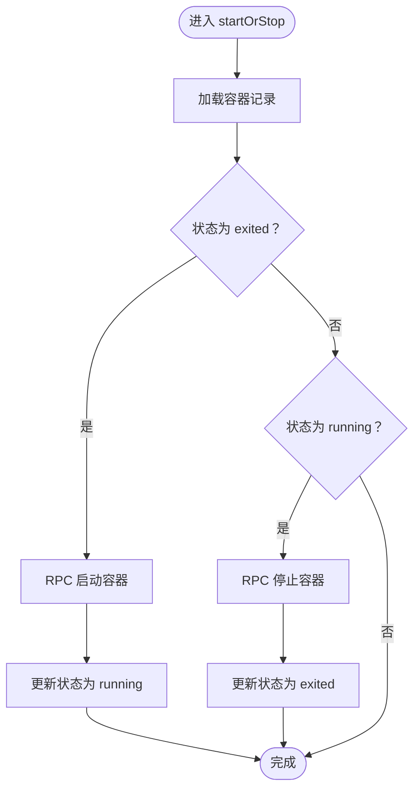
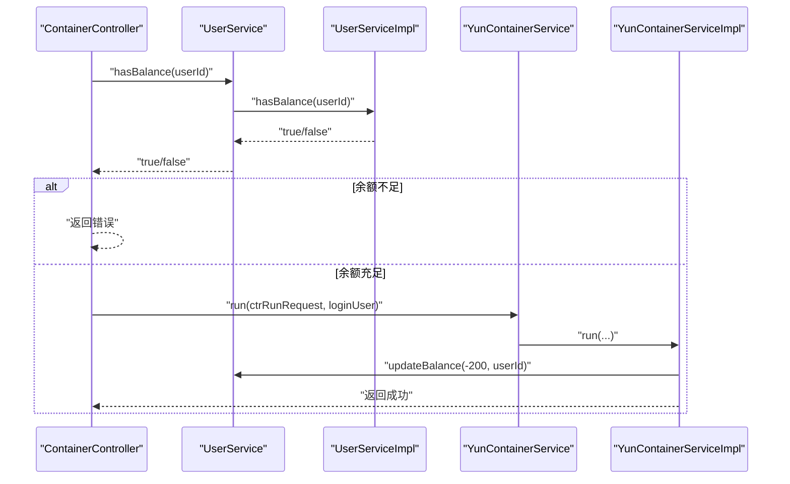
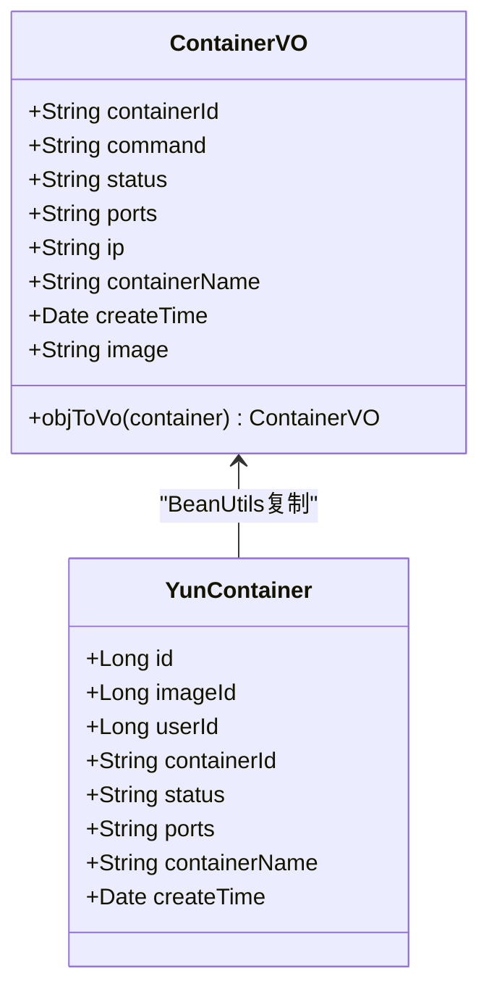
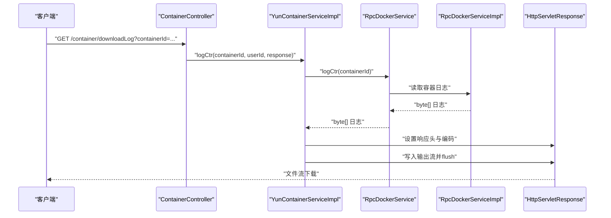
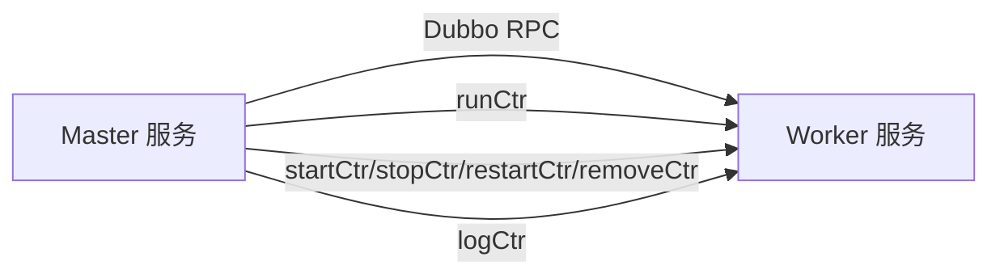
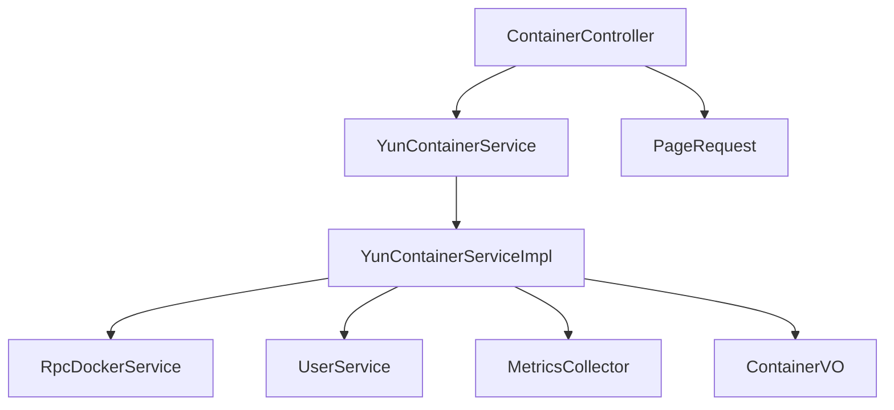

# 容器API

<cite>
**本文引用的文件**
- [ContainerController.java](file://yun-docker-master/src/main/java/com/lfc/yundocker/controller/ContainerController.java)
- [YunContainerService.java](file://yun-docker-master/src/main/java/com/lfc/yundocker/service/YunContainerService.java)
- [YunContainerServiceImpl.java](file://yun-docker-master/src/main/java/com/lfc/yundocker/service/impl/YunContainerServiceImpl.java)
- [ContainerVO.java](file://yun-docker-master/src/main/java/com/lfc/yundocker/common/model/vo/ContainerVO.java)
- [CtrRunRequest.java](file://yun-docker-common/src/main/java/com/lfc/yundocker/common/model/dto/CtrRunRequest.java)
- [PageRequest.java](file://yun-docker-common/src/main/java/com/lfc/yundocker/common/model/dto/PageRequest.java)
- [CtrStatusConstant.java](file://yun-docker-common/src/main/java/com/lfc/yundocker/common/constant/CtrStatusConstant.java)
- [RpcDockerService.java](file://yun-docker-api/src/main/java/com/lfc/yundocker/service/RpcDockerService.java)
- [RpcDockerServiceImpl.java](file://yun-docker-worker/src/main/java/com/lfc/yundocker/worker/rpc/RpcDockerServiceImpl.java)
- [UserService.java](file://yun-docker-master/src/main/java/com/lfc/yundocker/service/UserService.java)
- [UserServiceImpl.java](file://yun-docker-master/src/main/java/com/lfc/yundocker/service/impl/UserServiceImpl.java)
- [MetricsCollector.java](file://yun-docker-master/src/main/java/com/lfc/yundocker/monitor/MetricsCollector.java)
- [application.yml（master）](file://yun-docker-master/src/main/resources/application.yml)
- [application.yml（worker）](file://yun-docker-worker/src/main/resources/application.yml)
</cite>

## 目录
1. [简介](#简介)
2. [项目结构](#项目结构)
3. [核心组件](#核心组件)
4. [架构总览](#架构总览)
5. [详细组件分析](#详细组件分析)
6. [依赖关系分析](#依赖关系分析)
7. [性能考量](#性能考量)
8. [故障排查指南](#故障排查指南)
9. [结论](#结论)
10. [附录](#附录)

## 简介
本文件系统性文档化容器管理的RESTful API，覆盖创建、启停、重启、删除、分页查询以及日志下载等核心能力。重点说明：
- 请求体结构：CtrRunRequest 字段语义与约束
- 容器状态控制的同步机制与幂等策略
- 余额校验流程 userService.hasBalance 的触发与影响
- 视图对象 ContainerVO 的封装过程与字段含义
- /downloadLog 接口的文件流输出特性与响应处理建议
- 服务层 YunContainerService 与 Worker 节点 RPC 交互流程

## 项目结构
- 控制层：ContainerController 提供容器相关HTTP接口
- 服务层：YunContainerService 定义容器业务契约；YunContainerServiceImpl 实现具体逻辑
- DTO/VO：CtrRunRequest、ContainerVO、PageRequest
- 常量：CtrStatusConstant
- RPC 接口：RpcDockerService（Dubbo接口），Worker侧实现 RpcDockerServiceImpl
- 用户服务：UserService/Impl 提供余额校验与更新
- 指标采集：MetricsCollector 记录镜像运行的响应时间与错误次数

图表来源
- [ContainerController.java](file://yun-docker-master/src/main/java/com/lfc/yundocker/controller/ContainerController.java#L1-L173)
- [YunContainerService.java](file://yun-docker-master/src/main/java/com/lfc/yundocker/service/YunContainerService.java#L1-L41)
- [YunContainerServiceImpl.java](file://yun-docker-master/src/main/java/com/lfc/yundocker/service/impl/YunContainerServiceImpl.java#L1-L318)
- [ContainerVO.java](file://yun-docker-master/src/main/java/com/lfc/yundocker/common/model/vo/ContainerVO.java#L1-L83)
- [CtrRunRequest.java](file://yun-docker-common/src/main/java/com/lfc/yundocker/common/model/dto/CtrRunRequest.java#L1-L35)
- [PageRequest.java](file://yun-docker-common/src/main/java/com/lfc/yundocker/common/model/dto/PageRequest.java#L1-L34)
- [RpcDockerService.java](file://yun-docker-api/src/main/java/com/lfc/yundocker/service/RpcDockerService.java#L1-L143)
- [RpcDockerServiceImpl.java](file://yun-docker-worker/src/main/java/com/lfc/yundocker/worker/rpc/RpcDockerServiceImpl.java#L1-L440)
- [UserService.java](file://yun-docker-master/src/main/java/com/lfc/yundocker/service/UserService.java#L100-L123)
- [UserServiceImpl.java](file://yun-docker-master/src/main/java/com/lfc/yundocker/service/impl/UserServiceImpl.java#L90-L100)

章节来源
- [application.yml（master）](file://yun-docker-master/src/main/resources/application.yml#L1-L60)
- [application.yml（worker）](file://yun-docker-worker/src/main/resources/application.yml#L1-L51)

## 核心组件
- 容器控制器 ContainerController：暴露 /container/run、/container/startOrStop、/container/restart、/container/remove、/container/list/page、/container/downloadLog 等接口
- 容器服务接口与实现：YunContainerService 与 YunContainerServiceImpl，负责鉴权、状态控制、镜像选择、端口分配、数据库持久化、RPC 调用与余额更新
- 视图对象 ContainerVO：封装容器对外展示字段，包含镜像名、IP、端口、状态、创建时间等
- 请求体 CtrRunRequest：描述镜像ID、宿主机端口、容器端口、自定义容器名
- RPC 接口 RpcDockerService：抽象 Worker 节点对 Docker 的操作，如 runCtr、startCtr、stopCtr、restartCtr、removeCtr、logCtr
- 用户服务 UserService/Impl：hasBalance 余额校验与 updateBalance 余额调整

章节来源
- [ContainerController.java](file://yun-docker-master/src/main/java/com/lfc/yundocker/controller/ContainerController.java#L41-L173)
- [YunContainerService.java](file://yun-docker-master/src/main/java/com/lfc/yundocker/service/YunContainerService.java#L1-L41)
- [YunContainerServiceImpl.java](file://yun-docker-master/src/main/java/com/lfc/yundocker/service/impl/YunContainerServiceImpl.java#L1-L318)
- [ContainerVO.java](file://yun-docker-master/src/main/java/com/lfc/yundocker/common/model/vo/ContainerVO.java#L1-L83)
- [CtrRunRequest.java](file://yun-docker-common/src/main/java/com/lfc/yundocker/common/model/dto/CtrRunRequest.java#L1-L35)
- [RpcDockerService.java](file://yun-docker-api/src/main/java/com/lfc/yundocker/service/RpcDockerService.java#L1-L143)
- [UserService.java](file://yun-docker-master/src/main/java/com/lfc/yundocker/service/UserService.java#L100-L123)
- [UserServiceImpl.java](file://yun-docker-master/src/main/java/com/lfc/yundocker/service/impl/UserServiceImpl.java#L90-L100)

## 架构总览
容器API采用“Master-Worker”双端架构：
- Master 负责认证、鉴权、业务编排、状态持久化、指标采集与余额管理
- Worker 通过 Dubbo RPC 调用 Docker Java SDK 执行实际的容器生命周期操作

图表来源
- [ContainerController.java](file://yun-docker-master/src/main/java/com/lfc/yundocker/controller/ContainerController.java#L117-L133)
- [YunContainerServiceImpl.java](file://yun-docker-master/src/main/java/com/lfc/yundocker/service/impl/YunContainerServiceImpl.java#L136-L215)
- [RpcDockerService.java](file://yun-docker-api/src/main/java/com/lfc/yundocker/service/RpcDockerService.java#L37-L47)
- [RpcDockerServiceImpl.java](file://yun-docker-worker/src/main/java/com/lfc/yundocker/worker/rpc/RpcDockerServiceImpl.java#L80-L107)

## 详细组件分析

### 接口与调用示例

- 创建容器（/container/run）
  - 方法：POST
  - 路径：/api/container/run
  - 请求体：CtrRunRequest
  - 校验：登录态、余额充足
  - 流程要点：镜像校验、端口合法性、名称生成、RPC runCtr、数据库持久化、余额扣减
  - 示例（路径参考）：[创建容器接口](file://yun-docker-master/src/main/java/com/lfc/yundocker/controller/ContainerController.java#L117-L133)

- 启停切换（/container/startOrStop）
  - 方法：GET
  - 路径：/api/container/startOrStop?containerId=...
  - 行为：若 exited 则 start，若 running 则 stop；成功后更新数据库状态
  - 示例（路径参考）：[启停接口](file://yun-docker-master/src/main/java/com/lfc/yundocker/controller/ContainerController.java#L78-L88)

- 重启（/container/restart）
  - 方法：GET
  - 路径：/api/container/restart?containerId=...
  - 行为：直接调用 RPC restartCtr
  - 示例（路径参考）：[重启接口](file://yun-docker-master/src/main/java/com/lfc/yundocker/controller/ContainerController.java#L97-L107)

- 删除（/container/remove）
  - 方法：GET
  - 路径：/api/container/remove?containerId=...
  - 行为：余额返还、删除数据库记录、RPC removeCtr
  - 示例（路径参考）：[删除接口](file://yun-docker-master/src/main/java/com/lfc/yundocker/controller/ContainerController.java#L142-L152)

- 分页查询（/container/list/page）
  - 方法：POST
  - 路径：/api/container/list/page
  - 请求体：PageRequest
  - 行为：按登录用户过滤、分页查询、映射为 ContainerVO 列表
  - 示例（路径参考）：[分页查询接口](file://yun-docker-master/src/main/java/com/lfc/yundocker/controller/ContainerController.java#L48-L69)

- 下载日志（/container/downloadLog）
  - 方法：GET
  - 路径：/api/container/downloadLog?containerId=...
  - 行为：RPC 读取容器日志，写入 HttpServletResponse 输出流，设置 Content-Disposition 与 Content-Type
  - 示例（路径参考）：[日志下载接口](file://yun-docker-master/src/main/java/com/lfc/yundocker/controller/ContainerController.java#L161-L170)

章节来源
- [ContainerController.java](file://yun-docker-master/src/main/java/com/lfc/yundocker/controller/ContainerController.java#L48-L170)
- [application.yml（master）](file://yun-docker-master/src/main/resources/application.yml#L31-L41)

### 请求体结构：CtrRunRequest
- 字段说明
  - imageId：镜像标识（非数据库主键）
  - hostPort：宿主机端口（可选，0或空时由端口服务生成）
  - containerPort：容器端口（公共镜像时由端口服务映射）
  - name：容器名称（可选，为空时自动生成）
- 约束与处理
  - 非空校验：请求体不能为空
  - 镜像归属：仅允许使用自有镜像或公共镜像
  - 端口合法性：若显式提供需校验可用性；否则由端口服务分配
  - 名称生成：为空时基于仓库名+随机后缀生成

章节来源
- [CtrRunRequest.java](file://yun-docker-common/src/main/java/com/lfc/yundocker/common/model/dto/CtrRunRequest.java#L1-L35)
- [YunContainerServiceImpl.java](file://yun-docker-master/src/main/java/com/lfc/yundocker/service/impl/YunContainerServiceImpl.java#L136-L215)

### 容器状态控制的同步机制
- 启停切换（startOrStop）
  - 读取容器状态，若 exited 则调用 RPC startCtr 并将数据库状态置为 running；若 running 则调用 RPC stopCtr 并置为 exited
  - 数据库更新与 RPC 调用之间无事务边界，存在短暂不一致风险；可通过后续状态查询或定时同步缓解
- 重启（restart）
  - 直接调用 RPC restartCtr，不更新本地状态字段
- 删除（remove）
  - 先返还余额、删除数据库记录，再调用 RPC removeCtr；若 RPC 失败，余额已返还但记录已删，需注意补偿

图表来源
- [YunContainerServiceImpl.java](file://yun-docker-master/src/main/java/com/lfc/yundocker/service/impl/YunContainerServiceImpl.java#L108-L134)
- [CtrStatusConstant.java](file://yun-docker-common/src/main/java/com/lfc/yundocker/common/constant/CtrStatusConstant.java#L1-L30)

章节来源
- [YunContainerServiceImpl.java](file://yun-docker-master/src/main/java/com/lfc/yundocker/service/impl/YunContainerServiceImpl.java#L108-L134)
- [CtrStatusConstant.java](file://yun-docker-common/src/main/java/com/lfc/yundocker/common/constant/CtrStatusConstant.java#L1-L30)

### 余额校验流程（userService.hasBalance）
- 触发时机：创建容器前
- 校验规则：用户余额大于阈值（实现中为大于300）才允许创建
- 影响范围：若余额不足，直接返回错误；成功后扣减固定金额（实现中为-200）

图表来源
- [ContainerController.java](file://yun-docker-master/src/main/java/com/lfc/yundocker/controller/ContainerController.java#L117-L133)
- [UserServiceImpl.java](file://yun-docker-master/src/main/java/com/lfc/yundocker/service/impl/UserServiceImpl.java#L90-L100)
- [YunContainerServiceImpl.java](file://yun-docker-master/src/main/java/com/lfc/yundocker/service/impl/YunContainerServiceImpl.java#L213-L215)

章节来源
- [ContainerController.java](file://yun-docker-master/src/main/java/com/lfc/yundocker/controller/ContainerController.java#L117-L133)
- [UserServiceImpl.java](file://yun-docker-master/src/main/java/com/lfc/yundocker/service/impl/UserServiceImpl.java#L90-L100)
- [YunContainerServiceImpl.java](file://yun-docker-master/src/main/java/com/lfc/yundocker/service/impl/YunContainerServiceImpl.java#L213-L215)

### 视图对象：ContainerVO 的封装过程与字段含义
- 封装过程
  - 从数据库实体 YunContainer 复制属性到 ContainerVO
  - 附加镜像名（repository:tag）与宿主机IP
- 字段含义
  - containerId：容器ID
  - command：命令
  - status：状态（exited/running/paused/restarting）
  - ports：端口映射
  - ip：宿主机IP
  - containerName：容器名称
  - createTime：创建时间
  - image：镜像名（repository:tag）

图表来源
- [ContainerVO.java](file://yun-docker-master/src/main/java/com/lfc/yundocker/common/model/vo/ContainerVO.java#L1-L83)
- [YunContainerServiceImpl.java](file://yun-docker-master/src/main/java/com/lfc/yundocker/service/impl/YunContainerServiceImpl.java#L73-L106)

章节来源
- [ContainerVO.java](file://yun-docker-master/src/main/java/com/lfc/yundocker/common/model/vo/ContainerVO.java#L1-L83)
- [YunContainerServiceImpl.java](file://yun-docker-master/src/main/java/com/lfc/yundocker/service/impl/YunContainerServiceImpl.java#L73-L106)

### /downloadLog 接口的文件流输出特性与响应处理
- 特性
  - Worker 侧将容器日志异步写入本地临时文件，随后读取为字节数组返回
  - Master 侧将字节数组写入 HttpServletResponse 输出流，设置字符集、Content-Disposition、Content-Length、Content-Type
- 响应处理建议
  - 前端应以二进制流接收，设置正确的文件名与 MIME 类型
  - 注意大文件场景下的内存占用与超时设置
- 错误处理
  - 若 RPC 调用异常，抛出业务异常并返回错误码

图表来源
- [ContainerController.java](file://yun-docker-master/src/main/java/com/lfc/yundocker/controller/ContainerController.java#L161-L170)
- [YunContainerServiceImpl.java](file://yun-docker-master/src/main/java/com/lfc/yundocker/service/impl/YunContainerServiceImpl.java#L273-L295)
- [RpcDockerService.java](file://yun-docker-api/src/main/java/com/lfc/yundocker/service/RpcDockerService.java#L116-L123)
- [RpcDockerServiceImpl.java](file://yun-docker-worker/src/main/java/com/lfc/yundocker/worker/rpc/RpcDockerServiceImpl.java#L340-L413)

章节来源
- [ContainerController.java](file://yun-docker-master/src/main/java/com/lfc/yundocker/controller/ContainerController.java#L161-L170)
- [YunContainerServiceImpl.java](file://yun-docker-master/src/main/java/com/lfc/yundocker/service/impl/YunContainerServiceImpl.java#L273-L295)
- [RpcDockerServiceImpl.java](file://yun-docker-worker/src/main/java/com/lfc/yundocker/worker/rpc/RpcDockerServiceImpl.java#L340-L413)

### 与 Worker 节点的 RPC 交互流程
- 运行容器：runCtr(imageId, hostPort, containerPort, name) -> Worker 创建并启动容器
- 启停容器：startCtr/stopCtr -> Worker 执行对应 Docker 命令
- 重启容器：restartCtr -> Worker 执行重启
- 删除容器：removeCtr -> Worker 强制删除
- 日志读取：logCtr -> Worker 异步写入临时文件并返回字节数组

图表来源
- [RpcDockerService.java](file://yun-docker-api/src/main/java/com/lfc/yundocker/service/RpcDockerService.java#L37-L140)
- [RpcDockerServiceImpl.java](file://yun-docker-worker/src/main/java/com/lfc/yundocker/worker/rpc/RpcDockerServiceImpl.java#L80-L107)

章节来源
- [RpcDockerService.java](file://yun-docker-api/src/main/java/com/lfc/yundocker/service/RpcDockerService.java#L1-L143)
- [RpcDockerServiceImpl.java](file://yun-docker-worker/src/main/java/com/lfc/yundocker/worker/rpc/RpcDockerServiceImpl.java#L1-L440)

## 依赖关系分析
- 控制层依赖服务层与用户服务
- 服务实现依赖 RPC 接口、用户服务、端口服务、指标采集器
- RPC 接口由 Worker 实现，使用 Docker Java SDK
- 分页查询依赖 PageRequest 与数据库映射

图表来源
- [ContainerController.java](file://yun-docker-master/src/main/java/com/lfc/yundocker/controller/ContainerController.java#L1-L173)
- [YunContainerServiceImpl.java](file://yun-docker-master/src/main/java/com/lfc/yundocker/service/impl/YunContainerServiceImpl.java#L1-L318)
- [RpcDockerService.java](file://yun-docker-api/src/main/java/com/lfc/yundocker/service/RpcDockerService.java#L1-L143)
- [UserService.java](file://yun-docker-master/src/main/java/com/lfc/yundocker/service/UserService.java#L100-L123)
- [MetricsCollector.java](file://yun-docker-master/src/main/java/com/lfc/yundocker/monitor/MetricsCollector.java#L1-L75)

章节来源
- [ContainerController.java](file://yun-docker-master/src/main/java/com/lfc/yundocker/controller/ContainerController.java#L1-L173)
- [YunContainerServiceImpl.java](file://yun-docker-master/src/main/java/com/lfc/yundocker/service/impl/YunContainerServiceImpl.java#L1-L318)

## 性能考量
- RPC 超时与重试：Master 配置了全局超时与重试策略，建议在高并发场景下评估超时时间与重试次数
- 指标采集：使用 Micrometer 统计镜像创建次数、响应时间与错误次数，便于容量规划与问题定位
- 日志下载：Worker 侧将日志写入本地文件再读取，适合中小规模日志；大规模日志建议优化为流式输出或分块下载
- 端口分配：公共镜像的容器端口由端口服务映射，避免冲突；私有镜像端口需显式校验

章节来源
- [application.yml（master）](file://yun-docker-master/src/main/resources/application.yml#L1-L60)
- [MetricsCollector.java](file://yun-docker-master/src/main/java/com/lfc/yundocker/monitor/MetricsCollector.java#L1-L75)
- [RpcDockerServiceImpl.java](file://yun-docker-worker/src/main/java/com/lfc/yundocker/worker/rpc/RpcDockerServiceImpl.java#L340-L413)

## 故障排查指南
- 参数校验错误：请求体为空或分页参数过大将触发参数错误
- 权限不足：未登录或容器不属于当前用户将触发未找到错误
- Docker 操作失败：RPC 调用异常会抛出业务异常，检查 Worker 侧 Docker 日志
- 余额不足：创建容器前余额校验失败，提示充值
- 日志下载异常：Worker 读取日志异常或响应写出异常，检查磁盘权限与网络状况

章节来源
- [ContainerController.java](file://yun-docker-master/src/main/java/com/lfc/yundocker/controller/ContainerController.java#L48-L170)
- [YunContainerServiceImpl.java](file://yun-docker-master/src/main/java/com/lfc/yundocker/service/impl/YunContainerServiceImpl.java#L136-L215)
- [RpcDockerServiceImpl.java](file://yun-docker-worker/src/main/java/com/lfc/yundocker/worker/rpc/RpcDockerServiceImpl.java#L340-L413)

## 结论
本容器API以清晰的职责划分实现了容器全生命周期管理：Master 负责业务编排与鉴权，Worker 负责与 Docker 的实际交互。通过 CtrRunRequest、ContainerVO、PageRequest 等模型统一了请求与响应格式；通过 RpcDockerService 抽象了 Worker 能力；通过 hasBalance 与 updateBalance 实现了余额驱动的资源使用控制。日志下载采用文件流输出，适合中小规模日志场景；建议在生产环境中针对大日志与高并发场景进一步优化。

## 附录
- 端口服务与公共镜像映射：公共镜像的容器端口由端口服务提供映射
- 状态常量：EXITED、RUNNING、PAUSED、RESTARTING
- 分页大小限制：服务端对 pageSize 进行上限控制，防止滥用

章节来源
- [YunContainerServiceImpl.java](file://yun-docker-master/src/main/java/com/lfc/yundocker/service/impl/YunContainerServiceImpl.java#L136-L215)
- [CtrStatusConstant.java](file://yun-docker-common/src/main/java/com/lfc/yundocker/common/constant/CtrStatusConstant.java#L1-L30)
- [ContainerController.java](file://yun-docker-master/src/main/java/com/lfc/yundocker/controller/ContainerController.java#L48-L69)