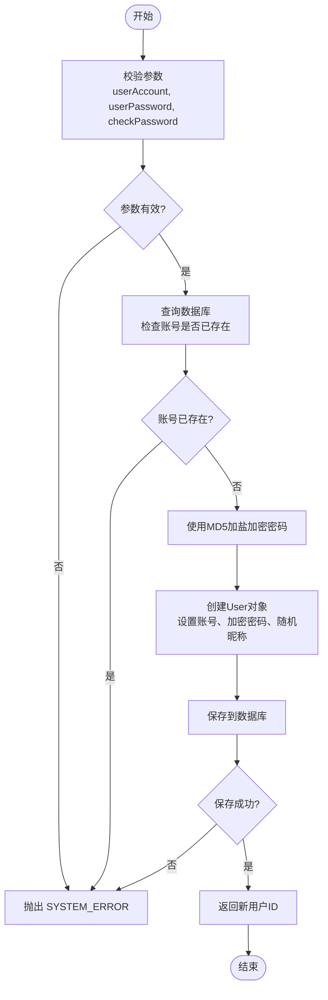
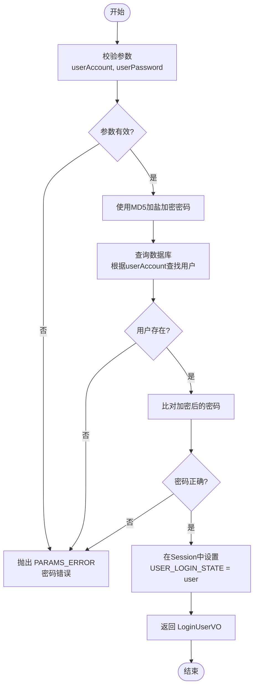
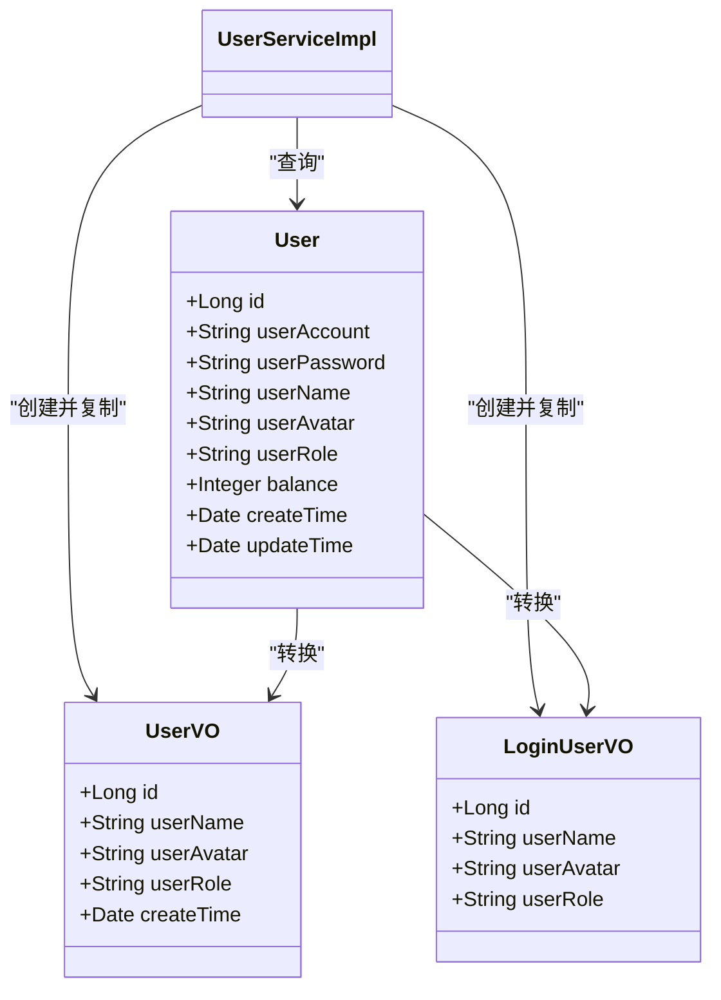

# 用户API

<cite>
**本文档中引用的文件**  
- [UserController.java](file://yun-docker-master/src/main/java/com/lfc/yundocker/controller/UserController.java)
- [UserService.java](file://yun-docker-master/src/main/java/com/lfc/yundocker/service/UserService.java)
- [UserServiceImpl.java](file://yun-docker-master/src/main/java/com/lfc/yundocker/service/impl/UserServiceImpl.java)
- [UserRegisterRequest.java](file://yun-docker-common/src/main/java/com/lfc/yundocker/common/model/dto/user/UserRegisterRequest.java)
- [UserLoginRequest.java](file://yun-docker-common/src/main/java/com/lfc/yundocker/common/model/dto/user/UserLoginRequest.java)
- [UserUpdateMyRequest.java](file://yun-docker-common/src/main/java/com/lfc/yundocker/common/model/dto/user/UserUpdateMyRequest.java)
- [LoginUserVO.java](file://yun-docker-master/src/main/java/com/lfc/yundocker/common/model/vo/LoginUserVO.java)
- [UserVO.java](file://yun-docker-master/src/main/java/com/lfc/yundocker/common/model/vo/UserVO.java)
- [User.java](file://yun-docker-master/src/main/java/com/lfc/yundocker/common/model/entity/User.java)
- [UserConstant.java](file://yun-docker-common/src/main/java/com/lfc/yundocker/common/constant/UserConstant.java)
- [AuthCheck.java](file://yun-docker-master/src/main/java/com/lfc/yundocker/annotation/AuthCheck.java)
- [ErrorCode.java](file://yun-docker-common/src/main/java/com/lfc/yundocker/common/model/enums/ErrorCode.java)
</cite>

## 目录

1. [简介](#简介)
2. [核心接口说明](#核心接口说明)
3. [请求参数结构](#请求参数结构)
4. [响应格式与错误码](#响应格式与错误码)
5. [认证机制](#认证机制)
6. [业务逻辑流程](#业务逻辑流程)
7. [调用示例](#调用示例)
8. [安全限制与分页策略](#安全限制与分页策略)
9. [数据模型转换逻辑](#数据模型转换逻辑)

## 简介

本API文档详细描述了云Docker平台的用户管理功能，涵盖用户注册、登录、注销、个人信息更新及用户信息查询等核心RESTful接口。系统采用基于会话（Session）的身份认证机制，结合角色权限控制，确保接口的安全访问。所有接口均返回统一的`BaseResponse<T>`结构，便于前端解析处理。

**文档来源**
- [UserController.java](file://yun-docker-master/src/main/java/com/lfc/yundocker/controller/UserController.java#L31-L308)
- [UserService.java](file://yun-docker-master/src/main/java/com/lfc/yundocker/service/UserService.java#L17-L123)

## 核心接口说明

### 用户注册
- **HTTP方法**: `POST`
- **请求路径**: `/user/register`
- **功能**: 创建新用户账户。
- **认证要求**: 无需登录。
- **参数**: `UserRegisterRequest` 对象（JSON格式）。

### 用户登录
- **HTTP方法**: `POST`
- **请求路径**: `/user/login`
- **功能**: 验证用户凭据并建立登录会话。
- **认证要求**: 无需登录。
- **参数**: `UserLoginRequest` 对象（JSON格式）。

### 用户注销
- **HTTP方法**: `POST`
- **请求路径**: `/user/logout`
- **功能**: 清除当前用户的登录状态。
- **认证要求**: 必须已登录。
- **参数**: 无请求体，通过会话识别用户。

### 获取当前登录用户
- **HTTP方法**: `GET`
- **请求路径**: `/user/get/login`
- **功能**: 返回当前已登录用户的脱敏信息。
- **认证要求**: 必须已登录。
- **参数**: 无。

### 更新个人信息
- **HTTP方法**: `POST`
- **请求路径**: `/user/update/my`
- **功能**: 允许用户更新自己的昵称和头像。
- **认证要求**: 必须已登录。
- **参数**: `UserUpdateMyRequest` 对象（JSON格式）。

### 分页查询用户（VO）
- **HTTP方法**: `POST`
- **请求路径**: `/user/list/page/vo`
- **功能**: 分页查询用户列表，并返回脱敏的视图对象（VO）。
- **认证要求**: 必须为管理员角色。
- **参数**: `UserQueryRequest` 对象（JSON格式）。

**接口来源**
- [UserController.java](file://yun-docker-master/src/main/java/com/lfc/yundocker/controller/UserController.java#L50-L307)

## 请求参数结构

### UserRegisterRequest
用于用户注册的请求体。

**字段**:
- `userAccount`: 用户账户（字符串，必填，长度≥3）
- `userPassword`: 用户密码（字符串，必填，长度≥6）
- `checkPassword`: 确认密码（字符串，必填，需与`userPassword`一致）

**来源**
- [UserRegisterRequest.java](file://yun-docker-common/src/main/java/com/lfc/yundocker/common/model/dto/user/UserRegisterRequest.java#L13-L22)

### UserLoginRequest
用于用户登录的请求体。

**字段**:
- `userAccount`: 用户账户（字符串，必填）
- `userPassword`: 用户密码（字符串，必填）

**来源**
- [UserLoginRequest.java](file://yun-docker-common/src/main/java/com/lfc/yundocker/common/model/dto/user/UserLoginRequest.java#L13-L20)

### UserUpdateMyRequest
用于用户更新自身信息的请求体。

**字段**:
- `userName`: 用户昵称（字符串，可选）
- `userAvatar`: 用户头像URL（字符串，可选）

**来源**
- [UserUpdateMyRequest.java](file://yun-docker-common/src/main/java/com/lfc/yundocker/common/model/dto/user/UserUpdateMyRequest.java#L13-L26)

## 响应格式与错误码

### 响应格式
所有接口均返回`BaseResponse<T>`泛型对象。

**BaseResponse 结构**:
- `code`: 整数，状态码
- `data`: 泛型T，返回的数据
- `message`: 字符串，描述信息

例如，`user/login`接口返回`BaseResponse<LoginUserVO>`。

### 常见错误码
| 错误码 | 含义 | 说明 |
| :--- | :--- | :--- |
| 200 | ok | 操作成功 |
| 40000 | PARAMS_ERROR | 请求参数错误 | 输入校验失败，如参数为空或格式不符 |
| 40100 | NOT_LOGIN_ERROR | 未登录 | 请求需要登录态但未提供 |
| 40101 | NO_AUTH_ERROR | 无权限 | 用户角色不足，如非管理员访问管理接口 |
| 40400 | NOT_FOUND_ERROR | 请求数据不存在 | 查询的资源未找到 |
| 50000 | SYSTEM_ERROR | 系统内部异常 | 服务器端发生未预期的错误 |
| 50001 | OPERATION_ERROR | 操作失败 | 业务操作未能完成，如数据库更新失败 |

**来源**
- [ErrorCode.java](file://yun-docker-common/src/main/java/com/lfc/yundocker/common/model/enums/ErrorCode.java#L8-L23)

## 认证机制

系统使用`@AuthCheck`注解进行权限校验。

### AuthCheck 注解
该注解作用于控制器方法，用于声明访问该接口所需的最小角色。

**属性**:
- `mustRole`: 字符串，指定必须的角色，如`"admin"`。

**实现逻辑**:
1.  通过`AuthInterceptor`拦截器检查带有`@AuthCheck`注解的方法。
2.  从`HttpServletRequest`的Session中获取`USER_LOGIN_STATE`属性，即当前登录的`User`对象。
3.  调用`UserService.isAdmin()`方法，检查用户角色是否匹配`mustRole`。
4.  若不匹配，则抛出`NO_AUTH_ERROR`异常。

**来源**
- [AuthCheck.java](file://yun-docker-master/src/main/java/com/lfc/yundocker/annotation/AuthCheck.java#L16-L28)
- [UserController.java](file://yun-docker-master/src/main/java/com/lfc/yundocker/controller/UserController.java#L148-L149)

## 业务逻辑流程

### 用户注册流程


**流程来源**
- [UserServiceImpl.java](file://yun-docker-master/src/main/java/com/lfc/yundocker/service/impl/UserServiceImpl.java#L48-L87)

### 用户登录流程


**流程来源**
- [UserServiceImpl.java](file://yun-docker-master/src/main/java/com/lfc/yundocker/service/impl/UserServiceImpl.java#L106-L136)

## 调用示例

### curl 示例

**用户注册**
```bash
curl -X POST http://localhost:8080/user/register \
  -H "Content-Type: application/json" \
  -d '{
    "userAccount": "newuser",
    "userPassword": "password123",
    "checkPassword": "password123"
  }'
```

**用户登录**
```bash
curl -X POST http://localhost:8080/user/login \
  -H "Content-Type: application/json" \
  -d '{
    "userAccount": "newuser",
    "userPassword": "password123"
  }'
```

**更新个人信息**
```bash
curl -X POST http://localhost:8080/user/update/my \
  -H "Content-Type: application/json" \
  -H "Cookie: JSESSIONID=xxx" \
  -d '{
    "userName": "New Nickname"
  }'
```

### Java 调用代码片段

```java
// 假设使用Spring RestTemplate
RestTemplate restTemplate = new RestTemplate();

// 构造登录请求
UserLoginRequest loginRequest = new UserLoginRequest();
loginRequest.setUserAccount("testuser");
loginRequest.setUserPassword("password");

// 发送请求
BaseResponse<LoginUserVO> response = restTemplate.postForObject(
    "http://localhost:8080/user/login", 
    loginRequest, 
    BaseResponse.class
);

if (response.getCode() == 200) {
    LoginUserVO userVO = response.getData();
    System.out.println("登录成功，用户ID: " + userVO.getId());
} else {
    System.err.println("登录失败: " + response.getMessage());
}
```

## 安全限制与分页策略

### 分页查询安全限制
`/user/list/page/vo` 接口有严格的安全限制：

1.  **权限控制**: 必须由管理员（`admin`角色）调用，通过`@AuthCheck(mustRole = UserConstant.ADMIN_ROLE)`实现。
2.  **分页大小限制**: 单页最大返回20条记录。在`UserController.listUserVOByPage`方法中，通过`ThrowUtils.throwIf(size > 20, ErrorCode.PARAMS_ERROR)`进行校验，防止恶意爬虫或性能攻击。

### 最大页大小校验代码
```java
// UserController.java
long size = userQueryRequest.getPageSize();
// 限制爬虫
ThrowUtils.throwIf(size > 20, ErrorCode.PARAMS_ERROR);
```

**来源**
- [UserController.java](file://yun-docker-master/src/main/java/com/lfc/yundocker/controller/UserController.java#L276-L277)

## 数据模型转换逻辑

系统使用了分层的数据模型，以实现数据脱敏和关注点分离。

### 核心模型
- `User`: 实体类（Entity），直接映射数据库表，包含所有字段，如`userPassword`。
- `UserVO`: 视图对象（View Object），用于对外展示用户列表，不包含敏感信息。
- `LoginUserVO`: 登录用户视图对象，用于返回登录成功后的用户信息，同样不包含敏感信息。

### 转换逻辑
转换由`UserService`接口中的`getUserVO()`和`getLoginUserVO()`方法完成，具体实现在`UserServiceImpl`中。

**转换过程**:
1.  使用`BeanUtils.copyProperties(source, target)`将`User`对象的公共属性复制到`UserVO`或`LoginUserVO`对象。
2.  由于`UserVO`和`LoginUserVO`不包含`userPassword`等敏感字段，因此这些字段不会被复制，实现了自动脱敏。



**模型来源**
- [User.java](file://yun-docker-master/src/main/java/com/lfc/yundocker/common/model/entity/User.java)
- [UserVO.java](file://yun-docker-master/src/main/java/com/lfc/yundocker/common/model/vo/UserVO.java)
- [LoginUserVO.java](file://yun-docker-master/src/main/java/com/lfc/yundocker/common/model/vo/LoginUserVO.java)
- [UserServiceImpl.java](file://yun-docker-master/src/main/java/com/lfc/yundocker/service/impl/UserServiceImpl.java#L248-L273)