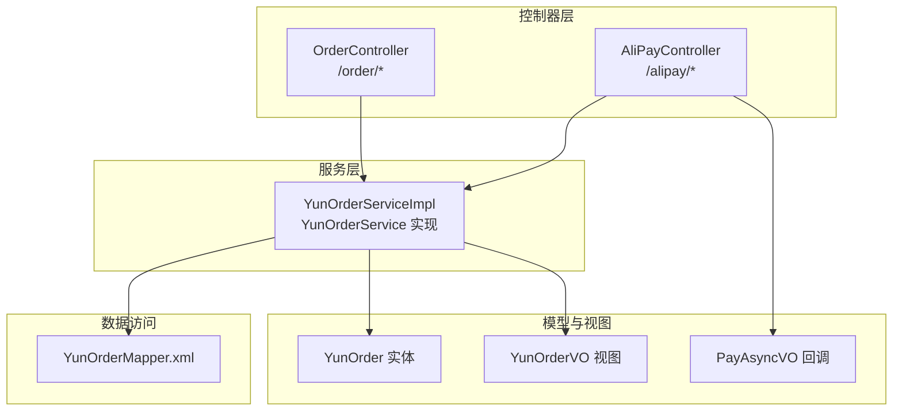
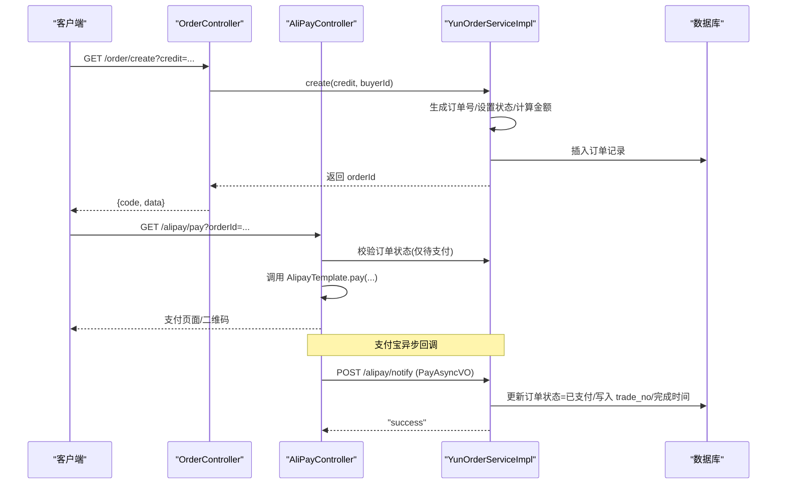
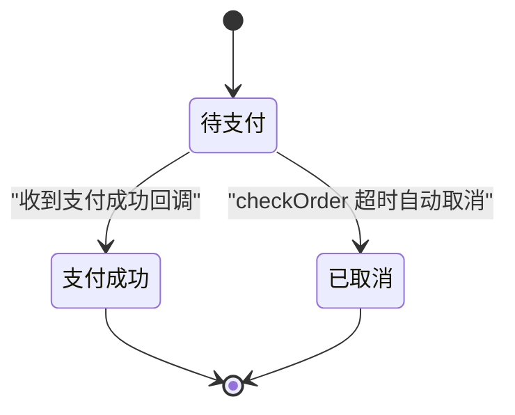
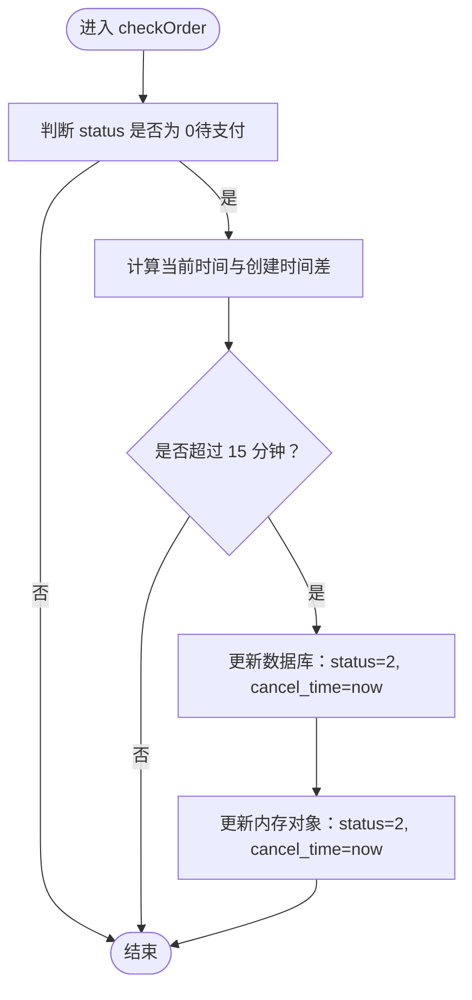
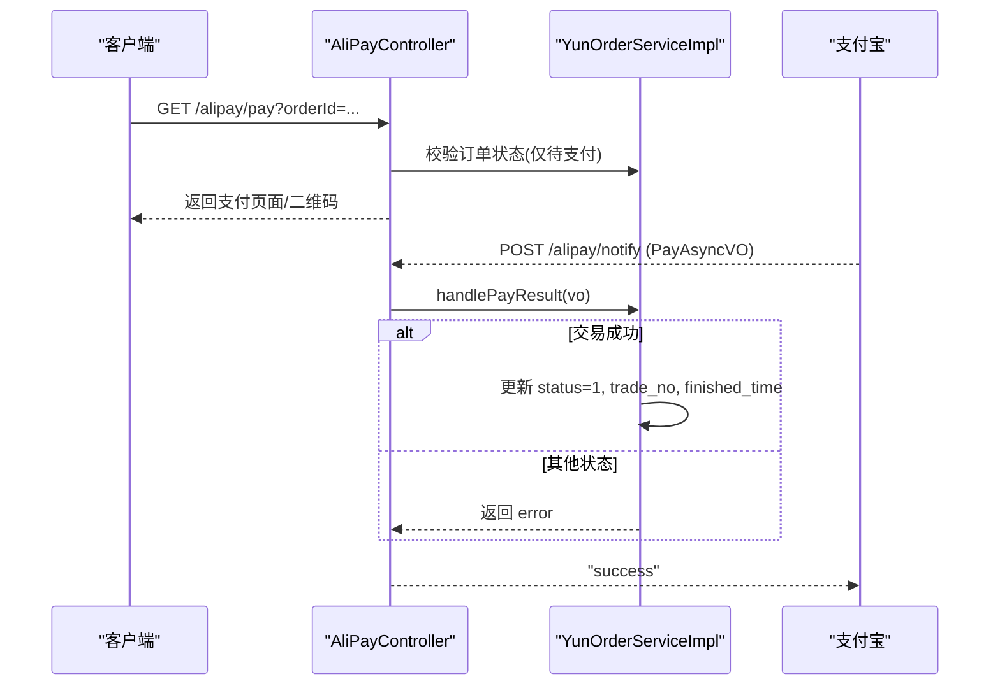
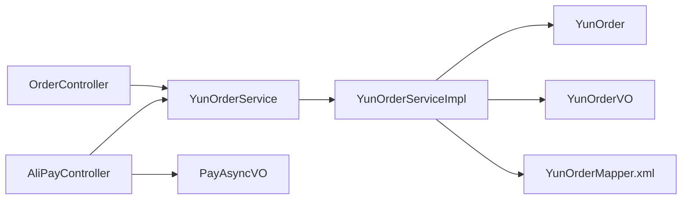

# 订单API

<cite>
**本文引用的文件**
- [OrderController.java](file://yun-docker-master/src/main/java/com/lfc/yundocker/controller/OrderController.java)
- [AliPayController.java](file://yun-docker-master/src/main/java/com/lfc/yundocker/controller/AliPayController.java)
- [YunOrderService.java](file://yun-docker-master/src/main/java/com/lfc/yundocker/service/YunOrderService.java)
- [YunOrderServiceImpl.java](file://yun-docker-master/src/main/java/com/lfc/yundocker/service/impl/YunOrderServiceImpl.java)
- [YunOrder.java](file://yun-docker-master/src/main/java/com/lfc/yundocker/common/model/entity/YunOrder.java)
- [YunOrderVO.java](file://yun-docker-master/src/main/java/com/lfc/yundocker/common/model/vo/YunOrderVO.java)
- [PayAsyncVO.java](file://yun-docker-master/src/main/java/com/lfc/yundocker/common/model/vo/PayAsyncVO.java)
- [YunOrderMapper.xml](file://yun-docker-master/src/main/resources/mapper/YunOrderMapper.xml)
- [application.yml](file://yun-docker-master/src/main/resources/application.yml)
- [ErrorCode.java](file://yun-docker-common/src/main/java/com/lfc/yundocker/common/model/enums/ErrorCode.java)
</cite>

## 目录
1. [简介](#简介)
2. [项目结构](#项目结构)
3. [核心组件](#核心组件)
4. [架构总览](#架构总览)
5. [详细组件分析](#详细组件分析)
6. [依赖关系分析](#依赖关系分析)
7. [性能考虑](#性能考虑)
8. [故障排查指南](#故障排查指南)
9. [结论](#结论)
10. [附录](#附录)

## 简介
本文件系统化梳理“订单管理”RESTful API，覆盖以下接口：
- 创建订单：/order/create
- 查询订单列表（分页）：/order/list/page
- 查看订单详情：/order/detail
- 取消订单：/order/cancel

重点说明：
- create 接口的 credit 参数规则与金额计算
- 订单号生成机制
- detail 接口的订单状态校验流程（checkOrder）
- YunOrderVO 视图对象的转换逻辑与字段含义
- 支付宝支付前的订单准备流程与金额/积分换算关系
- 基于 YunOrderService 的订单状态机（待支付、已支付、已取消）管理策略

## 项目结构
围绕订单模块的关键文件组织如下：
- 控制器层：OrderController、AliPayController
- 服务层：YunOrderService 接口及其实现类 YunOrderServiceImpl
- 数据模型：YunOrder 实体类
- 视图对象：YunOrderVO
- 支付回调视图：PayAsyncVO
- 数据映射：YunOrderMapper.xml
- 应用配置：application.yml
- 错误码：ErrorCode

图表来源
- [OrderController.java](file://yun-docker-master/src/main/java/com/lfc/yundocker/controller/OrderController.java#L1-L121)
- [AliPayController.java](file://yun-docker-master/src/main/java/com/lfc/yundocker/controller/AliPayController.java#L1-L113)
- [YunOrderService.java](file://yun-docker-master/src/main/java/com/lfc/yundocker/service/YunOrderService.java#L1-L27)
- [YunOrderServiceImpl.java](file://yun-docker-master/src/main/java/com/lfc/yundocker/service/impl/YunOrderServiceImpl.java#L1-L118)
- [YunOrder.java](file://yun-docker-master/src/main/java/com/lfc/yundocker/common/model/entity/YunOrder.java#L1-L77)
- [YunOrderVO.java](file://yun-docker-master/src/main/java/com/lfc/yundocker/common/model/vo/YunOrderVO.java#L1-L99)
- [PayAsyncVO.java](file://yun-docker-master/src/main/java/com/lfc/yundocker/common/model/vo/PayAsyncVO.java#L1-L39)
- [YunOrderMapper.xml](file://yun-docker-master/src/main/resources/mapper/YunOrderMapper.xml#L1-L26)

章节来源
- [OrderController.java](file://yun-docker-master/src/main/java/com/lfc/yundocker/controller/OrderController.java#L1-L121)
- [AliPayController.java](file://yun-docker-master/src/main/java/com/lfc/yundocker/controller/AliPayController.java#L1-L113)
- [YunOrderService.java](file://yun-docker-master/src/main/java/com/lfc/yundocker/service/YunOrderService.java#L1-L27)
- [YunOrderServiceImpl.java](file://yun-docker-master/src/main/java/com/lfc/yundocker/service/impl/YunOrderServiceImpl.java#L1-L118)
- [YunOrder.java](file://yun-docker-master/src/main/java/com/lfc/yundocker/common/model/entity/YunOrder.java#L1-L77)
- [YunOrderVO.java](file://yun-docker-master/src/main/java/com/lfc/yundocker/common/model/vo/YunOrderVO.java#L1-L99)
- [PayAsyncVO.java](file://yun-docker-master/src/main/java/com/lfc/yundocker/common/model/vo/PayAsyncVO.java#L1-L39)
- [YunOrderMapper.xml](file://yun-docker-master/src/main/resources/mapper/YunOrderMapper.xml#L1-L26)
- [application.yml](file://yun-docker-master/src/main/resources/application.yml#L1-L60)

## 核心组件
- OrderController：提供订单的创建、列表分页、详情查询、取消等接口入口
- AliPayController：负责支付宝支付发起与异步回调处理
- YunOrderService/YunOrderServiceImpl：订单业务逻辑的核心实现，包含订单状态校验、订单号生成、金额计算、支付结果处理等
- YunOrder：订单持久化实体，包含订单号、买家ID、积分、金额、状态、时间戳等字段
- YunOrderVO：订单视图对象，用于对外返回，包含前端展示字段（如 frontMoney、frontStatus）
- PayAsyncVO：支付宝异步回调参数封装
- YunOrderMapper.xml：MyBatis 映射，定义实体与数据库列的映射关系

章节来源
- [OrderController.java](file://yun-docker-master/src/main/java/com/lfc/yundocker/controller/OrderController.java#L1-L121)
- [AliPayController.java](file://yun-docker-master/src/main/java/com/lfc/yundocker/controller/AliPayController.java#L1-L113)
- [YunOrderService.java](file://yun-docker-master/src/main/java/com/lfc/yundocker/service/YunOrderService.java#L1-L27)
- [YunOrderServiceImpl.java](file://yun-docker-master/src/main/java/com/lfc/yundocker/service/impl/YunOrderServiceImpl.java#L1-L118)
- [YunOrder.java](file://yun-docker-master/src/main/java/com/lfc/yundocker/common/model/entity/YunOrder.java#L1-L77)
- [YunOrderVO.java](file://yun-docker-master/src/main/java/com/lfc/yundocker/common/model/vo/YunOrderVO.java#L1-L99)
- [PayAsyncVO.java](file://yun-docker-master/src/main/java/com/lfc/yundocker/common/model/vo/PayAsyncVO.java#L1-L39)
- [YunOrderMapper.xml](file://yun-docker-master/src/main/resources/mapper/YunOrderMapper.xml#L1-L26)

## 架构总览
订单相关接口在控制器层统一暴露，服务层承担业务规则与状态机管理，数据层通过 MyBatis 映射持久化。

图表来源
- [OrderController.java](file://yun-docker-master/src/main/java/com/lfc/yundocker/controller/OrderController.java#L63-L76)
- [AliPayController.java](file://yun-docker-master/src/main/java/com/lfc/yundocker/controller/AliPayController.java#L43-L65)
- [YunOrderServiceImpl.java](file://yun-docker-master/src/main/java/com/lfc/yundocker/service/impl/YunOrderServiceImpl.java#L47-L81)
- [YunOrderMapper.xml](file://yun-docker-master/src/main/resources/mapper/YunOrderMapper.xml#L1-L26)

## 详细组件分析

### 订单接口定义与控制流
- /order/create
  - 请求方式：GET
  - 参数：credit（正整数）
  - 行为：校验 credit 合法性，生成订单号，设置初始状态为“待支付”，计算金额为 credit × 0.01 元，保存后返回 orderId
- /order/list/page
  - 请求方式：POST，Body 为分页参数
  - 行为：按当前登录用户过滤订单，限制每页最大条数，返回 YunOrderVO 分页
- /order/detail
  - 请求方式：GET
  - 参数：orderId
  - 行为：查询订单，执行 checkOrder 校验（若超时未支付则自动取消），再转换为 YunOrderVO 返回
- /order/cancel
  - 请求方式：GET
  - 参数：orderId
  - 行为：按用户与订单号查询，若存在则将状态更新为“已取消”

章节来源
- [OrderController.java](file://yun-docker-master/src/main/java/com/lfc/yundocker/controller/OrderController.java#L40-L118)

### 订单状态机与管理策略
订单状态枚举（数据库字段 status）：
- 0：待支付
- 1：支付成功
- 2：已取消
- 3：支付失败

状态转换策略（基于 YunOrderServiceImpl）：
- 创建订单：status=0
- 支付成功回调：status=1，写入 trade_no 与 finished_time
- 详情查询时的自动取消：若 status=0 且创建时间距当前超过 15 分钟，则更新为 status=2 并写入 cancel_time

图表来源
- [YunOrderServiceImpl.java](file://yun-docker-master/src/main/java/com/lfc/yundocker/service/impl/YunOrderServiceImpl.java#L47-L104)
- [YunOrder.java](file://yun-docker-master/src/main/java/com/lfc/yundocker/common/model/entity/YunOrder.java#L46-L50)

章节来源
- [YunOrderServiceImpl.java](file://yun-docker-master/src/main/java/com/lfc/yundocker/service/impl/YunOrderServiceImpl.java#L47-L104)
- [YunOrder.java](file://yun-docker-master/src/main/java/com/lfc/yundocker/common/model/entity/YunOrder.java#L46-L50)

### create 接口：credit 参数规则与金额计算
- 参数规则
  - credit 必填且必须大于 0；否则抛出参数错误
- 金额计算
  - money = credit × 0.01 元
- 订单号生成
  - 使用雪花算法生成全局唯一 orderId
  - 初始状态 status=0
- 保存与返回
  - 保存订单后返回 orderId

章节来源
- [OrderController.java](file://yun-docker-master/src/main/java/com/lfc/yundocker/controller/OrderController.java#L63-L76)
- [YunOrderServiceImpl.java](file://yun-docker-master/src/main/java/com/lfc/yundocker/service/impl/YunOrderServiceImpl.java#L47-L62)
- [YunOrder.java](file://yun-docker-master/src/main/java/com/lfc/yundocker/common/model/entity/YunOrder.java#L36-L44)

### detail 接口：订单状态校验流程（checkOrder）
- 流程说明
  - 若订单状态为“待支付”，检查创建时间是否超过 15 分钟
  - 超时则自动更新为“已取消”，并写入取消时间
- 触发时机
  - 分页列表转换为 VO 时会调用 checkOrder
  - 详情接口也会调用 checkOrder 再返回

图表来源
- [YunOrderServiceImpl.java](file://yun-docker-master/src/main/java/com/lfc/yundocker/service/impl/YunOrderServiceImpl.java#L83-L104)

章节来源
- [OrderController.java](file://yun-docker-master/src/main/java/com/lfc/yundocker/controller/OrderController.java#L79-L94)
- [YunOrderServiceImpl.java](file://yun-docker-master/src/main/java/com/lfc/yundocker/service/impl/YunOrderServiceImpl.java#L28-L45)
- [YunOrderServiceImpl.java](file://yun-docker-master/src/main/java/com/lfc/yundocker/service/impl/YunOrderServiceImpl.java#L83-L104)

### YunOrderVO 视图对象转换逻辑与字段含义
- 转换逻辑
  - 通过 BeanUtils 将 YunOrder 复制到 YunOrderVO
  - 提供 setMoney 与 setStatus 方法，用于生成前端展示字段：
    - frontMoney：将 money 四舍五入保留两位小数
    - frontStatus：根据 status 数值映射为中文状态文案
- 字段含义（节选）
  - buyerId：买家用户ID
  - orderId：订单号
  - credit：充值积分数量
  - money：支付金额（元）
  - frontMoney：前端展示金额字符串
  - status：订单状态（0/1/2/3）
  - frontStatus：前端展示状态字符串
  - tradeNo：支付宝交易号
  - createTime/finishedTime/cancelTime：创建/完成/取消时间

章节来源
- [YunOrderVO.java](file://yun-docker-master/src/main/java/com/lfc/yundocker/common/model/vo/YunOrderVO.java#L1-L99)
- [YunOrder.java](file://yun-docker-master/src/main/java/com/lfc/yundocker/common/model/entity/YunOrder.java#L1-L77)

### 支付宝支付前的订单准备流程
- 发起支付
  - 调用 /alipay/pay?orderId=...，需登录态
  - 校验：订单存在且 buyer_id 与当前用户一致，且状态为“待支付”
  - 成功后由 AlipayTemplate 生成支付参数并返回支付页面/二维码
- 异步回调
  - 支付宝 POST /alipay/notify，携带 PayAsyncVO
  - 服务端解析并调用 orderService.handlePayResult
  - 当 trade_status 为“TRADE_SUCCESS/TRADE_FINISHED”时，更新订单状态为“支付成功”，写入 trade_no 与 finished_time

图表来源
- [AliPayController.java](file://yun-docker-master/src/main/java/com/lfc/yundocker/controller/AliPayController.java#L43-L65)
- [AliPayController.java](file://yun-docker-master/src/main/java/com/lfc/yundocker/controller/AliPayController.java#L74-L99)
- [YunOrderServiceImpl.java](file://yun-docker-master/src/main/java/com/lfc/yundocker/service/impl/YunOrderServiceImpl.java#L70-L81)

章节来源
- [AliPayController.java](file://yun-docker-master/src/main/java/com/lfc/yundocker/controller/AliPayController.java#L43-L65)
- [AliPayController.java](file://yun-docker-master/src/main/java/com/lfc/yundocker/controller/AliPayController.java#L74-L99)
- [YunOrderServiceImpl.java](file://yun-docker-master/src/main/java/com/lfc/yundocker/service/impl/YunOrderServiceImpl.java#L70-L81)
- [PayAsyncVO.java](file://yun-docker-master/src/main/java/com/lfc/yundocker/common/model/vo/PayAsyncVO.java#L1-L39)

### 订单号生成机制
- 使用雪花算法生成全局唯一 orderId
- 代码路径参考：YunOrderServiceImpl.create 中的订单号生成逻辑

章节来源
- [YunOrderServiceImpl.java](file://yun-docker-master/src/main/java/com/lfc/yundocker/service/impl/YunOrderServiceImpl.java#L47-L62)

### 数据库映射与字段对应
- YunOrderMapper.xml 定义了实体字段与数据库列的映射关系，确保 status、money、trade_no、时间戳等字段正确持久化

章节来源
- [YunOrderMapper.xml](file://yun-docker-master/src/main/resources/mapper/YunOrderMapper.xml#L1-L26)
- [YunOrder.java](file://yun-docker-master/src/main/java/com/lfc/yundocker/common/model/entity/YunOrder.java#L1-L77)

## 依赖关系分析
- 控制器依赖服务层接口
- 服务层依赖实体、VO、回调视图与数据映射
- 支付回调通过 AliPayController 进入服务层处理

图表来源
- [OrderController.java](file://yun-docker-master/src/main/java/com/lfc/yundocker/controller/OrderController.java#L1-L121)
- [AliPayController.java](file://yun-docker-master/src/main/java/com/lfc/yundocker/controller/AliPayController.java#L1-L113)
- [YunOrderService.java](file://yun-docker-master/src/main/java/com/lfc/yundocker/service/YunOrderService.java#L1-L27)
- [YunOrderServiceImpl.java](file://yun-docker-master/src/main/java/com/lfc/yundocker/service/impl/YunOrderServiceImpl.java#L1-L118)
- [YunOrder.java](file://yun-docker-master/src/main/java/com/lfc/yundocker/common/model/entity/YunOrder.java#L1-L77)
- [YunOrderVO.java](file://yun-docker-master/src/main/java/com/lfc/yundocker/common/model/vo/YunOrderVO.java#L1-L99)
- [PayAsyncVO.java](file://yun-docker-master/src/main/java/com/lfc/yundocker/common/model/vo/PayAsyncVO.java#L1-L39)
- [YunOrderMapper.xml](file://yun-docker-master/src/main/resources/mapper/YunOrderMapper.xml#L1-L26)

章节来源
- [OrderController.java](file://yun-docker-master/src/main/java/com/lfc/yundocker/controller/OrderController.java#L1-L121)
- [AliPayController.java](file://yun-docker-master/src/main/java/com/lfc/yundocker/controller/AliPayController.java#L1-L113)
- [YunOrderService.java](file://yun-docker-master/src/main/java/com/lfc/yundocker/service/YunOrderService.java#L1-L27)
- [YunOrderServiceImpl.java](file://yun-docker-master/src/main/java/com/lfc/yundocker/service/impl/YunOrderServiceImpl.java#L1-L118)
- [YunOrder.java](file://yun-docker-master/src/main/java/com/lfc/yundocker/common/model/entity/YunOrder.java#L1-L77)
- [YunOrderVO.java](file://yun-docker-master/src/main/java/com/lfc/yundocker/common/model/vo/YunOrderVO.java#L1-L99)
- [PayAsyncVO.java](file://yun-docker-master/src/main/java/com/lfc/yundocker/common/model/vo/PayAsyncVO.java#L1-L39)
- [YunOrderMapper.xml](file://yun-docker-master/src/main/resources/mapper/YunOrderMapper.xml#L1-L26)

## 性能考虑
- 分页查询限制每页最大条数，避免高并发下的资源消耗
- checkOrder 在详情与分页 VO 转换时执行，避免长时间未支付订单占用资源
- 支付回调仅在交易成功时更新状态，减少无效写入

章节来源
- [OrderController.java](file://yun-docker-master/src/main/java/com/lfc/yundocker/controller/OrderController.java#L40-L61)
- [YunOrderServiceImpl.java](file://yun-docker-master/src/main/java/com/lfc/yundocker/service/impl/YunOrderServiceImpl.java#L83-L104)

## 故障排查指南
- 参数错误
  - /order/create 缺少或非法 credit
  - /order/detail 或 /order/cancel 缺少或空 orderId
  - /alipay/pay 缺少或空 orderId
  - 对应错误码：PARAMS_ERROR
- 订单不存在
  - 查询不到订单或非本人订单
  - 对应错误码：NOT_FOUND_ERROR
- 订单状态异常
  - 支付时订单状态非“待支付”
  - 对应错误码：ORDER_STATUS_ERROR
- 支付回调处理
  - 回调参数解析与验签（代码中保留了验签逻辑，当前直接透传处理）
  - 仅当 trade_status 为“TRADE_SUCCESS/TRADE_FINISHED”时更新为“支付成功”

章节来源
- [OrderController.java](file://yun-docker-master/src/main/java/com/lfc/yundocker/controller/OrderController.java#L40-L118)
- [AliPayController.java](file://yun-docker-master/src/main/java/com/lfc/yundocker/controller/AliPayController.java#L43-L65)
- [AliPayController.java](file://yun-docker-master/src/main/java/com/lfc/yundocker/controller/AliPayController.java#L74-L99)
- [ErrorCode.java](file://yun-docker-common/src/main/java/com/lfc/yundocker/common/model/enums/ErrorCode.java#L1-L49)

## 结论
该订单模块以清晰的分层设计实现了从订单创建、支付、状态管理到视图输出的完整闭环。通过严格的参数校验、状态机管理与自动超时取消机制，保障了订单流程的可靠性与一致性。YunOrderVO 的前端友好字段增强了展示体验，而支付宝回调的幂等处理与状态更新保证了支付结果的准确落地。

## 附录
- 接口上下文路径
  - 应用上下文为 /api，订单相关接口前缀为 /api/order、/api/alipay
- 关键字段说明
  - status：0 待支付，1 支付成功，2 已取消，3 支付失败
  - money：单位元，credit 与 money 的换算关系为 money = credit × 0.01

章节来源
- [application.yml](file://yun-docker-master/src/main/resources/application.yml#L34-L39)
- [YunOrderServiceImpl.java](file://yun-docker-master/src/main/java/com/lfc/yundocker/service/impl/YunOrderServiceImpl.java#L47-L62)
- [YunOrder.java](file://yun-docker-master/src/main/java/com/lfc/yundocker/common/model/entity/YunOrder.java#L46-L50)