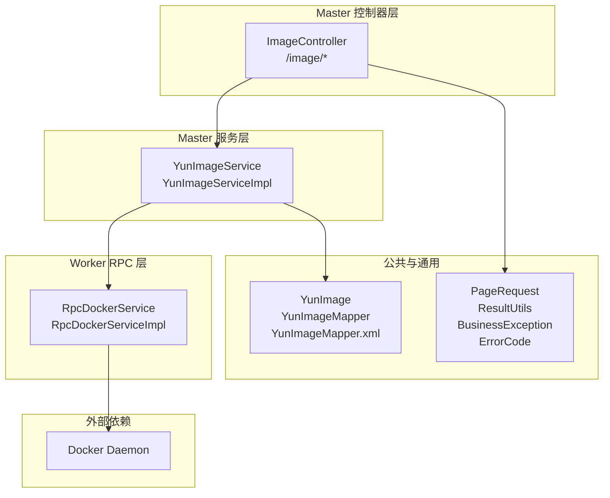
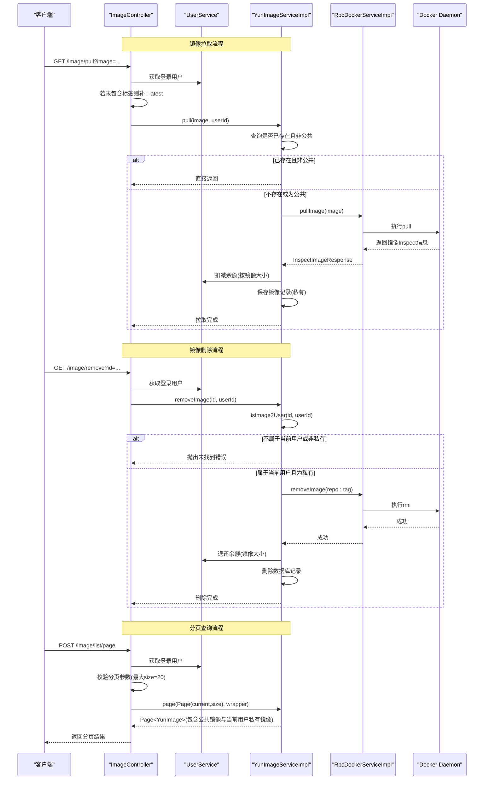
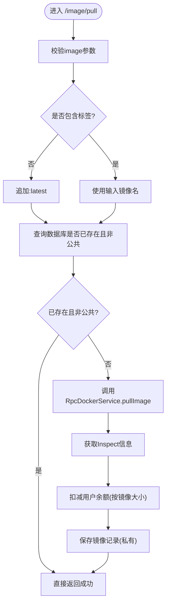
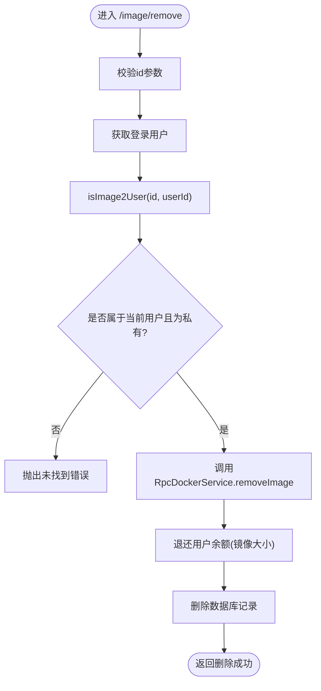
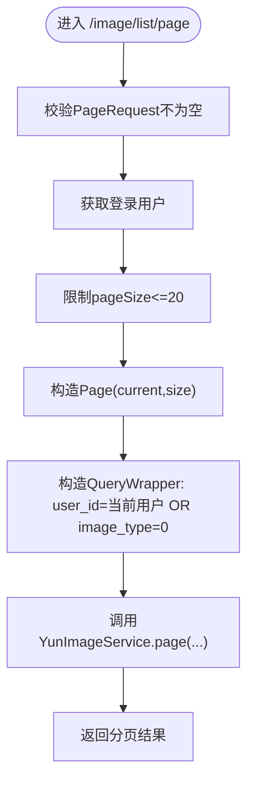
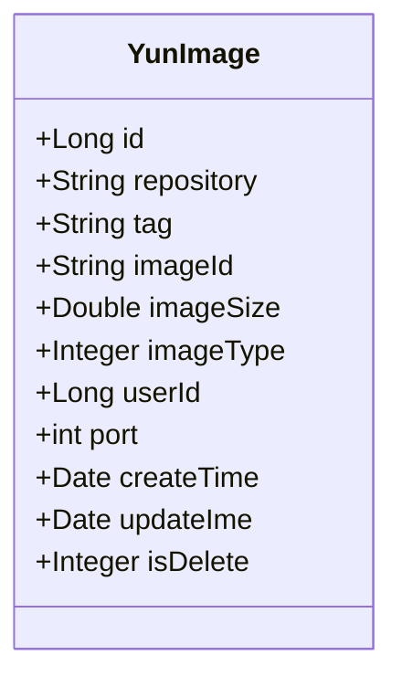
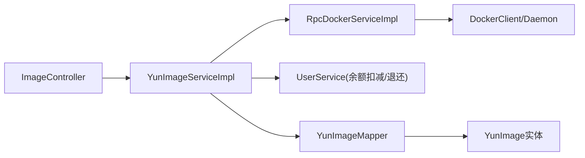

# 镜像API

<cite>
**本文引用的文件**
- [ImageController.java](file://yun-docker-master/src/main/java/com/lfc/yundocker/controller/ImageController.java)
- [YunImageService.java](file://yun-docker-master/src/main/java/com/lfc/yundocker/service/YunImageService.java)
- [YunImageServiceImpl.java](file://yun-docker-master/src/main/java/com/lfc/yundocker/service/impl/YunImageServiceImpl.java)
- [YunImage.java](file://yun-docker-master/src/main/java/com/lfc/yundocker/common/model/entity/YunImage.java)
- [YunImageMapper.java](file://yun-docker-master/src/main/java/com/lfc/yundocker/mapper/YunImageMapper.java)
- [YunImageMapper.xml](file://yun-docker-master/src/main/resources/mapper/YunImageMapper.xml)
- [RpcDockerService.java](file://yun-docker-api/src/main/java/com/lfc/yundocker/service/RpcDockerService.java)
- [RpcDockerServiceImpl.java](file://yun-docker-worker/src/main/java/com/lfc/yundocker/worker/rpc/RpcDockerServiceImpl.java)
- [PageRequest.java](file://yun-docker-common/src/main/java/com/lfc/yundocker/common/model/dto/PageRequest.java)
- [ResultUtils.java](file://yun-docker-common/src/main/java/com/lfc/yundocker/common/util/ResultUtils.java)
- [BusinessException.java](file://yun-docker-common/src/main/java/com/lfc/yundocker/common/exception/BusinessException.java)
- [ErrorCode.java](file://yun-docker-common/src/main/java/com/lfc/yundocker/common/model/enums/ErrorCode.java)
- [application.yml](file://yun-docker-master/src/main/resources/application.yml)
</cite>

## 目录
1. [简介](#简介)
2. [项目结构](#项目结构)
3. [核心组件](#核心组件)
4. [架构总览](#架构总览)
5. [详细组件分析](#详细组件分析)
6. [依赖关系分析](#依赖关系分析)
7. [性能与并发特性](#性能与并发特性)
8. [故障排查指南](#故障排查指南)
9. [结论](#结论)
10. [附录](#附录)

## 简介
本文件面向镜像管理API的使用者与维护者，系统化梳理以下三类接口：
- 镜像拉取：/image/pull
- 镜像删除：/image/remove
- 镜像分页查询：/image/list/page

重点说明：
- /pull接口的镜像参数格式与自动补全规则（未包含标签时自动追加:latest）
- /remove接口的权限校验逻辑（仅允许删除当前用户私有镜像）
- 分页接口的公共参数规范与安全限制
- YunImage实体关键字段（如imageType=0表示公共镜像）及其在查询中的应用
- 与Docker Daemon的交互流程（通过RpcDockerService与Worker侧实现）

## 项目结构
镜像API位于master模块的控制器层，服务层负责业务编排，Worker侧通过Dubbo对接Docker Daemon，实体与映射文件定义数据模型与持久化。

图表来源
- [ImageController.java](file://yun-docker-master/src/main/java/com/lfc/yundocker/controller/ImageController.java#L1-L116)
- [YunImageService.java](file://yun-docker-master/src/main/java/com/lfc/yundocker/service/YunImageService.java#L1-L19)
- [YunImageServiceImpl.java](file://yun-docker-master/src/main/java/com/lfc/yundocker/service/impl/YunImageServiceImpl.java#L1-L145)
- [YunImage.java](file://yun-docker-master/src/main/java/com/lfc/yundocker/common/model/entity/YunImage.java#L1-L79)
- [YunImageMapper.java](file://yun-docker-master/src/main/java/com/lfc/yundocker/mapper/YunImageMapper.java#L1-L19)
- [YunImageMapper.xml](file://yun-docker-master/src/main/resources/mapper/YunImageMapper.xml#L1-L25)
- [RpcDockerService.java](file://yun-docker-api/src/main/java/com/lfc/yundocker/service/RpcDockerService.java#L1-L143)
- [RpcDockerServiceImpl.java](file://yun-docker-worker/src/main/java/com/lfc/yundocker/worker/rpc/RpcDockerServiceImpl.java#L1-L440)
- [PageRequest.java](file://yun-docker-common/src/main/java/com/lfc/yundocker/common/model/dto/PageRequest.java#L1-L34)
- [ResultUtils.java](file://yun-docker-common/src/main/java/com/lfc/yundocker/common/util/ResultUtils.java#L1-L56)
- [BusinessException.java](file://yun-docker-common/src/main/java/com/lfc/yundocker/common/exception/BusinessException.java#L1-L37)
- [ErrorCode.java](file://yun-docker-common/src/main/java/com/lfc/yundocker/common/model/enums/ErrorCode.java#L1-L49)

章节来源
- [ImageController.java](file://yun-docker-master/src/main/java/com/lfc/yundocker/controller/ImageController.java#L1-L116)
- [application.yml](file://yun-docker-master/src/main/resources/application.yml#L1-L60)

## 核心组件
- ImageController：提供镜像拉取、删除、分页查询的REST接口，负责参数校验、鉴权与结果封装。
- YunImageService/YunImageServiceImpl：镜像业务编排，包括拉取、删除、权限校验、余额扣减与镜像入库。
- RpcDockerService/RpcDockerServiceImpl：与Docker Daemon交互，执行pull、rmi等命令。
- YunImage实体与映射：描述镜像元数据，含仓库名、标签、镜像ID、大小、类型、所属用户等。
- PageRequest：分页请求公共参数。
- ResultUtils/BusinessException/ErrorCode：统一响应与错误码体系。

章节来源
- [YunImageService.java](file://yun-docker-master/src/main/java/com/lfc/yundocker/service/YunImageService.java#L1-L19)
- [YunImageServiceImpl.java](file://yun-docker-master/src/main/java/com/lfc/yundocker/service/impl/YunImageServiceImpl.java#L1-L145)
- [RpcDockerService.java](file://yun-docker-api/src/main/java/com/lfc/yundocker/service/RpcDockerService.java#L1-L143)
- [RpcDockerServiceImpl.java](file://yun-docker-worker/src/main/java/com/lfc/yundocker/worker/rpc/RpcDockerServiceImpl.java#L1-L440)
- [YunImage.java](file://yun-docker-master/src/main/java/com/lfc/yundocker/common/model/entity/YunImage.java#L1-L79)
- [YunImageMapper.xml](file://yun-docker-master/src/main/resources/mapper/YunImageMapper.xml#L1-L25)
- [PageRequest.java](file://yun-docker-common/src/main/java/com/lfc/yundocker/common/model/dto/PageRequest.java#L1-L34)
- [ResultUtils.java](file://yun-docker-common/src/main/java/com/lfc/yundocker/common/util/ResultUtils.java#L1-L56)
- [BusinessException.java](file://yun-docker-common/src/main/java/com/lfc/yundocker/common/exception/BusinessException.java#L1-L37)
- [ErrorCode.java](file://yun-docker-common/src/main/java/com/lfc/yundocker/common/model/enums/ErrorCode.java#L1-L49)

## 架构总览
镜像API采用典型的三层架构：控制层接收请求并鉴权，服务层编排业务逻辑，RPC层对接Docker Daemon。分页查询通过MyBatis-Plus实现，查询条件包含“当前用户私有镜像”和“公共镜像”。

图表来源
- [ImageController.java](file://yun-docker-master/src/main/java/com/lfc/yundocker/controller/ImageController.java#L1-L116)
- [YunImageServiceImpl.java](file://yun-docker-master/src/main/java/com/lfc/yundocker/service/impl/YunImageServiceImpl.java#L1-L145)
- [RpcDockerServiceImpl.java](file://yun-docker-worker/src/main/java/com/lfc/yundocker/worker/rpc/RpcDockerServiceImpl.java#L1-L440)
- [YunImage.java](file://yun-docker-master/src/main/java/com/lfc/yundocker/common/model/entity/YunImage.java#L1-L79)

## 详细组件分析

### 镜像拉取 /image/pull
- 参数与行为
  - 请求：GET /image/pull?image=镜像名[:标签]
  - 自动补全：若镜像名不含冒号分隔的标签，则自动追加:latest
  - 权限：需登录用户，使用UserService获取当前用户
- 业务逻辑
  - 若数据库中已存在相同仓库+标签且非公共镜像，则直接返回（避免重复拉取）
  - 否则调用RpcDockerService.pullImage拉取镜像，获取Inspect信息
  - 计算镜像大小并从用户余额中扣除相应金额
  - 将镜像入库，标记为私有镜像（imageType=1），并关联当前用户
- 与Docker交互
  - Worker侧通过DockerClient执行pull命令，完成后inspect获取镜像详细信息

图表来源
- [ImageController.java](file://yun-docker-master/src/main/java/com/lfc/yundocker/controller/ImageController.java#L46-L62)
- [YunImageServiceImpl.java](file://yun-docker-master/src/main/java/com/lfc/yundocker/service/impl/YunImageServiceImpl.java#L40-L84)
- [RpcDockerServiceImpl.java](file://yun-docker-worker/src/main/java/com/lfc/yundocker/worker/rpc/RpcDockerServiceImpl.java#L52-L72)

章节来源
- [ImageController.java](file://yun-docker-master/src/main/java/com/lfc/yundocker/controller/ImageController.java#L46-L62)
- [YunImageServiceImpl.java](file://yun-docker-master/src/main/java/com/lfc/yundocker/service/impl/YunImageServiceImpl.java#L40-L84)

### 镜像删除 /image/remove
- 参数与行为
  - 请求：GET /image/remove?id=镜像ID
  - 权限校验：仅允许删除当前用户私有镜像（imageType=1）
- 业务逻辑
  - 校验参数合法性
  - 通过isImage2User(id, userId)确认镜像归属与类型
  - 若不属于当前用户或非私有，抛出未找到错误
  - 否则调用RpcDockerService.removeImage删除Docker镜像
  - 退还用户余额（镜像大小）
  - 删除数据库记录

图表来源
- [ImageController.java](file://yun-docker-master/src/main/java/com/lfc/yundocker/controller/ImageController.java#L71-L83)
- [YunImageServiceImpl.java](file://yun-docker-master/src/main/java/com/lfc/yundocker/service/impl/YunImageServiceImpl.java#L86-L118)
- [RpcDockerServiceImpl.java](file://yun-docker-worker/src/main/java/com/lfc/yundocker/worker/rpc/RpcDockerServiceImpl.java#L74-L78)

章节来源
- [ImageController.java](file://yun-docker-master/src/main/java/com/lfc/yundocker/controller/ImageController.java#L71-L83)
- [YunImageServiceImpl.java](file://yun-docker-master/src/main/java/com/lfc/yundocker/service/impl/YunImageServiceImpl.java#L86-L118)

### 镜像分页查询 /image/list/page
- 请求方式与参数
  - 方法：POST
  - 路径：/image/list/page
  - 参数体：PageRequest（current、pageSize、sortField、sortOrder）
  - 安全限制：pageSize最大20
- 查询逻辑
  - 获取登录用户
  - 构造分页对象Page(current, size)
  - 查询条件：eq("user_id", userId).or().eq("image_type", 0)
    - 即：当前用户私有镜像 或 公共镜像（imageType=0）
  - 返回Page<YunImage>分页结果

图表来源
- [ImageController.java](file://yun-docker-master/src/main/java/com/lfc/yundocker/controller/ImageController.java#L92-L112)
- [PageRequest.java](file://yun-docker-common/src/main/java/com/lfc/yundocker/common/model/dto/PageRequest.java#L1-L34)

章节来源
- [ImageController.java](file://yun-docker-master/src/main/java/com/lfc/yundocker/controller/ImageController.java#L92-L112)
- [PageRequest.java](file://yun-docker-common/src/main/java/com/lfc/yundocker/common/model/dto/PageRequest.java#L1-L34)

### YunImage 实体与公共镜像
- 关键字段
  - repository：镜像仓库名
  - tag：镜像标签
  - imageId：镜像ID
  - imageSize：镜像大小（单位：MB）
  - imageType：镜像类型（0=公共，1=私有）
  - userId：创建用户ID
  - port：对外暴露端口
  - createTime/updateIme/isDelete：时间与逻辑删除
- 查询应用
  - 分页查询时，公共镜像（imageType=0）对所有用户可见
  - 私有镜像仅当前用户可见

图表来源
- [YunImage.java](file://yun-docker-master/src/main/java/com/lfc/yundocker/common/model/entity/YunImage.java#L1-L79)
- [YunImageMapper.xml](file://yun-docker-master/src/main/resources/mapper/YunImageMapper.xml#L1-L25)

章节来源
- [YunImage.java](file://yun-docker-master/src/main/java/com/lfc/yundocker/common/model/entity/YunImage.java#L1-L79)
- [YunImageMapper.xml](file://yun-docker-master/src/main/resources/mapper/YunImageMapper.xml#L1-L25)

### 与Docker Daemon 的交互
- 拉取镜像
  - Worker侧通过DockerClient执行pull命令，完成后inspect获取镜像详细信息
- 删除镜像
  - Worker侧通过DockerClient执行removeImage命令（强制删除）
- 余额与镜像大小
  - 拉取时按镜像大小扣减用户余额
  - 删除时按镜像大小退还用户余额

章节来源
- [RpcDockerService.java](file://yun-docker-api/src/main/java/com/lfc/yundocker/service/RpcDockerService.java#L1-L143)
- [RpcDockerServiceImpl.java](file://yun-docker-worker/src/main/java/com/lfc/yundocker/worker/rpc/RpcDockerServiceImpl.java#L52-L78)
- [YunImageServiceImpl.java](file://yun-docker-master/src/main/java/com/lfc/yundocker/service/impl/YunImageServiceImpl.java#L40-L102)

## 依赖关系分析
- 控制层依赖服务层与通用工具
- 服务层依赖RPC接口与用户服务
- RPC实现依赖DockerClient
- 数据层通过MyBatis-Plus映射实体

图表来源
- [ImageController.java](file://yun-docker-master/src/main/java/com/lfc/yundocker/controller/ImageController.java#L1-L116)
- [YunImageServiceImpl.java](file://yun-docker-master/src/main/java/com/lfc/yundocker/service/impl/YunImageServiceImpl.java#L1-L145)
- [RpcDockerServiceImpl.java](file://yun-docker-worker/src/main/java/com/lfc/yundocker/worker/rpc/RpcDockerServiceImpl.java#L1-L440)
- [YunImage.java](file://yun-docker-master/src/main/java/com/lfc/yundocker/common/model/entity/YunImage.java#L1-L79)
- [YunImageMapper.java](file://yun-docker-master/src/main/java/com/lfc/yundocker/mapper/YunImageMapper.java#L1-L19)

章节来源
- [ImageController.java](file://yun-docker-master/src/main/java/com/lfc/yundocker/controller/ImageController.java#L1-L116)
- [YunImageServiceImpl.java](file://yun-docker-master/src/main/java/com/lfc/yundocker/service/impl/YunImageServiceImpl.java#L1-L145)

## 性能与并发特性
- 拉取去重：同一仓库+标签的镜像不会重复拉取，减少网络与存储压力
- 分页限制：pageSize最大20，防止过大请求导致数据库压力
- 异步与回调：Worker侧使用回调处理镜像拉取进度与容器统计数据，避免阻塞
- 并发注意：删除镜像时需确保幂等（重复删除不影响结果），余额扣退需原子性

[本节为通用性能讨论，无需列出具体文件来源]

## 故障排查指南
- 参数错误
  - /image/pull缺少image参数或/removed缺少id参数，将触发参数错误
- 未登录/无权限
  - 未登录或鉴权失败将返回对应错误码
- 镜像不存在
  - 删除时若找不到镜像或非私有，返回未找到错误
- Docker异常
  - Worker侧执行pull/rmi时可能因网络或Docker节点异常而失败，返回Docker错误
- 网络超时
  - Dubbo消费者超时时间为5000ms，超过可能导致拉取中断
- 余额不足
  - 拉取镜像时会根据镜像大小扣减余额，余额不足将触发相应错误

章节来源
- [BusinessException.java](file://yun-docker-common/src/main/java/com/lfc/yundocker/common/exception/BusinessException.java#L1-L37)
- [ErrorCode.java](file://yun-docker-common/src/main/java/com/lfc/yundocker/common/model/enums/ErrorCode.java#L1-L49)
- [application.yml](file://yun-docker-master/src/main/resources/application.yml#L1-L60)
- [ImageController.java](file://yun-docker-master/src/main/java/com/lfc/yundocker/controller/ImageController.java#L46-L112)
- [YunImageServiceImpl.java](file://yun-docker-master/src/main/java/com/lfc/yundocker/service/impl/YunImageServiceImpl.java#L86-L140)
- [RpcDockerServiceImpl.java](file://yun-docker-worker/src/main/java/com/lfc/yundocker/worker/rpc/RpcDockerServiceImpl.java#L52-L78)

## 结论
镜像API围绕“拉取、删除、分页查询”三大核心能力构建，具备完善的参数校验、权限控制与错误处理机制。通过YunImage实体与公共/私有镜像策略，实现了镜像资源的精细化管理；通过RpcDockerService与Worker侧实现，可靠地与Docker Daemon交互。建议在生产环境中关注分页大小限制、余额扣退一致性与Docker节点稳定性。

[本节为总结性内容，无需列出具体文件来源]

## 附录

### 接口清单与规范
- 镜像拉取
  - 方法：GET
  - 路径：/image/pull
  - 参数：image（镜像名[:标签]）
  - 行为：若未包含标签，自动补:latest；若已存在且非公共则直接返回；否则拉取并入库
- 镜像删除
  - 方法：GET
  - 路径：/image/remove
  - 参数：id（镜像ID）
  - 行为：仅允许删除当前用户私有镜像；成功后退还余额并删除记录
- 镜像分页查询
  - 方法：POST
  - 路径：/image/list/page
  - 参数体：PageRequest（current、pageSize、sortField、sortOrder）
  - 行为：返回当前用户私有镜像与公共镜像（imageType=0）

章节来源
- [ImageController.java](file://yun-docker-master/src/main/java/com/lfc/yundocker/controller/ImageController.java#L46-L112)
- [PageRequest.java](file://yun-docker-common/src/main/java/com/lfc/yundocker/common/model/dto/PageRequest.java#L1-L34)

### 镜像名称格式示例
- 标准格式：仓库/镜像名:标签
- 示例：library/nginx:1.21-alpine
- 自动补全：nginx（未显式标签时自动补:latest）

章节来源
- [ImageController.java](file://yun-docker-master/src/main/java/com/lfc/yundocker/controller/ImageController.java#L46-L62)
- [YunImageServiceImpl.java](file://yun-docker-master/src/main/java/com/lfc/yundocker/service/impl/YunImageServiceImpl.java#L40-L84)

### 错误处理策略
- 参数错误：返回参数错误码
- 未找到：删除时若镜像不存在或非私有
- Docker异常：Worker侧执行命令失败
- 系统异常：内部异常或操作失败
- 余额不足：拉取镜像时余额不足

章节来源
- [ErrorCode.java](file://yun-docker-common/src/main/java/com/lfc/yundocker/common/model/enums/ErrorCode.java#L1-L49)
- [BusinessException.java](file://yun-docker-common/src/main/java/com/lfc/yundocker/common/exception/BusinessException.java#L1-L37)
- [ImageController.java](file://yun-docker-master/src/main/java/com/lfc/yundocker/controller/ImageController.java#L46-L112)
- [YunImageServiceImpl.java](file://yun-docker-master/src/main/java/com/lfc/yundocker/service/impl/YunImageServiceImpl.java#L86-L140)