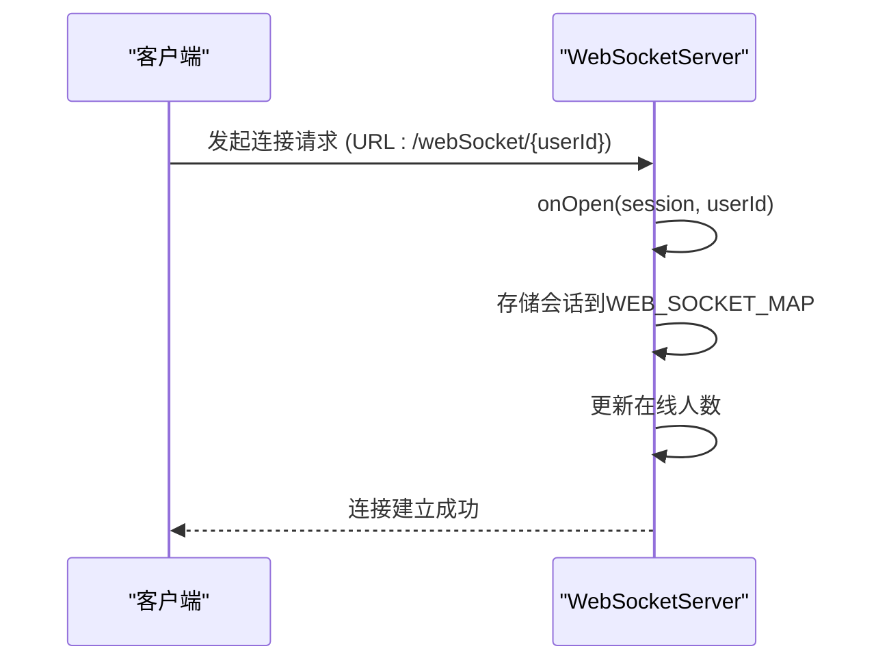
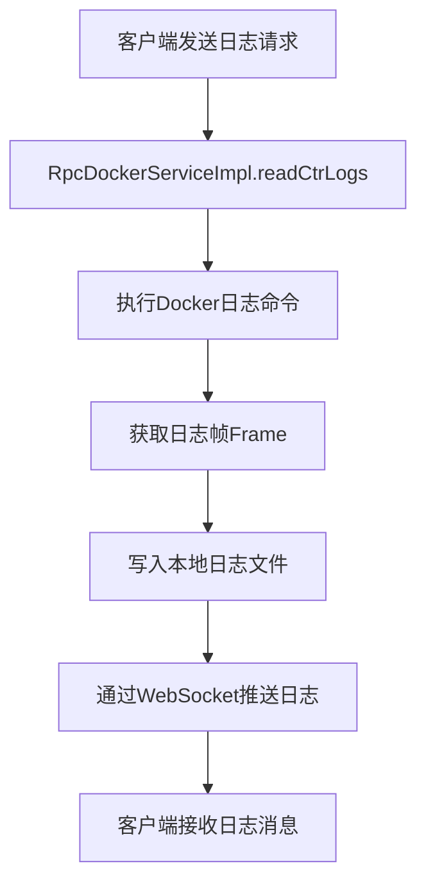
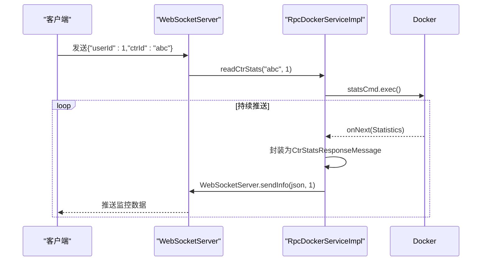
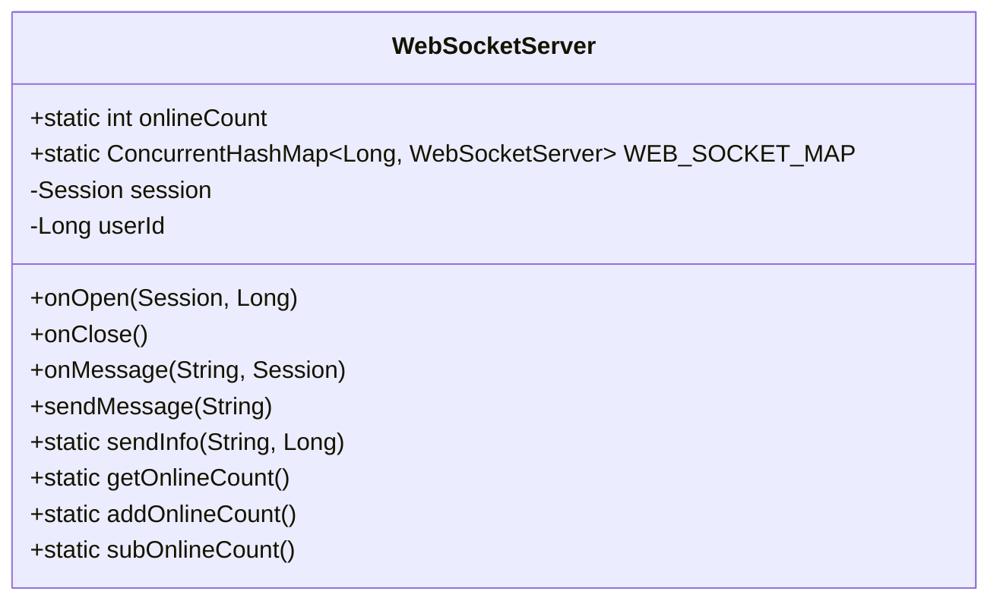

# WebSocket API

<cite>
**本文档引用文件**  
- [WebSocketServer.java](file://yun-docker-worker/src/main/java/com/lfc/yundocker/worker/websocket/WebSocketServer.java)
- [WebsocketConfig.java](file://yun-docker-worker/src/main/java/com/lfc/yundocker/worker/config/WebsocketConfig.java)
- [RpcDockerServiceImpl.java](file://yun-docker-worker/src/main/java/com/lfc/yundocker/worker/rpc/RpcDockerServiceImpl.java)
- [CtrStatsResponseMessage.java](file://yun-docker-common/src/main/java/com/lfc/yundocker/common/model/dto/message/CtrStatsResponseMessage.java)
- [CtrStatsRequestMessage.java](file://yun-docker-common/src/main/java/com/lfc/yundocker/common/model/dto/message/CtrStatsRequestMessage.java)
- [application.yml](file://yun-docker-worker/src/main/resources/application.yml)
</cite>

## 目录
1. [简介](#简介)
2. [连接URL与握手过程](#连接url与握手过程)
3. [消息帧格式](#消息帧格式)
4. [服务端主动推送事件类型](#服务端主动推送事件类型)
5. [客户端JavaScript示例](#客户端javascript示例)
6. [连接认证机制](#连接认证机制)
7. [会话管理](#会话管理)
8. [心跳保活策略](#心跳保活策略)
9. [异常断线重连最佳实践](#异常断线重连最佳实践)

## 简介
本接口文档详细说明了基于 `WebSocketServer` 类实现的WebSocket实时通信机制。系统通过WebSocket协议实现服务端与客户端之间的双向实时通信，主要用于推送容器日志、资源监控数据和操作状态通知等关键信息。该机制部署在 `yun-docker-worker` 服务中，通过Spring Boot集成WebSocket功能，确保高并发下的稳定通信。

**文档来源**
- [WebSocketServer.java](file://yun-docker-worker/src/main/java/com/lfc/yundocker/worker/websocket/WebSocketServer.java#L1-L20)
- [WebsocketConfig.java](file://yun-docker-worker/src/main/java/com/lfc/yundocker/worker/config/WebsocketConfig.java#L1-L10)

## 连接URL与握手过程
客户端通过指定的WebSocket连接URL与服务端建立连接。连接URL包含用户ID路径参数，用于标识会话归属。

### 连接URL
```
ws://<server>:<port>/api/webSocket/{userId}
```
其中：
- `{userId}`：用户的唯一标识符，由客户端在连接时提供
- 示例：`ws://localhost:8089/api/webSocket/123`

### 握手过程
1. 客户端发起WebSocket连接请求，URL中包含有效的 `userId`
2. 服务端 `WebSocketServer` 类的 `@OnOpen` 方法被触发
3. 服务端将该用户的会话信息存储在 `WEB_SOCKET_MAP` 静态映射中
4. 若该用户已存在连接，则替换旧连接，确保同一用户仅有一个活跃会话
5. 在线连接数 (`onlineCount`) 增加
6. 服务端记录连接日志，包括用户ID和当前在线人数



**图示来源**
- [WebSocketServer.java](file://yun-docker-worker/src/main/java/com/lfc/yundocker/worker/websocket/WebSocketServer.java#L51-L67)

**文档来源**
- [WebSocketServer.java](file://yun-docker-worker/src/main/java/com/lfc/yundocker/worker/websocket/WebSocketServer.java#L25-L67)

## 消息帧格式
所有通过WebSocket传输的消息均采用JSON格式，包含特定的字段用于标识消息类型和内容。

### JSON结构
```json
{
  "type": "消息类型",
  "data": { "实际数据内容" }
}
```

### 消息类型
- `log`：容器日志流
- `stats`：资源监控数据
- `status`：操作状态通知

服务端推送的消息为序列化的JSON字符串，客户端需解析JSON以获取具体信息。

**文档来源**
- [WebSocketServer.java](file://yun-docker-worker/src/main/java/com/lfc/yundocker/worker/websocket/WebSocketServer.java#L135-L137)
- [CtrStatsResponseMessage.java](file://yun-docker-common/src/main/java/com/lfc/yundocker/common/model/dto/message/CtrStatsResponseMessage.java#L1-L69)

## 服务端主动推送事件类型
服务端通过 `WebSocketServer.sendInfo()` 方法主动向客户端推送三种类型的实时数据。

### 容器日志流 (log)
当客户端请求查看容器日志时，服务端会持续推送日志内容。日志数据通过Docker Java API获取，并实时写入用户专属日志文件，同时通过WebSocket推送。



**图示来源**
- [RpcDockerServiceImpl.java](file://yun-docker-worker/src/main/java/com/lfc/yundocker/worker/rpc/RpcDockerServiceImpl.java#L361-L395)

### 资源监控数据 (stats)
服务端定期推送容器的CPU、内存、网络和磁盘IO等资源使用情况。

#### 数据结构 (CtrStatsResponseMessage)
| 字段 | 类型 | 说明 |
|------|------|------|
| cpuTotalUsage | Double | CPU总使用时间（秒） |
| perCpuUsage | List<Long> | 各CPU核心使用情况 |
| onlineCpus | Long | 在线CPU数量 |
| memoryUsage | Double | 当前内存使用量（MB） |
| memoryMaxUsage | Double | 最大内存使用量（MB） |
| memoryLimit | Double | 内存使用限制（MB） |
| numProcess | Long | 进程数量 |
| rxBytes | Double | 网络入站流量（KB） |
| txBytes | Double | 网络出站流量（KB） |
| ioValue | Double | 磁盘IO传输量（KB） |

推送流程：
1. 客户端发送包含 `userId` 和 `ctrId` 的JSON消息
2. `WebSocketServer.onMessage()` 解析消息并调用 `RpcDockerServiceImpl.readCtrStats()`
3. 启动Docker `stats` 命令，持续获取容器统计信息
4. 将统计信息封装为 `CtrStatsResponseMessage` 对象
5. 序列化为JSON字符串并通过 `WebSocketServer.sendInfo()` 推送



**图示来源**
- [RpcDockerServiceImpl.java](file://yun-docker-worker/src/main/java/com/lfc/yundocker/worker/rpc/RpcDockerServiceImpl.java#L198-L238)
- [CtrStatsResponseMessage.java](file://yun-docker-common/src/main/java/com/lfc/yundocker/common/model/dto/message/CtrStatsResponseMessage.java#L1-L69)

### 操作状态通知 (status)
系统在关键操作（如容器启动、停止、镜像拉取）完成后，通过WebSocket推送状态变更通知。虽然具体实现细节未在当前代码中完全展示，但可通过 `sendInfo` 方法实现此类通知。

**文档来源**
- [WebSocketServer.java](file://yun-docker-worker/src/main/java/com/lfc/yundocker/worker/websocket/WebSocketServer.java#L146-L157)
- [CtrStatsRequestMessage.java](file://yun-docker-common/src/main/java/com/lfc/yundocker/common/model/dto/message/CtrStatsRequestMessage.java#L1-L17)

## 客户端JavaScript示例
以下JavaScript代码展示了如何建立WebSocket连接、监听消息和处理不同类型的帧。

```javascript
// 建立连接
const userId = 123; // 从登录会话获取
const token = 'your-jwt-token'; // 认证令牌
const wsUrl = `ws://localhost:8089/api/webSocket/${userId}?token=${token}`;
const socket = new WebSocket(wsUrl);

// 监听连接打开
socket.onopen = function(event) {
    console.log('WebSocket连接已建立');
    // 可以发送初始化请求
    socket.send(JSON.stringify({
        userId: userId,
        ctrId: 'container-abc123'
    }));
};

// 监听消息
socket.onmessage = function(event) {
    try {
        const data = JSON.parse(event.data);
        // 根据type字段处理不同事件
        switch(data.type) {
            case 'log':
                console.log('收到日志:', data.data);
                // 更新日志显示区域
                break;
            case 'stats':
                console.log('收到监控数据:', data.data);
                // 更新监控图表
                updateCharts(data.data);
                break;
            case 'status':
                console.log('收到状态通知:', data.data);
                // 更新UI状态
                updateStatus(data.data);
                break;
            default:
                console.log('未知消息类型:', data);
        }
    } catch (e) {
        console.error('解析消息失败:', e);
        // 处理非JSON文本或二进制帧
        console.log('原始消息:', event.data);
    }
};

// 监听错误
socket.onerror = function(event) {
    console.error('WebSocket错误:', event);
};

// 监听连接关闭
socket.onclose = function(event) {
    console.log('WebSocket连接已关闭', event);
    // 实现重连逻辑
    handleReconnect();
};

// 发送消息（可选）
function sendMessage(msg) {
    if (socket.readyState === WebSocket.OPEN) {
        socket.send(JSON.stringify(msg));
    }
}
```

**文档来源**
- [WebSocketServer.java](file://yun-docker-worker/src/main/java/com/lfc/yundocker/worker/websocket/WebSocketServer.java#L90-L120)

## 连接认证机制
系统通过URL参数传递认证令牌来验证客户端身份。

### 实现方式
1. 客户端在连接URL中通过查询参数传递 `token`
   ```
   ws://server:port/api/webSocket/{userId}?token=xxx
   ```
2. 服务端在业务逻辑层（如Controller）验证该token的有效性
3. 只有通过验证的连接才会被接受并建立WebSocket会话

虽然 `WebSocketServer` 类本身不直接处理token验证，但依赖于上层应用的安全机制确保连接的合法性。

**文档来源**
- [WebSocketServer.java](file://yun-docker-worker/src/main/java/com/lfc/yundocker/worker/websocket/WebSocketServer.java#L52-L54)
- [application.yml](file://yun-docker-worker/src/main/resources/application.yml#L31-L35)

## 会话管理
服务端通过静态映射和计数器管理WebSocket会话。

### 核心组件
- `WEB_SOCKET_MAP`：`ConcurrentHashMap<Long, WebSocketServer>`，以 `userId` 为键存储会话实例
- `onlineCount`：静态整数，记录当前在线连接总数

### 会话生命周期
- **建立**：`onOpen` 方法将新会话存入 `WEB_SOCKET_MAP`，并增加 `onlineCount`
- **关闭**：`onClose` 方法从 `WEB_SOCKET_MAP` 移除会话，并减少 `onlineCount`
- **替换**：同一 `userId` 的新连接会替换旧连接，保证单点登录

### 并发安全
所有对共享状态的操作均通过 `synchronized` 方法保证线程安全。



**图示来源**
- [WebSocketServer.java](file://yun-docker-worker/src/main/java/com/lfc/yundocker/worker/websocket/WebSocketServer.java#L33-L173)

**文档来源**
- [WebSocketServer.java](file://yun-docker-worker/src/main/java/com/lfc/yundocker/worker/websocket/WebSocketServer.java#L38-L173)

## 心跳保活策略
当前实现依赖于底层WebSocket协议的心跳机制，未在应用层实现自定义心跳。

### 配置
- 服务端配置在 `application.yml` 中，但未显式设置心跳参数
- 使用Spring Boot默认的WebSocket心跳策略
- 连接超时时间由服务器和网络设备决定

### 建议
建议在生产环境中配置显式的心跳间隔，以防止长时间空闲连接被中间代理或防火墙断开。

**文档来源**
- [application.yml](file://yun-docker-worker/src/main/resources/application.yml#L31-L51)

## 异常断线重连最佳实践
为确保通信的可靠性，客户端应实现健壮的重连机制。

### 重连策略
1. **指数退避**：首次重连立即尝试，失败后等待2秒、4秒、8秒等递增时间
2. **最大重试次数**：设置最大重试次数（如10次），避免无限重试
3. **网络状态检测**：在重连前检测设备网络状态
4. **用户提示**：向用户显示连接状态和重连尝试

### JavaScript实现示例
```javascript
let socket = null;
let reconnectAttempts = 0;
const MAX_RECONNECT_ATTEMPTS = 10;
const BASE_RECONNECT_DELAY = 1000; // 1秒

function connectWebSocket() {
    const userId = getCurrentUserId();
    const token = getAuthToken();
    const wsUrl = `ws://server:port/api/webSocket/${userId}?token=${token}`;
    
    socket = new WebSocket(wsUrl);
    
    socket.onopen = function(event) {
        console.log('连接成功');
        reconnectAttempts = 0; // 重置重试计数
    };
    
    socket.onclose = function(event) {
        console.log('连接关闭', event);
        if (reconnectAttempts < MAX_RECONNECT_ATTEMPTS) {
            const delay = BASE_RECONNECT_DELAY * Math.pow(2, reconnectAttempts);
            setTimeout(() => {
                reconnectAttempts++;
                console.log(`第${reconnectAttempts}次重连尝试...`);
                connectWebSocket();
            }, delay);
        } else {
            console.error('达到最大重试次数，停止重连');
            showConnectionError();
        }
    };
    
    socket.onerror = function(event) {
        console.error('连接错误', event);
    };
}

// 初始连接
connectWebSocket();
```

**文档来源**
- [WebSocketServer.java](file://yun-docker-worker/src/main/java/com/lfc/yundocker/worker/websocket/WebSocketServer.java#L72-L82)
- [WebSocketServer.java](file://yun-docker-worker/src/main/java/com/lfc/yundocker/worker/websocket/WebSocketServer.java#L126-L130)