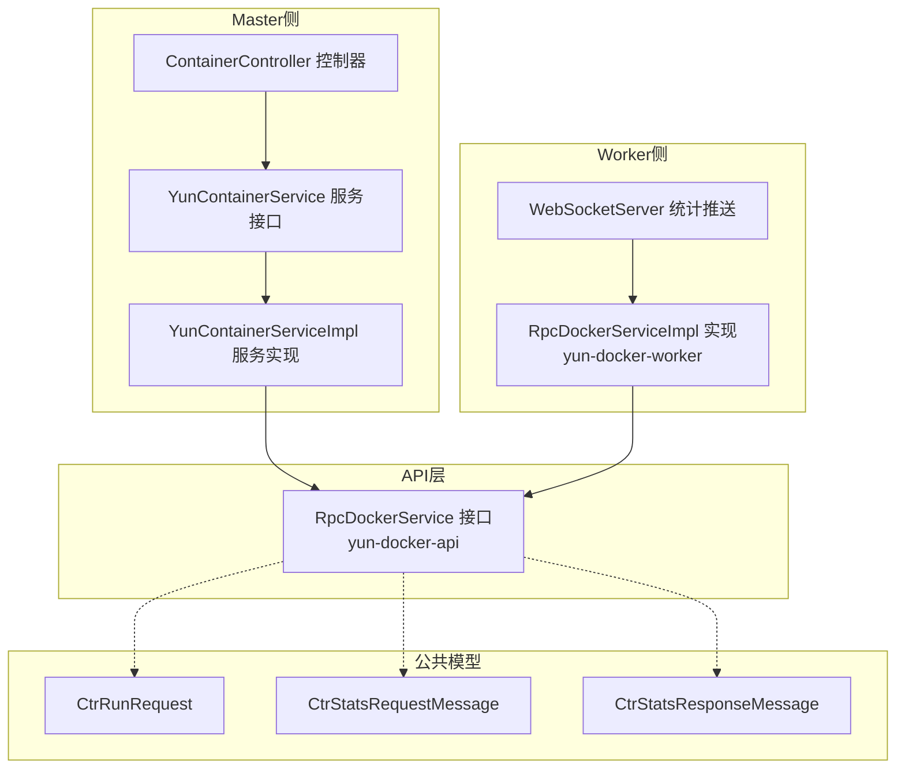
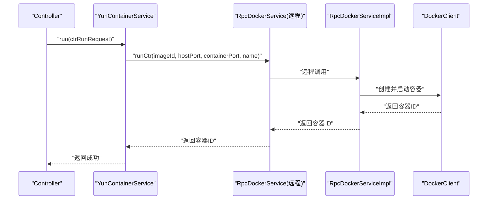
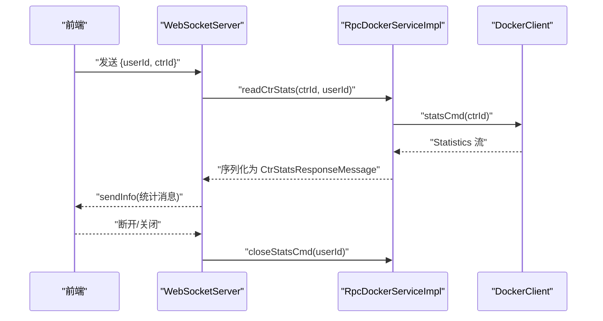
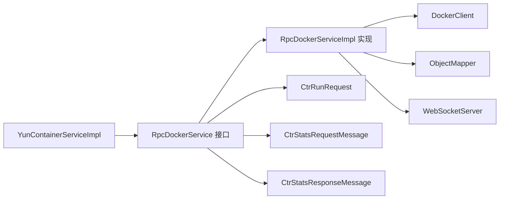

# RPC接口模块（yun-docker-api）

<cite>
**本文引用的文件**
- [yun-docker-api/src/main/java/com/lfc/yundocker/service/RpcDockerService.java](file://yun-docker-api/src/main/java/com/lfc/yundocker/service/RpcDockerService.java)
- [yun-docker-worker/src/main/java/com/lfc/yundocker/worker/rpc/RpcDockerServiceImpl.java](file://yun-docker-worker/src/main/java/com/lfc/yundocker/worker/rpc/RpcDockerServiceImpl.java)
- [yun-docker-master/src/main/java/com/lfc/yundocker/service/impl/YunContainerServiceImpl.java](file://yun-docker-master/src/main/java/com/lfc/yundocker/service/impl/YunContainerServiceImpl.java)
- [yun-docker-master/src/main/java/com/lfc/yundocker/service/YunContainerService.java](file://yun-docker-master/src/main/java/com/lfc/yundocker/service/YunContainerService.java)
- [yun-docker-master/src/main/java/com/lfc/yundocker/controller/ContainerController.java](file://yun-docker-master/src/main/java/com/lfc/yundocker/controller/ContainerController.java)
- [yun-docker-common/src/main/java/com/lfc/yundocker/common/model/dto/CtrRunRequest.java](file://yun-docker-common/src/main/java/com/lfc/yundocker/common/model/dto/CtrRunRequest.java)
- [yun-docker-common/src/main/java/com/lfc/yundocker/common/model/dto/message/CtrStatsRequestMessage.java](file://yun-docker-common/src/main/java/com/lfc/yundocker/common/model/dto/message/CtrStatsRequestMessage.java)
- [yun-docker-common/src/main/java/com/lfc/yundocker/common/model/dto/message/CtrStatsResponseMessage.java](file://yun-docker-common/src/main/java/com/lfc/yundocker/common/model/dto/message/CtrStatsResponseMessage.java)
- [yun-docker-worker/src/main/java/com/lfc/yundocker/worker/websocket/WebSocketServer.java](file://yun-docker-worker/src/main/java/com/lfc/yundocker/worker/websocket/WebSocketServer.java)
- [yun-docker-api/pom.xml](file://yun-docker-api/pom.xml)
- [yun-docker-master/src/main/resources/application.yml](file://yun-docker-master/src/main/resources/application.yml)
- [yun-docker-worker/src/main/resources/application.yml](file://yun-docker-worker/src/main/resources/application.yml)
</cite>

## 目录
1. [简介](#简介)
2. [项目结构](#项目结构)
3. [核心组件](#核心组件)
4. [架构总览](#架构总览)
5. [详细组件分析](#详细组件分析)
6. [依赖关系分析](#依赖关系分析)
7. [性能考量](#性能考量)
8. [故障排查指南](#故障排查指南)
9. [结论](#结论)
10. [附录](#附录)

## 简介
本文件面向“yun-docker-api”模块，系统化梳理RpcDockerService接口的契约定义、方法语义、参数与返回结构、异常处理策略，以及该接口在Dubbo远程调用体系中的角色定位。重点说明：
- RpcDockerService作为master与worker之间的通信契约，承载容器生命周期管理、镜像操作、资源统计与日志等能力。
- 参数DTO（如CtrRunRequest）需放置于common模块以确保序列化一致性。
- 通过Dubbo注解@DubboService（暴露）与@DubboReference（引用）实现服务边界的清晰划分。
- 提供接口版本管理与扩展原则，保障向后兼容。

## 项目结构
- yun-docker-api：仅包含RpcDockerService接口定义，无实现，作为服务契约与DTO依赖声明处。
- yun-docker-common：集中存放DTO、枚举、常量与通用工具，确保master/worker/common三方共享。
- yun-docker-master：业务控制器与服务实现，通过@DubboReference引用RpcDockerService。
- yun-docker-worker：RpcDockerService实现，通过@DubboService暴露服务；配合WebSocket推送统计结果。

图表来源
- [yun-docker-api/src/main/java/com/lfc/yundocker/service/RpcDockerService.java](file://yun-docker-api/src/main/java/com/lfc/yundocker/service/RpcDockerService.java#L1-L143)
- [yun-docker-worker/src/main/java/com/lfc/yundocker/worker/rpc/RpcDockerServiceImpl.java](file://yun-docker-worker/src/main/java/com/lfc/yundocker/worker/rpc/RpcDockerServiceImpl.java#L1-L440)
- [yun-docker-master/src/main/java/com/lfc/yundocker/service/impl/YunContainerServiceImpl.java](file://yun-docker-master/src/main/java/com/lfc/yundocker/service/impl/YunContainerServiceImpl.java#L1-L318)
- [yun-docker-common/src/main/java/com/lfc/yundocker/common/model/dto/CtrRunRequest.java](file://yun-docker-common/src/main/java/com/lfc/yundocker/common/model/dto/CtrRunRequest.java#L1-L35)
- [yun-docker-common/src/main/java/com/lfc/yundocker/common/model/dto/message/CtrStatsRequestMessage.java](file://yun-docker-common/src/main/java/com/lfc/yundocker/common/model/dto/message/CtrStatsRequestMessage.java#L1-L17)
- [yun-docker-common/src/main/java/com/lfc/yundocker/common/model/dto/message/CtrStatsResponseMessage.java](file://yun-docker-common/src/main/java/com/lfc/yundocker/common/model/dto/message/CtrStatsResponseMessage.java#L1-L69)

章节来源
- [yun-docker-api/pom.xml](file://yun-docker-api/pom.xml#L1-L33)

## 核心组件
- RpcDockerService：定义master与worker之间的容器与镜像操作契约，包括拉取/删除镜像、创建/运行/启动/停止/重启/删除容器、读取统计、查看日志等。
- RpcDockerServiceImpl：worker侧具体实现，对接DockerClient完成实际操作，并通过WebSocket向用户推送实时统计。
- YunContainerServiceImpl：master侧服务实现，负责鉴权、端口分配、余额扣减、数据库持久化与调用RpcDockerService。
- DTO与消息体：CtrRunRequest、CtrStatsRequestMessage、CtrStatsResponseMessage，均位于common模块，确保序列化一致。

章节来源
- [yun-docker-api/src/main/java/com/lfc/yundocker/service/RpcDockerService.java](file://yun-docker-api/src/main/java/com/lfc/yundocker/service/RpcDockerService.java#L1-L143)
- [yun-docker-worker/src/main/java/com/lfc/yundocker/worker/rpc/RpcDockerServiceImpl.java](file://yun-docker-worker/src/main/java/com/lfc/yundocker/worker/rpc/RpcDockerServiceImpl.java#L1-L440)
- [yun-docker-master/src/main/java/com/lfc/yundocker/service/impl/YunContainerServiceImpl.java](file://yun-docker-master/src/main/java/com/lfc/yundocker/service/impl/YunContainerServiceImpl.java#L1-L318)
- [yun-docker-common/src/main/java/com/lfc/yundocker/common/model/dto/CtrRunRequest.java](file://yun-docker-common/src/main/java/com/lfc/yundocker/common/model/dto/CtrRunRequest.java#L1-L35)
- [yun-docker-common/src/main/java/com/lfc/yundocker/common/model/dto/message/CtrStatsRequestMessage.java](file://yun-docker-common/src/main/java/com/lfc/yundocker/common/model/dto/message/CtrStatsRequestMessage.java#L1-L17)
- [yun-docker-common/src/main/java/com/lfc/yundocker/common/model/dto/message/CtrStatsResponseMessage.java](file://yun-docker-common/src/main/java/com/lfc/yundocker/common/model/dto/message/CtrStatsResponseMessage.java#L1-L69)

## 架构总览
- 调用链路：Controller -> YunContainerService -> RpcDockerService（远程） -> RpcDockerServiceImpl -> DockerClient。
- 统计推送：WebSocketServer接收前端请求，调用RpcDockerServiceImpl读取统计并通过WebSocket回推。
- Dubbo配置：master与worker各自在application.yml中配置dubbo协议与消费者超时等参数。

图表来源
- [yun-docker-master/src/main/java/com/lfc/yundocker/controller/ContainerController.java](file://yun-docker-master/src/main/java/com/lfc/yundocker/controller/ContainerController.java#L110-L133)
- [yun-docker-master/src/main/java/com/lfc/yundocker/service/impl/YunContainerServiceImpl.java](file://yun-docker-master/src/main/java/com/lfc/yundocker/service/impl/YunContainerServiceImpl.java#L136-L215)
- [yun-docker-api/src/main/java/com/lfc/yundocker/service/RpcDockerService.java](file://yun-docker-api/src/main/java/com/lfc/yundocker/service/RpcDockerService.java#L28-L38)
- [yun-docker-worker/src/main/java/com/lfc/yundocker/worker/rpc/RpcDockerServiceImpl.java](file://yun-docker-worker/src/main/java/com/lfc/yundocker/worker/rpc/RpcDockerServiceImpl.java#L82-L107)

## 详细组件分析

### RpcDockerService接口方法规范
以下逐项说明方法的功能语义、输入参数类型、返回值结构与可能抛出的异常（基于实现与注释推断）。

- 拉取镜像
  - 方法：pullImage(image)
  - 输入：镜像名称（字符串）
  - 返回：镜像检查信息（InspectImageResponse）
  - 异常：可能抛出InterruptedException（实现中声明）
  - 用途：拉取镜像并返回详细信息
  章节来源
  - [yun-docker-api/src/main/java/com/lfc/yundocker/service/RpcDockerService.java](file://yun-docker-api/src/main/java/com/lfc/yundocker/service/RpcDockerService.java#L11-L18)
  - [yun-docker-worker/src/main/java/com/lfc/yundocker/worker/rpc/RpcDockerServiceImpl.java](file://yun-docker-worker/src/main/java/com/lfc/yundocker/worker/rpc/RpcDockerServiceImpl.java#L52-L72)

- 删除镜像
  - 方法：removeImage(image)
  - 输入：镜像名称（字符串）
  - 返回：布尔值（是否删除成功）
  - 异常：无显式声明
  - 用途：强制删除镜像
  章节来源
  - [yun-docker-api/src/main/java/com/lfc/yundocker/service/RpcDockerService.java](file://yun-docker-api/src/main/java/com/lfc/yundocker/service/RpcDockerService.java#L20-L26)
  - [yun-docker-worker/src/main/java/com/lfc/yundocker/worker/rpc/RpcDockerServiceImpl.java](file://yun-docker-worker/src/main/java/com/lfc/yundocker/worker/rpc/RpcDockerServiceImpl.java#L74-L78)

- 运行容器（重载1）
  - 方法：runCtr(imageId, hostPort, containerPort, name)
  - 输入：镜像ID、宿主机端口、容器端口、容器名称
  - 返回：容器ID（字符串）
  - 异常：无显式声明
  - 用途：创建并启动容器，绑定端口，返回容器ID
  章节来源
  - [yun-docker-api/src/main/java/com/lfc/yundocker/service/RpcDockerService.java](file://yun-docker-api/src/main/java/com/lfc/yundocker/service/RpcDockerService.java#L28-L38)
  - [yun-docker-worker/src/main/java/com/lfc/yundocker/worker/rpc/RpcDockerServiceImpl.java](file://yun-docker-worker/src/main/java/com/lfc/yundocker/worker/rpc/RpcDockerServiceImpl.java#L82-L107)

- 创建容器（重载2：挂载目录）
  - 方法：createCtr(image, filePath)
  - 输入：镜像名称、宿主机路径
  - 返回：容器ID（字符串）
  - 异常：无显式声明
  - 用途：创建容器并挂载目录，返回容器ID
  章节来源
  - [yun-docker-api/src/main/java/com/lfc/yundocker/service/RpcDockerService.java](file://yun-docker-api/src/main/java/com/lfc/yundocker/service/RpcDockerService.java#L40-L47)
  - [yun-docker-worker/src/main/java/com/lfc/yundocker/worker/rpc/RpcDockerServiceImpl.java](file://yun-docker-worker/src/main/java/com/lfc/yundocker/worker/rpc/RpcDockerServiceImpl.java#L115-L135)

- 创建容器（重载3：无参）
  - 方法：createCtr(image)
  - 输入：镜像名称
  - 返回：容器ID（字符串）
  - 异常：无显式声明
  - 用途：按镜像名称创建容器，返回容器ID
  章节来源
  - [yun-docker-api/src/main/java/com/lfc/yundocker/service/RpcDockerService.java](file://yun-docker-api/src/main/java/com/lfc/yundocker/service/RpcDockerService.java#L62-L66)
  - [yun-docker-worker/src/main/java/com/lfc/yundocker/worker/rpc/RpcDockerServiceImpl.java](file://yun-docker-worker/src/main/java/com/lfc/yundocker/worker/rpc/RpcDockerServiceImpl.java#L173-L186)

- 在容器中创建并执行命令
  - 方法：createCmd(cid)
  - 输入：容器ID
  - 返回：无
  - 异常：无显式声明
  - 用途：在指定容器中创建并执行命令
  章节来源
  - [yun-docker-api/src/main/java/com/lfc/yundocker/service/RpcDockerService.java](file://yun-docker-api/src/main/java/com/lfc/yundocker/service/RpcDockerService.java#L50-L55)
  - [yun-docker-worker/src/main/java/com/lfc/yundocker/worker/rpc/RpcDockerServiceImpl.java](file://yun-docker-worker/src/main/java/com/lfc/yundocker/worker/rpc/RpcDockerServiceImpl.java#L142-L164)

- 读取容器统计
  - 方法：readCtrStats(cid, userId)
  - 输入：容器ID、用户ID
  - 返回：无（通过WebSocket推送）
  - 异常：无显式声明
  - 用途：持续读取容器统计并推送至前端WebSocket
  章节来源
  - [yun-docker-api/src/main/java/com/lfc/yundocker/service/RpcDockerService.java](file://yun-docker-api/src/main/java/com/lfc/yundocker/service/RpcDockerService.java#L65-L71)
  - [yun-docker-worker/src/main/java/com/lfc/yundocker/worker/rpc/RpcDockerServiceImpl.java](file://yun-docker-worker/src/main/java/com/lfc/yundocker/worker/rpc/RpcDockerServiceImpl.java#L196-L259)
  - [yun-docker-worker/src/main/java/com/lfc/yundocker/worker/websocket/WebSocketServer.java](file://yun-docker-worker/src/main/java/com/lfc/yundocker/worker/websocket/WebSocketServer.java#L90-L120)

- 关闭统计命令
  - 方法：closeStatsCmd(userId)
  - 输入：用户ID
  - 返回：无
  - 异常：可能抛出业务异常（实现中捕获并包装）
  - 用途：关闭对应用户的统计订阅
  章节来源
  - [yun-docker-api/src/main/java/com/lfc/yundocker/service/RpcDockerService.java](file://yun-docker-api/src/main/java/com/lfc/yundocker/service/RpcDockerService.java#L73-L79)
  - [yun-docker-worker/src/main/java/com/lfc/yundocker/worker/rpc/RpcDockerServiceImpl.java](file://yun-docker-worker/src/main/java/com/lfc/yundocker/worker/rpc/RpcDockerServiceImpl.java#L267-L278)

- 获取容器内存使用
  - 方法：getCtrMemory(cid)
  - 输入：容器ID
  - 返回：内存使用（MB，双精度）
  - 异常：无显式声明
  - 用途：一次性获取容器内存使用量
  章节来源
  - [yun-docker-api/src/main/java/com/lfc/yundocker/service/RpcDockerService.java](file://yun-docker-api/src/main/java/com/lfc/yundocker/service/RpcDockerService.java#L81-L88)
  - [yun-docker-worker/src/main/java/com/lfc/yundocker/worker/rpc/RpcDockerServiceImpl.java](file://yun-docker-worker/src/main/java/com/lfc/yundocker/worker/rpc/RpcDockerServiceImpl.java#L286-L296)

- 列出容器
  - 方法：listContainer()
  - 输入：无
  - 返回：容器列表（Docker原生Container类型）
  - 异常：无显式声明
  - 用途：列出所有容器
  章节来源
  - [yun-docker-api/src/main/java/com/lfc/yundocker/service/RpcDockerService.java](file://yun-docker-api/src/main/java/com/lfc/yundocker/service/RpcDockerService.java#L91-L96)
  - [yun-docker-worker/src/main/java/com/lfc/yundocker/worker/rpc/RpcDockerServiceImpl.java](file://yun-docker-worker/src/main/java/com/lfc/yundocker/worker/rpc/RpcDockerServiceImpl.java#L303-L308)

- 启动容器
  - 方法：startCtr(cid)
  - 输入：容器ID
  - 返回：布尔值（是否成功）
  - 异常：无显式声明
  - 用途：启动指定容器
  章节来源
  - [yun-docker-api/src/main/java/com/lfc/yundocker/service/RpcDockerService.java](file://yun-docker-api/src/main/java/com/lfc/yundocker/service/RpcDockerService.java#L98-L105)
  - [yun-docker-worker/src/main/java/com/lfc/yundocker/worker/rpc/RpcDockerServiceImpl.java](file://yun-docker-worker/src/main/java/com/lfc/yundocker/worker/rpc/RpcDockerServiceImpl.java#L320-L324)

- 停止容器
  - 方法：stopCtr(cid)
  - 输入：容器ID
  - 返回：布尔值（是否成功）
  - 异常：无显式声明
  - 用途：停止指定容器
  章节来源
  - [yun-docker-api/src/main/java/com/lfc/yundocker/service/RpcDockerService.java](file://yun-docker-api/src/main/java/com/lfc/yundocker/service/RpcDockerService.java#L107-L114)
  - [yun-docker-worker/src/main/java/com/lfc/yundocker/worker/rpc/RpcDockerServiceImpl.java](file://yun-docker-worker/src/main/java/com/lfc/yundocker/worker/rpc/RpcDockerServiceImpl.java#L332-L337)

- 查看日志
  - 方法：logCtr(cid)
  - 输入：容器ID
  - 返回：日志字节数组
  - 异常：可能抛出业务异常（实现中捕获并包装）
  - 用途：导出容器日志
  章节来源
  - [yun-docker-api/src/main/java/com/lfc/yundocker/service/RpcDockerService.java](file://yun-docker-api/src/main/java/com/lfc/yundocker/service/RpcDockerService.java#L116-L124)
  - [yun-docker-worker/src/main/java/com/lfc/yundocker/worker/rpc/RpcDockerServiceImpl.java](file://yun-docker-worker/src/main/java/com/lfc/yundocker/worker/rpc/RpcDockerServiceImpl.java#L345-L413)

- 删除容器
  - 方法：removeCtr(cid)
  - 输入：容器ID
  - 返回：布尔值（是否成功）
  - 异常：无显式声明
  - 用途：删除指定容器
  章节来源
  - [yun-docker-api/src/main/java/com/lfc/yundocker/service/RpcDockerService.java](file://yun-docker-api/src/main/java/com/lfc/yundocker/service/RpcDockerService.java#L125-L132)
  - [yun-docker-worker/src/main/java/com/lfc/yundocker/worker/rpc/RpcDockerServiceImpl.java](file://yun-docker-worker/src/main/java/com/lfc/yundocker/worker/rpc/RpcDockerServiceImpl.java#L421-L425)

- 重启容器
  - 方法：restartCtr(cid)
  - 输入：容器ID
  - 返回：布尔值（是否成功）
  - 异常：无显式声明
  - 用途：重启指定容器
  章节来源
  - [yun-docker-api/src/main/java/com/lfc/yundocker/service/RpcDockerService.java](file://yun-docker-api/src/main/java/com/lfc/yundocker/service/RpcDockerService.java#L134-L141)
  - [yun-docker-worker/src/main/java/com/lfc/yundocker/worker/rpc/RpcDockerServiceImpl.java](file://yun-docker-worker/src/main/java/com/lfc/yundocker/worker/rpc/RpcDockerServiceImpl.java#L433-L438)

### 参数DTO与消息体
- CtrRunRequest：容器运行请求，包含镜像ID、宿主机端口、容器端口、容器名称。该DTO位于common模块，确保master/worker序列化一致。
- CtrStatsRequestMessage：容器统计请求消息，包含用户ID与容器ID。
- CtrStatsResponseMessage：容器统计响应消息，包含CPU总量、每核使用、在线CPU数、内存使用/最大/限制、进程数、网络入出流量、磁盘IO等指标。

章节来源
- [yun-docker-common/src/main/java/com/lfc/yundocker/common/model/dto/CtrRunRequest.java](file://yun-docker-common/src/main/java/com/lfc/yundocker/common/model/dto/CtrRunRequest.java#L1-L35)
- [yun-docker-common/src/main/java/com/lfc/yundocker/common/model/dto/message/CtrStatsRequestMessage.java](file://yun-docker-common/src/main/java/com/lfc/yundocker/common/model/dto/message/CtrStatsRequestMessage.java#L1-L17)
- [yun-docker-common/src/main/java/com/lfc/yundocker/common/model/dto/message/CtrStatsResponseMessage.java](file://yun-docker-common/src/main/java/com/lfc/yundocker/common/model/dto/message/CtrStatsResponseMessage.java#L1-L69)

### Dubbo远程调用契约
- 服务暴露（@DubboService）：worker侧RpcDockerServiceImpl通过@DubboService暴露RpcDockerService接口，供master消费。
- 服务引用（@DubboReference）：master侧YunContainerServiceImpl通过@DubboReference引用RpcDockerService，实现远程调用。
- 注解位置参考：
  - worker暴露：RpcDockerServiceImpl类上标注@DubboService
  - master引用：YunContainerServiceImpl类中注入RpcDockerService字段并标注@DubboReference
- Dubbo配置：master与worker各自在application.yml中配置dubbo应用名、协议与端口、消费者超时等。

章节来源
- [yun-docker-worker/src/main/java/com/lfc/yundocker/worker/rpc/RpcDockerServiceImpl.java](file://yun-docker-worker/src/main/java/com/lfc/yundocker/worker/rpc/RpcDockerServiceImpl.java#L30-L33)
- [yun-docker-master/src/main/java/com/lfc/yundocker/service/impl/YunContainerServiceImpl.java](file://yun-docker-master/src/main/java/com/lfc/yundocker/service/impl/YunContainerServiceImpl.java#L52-L54)
- [yun-docker-master/src/main/resources/application.yml](file://yun-docker-master/src/main/resources/application.yml#L1-L60)
- [yun-docker-worker/src/main/resources/application.yml](file://yun-docker-worker/src/main/resources/application.yml#L1-L51)

### 数据流与统计推送流程
- 前端通过WebSocket连接到/worker/webSocket/{userId}，发送包含userId与ctrId的消息。
- WebSocketServer接收消息后，调用RpcDockerServiceImpl.readCtrStats(cid, userId)，后者通过DockerClient.statsCmd持续读取统计并序列化为CtrStatsResponseMessage，再通过WebSocketServer.sendInfo回推给前端。
- 当用户断开或关闭统计时，WebSocketServer在onClose中调用RpcDockerServiceImpl.closeStatsCmd(userId)终止订阅。

图表来源
- [yun-docker-worker/src/main/java/com/lfc/yundocker/worker/websocket/WebSocketServer.java](file://yun-docker-worker/src/main/java/com/lfc/yundocker/worker/websocket/WebSocketServer.java#L90-L120)
- [yun-docker-worker/src/main/java/com/lfc/yundocker/worker/rpc/RpcDockerServiceImpl.java](file://yun-docker-worker/src/main/java/com/lfc/yundocker/worker/rpc/RpcDockerServiceImpl.java#L196-L259)
- [yun-docker-common/src/main/java/com/lfc/yundocker/common/model/dto/message/CtrStatsResponseMessage.java](file://yun-docker-common/src/main/java/com/lfc/yundocker/common/model/dto/message/CtrStatsResponseMessage.java#L1-L69)

## 依赖关系分析
- 接口与实现耦合：RpcDockerService仅定义契约，实现位于worker模块；master通过@DubboReference引用接口，降低耦合度。
- DTO共享：CtrRunRequest、统计请求/响应消息位于common模块，避免跨模块序列化差异。
- 外部依赖：worker依赖docker-java与Jackson，用于Docker操作与JSON序列化。
- WebSocket依赖：worker通过WebSocketServer推送统计，前端可实时查看。

图表来源
- [yun-docker-api/src/main/java/com/lfc/yundocker/service/RpcDockerService.java](file://yun-docker-api/src/main/java/com/lfc/yundocker/service/RpcDockerService.java#L1-L143)
- [yun-docker-worker/src/main/java/com/lfc/yundocker/worker/rpc/RpcDockerServiceImpl.java](file://yun-docker-worker/src/main/java/com/lfc/yundocker/worker/rpc/RpcDockerServiceImpl.java#L1-L440)
- [yun-docker-common/src/main/java/com/lfc/yundocker/common/model/dto/CtrRunRequest.java](file://yun-docker-common/src/main/java/com/lfc/yundocker/common/model/dto/CtrRunRequest.java#L1-L35)
- [yun-docker-common/src/main/java/com/lfc/yundocker/common/model/dto/message/CtrStatsRequestMessage.java](file://yun-docker-common/src/main/java/com/lfc/yundocker/common/model/dto/message/CtrStatsRequestMessage.java#L1-L17)
- [yun-docker-common/src/main/java/com/lfc/yundocker/common/model/dto/message/CtrStatsResponseMessage.java](file://yun-docker-common/src/main/java/com/lfc/yundocker/common/model/dto/message/CtrStatsResponseMessage.java#L1-L69)

## 性能考量
- 统计订阅：readCtrStats采用流式统计，建议前端合理控制刷新频率，避免过多消息堆积。
- 日志导出：logCtr将日志写入临时文件再读取，注意大日志场景下的I/O与内存占用。
- 端口与资源：实现中对容器内存与端口有硬编码限制，建议通过配置中心动态调整。
- 超时与重试：master侧消费者超时较短，建议在高负载场景适当放宽或引入熔断降级。

## 故障排查指南
- 镜像拉取中断：pullImage可能抛出InterruptedException，检查网络与Docker守护进程状态。
- 统计订阅异常：readCtrStats在onNext/onError中记录日志，关注WebSocket连接与Docker统计接口可用性。
- 日志导出失败：logCtr捕获异常并包装为业务异常，检查容器是否存在、日志文件权限与磁盘空间。
- 端口冲突：master侧在生成端口时会校验合法性，若冲突请更换端口或释放占用。
- 远程调用失败：检查dubbo注册中心连通性、服务暴露与引用配置、消费者超时设置。

章节来源
- [yun-docker-worker/src/main/java/com/lfc/yundocker/worker/rpc/RpcDockerServiceImpl.java](file://yun-docker-worker/src/main/java/com/lfc/yundocker/worker/rpc/RpcDockerServiceImpl.java#L52-L72)
- [yun-docker-worker/src/main/java/com/lfc/yundocker/worker/rpc/RpcDockerServiceImpl.java](file://yun-docker-worker/src/main/java/com/lfc/yundocker/worker/rpc/RpcDockerServiceImpl.java#L196-L259)
- [yun-docker-worker/src/main/java/com/lfc/yundocker/worker/rpc/RpcDockerServiceImpl.java](file://yun-docker-worker/src/main/java/com/lfc/yundocker/worker/rpc/RpcDockerServiceImpl.java#L345-L413)
- [yun-docker-master/src/main/resources/application.yml](file://yun-docker-master/src/main/resources/application.yml#L1-L60)

## 结论
RpcDockerService作为master与worker之间的核心通信契约，覆盖了容器全生命周期与资源统计的关键能力。通过将参数DTO置于common模块、使用@DubboService/@DubboReference实现清晰的服务边界，系统实现了良好的可维护性与扩展性。建议在后续演进中遵循向后兼容的版本管理与扩展原则，确保接口稳定与生态协同。

## 附录
- 接口版本管理与扩展建议
  - 版本号：建议在接口层面通过包名或注解版本字段区分版本，避免破坏现有调用方。
  - 向后兼容：新增方法时保持旧方法签名不变，新增字段在DTO中使用可选字段，避免破坏序列化。
  - 分离关注点：将统计推送独立为单独消息通道（如消息队列），减少对RPC接口的侵入。
  - 文档与契约：为每个方法补充详细的输入输出约束、异常码与示例，便于调用方理解与测试。