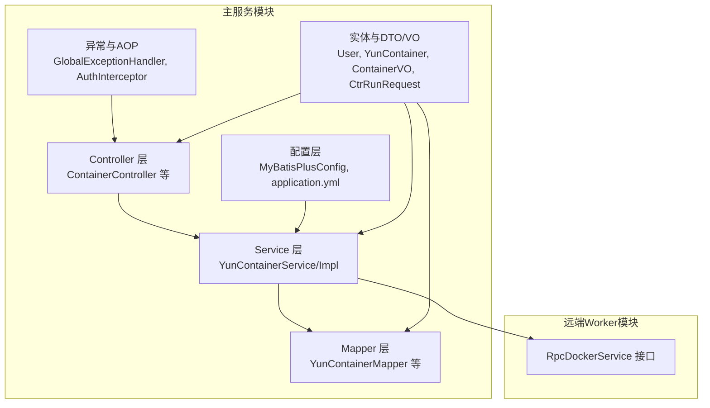
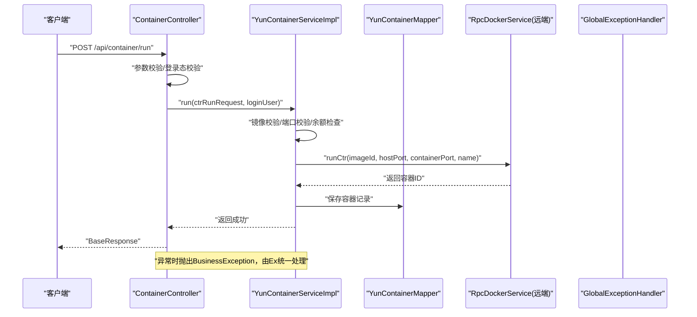
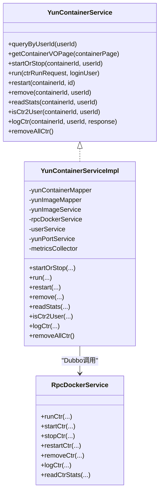
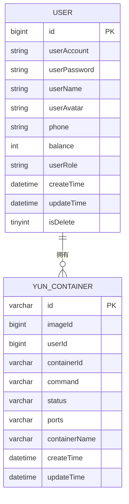
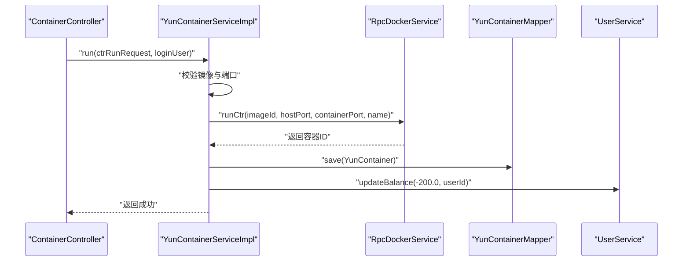
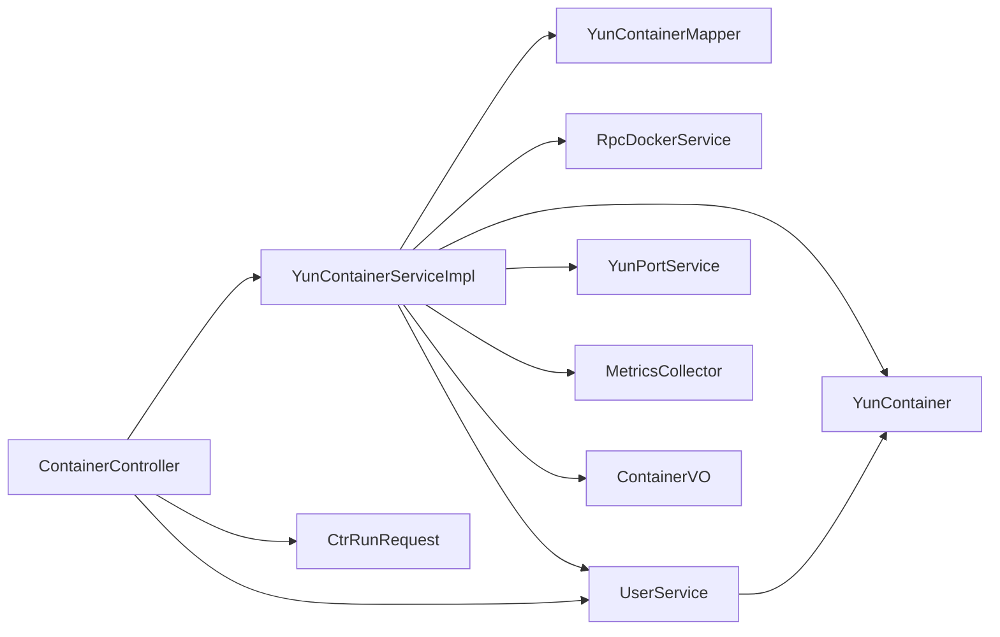

# 主服务模块（yun-docker-master）

<cite>
**本文引用的文件**
- [MasterApplication.java](file://yun-docker-master/src/main/java/com/lfc/yundocker/MasterApplication.java)
- [application.yml](file://yun-docker-master/src/main/resources/application.yml)
- [MyBatisPlusConfig.java](file://yun-docker-master/src/main/java/com/lfc/yundocker/config/MyBatisPlusConfig.java)
- [ContainerController.java](file://yun-docker-master/src/main/java/com/lfc/yundocker/controller/ContainerController.java)
- [UserController.java](file://yun-docker-master/src/main/java/com/lfc/yundocker/controller/UserController.java)
- [YunContainerService.java](file://yun-docker-master/src/main/java/com/lfc/yundocker/service/YunContainerService.java)
- [YunContainerServiceImpl.java](file://yun-docker-master/src/main/java/com/lfc/yundocker/service/impl/YunContainerServiceImpl.java)
- [UserService.java](file://yun-docker-master/src/main/java/com/lfc/yundocker/service/UserService.java)
- [YunContainerMapper.java](file://yun-docker-master/src/main/java/com/lfc/yundocker/mapper/YunContainerMapper.java)
- [User.java](file://yun-docker-master/src/main/java/com/lfc/yundocker/common/model/entity/User.java)
- [YunContainer.java](file://yun-docker-master/src/main/java/com/lfc/yundocker/common/model/entity/YunContainer.java)
- [ContainerVO.java](file://yun-docker-master/src/main/java/com/lfc/yundocker/common/model/vo/ContainerVO.java)
- [CtrRunRequest.java](file://yun-docker-common/src/main/java/com/lfc/yundocker/common/model/dto/CtrRunRequest.java)
- [CtrStatusConstant.java](file://yun-docker-common/src/main/java/com/lfc/yundocker/common/constant/CtrStatusConstant.java)
- [ErrorCode.java](file://yun-docker-common/src/main/java/com/lfc/yundocker/common/model/enums/ErrorCode.java)
- [GlobalExceptionHandler.java](file://yun-docker-common/src/main/java/com/lfc/yundocker/common/exception/GlobalExceptionHandler.java)
- [AuthInterceptor.java](file://yun-docker-master/src/main/java/com/lfc/yundocker/aop/AuthInterceptor.java)
- [RpcDockerService.java](file://yun-docker-api/src/main/java/com/lfc/yundocker/service/RpcDockerService.java)
</cite>

## 目录
1. [引言](#引言)
2. [项目结构](#项目结构)
3. [核心组件](#核心组件)
4. [架构总览](#架构总览)
5. [详细组件分析](#详细组件分析)
6. [依赖分析](#依赖分析)
7. [性能考虑](#性能考虑)
8. [故障排查指南](#故障排查指南)
9. [结论](#结论)
10. [附录](#附录)

## 引言
本文件面向“主服务模块（yun-docker-master）”的全面解析，聚焦其作为业务中枢的角色：统一接收HTTP请求、进行参数校验与鉴权、封装业务逻辑（如用户登录验证、容器创建流程控制）、通过MyBatis-Plus与MySQL持久化交互，并通过Dubbo调用远端worker模块的RpcDockerService接口完成容器生命周期管理（启动、停止、重启、删除、查看日志、统计）。文档采用MVC分层视角组织内容，同时覆盖实体模型、VO/DTO转换、异常处理机制与典型请求处理链路。

## 项目结构
主服务模块位于 yun-docker-master，采用Spring Boot工程，核心分层如下：
- Controller层：接收REST请求，进行参数校验与鉴权，调用Service层
- Service层：封装业务逻辑，协调Mapper与RPC调用
- Mapper层：基于MyBatis-Plus实现数据库访问
- 配置层：Dubbo、MyBatis-Plus、WebMvc、WebSocket等配置
- 异常与AOP：全局异常处理、鉴权切面
- API接口：与worker通信的RpcDockerService接口定义

图表来源
- [MasterApplication.java](file://yun-docker-master/src/main/java/com/lfc/yundocker/MasterApplication.java#L1-L25)
- [application.yml](file://yun-docker-master/src/main/resources/application.yml#L1-L60)
- [MyBatisPlusConfig.java](file://yun-docker-master/src/main/java/com/lfc/yundocker/config/MyBatisPlusConfig.java#L1-L32)
- [ContainerController.java](file://yun-docker-master/src/main/java/com/lfc/yundocker/controller/ContainerController.java#L1-L173)
- [YunContainerService.java](file://yun-docker-master/src/main/java/com/lfc/yundocker/service/YunContainerService.java#L1-L41)
- [YunContainerServiceImpl.java](file://yun-docker-master/src/main/java/com/lfc/yundocker/service/impl/YunContainerServiceImpl.java#L1-L318)
- [YunContainerMapper.java](file://yun-docker-master/src/main/java/com/lfc/yundocker/mapper/YunContainerMapper.java#L1-L19)
- [GlobalExceptionHandler.java](file://yun-docker-common/src/main/java/com/lfc/yundocker/common/exception/GlobalExceptionHandler.java#L1-L32)
- [AuthInterceptor.java](file://yun-docker-master/src/main/java/com/lfc/yundocker/aop/AuthInterceptor.java#L1-L70)
- [RpcDockerService.java](file://yun-docker-api/src/main/java/com/lfc/yundocker/service/RpcDockerService.java#L1-L143)

章节来源
- [MasterApplication.java](file://yun-docker-master/src/main/java/com/lfc/yundocker/MasterApplication.java#L1-L25)
- [application.yml](file://yun-docker-master/src/main/resources/application.yml#L1-L60)
- [MyBatisPlusConfig.java](file://yun-docker-master/src/main/java/com/lfc/yundocker/config/MyBatisPlusConfig.java#L1-L32)

## 核心组件
- Controller层：以ContainerController为例，提供分页查询、启动/停止、重启、创建、删除、下载日志等REST接口，统一进行参数校验与登录态校验，随后调用Service层。
- Service层：YunContainerService接口定义容器相关能力；YunContainerServiceImpl实现业务编排，包括镜像校验、端口分配、余额扣减、状态更新、Dubbo RPC调用、Metrics采集等。
- Mapper层：YunContainerMapper等基于MyBatis-Plus，提供基础CRUD与少量自定义SQL。
- 配置层：Dubbo启用、MyBatis-Plus分页插件、Web路径、会话与文件上传配置、Prometheus监控暴露等。
- 异常与AOP：全局异常处理器捕获业务异常与运行时异常，统一返回；鉴权切面在标注了特定注解的方法上进行权限校验。
- 实体与DTO/VO：User、YunContainer、ContainerVO、CtrRunRequest等，支撑Controller与Service之间的数据传递与展示。

章节来源
- [ContainerController.java](file://yun-docker-master/src/main/java/com/lfc/yundocker/controller/ContainerController.java#L1-L173)
- [YunContainerService.java](file://yun-docker-master/src/main/java/com/lfc/yundocker/service/YunContainerService.java#L1-L41)
- [YunContainerServiceImpl.java](file://yun-docker-master/src/main/java/com/lfc/yundocker/service/impl/YunContainerServiceImpl.java#L1-L318)
- [YunContainerMapper.java](file://yun-docker-master/src/main/java/com/lfc/yundocker/mapper/YunContainerMapper.java#L1-L19)
- [application.yml](file://yun-docker-master/src/main/resources/application.yml#L1-L60)
- [GlobalExceptionHandler.java](file://yun-docker-common/src/main/java/com/lfc/yundocker/common/exception/GlobalExceptionHandler.java#L1-L32)
- [AuthInterceptor.java](file://yun-docker-master/src/main/java/com/lfc/yundocker/aop/AuthInterceptor.java#L1-L70)
- [User.java](file://yun-docker-master/src/main/java/com/lfc/yundocker/common/model/entity/User.java#L1-L79)
- [YunContainer.java](file://yun-docker-master/src/main/java/com/lfc/yundocker/common/model/entity/YunContainer.java#L1-L79)
- [ContainerVO.java](file://yun-docker-master/src/main/java/com/lfc/yundocker/common/model/vo/ContainerVO.java#L1-L83)
- [CtrRunRequest.java](file://yun-docker-common/src/main/java/com/lfc/yundocker/common/model/dto/CtrRunRequest.java#L1-L35)

## 架构总览
主服务通过Spring MVC接收HTTP请求，经Controller层参数校验与鉴权后，调用Service层完成业务编排；Service层在必要时访问数据库（Mapper），并通过Dubbo调用远端worker的RpcDockerService接口执行容器操作。异常统一由全局异常处理器处理，AOP切面保障鉴权。

图表来源
- [ContainerController.java](file://yun-docker-master/src/main/java/com/lfc/yundocker/controller/ContainerController.java#L117-L133)
- [YunContainerServiceImpl.java](file://yun-docker-master/src/main/java/com/lfc/yundocker/service/impl/YunContainerServiceImpl.java#L136-L215)
- [YunContainerMapper.java](file://yun-docker-master/src/main/java/com/lfc/yundocker/mapper/YunContainerMapper.java#L1-L19)
- [RpcDockerService.java](file://yun-docker-api/src/main/java/com/lfc/yundocker/service/RpcDockerService.java#L1-L143)
- [GlobalExceptionHandler.java](file://yun-docker-common/src/main/java/com/lfc/yundocker/common/exception/GlobalExceptionHandler.java#L1-L32)

## 详细组件分析

### Controller层：ContainerController
- 职责：接收REST请求，进行参数校验与登录态校验，调用UserService获取当前用户，再调用YunContainerService执行业务操作。
- 关键接口与处理要点：
  - 分页查询容器列表：校验分页参数，限制每页最大条数，按用户过滤，调用Service转换为ContainerVO分页返回。
  - 启动/停止容器：校验容器ID存在性，调用Service执行状态切换，最终持久化状态。
  - 重启容器：校验容器归属，调用Service触发远端重启。
  - 创建容器：校验请求体，检查用户余额，调用Service执行镜像校验、端口分配、远端run、数据库落库、余额扣减。
  - 删除容器：校验容器归属，先数据库删除，再调用远端删除，同时返还余额。
  - 下载日志：校验容器归属，调用Service获取远端日志字节流，写入Response输出。
- 参数校验与异常：对空参数抛出业务异常；对分页size上限进行限制；对余额不足进行前置判断。

章节来源
- [ContainerController.java](file://yun-docker-master/src/main/java/com/lfc/yundocker/controller/ContainerController.java#L48-L171)
- [UserService.java](file://yun-docker-master/src/main/java/com/lfc/yundocker/service/UserService.java#L1-L124)

### Service层：YunContainerService与YunContainerServiceImpl
- 接口职责：定义容器相关能力（分页转换、状态切换、创建、重启、删除、统计、日志、批量清理等）。
- 实现要点：
  - 分页转换：将YunContainer分页映射为ContainerVO分页，补充镜像仓库与标签、固定IP等信息。
  - 状态切换：校验容器归属，调用远端startCtr或stopCtr，成功后更新本地状态。
  - 创建容器：镜像校验（私有镜像仅限本人或公共镜像），端口合法性与分配（公共镜像容器端口来自策略），生成容器名称，调用远端runCtr，记录指标，保存容器记录，扣减余额。
  - 重启/删除：校验容器归属，调用远端对应操作；删除时返还余额并删除本地记录。
  - 统计与日志：调用远端统计与日志接口，日志通过Response写出。
  - 批量清理：遍历容器，返还余额、删除本地记录、调用远端删除。
- Dubbo调用：通过@DubboReference注入RpcDockerService，调用远端容器操作接口。
- 异常与指标：捕获远端异常并记录指标，抛出业务异常；使用MetricsCollector记录错误次数、响应时间与请求数。

图表来源
- [YunContainerService.java](file://yun-docker-master/src/main/java/com/lfc/yundocker/service/YunContainerService.java#L1-L41)
- [YunContainerServiceImpl.java](file://yun-docker-master/src/main/java/com/lfc/yundocker/service/impl/YunContainerServiceImpl.java#L1-L318)
- [RpcDockerService.java](file://yun-docker-api/src/main/java/com/lfc/yundocker/service/RpcDockerService.java#L1-L143)

章节来源
- [YunContainerService.java](file://yun-docker-master/src/main/java/com/lfc/yundocker/service/YunContainerService.java#L1-L41)
- [YunContainerServiceImpl.java](file://yun-docker-master/src/main/java/com/lfc/yundocker/service/impl/YunContainerServiceImpl.java#L108-L215)
- [CtrStatusConstant.java](file://yun-docker-common/src/main/java/com/lfc/yundocker/common/constant/CtrStatusConstant.java#L1-L30)

### Mapper层：YunContainerMapper
- 基于MyBatis-Plus的BaseMapper，提供通用CRUD能力；包含少量自定义SQL（如查询端口列表）。
- 与Service协作：在容器状态切换、端口校验、批量清理等场景中执行数据库操作。

章节来源
- [YunContainerMapper.java](file://yun-docker-master/src/main/java/com/lfc/yundocker/mapper/YunContainerMapper.java#L1-L19)
- [YunContainerServiceImpl.java](file://yun-docker-master/src/main/java/com/lfc/yundocker/service/impl/YunContainerServiceImpl.java#L230-L246)

### 数据模型与VO/DTO转换
- 实体模型：
  - User：用户基本信息、余额、角色、逻辑删除字段等。
  - YunContainer：容器记录（镜像ID、用户ID、容器ID、命令、状态、端口、名称、时间戳）。
- VO/DTO：
  - ContainerVO：容器视图对象，包含容器ID、状态、端口、IP、名称、创建时间、镜像（仓库:标签）等，提供对象转包装类方法。
  - CtrRunRequest：容器创建请求DTO，包含镜像ID、宿主机端口、容器端口、自定义名称。
- 转换逻辑：Service在分页转换时，将YunContainer映射为ContainerVO，并拼接镜像仓库与标签信息。

图表来源
- [User.java](file://yun-docker-master/src/main/java/com/lfc/yundocker/common/model/entity/User.java#L1-L79)
- [YunContainer.java](file://yun-docker-master/src/main/java/com/lfc/yundocker/common/model/entity/YunContainer.java#L1-L79)

章节来源
- [User.java](file://yun-docker-master/src/main/java/com/lfc/yundocker/common/model/entity/User.java#L1-L79)
- [YunContainer.java](file://yun-docker-master/src/main/java/com/lfc/yundocker/common/model/entity/YunContainer.java#L1-L79)
- [ContainerVO.java](file://yun-docker-master/src/main/java/com/lfc/yundocker/common/model/vo/ContainerVO.java#L1-L83)
- [CtrRunRequest.java](file://yun-docker-common/src/main/java/com/lfc/yundocker/common/model/dto/CtrRunRequest.java#L1-L35)

### 异常处理机制
- 全局异常处理：捕获BusinessException与RuntimeException，统一返回BaseResponse，错误码来源于ErrorCode枚举。
- 业务异常：Controller与Service层在参数校验、鉴权、资源不存在、余额不足、Docker异常等场景抛出BusinessException。
- 错误码：ErrorCode定义了参数错误、未登录、无权限、未找到、禁止访问、系统异常、计算节点异常、Docker异常、操作失败、余额不足、订单状态异常等。

章节来源
- [GlobalExceptionHandler.java](file://yun-docker-common/src/main/java/com/lfc/yundocker/common/exception/GlobalExceptionHandler.java#L1-L32)
- [ErrorCode.java](file://yun-docker-common/src/main/java/com/lfc/yundocker/common/model/enums/ErrorCode.java#L1-L49)
- [ContainerController.java](file://yun-docker-master/src/main/java/com/lfc/yundocker/controller/ContainerController.java#L48-L171)
- [YunContainerServiceImpl.java](file://yun-docker-master/src/main/java/com/lfc/yundocker/service/impl/YunContainerServiceImpl.java#L116-L134)

### 请求处理链路示例：创建容器
- 路径：ContainerController.run -> YunContainerServiceImpl.run
- 步骤：
  1) Controller校验请求体与登录态，检查余额。
  2) Service查询镜像并校验归属（私有镜像仅限本人或公共镜像）。
  3) 端口校验与分配（公共镜像容器端口来自策略）。
  4) 调用远端RpcDockerService.runCtr创建容器，记录指标。
  5) 保存容器记录，扣减余额。
- 异常：远端异常被捕获并记录指标，抛出业务异常。

图表来源
- [ContainerController.java](file://yun-docker-master/src/main/java/com/lfc/yundocker/controller/ContainerController.java#L117-L133)
- [YunContainerServiceImpl.java](file://yun-docker-master/src/main/java/com/lfc/yundocker/service/impl/YunContainerServiceImpl.java#L136-L215)
- [RpcDockerService.java](file://yun-docker-api/src/main/java/com/lfc/yundocker/service/RpcDockerService.java#L1-L143)
- [YunContainerMapper.java](file://yun-docker-master/src/main/java/com/lfc/yundocker/mapper/YunContainerMapper.java#L1-L19)
- [UserService.java](file://yun-docker-master/src/main/java/com/lfc/yundocker/service/UserService.java#L1-L124)

## 依赖分析
- 组件耦合：
  - Controller依赖Service与UserService；Service依赖Mapper、RpcDockerService、UserService、YunPortService、MetricsCollector。
  - Mapper与实体模型强关联；Service与RpcDockerService通过Dubbo弱耦合。
- 外部依赖：
  - Dubbo：服务发现与远程调用；配置在application.yml中。
  - MyBatis-Plus：分页插件、驼峰映射、逻辑删除配置。
  - Prometheus：监控端点暴露，便于运维观测。
- 循环依赖：未见明显循环依赖；各层职责清晰。

图表来源
- [ContainerController.java](file://yun-docker-master/src/main/java/com/lfc/yundocker/controller/ContainerController.java#L1-L173)
- [YunContainerServiceImpl.java](file://yun-docker-master/src/main/java/com/lfc/yundocker/service/impl/YunContainerServiceImpl.java#L1-L318)
- [YunContainerMapper.java](file://yun-docker-master/src/main/java/com/lfc/yundocker/mapper/YunContainerMapper.java#L1-L19)
- [UserService.java](file://yun-docker-master/src/main/java/com/lfc/yundocker/service/UserService.java#L1-L124)
- [CtrRunRequest.java](file://yun-docker-common/src/main/java/com/lfc/yundocker/common/model/dto/CtrRunRequest.java#L1-L35)
- [ContainerVO.java](file://yun-docker-master/src/main/java/com/lfc/yundocker/common/model/vo/ContainerVO.java#L1-L83)
- [YunContainer.java](file://yun-docker-master/src/main/java/com/lfc/yundocker/common/model/entity/YunContainer.java#L1-L79)

章节来源
- [application.yml](file://yun-docker-master/src/main/resources/application.yml#L1-L60)
- [MyBatisPlusConfig.java](file://yun-docker-master/src/main/java/com/lfc/yundocker/config/MyBatisPlusConfig.java#L1-L32)

## 性能考虑
- 分页与查询：MyBatis-Plus分页插件启用，建议合理设置每页大小，避免过大导致内存压力。
- RPC调用：Dubbo超时时间可配置，建议根据网络与远端worker性能调整，避免长时间阻塞。
- 指标采集：Service在容器创建成功后记录响应时间与请求次数，便于容量规划与问题定位。
- 并发与幂等：容器状态切换与删除涉及数据库与远端操作，建议在业务层保证幂等性（例如重复删除不报错）。

## 故障排查指南
- 参数校验失败：检查请求体与URL参数是否为空，确认Controller层参数校验逻辑。
- 余额不足：创建容器前检查余额，确保扣费逻辑正确。
- 镜像权限：私有镜像仅限本人或公共镜像，确认镜像归属与类型。
- 端口冲突：宿主机端口需唯一，公共镜像容器端口来自策略，确认端口分配逻辑。
- 远端Docker异常：查看远端worker日志与网络连通性，确认RpcDockerService可用性。
- 全局异常：关注全局异常处理器返回的错误码与消息，结合日志定位问题。

章节来源
- [ContainerController.java](file://yun-docker-master/src/main/java/com/lfc/yundocker/controller/ContainerController.java#L48-L171)
- [YunContainerServiceImpl.java](file://yun-docker-master/src/main/java/com/lfc/yundocker/service/impl/YunContainerServiceImpl.java#L136-L215)
- [GlobalExceptionHandler.java](file://yun-docker-common/src/main/java/com/lfc/yundocker/common/exception/GlobalExceptionHandler.java#L1-L32)

## 结论
yun-docker-master模块以清晰的MVC分层实现了容器即服务的核心业务：从前端请求到鉴权校验、业务编排、数据库持久化与远端容器操作，形成完整的闭环。通过Dubbo与RpcDockerService接口解耦，模块具备良好的扩展性与可维护性；配合全局异常处理与AOP鉴权，提升了系统的健壮性与安全性。

## 附录
- 配置要点：Dubbo消费者超时与重试、MyBatis-Plus分页与逻辑删除、Prometheus监控端点、Web路径与会话配置。
- 常量与枚举：容器状态常量、错误码枚举，用于统一业务语义与错误表达。

章节来源
- [application.yml](file://yun-docker-master/src/main/resources/application.yml#L1-L60)
- [CtrStatusConstant.java](file://yun-docker-common/src/main/java/com/lfc/yundocker/common/constant/CtrStatusConstant.java#L1-L30)
- [ErrorCode.java](file://yun-docker-common/src/main/java/com/lfc/yundocker/common/model/enums/ErrorCode.java#L1-L49)