# 控制器层（Controller）

<cite>
**本文档引用的文件**
- [UserController.java](file://yun-docker-master/src/main/java/com/lfc/yundocker/controller/UserController.java)
- [ContainerController.java](file://yun-docker-master/src/main/java/com/lfc/yundocker/controller/ContainerController.java)
- [AliPayController.java](file://yun-docker-master/src/main/java/com/lfc/yundocker/controller/AliPayController.java)
- [AuthCheck.java](file://yun-docker-master/src/main/java/com/lfc/yundocker/annotation/AuthCheck.java)
- [AuthInterceptor.java](file://yun-docker-master/src/main/java/com/lfc/yundocker/aop/AuthInterceptor.java)
- [LogInterceptor.java](file://yun-docker-master/src/main/java/com/lfc/yundocker/aop/LogInterceptor.java)
- [ResultUtils.java](file://yun-docker-common/src/main/java/com/lfc/yundocker/common/util/ResultUtils.java)
- [BaseResponse.java](file://yun-docker-common/src/main/java/com/lfc/yundocker/common/model/dto/BaseResponse.java)
- [CtrRunRequest.java](file://yun-docker-common/src/main/java/com/lfc/yundocker/common/model/dto/CtrRunRequest.java)
- [ContainerVO.java](file://yun-docker-common/src/main/java/com/lfc/yundocker/common/model/vo/ContainerVO.java)
- [YunContainerService.java](file://yun-docker-master/src/main/java/com/lfc/yundocker/service/YunContainerService.java)
- [UserService.java](file://yun-docker-master/src/main/java/com/lfc/yundocker/service/UserService.java)
- [PayAsyncVO.java](file://yun-docker-master/src/main/java/com/lfc/yundocker/common/model/vo/PayAsyncVO.java)
</cite>

## 目录
1. [引言](#引言)
2. [控制器层总体设计](#控制器层总体设计)
3. [核心控制器分析](#核心控制器分析)
4. [权限校验机制](#权限校验机制)
5. [统一响应与异常处理](#统一响应与异常处理)
6. [容器创建流程时序分析](#容器创建流程时序分析)
7. [支付宝回调处理](#支付宝回调处理)
8. [日志记录机制](#日志记录机制)
9. [数据结构与转换](#数据结构与转换)
10. [总结](#总结)

## 引言

控制器层是云Docker系统的核心入口，负责接收HTTP请求、进行参数校验、权限检查，并调用服务层处理业务逻辑。本文档深入解析yun-docker-master模块中Controller层的设计与实现，重点分析UserController、ContainerController和AliPayController的设计模式与实现细节。

## 控制器层总体设计

云Docker系统的控制器层采用典型的Spring MVC架构，通过@RestController和@RequestMapping注解定义RESTful API接口。所有控制器均位于`com.lfc.yundocker.controller`包下，遵循统一的设计规范：

- 使用`@RestController`注解标记控制器类，自动返回JSON格式数据
- 通过`@RequestMapping`定义统一的请求路径前缀
- 采用`@Resource`注解进行服务层依赖注入
- 所有接口返回统一的`BaseResponse`封装对象
- 利用AOP实现权限校验和日志记录等横切关注点

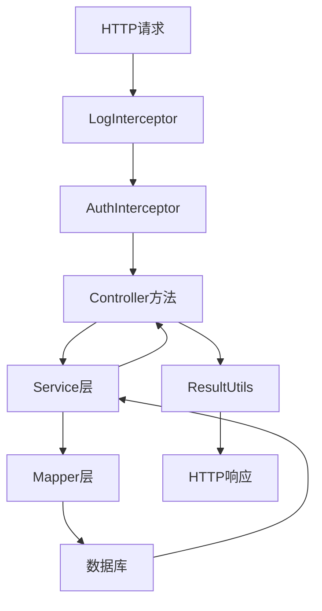

**图示来源**
- [LogInterceptor.java](file://yun-docker-master/src/main/java/com/lfc/yundocker/aop/LogInterceptor.java)
- [AuthInterceptor.java](file://yun-docker-master/src/main/java/com/lfc/yundocker/aop/AuthInterceptor.java)
- [UserController.java](file://yun-docker-master/src/main/java/com/lfc/yundocker/controller/UserController.java)

## 核心控制器分析

### UserController分析

UserController负责用户相关的所有操作，包括用户注册、登录、信息查询和管理功能。该控制器展示了完整的CRUD操作实现模式。

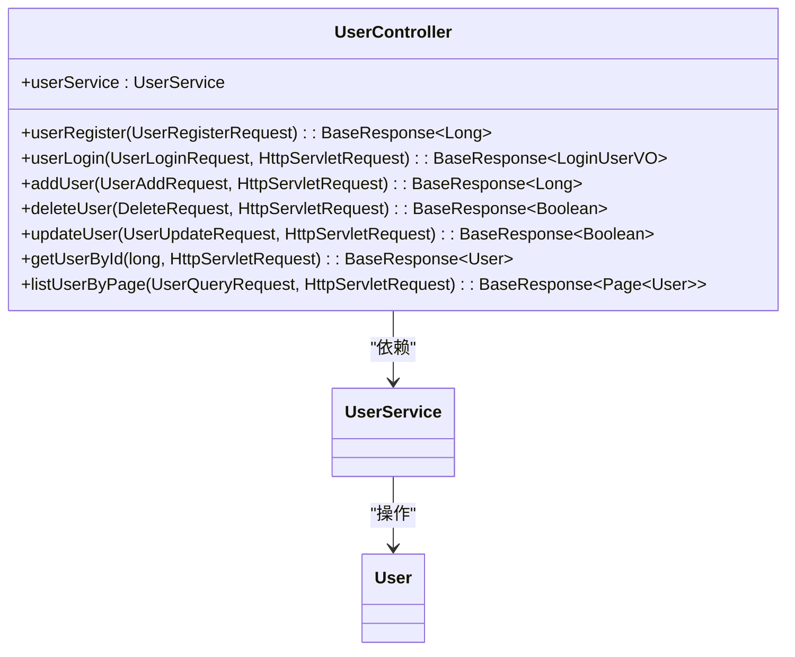

**图示来源**
- [UserController.java](file://yun-docker-master/src/main/java/com/lfc/yundocker/controller/UserController.java)
- [UserService.java](file://yun-docker-master/src/main/java/com/lfc/yundocker/service/UserService.java)

**控制器来源**
- [UserController.java](file://yun-docker-master/src/main/java/com/lfc/yundocker/controller/UserController.java#L31-L308)

### ContainerController分析

ContainerController是系统的核心控制器之一，负责容器的全生命周期管理，包括创建、启动、停止、重启和删除等操作。

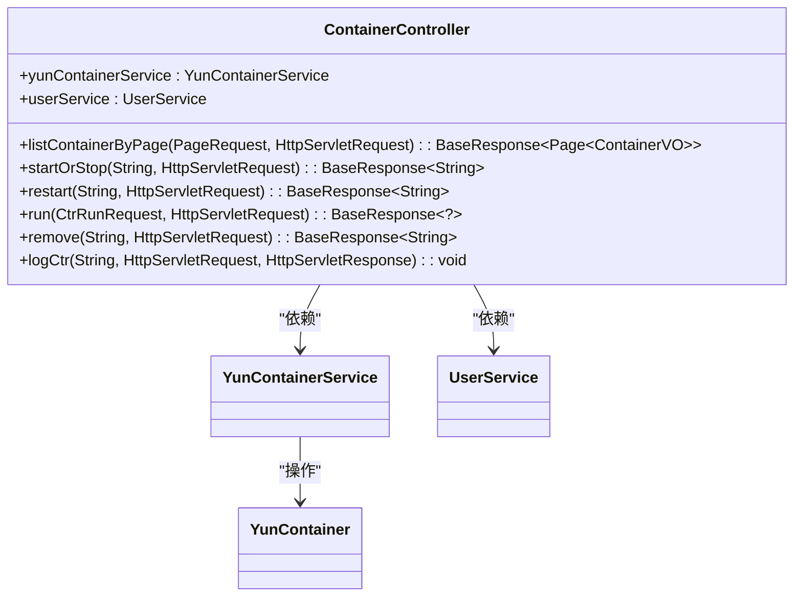

**图示来源**
- [ContainerController.java](file://yun-docker-master/src/main/java/com/lfc/yundocker/controller/ContainerController.java)
- [YunContainerService.java](file://yun-docker-master/src/main/java/com/lfc/yundocker/service/YunContainerService.java)

**控制器来源**
- [ContainerController.java](file://yun-docker-master/src/main/java/com/lfc/yundocker/controller/ContainerController.java#L29-L172)

### AliPayController分析

AliPayController专门处理支付宝支付相关的业务，包括生成支付链接和处理异步回调通知。

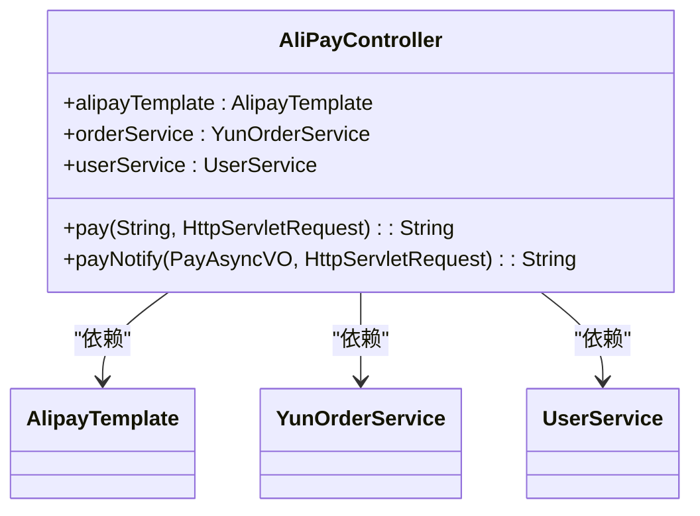

**图示来源**
- [AliPayController.java](file://yun-docker-master/src/main/java/com/lfc/yundocker/controller/AliPayController.java)
- [AlipayTemplate.java](file://yun-docker-master/src/main/java/com/lfc/yundocker/manager/AlipayTemplate.java)

**控制器来源**
- [AliPayController.java](file://yun-docker-master/src/main/java/com/lfc/yundocker/controller/AliPayController.java#L29-L112)

## 权限校验机制

系统通过自定义注解和AOP切面实现了灵活的权限校验机制。

### AuthCheck注解

`@AuthCheck`注解用于标记需要权限校验的接口方法，通过mustRole属性指定所需角色。

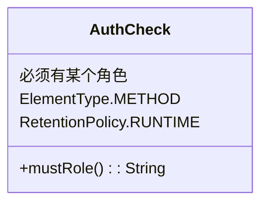

**注解来源**
- [AuthCheck.java](file://yun-docker-master/src/main/java/com/lfc/yundocker/annotation/AuthCheck.java#L16-L28)

### AuthInterceptor拦截器

AuthInterceptor是基于AOP实现的权限校验拦截器，通过@Around注解在方法执行前后进行权限检查。

```mermaid
flowchart TD
A[方法调用] --> B{是否有@AuthCheck注解?}
B --> |是| C[获取mustRole]
C --> D[获取当前登录用户]
D --> E{用户角色匹配?}
E --> |是| F[放行]
E --> |否| G[抛出权限异常]
B --> |否| F[放行]
```

**拦截器来源**
- [AuthInterceptor.java](file://yun-docker-master/src/main/java/com/lfc/yundocker/aop/AuthInterceptor.java#L26-L68)

## 统一响应与异常处理

系统通过ResultUtils工具类和BaseResponse数据结构实现了统一的响应格式。

### ResultUtils工具类

ResultUtils提供了统一的响应封装方法，确保所有接口返回格式一致。

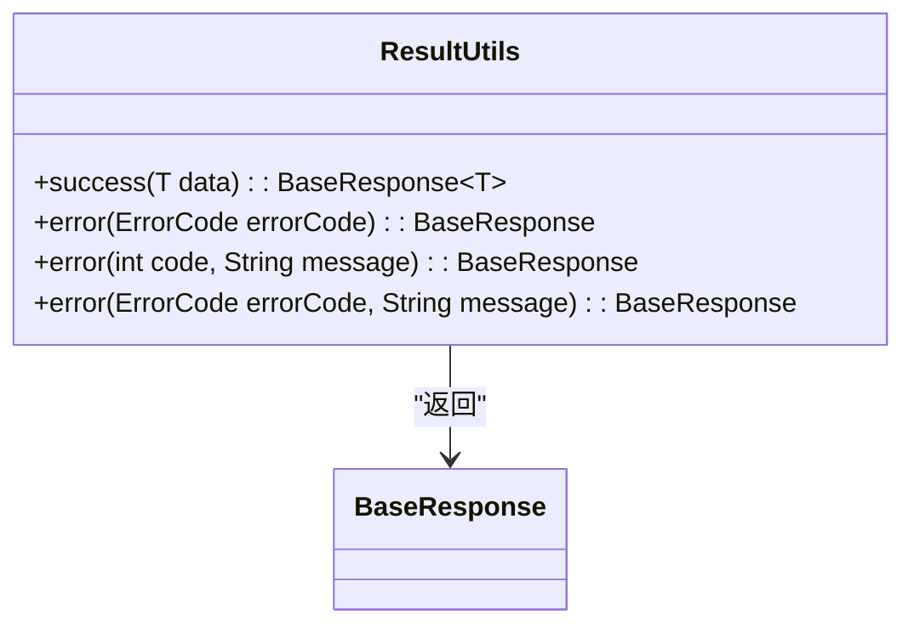

**工具类来源**
- [ResultUtils.java](file://yun-docker-common/src/main/java/com/lfc/yundocker/common/util/ResultUtils.java#L12-L55)

### 响应数据结构

BaseResponse是所有接口的统一返回结构，包含code、data和message三个核心字段。

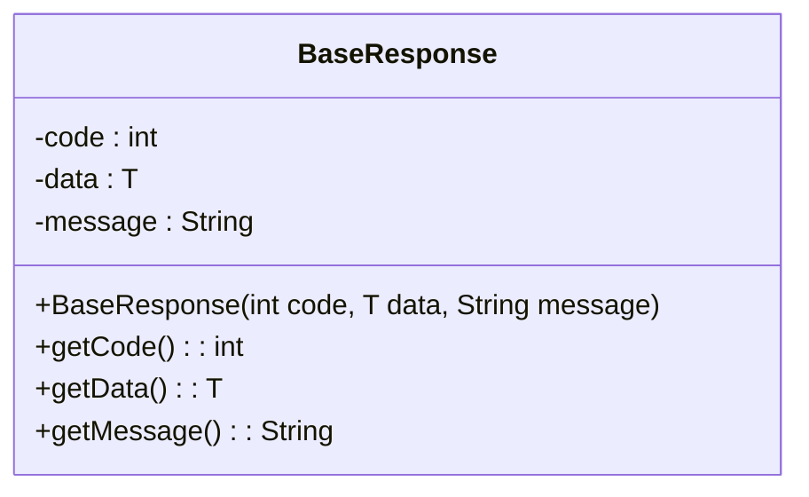

**数据结构来源**
- [BaseResponse.java](file://yun-docker-common/src/main/java/com/lfc/yundocker/common/model/dto/BaseResponse.java)

## 容器创建流程时序分析

ContainerController中创建容器接口的完整处理流程涉及多个组件的协同工作。

```mermaid
sequenceDiagram
participant Client as 客户端
participant ContainerController as ContainerController
participant UserService as UserService
participant YunContainerService as YunContainerService
Client->>ContainerController : POST /container/run
activate ContainerController
ContainerController->>ContainerController : 参数校验
ContainerController->>UserService : getLoginUser(request)
activate UserService
UserService-->>ContainerController : 返回登录用户
deactivate UserService
ContainerController->>UserService : hasBalance(userId)
activate UserService
UserService-->>ContainerController : 返回余额状态
deactivate UserService
alt 余额不足
ContainerController-->>Client : 返回余额不足错误
deactivate ContainerController
else 余额充足
ContainerController->>YunContainerService : run(ctrRunRequest, loginUser)
activate YunContainerService
YunContainerService-->>ContainerController : 处理结果
deactivate YunContainerService
ContainerController-->>Client : 返回成功响应
deactivate ContainerController
end
```

**时序图来源**
- [ContainerController.java](file://yun-docker-master/src/main/java/com/lfc/yundocker/controller/ContainerController.java#L117-L132)
- [YunContainerService.java](file://yun-docker-master/src/main/java/com/lfc/yundocker/service/YunContainerService.java#L27)
- [UserService.java](file://yun-docker-master/src/main/java/com/lfc/yundocker/service/UserService.java#L120)

## 支付宝回调处理

AliPayController处理支付宝异步回调的流程设计确保了支付状态的准确更新。

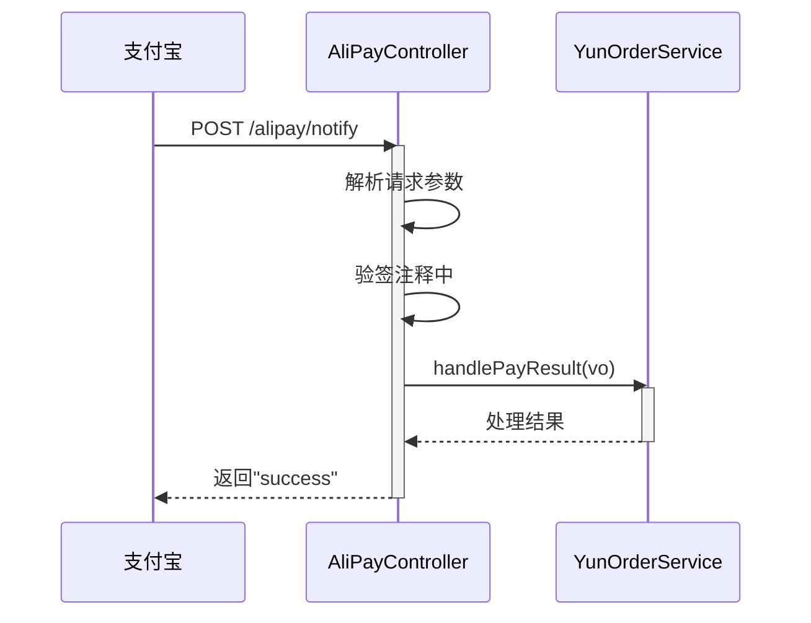

**回调处理来源**
- [AliPayController.java](file://yun-docker-master/src/main/java/com/lfc/yundocker/controller/AliPayController.java#L74-L97)
- [YunOrderService.java](file://yun-docker-master/src/main/java/com/lfc/yundocker/service/YunOrderService.java)

## 日志记录机制

系统通过LogInterceptor实现全面的请求日志记录，便于问题排查和性能分析。

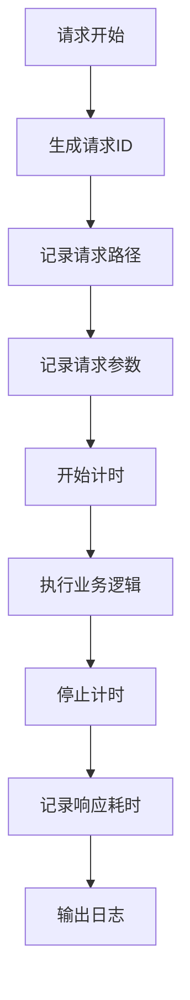

**日志拦截器来源**
- [LogInterceptor.java](file://yun-docker-master/src/main/java/com/lfc/yundocker/aop/LogInterceptor.java#L22-L56)

## 数据结构与转换

系统通过VO/DTO模式实现了数据的安全传输和视图展示。

### CtrRunRequest数据结构

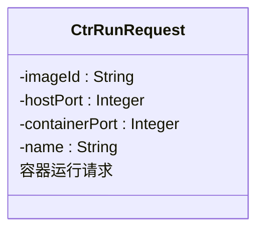

**请求对象来源**
- [CtrRunRequest.java](file://yun-docker-common/src/main/java/com/lfc/yundocker/common/model/dto/CtrRunRequest.java#L12-L34)

### ContainerVO数据结构

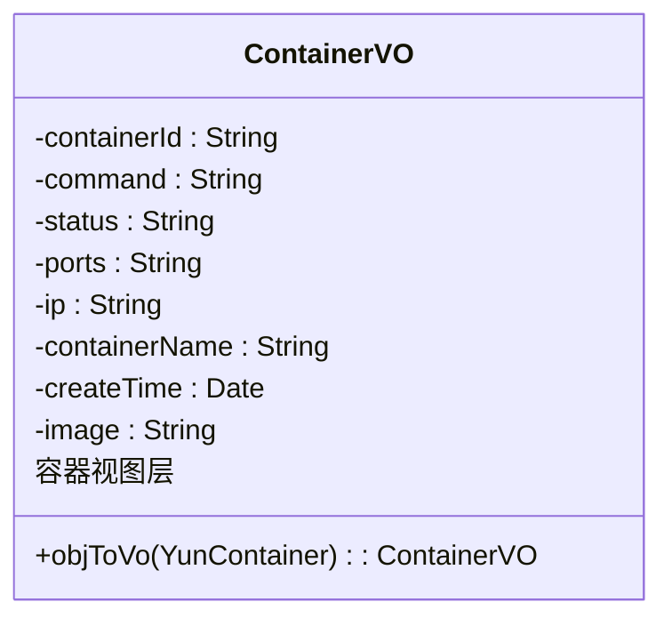

**视图对象来源**
- [ContainerVO.java](file://yun-docker-common/src/main/java/com/lfc/yundocker/common/model/vo/ContainerVO.java#L18-L82)

## 总结

云Docker系统的控制器层设计体现了良好的分层架构和关注点分离原则。通过注解驱动的权限校验、AOP实现的横切关注点、统一的响应封装和清晰的数据结构转换，系统实现了高内聚、低耦合的设计目标。各控制器职责明确，ContainerController作为核心业务控制器，完整展示了从请求接收、权限校验到服务调用的完整处理流程，为系统的稳定运行提供了坚实基础。