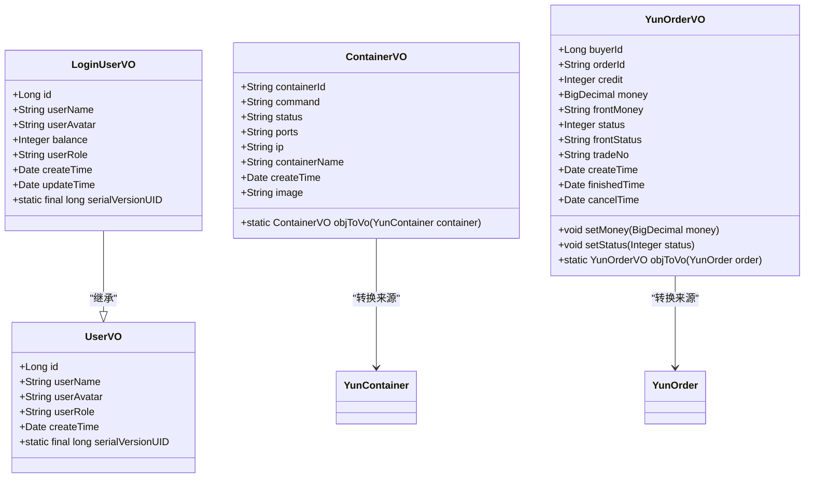
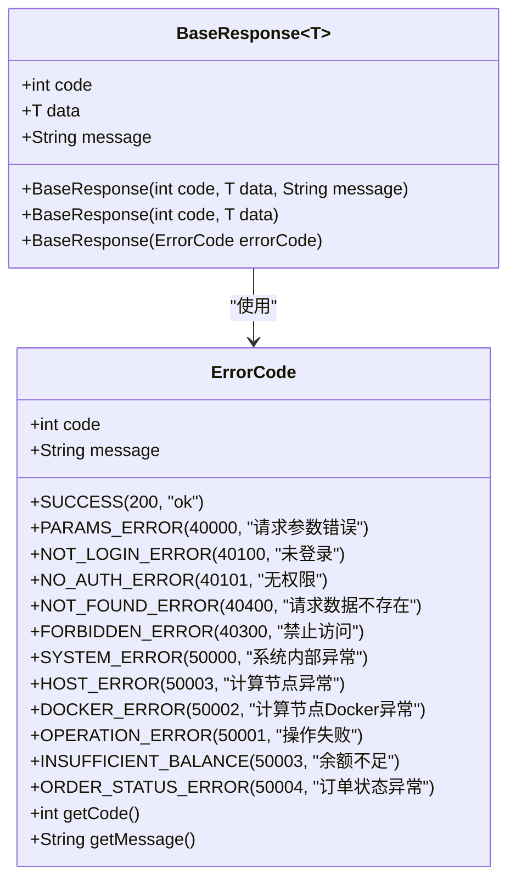
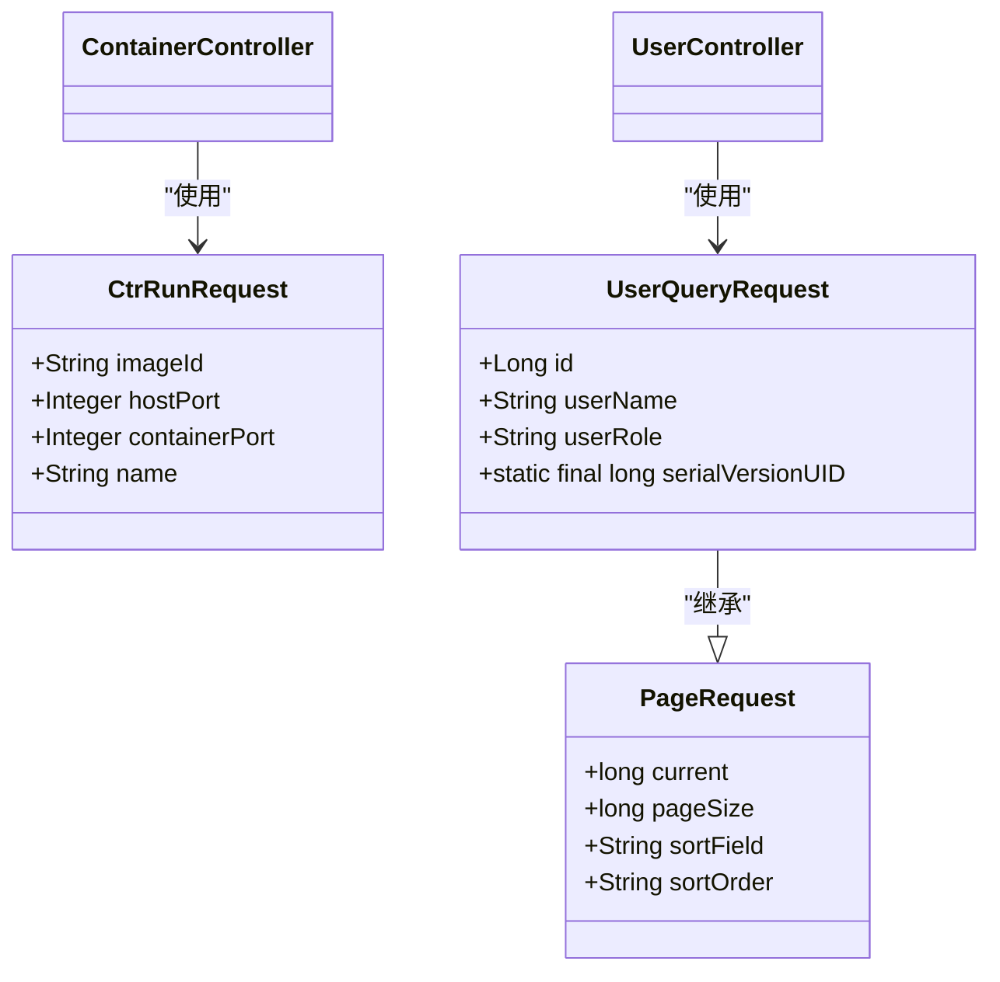

# 数据模型与视图对象

<cite>
**本文档引用文件**  
- [User.java](file://yun-docker-master/src/main/java/com/lfc/yundocker/common/model/entity/User.java)
- [YunContainer.java](file://yun-docker-master/src/main/java/com/lfc/yundocker/common/model/entity/YunContainer.java)
- [YunImage.java](file://yun-docker-master/src/main/java/com/lfc/yundocker/common/model/entity/YunImage.java)
- [YunOrder.java](file://yun-docker-master/src/main/java/com/lfc/yundocker/common/model/entity/YunOrder.java)
- [UserVO.java](file://yun-docker-master/src/main/java/com/lfc/yundocker/common/model/vo/UserVO.java)
- [ContainerVO.java](file://yun-docker-master/src/main/java/com/lfc/yundocker/common/model/vo/ContainerVO.java)
- [YunOrderVO.java](file://yun-docker-master/src/main/java/com/lfc/yundocker/common/model/vo/YunOrderVO.java)
- [LoginUserVO.java](file://yun-docker-master/src/main/java/com/lfc/yundocker/common/model/vo/LoginUserVO.java)
- [BaseResponse.java](file://yun-docker-common/src/main/java/com/lfc/yundocker/common/model/dto/BaseResponse.java)
- [CtrRunRequest.java](file://yun-docker-common/src/main/java/com/lfc/yundocker/common/model/dto/CtrRunRequest.java)
- [UserServiceImpl.java](file://yun-docker-master/src/main/java/com/lfc/yundocker/service/impl/UserServiceImpl.java)
- [YunContainerServiceImpl.java](file://yun-docker-master/src/main/java/com/lfc/yundocker/service/impl/YunContainerServiceImpl.java)
- [UserRoleEnum.java](file://yun-docker-common/src/main/java/com/lfc/yundocker/common/model/enums/UserRoleEnum.java)
- [ErrorCode.java](file://yun-docker-common/src/main/java/com/lfc/yundocker/common/model/enums/ErrorCode.java)
- [UserQueryRequest.java](file://yun-docker-common/src/main/java/com/lfc/yundocker/common/model/dto/user/UserQueryRequest.java)
- [PageRequest.java](file://yun-docker-common/src/main/java/com/lfc/yundocker/common/model/dto/PageRequest.java)
</cite>

## 目录
1. [核心实体类定义](#核心实体类定义)
2. [视图对象（VO）设计](#视图对象vo设计)
3. [统一响应体 BaseResponse](#统一响应体-baseresponse)
4. [数据传输对象（DTO）](#数据传输对象dto)
5. [VO/Entity 转换机制](#voentity-转换机制)
6. [Lombok 注解应用](#lombok-注解应用)

## 核心实体类定义

本系统在 `yun-docker-master` 模块的 `common/model/entity` 包中定义了核心数据实体类，用于映射数据库表结构。

### User 实体
`User` 类表示系统用户，映射数据库 `user` 表，主要字段包括：
- **id**: 用户唯一标识（Long类型，自增主键）
- **userAccount**: 用户账号（String类型，唯一标识）
- **userPassword**: 用户密码（String类型，MD5加密存储）
- **userName**: 用户昵称（String类型）
- **userAvatar**: 用户头像URL（String类型）
- **phone**: 用户手机号（String类型）
- **balance**: 用户余额（Integer类型，单位为积分）
- **userRole**: 用户角色（String类型，可取值：user/admin/ban）
- **createTime**: 创建时间（Date类型）
- **updateTime**: 更新时间（Date类型）
- **isDelete**: 逻辑删除标志（Integer类型，MyBatis Plus `@TableLogic` 注解）

该实体通过 `@TableName("user")` 指定表名，并使用 Lombok 的 `@Data` 注解自动生成 getter、setter、toString 等方法。

### YunContainer 实体
`YunContainer` 类表示 Docker 容器实例，映射数据库 `yun_container` 表，主要字段包括：
- **id**: 主键（String类型，UUID）
- **imageId**: 镜像ID（Long类型，关联 `YunImage`）
- **userId**: 创建用户ID（Long类型，关联 `User`）
- **containerId**: 容器ID（String类型，Docker生成的ID）
- **command**: 启动命令（String类型）
- **status**: 容器状态（String类型，如：running, exited, paused）
- **ports**: 端口映射信息（String类型，格式如：9081:6379/tcp）
- **containerName**: 容器名称（String类型，用户自定义）
- **createTime**: 创建时间（Date类型）
- **updateTime**: 更新时间（Date类型）

该实体使用了 `@Accessors(chain = true)` 实现链式调用，`@EqualsAndHashCode(callSuper = false)` 确保正确生成 equals 和 hashCode 方法。

### YunImage 实体
`YunImage` 类表示 Docker 镜像，映射数据库 `yun_image` 表，主要字段包括：
- **id**: 主键（Long类型，自增）
- **repository**: 镜像仓库名（String类型，如：redis, nginx）
- **tag**: 镜像标签（String类型，如：latest, 6.0）
- **imageId**: 镜像ID（String类型，Docker生成的ID）
- **imageSize**: 镜像大小（Double类型，单位MB）
- **imageType**: 镜像类型（Integer类型，0-公共，1-私有）
- **userId**: 创建用户ID（Long类型，仅私有镜像）
- **port**: 对外暴露的端口号（int类型）
- **createTime**: 创建时间（Date类型）
- **updateIme**: 更新时间（Date类型，字段名疑似拼写错误，应为 updateTime）
- **isDelete**: 逻辑删除标志（Integer类型）

### YunOrder 实体
`YunOrder` 类表示充值订单，映射数据库 `yun_order` 表，主要字段包括：
- **id**: 主键（Long类型，自增）
- **buyerId**: 买家用户ID（Long类型）
- **orderId**: 订单ID（String类型，唯一标识）
- **credit**: 充值积分数量（Integer类型）
- **money**: 支付金额（BigDecimal类型，单位元）
- **status**: 订单状态（Integer类型，0-待支付, 1-支付成功, 2-已取消, 3-支付失败）
- **tradeNo**: 支付宝交易号（String类型）
- **createTime**: 创建时间（Date类型）
- **finishedTime**: 完成时间（Date类型）
- **cancelTime**: 取消时间（Date类型）
- **isDelete**: 逻辑删除标志（Integer类型）

**Section sources**
- [User.java](file://yun-docker-master/src/main/java/com/lfc/yundocker/common/model/entity/User.java#L1-L79)
- [YunContainer.java](file://yun-docker-master/src/main/java/com/lfc/yundocker/common/model/entity/YunContainer.java#L1-L79)
- [YunImage.java](file://yun-docker-master/src/main/java/com/lfc/yundocker/common/model/entity/YunImage.java#L1-L79)
- [YunOrder.java](file://yun-docker-master/src/main/java/com/lfc/yundocker/common/model/entity/YunOrder.java#L1-L77)

## 视图对象（VO）设计

视图对象（VO）用于向前端提供定制化、脱敏的数据结构，避免直接暴露实体类的敏感字段。

### UserVO
`UserVO` 是 `User` 实体的视图对象，用于在用户列表等场景中展示，其字段经过脱敏处理：
- **id**: 用户ID
- **userName**: 用户昵称
- **userAvatar**: 用户头像
- **userRole**: 用户角色
- **createTime**: 创建时间

相比 `User` 实体，`UserVO` 移除了 `userAccount`、`userPassword`、`phone` 等敏感字段，符合安全要求。

### LoginUserVO
`LoginUserVO` 是已登录用户的视图对象，包含比 `UserVO` 更多的信息，用于登录后返回用户信息：
- **id**: 用户ID
- **userName**: 用户昵称
- **userAvatar**: 用户头像
- **balance**: 余额
- **userRole**: 用户角色
- **createTime**: 创建时间
- **updateTime**: 更新时间

此对象在用户登录成功后返回，包含了用户余额等业务关键信息。

### ContainerVO
`ContainerVO` 是 `YunContainer` 实体的视图对象，用于在容器列表中展示：
- **containerId**: 容器ID
- **command**: 启动命令
- **status**: 状态
- **ports**: 端口
- **ip**: 容器IP（由服务端填充）
- **containerName**: 容器名称
- **createTime**: 创建时间
- **image**: 镜像名称（repository:tag，由服务端从 `YunImage` 查询并填充）

`ContainerVO` 通过服务层的 `getContainerVOPage` 方法，将 `YunContainer` 实体与 `YunImage` 信息结合，形成更完整的视图。

### YunOrderVO
`YunOrderVO` 是 `YunOrder` 实体的视图对象，增加了前端友好的字段：
- **buyerId**: 买家ID
- **orderId**: 订单ID
- **credit**: 充值积分
- **money**: 支付金额（BigDecimal）
- **frontMoney**: 前端金额（String类型，格式化为两位小数）
- **status**: 状态码
- **frontStatus**: 前端状态（String类型，如“待支付”、“支付成功”）
- **tradeNo**: 交易号
- **createTime**: 创建时间
- **finishedTime**: 完成时间
- **cancelTime**: 取消时间

通过重写 `setMoney` 和 `setStatus` 方法，`YunOrderVO` 在设置原始数据的同时，自动生成了适合前端展示的 `frontMoney` 和 `frontStatus` 字段。



**Diagram sources**
- [UserVO.java](file://yun-docker-master/src/main/java/com/lfc/yundocker/common/model/vo/UserVO.java#L1-L43)
- [LoginUserVO.java](file://yun-docker-master/src/main/java/com/lfc/yundocker/common/model/vo/LoginUserVO.java#L1-L54)
- [ContainerVO.java](file://yun-docker-master/src/main/java/com/lfc/yundocker/common/model/vo/ContainerVO.java#L1-L83)
- [YunOrderVO.java](file://yun-docker-master/src/main/java/com/lfc/yundocker/common/model/vo/YunOrderVO.java#L1-L99)

**Section sources**
- [UserVO.java](file://yun-docker-master/src/main/java/com/lfc/yundocker/common/model/vo/UserVO.java#L1-L43)
- [LoginUserVO.java](file://yun-docker-master/src/main/java/com/lfc/yundocker/common/model/vo/LoginUserVO.java#L1-L54)
- [ContainerVO.java](file://yun-docker-master/src/main/java/com/lfc/yundocker/common/model/vo/ContainerVO.java#L1-L83)
- [YunOrderVO.java](file://yun-docker-master/src/main/java/com/lfc/yundocker/common/model/vo/YunOrderVO.java#L1-L99)

## 统一响应体 BaseResponse

`BaseResponse<T>` 是系统中所有 API 接口的统一响应封装类，位于 `yun-docker-common` 模块中，确保了前后端交互的数据结构一致性。

### 设计规范
- **code**: 响应状态码（int类型），用于表示请求结果。例如：200表示成功，400表示参数错误，500表示系统错误。
- **data**: 响应数据（泛型T），携带具体的业务数据，如用户信息、订单列表等。
- **message**: 响应消息（String类型），用于返回错误描述或成功提示。

### 使用方式
`BaseResponse` 提供了多个构造函数：
1. `BaseResponse(int code, T data, String message)`: 最完整的构造函数。
2. `BaseResponse(int code, T data)`: 省略消息，默认为空字符串。
3. `BaseResponse(ErrorCode errorCode)`: 通过 `ErrorCode` 枚举快速创建错误响应。

在控制器（Controller）中，服务层返回的数据会被包装成 `BaseResponse` 返回给前端。例如，用户登录成功后，返回 `BaseResponse<LoginUserVO>`。



**Diagram sources**
- [BaseResponse.java](file://yun-docker-common/src/main/java/com/lfc/yundocker/common/model/dto/BaseResponse.java#L1-L37)
- [ErrorCode.java](file://yun-docker-common/src/main/java/com/lfc/yundocker/common/model/enums/ErrorCode.java#L1-L49)

**Section sources**
- [BaseResponse.java](file://yun-docker-common/src/main/java/com/lfc/yundocker/common/model/dto/BaseResponse.java#L1-L37)

## 数据传输对象（DTO）

数据传输对象（DTO）用于封装接口的请求参数，实现前后端的数据传递。

### CtrRunRequest
`CtrRunRequest` 是启动容器的请求参数对象，用于 `ContainerController` 的 `run` 接口：
- **imageId**: 镜像ID（String类型，非数据库主键）
- **hostPort**: 宿主机端口（Integer类型）
- **containerPort**: 容器端口（Integer类型）
- **name**: 自定义容器名称（String类型）

该对象通过 `@Data` 注解简化了代码，前端通过 JSON 发送此对象，后端自动反序列化。

### 其他 DTO
系统中还定义了其他 DTO，如：
- **UserQueryRequest**: 用户查询请求，继承 `PageRequest`，包含分页和查询条件。
- **PageRequest**: 分页请求基类，包含 `current`（当前页）、`pageSize`（页大小）、`sortField`（排序字段）、`sortOrder`（排序顺序）。

这些 DTO 作为控制器方法的参数，使得接口定义清晰，参数校验集中。



**Diagram sources**
- [CtrRunRequest.java](file://yun-docker-common/src/main/java/com/lfc/yundocker/common/model/dto/CtrRunRequest.java#L1-L35)
- [UserQueryRequest.java](file://yun-docker-common/src/main/java/com/lfc/yundocker/common/model/dto/user/UserQueryRequest.java#L1-L34)
- [PageRequest.java](file://yun-docker-common/src/main/java/com/lfc/yundocker/common/model/dto/PageRequest.java#L1-L34)

**Section sources**
- [CtrRunRequest.java](file://yun-docker-common/src/main/java/com/lfc/yundocker/common/model/dto/CtrRunRequest.java#L1-L35)
- [UserQueryRequest.java](file://yun-docker-common/src/main/java/com/lfc/yundocker/common/model/dto/user/UserQueryRequest.java#L1-L34)
- [PageRequest.java](file://yun-docker-common/src/main/java/com/lfc/yundocker/common/model/dto/PageRequest.java#L1-L34)

## VO/Entity 转换机制

系统通过服务实现类（ServiceImpl）中的方法完成 Entity 到 VO 的转换，主要采用手动转换方式。

### 手动转换
以 `ContainerVO` 为例，其内部定义了静态方法 `objToVo`：
```java
public static ContainerVO objToVo(YunContainer container) {
    if (container == null) {
        return null;
    }
    ContainerVO containerVO = new ContainerVO();
    BeanUtils.copyProperties(container, containerVO);
    return containerVO;
}
```
该方法使用 Spring 的 `BeanUtils.copyProperties` 将同名属性从 `YunContainer` 复制到 `ContainerVO`，然后在服务层进行额外的数据填充（如 `image` 和 `ip`）。

### 服务层转换
在 `YunContainerServiceImpl` 中，`getContainerVOPage` 方法负责将 `Page<YunContainer>` 转换为 `Page<ContainerVO>`：
1. 获取 `YunContainer` 分页数据。
2. 提取所有 `imageId`，批量查询 `YunImage` 信息。
3. 遍历每个 `YunContainer`，调用 `ContainerVO.objToVo()` 创建 `ContainerVO`。
4. 填充 `image`（repository:tag）和 `ip` 字段。
5. 返回新的 `Page<ContainerVO>`。

这种方式保证了数据转换的灵活性和性能，避免了在循环中进行数据库查询。

### 用户相关转换
在 `UserServiceImpl` 中，提供了 `getUserVO(User user)` 和 `getLoginUserVO(User user)` 方法，根据不同的业务场景，将 `User` 实体转换为对应的 VO 对象。

**Section sources**
- [ContainerVO.java](file://yun-docker-master/src/main/java/com/lfc/yundocker/common/model/vo/ContainerVO.java#L73-L82)
- [YunContainerServiceImpl.java](file://yun-docker-master/src/main/java/com/lfc/yundocker/service/impl/YunContainerServiceImpl.java#L74-L106)
- [UserServiceImpl.java](file://yun-docker-master/src/main/java/com/lfc/yundocker/service/impl/UserServiceImpl.java#L201-L230)

## Lombok 注解应用

系统广泛使用 Lombok 注解来减少样板代码（boilerplate code），提高开发效率。

### 核心注解
- **@Data**: 自动生成类的 getter、setter、toString、equals 和 hashCode 方法。在 `User`、`YunContainer`、`BaseResponse` 等几乎所有 POJO 类上使用。
- **@EqualsAndHashCode**: 精细控制 equals 和 hashCode 的生成。在 `YunContainer` 和 `ContainerVO` 上使用 `callSuper = false`，因为它们没有继承关系，但需要明确指定。
- **@Accessors(chain = true)**: 启用链式调用（如 `user.setName("test").setAge(18)`）。在 `YunContainer` 和 `ContainerVO` 上使用。
- **@Slf4j**: 自动生成日志记录器（logger），在 `UserServiceImpl` 和 `YunContainerServiceImpl` 等服务类上使用，通过 `log.info()` 等方法记录日志。

### 优势
使用 Lombok 后，原本需要数十行代码的 POJO 类，现在只需几行注解即可完成，极大地提升了代码的简洁性和可读性。同时，减少了手动编写 getter/setter 时可能引入的错误。

**Section sources**
- [User.java](file://yun-docker-master/src/main/java/com/lfc/yundocker/common/model/entity/User.java#L15)
- [YunContainer.java](file://yun-docker-master/src/main/java/com/lfc/yundocker/common/model/entity/YunContainer.java#L18-L21)
- [ContainerVO.java](file://yun-docker-master/src/main/java/com/lfc/yundocker/common/model/vo/ContainerVO.java#L18-L20)
- [UserServiceImpl.java](file://yun-docker-master/src/main/java/com/lfc/yundocker/service/impl/UserServiceImpl.java#L39)
- [YunContainerServiceImpl.java](file://yun-docker-master/src/main/java/com/lfc/yundocker/service/impl/YunContainerServiceImpl.java#L41)