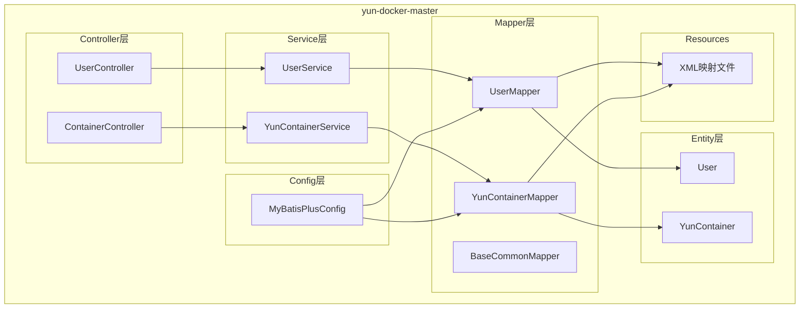
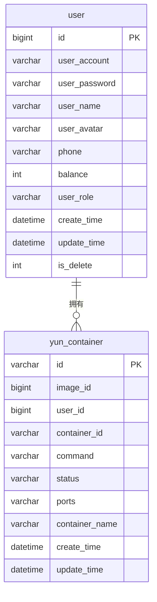
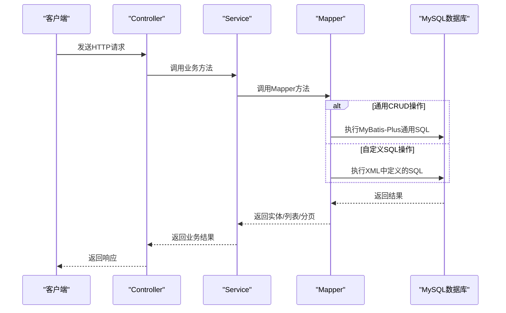
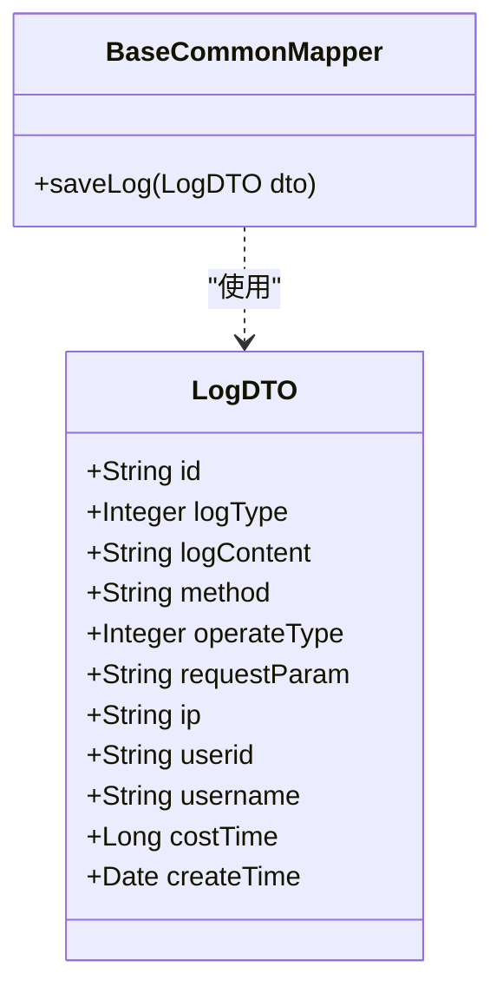
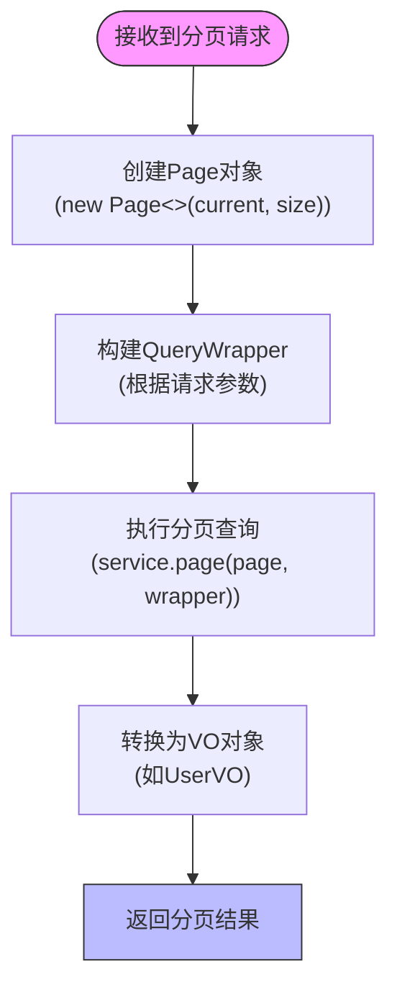
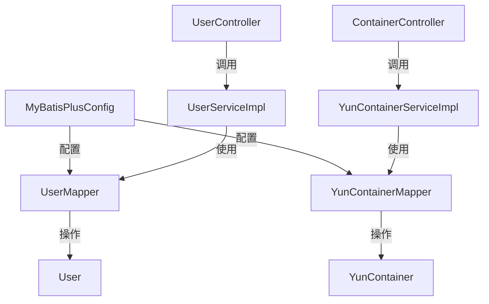

# 数据访问层（Mapper）

<cite>
**本文档中引用的文件**   
- [BaseCommonMapper.java](file://yun-docker-master/src/main/java/com/lfc/yundocker/mapper/BaseCommonMapper.java)
- [UserMapper.java](file://yun-docker-master/src/main/java/com/lfc/yundocker/mapper/UserMapper.java)
- [YunContainerMapper.java](file://yun-docker-master/src/main/java/com/lfc/yundocker/mapper/YunContainerMapper.java)
- [User.java](file://yun-docker-master/src/main/java/com/lfc/yundocker/common/model/entity/User.java)
- [YunContainer.java](file://yun-docker-master/src/main/java/com/lfc/yundocker/common/model/entity/YunContainer.java)
- [MyBatisPlusConfig.java](file://yun-docker-master/src/main/java/com/lfc/yundocker/config/MyBatisPlusConfig.java)
- [BaseCommonMapper.xml](file://yun-docker-master/src/main/resources/mapper/BaseCommonMapper.xml)
- [UserMapper.xml](file://yun-docker-master/src/main/resources/mapper/UserMapper.xml)
- [YunContainerMapper.xml](file://yun-docker-master/src/main/resources/mapper/YunContainerMapper.xml)
- [PageRequest.java](file://yun-docker-common/src/main/java/com/lfc/yundocker/common/model/dto/PageRequest.java)
- [UserServiceImpl.java](file://yun-docker-master/src/main/java/com/lfc/yundocker/service/impl/UserServiceImpl.java)
- [YunContainerServiceImpl.java](file://yun-docker-master/src/main/java/com/lfc/yundocker/service/impl/YunContainerServiceImpl.java)
- [UserController.java](file://yun-docker-master/src/main/java/com/lfc/yundocker/controller/UserController.java)
- [ContainerController.java](file://yun-docker-master/src/main/java/com/lfc/yundocker/controller/ContainerController.java)
- [SqlUtils.java](file://yun-docker-common/src/main/java/com/lfc/yundocker/common/util/SqlUtils.java)
- [UserQueryRequest.java](file://yun-docker-common/src/main/java/com/lfc/yundocker/common/model/dto/user/UserQueryRequest.java)
</cite>

## 目录
1. [引言](#引言)
2. [项目结构](#项目结构)
3. [核心组件](#核心组件)
4. [架构概述](#架构概述)
5. [详细组件分析](#详细组件分析)
6. [依赖分析](#依赖分析)
7. [性能考虑](#性能考虑)
8. [故障排除指南](#故障排除指南)
9. [结论](#结论)

## 引言
本文档详细说明了 `yun-docker-master` 模块中数据访问层（Mapper）的设计与实现，基于 MyBatis-Plus 框架完成与 MySQL 数据库的交互。重点分析了实体类（如 User、YunContainer）与数据库表的映射关系，XML 映射文件中自定义 SQL 的编写逻辑（包括复杂查询和联表操作），以及 BaseCommonMapper 提供的通用 DAO 方法扩展机制。结合 UserMapper 和 YunContainerMapper 的具体方法，阐述了如何实现分页查询（PageRequest）、条件构造（QueryWrapper）及数据持久化操作。同时涵盖 MyBatis-Plus 配置（MyBatisPlusConfig）、主键生成策略、逻辑删除等特性在项目中的实际应用。

## 项目结构
`yun-docker-master` 模块是整个系统的核心服务模块，负责处理业务逻辑、提供 REST API 接口，并通过 MyBatis-Plus 与数据库进行交互。其数据访问层（Mapper）位于 `src/main/java/com/lfc/yundocker/mapper` 包下，遵循 MyBatis-Plus 的标准设计模式，每个 Mapper 接口都继承自 `BaseMapper<T>`，从而获得丰富的通用 CRUD 方法。

**图源**
- [UserMapper.java](file://yun-docker-master/src/main/java/com/lfc/yundocker/mapper/UserMapper.java)
- [YunContainerMapper.java](file://yun-docker-master/src/main/java/com/lfc/yundocker/mapper/YunContainerMapper.java)
- [UserController.java](file://yun-docker-master/src/main/java/com/lfc/yundocker/controller/UserController.java)
- [ContainerController.java](file://yun-docker-master/src/main/java/com/lfc/yundocker/controller/ContainerController.java)
- [User.java](file://yun-docker-master/src/main/java/com/lfc/yundocker/common/model/entity/User.java)
- [YunContainer.java](file://yun-docker-master/src/main/java/com/lfc/yundocker/common/model/entity/YunContainer.java)
- [MyBatisPlusConfig.java](file://yun-docker-master/src/main/java/com/lfc/yundocker/config/MyBatisPlusConfig.java)

**本节来源**
- [UserMapper.java](file://yun-docker-master/src/main/java/com/lfc/yundocker/mapper/UserMapper.java)
- [YunContainerMapper.java](file://yun-docker-master/src/main/java/com/lfc/yundocker/mapper/YunContainerMapper.java)
- [UserController.java](file://yun-docker-master/src/main/java/com/lfc/yundocker/controller/UserController.java)
- [ContainerController.java](file://yun-docker-master/src/main/java/com/lfc/yundocker/controller/ContainerController.java)

## 核心组件

### 实体类与数据库表映射
项目中的实体类位于 `com.lfc.yundocker.common.model.entity` 包下，通过 Lombok 注解简化代码，并使用 MyBatis-Plus 的注解实现与数据库表的精确映射。

- **User 实体类**：映射到数据库的 `user` 表。通过 `@TableName(value = "user")` 指定表名。主键 `id` 使用 `@TableId(type = IdType.AUTO)` 注解，表明其主键生成策略为数据库自增。`isDelete` 字段使用 `@TableLogic` 注解，实现了逻辑删除功能，当执行删除操作时，该字段的值会从 0 变为 1，而非物理删除记录。
- **YunContainer 实体类**：映射到数据库的 `yun_container` 表。同样使用 `@TableName("yun_container")` 指定表名。其主键 `id` 类型为 `String`，也采用数据库自增策略 `@TableId(type = IdType.AUTO)`。该实体类代表了系统中的容器实例，包含了容器ID、镜像ID、用户ID、状态、端口等关键信息。

**图源**
- [User.java](file://yun-docker-master/src/main/java/com/lfc/yundocker/common/model/entity/User.java)
- [YunContainer.java](file://yun-docker-master/src/main/java/com/lfc/yundocker/common/model/entity/YunContainer.java)

**本节来源**
- [User.java](file://yun-docker-master/src/main/java/com/lfc/yundocker/common/model/entity/User.java)
- [YunContainer.java](file://yun-docker-master/src/main/java/com/lfc/yundocker/common/model/entity/YunContainer.java)

## 架构概述
系统的数据访问架构基于 MyBatis-Plus 框架构建，形成了清晰的分层结构。Controller 层接收 HTTP 请求，调用 Service 层的业务逻辑。Service 层作为核心，协调多个 Mapper 进行数据操作。Mapper 层则直接与数据库交互，既可以使用 MyBatis-Plus 提供的通用方法，也可以通过 XML 文件定义复杂的自定义 SQL。

MyBatis-Plus 的核心优势在于其强大的 `BaseMapper<T>` 接口，它为所有实体提供了 `insert`, `deleteById`, `updateById`, `selectById`, `selectList`, `selectPage` 等通用方法，极大地减少了基础 DAO 代码的编写。项目中的 `UserMapper` 和 `YunContainerMapper` 都继承了 `BaseMapper<T>`，因此可以直接使用这些方法。

**图源**
- [UserMapper.java](file://yun-docker-master/src/main/java/com/lfc/yundocker/mapper/UserMapper.java)
- [YunContainerMapper.java](file://yun-docker-master/src/main/java/com/lfc/yundocker/mapper/YunContainerMapper.java)
- [UserServiceImpl.java](file://yun-docker-master/src/main/java/com/lfc/yundocker/service/impl/UserServiceImpl.java)
- [YunContainerServiceImpl.java](file://yun-docker-master/src/main/java/com/lfc/yundocker/service/impl/YunContainerServiceImpl.java)

## 详细组件分析

### BaseCommonMapper 与通用DAO扩展
`BaseCommonMapper` 是一个特殊的 Mapper 接口，它没有继承 `BaseMapper<T>`，而是定义了项目中通用的数据操作方法。目前，它提供了一个 `saveLog` 方法，用于将日志信息持久化到 `sys_log` 表中。

该方法通过 `@InterceptorIgnore(illegalSql = "true", tenantLine = "true")` 注解，指示 MyBatis-Plus 的拦截器忽略此 SQL 的非法 SQL 检查和租户行检查，这在执行一些特殊操作时非常有用。其对应的 SQL 定义在 `BaseCommonMapper.xml` 文件中，是一个标准的 `INSERT` 语句，将 `LogDTO` 对象的各个属性插入到日志表中。

**图源**
- [BaseCommonMapper.java](file://yun-docker-master/src/main/java/com/lfc/yundocker/mapper/BaseCommonMapper.java)
- [BaseCommonMapper.xml](file://yun-docker-master/src/main/resources/mapper/BaseCommonMapper.xml)

**本节来源**
- [BaseCommonMapper.java](file://yun-docker-master/src/main/java/com/lfc/yundocker/mapper/BaseCommonMapper.java)
- [BaseCommonMapper.xml](file://yun-docker-master/src/main/resources/mapper/BaseCommonMapper.xml)

### 分页查询与条件构造
项目中的分页查询功能是通过 MyBatis-Plus 的分页插件和 `Page` 对象实现的。前端请求携带 `PageRequest` 对象，该对象包含 `current`（当前页码）和 `pageSize`（每页大小）等分页参数。

在 `UserController` 中，`listUserByPage` 方法接收 `UserQueryRequest`（继承自 `PageRequest`），然后在 `UserServiceImpl` 中，通过 `userService.getQueryWrapper(userQueryRequest)` 方法构建查询条件 `QueryWrapper`。`QueryWrapper` 是 MyBatis-Plus 提供的条件构造器，它允许以链式编程的方式构建 SQL 的 WHERE 条件。例如，`queryWrapper.eq("user_account", userAccount)` 会生成 `WHERE user_account = ?` 的 SQL 片段。

**图源**
- [PageRequest.java](file://yun-docker-common/src/main/java/com/lfc/yundocker/common/model/dto/PageRequest.java)
- [UserQueryRequest.java](file://yun-docker-common/src/main/java/com/lfc/yundocker/common/model/dto/user/UserQueryRequest.java)
- [UserServiceImpl.java](file://yun-docker-master/src/main/java/com/lfc/yundocker/service/impl/UserServiceImpl.java)
- [UserController.java](file://yun-docker-master/src/main/java/com/lfc/yundocker/controller/UserController.java)

**本节来源**
- [PageRequest.java](file://yun-docker-common/src/main/java/com/lfc/yundocker/common/model/dto/PageRequest.java)
- [UserQueryRequest.java](file://yun-docker-common/src/main/java/com/lfc/yundocker/common/model/dto/user/UserQueryRequest.java)
- [UserServiceImpl.java](file://yun-docker-master/src/main/java/com/lfc/yundocker/service/impl/UserServiceImpl.java)
- [UserController.java](file://yun-docker-master/src/main/java/com/lfc/yundocker/controller/UserController.java)

### 自定义SQL与数据持久化
尽管 MyBatis-Plus 提供了强大的通用方法，但项目中仍存在需要编写自定义 SQL 的场景。`YunContainerMapper` 接口通过 `@Select` 注解定义了一个 `selectPortsList` 方法，直接执行 `SELECT ports FROM yun_container` 查询，用于获取所有容器的端口信息，这在端口校验逻辑中被 `YunPortServiceImpl` 所调用。

此外，`UserServiceImpl` 中的 `updateBalance` 方法展示了如何在不直接写 SQL 的情况下执行复杂的原子性更新。它使用 `UpdateWrapper` 并调用 `.setSql("balance = balance + ?")` 来直接设置 SQL 片段，从而实现 `balance = balance + cost` 的原子操作，避免了并发场景下的数据不一致问题。

**本节来源**
- [YunContainerMapper.java](file://yun-docker-master/src/main/java/com/lfc/yundocker/mapper/YunContainerMapper.java)
- [YunContainerMapper.xml](file://yun-docker-master/src/main/resources/mapper/YunContainerMapper.xml)
- [UserServiceImpl.java](file://yun-docker-master/src/main/java/com/lfc/yundocker/service/impl/UserServiceImpl.java)

## 依赖分析
数据访问层的依赖关系清晰明了。各 Mapper 接口依赖于对应的 Entity 类来定义操作的数据类型。Service 层通过 `@Resource` 注解注入 Mapper 实例，形成强依赖。Controller 层则依赖于 Service 层。MyBatis-Plus 的配置类 `MyBatisPlusConfig` 是整个数据访问层的基础，它通过 `@MapperScan` 注解扫描所有 Mapper 接口，并配置了分页插件。

**图源**
- [MyBatisPlusConfig.java](file://yun-docker-master/src/main/java/com/lfc/yundocker/config/MyBatisPlusConfig.java)
- [UserMapper.java](file://yun-docker-master/src/main/java/com/lfc/yundocker/mapper/UserMapper.java)
- [YunContainerMapper.java](file://yun-docker-master/src/main/java/com/lfc/yundocker/mapper/YunContainerMapper.java)
- [UserServiceImpl.java](file://yun-docker-master/src/main/java/com/lfc/yundocker/service/impl/UserServiceImpl.java)
- [YunContainerServiceImpl.java](file://yun-docker-master/src/main/java/com/lfc/yundocker/service/impl/YunContainerServiceImpl.java)
- [UserController.java](file://yun-docker-master/src/main/java/com/lfc/yundocker/controller/UserController.java)
- [ContainerController.java](file://yun-docker-master/src/main/java/com/lfc/yundocker/controller/ContainerController.java)

**本节来源**
- [MyBatisPlusConfig.java](file://yun-docker-master/src/main/java/com/lfc/yundocker/config/MyBatisPlusConfig.java)
- [UserMapper.java](file://yun-docker-master/src/main/java/com/lfc/yundocker/mapper/UserMapper.java)
- [YunContainerMapper.java](file://yun-docker-master/src/main/java/com/lfc/yundocker/mapper/YunContainerMapper.java)
- [UserServiceImpl.java](file://yun-docker-master/src/main/java/com/lfc/yundocker/service/impl/UserServiceImpl.java)
- [YunContainerServiceImpl.java](file://yun-docker-master/src/main/java/com/lfc/yundocker/service/impl/YunContainerServiceImpl.java)

## 性能考虑
在性能方面，项目采取了多项措施。首先，通过 MyBatis-Plus 的分页插件，避免了全表查询带来的性能瓶颈。其次，在 `UserController` 中，对 `pageSize` 进行了硬性限制（`size > 20` 抛出异常），有效防止了恶意爬虫或错误请求导致的数据库压力。此外，`updateBalance` 方法使用了原子性 SQL 更新，保证了余额操作的线程安全，避免了因并发导致的超卖等问题。

## 故障排除指南
- **Mapper 接口未被扫描**：检查 `MyBatisPlusConfig.java` 中的 `@MapperScan` 注解路径是否正确。
- **分页查询无效**：确认 `MyBatisPlusConfig` 中已正确配置 `PaginationInnerInterceptor` 分页插件。
- **逻辑删除失效**：确保实体类的逻辑删除字段正确使用了 `@TableLogic` 注解，并且数据库中该字段的默认值为 0（未删除）。
- **自定义 SQL 报错**：检查 XML 文件中的 SQL 语句是否正确，特别是字段名和表名是否与数据库一致。对于使用 `@Select` 注解的 SQL，确保其语法正确。

**本节来源**
- [MyBatisPlusConfig.java](file://yun-docker-master/src/main/java/com/lfc/yundocker/config/MyBatisPlusConfig.java)
- [User.java](file://yun-docker-master/src/main/java/com/lfc/yundocker/common/model/entity/User.java)
- [BaseCommonMapper.xml](file://yun-docker-master/src/main/resources/mapper/BaseCommonMapper.xml)

## 结论
`yun-docker-master` 模块的 Mapper 层设计合理，充分利用了 MyBatis-Plus 框架的优势，实现了高效、安全的数据访问。通过实体类注解实现了 ORM 映射，通过继承 `BaseMapper` 获得了丰富的通用方法，通过 `QueryWrapper` 实现了灵活的条件查询，通过分页插件保障了系统性能。同时，项目也保留了编写自定义 SQL 的能力，以应对复杂业务场景。整体架构清晰，代码复用率高，为系统的稳定运行提供了坚实的数据基础。