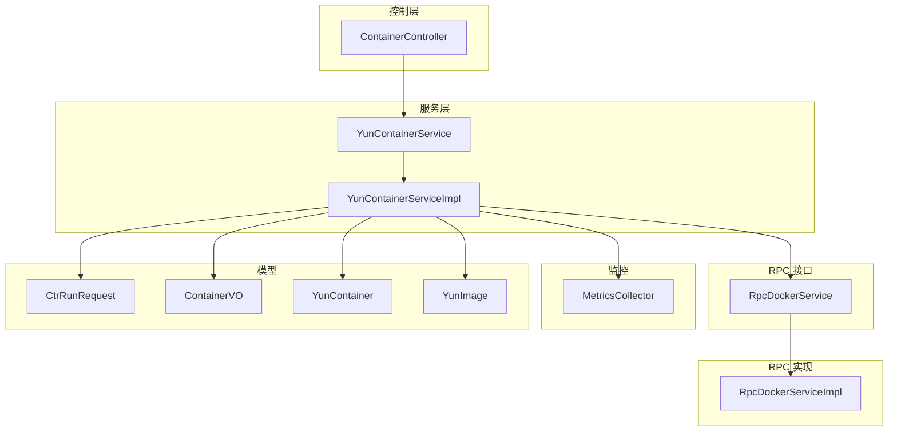
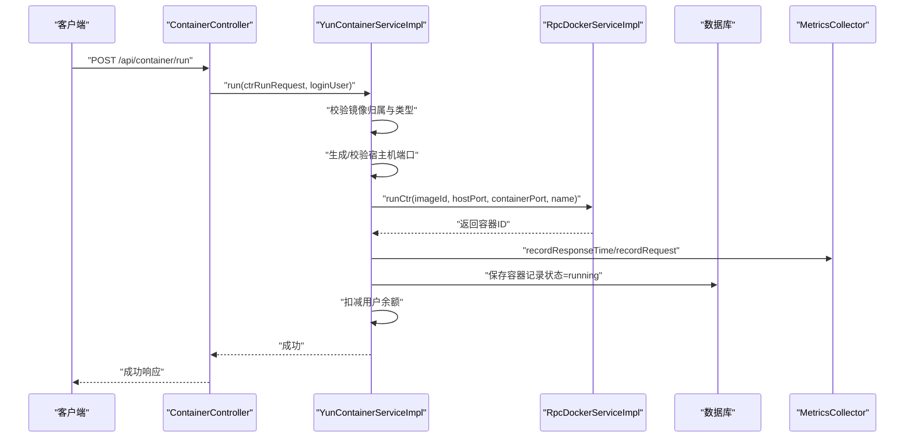
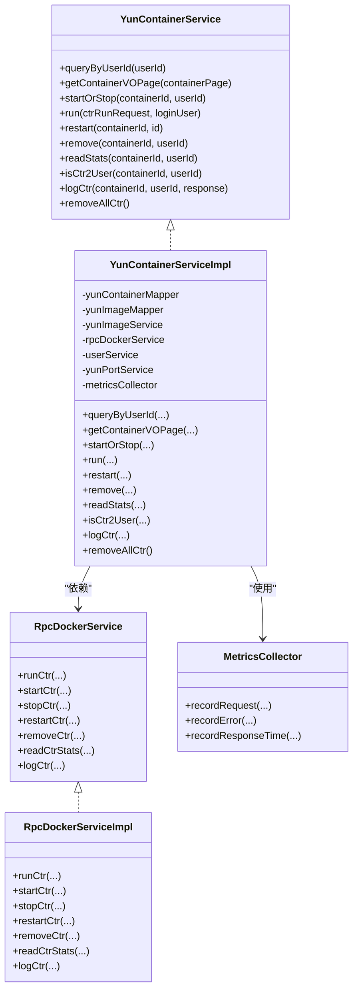
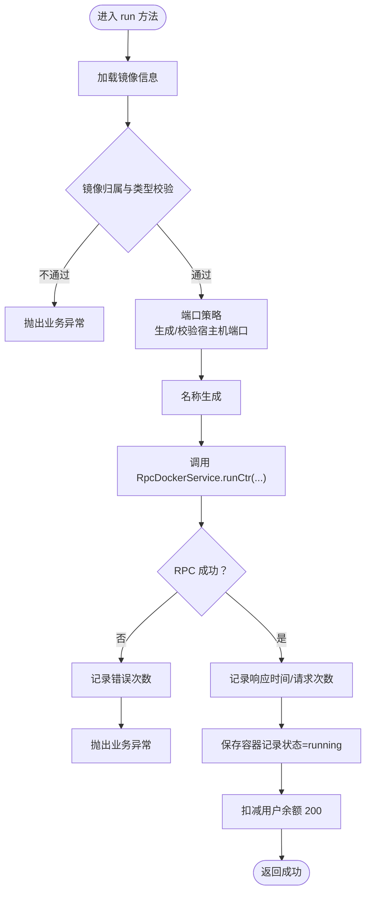
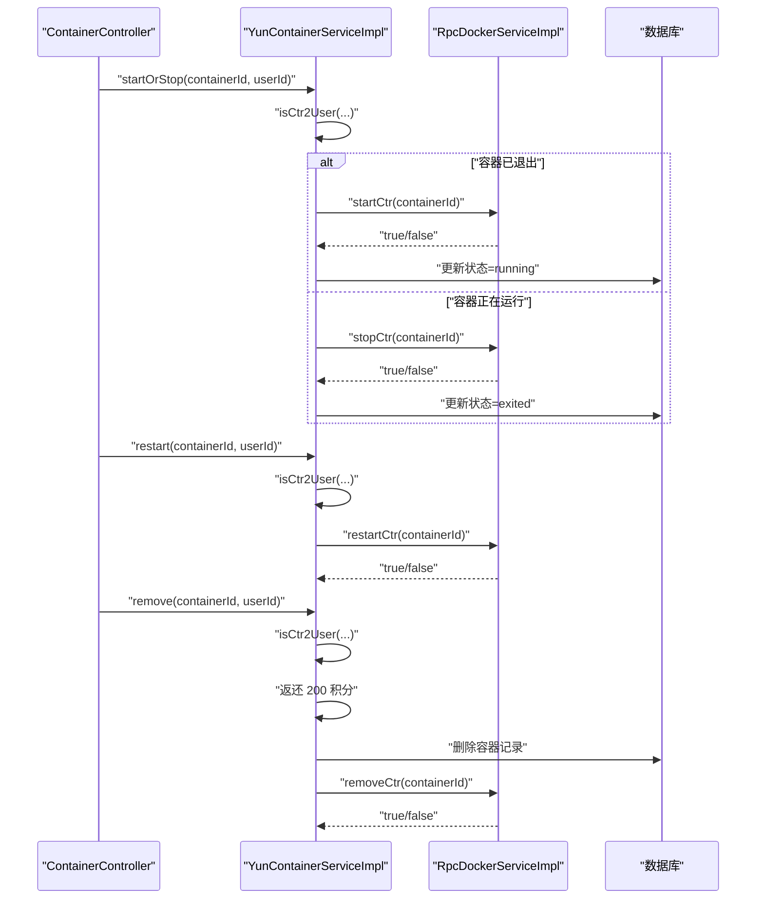
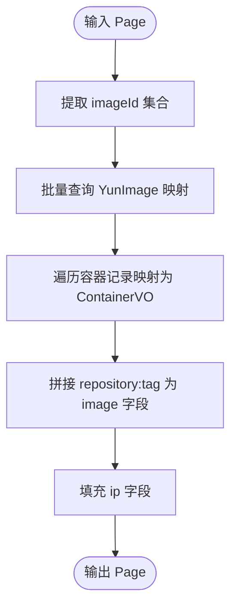
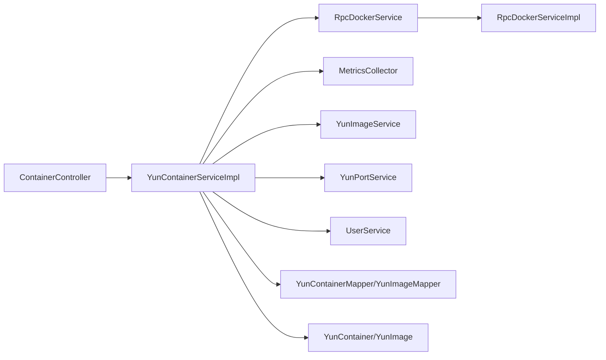

# 容器服务（YunContainerService）

<cite>
**本文引用的文件**
- [yun-docker-master/src/main/java/com/lfc/yundocker/service/YunContainerService.java](file://yun-docker-master/src/main/java/com/lfc/yundocker/service/YunContainerService.java)
- [yun-docker-master/src/main/java/com/lfc/yundocker/service/impl/YunContainerServiceImpl.java](file://yun-docker-master/src/main/java/com/lfc/yundocker/service/impl/YunContainerServiceImpl.java)
- [yun-docker-api/src/main/java/com/lfc/yundocker/service/RpcDockerService.java](file://yun-docker-api/src/main/java/com/lfc/yundocker/service/RpcDockerService.java)
- [yun-docker-worker/src/main/java/com/lfc/yundocker/worker/rpc/RpcDockerServiceImpl.java](file://yun-docker-worker/src/main/java/com/lfc/yundocker/worker/rpc/RpcDockerServiceImpl.java)
- [yun-docker-common/src/main/java/com/lfc/yundocker/common/model/dto/CtrRunRequest.java](file://yun-docker-common/src/main/java/com/lfc/yundocker/common/model/dto/CtrRunRequest.java)
- [yun-docker-common/src/main/java/com/lfc/yundocker/common/constant/CtrStatusConstant.java](file://yun-docker-common/src/main/java/com/lfc/yundocker/common/constant/CtrStatusConstant.java)
- [yun-docker-master/src/main/java/com/lfc/yundocker/common/model/entity/YunContainer.java](file://yun-docker-master/src/main/java/com/lfc/yundocker/common/model/entity/YunContainer.java)
- [yun-docker-master/src/main/java/com/lfc/yundocker/common/model/entity/YunImage.java](file://yun-docker-master/src/main/java/com/lfc/yundocker/common/model/entity/YunImage.java)
- [yun-docker-master/src/main/java/com/lfc/yundocker/common/model/vo/ContainerVO.java](file://yun-docker-master/src/main/java/com/lfc/yundocker/common/model/vo/ContainerVO.java)
- [yun-docker-master/src/main/java/com/lfc/yundocker/monitor/MetricsCollector.java](file://yun-docker-master/src/main/java/com/lfc/yundocker/monitor/MetricsCollector.java)
- [yun-docker-master/src/main/java/com/lfc/yundocker/controller/ContainerController.java](file://yun-docker-master/src/main/java/com/lfc/yundocker/controller/ContainerController.java)
- [yun-docker-master/src/main/resources/application.yml](file://yun-docker-master/src/main/resources/application.yml)
</cite>

## 目录
1. [简介](#简介)
2. [项目结构](#项目结构)
3. [核心组件](#核心组件)
4. [架构总览](#架构总览)
5. [详细组件分析](#详细组件分析)
6. [依赖关系分析](#依赖关系分析)
7. [性能考量](#性能考量)
8. [故障排查指南](#故障排查指南)
9. [结论](#结论)
10. [附录：调用示例](#附录调用示例)

## 简介
本文件面向“容器服务”模块，系统性解析 YunContainerService 接口及其实现类 YunContainerServiceImpl 的职责边界与实现细节。重点覆盖：
- run 方法从接收 CtrRunRequest 请求到校验镜像归属与类型、生成/校验宿主机端口、调用 Dubbo RPC 的 RpcDockerService.runCtr 创建容器的完整流程；
- startOrStop、restart、remove 等生命周期管理方法如何通过 RPC 与 worker 节点交互，并在成功后同步更新数据库状态；
- remove 方法中删除容器后自动为用户返还 200 积分的业务逻辑；
- getContainerVOPage 如何关联 YunImage 数据以丰富返回信息；
- isCtr2User 作为安全基元，确保操作的容器属于当前用户；
- 结合 MetricsCollector 的性能监控与错误记录机制；
- 提供创建、启停、删除容器的代码调用示例路径。

## 项目结构
围绕容器服务的关键模块与文件如下：
- 接口与实现：YunContainerService、YunContainerServiceImpl
- RPC 接口与实现：RpcDockerService、RpcDockerServiceImpl
- 控制器：ContainerController
- DTO/VO/Entity：CtrRunRequest、ContainerVO、YunContainer、YunImage
- 监控：MetricsCollector
- 配置：application.yml（Dubbo、Prometheus 等）

图表来源
- [yun-docker-master/src/main/java/com/lfc/yundocker/controller/ContainerController.java](file://yun-docker-master/src/main/java/com/lfc/yundocker/controller/ContainerController.java#L1-L173)
- [yun-docker-master/src/main/java/com/lfc/yundocker/service/YunContainerService.java](file://yun-docker-master/src/main/java/com/lfc/yundocker/service/YunContainerService.java#L1-L41)
- [yun-docker-master/src/main/java/com/lfc/yundocker/service/impl/YunContainerServiceImpl.java](file://yun-docker-master/src/main/java/com/lfc/yundocker/service/impl/YunContainerServiceImpl.java#L1-L318)
- [yun-docker-api/src/main/java/com/lfc/yundocker/service/RpcDockerService.java](file://yun-docker-api/src/main/java/com/lfc/yundocker/service/RpcDockerService.java#L1-L143)
- [yun-docker-worker/src/main/java/com/lfc/yundocker/worker/rpc/RpcDockerServiceImpl.java](file://yun-docker-worker/src/main/java/com/lfc/yundocker/worker/rpc/RpcDockerServiceImpl.java#L1-L440)
- [yun-docker-master/src/main/java/com/lfc/yundocker/monitor/MetricsCollector.java](file://yun-docker-master/src/main/java/com/lfc/yundocker/monitor/MetricsCollector.java#L1-L76)
- [yun-docker-common/src/main/java/com/lfc/yundocker/common/model/dto/CtrRunRequest.java](file://yun-docker-common/src/main/java/com/lfc/yundocker/common/model/dto/CtrRunRequest.java#L1-L35)
- [yun-docker-master/src/main/java/com/lfc/yundocker/common/model/vo/ContainerVO.java](file://yun-docker-master/src/main/java/com/lfc/yundocker/common/model/vo/ContainerVO.java#L1-L83)
- [yun-docker-master/src/main/java/com/lfc/yundocker/common/model/entity/YunContainer.java](file://yun-docker-master/src/main/java/com/lfc/yundocker/common/model/entity/YunContainer.java#L1-L79)
- [yun-docker-master/src/main/java/com/lfc/yundocker/common/model/entity/YunImage.java](file://yun-docker-master/src/main/java/com/lfc/yundocker/common/model/entity/YunImage.java#L1-L79)

章节来源
- [yun-docker-master/src/main/java/com/lfc/yundocker/controller/ContainerController.java](file://yun-docker-master/src/main/java/com/lfc/yundocker/controller/ContainerController.java#L1-L173)
- [yun-docker-master/src/main/resources/application.yml](file://yun-docker-master/src/main/resources/application.yml#L1-L60)

## 核心组件
- 接口 YunContainerService：定义容器生命周期管理、运行、日志导出、分页 VO 包装、安全校验等能力。
- 实现类 YunContainerServiceImpl：对接 RPC、数据库、用户余额、端口分配与监控指标，完成具体业务编排。
- RPC 接口 RpcDockerService 与实现 RpcDockerServiceImpl：封装 Docker 原生操作（run/start/stop/restart/remove/stats/log 等），在 worker 节点执行。
- 控制器 ContainerController：对外提供 HTTP 接口，负责鉴权、参数校验、调用服务层。
- 监控 MetricsCollector：基于 Micrometer 统计镜像创建次数、响应时间、错误次数，便于性能与质量观测。

章节来源
- [yun-docker-master/src/main/java/com/lfc/yundocker/service/YunContainerService.java](file://yun-docker-master/src/main/java/com/lfc/yundocker/service/YunContainerService.java#L1-L41)
- [yun-docker-master/src/main/java/com/lfc/yundocker/service/impl/YunContainerServiceImpl.java](file://yun-docker-master/src/main/java/com/lfc/yundocker/service/impl/YunContainerServiceImpl.java#L1-L318)
- [yun-docker-api/src/main/java/com/lfc/yundocker/service/RpcDockerService.java](file://yun-docker-api/src/main/java/com/lfc/yundocker/service/RpcDockerService.java#L1-L143)
- [yun-docker-worker/src/main/java/com/lfc/yundocker/worker/rpc/RpcDockerServiceImpl.java](file://yun-docker-worker/src/main/java/com/lfc/yundocker/worker/rpc/RpcDockerServiceImpl.java#L1-L440)
- [yun-docker-master/src/main/java/com/lfc/yundocker/monitor/MetricsCollector.java](file://yun-docker-master/src/main/java/com/lfc/yundocker/monitor/MetricsCollector.java#L1-L76)

## 架构总览
容器服务采用“控制层-服务层-RPC-Worker-监控”的分层架构。控制层负责鉴权与参数校验；服务层负责业务编排与状态同步；RPC 层抽象 Docker 操作；Worker 节点实际执行 Docker 命令；监控层采集指标。

图表来源
- [yun-docker-master/src/main/java/com/lfc/yundocker/controller/ContainerController.java](file://yun-docker-master/src/main/java/com/lfc/yundocker/controller/ContainerController.java#L110-L133)
- [yun-docker-master/src/main/java/com/lfc/yundocker/service/impl/YunContainerServiceImpl.java](file://yun-docker-master/src/main/java/com/lfc/yundocker/service/impl/YunContainerServiceImpl.java#L136-L215)
- [yun-docker-worker/src/main/java/com/lfc/yundocker/worker/rpc/RpcDockerServiceImpl.java](file://yun-docker-worker/src/main/java/com/lfc/yundocker/worker/rpc/RpcDockerServiceImpl.java#L82-L107)
- [yun-docker-master/src/main/java/com/lfc/yundocker/monitor/MetricsCollector.java](file://yun-docker-master/src/main/java/com/lfc/yundocker/monitor/MetricsCollector.java#L36-L72)

## 详细组件分析

### 接口与实现类关系

图表来源
- [yun-docker-master/src/main/java/com/lfc/yundocker/service/YunContainerService.java](file://yun-docker-master/src/main/java/com/lfc/yundocker/service/YunContainerService.java#L1-L41)
- [yun-docker-master/src/main/java/com/lfc/yundocker/service/impl/YunContainerServiceImpl.java](file://yun-docker-master/src/main/java/com/lfc/yundocker/service/impl/YunContainerServiceImpl.java#L1-L318)
- [yun-docker-api/src/main/java/com/lfc/yundocker/service/RpcDockerService.java](file://yun-docker-api/src/main/java/com/lfc/yundocker/service/RpcDockerService.java#L1-L143)
- [yun-docker-worker/src/main/java/com/lfc/yundocker/worker/rpc/RpcDockerServiceImpl.java](file://yun-docker-worker/src/main/java/com/lfc/yundocker/worker/rpc/RpcDockerServiceImpl.java#L1-L440)
- [yun-docker-master/src/main/java/com/lfc/yundocker/monitor/MetricsCollector.java](file://yun-docker-master/src/main/java/com/lfc/yundocker/monitor/MetricsCollector.java#L1-L76)

章节来源
- [yun-docker-master/src/main/java/com/lfc/yundocker/service/YunContainerService.java](file://yun-docker-master/src/main/java/com/lfc/yundocker/service/YunContainerService.java#L1-L41)
- [yun-docker-master/src/main/java/com/lfc/yundocker/service/impl/YunContainerServiceImpl.java](file://yun-docker-master/src/main/java/com/lfc/yundocker/service/impl/YunContainerServiceImpl.java#L1-L318)

### run 方法完整流程
- 输入：CtrRunRequest（包含镜像ID、宿主机端口、容器端口、容器名称）
- 步骤：
  1) 校验镜像归属与类型：仅允许用户自有镜像或公共镜像（imageType==0）。
  2) 端口策略：
     - 若未提供宿主机端口，则由端口服务生成可用端口；
     - 若提供宿主机端口但无效或被占用，则抛出异常；
     - 若为公共镜像，容器端口从端口服务映射表中获取。
  3) 名称策略：若未提供名称，基于仓库名+随机后缀生成。
  4) 调用 RPC：RpcDockerService.runCtr(imageId, hostPort, containerPort, name)，返回容器ID。
  5) 指标记录：记录响应时间、请求次数；异常时记录错误次数。
  6) 数据库持久化：保存容器记录（状态=running），并写入端口映射字符串。
  7) 扣减余额：扣除 200 积分。
- 异常处理：RPC 调用异常时，记录错误并抛出业务异常。

图表来源
- [yun-docker-master/src/main/java/com/lfc/yundocker/service/impl/YunContainerServiceImpl.java](file://yun-docker-master/src/main/java/com/lfc/yundocker/service/impl/YunContainerServiceImpl.java#L136-L215)
- [yun-docker-worker/src/main/java/com/lfc/yundocker/worker/rpc/RpcDockerServiceImpl.java](file://yun-docker-worker/src/main/java/com/lfc/yundocker/worker/rpc/RpcDockerServiceImpl.java#L82-L107)
- [yun-docker-master/src/main/java/com/lfc/yundocker/monitor/MetricsCollector.java](file://yun-docker-master/src/main/java/com/lfc/yundocker/monitor/MetricsCollector.java#L36-L72)

章节来源
- [yun-docker-master/src/main/java/com/lfc/yundocker/service/impl/YunContainerServiceImpl.java](file://yun-docker-master/src/main/java/com/lfc/yundocker/service/impl/YunContainerServiceImpl.java#L136-L215)
- [yun-docker-common/src/main/java/com/lfc/yundocker/common/model/dto/CtrRunRequest.java](file://yun-docker-common/src/main/java/com/lfc/yundocker/common/model/dto/CtrRunRequest.java#L1-L35)

### 生命周期管理：startOrStop、restart、remove
- startOrStop：
  - 先通过 isCtr2User 校验容器归属；
  - 若容器处于 exited，调用 RPC startCtr 并将状态更新为 running；
  - 若容器处于 running，调用 RPC stopCtr 并将状态更新为 exited；
  - 数据库更新失败时抛出业务异常。
- restart：
  - 校验容器归属；
  - 调用 RPC restartCtr，返回布尔结果。
- remove：
  - 校验容器归属；
  - 先返还 200 积分；
  - 删除数据库记录；
  - 调用 RPC removeCtr，返回布尔结果。

图表来源
- [yun-docker-master/src/main/java/com/lfc/yundocker/service/impl/YunContainerServiceImpl.java](file://yun-docker-master/src/main/java/com/lfc/yundocker/service/impl/YunContainerServiceImpl.java#L108-L134)
- [yun-docker-master/src/main/java/com/lfc/yundocker/service/impl/YunContainerServiceImpl.java](file://yun-docker-master/src/main/java/com/lfc/yundocker/service/impl/YunContainerServiceImpl.java#L217-L246)
- [yun-docker-worker/src/main/java/com/lfc/yundocker/worker/rpc/RpcDockerServiceImpl.java](file://yun-docker-worker/src/main/java/com/lfc/yundocker/worker/rpc/RpcDockerServiceImpl.java#L320-L337)
- [yun-docker-worker/src/main/java/com/lfc/yundocker/worker/rpc/RpcDockerServiceImpl.java](file://yun-docker-worker/src/main/java/com/lfc/yundocker/worker/rpc/RpcDockerServiceImpl.java#L421-L425)

章节来源
- [yun-docker-master/src/main/java/com/lfc/yundocker/service/impl/YunContainerServiceImpl.java](file://yun-docker-master/src/main/java/com/lfc/yundocker/service/impl/YunContainerServiceImpl.java#L108-L134)
- [yun-docker-master/src/main/java/com/lfc/yundocker/service/impl/YunContainerServiceImpl.java](file://yun-docker-master/src/main/java/com/lfc/yundocker/service/impl/YunContainerServiceImpl.java#L217-L246)

### getContainerVOPage：关联 YunImage 丰富返回信息
- 输入：Page<YunContainer>
- 步骤：
  1) 从分页记录中提取 imageId 集合；
  2) 通过 YunImageService 批量查询映射；
  3) 将每个容器记录映射为 ContainerVO，并拼接 repository:tag 作为 image 字段；
  4) 固定填充 ip 字段（当前为固定值，后续可替换为真实内网IP）。
- 输出：Page<ContainerVO>

图表来源
- [yun-docker-master/src/main/java/com/lfc/yundocker/service/impl/YunContainerServiceImpl.java](file://yun-docker-master/src/main/java/com/lfc/yundocker/service/impl/YunContainerServiceImpl.java#L73-L106)
- [yun-docker-master/src/main/java/com/lfc/yundocker/common/model/vo/ContainerVO.java](file://yun-docker-master/src/main/java/com/lfc/yundocker/common/model/vo/ContainerVO.java#L1-L83)
- [yun-docker-master/src/main/java/com/lfc/yundocker/common/model/entity/YunImage.java](file://yun-docker-master/src/main/java/com/lfc/yundocker/common/model/entity/YunImage.java#L1-L79)

章节来源
- [yun-docker-master/src/main/java/com/lfc/yundocker/service/impl/YunContainerServiceImpl.java](file://yun-docker-master/src/main/java/com/lfc/yundocker/service/impl/YunContainerServiceImpl.java#L73-L106)
- [yun-docker-master/src/main/java/com/lfc/yundocker/common/model/vo/ContainerVO.java](file://yun-docker-master/src/main/java/com/lfc/yundocker/common/model/vo/ContainerVO.java#L1-L83)

### isCtr2User：安全基元
- 作用：判断容器是否属于当前用户，防止越权操作。
- 实现：基于 containerId 与 userId 的唯一组合查询数据库，返回容器记录或空。
- 使用场景：所有需要对容器进行修改/删除/查看的操作前均需调用此方法进行授权校验。

章节来源
- [yun-docker-master/src/main/java/com/lfc/yundocker/service/impl/YunContainerServiceImpl.java](file://yun-docker-master/src/main/java/com/lfc/yundocker/service/impl/YunContainerServiceImpl.java#L259-L271)

### remove 方法：删除容器后自动返还 200 积分
- 业务逻辑：
  1) 校验容器归属；
  2) 返还 200 积分（updateBalance(+200)）；
  3) 删除数据库记录；
  4) 调用 RPC 删除容器。
- 注意：该逻辑在删除前执行，确保即使后续 RPC 失败，用户也已获得返还。

章节来源
- [yun-docker-master/src/main/java/com/lfc/yundocker/service/impl/YunContainerServiceImpl.java](file://yun-docker-master/src/main/java/com/lfc/yundocker/service/impl/YunContainerServiceImpl.java#L229-L246)

### MetricsCollector：性能监控与错误记录
- 指标类型：
  - 请求次数：recordRequest(userId, imageName, "running")
  - 响应时间：recordResponseTime(userId, imageName, duration)
  - 错误次数：recordError(userId, imageName, errorMessage)
- 用途：对镜像创建容器的耗时与失败进行可观测，便于定位问题与容量规划。

章节来源
- [yun-docker-master/src/main/java/com/lfc/yundocker/monitor/MetricsCollector.java](file://yun-docker-master/src/main/java/com/lfc/yundocker/monitor/MetricsCollector.java#L1-L76)
- [yun-docker-master/src/main/java/com/lfc/yundocker/service/impl/YunContainerServiceImpl.java](file://yun-docker-master/src/main/java/com/lfc/yundocker/service/impl/YunContainerServiceImpl.java#L182-L201)

## 依赖关系分析
- 控制层 ContainerController 依赖 UserService 与 YunContainerService，负责鉴权与参数校验；
- 服务层 YunContainerServiceImpl 依赖：
  - RpcDockerService（Dubbo 远程调用）
  - MetricsCollector（指标采集）
  - YunImageService（批量查询镜像）
  - YunPortService（端口分配与校验）
  - UserService（余额操作）
  - Mapper/Entity（数据库访问）
- RPC 层 RpcDockerServiceImpl 依赖 DockerClient 与 WebSocketServer（统计推送）。

图表来源
- [yun-docker-master/src/main/java/com/lfc/yundocker/controller/ContainerController.java](file://yun-docker-master/src/main/java/com/lfc/yundocker/controller/ContainerController.java#L1-L173)
- [yun-docker-master/src/main/java/com/lfc/yundocker/service/impl/YunContainerServiceImpl.java](file://yun-docker-master/src/main/java/com/lfc/yundocker/service/impl/YunContainerServiceImpl.java#L1-L318)
- [yun-docker-api/src/main/java/com/lfc/yundocker/service/RpcDockerService.java](file://yun-docker-api/src/main/java/com/lfc/yundocker/service/RpcDockerService.java#L1-L143)
- [yun-docker-worker/src/main/java/com/lfc/yundocker/worker/rpc/RpcDockerServiceImpl.java](file://yun-docker-worker/src/main/java/com/lfc/yundocker/worker/rpc/RpcDockerServiceImpl.java#L1-L440)

章节来源
- [yun-docker-master/src/main/java/com/lfc/yundocker/controller/ContainerController.java](file://yun-docker-master/src/main/java/com/lfc/yundocker/controller/ContainerController.java#L1-L173)
- [yun-docker-master/src/main/java/com/lfc/yundocker/service/impl/YunContainerServiceImpl.java](file://yun-docker-master/src/main/java/com/lfc/yundocker/service/impl/YunContainerServiceImpl.java#L1-L318)

## 性能考量
- 指标采集：通过 MetricsCollector 对镜像创建耗时、错误次数进行统计，便于性能优化与告警。
- 端口策略：优先复用用户提供的宿主机端口，否则由端口服务生成，减少冲突概率。
- 批量查询：getContainerVOPage 中对镜像进行批量查询并按 id 分组，降低 N+1 查询风险。
- RPC 超时：Dubbo 消费者超时配置为 5000ms，建议结合业务重试策略与熔断降级。

章节来源
- [yun-docker-master/src/main/java/com/lfc/yundocker/monitor/MetricsCollector.java](file://yun-docker-master/src/main/java/com/lfc/yundocker/monitor/MetricsCollector.java#L1-L76)
- [yun-docker-master/src/main/java/com/lfc/yundocker/service/impl/YunContainerServiceImpl.java](file://yun-docker-master/src/main/java/com/lfc/yundocker/service/impl/YunContainerServiceImpl.java#L73-L106)
- [yun-docker-master/src/main/resources/application.yml](file://yun-docker-master/src/main/resources/application.yml#L1-L60)

## 故障排查指南
- run 失败：
  - 检查镜像归属与类型校验是否通过；
  - 校验端口合法性与占用情况；
  - 观察 MetricsCollector 中错误计数指标；
  - 查看 RPC 层日志与 Docker 客户端异常。
- startOrStop 失败：
  - 确认 isCtr2User 返回非空；
  - 检查数据库状态更新是否成功；
  - 查看 RPC 层 startCtr/stopCtr 返回值。
- remove 失败：
  - 确认返还 200 积分是否成功；
  - 检查数据库删除是否成功；
  - 查看 RPC 层 removeCtr 返回值。
- 日志导出：
  - 确认 isCtr2User 校验通过；
  - 检查 RPC 层 logCtr 返回字节数组并正确写入响应。

章节来源
- [yun-docker-master/src/main/java/com/lfc/yundocker/service/impl/YunContainerServiceImpl.java](file://yun-docker-master/src/main/java/com/lfc/yundocker/service/impl/YunContainerServiceImpl.java#L108-L134)
- [yun-docker-master/src/main/java/com/lfc/yundocker/service/impl/YunContainerServiceImpl.java](file://yun-docker-master/src/main/java/com/lfc/yundocker/service/impl/YunContainerServiceImpl.java#L229-L246)
- [yun-docker-worker/src/main/java/com/lfc/yundocker/worker/rpc/RpcDockerServiceImpl.java](file://yun-docker-worker/src/main/java/com/lfc/yundocker/worker/rpc/RpcDockerServiceImpl.java#L345-L413)

## 结论
YunContainerService 通过清晰的职责划分与安全校验，实现了容器生命周期的统一编排。服务层在调用 RPC 与数据库之间建立了稳健的状态同步机制，并通过 MetricsCollector 提供了关键性能与错误指标。remove 方法的返还逻辑体现了对用户体验的重视。整体设计具备良好的扩展性与可观测性。

## 附录：调用示例
以下为关键流程的调用路径示例（以文件路径代替代码片段）：
- 创建容器（run）
  - 控制器入口：[ContainerController.run](file://yun-docker-master/src/main/java/com/lfc/yundocker/controller/ContainerController.java#L117-L133)
  - 服务实现：[YunContainerServiceImpl.run](file://yun-docker-master/src/main/java/com/lfc/yundocker/service/impl/YunContainerServiceImpl.java#L136-L215)
  - RPC 实现：[RpcDockerServiceImpl.runCtr](file://yun-docker-worker/src/main/java/com/lfc/yundocker/worker/rpc/RpcDockerServiceImpl.java#L82-L107)
- 启动/停止容器（startOrStop）
  - 控制器入口：[ContainerController.startOrStop](file://yun-docker-master/src/main/java/com/lfc/yundocker/controller/ContainerController.java#L71-L88)
  - 服务实现：[YunContainerServiceImpl.startOrStop](file://yun-docker-master/src/main/java/com/lfc/yundocker/service/impl/YunContainerServiceImpl.java#L108-L134)
  - RPC 实现：[RpcDockerServiceImpl.startCtr/stopCtr](file://yun-docker-worker/src/main/java/com/lfc/yundocker/worker/rpc/RpcDockerServiceImpl.java#L320-L337)
- 重启容器（restart）
  - 控制器入口：[ContainerController.restart](file://yun-docker-master/src/main/java/com/lfc/yundocker/controller/ContainerController.java#L90-L107)
  - 服务实现：[YunContainerServiceImpl.restart](file://yun-docker-master/src/main/java/com/lfc/yundocker/service/impl/YunContainerServiceImpl.java#L217-L227)
  - RPC 实现：[RpcDockerServiceImpl.restartCtr](file://yun-docker-worker/src/main/java/com/lfc/yundocker/worker/rpc/RpcDockerServiceImpl.java#L433-L438)
- 删除容器（remove）
  - 控制器入口：[ContainerController.remove](file://yun-docker-master/src/main/java/com/lfc/yundocker/controller/ContainerController.java#L135-L152)
  - 服务实现：[YunContainerServiceImpl.remove](file://yun-docker-master/src/main/java/com/lfc/yundocker/service/impl/YunContainerServiceImpl.java#L229-L246)
  - RPC 实现：[RpcDockerServiceImpl.removeCtr](file://yun-docker-worker/src/main/java/com/lfc/yundocker/worker/rpc/RpcDockerServiceImpl.java#L421-L425)
- 日志导出（logCtr）
  - 控制器入口：[ContainerController.logCtr](file://yun-docker-master/src/main/java/com/lfc/yundocker/controller/ContainerController.java#L154-L170)
  - 服务实现：[YunContainerServiceImpl.logCtr](file://yun-docker-master/src/main/java/com/lfc/yundocker/service/impl/YunContainerServiceImpl.java#L273-L295)
  - RPC 实现：[RpcDockerServiceImpl.logCtr](file://yun-docker-worker/src/main/java/com/lfc/yundocker/worker/rpc/RpcDockerServiceImpl.java#L345-L413)