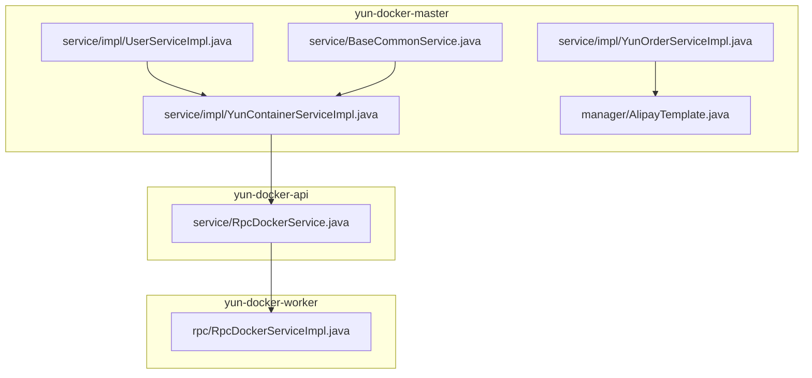
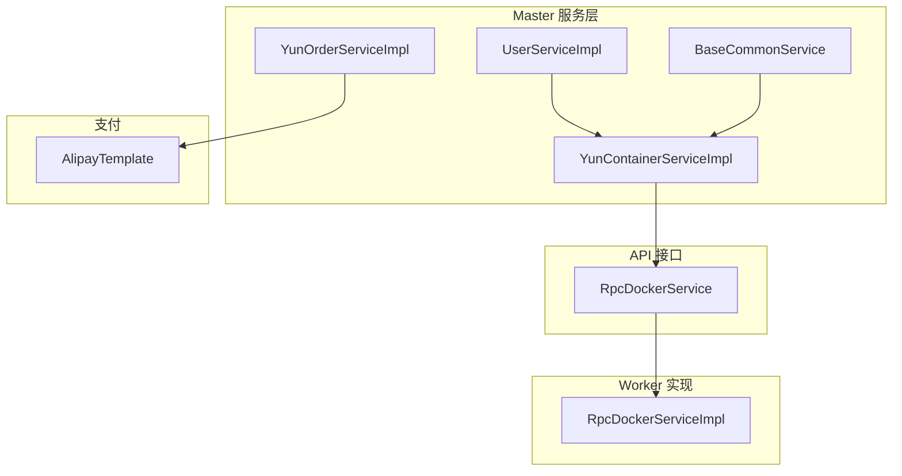
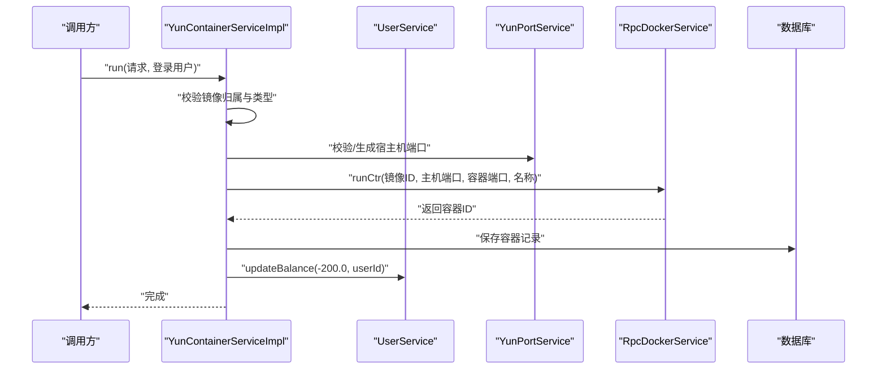
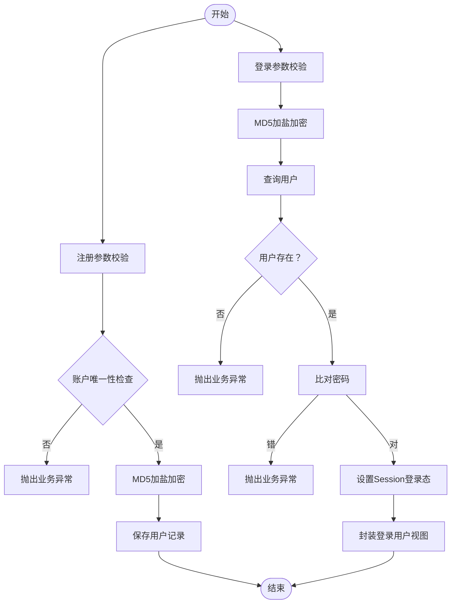
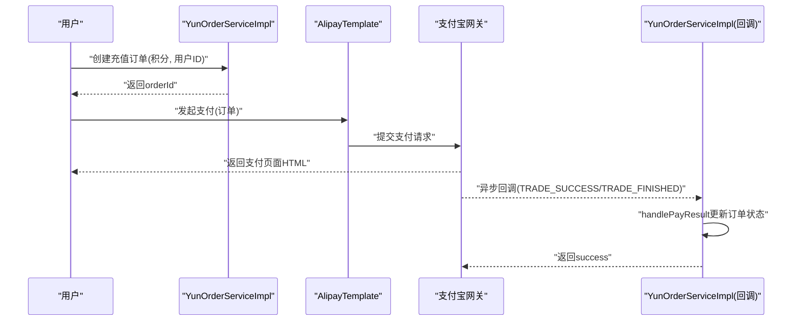
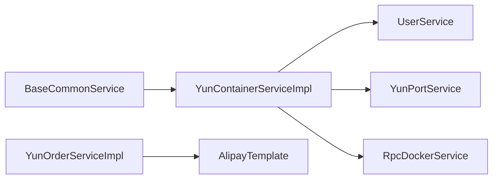

# 服务层（Service）

<cite>
**本文引用的文件**
- [yun-docker-master/src/main/java/com/lfc/yundocker/service/impl/YunContainerServiceImpl.java](file://yun-docker-master/src/main/java/com/lfc/yundocker/service/impl/YunContainerServiceImpl.java)
- [yun-docker-api/src/main/java/com/lfc/yundocker/service/RpcDockerService.java](file://yun-docker-api/src/main/java/com/lfc/yundocker/service/RpcDockerService.java)
- [yun-docker-master/src/main/java/com/lfc/yundocker/service/impl/UserServiceImpl.java](file://yun-docker-master/src/main/java/com/lfc/yundocker/service/impl/UserServiceImpl.java)
- [yun-docker-common/src/main/java/com/lfc/yundocker/common/util/PasswordUtil.java](file://yun-docker-common/src/main/java/com/lfc/yundocker/common/util/PasswordUtil.java)
- [yun-docker-master/src/main/java/com/lfc/yundocker/service/impl/YunOrderServiceImpl.java](file://yun-docker-master/src/main/java/com/lfc/yundocker/service/impl/YunOrderServiceImpl.java)
- [yun-docker-master/src/main/java/com/lfc/yundocker/manager/AlipayTemplate.java](file://yun-docker-master/src/main/java/com/lfc/yundocker/manager/AlipayTemplate.java)
- [yun-docker-common/src/main/java/com/lfc/yundocker/common/exception/BusinessException.java](file://yun-docker-common/src/main/java/com/lfc/yundocker/common/exception/BusinessException.java)
- [yun-docker-common/src/main/java/com/lfc/yundocker/common/model/enums/ErrorCode.java](file://yun-docker-common/src/main/java/com/lfc/yundocker/common/model/enums/ErrorCode.java)
- [yun-docker-common/src/main/java/com/lfc/yundocker/common/constant/UserConstant.java](file://yun-docker-common/src/main/java/com/lfc/yundocker/common/constant/UserConstant.java)
- [yun-docker-common/src/main/java/com/lfc/yundocker/common/model/enums/UserRoleEnum.java](file://yun-docker-common/src/main/java/com/lfc/yundocker/common/model/enums/UserRoleEnum.java)
- [yun-docker-master/src/main/java/com/lfc/yundocker/service/BaseCommonService.java](file://yun-docker-master/src/main/java/com/lfc/yundocker/service/BaseCommonService.java)
</cite>

## 目录
1. [引言](#引言)
2. [项目结构](#项目结构)
3. [核心组件](#核心组件)
4. [架构总览](#架构总览)
5. [详细组件分析](#详细组件分析)
6. [依赖关系分析](#依赖关系分析)
7. [性能考量](#性能考量)
8. [故障排查指南](#故障排查指南)
9. [结论](#结论)
10. [附录](#附录)

## 引言
本章节聚焦于yun-docker-master模块的服务层（Service），系统性梳理以下关键能力：
- 容器服务：YunContainerServiceImpl如何协调用户权限、资源配额检查，并通过Dubbo RPC调用yun-docker-worker提供的RpcDockerService接口执行实际的Docker命令。
- 用户服务：UserServiceImpl中的用户注册、登录（含登录态维护）、密码加密（PasswordUtil）、余额更新与权限校验流程。
- 订单服务：YunOrderServiceImpl与AlipayTemplate集成完成支付下单与回调处理。
- 通用能力：BaseCommonService提供的通用日志能力。
- 事务与异常：围绕多表操作的事务管理策略、业务异常（BusinessException）抛出与处理策略。

## 项目结构
服务层位于yun-docker-master模块，采用“按功能域分包”的组织方式，核心服务均以impl包实现，接口位于同级service包。RPC接口定义在yun-docker-api模块，供worker侧实现并跨进程调用。

图表来源
- [yun-docker-master/src/main/java/com/lfc/yundocker/service/impl/YunContainerServiceImpl.java](file://yun-docker-master/src/main/java/com/lfc/yundocker/service/impl/YunContainerServiceImpl.java#L1-L318)
- [yun-docker-api/src/main/java/com/lfc/yundocker/service/RpcDockerService.java](file://yun-docker-api/src/main/java/com/lfc/yundocker/service/RpcDockerService.java#L1-L143)
- [yun-docker-master/src/main/java/com/lfc/yundocker/service/impl/UserServiceImpl.java](file://yun-docker-master/src/main/java/com/lfc/yundocker/service/impl/UserServiceImpl.java#L1-L301)
- [yun-docker-master/src/main/java/com/lfc/yundocker/service/impl/YunOrderServiceImpl.java](file://yun-docker-master/src/main/java/com/lfc/yundocker/service/impl/YunOrderServiceImpl.java#L1-L118)
- [yun-docker-master/src/main/java/com/lfc/yundocker/manager/AlipayTemplate.java](file://yun-docker-master/src/main/java/com/lfc/yundocker/manager/AlipayTemplate.java#L1-L108)
- [yun-docker-master/src/main/java/com/lfc/yundocker/service/BaseCommonService.java](file://yun-docker-master/src/main/java/com/lfc/yundocker/service/BaseCommonService.java#L1-L37)

章节来源
- [yun-docker-master/src/main/java/com/lfc/yundocker/service/impl/YunContainerServiceImpl.java](file://yun-docker-master/src/main/java/com/lfc/yundocker/service/impl/YunContainerServiceImpl.java#L1-L318)
- [yun-docker-api/src/main/java/com/lfc/yundocker/service/RpcDockerService.java](file://yun-docker-api/src/main/java/com/lfc/yundocker/service/RpcDockerService.java#L1-L143)

## 核心组件
- 容器服务：YunContainerServiceImpl负责容器生命周期管理、权限校验、端口分配、镜像归属校验、Docker命令执行与数据库持久化、余额扣减/返还。
- 用户服务：UserServiceImpl负责注册、登录态维护、密码校验、余额原子更新、权限判定、查询封装。
- 订单服务：YunOrderServiceImpl负责订单创建、状态检查、支付回调处理。
- 支付模板：AlipayTemplate封装支付宝下单参数与签名配置，输出支付页面HTML。
- 通用日志：BaseCommonService提供统一日志接口，便于审计与追踪。
- 异常体系：BusinessException承载统一错误码与消息，配合ErrorCode枚举。

章节来源
- [yun-docker-master/src/main/java/com/lfc/yundocker/service/impl/YunContainerServiceImpl.java](file://yun-docker-master/src/main/java/com/lfc/yundocker/service/impl/YunContainerServiceImpl.java#L1-L318)
- [yun-docker-master/src/main/java/com/lfc/yundocker/service/impl/UserServiceImpl.java](file://yun-docker-master/src/main/java/com/lfc/yundocker/service/impl/UserServiceImpl.java#L1-L301)
- [yun-docker-master/src/main/java/com/lfc/yundocker/service/impl/YunOrderServiceImpl.java](file://yun-docker-master/src/main/java/com/lfc/yundocker/service/impl/YunOrderServiceImpl.java#L1-L118)
- [yun-docker-master/src/main/java/com/lfc/yundocker/manager/AlipayTemplate.java](file://yun-docker-master/src/main/java/com/lfc/yundocker/manager/AlipayTemplate.java#L1-L108)
- [yun-docker-master/src/main/java/com/lfc/yundocker/service/BaseCommonService.java](file://yun-docker-master/src/main/java/com/lfc/yundocker/service/BaseCommonService.java#L1-L37)
- [yun-docker-common/src/main/java/com/lfc/yundocker/common/exception/BusinessException.java](file://yun-docker-common/src/main/java/com/lfc/yundocker/common/exception/BusinessException.java#L1-L37)
- [yun-docker-common/src/main/java/com/lfc/yundocker/common/model/enums/ErrorCode.java](file://yun-docker-common/src/main/java/com/lfc/yundocker/common/model/enums/ErrorCode.java#L1-L49)

## 架构总览
服务层通过Dubbo RPC与worker侧解耦，master侧专注业务编排与校验，worker侧专注Docker操作。支付流程通过AlipayTemplate与外部网关交互，回调由master侧订单服务处理。

图表来源
- [yun-docker-master/src/main/java/com/lfc/yundocker/service/impl/YunContainerServiceImpl.java](file://yun-docker-master/src/main/java/com/lfc/yundocker/service/impl/YunContainerServiceImpl.java#L1-L318)
- [yun-docker-api/src/main/java/com/lfc/yundocker/service/RpcDockerService.java](file://yun-docker-api/src/main/java/com/lfc/yundocker/service/RpcDockerService.java#L1-L143)
- [yun-docker-master/src/main/java/com/lfc/yundocker/service/impl/UserServiceImpl.java](file://yun-docker-master/src/main/java/com/lfc/yundocker/service/impl/UserServiceImpl.java#L1-L301)
- [yun-docker-master/src/main/java/com/lfc/yundocker/service/impl/YunOrderServiceImpl.java](file://yun-docker-master/src/main/java/com/lfc/yundocker/service/impl/YunOrderServiceImpl.java#L1-L118)
- [yun-docker-master/src/main/java/com/lfc/yundocker/manager/AlipayTemplate.java](file://yun-docker-master/src/main/java/com/lfc/yundocker/manager/AlipayTemplate.java#L1-L108)
- [yun-docker-master/src/main/java/com/lfc/yundocker/service/BaseCommonService.java](file://yun-docker-master/src/main/java/com/lfc/yundocker/service/BaseCommonService.java#L1-L37)

## 详细组件分析

### 容器服务：YunContainerServiceImpl
职责与流程要点：
- 权限校验：通过isCtr2User确保容器属于当前用户，避免越权操作。
- 资源配额与端口：基于镜像类型（公共/私有）与端口合法性进行校验与分配；公共镜像容器端口由端口服务映射。
- Docker命令编排：通过@DubboReference注入的RpcDockerService执行run/start/stop/restart/remove/readCtrStats/logCtr等命令。
- 数据库持久化：容器创建成功后写入数据库，包含镜像ID、用户ID、容器ID、状态、端口映射等。
- 余额管理：创建容器扣减余额，删除容器返还余额。
- 指标采集：调用MetricsCollector记录运行时指标（错误次数、响应时间、请求数）。

图表来源
- [yun-docker-master/src/main/java/com/lfc/yundocker/service/impl/YunContainerServiceImpl.java](file://yun-docker-master/src/main/java/com/lfc/yundocker/service/impl/YunContainerServiceImpl.java#L136-L215)
- [yun-docker-api/src/main/java/com/lfc/yundocker/service/RpcDockerService.java](file://yun-docker-api/src/main/java/com/lfc/yundocker/service/RpcDockerService.java#L37-L47)

关键方法与行为：
- 权限校验与状态切换：startOrStop根据容器状态调用startCtr或stopCtr，并更新数据库状态。
- 容器删除与余额返还：remove在删除数据库记录后调用removeCtr，并返还余额。
- 统计与日志：readStats触发worker侧统计命令；logCtr拉取日志并写回HTTP响应。
- 批量清理：removeAllCtr遍历容器列表，逐条返还余额、删除记录并调用removeCtr。

章节来源
- [yun-docker-master/src/main/java/com/lfc/yundocker/service/impl/YunContainerServiceImpl.java](file://yun-docker-master/src/main/java/com/lfc/yundocker/service/impl/YunContainerServiceImpl.java#L66-L134)
- [yun-docker-master/src/main/java/com/lfc/yundocker/service/impl/YunContainerServiceImpl.java](file://yun-docker-master/src/main/java/com/lfc/yundocker/service/impl/YunContainerServiceImpl.java#L136-L215)
- [yun-docker-master/src/main/java/com/lfc/yundocker/service/impl/YunContainerServiceImpl.java](file://yun-docker-master/src/main/java/com/lfc/yundocker/service/impl/YunContainerServiceImpl.java#L217-L246)
- [yun-docker-master/src/main/java/com/lfc/yundocker/service/impl/YunContainerServiceImpl.java](file://yun-docker-master/src/main/java/com/lfc/yundocker/service/impl/YunContainerServiceImpl.java#L248-L296)
- [yun-docker-master/src/main/java/com/lfc/yundocker/service/impl/YunContainerServiceImpl.java](file://yun-docker-master/src/main/java/com/lfc/yundocker/service/impl/YunContainerServiceImpl.java#L297-L318)

### 用户服务：UserServiceImpl
职责与流程要点：
- 注册：参数校验、账户唯一性检查、随机用户名生成、MD5加盐加密、入库。
- 登录：参数校验、MD5加盐加密、查询用户、比对密码、设置Session登录态。
- 权限：isAdmin基于UserRoleEnum判断管理员角色。
- 余额：updateBalance使用原生SQL表达式保证原子性，支持加减。
- 登录态与查询：getLoginUser/getLoginUserPermitNull从Session获取当前用户并按需刷新数据库。
- 查询封装：getUserVO/getLoginUserVO将实体转换为视图对象。

图表来源
- [yun-docker-master/src/main/java/com/lfc/yundocker/service/impl/UserServiceImpl.java](file://yun-docker-master/src/main/java/com/lfc/yundocker/service/impl/UserServiceImpl.java#L48-L88)
- [yun-docker-master/src/main/java/com/lfc/yundocker/service/impl/UserServiceImpl.java](file://yun-docker-master/src/main/java/com/lfc/yundocker/service/impl/UserServiceImpl.java#L106-L137)
- [yun-docker-common/src/main/java/com/lfc/yundocker/common/constant/UserConstant.java](file://yun-docker-common/src/main/java/com/lfc/yundocker/common/constant/UserConstant.java#L1-L34)
- [yun-docker-common/src/main/java/com/lfc/yundocker/common/model/enums/UserRoleEnum.java](file://yun-docker-common/src/main/java/com/lfc/yundocker/common/model/enums/UserRoleEnum.java#L1-L64)

章节来源
- [yun-docker-master/src/main/java/com/lfc/yundocker/service/impl/UserServiceImpl.java](file://yun-docker-master/src/main/java/com/lfc/yundocker/service/impl/UserServiceImpl.java#L48-L88)
- [yun-docker-master/src/main/java/com/lfc/yundocker/service/impl/UserServiceImpl.java](file://yun-docker-master/src/main/java/com/lfc/yundocker/service/impl/UserServiceImpl.java#L106-L137)
- [yun-docker-master/src/main/java/com/lfc/yundocker/service/impl/UserServiceImpl.java](file://yun-docker-master/src/main/java/com/lfc/yundocker/service/impl/UserServiceImpl.java#L90-L103)
- [yun-docker-master/src/main/java/com/lfc/yundocker/service/impl/UserServiceImpl.java](file://yun-docker-master/src/main/java/com/lfc/yundocker/service/impl/UserServiceImpl.java#L171-L211)
- [yun-docker-master/src/main/java/com/lfc/yundocker/service/impl/UserServiceImpl.java](file://yun-docker-master/src/main/java/com/lfc/yundocker/service/impl/UserServiceImpl.java#L213-L245)

### 订单服务：YunOrderServiceImpl 与 支付模板：AlipayTemplate
职责与流程要点：
- 订单创建：生成订单号、设置状态、计算金额并保存。
- 订单查询：分页转换为VO，检查订单有效性（超时取消）。
- 支付回调：handlePayResult根据交易状态更新订单状态、流水号与完成时间。
- 支付模板：AlipayTemplate基于配置构造AlipayClient与请求参数，输出支付页面HTML。

图表来源
- [yun-docker-master/src/main/java/com/lfc/yundocker/service/impl/YunOrderServiceImpl.java](file://yun-docker-master/src/main/java/com/lfc/yundocker/service/impl/YunOrderServiceImpl.java#L47-L81)
- [yun-docker-master/src/main/java/com/lfc/yundocker/manager/AlipayTemplate.java](file://yun-docker-master/src/main/java/com/lfc/yundocker/manager/AlipayTemplate.java#L59-L106)

章节来源
- [yun-docker-master/src/main/java/com/lfc/yundocker/service/impl/YunOrderServiceImpl.java](file://yun-docker-master/src/main/java/com/lfc/yundocker/service/impl/YunOrderServiceImpl.java#L1-L118)
- [yun-docker-master/src/main/java/com/lfc/yundocker/manager/AlipayTemplate.java](file://yun-docker-master/src/main/java/com/lfc/yundocker/manager/AlipayTemplate.java#L1-L108)

### 通用能力：BaseCommonService
- 提供统一的日志接口，支持多种重载形式，便于在各服务中记录操作日志、审计轨迹。

章节来源
- [yun-docker-master/src/main/java/com/lfc/yundocker/service/BaseCommonService.java](file://yun-docker-master/src/main/java/com/lfc/yundocker/service/BaseCommonService.java#L1-L37)

## 依赖关系分析
- 服务间依赖
  - YunContainerServiceImpl依赖UserService（余额更新）、YunPortService（端口校验/分配）、RpcDockerService（Docker命令执行）。
  - YunOrderServiceImpl依赖AlipayTemplate（支付下单）。
  - BaseService（如BaseCommonService）为通用日志能力提供接口契约。
- 外部依赖
  - RpcDockerService接口定义在yun-docker-api模块，worker侧实现。
  - 异常与枚举来自yun-docker-common模块。

图表来源
- [yun-docker-master/src/main/java/com/lfc/yundocker/service/impl/YunContainerServiceImpl.java](file://yun-docker-master/src/main/java/com/lfc/yundocker/service/impl/YunContainerServiceImpl.java#L1-L318)
- [yun-docker-api/src/main/java/com/lfc/yundocker/service/RpcDockerService.java](file://yun-docker-api/src/main/java/com/lfc/yundocker/service/RpcDockerService.java#L1-L143)
- [yun-docker-master/src/main/java/com/lfc/yundocker/service/impl/YunOrderServiceImpl.java](file://yun-docker-master/src/main/java/com/lfc/yundocker/service/impl/YunOrderServiceImpl.java#L1-L118)
- [yun-docker-master/src/main/java/com/lfc/yundocker/manager/AlipayTemplate.java](file://yun-docker-master/src/main/java/com/lfc/yundocker/manager/AlipayTemplate.java#L1-L108)
- [yun-docker-master/src/main/java/com/lfc/yundocker/service/BaseCommonService.java](file://yun-docker-master/src/main/java/com/lfc/yundocker/service/BaseCommonService.java#L1-L37)

## 性能考量
- 容器查询与装配：getContainerVOPage通过一次批量查询镜像并按ID分组，减少多次查询开销。
- 平台端口分配：公共镜像容器端口由端口服务映射，避免冲突；私有镜像端口可由请求传入。
- Docker命令执行：runCtr等操作在worker侧执行，master侧仅做编排与校验，降低master侧阻塞风险。
- 余额更新：UserServiceImpl使用原生SQL表达式进行原子加减，避免并发写问题。
- 指标采集：YunContainerServiceImpl在容器运行前后记录指标，便于后续优化与告警。

[本节为通用指导，无需列出具体文件来源]

## 故障排查指南
- 容器操作失败
  - 现象：启动/停止/删除容器失败或抛出DOCKER_ERROR。
  - 排查：检查worker侧Docker服务状态、网络连通性；查看YunContainerServiceImpl中对应分支的异常抛出与日志。
  - 参考路径
    - [yun-docker-master/src/main/java/com/lfc/yundocker/service/impl/YunContainerServiceImpl.java](file://yun-docker-master/src/main/java/com/lfc/yundocker/service/impl/YunContainerServiceImpl.java#L116-L134)
    - [yun-docker-common/src/main/java/com/lfc/yundocker/common/model/enums/ErrorCode.java](file://yun-docker-common/src/main/java/com/lfc/yundocker/common/model/enums/ErrorCode.java#L1-L49)
- 权限相关异常
  - 现象：NOT_FOUND_ERROR或NO_AUTH_ERROR。
  - 排查：确认isCtr2User校验是否通过；检查用户登录态与角色。
  - 参考路径
    - [yun-docker-master/src/main/java/com/lfc/yundocker/service/impl/YunContainerServiceImpl.java](file://yun-docker-master/src/main/java/com/lfc/yundocker/service/impl/YunContainerServiceImpl.java#L266-L271)
    - [yun-docker-common/src/main/java/com/lfc/yundocker/common/constant/UserConstant.java](file://yun-docker-common/src/main/java/com/lfc/yundocker/common/constant/UserConstant.java#L1-L34)
    - [yun-docker-common/src/main/java/com/lfc/yundocker/common/model/enums/UserRoleEnum.java](file://yun-docker-common/src/main/java/com/lfc/yundocker/common/model/enums/UserRoleEnum.java#L1-L64)
- 支付回调异常
  - 现象：回调未生效或状态未更新。
  - 排查：核对回调URL配置、TRADE状态、订单号匹配；查看handlePayResult逻辑。
  - 参考路径
    - [yun-docker-master/src/main/java/com/lfc/yundocker/service/impl/YunOrderServiceImpl.java](file://yun-docker-master/src/main/java/com/lfc/yundocker/service/impl/YunOrderServiceImpl.java#L70-L81)
    - [yun-docker-master/src/main/java/com/lfc/yundocker/manager/AlipayTemplate.java](file://yun-docker-master/src/main/java/com/lfc/yundocker/manager/AlipayTemplate.java#L59-L106)

章节来源
- [yun-docker-master/src/main/java/com/lfc/yundocker/service/impl/YunContainerServiceImpl.java](file://yun-docker-master/src/main/java/com/lfc/yundocker/service/impl/YunContainerServiceImpl.java#L116-L134)
- [yun-docker-common/src/main/java/com/lfc/yundocker/common/model/enums/ErrorCode.java](file://yun-docker-common/src/main/java/com/lfc/yundocker/common/model/enums/ErrorCode.java#L1-L49)
- [yun-docker-master/src/main/java/com/lfc/yundocker/service/impl/YunContainerServiceImpl.java](file://yun-docker-master/src/main/java/com/lfc/yundocker/service/impl/YunContainerServiceImpl.java#L266-L271)
- [yun-docker-common/src/main/java/com/lfc/yundocker/common/constant/UserConstant.java](file://yun-docker-common/src/main/java/com/lfc/yundocker/common/constant/UserConstant.java#L1-L34)
- [yun-docker-common/src/main/java/com/lfc/yundocker/common/model/enums/UserRoleEnum.java](file://yun-docker-common/src/main/java/com/lfc/yundocker/common/model/enums/UserRoleEnum.java#L1-L64)
- [yun-docker-master/src/main/java/com/lfc/yundocker/service/impl/YunOrderServiceImpl.java](file://yun-docker-master/src/main/java/com/lfc/yundocker/service/impl/YunOrderServiceImpl.java#L70-L81)
- [yun-docker-master/src/main/java/com/lfc/yundocker/manager/AlipayTemplate.java](file://yun-docker-master/src/main/java/com/lfc/yundocker/manager/AlipayTemplate.java#L59-L106)

## 结论
- YunContainerServiceImpl通过严格的权限校验与资源配额检查，结合Dubbo RPC调用worker侧Docker能力，实现了容器全生命周期的可靠编排。
- UserService在注册与登录环节采用MD5加盐策略与Session登录态维护，配合权限枚举实现细粒度权限控制。
- YunOrderServiceImpl与AlipayTemplate协作完成支付闭环，回调处理保障订单状态一致性。
- 通用日志能力与异常体系贯穿服务层，便于问题定位与运维治理。

[本节为总结性内容，无需列出具体文件来源]

## 附录
- 事务管理建议
  - 容器创建涉及多表操作（容器记录、用户余额），建议在master侧通过本地事务或分布式事务框架保证一致性；若worker侧Docker操作失败，应回滚master侧变更并抛出业务异常。
- 密码加密
  - UserService采用MD5加盐；若需更强安全性，可考虑PasswordUtil提供的PBE方案或Spring Security的BCrypt。
- 错误码与异常
  - BusinessException统一承载错误码与消息，配合ErrorCode枚举提升可读性与可维护性。

[本节为通用指导，无需列出具体文件来源]