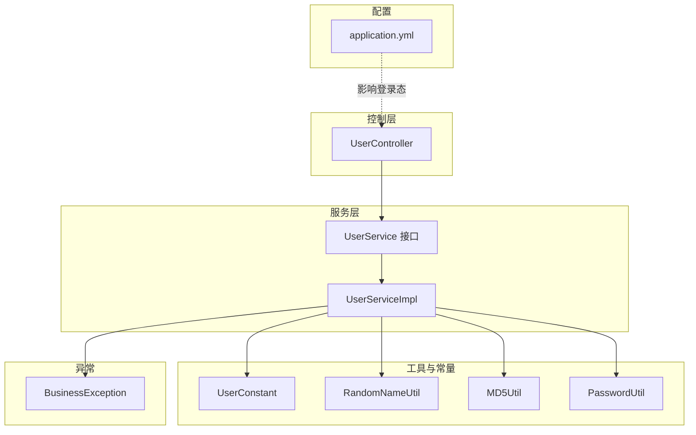
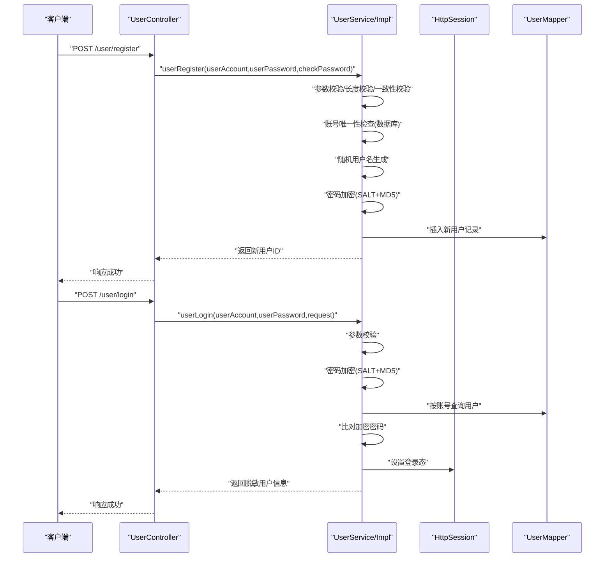
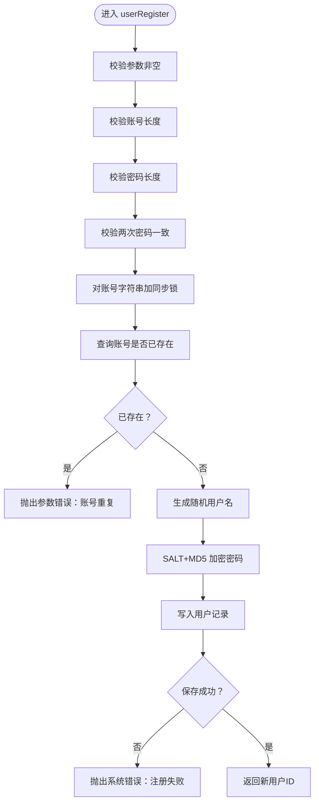
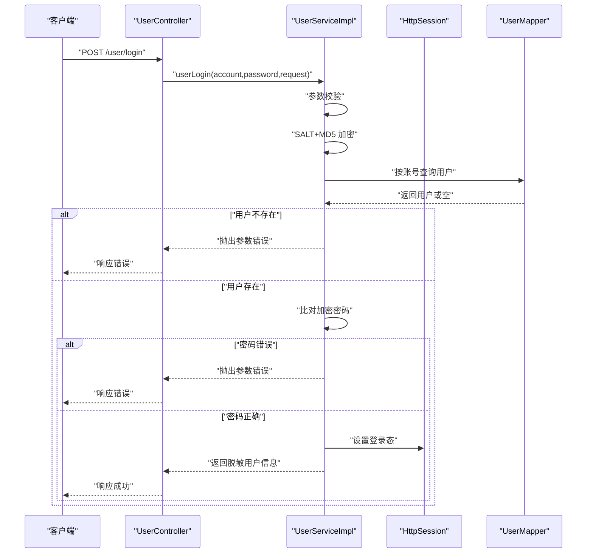
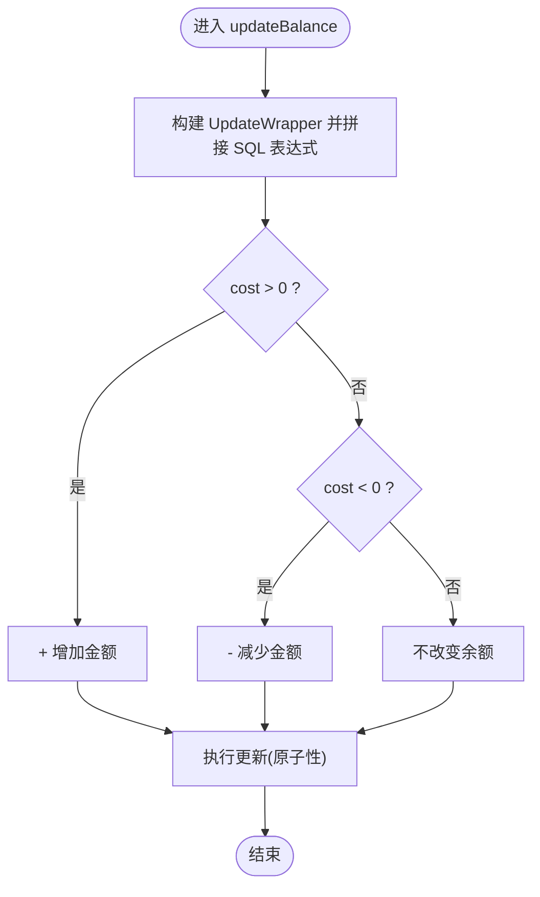
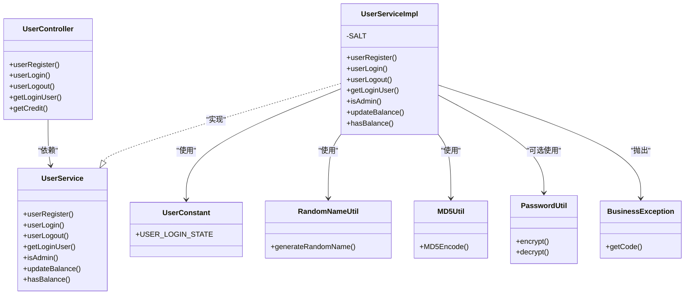

# 用户服务（UserService）

<cite>
**本文引用的文件**
- [UserService.java](file://yun-docker-master/src/main/java/com/lfc/yundocker/service/UserService.java)
- [UserServiceImpl.java](file://yun-docker-master/src/main/java/com/lfc/yundocker/service/impl/UserServiceImpl.java)
- [UserController.java](file://yun-docker-master/src/main/java/com/lfc/yundocker/controller/UserController.java)
- [UserRegisterRequest.java](file://yun-docker-common/src/main/java/com/lfc/yundocker/common/model/dto/user/UserRegisterRequest.java)
- [UserLoginRequest.java](file://yun-docker-common/src/main/java/com/lfc/yundocker/common/model/dto/user/UserLoginRequest.java)
- [BusinessException.java](file://yun-docker-common/src/main/java/com/lfc/yundocker/common/exception/BusinessException.java)
- [UserConstant.java](file://yun-docker-common/src/main/java/com/lfc/yundocker/common/constant/UserConstant.java)
- [UserRoleEnum.java](file://yun-docker-common/src/main/java/com/lfc/yundocker/common/model/enums/UserRoleEnum.java)
- [RandomNameUtil.java](file://yun-docker-common/src/main/java/com/lfc/yundocker/common/util/RandomNameUtil.java)
- [MD5Util.java](file://yun-docker-common/src/main/java/com/lfc/yundocker/common/util/MD5Util.java)
- [PasswordUtil.java](file://yun-docker-common/src/main/java/com/lfc/yundocker/common/util/PasswordUtil.java)
- [application.yml](file://yun-docker-master/src/main/resources/application.yml)
- [UserServiceTest.java](file://yun-docker-master/src/test/java/com/lfc/yundocker/service/UserServiceTest.java)
</cite>

## 目录
1. [简介](#简介)
2. [项目结构](#项目结构)
3. [核心组件](#核心组件)
4. [架构总览](#架构总览)
5. [详细组件分析](#详细组件分析)
6. [依赖关系分析](#依赖关系分析)
7. [性能与并发特性](#性能与并发特性)
8. [故障排查指南](#故障排查指南)
9. [结论](#结论)
10. [附录：调用示例与最佳实践](#附录调用示例与最佳实践)

## 简介
本文件围绕 UserService 接口及其实现类 UserServiceImpl 的业务逻辑进行深入解析，重点覆盖：
- 用户注册流程：参数校验、密码加密（SALT+MD5）、账号唯一性检查、随机用户名生成
- 用户登录流程：基于 Session 的登录态管理、密码比对的安全实践
- 余额管理：updateBalance 使用 SQL 表达式实现原子性增减，hasBalance 用于资源使用前的余额预检
- 异常处理策略（BusinessException）与权限校验辅助方法（isAdmin）
- 结合容器服务中的扣费与退款场景说明余额操作的重要性
- 提供用户注册、登录、余额查询等核心功能的调用示例路径

## 项目结构
用户服务位于后端主模块中，采用分层架构：
- 控制层：UserController 提供 REST 接口
- 服务层：UserService 接口与 UserServiceImpl 实现
- 工具与常量：UserConstant、RandomNameUtil、MD5Util、PasswordUtil
- 异常体系：BusinessException
- 配置：application.yml 中包含 session 与多环境配置

图表来源
- [UserController.java](file://yun-docker-master/src/main/java/com/lfc/yundocker/controller/UserController.java#L1-L309)
- [UserService.java](file://yun-docker-master/src/main/java/com/lfc/yundocker/service/UserService.java#L1-L124)
- [UserServiceImpl.java](file://yun-docker-master/src/main/java/com/lfc/yundocker/service/impl/UserServiceImpl.java#L1-L301)
- [UserConstant.java](file://yun-docker-common/src/main/java/com/lfc/yundocker/common/constant/UserConstant.java#L1-L34)
- [RandomNameUtil.java](file://yun-docker-common/src/main/java/com/lfc/yundocker/common/util/RandomNameUtil.java#L1-L30)
- [MD5Util.java](file://yun-docker-common/src/main/java/com/lfc/yundocker/common/util/MD5Util.java#L1-L50)
- [PasswordUtil.java](file://yun-docker-common/src/main/java/com/lfc/yundocker/common/util/PasswordUtil.java#L1-L188)
- [application.yml](file://yun-docker-master/src/main/resources/application.yml#L1-L60)

章节来源
- [UserController.java](file://yun-docker-master/src/main/java/com/lfc/yundocker/controller/UserController.java#L1-L309)
- [UserService.java](file://yun-docker-master/src/main/java/com/lfc/yundocker/service/UserService.java#L1-L124)
- [UserServiceImpl.java](file://yun-docker-master/src/main/java/com/lfc/yundocker/service/impl/UserServiceImpl.java#L1-L301)
- [application.yml](file://yun-docker-master/src/main/resources/application.yml#L1-L60)

## 核心组件
- UserService 接口：定义用户注册、登录、注销、当前登录用户获取、权限校验、余额查询与更新等能力
- UserServiceImpl 实现：完成参数校验、密码加密、账号唯一性检查、随机用户名生成、Session 登录态维护、余额原子性增减、余额预检等
- 控制器 UserController：暴露 /user/register、/user/login、/user/logout、/user/get/login、/user/get/credit 等接口
- 异常 BusinessException：统一业务异常抛出与错误码传递
- 工具与常量：UserConstant（登录态键）、RandomNameUtil（随机用户名）、MD5Util（MD5 工具）、PasswordUtil（更安全的加盐加密工具）

章节来源
- [UserService.java](file://yun-docker-master/src/main/java/com/lfc/yundocker/service/UserService.java#L1-L124)
- [UserServiceImpl.java](file://yun-docker-master/src/main/java/com/lfc/yundocker/service/impl/UserServiceImpl.java#L1-L301)
- [UserController.java](file://yun-docker-master/src/main/java/com/lfc/yundocker/controller/UserController.java#L1-L309)
- [BusinessException.java](file://yun-docker-common/src/main/java/com/lfc/yundocker/common/exception/BusinessException.java#L1-L37)
- [UserConstant.java](file://yun-docker-common/src/main/java/com/lfc/yundocker/common/constant/UserConstant.java#L1-L34)
- [RandomNameUtil.java](file://yun-docker-common/src/main/java/com/lfc/yundocker/common/util/RandomNameUtil.java#L1-L30)
- [MD5Util.java](file://yun-docker-common/src/main/java/com/lfc/yundocker/common/util/MD5Util.java#L1-L50)
- [PasswordUtil.java](file://yun-docker-common/src/main/java/com/lfc/yundocker/common/util/PasswordUtil.java#L1-L188)

## 架构总览
用户服务整体交互流程如下：

图表来源
- [UserController.java](file://yun-docker-master/src/main/java/com/lfc/yundocker/controller/UserController.java#L50-L84)
- [UserServiceImpl.java](file://yun-docker-master/src/main/java/com/lfc/yundocker/service/impl/UserServiceImpl.java#L48-L137)
- [UserConstant.java](file://yun-docker-common/src/main/java/com/lfc/yundocker/common/constant/UserConstant.java#L1-L34)

## 详细组件分析

### 注册流程：参数校验、密码加密、账号唯一性、随机用户名
- 参数校验
  - 账号、密码、确认密码均不能为空
  - 账号长度至少为阈值
  - 密码长度至少为阈值
  - 两次输入密码必须一致
- 账号唯一性
  - 使用数据库查询计数，若大于 0 则拒绝注册
  - 使用同步块对账号字符串进行同步，避免并发重复注册
- 密码加密
  - 使用固定盐值与 MD5 进行哈希
  - 采用工具类进行哈希计算
- 随机用户名
  - 通过随机组合形容词与名词生成用户名
- 数据入库
  - 写入账号、加密后的密码、随机用户名
  - 返回新用户 ID；保存失败抛出系统异常

图表来源
- [UserServiceImpl.java](file://yun-docker-master/src/main/java/com/lfc/yundocker/service/impl/UserServiceImpl.java#L48-L88)
- [RandomNameUtil.java](file://yun-docker-common/src/main/java/com/lfc/yundocker/common/util/RandomNameUtil.java#L1-L30)
- [MD5Util.java](file://yun-docker-common/src/main/java/com/lfc/yundocker/common/util/MD5Util.java#L1-L50)

章节来源
- [UserServiceImpl.java](file://yun-docker-master/src/main/java/com/lfc/yundocker/service/impl/UserServiceImpl.java#L48-L88)
- [RandomNameUtil.java](file://yun-docker-common/src/main/java/com/lfc/yundocker/common/util/RandomNameUtil.java#L1-L30)
- [MD5Util.java](file://yun-docker-common/src/main/java/com/lfc/yundocker/common/util/MD5Util.java#L1-L50)

### 登录流程：Session 登录态与密码比对
- 参数校验
  - 账号与密码不能为空且满足长度要求
- 密码加密与比对
  - 使用相同 SALT+MD5 对输入密码进行哈希，与数据库存储的哈希比对
- 登录态管理
  - 将用户对象放入 HttpSession，键由常量定义
- 返回脱敏用户信息
  - 通过 VO 对象返回敏感字段脱敏后的用户信息

图表来源
- [UserController.java](file://yun-docker-master/src/main/java/com/lfc/yundocker/controller/UserController.java#L72-L84)
- [UserServiceImpl.java](file://yun-docker-master/src/main/java/com/lfc/yundocker/service/impl/UserServiceImpl.java#L106-L137)
- [UserConstant.java](file://yun-docker-common/src/main/java/com/lfc/yundocker/common/constant/UserConstant.java#L1-L34)

章节来源
- [UserServiceImpl.java](file://yun-docker-master/src/main/java/com/lfc/yundocker/service/impl/UserServiceImpl.java#L106-L137)
- [UserConstant.java](file://yun-docker-common/src/main/java/com/lfc/yundocker/common/constant/UserConstant.java#L1-L34)

### 权限校验与注销
- isAdmin(HttpServletRequest)
  - 从 Session 中取出当前用户，再调用 isAdmin(User) 判断是否为管理员
- userLogout
  - 若 Session 中无登录态则抛出操作错误
  - 否则移除登录态并返回成功

章节来源
- [UserServiceImpl.java](file://yun-docker-master/src/main/java/com/lfc/yundocker/service/impl/UserServiceImpl.java#L213-L245)

### 余额管理：原子性增减与余额预检
- updateBalance(cost, userId)
  - 使用 UpdateWrapper 和 setSql 直接拼接 SQL 表达式，实现余额的原子性增减
  - 正数表示充值，负数表示消费（绝对值）
- hasBalance(userId)
  - 读取用户余额并判断是否超过阈值，用于资源使用前的余额预检

图表来源
- [UserServiceImpl.java](file://yun-docker-master/src/main/java/com/lfc/yundocker/service/impl/UserServiceImpl.java#L90-L103)
- [UserController.java](file://yun-docker-master/src/main/java/com/lfc/yundocker/controller/UserController.java#L236-L240)

章节来源
- [UserServiceImpl.java](file://yun-docker-master/src/main/java/com/lfc/yundocker/service/impl/UserServiceImpl.java#L90-L103)
- [UserController.java](file://yun-docker-master/src/main/java/com/lfc/yundocker/controller/UserController.java#L236-L240)

### 异常处理策略（BusinessException）
- 统一使用 BusinessException 抛出业务异常，携带错误码与消息
- 控制器层捕获并封装为标准响应
- 测试用例验证了注册阶段的参数校验与异常行为

章节来源
- [BusinessException.java](file://yun-docker-common/src/main/java/com/lfc/yundocker/common/exception/BusinessException.java#L1-L37)
- [UserServiceTest.java](file://yun-docker-master/src/test/java/com/lfc/yundocker/service/UserServiceTest.java#L1-L34)

### 设计考量：Session vs JWT
- 当前实现采用基于 Session 的登录态管理，键由 UserConstant 定义
- application.yml 中配置了 session 超时与 cookie 最大年龄
- 若未来需要分布式部署或跨域场景，可考虑引入 JWT 替代方案，但当前代码未实现

章节来源
- [UserConstant.java](file://yun-docker-common/src/main/java/com/lfc/yundocker/common/constant/UserConstant.java#L1-L34)
- [application.yml](file://yun-docker-master/src/main/resources/application.yml#L23-L41)

## 依赖关系分析
- 控制层依赖服务层接口
- 服务实现依赖工具类（随机名、MD5）、常量（登录态键）、枚举（角色）、异常类
- 控制层与服务层之间通过 DTO（注册/登录请求体）进行参数传递

图表来源
- [UserController.java](file://yun-docker-master/src/main/java/com/lfc/yundocker/controller/UserController.java#L1-L309)
- [UserService.java](file://yun-docker-master/src/main/java/com/lfc/yundocker/service/UserService.java#L1-L124)
- [UserServiceImpl.java](file://yun-docker-master/src/main/java/com/lfc/yundocker/service/impl/UserServiceImpl.java#L1-L301)
- [UserConstant.java](file://yun-docker-common/src/main/java/com/lfc/yundocker/common/constant/UserConstant.java#L1-L34)
- [RandomNameUtil.java](file://yun-docker-common/src/main/java/com/lfc/yundocker/common/util/RandomNameUtil.java#L1-L30)
- [MD5Util.java](file://yun-docker-common/src/main/java/com/lfc/yundocker/common/util/MD5Util.java#L1-L50)
- [PasswordUtil.java](file://yun-docker-common/src/main/java/com/lfc/yundocker/common/util/PasswordUtil.java#L1-L188)
- [BusinessException.java](file://yun-docker-common/src/main/java/com/lfc/yundocker/common/exception/BusinessException.java#L1-L37)

## 性能与并发特性
- 注册流程的账号唯一性检查通过同步块保护，避免并发重复注册导致的数据竞争
- 登录态采用 Session 存储，简单可靠；若需分布式部署，建议引入 Redis 或 JWT
- updateBalance 使用 SQL 表达式直接在数据库层面原子性更新，避免读取-修改-写回的竞态

章节来源
- [UserServiceImpl.java](file://yun-docker-master/src/main/java/com/lfc/yundocker/service/impl/UserServiceImpl.java#L63-L88)
- [UserServiceImpl.java](file://yun-docker-master/src/main/java/com/lfc/yundocker/service/impl/UserServiceImpl.java#L90-L103)
- [application.yml](file://yun-docker-master/src/main/resources/application.yml#L23-L41)

## 故障排查指南
- 注册失败
  - 检查账号长度、密码长度、两次密码一致性
  - 确认账号未重复
  - 查看数据库是否可写
- 登录失败
  - 确认账号存在且密码正确（SALT+MD5）
  - 检查 Session 是否设置成功
- 余额问题
  - 确认传入的 cost 符合预期（正数为充值，负数为消费）
  - 检查用户余额是否足够（hasBalance 预检）
- 异常定位
  - BusinessException 携带错误码，结合日志定位具体原因

章节来源
- [UserServiceImpl.java](file://yun-docker-master/src/main/java/com/lfc/yundocker/service/impl/UserServiceImpl.java#L48-L137)
- [UserServiceImpl.java](file://yun-docker-master/src/main/java/com/lfc/yundocker/service/impl/UserServiceImpl.java#L90-L103)
- [BusinessException.java](file://yun-docker-common/src/main/java/com/lfc/yundocker/common/exception/BusinessException.java#L1-L37)

## 结论
- UserServiceImpl 在注册与登录环节实现了基础而关键的安全与一致性保障
- 通过 SALT+MD5 加密与 Session 登录态管理，满足单实例登录态需求
- 余额管理采用 SQL 表达式实现原子性更新，适合容器服务中的扣费与退款场景
- 建议后续在分布式场景下评估引入 JWT 或 Redis Session，以提升扩展性与可用性

## 附录：调用示例与最佳实践
- 用户注册
  - 请求路径：POST /api/user/register
  - 请求体：UserRegisterRequest（包含 userAccount、userPassword、checkPassword）
  - 响应：BaseResponse<Long>，返回新用户ID
  - 示例路径参考：[UserController.userRegister](file://yun-docker-master/src/main/java/com/lfc/yundocker/controller/UserController.java#L50-L63)
- 用户登录
  - 请求路径：POST /api/user/login
  - 请求体：UserLoginRequest（包含 userAccount、userPassword）
  - 响应：BaseResponse<LoginUserVO>，返回脱敏用户信息
  - 示例路径参考：[UserController.userLogin](file://yun-docker-master/src/main/java/com/lfc/yundocker/controller/UserController.java#L72-L84)
- 用户注销
  - 请求路径：POST /api/user/logout
  - 响应：BaseResponse<Boolean>
  - 示例路径参考：[UserController.userLogout](file://yun-docker-master/src/main/java/com/lfc/yundocker/controller/UserController.java#L115-L122)
- 获取当前登录用户
  - 请求路径：GET /api/user/get/login
  - 响应：BaseResponse<LoginUserVO>
  - 示例路径参考：[UserController.getLoginUser](file://yun-docker-master/src/main/java/com/lfc/yundocker/controller/UserController.java#L130-L134)
- 查询积分余额
  - 请求路径：GET /api/user/get/credit
  - 响应：BaseResponse<Integer>
  - 示例路径参考：[UserController.getCredit](file://yun-docker-master/src/main/java/com/lfc/yundocker/controller/UserController.java#L236-L240)
- 余额预检
  - 方法：UserService.hasBalance(userId)
  - 场景：在发起容器扣费/退款前进行余额预检
  - 示例路径参考：[UserService.hasBalance](file://yun-docker-master/src/main/java/com/lfc/yundocker/service/UserService.java#L120-L123)、[UserServiceImpl.hasBalance](file://yun-docker-master/src/main/java/com/lfc/yundocker/service/impl/UserServiceImpl.java#L295-L299)

最佳实践
- 注册：严格校验参数长度与一致性，确保账号唯一性，使用 SALT+MD5 加密
- 登录：保持密码加密方式一致，Session 登录态键统一管理
- 余额：使用 updateBalance 的原子性更新，配合 hasBalance 预检
- 异常：统一 BusinessException 抛出，便于前端与日志统一处理
- 安全：在分布式部署时考虑引入 JWT 或 Redis Session，避免单点 Session 不可共享的问题