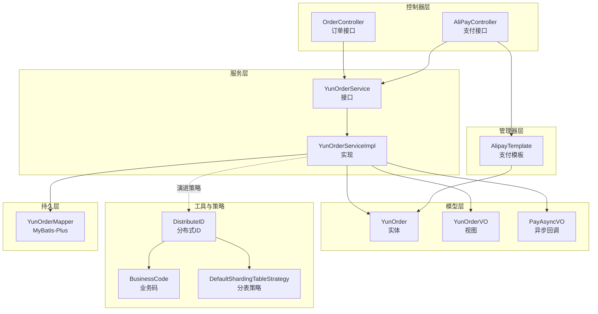
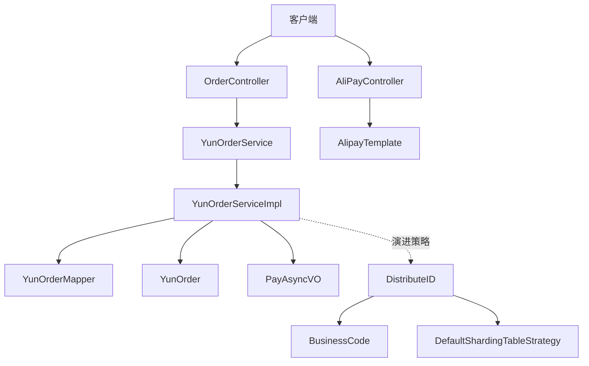
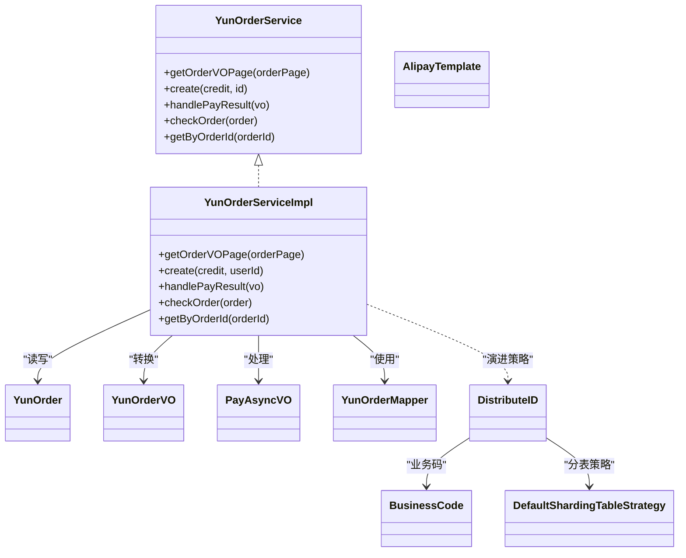
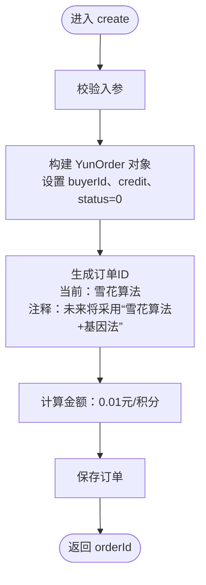
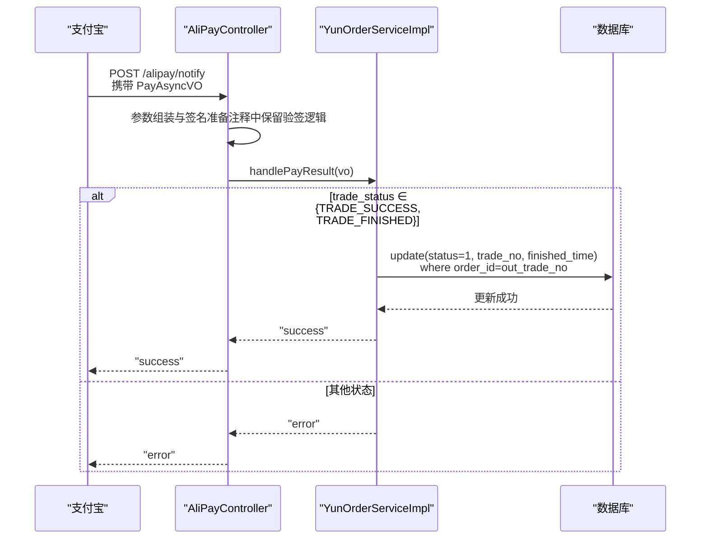
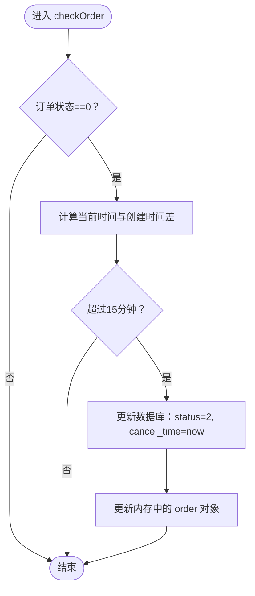
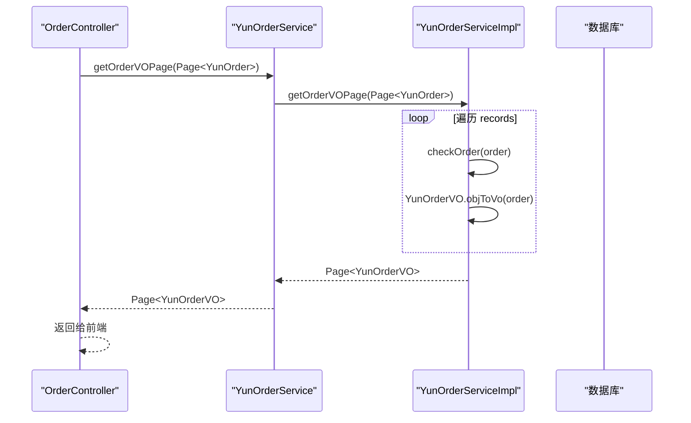
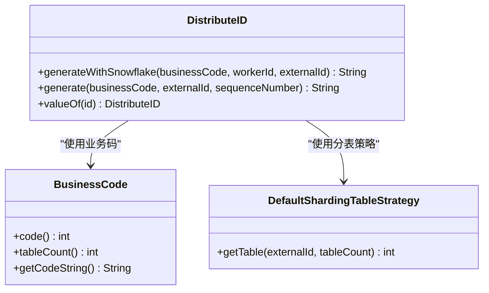
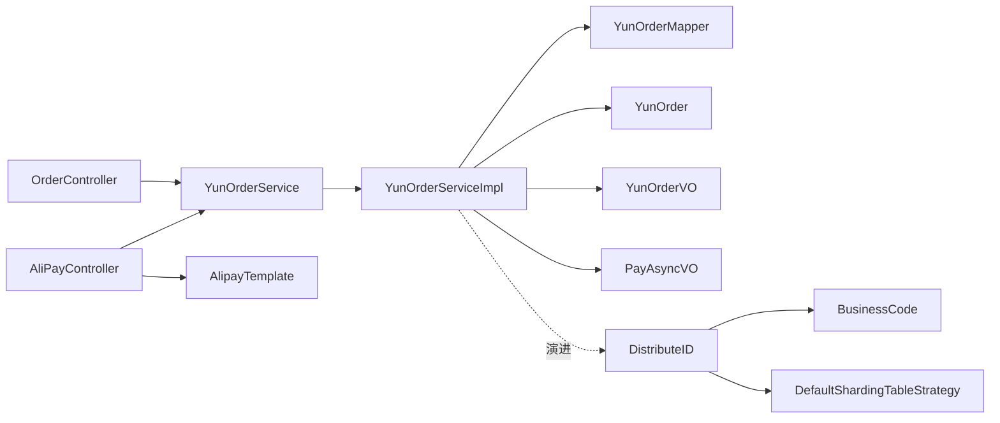

# 订单服务（YunOrderService）

<cite>
**本文引用的文件**
- [YunOrderService.java](file://yun-docker-master/src/main/java/com/lfc/yundocker/service/YunOrderService.java)
- [YunOrderServiceImpl.java](file://yun-docker-master/src/main/java/com/lfc/yundocker/service/impl/YunOrderServiceImpl.java)
- [YunOrder.java](file://yun-docker-master/src/main/java/com/lfc/yundocker/common/model/entity/YunOrder.java)
- [PayAsyncVO.java](file://yun-docker-master/src/main/java/com/lfc/yundocker/common/model/vo/PayAsyncVO.java)
- [OrderController.java](file://yun-docker-master/src/main/java/com/lfc/yundocker/controller/OrderController.java)
- [AliPayController.java](file://yun-docker-master/src/main/java/com/lfc/yundocker/controller/AliPayController.java)
- [AlipayTemplate.java](file://yun-docker-master/src/main/java/com/lfc/yundocker/manager/AlipayTemplate.java)
- [YunOrderMapper.java](file://yun-docker-master/src/main/java/com/lfc/yundocker/mapper/YunOrderMapper.java)
- [YunOrderVO.java](file://yun-docker-master/src/main/java/com/lfc/yundocker/common/model/vo/YunOrderVO.java)
- [DistributeID.java](file://yun-docker-common/src/main/java/com/lfc/yundocker/common/util/id/DistributeID.java)
- [BusinessCode.java](file://yun-docker-common/src/main/java/com/lfc/yundocker/common/util/id/BusinessCode.java)
- [DefaultShardingTableStrategy.java](file://yun-docker-common/src/main/java/com/lfc/yundocker/common/util/strategy/DefaultShardingTableStrategy.java)
</cite>

## 目录
1. [简介](#简介)
2. [项目结构](#项目结构)
3. [核心组件](#核心组件)
4. [架构总览](#架构总览)
5. [详细组件分析](#详细组件分析)
6. [依赖关系分析](#依赖关系分析)
7. [性能与扩展性](#性能与扩展性)
8. [故障排查指南](#故障排查指南)
9. [结论](#结论)
10. [附录：流程示例](#附录流程示例)

## 简介
本文件围绕 YunOrderService 接口及其实现类 YunOrderServiceImpl 展开，重点解析以下能力：
- create 方法：基于用户充值积分生成唯一订单ID（当前采用雪花算法，注释中预留了“雪花算法+基因法”的演进方向）、按 0.01 元/积分计算金额并创建待支付订单。
- handlePayResult 方法：处理支付宝异步回调（PayAsyncVO），当交易状态为 TRADE_SUCCESS 或 TRADE_FINISHED 时，更新订单状态为已支付、记录支付宝交易号与完成时间。
- checkOrder 方法：在用户查询订单时进行自动检查，若订单未支付且创建时间超过 15 分钟则自动取消（状态置为 2）。
- getOrderVOPage 方法：在分页查询时集成 checkOrder，确保返回的订单数据实时准确。
- 订单 ID 生成策略演进：从当前雪花算法到“雪花算法+基因法”（业务码+外部ID+分表位）的演进方向说明。

## 项目结构
订单相关模块主要分布在以下位置：
- 控制器层：OrderController（订单分页、创建、详情、取消）、AliPayController（支付发起、异步回调）
- 服务层：YunOrderService 接口、YunOrderServiceImpl 实现
- 模型层：YunOrder 实体、YunOrderVO 视图对象、PayAsyncVO 回调参数
- 管理器层：AlipayTemplate 支付模板（封装支付宝 SDK 调用）
- Mapper 层：YunOrderMapper 基于 MyBatis-Plus 的基础映射
- 工具与策略：DistributeID（分布式 ID 生成器）、BusinessCode（业务码枚举）、DefaultShardingTableStrategy（默认分表策略）

图表来源
- [OrderController.java](file://yun-docker-master/src/main/java/com/lfc/yundocker/controller/OrderController.java#L1-L121)
- [AliPayController.java](file://yun-docker-master/src/main/java/com/lfc/yundocker/controller/AliPayController.java#L1-L113)
- [YunOrderService.java](file://yun-docker-master/src/main/java/com/lfc/yundocker/service/YunOrderService.java#L1-L27)
- [YunOrderServiceImpl.java](file://yun-docker-master/src/main/java/com/lfc/yundocker/service/impl/YunOrderServiceImpl.java#L1-L118)
- [YunOrder.java](file://yun-docker-master/src/main/java/com/lfc/yundocker/common/model/entity/YunOrder.java#L1-L77)
- [YunOrderVO.java](file://yun-docker-master/src/main/java/com/lfc/yundocker/common/model/vo/YunOrderVO.java#L1-L99)
- [PayAsyncVO.java](file://yun-docker-master/src/main/java/com/lfc/yundocker/common/model/vo/PayAsyncVO.java#L1-L39)
- [AlipayTemplate.java](file://yun-docker-master/src/main/java/com/lfc/yundocker/manager/AlipayTemplate.java#L1-L107)
- [YunOrderMapper.java](file://yun-docker-master/src/main/java/com/lfc/yundocker/mapper/YunOrderMapper.java#L1-L19)
- [DistributeID.java](file://yun-docker-common/src/main/java/com/lfc/yundocker/common/util/id/DistributeID.java#L1-L91)
- [BusinessCode.java](file://yun-docker-common/src/main/java/com/lfc/yundocker/common/util/id/BusinessCode.java#L1-L50)
- [DefaultShardingTableStrategy.java](file://yun-docker-common/src/main/java/com/lfc/yundocker/common/util/strategy/DefaultShardingTableStrategy.java#L1-L20)

章节来源
- [OrderController.java](file://yun-docker-master/src/main/java/com/lfc/yundocker/controller/OrderController.java#L1-L121)
- [AliPayController.java](file://yun-docker-master/src/main/java/com/lfc/yundocker/controller/AliPayController.java#L1-L113)
- [YunOrderService.java](file://yun-docker-master/src/main/java/com/lfc/yundocker/service/YunOrderService.java#L1-L27)
- [YunOrderServiceImpl.java](file://yun-docker-master/src/main/java/com/lfc/yundocker/service/impl/YunOrderServiceImpl.java#L1-L118)
- [YunOrder.java](file://yun-docker-master/src/main/java/com/lfc/yundocker/common/model/entity/YunOrder.java#L1-L77)
- [YunOrderVO.java](file://yun-docker-master/src/main/java/com/lfc/yundocker/common/model/vo/YunOrderVO.java#L1-L99)
- [PayAsyncVO.java](file://yun-docker-master/src/main/java/com/lfc/yundocker/common/model/vo/PayAsyncVO.java#L1-L39)
- [AlipayTemplate.java](file://yun-docker-master/src/main/java/com/lfc/yundocker/manager/AlipayTemplate.java#L1-L107)
- [YunOrderMapper.java](file://yun-docker-master/src/main/java/com/lfc/yundocker/mapper/YunOrderMapper.java#L1-L19)
- [DistributeID.java](file://yun-docker-common/src/main/java/com/lfc/yundocker/common/util/id/DistributeID.java#L1-L91)
- [BusinessCode.java](file://yun-docker-common/src/main/java/com/lfc/yundocker/common/util/id/BusinessCode.java#L1-L50)
- [DefaultShardingTableStrategy.java](file://yun-docker-common/src/main/java/com/lfc/yundocker/common/util/strategy/DefaultShardingTableStrategy.java#L1-L20)

## 核心组件
- 接口 YunOrderService：定义订单服务的核心能力，包括分页查询转换、创建订单、处理支付回调、订单检查、按订单号查询。
- 实现类 YunOrderServiceImpl：提供具体实现，包含订单创建、支付回调处理、订单状态检查、按订单号查询以及分页 VO 转换。
- 实体与视图：YunOrder 描述订单字段，YunOrderVO 提供前端展示字段与状态文案映射。
- 支付回调：PayAsyncVO 封装支付宝异步回调参数。
- 支付模板：AlipayTemplate 封装支付宝 SDK 调用，负责发起支付并设置回调地址。
- 分布式 ID 与分表策略：DistributeID、BusinessCode、DefaultShardingTableStrategy 为未来“雪花算法+基因法”演进提供支撑。

章节来源
- [YunOrderService.java](file://yun-docker-master/src/main/java/com/lfc/yundocker/service/YunOrderService.java#L1-L27)
- [YunOrderServiceImpl.java](file://yun-docker-master/src/main/java/com/lfc/yundocker/service/impl/YunOrderServiceImpl.java#L1-L118)
- [YunOrder.java](file://yun-docker-master/src/main/java/com/lfc/yundocker/common/model/entity/YunOrder.java#L1-L77)
- [YunOrderVO.java](file://yun-docker-master/src/main/java/com/lfc/yundocker/common/model/vo/YunOrderVO.java#L1-L99)
- [PayAsyncVO.java](file://yun-docker-master/src/main/java/com/lfc/yundocker/common/model/vo/PayAsyncVO.java#L1-L39)
- [AlipayTemplate.java](file://yun-docker-master/src/main/java/com/lfc/yundocker/manager/AlipayTemplate.java#L1-L107)
- [DistributeID.java](file://yun-docker-common/src/main/java/com/lfc/yundocker/common/util/id/DistributeID.java#L1-L91)
- [BusinessCode.java](file://yun-docker-common/src/main/java/com/lfc/yundocker/common/util/id/BusinessCode.java#L1-L50)
- [DefaultShardingTableStrategy.java](file://yun-docker-common/src/main/java/com/lfc/yundocker/common/util/strategy/DefaultShardingTableStrategy.java#L1-L20)

## 架构总览
订单服务采用典型的分层架构：
- 控制器层负责接收请求、参数校验与返回封装；
- 服务层负责业务编排与领域逻辑；
- 持久层通过 MyBatis-Plus 访问数据库；
- 支付模板封装第三方支付交互；
- 工具与策略层提供分布式 ID 与分表能力，支撑未来演进。

图表来源
- [OrderController.java](file://yun-docker-master/src/main/java/com/lfc/yundocker/controller/OrderController.java#L1-L121)
- [AliPayController.java](file://yun-docker-master/src/main/java/com/lfc/yundocker/controller/AliPayController.java#L1-L113)
- [YunOrderService.java](file://yun-docker-master/src/main/java/com/lfc/yundocker/service/YunOrderService.java#L1-L27)
- [YunOrderServiceImpl.java](file://yun-docker-master/src/main/java/com/lfc/yundocker/service/impl/YunOrderServiceImpl.java#L1-L118)
- [YunOrderMapper.java](file://yun-docker-master/src/main/java/com/lfc/yundocker/mapper/YunOrderMapper.java#L1-L19)
- [YunOrder.java](file://yun-docker-master/src/main/java/com/lfc/yundocker/common/model/entity/YunOrder.java#L1-L77)
- [PayAsyncVO.java](file://yun-docker-master/src/main/java/com/lfc/yundocker/common/model/vo/PayAsyncVO.java#L1-L39)
- [AlipayTemplate.java](file://yun-docker-master/src/main/java/com/lfc/yundocker/manager/AlipayTemplate.java#L1-L107)
- [DistributeID.java](file://yun-docker-common/src/main/java/com/lfc/yundocker/common/util/id/DistributeID.java#L1-L91)
- [BusinessCode.java](file://yun-docker-common/src/main/java/com/lfc/yundocker/common/util/id/BusinessCode.java#L1-L50)
- [DefaultShardingTableStrategy.java](file://yun-docker-common/src/main/java/com/lfc/yundocker/common/util/strategy/DefaultShardingTableStrategy.java#L1-L20)

## 详细组件分析

### 接口与实现类关系

图表来源
- [YunOrderService.java](file://yun-docker-master/src/main/java/com/lfc/yundocker/service/YunOrderService.java#L1-L27)
- [YunOrderServiceImpl.java](file://yun-docker-master/src/main/java/com/lfc/yundocker/service/impl/YunOrderServiceImpl.java#L1-L118)
- [YunOrder.java](file://yun-docker-master/src/main/java/com/lfc/yundocker/common/model/entity/YunOrder.java#L1-L77)
- [YunOrderVO.java](file://yun-docker-master/src/main/java/com/lfc/yundocker/common/model/vo/YunOrderVO.java#L1-L99)
- [PayAsyncVO.java](file://yun-docker-master/src/main/java/com/lfc/yundocker/common/model/vo/PayAsyncVO.java#L1-L39)
- [YunOrderMapper.java](file://yun-docker-master/src/main/java/com/lfc/yundocker/mapper/YunOrderMapper.java#L1-L19)
- [AlipayTemplate.java](file://yun-docker-master/src/main/java/com/lfc/yundocker/manager/AlipayTemplate.java#L1-L107)
- [DistributeID.java](file://yun-docker-common/src/main/java/com/lfc/yundocker/common/util/id/DistributeID.java#L1-L91)
- [BusinessCode.java](file://yun-docker-common/src/main/java/com/lfc/yundocker/common/util/id/BusinessCode.java#L1-L50)
- [DefaultShardingTableStrategy.java](file://yun-docker-common/src/main/java/com/lfc/yundocker/common/util/strategy/DefaultShardingTableStrategy.java#L1-L20)

章节来源
- [YunOrderService.java](file://yun-docker-master/src/main/java/com/lfc/yundocker/service/YunOrderService.java#L1-L27)
- [YunOrderServiceImpl.java](file://yun-docker-master/src/main/java/com/lfc/yundocker/service/impl/YunOrderServiceImpl.java#L1-L118)

### create 方法：订单创建与 ID 生成
- 输入：积分数量 credit、用户 ID buyerId
- 订单 ID 生成：当前使用雪花算法生成唯一字符串 ID（注释提示后续将采用“雪花算法+基因法”，即业务码+外部ID+分表位）
- 金额计算：按 0.01 元/积分计算，保留合理精度
- 状态初始化：待支付（0）
- 数据持久化：保存订单并返回 orderId

图表来源
- [YunOrderServiceImpl.java](file://yun-docker-master/src/main/java/com/lfc/yundocker/service/impl/YunOrderServiceImpl.java#L47-L62)
- [YunOrder.java](file://yun-docker-master/src/main/java/com/lfc/yundocker/common/model/entity/YunOrder.java#L1-L77)
- [DistributeID.java](file://yun-docker-common/src/main/java/com/lfc/yundocker/common/util/id/DistributeID.java#L1-L91)
- [BusinessCode.java](file://yun-docker-common/src/main/java/com/lfc/yundocker/common/util/id/BusinessCode.java#L1-L50)

章节来源
- [YunOrderServiceImpl.java](file://yun-docker-master/src/main/java/com/lfc/yundocker/service/impl/YunOrderServiceImpl.java#L47-L62)
- [YunOrder.java](file://yun-docker-master/src/main/java/com/lfc/yundocker/common/model/entity/YunOrder.java#L1-L77)
- [DistributeID.java](file://yun-docker-common/src/main/java/com/lfc/yundocker/common/util/id/DistributeID.java#L1-L91)
- [BusinessCode.java](file://yun-docker-common/src/main/java/com/lfc/yundocker/common/util/id/BusinessCode.java#L1-L50)

### handlePayResult 方法：支付宝异步回调处理
- 输入：PayAsyncVO 回调参数
- 处理逻辑：当 trade_status 为 TRADE_SUCCESS 或 TRADE_FINISHED 时
  - 更新订单状态为已支付（1）
  - 记录支付宝交易号 trade_no
  - 记录完成时间 finished_time
  - 使用 out_trade_no（商户订单号）匹配订单
- 返回：成功字符串，用于支付宝回调确认

图表来源
- [AliPayController.java](file://yun-docker-master/src/main/java/com/lfc/yundocker/controller/AliPayController.java#L74-L96)
- [YunOrderServiceImpl.java](file://yun-docker-master/src/main/java/com/lfc/yundocker/service/impl/YunOrderServiceImpl.java#L70-L81)
- [PayAsyncVO.java](file://yun-docker-master/src/main/java/com/lfc/yundocker/common/model/vo/PayAsyncVO.java#L1-L39)

章节来源
- [AliPayController.java](file://yun-docker-master/src/main/java/com/lfc/yundocker/controller/AliPayController.java#L74-L96)
- [YunOrderServiceImpl.java](file://yun-docker-master/src/main/java/com/lfc/yundocker/service/impl/YunOrderServiceImpl.java#L70-L81)
- [PayAsyncVO.java](file://yun-docker-master/src/main/java/com/lfc/yundocker/common/model/vo/PayAsyncVO.java#L1-L39)

### checkOrder 方法：订单自动检查与取消
- 触发时机：用户查询订单详情或分页查询时，服务层会逐条调用该方法
- 检查规则：
  - 若订单状态为待支付（0）
  - 并且创建时间距当前超过 15 分钟
  - 则自动取消订单（状态置为 2），并记录取消时间 cancel_time
- 作用：保证未支付订单不会长期占用资源，提升系统一致性

图表来源
- [YunOrderServiceImpl.java](file://yun-docker-master/src/main/java/com/lfc/yundocker/service/impl/YunOrderServiceImpl.java#L88-L104)
- [YunOrder.java](file://yun-docker-master/src/main/java/com/lfc/yundocker/common/model/entity/YunOrder.java#L1-L77)

章节来源
- [YunOrderServiceImpl.java](file://yun-docker-master/src/main/java/com/lfc/yundocker/service/impl/YunOrderServiceImpl.java#L88-L104)
- [YunOrder.java](file://yun-docker-master/src/main/java/com/lfc/yundocker/common/model/entity/YunOrder.java#L1-L77)

### getOrderVOPage 方法：分页查询与实时性保障
- 输入：MyBatis-Plus Page<YunOrder>
- 处理逻辑：
  - 从 Page 中取出 records
  - 对每条订单先执行 checkOrder，再转换为 YunOrderVO
  - 组装 Page<YunOrderVO> 返回
- 价值：确保分页返回的数据均为最新状态，避免陈旧状态影响用户体验

图表来源
- [OrderController.java](file://yun-docker-master/src/main/java/com/lfc/yundocker/controller/OrderController.java#L40-L61)
- [YunOrderServiceImpl.java](file://yun-docker-master/src/main/java/com/lfc/yundocker/service/impl/YunOrderServiceImpl.java#L28-L45)
- [YunOrderVO.java](file://yun-docker-master/src/main/java/com/lfc/yundocker/common/model/vo/YunOrderVO.java#L1-L99)

章节来源
- [OrderController.java](file://yun-docker-master/src/main/java/com/lfc/yundocker/controller/OrderController.java#L40-L61)
- [YunOrderServiceImpl.java](file://yun-docker-master/src/main/java/com/lfc/yundocker/service/impl/YunOrderServiceImpl.java#L28-L45)
- [YunOrderVO.java](file://yun-docker-master/src/main/java/com/lfc/yundocker/common/model/vo/YunOrderVO.java#L1-L99)

### 订单 ID 生成策略演进
- 当前策略：雪花算法生成全局唯一字符串 ID
- 演进方向（注释中明确）：采用“雪花算法+基因法”
  - 结构组成：业务码（BusinessCode）+ 雪花序列号 + 分表位（DefaultShardingTableStrategy）
  - 优势：具备更强的可读性与可分片性，便于跨库分表与业务识别
- 工具链：DistributeID 提供 generateWithSnowflake、generate、valueOf 等方法；BusinessCode 定义业务码；DefaultShardingTableStrategy 提供分表策略

图表来源
- [DistributeID.java](file://yun-docker-common/src/main/java/com/lfc/yundocker/common/util/id/DistributeID.java#L1-L91)
- [BusinessCode.java](file://yun-docker-common/src/main/java/com/lfc/yundocker/common/util/id/BusinessCode.java#L1-L50)
- [DefaultShardingTableStrategy.java](file://yun-docker-common/src/main/java/com/lfc/yundocker/common/util/strategy/DefaultShardingTableStrategy.java#L1-L20)

章节来源
- [YunOrderServiceImpl.java](file://yun-docker-master/src/main/java/com/lfc/yundocker/service/impl/YunOrderServiceImpl.java#L52-L56)
- [DistributeID.java](file://yun-docker-common/src/main/java/com/lfc/yundocker/common/util/id/DistributeID.java#L1-L91)
- [BusinessCode.java](file://yun-docker-common/src/main/java/com/lfc/yundocker/common/util/id/BusinessCode.java#L1-L50)
- [DefaultShardingTableStrategy.java](file://yun-docker-common/src/main/java/com/lfc/yundocker/common/util/strategy/DefaultShardingTableStrategy.java#L1-L20)

## 依赖关系分析
- 控制器依赖服务：OrderController 与 AliPayController 注入 YunOrderService；AliPayController 还注入 AlipayTemplate
- 服务依赖持久层：YunOrderServiceImpl 通过 YunOrderMapper 访问数据库
- 实体与视图：YunOrder 作为持久化实体，YunOrderVO 作为前端展示对象，二者通过静态转换方法关联
- 支付回调：AliPayController 将支付宝回调参数封装为 PayAsyncVO，交由 YunOrderService 处理
- 分布式 ID：YunOrderServiceImpl 与 DistributeID 解耦，通过注释预留演进路径

图表来源
- [OrderController.java](file://yun-docker-master/src/main/java/com/lfc/yundocker/controller/OrderController.java#L1-L121)
- [AliPayController.java](file://yun-docker-master/src/main/java/com/lfc/yundocker/controller/AliPayController.java#L1-L113)
- [YunOrderService.java](file://yun-docker-master/src/main/java/com/lfc/yundocker/service/YunOrderService.java#L1-L27)
- [YunOrderServiceImpl.java](file://yun-docker-master/src/main/java/com/lfc/yundocker/service/impl/YunOrderServiceImpl.java#L1-L118)
- [YunOrderMapper.java](file://yun-docker-master/src/main/java/com/lfc/yundocker/mapper/YunOrderMapper.java#L1-L19)
- [YunOrder.java](file://yun-docker-master/src/main/java/com/lfc/yundocker/common/model/entity/YunOrder.java#L1-L77)
- [YunOrderVO.java](file://yun-docker-master/src/main/java/com/lfc/yundocker/common/model/vo/YunOrderVO.java#L1-L99)
- [PayAsyncVO.java](file://yun-docker-master/src/main/java/com/lfc/yundocker/common/model/vo/PayAsyncVO.java#L1-L39)
- [AlipayTemplate.java](file://yun-docker-master/src/main/java/com/lfc/yundocker/manager/AlipayTemplate.java#L1-L107)
- [DistributeID.java](file://yun-docker-common/src/main/java/com/lfc/yundocker/common/util/id/DistributeID.java#L1-L91)
- [BusinessCode.java](file://yun-docker-common/src/main/java/com/lfc/yundocker/common/util/id/BusinessCode.java#L1-L50)
- [DefaultShardingTableStrategy.java](file://yun-docker-common/src/main/java/com/lfc/yundocker/common/util/strategy/DefaultShardingTableStrategy.java#L1-L20)

章节来源
- [OrderController.java](file://yun-docker-master/src/main/java/com/lfc/yundocker/controller/OrderController.java#L1-L121)
- [AliPayController.java](file://yun-docker-master/src/main/java/com/lfc/yundocker/controller/AliPayController.java#L1-L113)
- [YunOrderService.java](file://yun-docker-master/src/main/java/com/lfc/yundocker/service/YunOrderService.java#L1-L27)
- [YunOrderServiceImpl.java](file://yun-docker-master/src/main/java/com/lfc/yundocker/service/impl/YunOrderServiceImpl.java#L1-L118)
- [YunOrderMapper.java](file://yun-docker-master/src/main/java/com/lfc/yundocker/mapper/YunOrderMapper.java#L1-L19)
- [YunOrder.java](file://yun-docker-master/src/main/java/com/lfc/yundocker/common/model/entity/YunOrder.java#L1-L77)
- [YunOrderVO.java](file://yun-docker-master/src/main/java/com/lfc/yundocker/common/model/vo/YunOrderVO.java#L1-L99)
- [PayAsyncVO.java](file://yun-docker-master/src/main/java/com/lfc/yundocker/common/model/vo/PayAsyncVO.java#L1-L39)
- [AlipayTemplate.java](file://yun-docker-master/src/main/java/com/lfc/yundocker/manager/AlipayTemplate.java#L1-L107)
- [DistributeID.java](file://yun-docker-common/src/main/java/com/lfc/yundocker/common/util/id/DistributeID.java#L1-L91)
- [BusinessCode.java](file://yun-docker-common/src/main/java/com/lfc/yundocker/common/util/id/BusinessCode.java#L1-L50)
- [DefaultShardingTableStrategy.java](file://yun-docker-common/src/main/java/com/lfc/yundocker/common/util/strategy/DefaultShardingTableStrategy.java#L1-L20)

## 性能与扩展性
- 订单创建：雪花算法生成 ID，具备高吞吐与低冲突特性；金额计算为 O(1)，保存为一次数据库写入
- 支付回调：条件更新仅在满足 TRADE_SUCCESS/TRADE_FINISHED 时执行，避免无效写入
- 自动检查：checkOrder 在分页与详情查询时触发，避免长时间未支付订单占用资源
- 分布式 ID 演进：采用“雪花算法+基因法”可提升可读性与分表能力，便于未来水平扩展

[本节为通用性能讨论，无需列出章节来源]

## 故障排查指南
- 支付回调未生效
  - 确认 AliPayController 的 /alipay/notify 接口为 POST，且回调 URL 正确配置
  - 确认 handlePayResult 中 trade_status 判断逻辑与支付宝回调一致
  - 若启用验签，请参考注释中的验签实现位置
- 订单状态异常
  - 检查 checkOrder 是否被正确调用（分页与详情均会触发）
  - 确认订单创建时金额计算与状态初始化逻辑
- 订单 ID 冲突或重复
  - 当前使用雪花算法，建议在演进到“雪花算法+基因法”后进一步降低冲突概率
- 分页数据陈旧
  - 确保 getOrderVOPage 中对每条记录都执行了 checkOrder

章节来源
- [AliPayController.java](file://yun-docker-master/src/main/java/com/lfc/yundocker/controller/AliPayController.java#L74-L112)
- [YunOrderServiceImpl.java](file://yun-docker-master/src/main/java/com/lfc/yundocker/service/impl/YunOrderServiceImpl.java#L28-L45)
- [YunOrderServiceImpl.java](file://yun-docker-master/src/main/java/com/lfc/yundocker/service/impl/YunOrderServiceImpl.java#L70-L81)
- [OrderController.java](file://yun-docker-master/src/main/java/com/lfc/yundocker/controller/OrderController.java#L40-L94)

## 结论
YunOrderService 与 YunOrderServiceImpl 提供了完整的订单生命周期管理能力：
- 订单创建：高效、可靠，金额与状态初始化清晰
- 支付回调：严格的状态判断，确保只在有效状态下更新
- 自动检查：在查询路径上保证数据实时性与一致性
- ID 演进：预留“雪花算法+基因法”方案，具备良好的扩展性

[本节为总结性内容，无需列出章节来源]

## 附录：流程示例

### 示例一：创建订单
- 请求入口：OrderController.addOrder
- 流程要点：
  - 校验积分参数
  - 调用 YunOrderService.create(credit, buyerId)
  - 服务层生成订单ID（当前雪花算法）、计算金额、初始化状态为待支付
  - 返回 orderId 给前端

章节来源
- [OrderController.java](file://yun-docker-master/src/main/java/com/lfc/yundocker/controller/OrderController.java#L63-L76)
- [YunOrderServiceImpl.java](file://yun-docker-master/src/main/java/com/lfc/yundocker/service/impl/YunOrderServiceImpl.java#L47-L62)

### 示例二：处理支付回调
- 请求入口：AliPayController.payNotify
- 流程要点：
  - 组装 PayAsyncVO 参数
  - 调用 YunOrderService.handlePayResult(vo)
  - 当 trade_status 为 TRADE_SUCCESS/TRADE_FINISHED 时，更新订单状态为已支付、记录支付宝交易号与完成时间
  - 返回 success 给支付宝

章节来源
- [AliPayController.java](file://yun-docker-master/src/main/java/com/lfc/yundocker/controller/AliPayController.java#L74-L96)
- [YunOrderServiceImpl.java](file://yun-docker-master/src/main/java/com/lfc/yundocker/service/impl/YunOrderServiceImpl.java#L70-L81)
- [PayAsyncVO.java](file://yun-docker-master/src/main/java/com/lfc/yundocker/common/model/vo/PayAsyncVO.java#L1-L39)

### 示例三：分页查询与实时性
- 请求入口：OrderController.listOrderByPage
- 流程要点：
  - 构造 Page 并查询订单列表
  - 调用 YunOrderService.getOrderVOPage(page)
  - 服务层对每条订单执行 checkOrder，再转换为 YunOrderVO
  - 返回带实时状态的分页结果

章节来源
- [OrderController.java](file://yun-docker-master/src/main/java/com/lfc/yundocker/controller/OrderController.java#L40-L61)
- [YunOrderServiceImpl.java](file://yun-docker-master/src/main/java/com/lfc/yundocker/service/impl/YunOrderServiceImpl.java#L28-L45)
- [YunOrderVO.java](file://yun-docker-master/src/main/java/com/lfc/yundocker/common/model/vo/YunOrderVO.java#L1-L99)