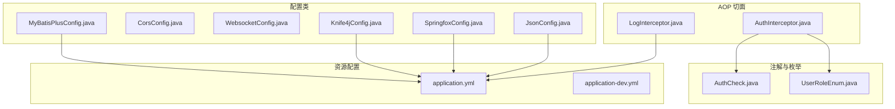
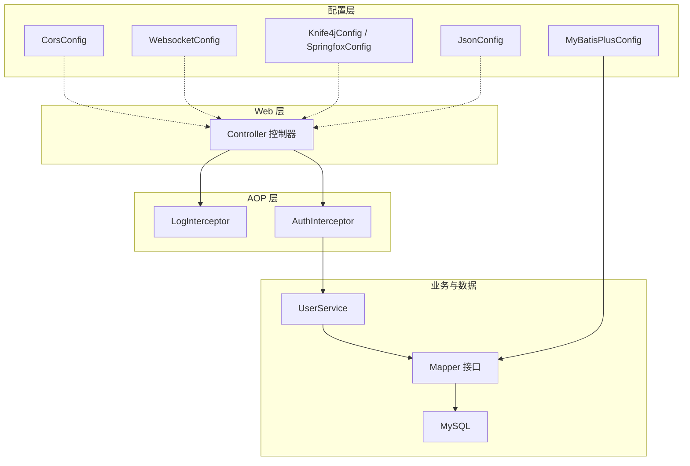
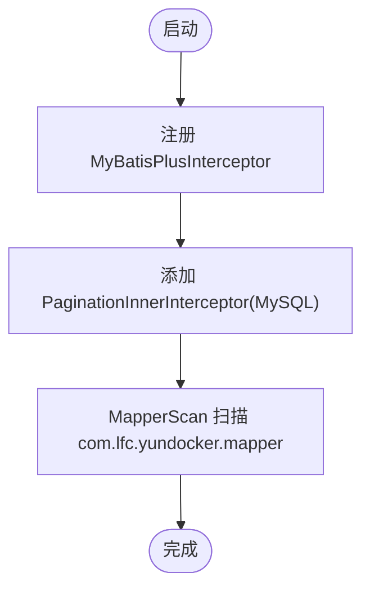
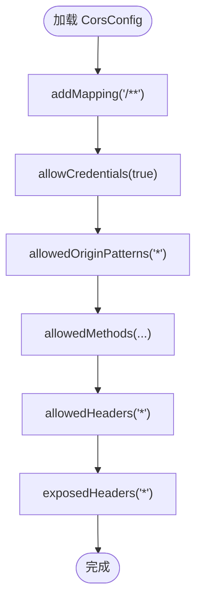
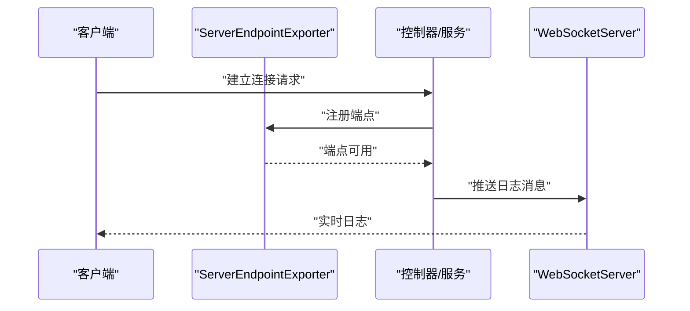
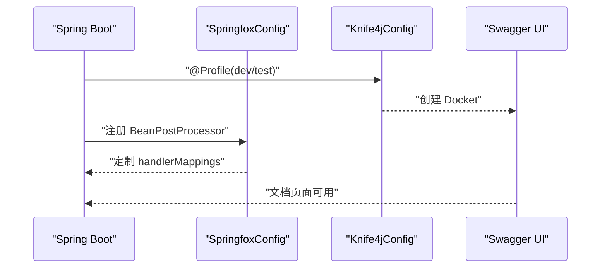
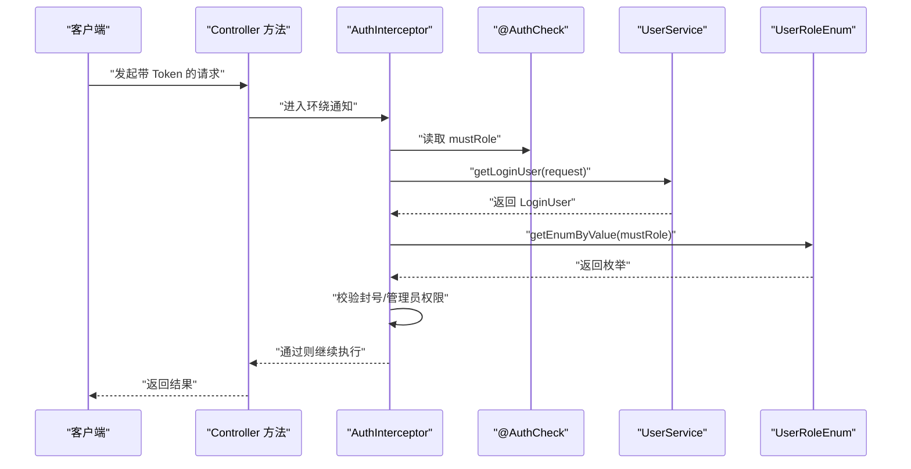
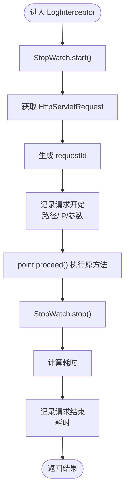
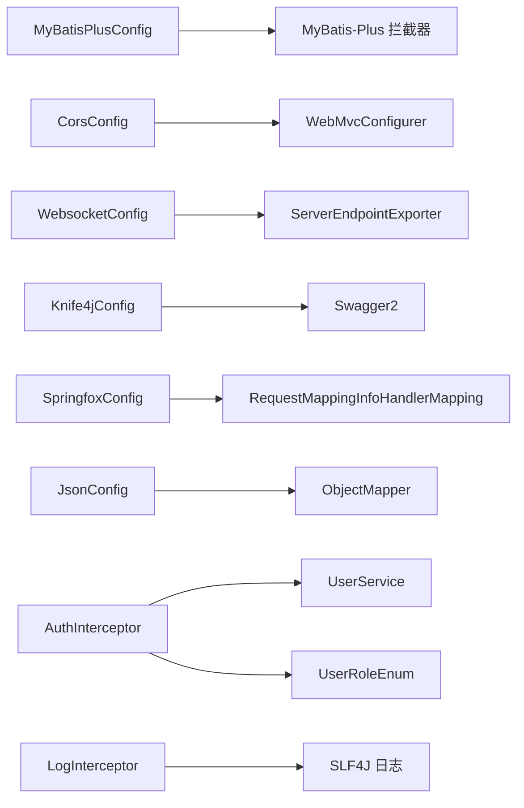

# 配置与切面管理

<cite>
**本文引用的文件**
- [MyBatisPlusConfig.java](file://yun-docker-master/src/main/java/com/lfc/yundocker/config/MyBatisPlusConfig.java)
- [CorsConfig.java](file://yun-docker-master/src/main/java/com/lfc/yundocker/config/CorsConfig.java)
- [WebsocketConfig.java](file://yun-docker-master/src/main/java/com/lfc/yundocker/config/WebsocketConfig.java)
- [Knife4jConfig.java](file://yun-docker-master/src/main/java/com/lfc/yundocker/config/Knife4jConfig.java)
- [SpringfoxConfig.java](file://yun-docker-master/src/main/java/com/lfc/yundocker/config/SpringfoxConfig.java)
- [JsonConfig.java](file://yun-docker-master/src/main/java/com/lfc/yundocker/config/JsonConfig.java)
- [AuthInterceptor.java](file://yun-docker-master/src/main/java/com/lfc/yundocker/aop/AuthInterceptor.java)
- [LogInterceptor.java](file://yun-docker-master/src/main/java/com/lfc/yundocker/aop/LogInterceptor.java)
- [AuthCheck.java](file://yun-docker-master/src/main/java/com/lfc/yundocker/annotation/AuthCheck.java)
- [UserRoleEnum.java](file://yun-docker-common/src/main/java/com/lfc/yundocker/common/model/enums/UserRoleEnum.java)
- [application.yml](file://yun-docker-master/src/main/resources/application.yml)
- [application-dev.yml](file://yun-docker-master/src/main/resources/application-dev.yml)
</cite>

## 目录
1. [简介](#简介)
2. [项目结构](#项目结构)
3. [核心组件](#核心组件)
4. [架构总览](#架构总览)
5. [详细组件分析](#详细组件分析)
6. [依赖关系分析](#依赖关系分析)
7. [性能考虑](#性能考虑)
8. [故障排查指南](#故障排查指南)
9. [结论](#结论)
10. [附录](#附录)

## 简介
本文件聚焦于 yun-docker-master 模块中的配置类与 AOP 切面实现，系统性解析以下主题：
- MyBatisPlusConfig 的分页插件配置
- 跨域 CORS 配置细节
- WebSocket 集成与实时日志推送能力
- Knife4j/Springfox 文档工具集成
- AuthInterceptor 结合 @AuthCheck 注解实现基于用户角色（UserRoleEnum）的权限控制流程
- LogInterceptor 请求日志记录机制（路径、参数、耗时）

## 项目结构
该模块采用“按职责分层”的组织方式，配置类集中在 config 包，AOP 切面在 aop 包，注解在 annotation 包，枚举在 yun-docker-common 中。资源文件位于 resources 下，包含应用与开发环境配置。

图表来源
- [MyBatisPlusConfig.java](file://yun-docker-master/src/main/java/com/lfc/yundocker/config/MyBatisPlusConfig.java#L1-L31)
- [CorsConfig.java](file://yun-docker-master/src/main/java/com/lfc/yundocker/config/CorsConfig.java#L1-L28)
- [WebsocketConfig.java](file://yun-docker-master/src/main/java/com/lfc/yundocker/config/WebsocketConfig.java#L1-L20)
- [Knife4jConfig.java](file://yun-docker-master/src/main/java/com/lfc/yundocker/config/Knife4jConfig.java#L1-L39)
- [SpringfoxConfig.java](file://yun-docker-master/src/main/java/com/lfc/yundocker/config/SpringfoxConfig.java#L1-L57)
- [JsonConfig.java](file://yun-docker-master/src/main/java/com/lfc/yundocker/config/JsonConfig.java#L1-L31)
- [AuthInterceptor.java](file://yun-docker-master/src/main/java/com/lfc/yundocker/aop/AuthInterceptor.java#L1-L70)
- [LogInterceptor.java](file://yun-docker-master/src/main/java/com/lfc/yundocker/aop/LogInterceptor.java#L1-L57)
- [AuthCheck.java](file://yun-docker-master/src/main/java/com/lfc/yundocker/annotation/AuthCheck.java#L1-L29)
- [UserRoleEnum.java](file://yun-docker-common/src/main/java/com/lfc/yundocker/common/model/enums/UserRoleEnum.java#L1-L64)
- [application.yml](file://yun-docker-master/src/main/resources/application.yml#L1-L60)
- [application-dev.yml](file://yun-docker-master/src/main/resources/application-dev.yml#L1-L81)

章节来源
- [MyBatisPlusConfig.java](file://yun-docker-master/src/main/java/com/lfc/yundocker/config/MyBatisPlusConfig.java#L1-L31)
- [CorsConfig.java](file://yun-docker-master/src/main/java/com/lfc/yundocker/config/CorsConfig.java#L1-L28)
- [WebsocketConfig.java](file://yun-docker-master/src/main/java/com/lfc/yundocker/config/WebsocketConfig.java#L1-L20)
- [Knife4jConfig.java](file://yun-docker-master/src/main/java/com/lfc/yundocker/config/Knife4jConfig.java#L1-L39)
- [SpringfoxConfig.java](file://yun-docker-master/src/main/java/com/lfc/yundocker/config/SpringfoxConfig.java#L1-L57)
- [JsonConfig.java](file://yun-docker-master/src/main/java/com/lfc/yundocker/config/JsonConfig.java#L1-L31)
- [AuthInterceptor.java](file://yun-docker-master/src/main/java/com/lfc/yundocker/aop/AuthInterceptor.java#L1-L70)
- [LogInterceptor.java](file://yun-docker-master/src/main/java/com/lfc/yundocker/aop/LogInterceptor.java#L1-L57)
- [AuthCheck.java](file://yun-docker-master/src/main/java/com/lfc/yundocker/annotation/AuthCheck.java#L1-L29)
- [UserRoleEnum.java](file://yun-docker-common/src/main/java/com/lfc/yundocker/common/model/enums/UserRoleEnum.java#L1-L64)
- [application.yml](file://yun-docker-master/src/main/resources/application.yml#L1-L60)
- [application-dev.yml](file://yun-docker-master/src/main/resources/application-dev.yml#L1-L81)

## 核心组件
- MyBatisPlusConfig：注册 MyBatis-Plus 拦截器，启用 MySQL 分页插件，扫描 Mapper 接口包。
- CorsConfig：全局跨域配置，允许凭据、通配源模式、常用方法与头。
- WebsocketConfig：暴露 ServerEndpointExporter，启用基于注解的 WebSocket 端点。
- Knife4jConfig：在 dev/test 环境启用 Swagger2 文档，限定扫描包范围。
- SpringfoxConfig：修复 Springfox 在新版本 Spring Boot 中的映射处理器兼容问题。
- JsonConfig：Long 类型序列化为字符串，避免 JSON 精度丢失。
- AuthInterceptor：基于注解的权限拦截器，结合 UserService 获取登录用户，校验角色与封禁状态。
- LogInterceptor：环绕控制器层请求，记录请求路径、IP、参数、耗时等信息。
- AuthCheck：声明式权限注解，定义 mustRole 字段。
- UserRoleEnum：用户角色枚举，提供根据值获取枚举的方法。

章节来源
- [MyBatisPlusConfig.java](file://yun-docker-master/src/main/java/com/lfc/yundocker/config/MyBatisPlusConfig.java#L1-L31)
- [CorsConfig.java](file://yun-docker-master/src/main/java/com/lfc/yundocker/config/CorsConfig.java#L1-L28)
- [WebsocketConfig.java](file://yun-docker-master/src/main/java/com/lfc/yundocker/config/WebsocketConfig.java#L1-L20)
- [Knife4jConfig.java](file://yun-docker-master/src/main/java/com/lfc/yundocker/config/Knife4jConfig.java#L1-L39)
- [SpringfoxConfig.java](file://yun-docker-master/src/main/java/com/lfc/yundocker/config/SpringfoxConfig.java#L1-L57)
- [JsonConfig.java](file://yun-docker-master/src/main/java/com/lfc/yundocker/config/JsonConfig.java#L1-L31)
- [AuthInterceptor.java](file://yun-docker-master/src/main/java/com/lfc/yundocker/aop/AuthInterceptor.java#L1-L70)
- [LogInterceptor.java](file://yun-docker-master/src/main/java/com/lfc/yundocker/aop/LogInterceptor.java#L1-L57)
- [AuthCheck.java](file://yun-docker-master/src/main/java/com/lfc/yundocker/annotation/AuthCheck.java#L1-L29)
- [UserRoleEnum.java](file://yun-docker-common/src/main/java/com/lfc/yundocker/common/model/enums/UserRoleEnum.java#L1-L64)

## 架构总览
下图展示配置类与切面在运行时的交互关系，以及与外部组件（数据库、文档工具、WebSocket 容器）的关系。

图表来源
- [CorsConfig.java](file://yun-docker-master/src/main/java/com/lfc/yundocker/config/CorsConfig.java#L1-L28)
- [WebsocketConfig.java](file://yun-docker-master/src/main/java/com/lfc/yundocker/config/WebsocketConfig.java#L1-L20)
- [MyBatisPlusConfig.java](file://yun-docker-master/src/main/java/com/lfc/yundocker/config/MyBatisPlusConfig.java#L1-L31)
- [Knife4jConfig.java](file://yun-docker-master/src/main/java/com/lfc/yundocker/config/Knife4jConfig.java#L1-L39)
- [SpringfoxConfig.java](file://yun-docker-master/src/main/java/com/lfc/yundocker/config/SpringfoxConfig.java#L1-L57)
- [JsonConfig.java](file://yun-docker-master/src/main/java/com/lfc/yundocker/config/JsonConfig.java#L1-L31)
- [AuthInterceptor.java](file://yun-docker-master/src/main/java/com/lfc/yundocker/aop/AuthInterceptor.java#L1-L70)
- [LogInterceptor.java](file://yun-docker-master/src/main/java/com/lfc/yundocker/aop/LogInterceptor.java#L1-L57)

## 详细组件分析

### MyBatisPlusConfig：分页插件与 Mapper 扫描
- 功能要点
  - 注册 MyBatis-Plus 拦截器，添加 MySQL 分页内核，确保分页查询生效。
  - 使用 @MapperScan 扫描 com.lfc.yundocker.mapper 包下的 Mapper 接口。
- 关联配置
  - application.yml 中的 mybatis-plus.global-config.db-config.* 用于逻辑删除字段与值的全局配置。
- 性能与复杂度
  - 分页插件为 O(1) 额外开销，主要影响 SQL 构造与 LIMIT/OFFSET。
- 注意事项
  - 若需启用性能分析插件或公共字段自动填充，请在扩展配置中补充相应拦截器与元对象处理器。

图表来源
- [MyBatisPlusConfig.java](file://yun-docker-master/src/main/java/com/lfc/yundocker/config/MyBatisPlusConfig.java#L1-L31)
- [application.yml](file://yun-docker-master/src/main/resources/application.yml#L42-L50)

章节来源
- [MyBatisPlusConfig.java](file://yun-docker-master/src/main/java/com/lfc/yundocker/config/MyBatisPlusConfig.java#L1-L31)
- [application.yml](file://yun-docker-master/src/main/resources/application.yml#L42-L50)

### CorsConfig：前端跨域访问配置
- 功能要点
  - 全局跨域映射覆盖所有路径，允许携带 Cookie，使用通配源模式，放行常见方法与头。
- 最佳实践
  - 生产环境建议将 allowedOriginPatterns 替换为具体域名，避免与 allowCredentials 冲突。
- 影响范围
  - 对所有控制器请求生效，便于前端本地开发与测试。

图表来源
- [CorsConfig.java](file://yun-docker-master/src/main/java/com/lfc/yundocker/config/CorsConfig.java#L1-L28)

章节来源
- [CorsConfig.java](file://yun-docker-master/src/main/java/com/lfc/yundocker/config/CorsConfig.java#L1-L28)

### WebsocketConfig：WebSocket 集成
- 功能要点
  - 暴露 ServerEndpointExporter Bean，使基于注解的 WebSocket 端点可用。
- 实时日志推送
  - 与 worker 模块的 WebSocketServer 协同，可实现日志推送场景（需在控制器或服务层触发推送）。

图表来源
- [WebsocketConfig.java](file://yun-docker-master/src/main/java/com/lfc/yundocker/config/WebsocketConfig.java#L1-L20)

章节来源
- [WebsocketConfig.java](file://yun-docker-master/src/main/java/com/lfc/yundocker/config/WebsocketConfig.java#L1-L20)

### Knife4jConfig 与 SpringfoxConfig：API 文档工具
- 功能要点
  - 在 dev/test 环境启用 Swagger2 文档，限定扫描包为 com.lfc.yundocker.controller。
  - SpringfoxConfig 通过 BeanPostProcessor 适配新的映射处理器，解决启动失败问题。
- 使用建议
  - 开发阶段可直接访问文档页面；生产环境建议关闭或限制访问。

图表来源
- [Knife4jConfig.java](file://yun-docker-master/src/main/java/com/lfc/yundocker/config/Knife4jConfig.java#L1-L39)
- [SpringfoxConfig.java](file://yun-docker-master/src/main/java/com/lfc/yundocker/config/SpringfoxConfig.java#L1-L57)

章节来源
- [Knife4jConfig.java](file://yun-docker-master/src/main/java/com/lfc/yundocker/config/Knife4jConfig.java#L1-L39)
- [SpringfoxConfig.java](file://yun-docker-master/src/main/java/com/lfc/yundocker/config/SpringfoxConfig.java#L1-L57)

### JsonConfig：Long 类型序列化精度
- 功能要点
  - 自定义 ObjectMapper，将 Long 与 long 序列化为字符串，避免前端精度丢失。
- 影响范围
  - 全局 JSON 序列化行为，适用于所有控制器返回值。

章节来源
- [JsonConfig.java](file://yun-docker-master/src/main/java/com/lfc/yundocker/config/JsonConfig.java#L1-L31)

### AuthInterceptor：基于注解的角色权限控制
- 注解与枚举
  - @AuthCheck：声明 mustRole 字段，用于指定所需角色。
  - UserRoleEnum：提供角色文本、值与按值获取枚举的能力。
- 核心流程
  - 从请求上下文中获取登录用户；若 mustRole 非空则进行角色校验；封号（BAN）直接拒绝；管理员（ADMIN）要求精确匹配。
- 关键点
  - 通过 UserService.getLoginUser(request) 获取当前用户；当 mustRole 无效或用户角色不满足时抛出业务异常。

图表来源
- [AuthInterceptor.java](file://yun-docker-master/src/main/java/com/lfc/yundocker/aop/AuthInterceptor.java#L1-L70)
- [AuthCheck.java](file://yun-docker-master/src/main/java/com/lfc/yundocker/annotation/AuthCheck.java#L1-L29)
- [UserRoleEnum.java](file://yun-docker-common/src/main/java/com/lfc/yundocker/common/model/enums/UserRoleEnum.java#L1-L64)

章节来源
- [AuthInterceptor.java](file://yun-docker-master/src/main/java/com/lfc/yundocker/aop/AuthInterceptor.java#L1-L70)
- [AuthCheck.java](file://yun-docker-master/src/main/java/com/lfc/yundocker/annotation/AuthCheck.java#L1-L29)
- [UserRoleEnum.java](file://yun-docker-common/src/main/java/com/lfc/yundocker/common/model/enums/UserRoleEnum.java#L1-L64)

### LogInterceptor：请求日志记录机制
- 拦截范围
  - 环绕 com.lfc.yundocker.controller.*.*(..)，对所有控制器方法生效。
- 记录内容
  - 请求开始：生成请求 ID、记录路径、IP、参数。
  - 请求结束：计算耗时并输出响应日志。
- 性能与复杂度
  - 使用 StopWatch 计时，日志输出为 O(1)；参数拼接可能带来少量字符串处理成本。

图表来源
- [LogInterceptor.java](file://yun-docker-master/src/main/java/com/lfc/yundocker/aop/LogInterceptor.java#L1-L57)

章节来源
- [LogInterceptor.java](file://yun-docker-master/src/main/java/com/lfc/yundocker/aop/LogInterceptor.java#L1-L57)

## 依赖关系分析
- 配置类依赖
  - MyBatisPlusConfig 依赖数据库方言与 Mapper 包扫描。
  - CorsConfig 依赖 WebMvcConfigurer 接口。
  - WebsocketConfig 依赖 ServerEndpointExporter。
  - Knife4jConfig 依赖 Swagger2 与包扫描。
  - SpringfoxConfig 依赖 RequestMappingInfoHandlerMapping 的反射定制。
  - JsonConfig 依赖 Jackson ObjectMapper。
- 切面依赖
  - AuthInterceptor 依赖 UserService 与 UserRoleEnum。
  - LogInterceptor 依赖 Spring 日志与 StopWatch。

图表来源
- [MyBatisPlusConfig.java](file://yun-docker-master/src/main/java/com/lfc/yundocker/config/MyBatisPlusConfig.java#L1-L31)
- [CorsConfig.java](file://yun-docker-master/src/main/java/com/lfc/yundocker/config/CorsConfig.java#L1-L28)
- [WebsocketConfig.java](file://yun-docker-master/src/main/java/com/lfc/yundocker/config/WebsocketConfig.java#L1-L20)
- [Knife4jConfig.java](file://yun-docker-master/src/main/java/com/lfc/yundocker/config/Knife4jConfig.java#L1-L39)
- [SpringfoxConfig.java](file://yun-docker-master/src/main/java/com/lfc/yundocker/config/SpringfoxConfig.java#L1-L57)
- [JsonConfig.java](file://yun-docker-master/src/main/java/com/lfc/yundocker/config/JsonConfig.java#L1-L31)
- [AuthInterceptor.java](file://yun-docker-master/src/main/java/com/lfc/yundocker/aop/AuthInterceptor.java#L1-L70)
- [LogInterceptor.java](file://yun-docker-master/src/main/java/com/lfc/yundocker/aop/LogInterceptor.java#L1-L57)

章节来源
- [MyBatisPlusConfig.java](file://yun-docker-master/src/main/java/com/lfc/yundocker/config/MyBatisPlusConfig.java#L1-L31)
- [CorsConfig.java](file://yun-docker-master/src/main/java/com/lfc/yundocker/config/CorsConfig.java#L1-L28)
- [WebsocketConfig.java](file://yun-docker-master/src/main/java/com/lfc/yundocker/config/WebsocketConfig.java#L1-L20)
- [Knife4jConfig.java](file://yun-docker-master/src/main/java/com/lfc/yundocker/config/Knife4jConfig.java#L1-L39)
- [SpringfoxConfig.java](file://yun-docker-master/src/main/java/com/lfc/yundocker/config/SpringfoxConfig.java#L1-L57)
- [JsonConfig.java](file://yun-docker-master/src/main/java/com/lfc/yundocker/config/JsonConfig.java#L1-L31)
- [AuthInterceptor.java](file://yun-docker-master/src/main/java/com/lfc/yundocker/aop/AuthInterceptor.java#L1-L70)
- [LogInterceptor.java](file://yun-docker-master/src/main/java/com/lfc/yundocker/aop/LogInterceptor.java#L1-L57)

## 性能考虑
- 分页插件：对查询性能影响极低，但应配合合理索引与 LIMIT/OFFSET 使用。
- 日志拦截：StopWatch 与 SLF4J 日志输出为轻量级操作，建议在高并发场景下控制日志级别与采样率。
- 跨域配置：通配源与允许凭据组合在生产环境需谨慎，建议限定域名与最小权限。
- 文档工具：仅在开发/测试环境启用，避免暴露敏感接口信息。

## 故障排查指南
- 启动失败（Springfox 文档）：确认 SpringfoxConfig 已注册 BeanPostProcessor，以适配新的映射处理器。
- 跨域异常：检查 allowedOriginPatterns 与 allowCredentials 是否冲突；生产环境替换为具体域名。
- 权限校验失败：确认 @AuthCheck.mostRole 与 UserRoleEnum 的值一致；检查用户状态是否为封号。
- JSON 精度问题：确认 JsonConfig 已生效，Long 类型序列化为字符串。
- 分页无效：确认 MyBatisPlusConfig 已注册拦截器且扫描包正确。

章节来源
- [SpringfoxConfig.java](file://yun-docker-master/src/main/java/com/lfc/yundocker/config/SpringfoxConfig.java#L1-L57)
- [CorsConfig.java](file://yun-docker-master/src/main/java/com/lfc/yundocker/config/CorsConfig.java#L1-L28)
- [AuthInterceptor.java](file://yun-docker-master/src/main/java/com/lfc/yundocker/aop/AuthInterceptor.java#L1-L70)
- [JsonConfig.java](file://yun-docker-master/src/main/java/com/lfc/yundocker/config/JsonConfig.java#L1-L31)
- [MyBatisPlusConfig.java](file://yun-docker-master/src/main/java/com/lfc/yundocker/config/MyBatisPlusConfig.java#L1-L31)

## 结论
本模块通过一组清晰的配置类与 AOP 切面，实现了：
- MyBatis-Plus 分页能力与可扩展的数据库配置基础；
- 全局跨域与 WebSocket 支持；
- 开发友好的 API 文档工具链；
- 基于注解的角色权限控制与统一请求日志记录。

这些组件相互解耦、职责明确，便于维护与扩展。对于需要增强的功能（如性能分析插件、公共字段自动填充），可在现有配置基础上按需扩展。

## 附录
- 配置文件位置与关键项
  - application.yml：激活 dev 环境、端点路径、MyBatis-Plus 全局配置、监控暴露。
  - application-dev.yml：数据库、Redis、Elasticsearch、支付宝等开发环境配置示例。

章节来源
- [application.yml](file://yun-docker-master/src/main/resources/application.yml#L1-L60)
- [application-dev.yml](file://yun-docker-master/src/main/resources/application-dev.yml#L1-L81)