# 公共组件模块（yun-docker-common）

<cite>
**本文档引用文件**  
- [UserConstant.java](file://yun-docker-common/src/main/java/com/lfc/yundocker/common/constant/UserConstant.java)
- [CacheConstant.java](file://yun-docker-common/src/main/java/com/lfc/yundocker/common/constant/CacheConstant.java)
- [CommonConstant.java](file://yun-docker-common/src/main/java/com/lfc/yundocker/common/constant/CommonConstant.java)
- [ErrorCode.java](file://yun-docker-common/src/main/java/com/lfc/yundocker/common/model/enums/ErrorCode.java)
- [BaseResponse.java](file://yun-docker-common/src/main/java/com/lfc/yundocker/common/model/dto/BaseResponse.java)
- [UserLoginRequest.java](file://yun-docker-common/src/main/java/com/lfc/yundocker/common/model/dto/user/UserLoginRequest.java)
- [RedisUtil.java](file://yun-docker-common/src/main/java/com/lfc/yundocker/common/util/RedisUtil.java)
- [ResultUtils.java](file://yun-docker-common/src/main/java/com/lfc/yundocker/common/util/ResultUtils.java)
- [MD5Util.java](file://yun-docker-common/src/main/java/com/lfc/yundocker/common/util/MD5Util.java)
- [GlobalExceptionHandler.java](file://yun-docker-common/src/main/java/com/lfc/yundocker/common/exception/GlobalExceptionHandler.java)
- [ThrowUtils.java](file://yun-docker-common/src/main/java/com/lfc/yundocker/common/exception/ThrowUtils.java)
- [BusinessException.java](file://yun-docker-common/src/main/java/com/lfc/yundocker/common/exception/BusinessException.java)
</cite>

## 目录
1. [简介](#简介)
2. [常量定义](#常量定义)
3. [枚举体系](#枚举体系)
4. [工具类](#工具类)
5. [异常处理](#异常处理)
6. [数据传输对象](#数据传输对象)

## 简介
yun-docker-common模块是云Docker后端系统的核心共享库，为多个服务提供统一的公共能力支持。该模块通过封装常量、工具类、异常体系和数据传输对象，实现了代码复用和标准化，确保了系统各组件间的一致性和可维护性。作为基础依赖，该模块被yun-docker-master、yun-docker-worker等服务引用，承担着系统级配置、通用功能实现和标准化响应的重要职责。

## 常量定义

yun-docker-common模块通过多个常量接口定义了系统中广泛使用的固定值，包括用户角色、缓存键名、通用状态码等，确保了命名的一致性和可维护性。

### 用户常量
UserConstant接口定义了与用户相关的常量，包括登录态键名和角色标识。

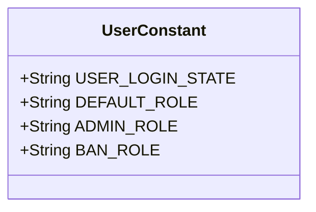

**图示来源**  
- [UserConstant.java](file://yun-docker-common/src/main/java/com/lfc/yundocker/common/constant/UserConstant.java#L8-L33)

### 缓存常量
CacheConstant接口集中管理了系统中所有Redis缓存的键名前缀，采用统一的命名规范（如`sys:cache:xxx`），便于缓存的集中管理和清理。

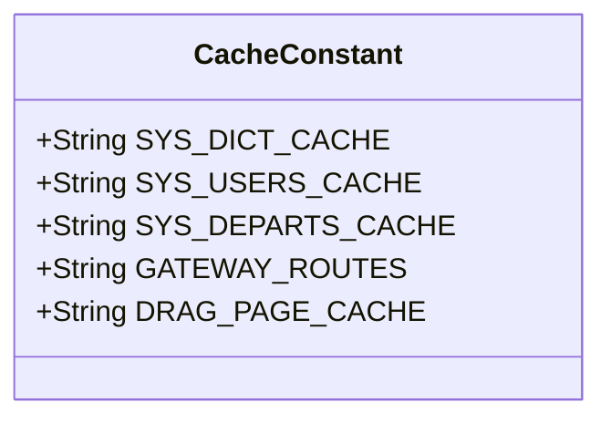

**图示来源**  
- [CacheConstant.java](file://yun-docker-common/src/main/java/com/lfc/yundocker/common/constant/CacheConstant.java#L9-L104)

### 通用常量
CommonConstant接口定义了系统中通用的状态码、操作类型、HTTP状态码等，为业务逻辑提供统一的判断依据。

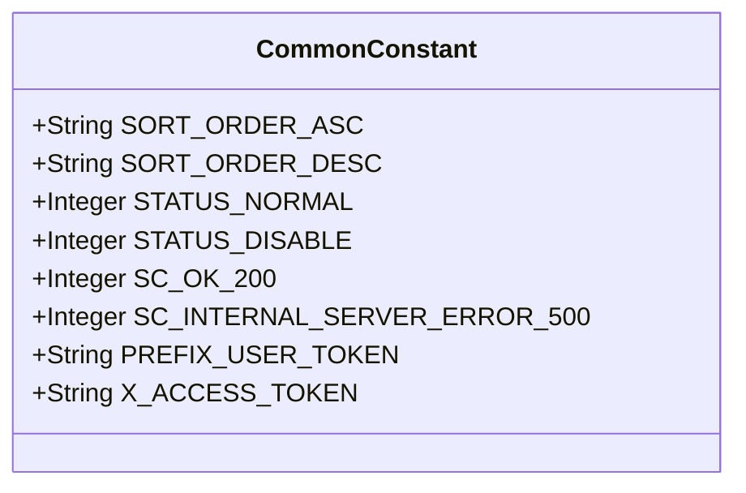

**图示来源**  
- [CommonConstant.java](file://yun-docker-common/src/main/java/com/lfc/yundocker/common/constant/CommonConstant.java#L10-L363)

## 枚举体系

### 错误码枚举
ErrorCode枚举类统一了系统的错误码体系，为前后端交互提供了标准化的错误响应机制。每个错误码包含一个唯一的数字代码和对应的描述信息。

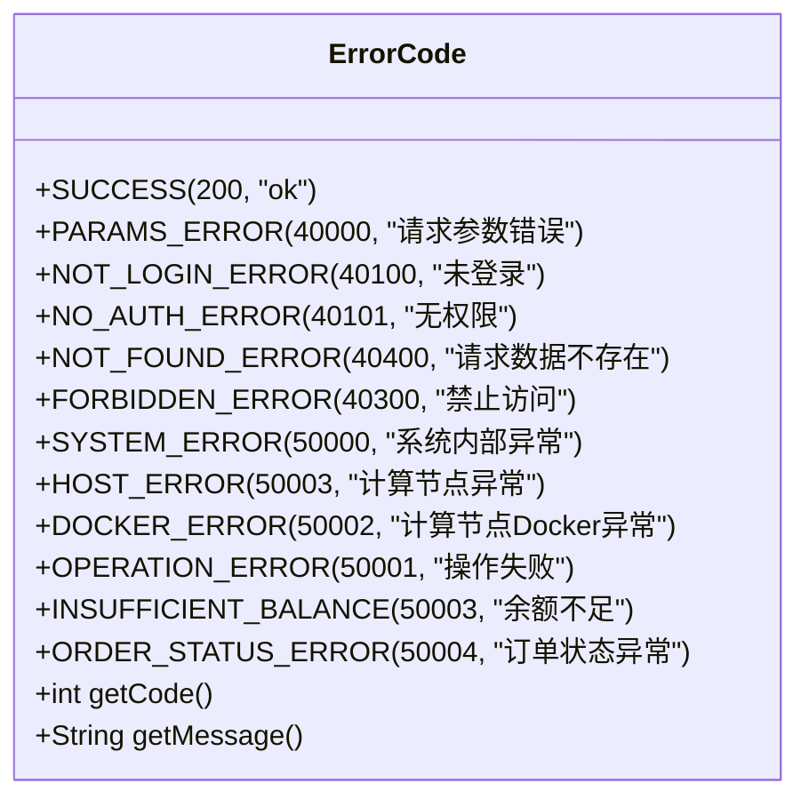

**图示来源**  
- [ErrorCode.java](file://yun-docker-common/src/main/java/com/lfc/yundocker/common/model/enums/ErrorCode.java#L8-L48)

## 工具类

### Redis工具类
RedisUtil提供了对Redis操作的全面封装，支持String、Hash、Set、List等多种数据结构的操作，并包含批量删除指定前缀键的功能，避免了使用KEYS命令可能带来的性能问题。

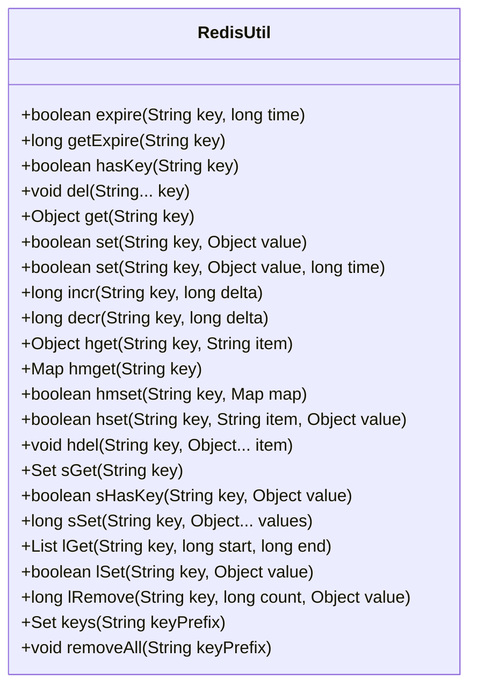

**图示来源**  
- [RedisUtil.java](file://yun-docker-common/src/main/java/com/lfc/yundocker/common/util/RedisUtil.java#L16-L614)

### 结果工具类
ResultUtils提供了创建标准化响应的静态方法，能够根据业务结果快速生成包含状态码、数据和消息的BaseResponse对象。

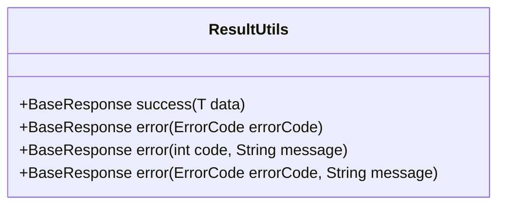

**图示来源**  
- [ResultUtils.java](file://yun-docker-common/src/main/java/com/lfc/yundocker/common/util/ResultUtils.java#L12-L55)

### MD5工具类
MD5Util提供了字符串的MD5加密功能，用于密码加密等安全场景。

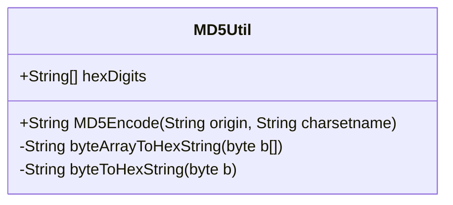

**图示来源**  
- [MD5Util.java](file://yun-docker-common/src/main/java/com/lfc/yundocker/common/util/MD5Util.java#L11-L49)

## 异常处理

### 全局异常处理器
GlobalExceptionHandler作为Spring Boot的全局异常处理器，能够捕获系统中抛出的BusinessException和RuntimeException，并将其转换为标准化的BaseResponse响应，确保了API返回格式的一致性。

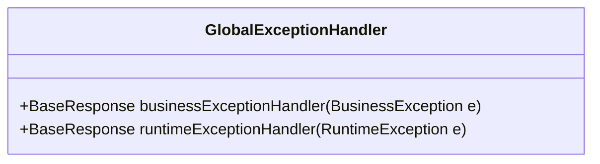

**图示来源**  
- [GlobalExceptionHandler.java](file://yun-docker-common/src/main/java/com/lfc/yundocker/common/exception/GlobalExceptionHandler.java#L18-L31)

### 业务异常类
BusinessException是系统自定义的业务异常类，继承自RuntimeException，包含错误码和错误消息，用于在业务逻辑中抛出特定的业务错误。

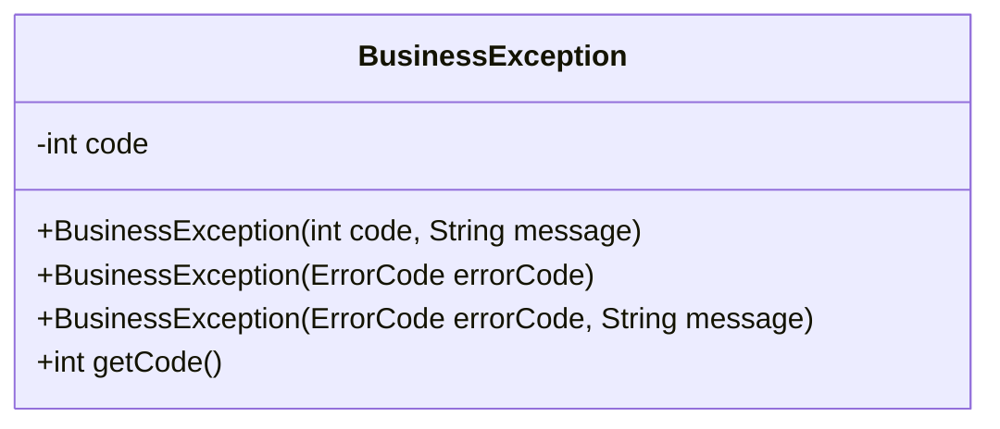

**图示来源**  
- [BusinessException.java](file://yun-docker-common/src/main/java/com/lfc/yundocker/common/exception/BusinessException.java#L11-L36)

### 异常抛出工具类
ThrowUtils提供了静态方法，可以根据条件判断是否抛出异常，简化了参数校验等场景下的异常抛出代码。

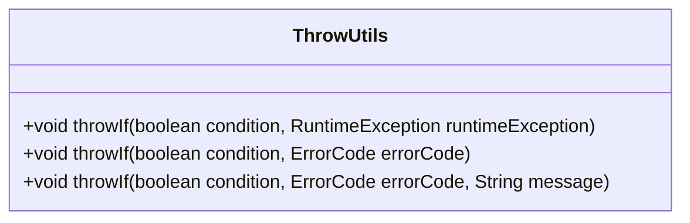

**图示来源**  
- [ThrowUtils.java](file://yun-docker-common/src/main/java/com/lfc/yundocker/common/exception/ThrowUtils.java#L11-L45)

## 数据传输对象

### 通用响应对象
BaseResponse是系统中所有API接口的通用返回包装类，采用泛型设计，包含状态码、数据和消息三个字段，实现了响应格式的统一。

```mermaid
classDiagram
class BaseResponse<T> {
-int code
-T data
-String message
+BaseResponse(int code, T data, String message)
+BaseResponse(int code, T data)
+BaseResponse(ErrorCode errorCode)
}
```

**图示来源**  
- [BaseResponse.java](file://yun-docker-common/src/main/java/com/lfc/yundocker/common/model/dto/BaseResponse.java#L15-L36)

### 用户登录请求对象
UserLoginRequest是一个典型的数据传输对象（DTO），用于封装用户登录请求的参数，确保了接口间数据传输的序列化兼容性。

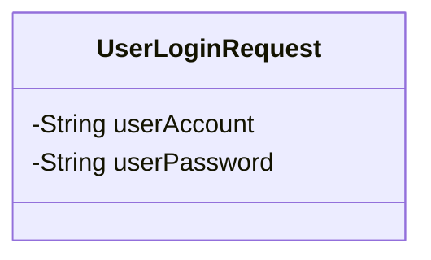

**图示来源**  
- [UserLoginRequest.java](file://yun-docker-common/src/main/java/com/lfc/yundocker/common/model/dto/user/UserLoginRequest.java#L13-L20)

### 实际使用示例
在Controller中，可以使用ThrowUtils进行参数校验：

```java
// 示例：在Controller中使用ThrowUtils进行参数校验
ThrowUtils.throwIf(user == null, ErrorCode.NOT_FOUND_ERROR, "用户不存在");
ThrowUtils.throwIf(!isValid, ErrorCode.PARAMS_ERROR, "参数校验失败");
```

同时，使用ResultUtils返回标准化响应：

```java
// 示例：使用ResultUtils返回成功或失败响应
return ResultUtils.success(userVO);
return ResultUtils.error(ErrorCode.OPERATION_ERROR);
```