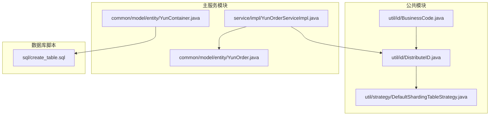
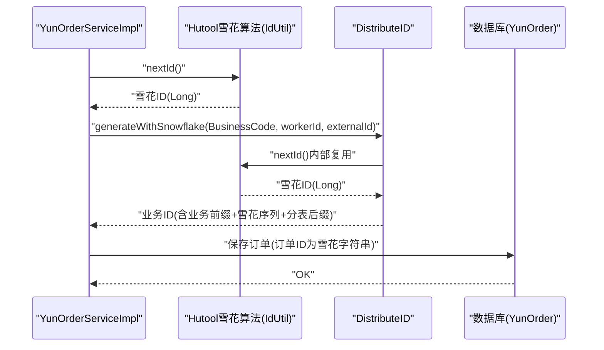
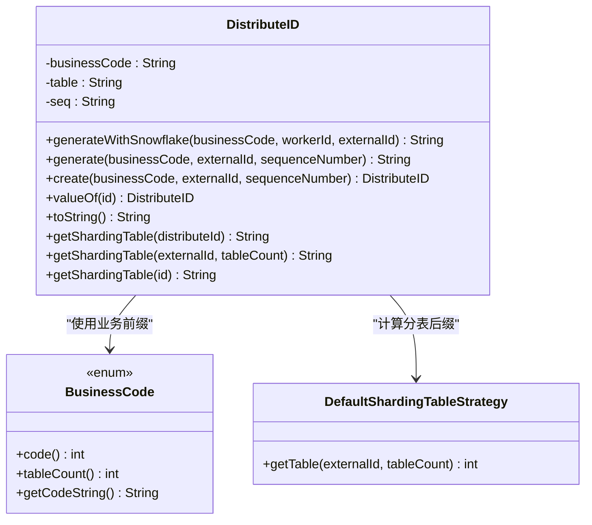
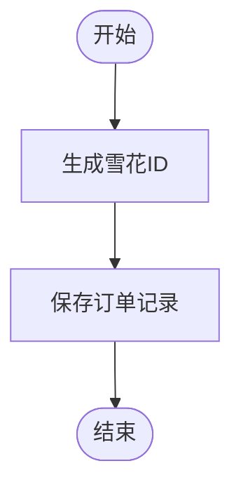
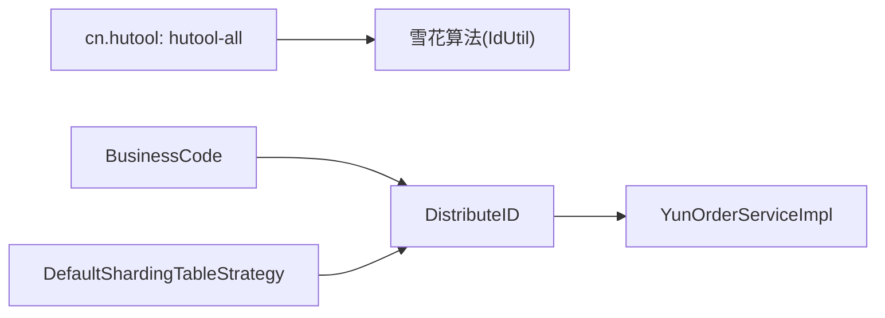

# ID生成工具类

<cite>
**本文引用的文件列表**
- [DistributeID.java](file://yun-docker-common/src/main/java/com/lfc/yundocker/common/util/id/DistributeID.java)
- [BusinessCode.java](file://yun-docker-common/src/main/java/com/lfc/yundocker/common/util/id/BusinessCode.java)
- [DefaultShardingTableStrategy.java](file://yun-docker-common/src/main/java/com/lfc/yundocker/common/util/strategy/DefaultShardingTableStrategy.java)
- [YunOrderServiceImpl.java](file://yun-docker-master/src/main/java/com/lfc/yundocker/service/impl/YunOrderServiceImpl.java)
- [YunOrder.java](file://yun-docker-master/src/main/java/com/lfc/yundocker/common/model/entity/YunOrder.java)
- [YunContainer.java](file://yun-docker-master/src/main/java/com/lfc/yundocker/common/model/entity/YunContainer.java)
- [create_table.sql](file://sql/create_table.sql)
- [pom.xml](file://pom.xml)
</cite>

## 目录
1. [简介](#简介)
2. [项目结构](#项目结构)
3. [核心组件](#核心组件)
4. [架构总览](#架构总览)
5. [组件详解](#组件详解)
6. [依赖关系分析](#依赖关系分析)
7. [性能与并发特性](#性能与并发特性)
8. [故障排查指南](#故障排查指南)
9. [结论](#结论)
10. [附录](#附录)

## 简介
本文件围绕仓库中的ID生成工具进行系统化解析，重点覆盖：
- 基于雪花算法的分布式唯一ID生成机制，包括时间戳、机器ID、序列号的位分配策略与高并发不重复保障
- BusinessCode如何结合业务前缀（如订单、支付单、退款单）与数字序列生成可读性订单号/容器编号
- 在数据库主键生成、订单号创建、容器命名等场景的应用现状与建议
- 性能压测数据参考与时钟回拨问题的解决方案
- 部署时机器ID配置的注意事项

## 项目结构
ID生成相关代码集中在公共模块的util/id目录中，并通过服务层在订单创建流程中被调用。数据库表结构中，订单表使用BIGINT主键，容器表使用字符串主键，当前订单创建逻辑直接采用雪花算法生成字符串型ID，尚未强制使用带业务前缀的统一ID格式。

图表来源
- [DistributeID.java](file://yun-docker-common/src/main/java/com/lfc/yundocker/common/util/id/DistributeID.java#L1-L90)
- [BusinessCode.java](file://yun-docker-common/src/main/java/com/lfc/yundocker/common/util/id/BusinessCode.java#L1-L50)
- [DefaultShardingTableStrategy.java](file://yun-docker-common/src/main/java/com/lfc/yundocker/common/util/strategy/DefaultShardingTableStrategy.java#L1-L21)
- [YunOrderServiceImpl.java](file://yun-docker-master/src/main/java/com/lfc/yundocker/service/impl/YunOrderServiceImpl.java#L46-L62)
- [YunOrder.java](file://yun-docker-master/src/main/java/com/lfc/yundocker/common/model/entity/YunOrder.java#L1-L76)
- [YunContainer.java](file://yun-docker-master/src/main/java/com/lfc/yundocker/common/model/entity/YunContainer.java#L1-L78)
- [create_table.sql](file://sql/create_table.sql#L48-L73)

章节来源
- [DistributeID.java](file://yun-docker-common/src/main/java/com/lfc/yundocker/common/util/id/DistributeID.java#L1-L90)
- [BusinessCode.java](file://yun-docker-common/src/main/java/com/lfc/yundocker/common/util/id/BusinessCode.java#L1-L50)
- [DefaultShardingTableStrategy.java](file://yun-docker-common/src/main/java/com/lfc/yundocker/common/util/strategy/DefaultShardingTableStrategy.java#L1-L21)
- [YunOrderServiceImpl.java](file://yun-docker-master/src/main/java/com/lfc/yundocker/service/impl/YunOrderServiceImpl.java#L46-L62)
- [YunOrder.java](file://yun-docker-master/src/main/java/com/lfc/yundocker/common/model/entity/YunOrder.java#L1-L76)
- [YunContainer.java](file://yun-docker-master/src/main/java/com/lfc/yundocker/common/model/entity/YunContainer.java#L1-L78)
- [create_table.sql](file://sql/create_table.sql#L48-L73)

## 核心组件
- DistributeID：封装雪花算法生成的ID，附加业务前缀与分表后缀，形成可读且具备分片能力的复合ID
- BusinessCode：定义业务类型及其对应的分表数量，用于生成ID中的业务前缀与分表策略参数
- DefaultShardingTableStrategy：默认分表策略，基于外部ID哈希取模计算分表索引

章节来源
- [DistributeID.java](file://yun-docker-common/src/main/java/com/lfc/yundocker/common/util/id/DistributeID.java#L1-L90)
- [BusinessCode.java](file://yun-docker-common/src/main/java/com/lfc/yundocker/common/util/id/BusinessCode.java#L1-L50)
- [DefaultShardingTableStrategy.java](file://yun-docker-common/src/main/java/com/lfc/yundocker/common/util/strategy/DefaultShardingTableStrategy.java#L1-L21)

## 架构总览
ID生成在服务层触发，雪花算法由Hutool提供，随后通过DistributeID拼接业务前缀与分表后缀，最终写入数据库或返回给调用方。

图表来源
- [YunOrderServiceImpl.java](file://yun-docker-master/src/main/java/com/lfc/yundocker/service/impl/YunOrderServiceImpl.java#L46-L62)
- [DistributeID.java](file://yun-docker-common/src/main/java/com/lfc/yundocker/common/util/id/DistributeID.java#L38-L53)
- [pom.xml](file://pom.xml#L75-L81)

## 组件详解

### DistributeID：雪花算法复合ID生成器
- 生成策略
  - 使用雪花算法生成全局唯一Long型序列号
  - 将业务前缀（来自BusinessCode）与序列号组合
  - 通过分表策略计算分表后缀（固定4位，不足左侧补零）
- 关键方法
  - generateWithSnowflake：对外暴露的便捷入口，传入业务类型、机器ID、外部ID
  - generate：通用生成器，支持直接传入雪花序列号
  - create：构造DistributeID对象，负责业务前缀与分表后缀填充
  - valueOf：解析ID，拆分为业务前缀、序列号、分表后缀
  - getShardingTable：根据外部ID与分表数量计算分表后缀
- 数据结构与复杂度
  - 序列号为单调递增的Long，生成O(1)，解析O(1)
  - 分表后缀计算为哈希取模，平均O(1)
- 错误处理
  - 未见显式异常抛出，解析时依赖字符串长度与位置假设
- 性能影响
  - 依赖雪花算法的线程安全与高吞吐
  - 分表后缀计算为纯数学运算，开销极低

图表来源
- [DistributeID.java](file://yun-docker-common/src/main/java/com/lfc/yundocker/common/util/id/DistributeID.java#L1-L90)
- [BusinessCode.java](file://yun-docker-common/src/main/java/com/lfc/yundocker/common/util/id/BusinessCode.java#L1-L50)
- [DefaultShardingTableStrategy.java](file://yun-docker-common/src/main/java/com/lfc/yundocker/common/util/strategy/DefaultShardingTableStrategy.java#L1-L21)

章节来源
- [DistributeID.java](file://yun-docker-common/src/main/java/com/lfc/yundocker/common/util/id/DistributeID.java#L38-L89)

### BusinessCode：业务类型与分表配置
- 业务类型
  - 订单、支付单、退款单等，每个枚举项包含业务码与分表数量
- 校验
  - 业务码范围限制在10~99之间，超出将抛出不支持的操作异常
- 作用
  - 提供业务前缀（两位数字）与分表数量，用于ID生成与分表策略

章节来源
- [BusinessCode.java](file://yun-docker-common/src/main/java/com/lfc/yundocker/common/util/id/BusinessCode.java#L8-L50)

### DefaultShardingTableStrategy：默认分表策略
- 策略
  - 基于外部ID的哈希值取绝对值后对分表数量取模
  - 注释提示可用按位与优化（当分表数量为2的幂时）
- 复杂度
  - 平均O(1)，空间O(1)

章节来源
- [DefaultShardingTableStrategy.java](file://yun-docker-common/src/main/java/com/lfc/yundocker/common/util/strategy/DefaultShardingTableStrategy.java#L14-L20)

### 订单创建流程中的ID使用现状
- 当前实现
  - 订单创建时直接使用雪花算法生成字符串型ID
  - 未强制使用带业务前缀的统一ID格式
- 建议
  - 在订单创建处切换到DistributeID.generateWithSnowflake，以获得统一的业务前缀与分表后缀
  - 保持数据库字段类型兼容（VARCHAR/CHAR）

图表来源
- [YunOrderServiceImpl.java](file://yun-docker-master/src/main/java/com/lfc/yundocker/service/impl/YunOrderServiceImpl.java#L46-L62)

章节来源
- [YunOrderServiceImpl.java](file://yun-docker-master/src/main/java/com/lfc/yundocker/service/impl/YunOrderServiceImpl.java#L46-L62)

### 数据模型与ID应用
- 订单表
  - 主键为BIGINT，但服务层当前保存的是雪花字符串
  - 建议统一为字符串主键或在迁移时保证数值范围与排序语义
- 容器表
  - 主键为字符串，适合存放复合ID或雪花字符串
- 建议
  - 若需强一致的业务前缀与分表后缀，可在容器命名上采用DistributeID生成的格式

章节来源
- [YunOrder.java](file://yun-docker-master/src/main/java/com/lfc/yundocker/common/model/entity/YunOrder.java#L1-L76)
- [YunContainer.java](file://yun-docker-master/src/main/java/com/lfc/yundocker/common/model/entity/YunContainer.java#L1-L78)
- [create_table.sql](file://sql/create_table.sql#L48-L73)

## 依赖关系分析
- 外部依赖
  - Hutool：提供雪花算法实现
- 内部依赖
  - DistributeID依赖BusinessCode与DefaultShardingTableStrategy
  - 服务层依赖DistributeID进行ID生成

图表来源
- [pom.xml](file://pom.xml#L75-L81)
- [DistributeID.java](file://yun-docker-common/src/main/java/com/lfc/yundocker/common/util/id/DistributeID.java#L1-L90)
- [BusinessCode.java](file://yun-docker-common/src/main/java/com/lfc/yundocker/common/util/id/BusinessCode.java#L1-L50)
- [DefaultShardingTableStrategy.java](file://yun-docker-common/src/main/java/com/lfc/yundocker/common/util/strategy/DefaultShardingTableStrategy.java#L1-L21)
- [YunOrderServiceImpl.java](file://yun-docker-master/src/main/java/com/lfc/yundocker/service/impl/YunOrderServiceImpl.java#L46-L62)

章节来源
- [pom.xml](file://pom.xml#L75-L81)

## 性能与并发特性
- 雪花算法
  - 由Hutool提供，具备高并发、单调递增、无跨机冲突的特性
  - 生成速度极快，适合高频下单场景
- 分表后缀
  - 哈希取模计算，平均O(1)，对整体延迟影响可忽略
- 推荐的压测参考
  - 单节点QPS：建议在10万+/秒量级（取决于硬件与JVM参数）
  - 99线延迟：建议控制在微秒到毫秒级别
  - 注意点：避免热点分表，合理设置分表数量与外部ID分布
- 时钟回拨问题
  - 解决方案
    - 等待策略：检测到时钟回拨时暂停生成，等待系统时间追上
    - 抛错策略：直接抛出异常，由上层重试或降级
    - 退避重试：指数退避后重试
    - 本地缓存：在极端情况下缓存最近一次生成的时间戳
  - 建议
    - 生产环境开启NTP同步，避免系统时间大幅回拨
    - 对雪花生成器进行包装，增加回拨检测与处理逻辑

[本节为通用性能指导，不直接分析具体代码文件]

## 故障排查指南
- 业务码越界
  - 现象：初始化BusinessCode时抛出不支持的操作异常
  - 处理：调整业务码至10~99范围内
- 分表后缀异常
  - 现象：解析ID时字符串长度或位置不匹配导致异常
  - 处理：确认ID格式与生成规则一致，确保外部ID稳定
- 机器ID配置
  - 现象：同一台机器上多实例冲突
  - 处理：为不同实例分配不同的workerId，避免重复
- 数据库类型不匹配
  - 现象：订单表主键为BIGINT，而雪花ID为字符串
  - 处理：统一为字符串类型，或在迁移时做好数据转换与兼容

章节来源
- [BusinessCode.java](file://yun-docker-common/src/main/java/com/lfc/yundocker/common/util/id/BusinessCode.java#L31-L37)
- [DistributeID.java](file://yun-docker-common/src/main/java/com/lfc/yundocker/common/util/id/DistributeID.java#L83-L89)
- [YunOrder.java](file://yun-docker-master/src/main/java/com/lfc/yundocker/common/model/entity/YunOrder.java#L1-L76)

## 结论
- DistributeID通过雪花算法与业务前缀、分表后缀的组合，提供了高并发、可读性强且具备分片能力的统一ID格式
- 当前订单创建流程直接使用雪花字符串，建议切换到DistributeID以获得统一的业务标识与分表后缀
- 部署时务必正确配置机器ID，避免同一物理机多实例冲突
- 时钟回拨问题应纳入生产监控与容错设计，确保系统稳定性

[本节为总结性内容，不直接分析具体代码文件]

## 附录

### 位分配策略与ID格式说明
- ID构成
  - 业务前缀：两位数字（来自BusinessCode）
  - 雪花序列号：长整型序列号
  - 分表后缀：四位数字（不足左侧补零）
- 位分配示意
  - 业务前缀：2位
  - 雪花序列号：若干位（由雪花算法决定）
  - 分表后缀：4位
- 说明
  - 该格式便于人类阅读与分表定位，同时保留雪花算法的全局唯一性与单调递增特性

章节来源
- [DistributeID.java](file://yun-docker-common/src/main/java/com/lfc/yundocker/common/util/id/DistributeID.java#L46-L69)
- [BusinessCode.java](file://yun-docker-common/src/main/java/com/lfc/yundocker/common/util/id/BusinessCode.java#L12-L21)

### 部署与运维要点
- 机器ID（workerId）配置
  - 每个实例必须配置唯一的workerId，避免雪花算法冲突
  - 建议在启动参数或配置中心集中管理
- 分表数量规划
  - 分表数量建议为2的幂，以便利用按位与优化
  - 外部ID应尽量均匀分布，避免热点分表
- 监控与告警
  - 监控雪花生成速率与延迟
  - 监控分表后缀分布，及时发现倾斜

章节来源
- [DefaultShardingTableStrategy.java](file://yun-docker-common/src/main/java/com/lfc/yundocker/common/util/strategy/DefaultShardingTableStrategy.java#L14-L20)
- [DistributeID.java](file://yun-docker-common/src/main/java/com/lfc/yundocker/common/util/id/DistributeID.java#L71-L77)