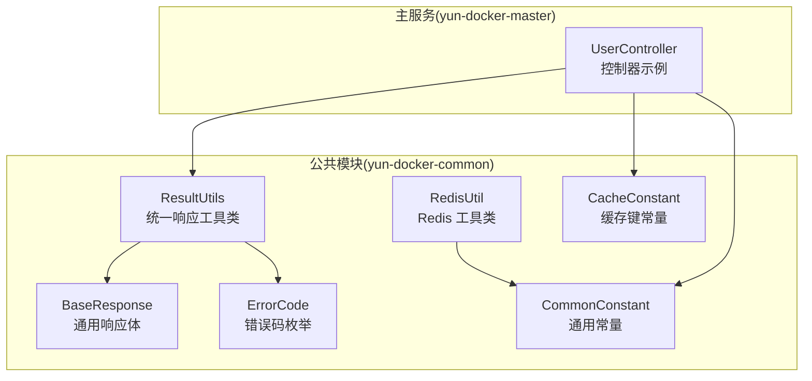
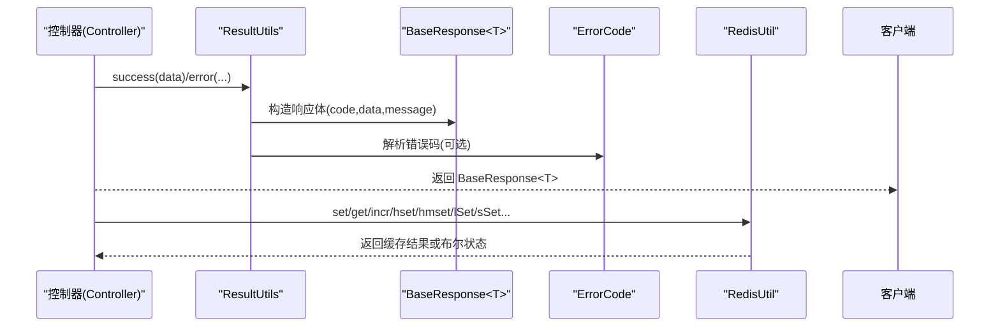
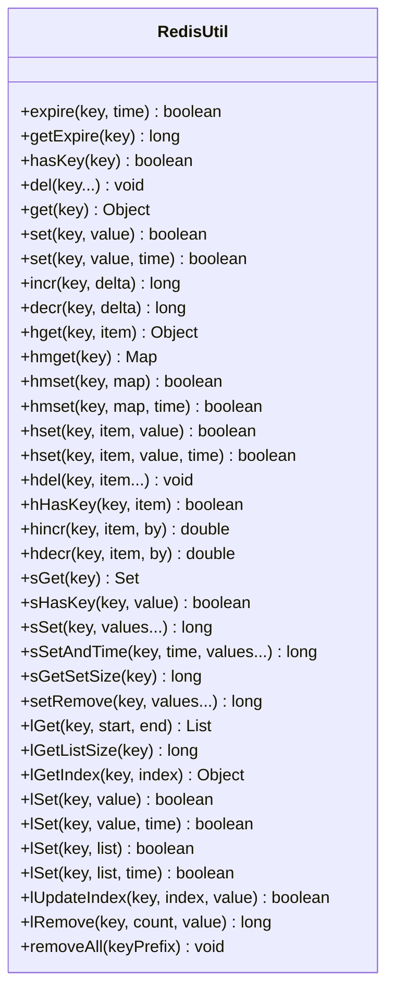
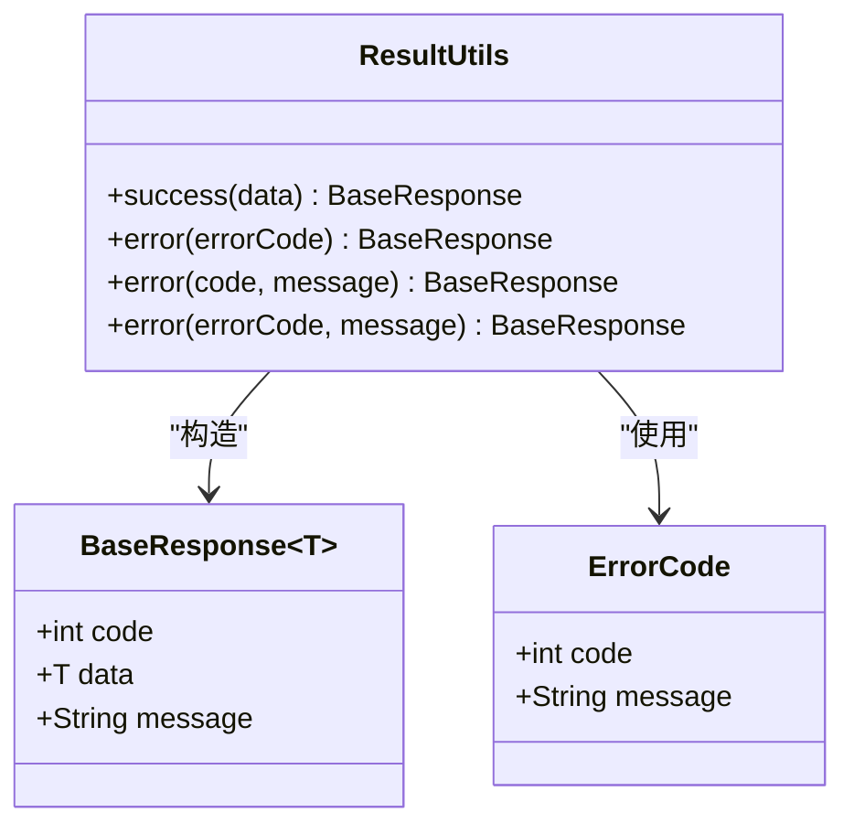
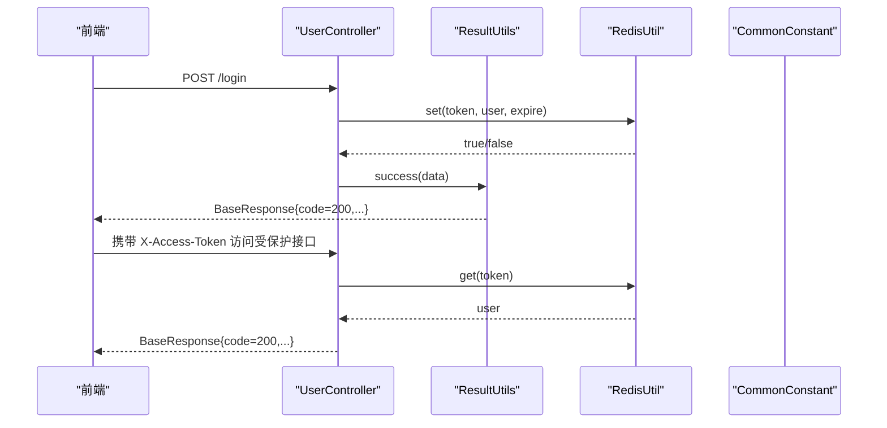
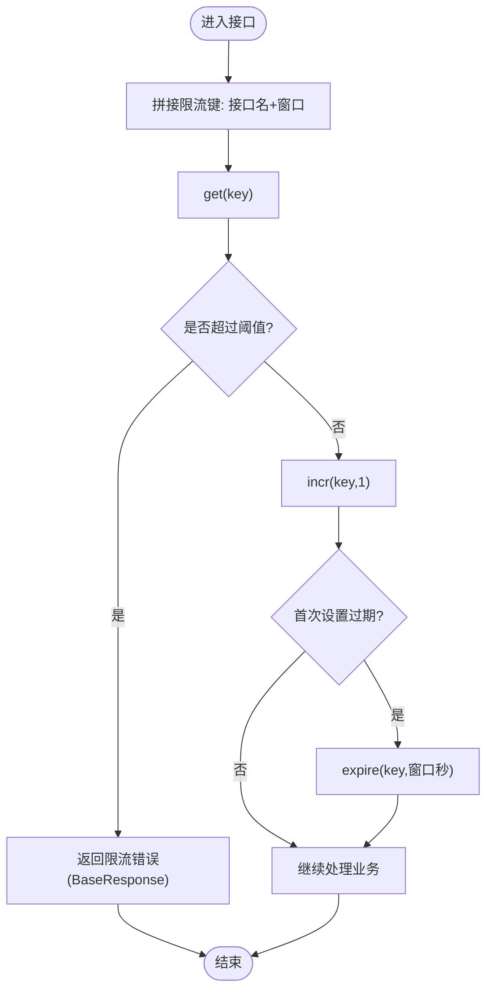
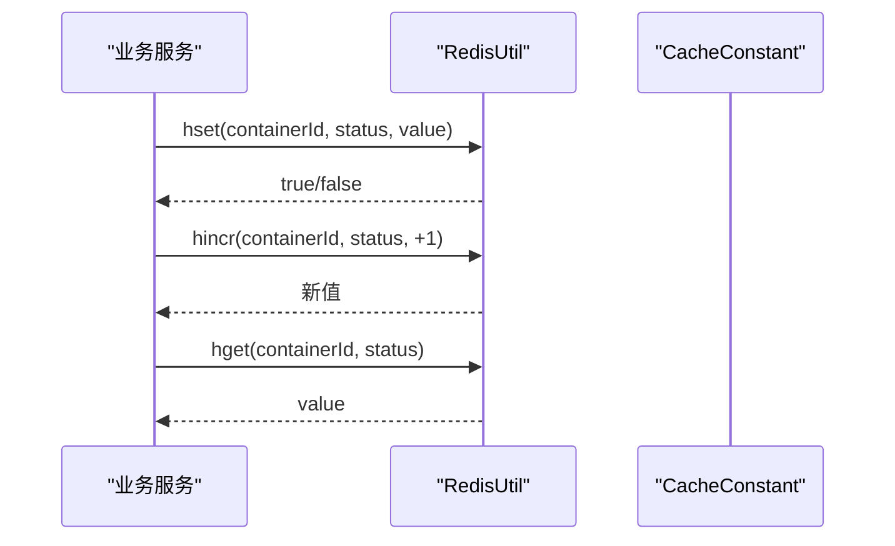
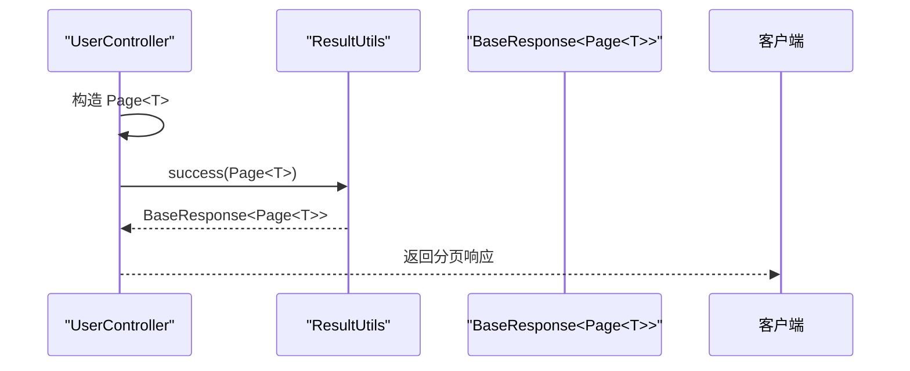
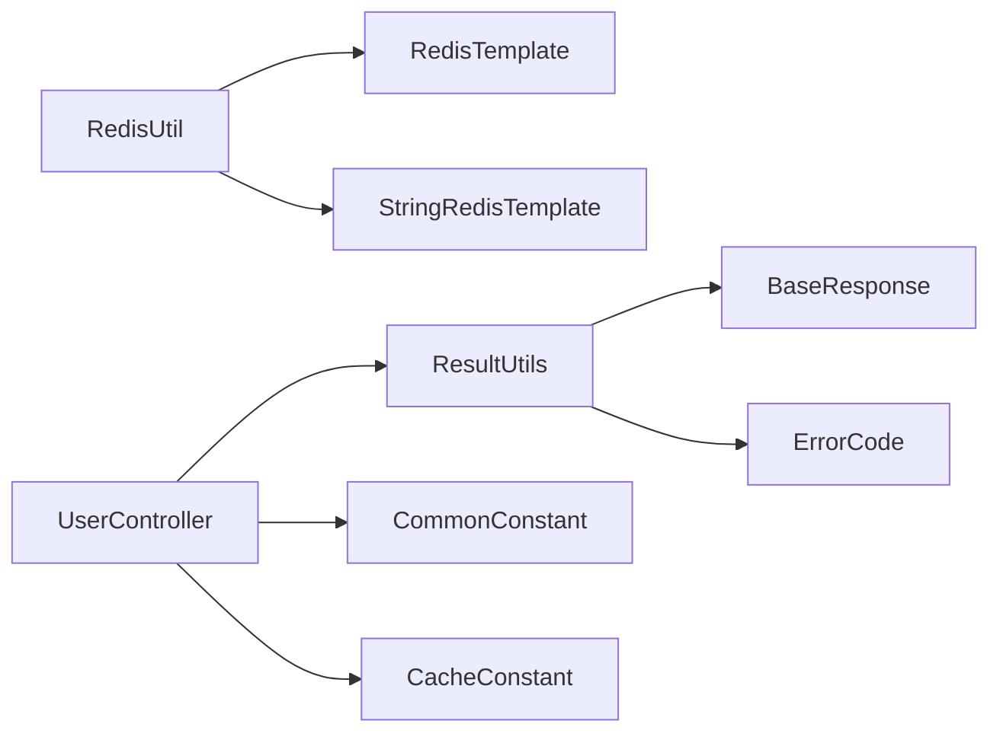

# Redis与响应工具类

<cite>
**本文引用的文件**
- [RedisUtil.java](file://yun-docker-common/src/main/java/com/lfc/yundocker/common/util/RedisUtil.java)
- [ResultUtils.java](file://yun-docker-common/src/main/java/com/lfc/yundocker/common/util/ResultUtils.java)
- [BaseResponse.java](file://yun-docker-common/src/main/java/com/lfc/yundocker/common/model/dto/BaseResponse.java)
- [ErrorCode.java](file://yun-docker-common/src/main/java/com/lfc/yundocker/common/model/enums/ErrorCode.java)
- [CommonConstant.java](file://yun-docker-common/src/main/java/com/lfc/yundocker/common/constant/CommonConstant.java)
- [CacheConstant.java](file://yun-docker-common/src/main/java/com/lfc/yundocker/common/constant/CacheConstant.java)
- [UserController.java](file://yun-docker-master/src/main/java/com/lfc/yundocker/controller/UserController.java)
</cite>

## 目录
1. [简介](#简介)
2. [项目结构](#项目结构)
3. [核心组件](#核心组件)
4. [架构总览](#架构总览)
5. [详细组件分析](#详细组件分析)
6. [依赖关系分析](#依赖关系分析)
7. [性能与最佳实践](#性能与最佳实践)
8. [故障排查指南](#故障排查指南)
9. [结论](#结论)
10. [附录](#附录)

## 简介
本文件围绕仓库中的 Redis 工具类与统一响应工具类进行系统化梳理，重点覆盖：
- RedisUtil 的常用操作封装（字符串、哈希、集合、列表），以及与“带过期时间”的原子递增组合方法（set+expire/increment）的典型用法
- ResultUtils 统一响应体的构建模式（success/error 方法族），以及与前端约定的对接要点
- 实战场景：用户登录态缓存（token 存储）、接口限流（计数器）、容器状态缓存等
- 关键工程实践：连接池配置、序列化方式选择、缓存穿透防护等

## 项目结构
- Redis 工具类位于公共模块，提供对 RedisTemplate/StringRedisTemplate 的统一封装
- 统一响应体位于公共模块，控制器层通过 ResultUtils 构造标准响应
- 常量与缓存键命名规范集中于常量包，便于跨模块复用

图表来源
- [RedisUtil.java](file://yun-docker-common/src/main/java/com/lfc/yundocker/common/util/RedisUtil.java#L1-L615)
- [ResultUtils.java](file://yun-docker-common/src/main/java/com/lfc/yundocker/common/util/ResultUtils.java#L1-L56)
- [BaseResponse.java](file://yun-docker-common/src/main/java/com/lfc/yundocker/common/model/dto/BaseResponse.java#L1-L37)
- [ErrorCode.java](file://yun-docker-common/src/main/java/com/lfc/yundocker/common/model/enums/ErrorCode.java#L1-L49)
- [CommonConstant.java](file://yun-docker-common/src/main/java/com/lfc/yundocker/common/constant/CommonConstant.java#L1-L364)
- [CacheConstant.java](file://yun-docker-common/src/main/java/com/lfc/yundocker/common/constant/CacheConstant.java#L1-L105)
- [UserController.java](file://yun-docker-master/src/main/java/com/lfc/yundocker/controller/UserController.java#L250-L309)

章节来源
- [RedisUtil.java](file://yun-docker-common/src/main/java/com/lfc/yundocker/common/util/RedisUtil.java#L1-L615)
- [ResultUtils.java](file://yun-docker-common/src/main/java/com/lfc/yundocker/common/util/ResultUtils.java#L1-L56)
- [BaseResponse.java](file://yun-docker-common/src/main/java/com/lfc/yundocker/common/model/dto/BaseResponse.java#L1-L37)
- [ErrorCode.java](file://yun-docker-common/src/main/java/com/lfc/yundocker/common/model/enums/ErrorCode.java#L1-L49)
- [CommonConstant.java](file://yun-docker-common/src/main/java/com/lfc/yundocker/common/constant/CommonConstant.java#L1-L364)
- [CacheConstant.java](file://yun-docker-common/src/main/java/com/lfc/yundocker/common/constant/CacheConstant.java#L1-L105)
- [UserController.java](file://yun-docker-master/src/main/java/com/lfc/yundocker/controller/UserController.java#L250-L309)

## 核心组件
- RedisUtil：提供键管理（过期、存在性、删除）、字符串（get/set/incr/decr）、哈希（get/putAll/put/删除/存在性/递增/递减）、集合（成员、存在性、添加、长度、移除）、列表（范围、长度、索引、右推/批量右推/更新/移除）以及基于 scan 的前缀批量删除能力
- ResultUtils：提供 success(data)、error(errorCode)、error(code,message)、error(errorCode,message) 等静态方法，统一输出 BaseResponse<T> 格式
- BaseResponse<T>：通用响应载体，包含 code、data、message
- ErrorCode：统一错误码枚举，配合 ResultUtils 输出标准化错误
- CommonConstant：通用常量，如 HTTP 状态码、Token 前缀、过期时间等
- CacheConstant：缓存键命名规范，便于跨模块共享

章节来源
- [RedisUtil.java](file://yun-docker-common/src/main/java/com/lfc/yundocker/common/util/RedisUtil.java#L1-L615)
- [ResultUtils.java](file://yun-docker-common/src/main/java/com/lfc/yundocker/common/util/ResultUtils.java#L1-L56)
- [BaseResponse.java](file://yun-docker-common/src/main/java/com/lfc/yundocker/common/model/dto/BaseResponse.java#L1-L37)
- [ErrorCode.java](file://yun-docker-common/src/main/java/com/lfc/yundocker/common/model/enums/ErrorCode.java#L1-L49)
- [CommonConstant.java](file://yun-docker-common/src/main/java/com/lfc/yundocker/common/constant/CommonConstant.java#L1-L364)
- [CacheConstant.java](file://yun-docker-common/src/main/java/com/lfc/yundocker/common/constant/CacheConstant.java#L1-L105)

## 架构总览
RedisUtil 作为底层缓存抽象，向上提供简洁易用的方法；ResultUtils 作为 API 层统一出口，向下依赖 BaseResponse 和 ErrorCode，形成“数据访问层—响应封装层”的清晰边界。

图表来源
- [ResultUtils.java](file://yun-docker-common/src/main/java/com/lfc/yundocker/common/util/ResultUtils.java#L1-L56)
- [BaseResponse.java](file://yun-docker-common/src/main/java/com/lfc/yundocker/common/model/dto/BaseResponse.java#L1-L37)
- [ErrorCode.java](file://yun-docker-common/src/main/java/com/lfc/yundocker/common/model/enums/ErrorCode.java#L1-L49)
- [RedisUtil.java](file://yun-docker-common/src/main/java/com/lfc/yundocker/common/util/RedisUtil.java#L1-L615)

## 详细组件分析

### RedisUtil 组件分析
- 键管理
  - 过期设置：expire(key,time)
  - 查询过期：getExpire(key)
  - 存在性：hasKey(key)
  - 删除：del(key...)
  - 扫描前缀删除：removeAll(keyPrefix)
- 字符串
  - get(key)、set(key,value)、set(key,value,time)
  - incr(key,delta)、decr(key,delta)
- 哈希
  - hget/hmget/hmset/hset/hdel/hHasKey/hincr/hdecr
- 集合
  - sGet/sHasKey/sSet/sSetAndTime/sGetSetSize/setRemove
- 列表
  - lGet(start,end)、lGetListSize、lGetIndex、lSet(value/time/list)、lUpdateIndex、lRemove

图表来源
- [RedisUtil.java](file://yun-docker-common/src/main/java/com/lfc/yundocker/common/util/RedisUtil.java#L1-L615)

章节来源
- [RedisUtil.java](file://yun-docker-common/src/main/java/com/lfc/yundocker/common/util/RedisUtil.java#L1-L615)

### ResultUtils 组件分析
- success(data)：返回 code=200、message=ok 的 BaseResponse<T>
- error(errorCode)：根据枚举构造响应
- error(code,message)：自定义 code/message
- error(errorCode,message)：结合枚举与自定义 message

图表来源
- [ResultUtils.java](file://yun-docker-common/src/main/java/com/lfc/yundocker/common/util/ResultUtils.java#L1-L56)
- [BaseResponse.java](file://yun-docker-common/src/main/java/com/lfc/yundocker/common/model/dto/BaseResponse.java#L1-L37)
- [ErrorCode.java](file://yun-docker-common/src/main/java/com/lfc/yundocker/common/model/enums/ErrorCode.java#L1-L49)

章节来源
- [ResultUtils.java](file://yun-docker-common/src/main/java/com/lfc/yundocker/common/util/ResultUtils.java#L1-L56)
- [BaseResponse.java](file://yun-docker-common/src/main/java/com/lfc/yundocker/common/model/dto/BaseResponse.java#L1-L37)
- [ErrorCode.java](file://yun-docker-common/src/main/java/com/lfc/yundocker/common/model/enums/ErrorCode.java#L1-L49)

### RedisUtil 实战场景与流程

#### 场景一：用户登录态缓存（token 存储）
- 前端登录成功后携带 token，后端将 token 作为 key，用户标识或完整用户信息作为 value，设置过期时间
- 读取：请求到达时根据请求头中的 token 从 Redis 中取出用户信息，完成鉴权
- 删除：退出登录或刷新 token 时删除对应 key

图表来源
- [UserController.java](file://yun-docker-master/src/main/java/com/lfc/yundocker/controller/UserController.java#L75-L101)
- [ResultUtils.java](file://yun-docker-common/src/main/java/com/lfc/yundocker/common/util/ResultUtils.java#L1-L56)
- [RedisUtil.java](file://yun-docker-common/src/main/java/com/lfc/yundocker/common/util/RedisUtil.java#L1-L615)
- [CommonConstant.java](file://yun-docker-common/src/main/java/com/lfc/yundocker/common/constant/CommonConstant.java#L1-L364)

章节来源
- [UserController.java](file://yun-docker-master/src/main/java/com/lfc/yundocker/controller/UserController.java#L75-L101)
- [CommonConstant.java](file://yun-docker-common/src/main/java/com/lfc/yundocker/common/constant/CommonConstant.java#L1-L364)

#### 场景二：接口限流（计数器）
- 使用 Redis 的字符串递增能力，以“接口名+时间窗口”为 key，实现滑动/固定窗口限流
- set+expire 组合确保每个窗口只计数一次，避免重复计数
- decr 可用于回滚或补偿

图表来源
- [RedisUtil.java](file://yun-docker-common/src/main/java/com/lfc/yundocker/common/util/RedisUtil.java#L1-L615)
- [ResultUtils.java](file://yun-docker-common/src/main/java/com/lfc/yundocker/common/util/ResultUtils.java#L1-L56)

章节来源
- [RedisUtil.java](file://yun-docker-common/src/main/java/com/lfc/yundocker/common/util/RedisUtil.java#L1-L615)
- [ResultUtils.java](file://yun-docker-common/src/main/java/com/lfc/yundocker/common/util/ResultUtils.java#L1-L56)

#### 场景三：容器状态缓存
- 使用 Redis 哈希结构缓存容器运行状态，键为容器ID，域为状态字段，值为具体状态
- 通过 hincr/hdecr 对状态计数进行原子增减，实现并发安全的状态统计

图表来源
- [RedisUtil.java](file://yun-docker-common/src/main/java/com/lfc/yundocker/common/util/RedisUtil.java#L1-L615)
- [CacheConstant.java](file://yun-docker-common/src/main/java/com/lfc/yundocker/common/constant/CacheConstant.java#L1-L105)

章节来源
- [RedisUtil.java](file://yun-docker-common/src/main/java/com/lfc/yundocker/common/util/RedisUtil.java#L1-L615)
- [CacheConstant.java](file://yun-docker-common/src/main/java/com/lfc/yundocker/common/constant/CacheConstant.java#L1-L105)

### 分页响应构造方法
- 控制器示例展示了如何使用 ResultUtils.success(page) 返回分页数据
- 建议：分页响应体中包含 total、records、current、pageSize 等字段，前端据此渲染

图表来源
- [UserController.java](file://yun-docker-master/src/main/java/com/lfc/yundocker/controller/UserController.java#L250-L309)
- [ResultUtils.java](file://yun-docker-common/src/main/java/com/lfc/yundocker/common/util/ResultUtils.java#L1-L56)

章节来源
- [UserController.java](file://yun-docker-master/src/main/java/com/lfc/yundocker/controller/UserController.java#L250-L309)

## 依赖关系分析
- RedisUtil 依赖 RedisTemplate/StringRedisTemplate，提供多数据结构操作
- ResultUtils 依赖 BaseResponse 与 ErrorCode，统一错误码与响应体
- 控制器层依赖 ResultUtils 与各服务层，返回统一响应
- 常量层（CommonConstant、CacheConstant）为 Redis 与响应体提供命名与规则约束

图表来源
- [RedisUtil.java](file://yun-docker-common/src/main/java/com/lfc/yundocker/common/util/RedisUtil.java#L1-L615)
- [ResultUtils.java](file://yun-docker-common/src/main/java/com/lfc/yundocker/common/util/ResultUtils.java#L1-L56)
- [BaseResponse.java](file://yun-docker-common/src/main/java/com/lfc/yundocker/common/model/dto/BaseResponse.java#L1-L37)
- [ErrorCode.java](file://yun-docker-common/src/main/java/com/lfc/yundocker/common/model/enums/ErrorCode.java#L1-L49)
- [CommonConstant.java](file://yun-docker-common/src/main/java/com/lfc/yundocker/common/constant/CommonConstant.java#L1-L364)
- [CacheConstant.java](file://yun-docker-common/src/main/java/com/lfc/yundocker/common/constant/CacheConstant.java#L1-L105)
- [UserController.java](file://yun-docker-master/src/main/java/com/lfc/yundocker/controller/UserController.java#L250-L309)

章节来源
- [RedisUtil.java](file://yun-docker-common/src/main/java/com/lfc/yundocker/common/util/RedisUtil.java#L1-L615)
- [ResultUtils.java](file://yun-docker-common/src/main/java/com/lfc/yundocker/common/util/ResultUtils.java#L1-L56)
- [BaseResponse.java](file://yun-docker-common/src/main/java/com/lfc/yundocker/common/model/dto/BaseResponse.java#L1-L37)
- [ErrorCode.java](file://yun-docker-common/src/main/java/com/lfc/yundocker/common/model/enums/ErrorCode.java#L1-L49)
- [CommonConstant.java](file://yun-docker-common/src/main/java/com/lfc/yundocker/common/constant/CommonConstant.java#L1-L364)
- [CacheConstant.java](file://yun-docker-common/src/main/java/com/lfc/yundocker/common/constant/CacheConstant.java#L1-L105)
- [UserController.java](file://yun-docker-master/src/main/java/com/lfc/yundocker/controller/UserController.java#L250-L309)

## 性能与最佳实践
- 连接池配置
  - 使用 RedisTemplate/StringRedisTemplate 时，建议在 Spring 配置中合理设置连接池大小、超时时间、序列化策略，避免阻塞与抖动
- 序列化方式选择
  - 默认使用 JDK 序列化，适合简单对象；对于大对象或跨语言场景，建议采用 JSON 序列化（如 Jackson）以提升兼容性与体积控制
- 缓存穿透防护
  - 对空结果也设置短 TTL，避免频繁击穿
  - 使用布隆过滤器在写入前预判 key 是否可能存在
- 原子性与一致性
  - set+expire 组合建议使用 Lua 或事务保证原子性
  - incrWithExpire 可通过先 set 再 expire 的组合实现，但需注意过期时间与业务逻辑的时序
- 键命名规范
  - 使用 CacheConstant 统一前缀，避免冲突与难以维护
- 过期策略
  - 对热点数据设置合理的过期时间，避免内存占用过高
- 批量操作
  - 使用 hmset/sSet/lSetAll 等批量写入，减少网络往返
- 定期清理
  - 使用 removeAll(keyPrefix) 清理过期或废弃键，避免脏数据积累

[本节为通用指导，无需特定文件引用]

## 敔排障指南
- RedisUtil 常见问题
  - set/get 返回 null：检查 key 是否存在、过期时间是否正确、序列化是否一致
  - incr 抛出异常：确认 delta>0 且 key 存在数值类型
  - 批量删除无效：确认 keyPrefix 匹配、scan 选项与匹配模式
- ResultUtils 常见问题
  - 响应体字段缺失：确认 BaseResponse 泛型与前端契约一致
  - 错误码不一致：核对 ErrorCode 与 CommonConstant 中的 code/message
- 控制器层常见问题
  - 分页响应不正确：确认 Page 对象的 current、size、total 设置
  - 前端鉴权失败：核对请求头 X-Access-Token 与 CommonConstant 中的常量名一致

章节来源
- [RedisUtil.java](file://yun-docker-common/src/main/java/com/lfc/yundocker/common/util/RedisUtil.java#L1-L615)
- [ResultUtils.java](file://yun-docker-common/src/main/java/com/lfc/yundocker/common/util/ResultUtils.java#L1-L56)
- [BaseResponse.java](file://yun-docker-common/src/main/java/com/lfc/yundocker/common/model/dto/BaseResponse.java#L1-L37)
- [CommonConstant.java](file://yun-docker-common/src/main/java/com/lfc/yundocker/common/constant/CommonConstant.java#L1-L364)
- [UserController.java](file://yun-docker-master/src/main/java/com/lfc/yundocker/controller/UserController.java#L250-L309)

## 结论
- RedisUtil 提供了覆盖主流数据结构的缓存操作封装，并通过 set+expire/increment 组合满足“带过期时间”的原子递增需求
- ResultUtils 将响应体标准化，配合 ErrorCode 与 CommonConstant，形成前后端一致的交互契约
- 在登录态、限流、状态缓存等场景中，RedisUtil 与 ResultUtils 的组合能够快速落地并保持良好的可维护性
- 实践中应重视连接池、序列化、穿透防护与键命名规范，以获得更稳健的性能与可靠性

[本节为总结，无需特定文件引用]

## 附录
- RedisUtil 常用方法速查
  - 字符串：get/set/incr/decr
  - 哈希：hget/hmget/hmset/hset/hdel/hHasKey/hincr/hdecr
  - 集合：sGet/sHasKey/sSet/sSetAndTime/sGetSetSize/setRemove
  - 列表：lGet/lGetListSize/lGetIndex/lSet/lUpdateIndex/lRemove
  - 键管理：expire/getExpire/hasKey/del/removeAll
- ResultUtils 常用方法速查
  - success(data)
  - error(errorCode)
  - error(code,message)
  - error(errorCode,message)

[本节为概览，无需特定文件引用]