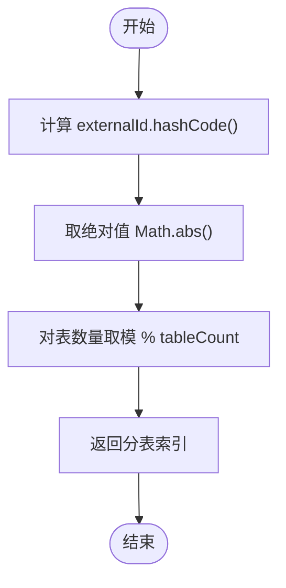
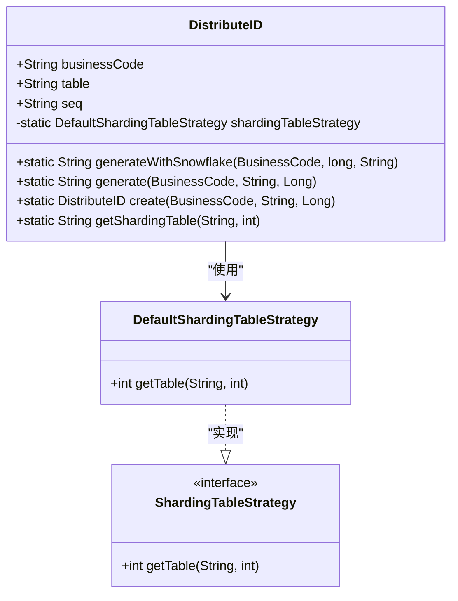
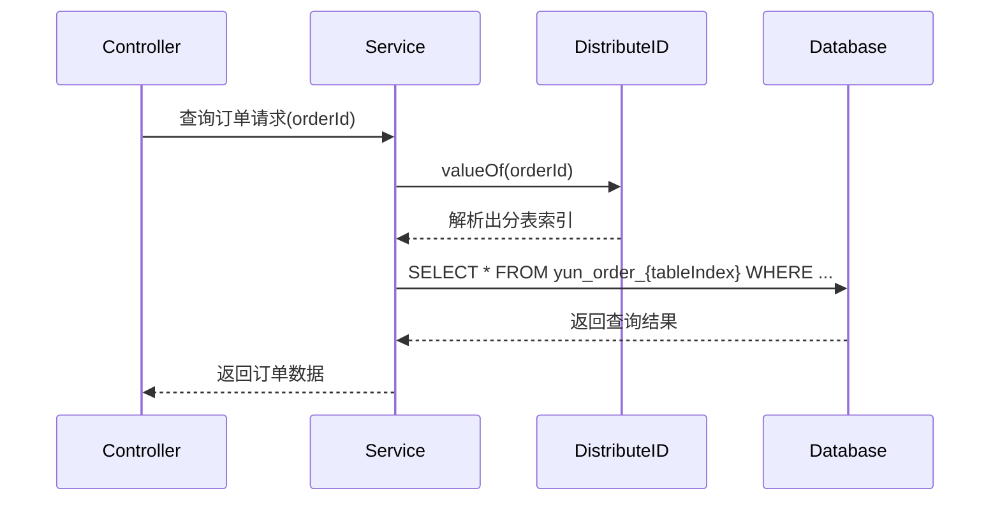

# 分表策略工具类

<cite>
**本文档引用的文件**  
- [ShardingTableStrategy.java](file://yun-docker-common/src/main/java/com/lfc/yundocker/common/util/strategy/ShardingTableStrategy.java)
- [DefaultShardingTableStrategy.java](file://yun-docker-common/src/main/java/com/lfc/yundocker/common/util/strategy/DefaultShardingTableStrategy.java)
- [ShardingStrategyEnum.java](file://yun-docker-common/src/main/java/com/lfc/yundocker/common/util/strategy/ShardingStrategyEnum.java)
- [DistributeID.java](file://yun-docker-common/src/main/java/com/lfc/yundocker/common/util/id/DistributeID.java)
- [BusinessCode.java](file://yun-docker-common/src/main/java/com/lfc/yundocker/common/util/id/BusinessCode.java)
- [MyBatisPlusConfig.java](file://yun-docker-master/src/main/java/com/lfc/yundocker/config/MyBatisPlusConfig.java)
- [YunOrder.java](file://yun-docker-master/src/main/java/com/lfc/yundocker/common/model/entity/YunOrder.java)
- [YunOrderServiceImpl.java](file://yun-docker-master/src/main/java/com/lfc/yundocker/service/impl/YunOrderServiceImpl.java)
</cite>

## 目录

1. [引言](#引言)
2. [分表策略接口定义](#分表策略接口定义)
3. [默认分表策略实现](#默认分表策略实现)
4. [分表策略枚举](#分表策略枚举)
5. [分表策略在分布式ID中的应用](#分表策略在分布式id中的应用)
6. [业务码与表数量配置](#业务码与表数量配置)
7. [MyBatis-Plus集成与动态表名解析](#mybatis-plus集成与动态表名解析)
8. [大数据场景下的分表实践](#大数据场景下的分表实践)
9. [高级话题讨论](#高级话题讨论)
10. [结论](#结论)

## 引言

在云Docker后端系统中，面对容器日志、订单记录等大数据量场景，传统的单表存储方式难以满足性能和扩展性需求。为此，系统设计了一套灵活的分表策略机制，通过水平分表技术将数据分散到多个物理表中，从而提升查询性能和系统可扩展性。本文档系统阐述了分表策略的核心组件，包括`ShardingTableStrategy`接口、`DefaultShardingTableStrategy`默认实现、`ShardingStrategyEnum`策略枚举，以及它们在实际业务中的集成与应用。

## 分表策略接口定义

`ShardingTableStrategy`接口定义了分表策略的核心契约，为系统提供了统一的分表计算规范。该接口仅包含一个核心方法`getTable`，用于根据外部ID和表数量计算出目标分表的索引。

**Section sources**
- [ShardingTableStrategy.java](file://yun-docker-common/src/main/java/com/lfc/yundocker/common/util/strategy/ShardingTableStrategy.java#L8-L18)

## 默认分表策略实现

`DefaultShardingTableStrategy`类实现了`ShardingTableStrategy`接口，提供了基于哈希取模的默认分表算法。该实现通过计算外部ID的哈希值，然后对表数量取模，得到分表索引。此算法确保了数据在各分表间的均匀分布，是水平分表中最常用的策略之一。

**Diagram sources**
- [DefaultShardingTableStrategy.java](file://yun-docker-common/src/main/java/com/lfc/yundocker/common/util/strategy/DefaultShardingTableStrategy.java#L9-L20)

**Section sources**
- [DefaultShardingTableStrategy.java](file://yun-docker-common/src/main/java/com/lfc/yundocker/common/util/strategy/DefaultShardingTableStrategy.java#L9-L20)

## 分表策略枚举

`ShardingStrategyEnum`枚举目前仅定义了`DEFAULT`一种策略类型，为未来扩展多种分表策略（如范围分片、一致性哈希等）预留了架构空间。通过枚举管理策略类型，系统可以在运行时动态选择不同的分表算法。

**Section sources**
- [ShardingStrategyEnum.java](file://yun-docker-common/src/main/java/com/lfc/yundocker/common/util/strategy/ShardingStrategyEnum.java#L8-L13)

## 分表策略在分布式ID中的应用

分表策略的核心应用场景体现在`DistributeID`类中。该类结合雪花算法生成全局唯一ID，并将分表索引作为ID的一部分嵌入其中。通过`create`方法，系统在生成ID时即确定其所属的分表，实现了分片键与主键的统一，避免了跨分片查询。

**Diagram sources**
- [DistributeID.java](file://yun-docker-common/src/main/java/com/lfc/yundocker/common/util/id/DistributeID.java#L12-L90)
- [DefaultShardingTableStrategy.java](file://yun-docker-common/src/main/java/com/lfc/yundocker/common/util/strategy/DefaultShardingTableStrategy.java#L9-L20)

**Section sources**
- [DistributeID.java](file://yun-docker-common/src/main/java/com/lfc/yundocker/common/util/id/DistributeID.java#L12-L90)

## 业务码与表数量配置

`BusinessCode`枚举定义了不同业务类型的编码及其对应的分表数量。例如，订单业务（TRADE_ORDER）配置了4个分表，而支付单和退款单业务则使用单表。这种配置方式使得分表策略能够根据不同业务的数据量级进行灵活调整。

**Section sources**
- [BusinessCode.java](file://yun-docker-common/src/main/java/com/lfc/yundocker/common/util/id/BusinessCode.java#L8-L50)

## MyBatis-Plus集成与动态表名解析

虽然当前`MyBatisPlusConfig`配置中未直接体现分表逻辑，但系统通过在SQL层面动态解析表名来实现分表。具体而言，在执行数据库操作前，系统根据分片键（如用户ID）计算出目标分表名，并将其注入到SQL语句中。例如，在查询订单时，系统会根据订单ID解析出分表索引，然后构造如`yun_order_0001`这样的具体表名。

**Diagram sources**
- [DistributeID.java](file://yun-docker-common/src/main/java/com/lfc/yundocker/common/util/id/DistributeID.java#L83-L88)
- [YunOrderServiceImpl.java](file://yun-docker-master/src/main/java/com/lfc/yundocker/service/impl/YunOrderServiceImpl.java#L107-L111)
- [MyBatisPlusConfig.java](file://yun-docker-master/src/main/java/com/lfc/yundocker/config/MyBatisPlusConfig.java#L17-L31)

**Section sources**
- [MyBatisPlusConfig.java](file://yun-docker-master/src/main/java/com/lfc/yundocker/config/MyBatisPlusConfig.java#L17-L31)

## 大数据场景下的分表实践

在订单记录等大数据场景下，系统通过以下方式实现水平分表：
1. **分片键选择**：以用户ID作为外部ID，确保同一用户的所有订单数据落在同一分表中。
2. **ID生成**：使用`DistributeID.generateWithSnowflake`方法生成包含分表索引的全局唯一ID。
3. **数据写入**：根据生成的ID自动确定目标分表，实现数据的均匀分布。
4. **数据查询**：通过解析ID中的分表信息，直接定位到具体分表进行查询，避免全表扫描。

这种设计显著提升了大数据量下的查询性能，同时保证了数据的一致性和可追溯性。

**Section sources**
- [YunOrderServiceImpl.java](file://yun-docker-master/src/main/java/com/lfc/yundocker/service/impl/YunOrderServiceImpl.java#L48-L61)
- [DistributeID.java](file://yun-docker-common/src/main/java/com/lfc/yundocker/common/util/id/DistributeID.java#L40-L44)

## 高级话题讨论

### 分片键选择
理想的分片键应具备高基数、均匀分布和查询频繁的特点。在本系统中，用户ID作为分片键，既保证了数据分布的均匀性，又满足了按用户查询订单的高频需求。

### 跨分片查询限制
由于数据按用户ID分片，跨用户查询（如统计所有用户的订单总额）会涉及全分表扫描，性能较差。此类操作建议通过定时任务将汇总数据写入单独的统计表。

### 扩容迁移
当前系统使用固定数量的分表（如4个）。当单表数据量再次达到瓶颈时，可通过重新计算哈希值并迁移数据的方式进行扩容。未来可考虑引入一致性哈希算法，以降低扩容时的数据迁移成本。

**Section sources**
- [DefaultShardingTableStrategy.java](file://yun-docker-common/src/main/java/com/lfc/yundocker/common/util/strategy/DefaultShardingTableStrategy.java#L15-L18)
- [BusinessCode.java](file://yun-docker-common/src/main/java/com/lfc/yundocker/common/util/id/BusinessCode.java#L12-L13)

## 结论

本文档详细阐述了云Docker后端系统的分表策略体系。通过`ShardingTableStrategy`接口、`DefaultShardingTableStrategy`实现和`ShardingStrategyEnum`枚举，系统构建了一个灵活、可扩展的分表框架。结合`DistributeID`分布式ID生成器，系统在大数据量场景下实现了高效的数据水平分片，显著提升了查询性能。未来可通过引入更多分表策略和优化扩容机制，进一步增强系统的可扩展性和性能。