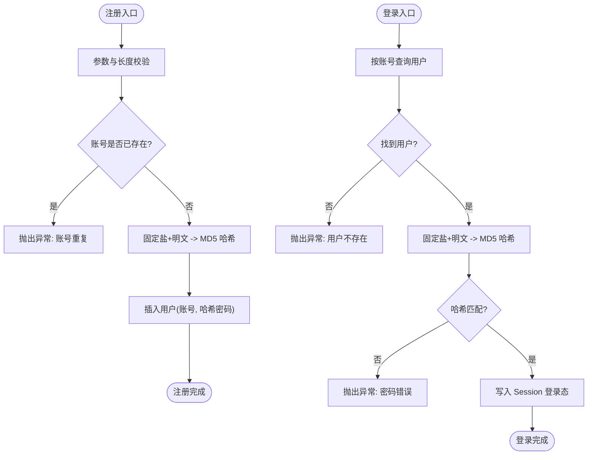

# 加密工具类

<cite>
**本文引用的文件列表**
- [MD5Util.java](file://yun-docker-common/src/main/java/com/lfc/yundocker/common/util/MD5Util.java)
- [PasswordUtil.java](file://yun-docker-common/src/main/java/com/lfc/yundocker/common/util/PasswordUtil.java)
- [UserServiceImpl.java](file://yun-docker-master/src/main/java/com/lfc/yundocker/service/impl/UserServiceImpl.java)
- [UserService.java](file://yun-docker-master/src/main/java/com/lfc/yundocker/service/UserService.java)
- [application.yml](file://yun-docker-master/src/main/resources/application.yml)
- [AuthInterceptor.java](file://yun-docker-master/src/main/java/com/lfc/yundocker/aop/AuthInterceptor.java)
- [SpringContextUtils.java](file://yun-docker-common/src/main/java/com/lfc/yundocker/common/util/SpringContextUtils.java)
- [JeecgDataAutorUtils.java](file://yun-docker-common/src/main/java/com/lfc/yundocker/common/util/JeecgDataAutorUtils.java)
- [LoginUserVO.java](file://yun-docker-master/src/main/java/com/lfc/yundocker/common/model/vo/LoginUserVO.java)
- [User.java](file://yun-docker-master/src/main/java/com/lfc/yundocker/common/model/entity/User.java)
</cite>

## 目录
1. [简介](#简介)
2. [项目结构](#项目结构)
3. [核心组件](#核心组件)
4. [架构总览](#架构总览)
5. [组件详解](#组件详解)
6. [依赖关系分析](#依赖关系分析)
7. [性能与开销](#性能与开销)
8. [故障排查指南](#故障排查指南)
9. [结论](#结论)
10. [附录](#附录)

## 简介
本文件聚焦于系统中两个与安全相关的工具类：MD5Util 和 PasswordUtil 的设计与使用方式，解释它们在用户密码存储与验证流程中的作用与局限，并提供基于现有实现的“密码加密、验证”的完整调用示例路径，同时讨论与 Spring Security 的集成可能性、常见误用场景与修复建议。

## 项目结构
- 工具类位于公共模块 yun-docker-common 中：
  - MD5Util：提供 MD5 哈希编码能力（字符串转十六进制）。
  - PasswordUtil：提供基于 PBE 的加解密能力（包含盐值生成、迭代次数等）。
- 用户服务层位于 yun-docker-master：
  - UserService 接口定义注册、登录等方法。
  - UserServiceImpl 实现了注册与登录流程，使用 MD5 对“固定盐 + 明文密码”进行哈希存储与比对。
- 配置与拦截器：
  - application.yml 提供 Session 等基础配置。
  - AuthInterceptor 使用 UserService 进行权限校验。
  - SpringContextUtils、JeecgDataAutorUtils 提供上下文与数据权限辅助。

图表来源
- [MD5Util.java](file://yun-docker-common/src/main/java/com/lfc/yundocker/common/util/MD5Util.java#L1-L50)
- [PasswordUtil.java](file://yun-docker-common/src/main/java/com/lfc/yundocker/common/util/PasswordUtil.java#L1-L188)
- [UserServiceImpl.java](file://yun-docker-master/src/main/java/com/lfc/yundocker/service/impl/UserServiceImpl.java#L1-L301)
- [UserService.java](file://yun-docker-master/src/main/java/com/lfc/yundocker/service/UserService.java#L1-L106)
- [application.yml](file://yun-docker-master/src/main/resources/application.yml#L1-L60)
- [AuthInterceptor.java](file://yun-docker-master/src/main/java/com/lfc/yundocker/aop/AuthInterceptor.java#L1-L69)
- [SpringContextUtils.java](file://yun-docker-common/src/main/java/com/lfc/yundocker/common/util/SpringContextUtils.java#L1-L108)
- [JeecgDataAutorUtils.java](file://yun-docker-common/src/main/java/com/lfc/yundocker/common/util/JeecgDataAutorUtils.java#L1-L72)
- [User.java](file://yun-docker-master/src/main/java/com/lfc/yundocker/common/model/entity/User.java)
- [LoginUserVO.java](file://yun-docker-master/src/main/java/com/lfc/yundocker/common/model/vo/LoginUserVO.java#L1-L53)

章节来源
- [MD5Util.java](file://yun-docker-common/src/main/java/com/lfc/yundocker/common/util/MD5Util.java#L1-L50)
- [PasswordUtil.java](file://yun-docker-common/src/main/java/com/lfc/yundocker/common/util/PasswordUtil.java#L1-L188)
- [UserServiceImpl.java](file://yun-docker-master/src/main/java/com/lfc/yundocker/service/impl/UserServiceImpl.java#L1-L301)
- [UserService.java](file://yun-docker-master/src/main/java/com/lfc/yundocker/service/UserService.java#L1-L106)
- [application.yml](file://yun-docker-master/src/main/resources/application.yml#L1-L60)
- [AuthInterceptor.java](file://yun-docker-master/src/main/java/com/lfc/yundocker/aop/AuthInterceptor.java#L1-L69)
- [SpringContextUtils.java](file://yun-docker-common/src/main/java/com/lfc/yundocker/common/util/SpringContextUtils.java#L1-L108)
- [JeecgDataAutorUtils.java](file://yun-docker-common/src/main/java/com/lfc/yundocker/common/util/JeecgDataAutorUtils.java#L1-L72)
- [User.java](file://yun-docker-master/src/main/java/com/lfc/yundocker/common/model/entity/User.java)
- [LoginUserVO.java](file://yun-docker-master/src/main/java/com/lfc/yundocker/common/model/vo/LoginUserVO.java#L1-L53)

## 核心组件
- MD5Util：提供字符串到 MD5 字节数组的哈希与十六进制字符串转换，用于简单哈希场景。
- PasswordUtil：提供基于 PBE 的加解密能力，包含固定盐与随机盐生成、迭代次数配置、字节数组与十六进制互转等。
- UserServiceImpl：在注册与登录流程中使用 MD5 对“固定盐 + 明文密码”进行哈希存储与比对。

章节来源
- [MD5Util.java](file://yun-docker-common/src/main/java/com/lfc/yundocker/common/util/MD5Util.java#L1-L50)
- [PasswordUtil.java](file://yun-docker-common/src/main/java/com/lfc/yundocker/common/util/PasswordUtil.java#L1-L188)
- [UserServiceImpl.java](file://yun-docker-master/src/main/java/com/lfc/yundocker/service/impl/UserServiceImpl.java#L48-L137)

## 架构总览
系统采用“工具类 + 服务层 + 配置/拦截”的分层结构。用户注册与登录流程通过 UserServiceImpl 调用 MD5Util 进行哈希计算，将哈希值持久化；登录时再次对输入密码进行相同哈希并与数据库存储值比较。权限校验由 AuthInterceptor 基于 Session 与 UserService 实现。

图表来源
- [UserServiceImpl.java](file://yun-docker-master/src/main/java/com/lfc/yundocker/service/impl/UserServiceImpl.java#L48-L137)
- [MD5Util.java](file://yun-docker-common/src/main/java/com/lfc/yundocker/common/util/MD5Util.java#L1-L50)
- [UserService.java](file://yun-docker-master/src/main/java/com/lfc/yundocker/service/UserService.java#L1-L106)
- [application.yml](file://yun-docker-master/src/main/resources/application.yml#L24-L41)

## 组件详解

### MD5Util：字符串哈希与十六进制转换
- 功能要点
  - 使用 MessageDigest 计算 MD5 哈希。
  - 提供字节数组到十六进制字符串的转换方法。
  - 支持指定字符集进行字节编码后再哈希。
- 设计模式与复杂度
  - 算法层面：MD5 哈希 O(n)（n 为输入长度），十六进制转换 O(k)（k 为字节数）。
  - 无加盐与多次迭代，属于“裸 MD5”，不适用于现代密码学安全要求。
- 适用场景
  - 仅用于非敏感数据的快速校验或兼容旧系统，不适合存储用户密码。

图表来源
- [MD5Util.java](file://yun-docker-common/src/main/java/com/lfc/yundocker/common/util/MD5Util.java#L1-L50)

章节来源
- [MD5Util.java](file://yun-docker-common/src/main/java/com/lfc/yundocker/common/util/MD5Util.java#L1-L50)

### PasswordUtil：PBE 加解密与盐值管理
- 功能要点
  - 固定盐与随机盐生成：getSalt() 生成 8 字节随机种子，getStaticSalt() 返回固定盐。
  - PBE 参数：算法常量、迭代次数常量。
  - 加密/解密：encrypt(明文, 密码, 盐)、decrypt(密文, 密码, 盐)。
  - 编解码：bytesToHexString(byte[])、hexStringToBytes(String)。
- 设计模式与复杂度
  - 加密/解密涉及对称密钥派生与分组加密，整体复杂度取决于算法与迭代次数。
  - 迭代次数越大，计算成本越高，抗暴力破解能力越强。
- 安全性说明
  - 使用 PBEWithMD5AndDES 算法，该算法在现代标准中已不推荐用于密码存储（弱加密强度与可逆性）。
  - 若用于密码存储，应配合随机盐与足够高的迭代次数，并考虑更安全的 KDF（如 PBKDF2、bcrypt、scrypt、Argon2）。

图表来源
- [PasswordUtil.java](file://yun-docker-common/src/main/java/com/lfc/yundocker/common/util/PasswordUtil.java#L1-L188)

章节来源
- [PasswordUtil.java](file://yun-docker-common/src/main/java/com/lfc/yundocker/common/util/PasswordUtil.java#L1-L188)

### UserServiceImpl：注册与登录流程中的哈希使用
- 注册流程
  - 校验参数与账号唯一性。
  - 使用固定盐与 MD5 对明文密码进行哈希，保存到数据库。
- 登录流程
  - 根据账号查询用户。
  - 使用固定盐与 MD5 对输入密码进行哈希，与数据库存储值比较。
  - 比对成功后写入 Session 登录态。
- 关键点
  - 使用固定盐，未使用随机盐，存在彩虹表与撞库风险。
  - 未采用多次迭代，计算成本低，易受暴力破解。
  - 存储的是哈希值而非明文，但固定盐与裸 MD5 仍不满足现代安全要求。

图表来源
- [UserServiceImpl.java](file://yun-docker-master/src/main/java/com/lfc/yundocker/service/impl/UserServiceImpl.java#L48-L137)

章节来源
- [UserServiceImpl.java](file://yun-docker-master/src/main/java/com/lfc/yundocker/service/impl/UserServiceImpl.java#L48-L137)
- [UserService.java](file://yun-docker-master/src/main/java/com/lfc/yundocker/service/UserService.java#L1-L106)

## 依赖关系分析
- 组件耦合
  - UserServiceImpl 直接依赖 MD5Util（用于注册/登录哈希）。
  - PasswordUtil 在当前工程中未被直接调用，保留了 PBE 加解密能力。
  - AuthInterceptor 通过 UserService 获取当前登录用户，间接依赖注册/登录流程的正确性。
- 外部依赖
  - Spring MVC、MyBatis Plus、Dubbo 等在父 POM 中声明，本节不展开具体依赖项。
- 潜在循环依赖
  - 当前结构清晰，无明显循环依赖迹象。

图表来源
- [UserServiceImpl.java](file://yun-docker-master/src/main/java/com/lfc/yundocker/service/impl/UserServiceImpl.java#L1-L301)
- [UserService.java](file://yun-docker-master/src/main/java/com/lfc/yundocker/service/UserService.java#L1-L106)
- [AuthInterceptor.java](file://yun-docker-master/src/main/java/com/lfc/yundocker/aop/AuthInterceptor.java#L1-L69)
- [SpringContextUtils.java](file://yun-docker-common/src/main/java/com/lfc/yundocker/common/util/SpringContextUtils.java#L1-L108)
- [JeecgDataAutorUtils.java](file://yun-docker-common/src/main/java/com/lfc/yundocker/common/util/JeecgDataAutorUtils.java#L1-L72)

章节来源
- [UserServiceImpl.java](file://yun-docker-master/src/main/java/com/lfc/yundocker/service/impl/UserServiceImpl.java#L1-L301)
- [UserService.java](file://yun-docker-master/src/main/java/com/lfc/yundocker/service/UserService.java#L1-L106)
- [AuthInterceptor.java](file://yun-docker-master/src/main/java/com/lfc/yundocker/aop/AuthInterceptor.java#L1-L69)
- [SpringContextUtils.java](file://yun-docker-common/src/main/java/com/lfc/yundocker/common/util/SpringContextUtils.java#L1-L108)
- [JeecgDataAutorUtils.java](file://yun-docker-common/src/main/java/com/lfc/yundocker/common/util/JeecgDataAutorUtils.java#L1-L72)

## 性能与开销
- MD5Util
  - 哈希计算与十六进制转换均为 O(n)，开销极低，适合高频场景。
  - 无加盐与多次迭代，CPU 开销可忽略。
- PasswordUtil
  - PBE 加解密包含密钥派生与分组加密，迭代次数越大，CPU 开销越高。
  - 当前实现使用固定盐与较低迭代次数，若用于生产密码存储，建议提升迭代次数并采用随机盐。
- UserServiceImpl
  - 注册/登录均执行一次哈希计算，开销可控。
  - 若未来迁移到更高成本的 KDF，需评估数据库压力与响应延迟。

[本节为通用性能讨论，不直接分析具体文件]

## 故障排查指南
- 注册失败
  - 检查账号唯一性与参数校验逻辑。
  - 确认 MD5 哈希生成与入库流程是否正常。
- 登录失败
  - 核对账号是否存在、密码长度与格式。
  - 确认固定盐与 MD5 哈希计算一致。
- 权限校验失败
  - 检查 Session 是否正确写入与读取。
  - 确认 AuthInterceptor 的拦截逻辑与用户角色状态。

章节来源
- [UserServiceImpl.java](file://yun-docker-master/src/main/java/com/lfc/yundocker/service/impl/UserServiceImpl.java#L48-L137)
- [AuthInterceptor.java](file://yun-docker-master/src/main/java/com/lfc/yundocker/aop/AuthInterceptor.java#L1-L69)
- [application.yml](file://yun-docker-master/src/main/resources/application.yml#L24-L41)

## 结论
- MD5Util 与 PasswordUtil 在当前工程中分别承担“简单哈希”和“PBE 加解密”的职责。
- UserServiceImpl 使用固定盐与 MD5 进行密码存储与验证，具备一定兼容性，但不符合现代密码学安全最佳实践。
- 建议尽快迁移至“带随机盐 + 高成本 KDF（如 PBKDF2、bcrypt、scrypt 或 Argon2）”的方案，并在系统中统一替换 MD5Util 与 PasswordUtil 的使用。

[本节为总结性内容，不直接分析具体文件]

## 附录

### 安全应用与改进建议
- 现状问题
  - 固定盐导致不同用户相同密码产生相同哈希，易受彩虹表攻击。
  - MD5 为可逆哈希，且无多次迭代，易被暴力破解。
- 改进方向
  - 使用随机盐（每次注册生成新盐）。
  - 采用高成本 KDF（PBKDF2、bcrypt、scrypt、Argon2）并设置足够迭代次数。
  - 不再使用 PasswordUtil 的可逆加解密，改为只存储不可逆哈希。
- 与 Spring Security 集成的可能性
  - Spring Security 提供 PasswordEncoder 抽象，默认实现包含 DelegatingPasswordEncoder、BCryptPasswordEncoder、SCryptPasswordEncoder、Argon2PasswordEncoder 等。
  - 可通过自定义 UserDetailsService 与 PasswordEncoder，在注册时编码、登录时验证，替代当前 MD5 方案。
  - 与现有 Session 登录态保持兼容，无需改动控制器与拦截器核心逻辑。

[本节为概念性内容，不直接分析具体文件]

### 常见误用场景与修复建议
- 直接明文存储密码
  - 现象：数据库中保存原始明文。
  - 修复：改为存储“随机盐 + KDF 哈希”，不再保存明文。
- 使用固定盐
  - 现象：所有用户相同密码哈希相同。
  - 修复：注册时生成随机盐并随哈希一起存储。
- 使用裸 MD5 或弱哈希
  - 现象：哈希可被快速计算与查表。
  - 修复：采用 PBKDF2、bcrypt、scrypt 或 Argon2。
- 未设置足够迭代次数
  - 现象：计算成本低，易被暴力破解。
  - 修复：根据硬件性能设置足够高的迭代次数或工作因子。

[本节为通用指导，不直接分析具体文件]

### 代码示例路径（不含具体代码）
- 注册流程
  - 调用路径参考：[UserServiceImpl.java](file://yun-docker-master/src/main/java/com/lfc/yundocker/service/impl/UserServiceImpl.java#L48-L87)
  - 哈希计算参考：[MD5Util.java](file://yun-docker-common/src/main/java/com/lfc/yundocker/common/util/MD5Util.java#L1-L50)
- 登录流程
  - 调用路径参考：[UserServiceImpl.java](file://yun-docker-master/src/main/java/com/lfc/yundocker/service/impl/UserServiceImpl.java#L106-L137)
  - 哈希计算参考：[MD5Util.java](file://yun-docker-common/src/main/java/com/lfc/yundocker/common/util/MD5Util.java#L1-L50)
- 权限校验
  - 调用路径参考：[AuthInterceptor.java](file://yun-docker-master/src/main/java/com/lfc/yundocker/aop/AuthInterceptor.java#L1-L69)
  - 用户信息模型参考：[User.java](file://yun-docker-master/src/main/java/com/lfc/yundocker/common/model/entity/User.java)、[LoginUserVO.java](file://yun-docker-master/src/main/java/com/lfc/yundocker/common/model/vo/LoginUserVO.java#L1-L53)

章节来源
- [UserServiceImpl.java](file://yun-docker-master/src/main/java/com/lfc/yundocker/service/impl/UserServiceImpl.java#L48-L137)
- [MD5Util.java](file://yun-docker-common/src/main/java/com/lfc/yundocker/common/util/MD5Util.java#L1-L50)
- [AuthInterceptor.java](file://yun-docker-master/src/main/java/com/lfc/yundocker/aop/AuthInterceptor.java#L1-L69)
- [User.java](file://yun-docker-master/src/main/java/com/lfc/yundocker/common/model/entity/User.java)
- [LoginUserVO.java](file://yun-docker-master/src/main/java/com/lfc/yundocker/common/model/vo/LoginUserVO.java#L1-L53)