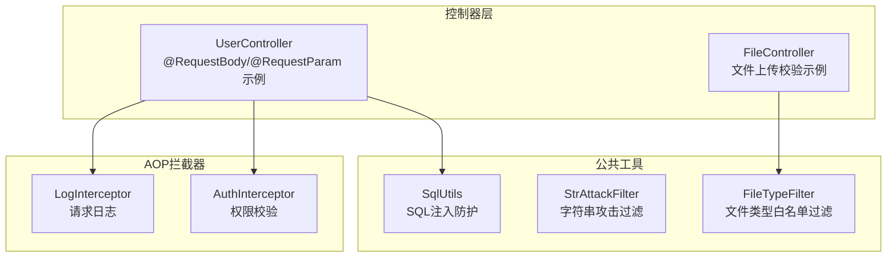
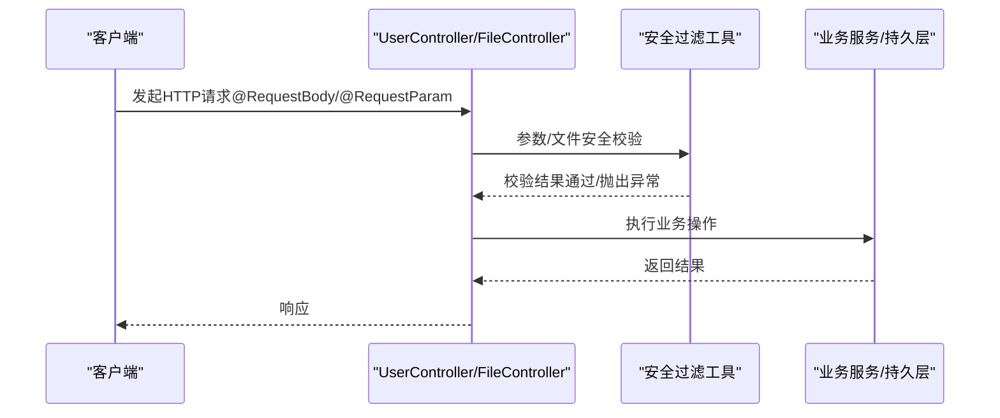
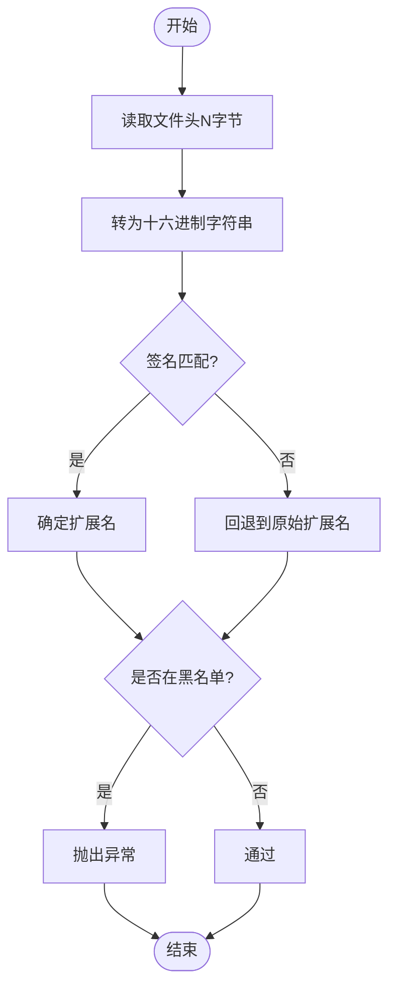
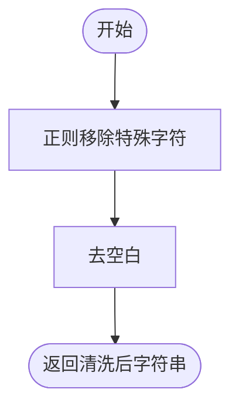
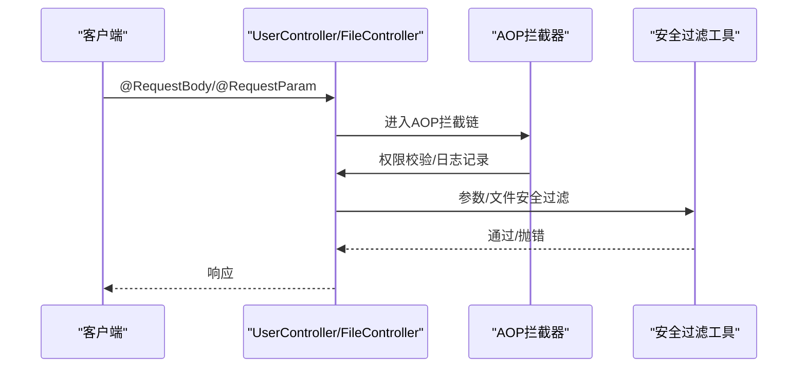
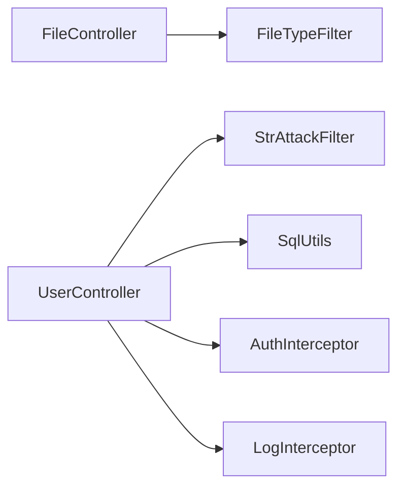

# 安全过滤工具类

<cite>
**本文引用的文件**
- [FileTypeFilter.java](file://yun-docker-common/src/main/java/com/lfc/yundocker/common/util/filter/FileTypeFilter.java)
- [StrAttackFilter.java](file://yun-docker-common/src/main/java/com/lfc/yundocker/common/util/filter/StrAttackFilter.java)
- [UserController.java](file://yun-docker-master/src/main/java/com/lfc/yundocker/controller/UserController.java)
- [FileController.java](file://yun-docker-master/src/main/java/com/lfc/yundocker/controller/FileController.java)
- [SqlUtils.java](file://yun-docker-common/src/main/java/com/lfc/yundocker/common/util/SqlUtils.java)
- [LogInterceptor.java](file://yun-docker-master/src/main/java/com/lfc/yundocker/aop/LogInterceptor.java)
- [AuthInterceptor.java](file://yun-docker-master/src/main/java/com/lfc/yundocker/aop/AuthInterceptor.java)
</cite>

## 目录
1. [简介](#简介)
2. [项目结构](#项目结构)
3. [核心组件](#核心组件)
4. [架构总览](#架构总览)
5. [详细组件分析](#详细组件分析)
6. [依赖关系分析](#依赖关系分析)
7. [性能考量](#性能考量)
8. [故障排查指南](#故障排查指南)
9. [结论](#结论)
10. [附录](#附录)

## 简介
本文件聚焦于两类安全过滤工具类：文件类型白名单过滤与字符串攻击过滤，并结合Controller层的集成方式，解释其在前置过滤中的作用与局限性。同时给出自定义规则扩展方法与误杀规避策略，以及性能影响评估，帮助读者在不直接阅读源码的情况下理解其工作原理与最佳实践。

## 项目结构
- 安全过滤工具位于公共模块的工具包中：
  - 文件类型过滤：FileTypeFilter
  - 字符串攻击过滤：StrAttackFilter
- 控制器层示例：
  - UserController：演示@RequestBody与@RequestParam的参数处理与校验
  - FileController：演示文件上传校验逻辑
- 辅助安全工具：
  - SqlUtils：排序字段合法性校验，用于防止SQL注入
- 拦截器：
  - LogInterceptor：统一日志记录
  - AuthInterceptor：权限校验

**图表来源**
- [FileTypeFilter.java](file://yun-docker-common/src/main/java/com/lfc/yundocker/common/util/filter/FileTypeFilter.java#L1-L165)
- [StrAttackFilter.java](file://yun-docker-common/src/main/java/com/lfc/yundocker/common/util/filter/StrAttackFilter.java#L1-L27)
- [SqlUtils.java](file://yun-docker-common/src/main/java/com/lfc/yundocker/common/util/SqlUtils.java#L1-L24)
- [UserController.java](file://yun-docker-master/src/main/java/com/lfc/yundocker/controller/UserController.java#L1-L309)
- [FileController.java](file://yun-docker-master/src/main/java/com/lfc/yundocker/controller/FileController.java#L1-L98)
- [LogInterceptor.java](file://yun-docker-master/src/main/java/com/lfc/yundocker/aop/LogInterceptor.java#L1-L57)
- [AuthInterceptor.java](file://yun-docker-master/src/main/java/com/lfc/yundocker/aop/AuthInterceptor.java#L1-L69)

**章节来源**
- [FileTypeFilter.java](file://yun-docker-common/src/main/java/com/lfc/yundocker/common/util/filter/FileTypeFilter.java#L1-L165)
- [StrAttackFilter.java](file://yun-docker-common/src/main/java/com/lfc/yundocker/common/util/filter/StrAttackFilter.java#L1-L27)
- [SqlUtils.java](file://yun-docker-common/src/main/java/com/lfc/yundocker/common/util/SqlUtils.java#L1-L24)
- [UserController.java](file://yun-docker-master/src/main/java/com/lfc/yundocker/controller/UserController.java#L1-L309)
- [FileController.java](file://yun-docker-master/src/main/java/com/lfc/yundocker/controller/FileController.java#L1-L98)
- [LogInterceptor.java](file://yun-docker-master/src/main/java/com/lfc/yundocker/aop/LogInterceptor.java#L1-L57)
- [AuthInterceptor.java](file://yun-docker-master/src/main/java/com/lfc/yundocker/aop/AuthInterceptor.java#L1-L69)

## 核心组件
- 文件类型白名单过滤（FileTypeFilter）
  - 通过文件头十六进制签名与扩展名双重校验，拒绝黑名单扩展名，防止恶意脚本文件上传。
- 字符串攻击过滤（StrAttackFilter）
  - 使用正则移除常见特殊字符，降低XSS与注入风险，但不等同于完整防护。
- SQL注入防护（SqlUtils）
  - 对排序字段进行合法性校验，避免危险字符进入SQL拼接。
- 控制器层参数处理
  - @RequestBody与@RequestParam的参数校验与业务逻辑分离，便于在前置阶段插入安全过滤。

**章节来源**
- [FileTypeFilter.java](file://yun-docker-common/src/main/java/com/lfc/yundocker/common/util/filter/FileTypeFilter.java#L1-L165)
- [StrAttackFilter.java](file://yun-docker-common/src/main/java/com/lfc/yundocker/common/util/filter/StrAttackFilter.java#L1-L27)
- [SqlUtils.java](file://yun-docker-common/src/main/java/com/lfc/yundocker/common/util/SqlUtils.java#L1-L24)
- [UserController.java](file://yun-docker-master/src/main/java/com/lfc/yundocker/controller/UserController.java#L1-L309)
- [FileController.java](file://yun-docker-master/src/main/java/com/lfc/yundocker/controller/FileController.java#L1-L98)

## 架构总览
安全过滤贯穿请求生命周期：在Controller入口处执行参数校验与过滤，配合AOP拦截器记录日志与权限控制，形成多层防护。

**图表来源**
- [UserController.java](file://yun-docker-master/src/main/java/com/lfc/yundocker/controller/UserController.java#L1-L309)
- [FileController.java](file://yun-docker-master/src/main/java/com/lfc/yundocker/controller/FileController.java#L1-L98)
- [FileTypeFilter.java](file://yun-docker-common/src/main/java/com/lfc/yundocker/common/util/filter/FileTypeFilter.java#L1-L165)
- [StrAttackFilter.java](file://yun-docker-common/src/main/java/com/lfc/yundocker/common/util/filter/StrAttackFilter.java#L1-L27)
- [SqlUtils.java](file://yun-docker-common/src/main/java/com/lfc/yundocker/common/util/SqlUtils.java#L1-L24)

## 详细组件分析

### 文件类型白名单过滤（FileTypeFilter）
- 设计要点
  - 黑名单扩展名：内置禁止的扩展名集合，遇黑名单即拒绝。
  - 文件头校验：读取文件前若干字节，转换为十六进制，与预置签名匹配，提升准确性。
  - 回退策略：若无法识别文件头，回退到原始文件扩展名判断。
- MIME类型与扩展名校验流程
  - 输入：MultipartFile
  - 步骤：
    1) 读取文件头前N字节，转为十六进制字符串
    2) 与签名表匹配，命中则返回对应扩展名
    3) 若未命中且为空，使用原始扩展名
    4) 对比黑名单扩展名，命中则抛出异常
- 攻击面与局限
  - 仅基于扩展名与文件头，无法覆盖所有伪装文件；建议结合服务端解析与二次校验。
  - 签名表可按需扩展，以覆盖更多文件类型。
- 性能特征
  - IO开销主要来自读取文件头，通常很小；签名表查找为常数级。

**图表来源**
- [FileTypeFilter.java](file://yun-docker-common/src/main/java/com/lfc/yundocker/common/util/filter/FileTypeFilter.java#L90-L141)

**章节来源**
- [FileTypeFilter.java](file://yun-docker-common/src/main/java/com/lfc/yundocker/common/util/filter/FileTypeFilter.java#L1-L165)

### 字符串攻击过滤（StrAttackFilter）
- 设计要点
  - 使用正则表达式批量移除常见特殊字符，降低XSS与注入风险。
  - 该过滤器属于“弱化”策略，不等同于完整防护，需配合其他手段。
- 集成位置与建议
  - 可在Controller层对@RequestBody对象字段进行预处理，或在DTO层增加校验。
  - 对@RequestParam参数同样适用，建议在进入业务逻辑前统一清理。
- 防护范围
  - 能有效减少常见符号型攻击载荷，但对复杂注入（如编码绕过）效果有限。
- 误杀风险
  - 中文标点、特殊符号较多的输入可能被清理，需结合业务语义评估。

**图表来源**
- [StrAttackFilter.java](file://yun-docker-common/src/main/java/com/lfc/yundocker/common/util/filter/StrAttackFilter.java#L14-L20)

**章节来源**
- [StrAttackFilter.java](file://yun-docker-common/src/main/java/com/lfc/yundocker/common/util/filter/StrAttackFilter.java#L1-L27)

### SQL注入防护（SqlUtils）
- 设计要点
  - 对排序字段进行合法性校验，禁止包含危险字符，避免拼接到SQL中引发注入。
- 集成建议
  - 在分页查询或动态排序场景中，先调用合法性校验，再拼接SQL。
- 与StrAttackFilter的区别
  - SqlUtils针对排序字段，StrAttackFilter针对任意字符串内容；两者互补。

**章节来源**
- [SqlUtils.java](file://yun-docker-common/src/main/java/com/lfc/yundocker/common/util/SqlUtils.java#L1-L24)

### Controller层前置过滤集成
- UserController示例
  - @RequestBody参数：在进入业务方法前，可对请求体字段进行StrAttackFilter清洗与参数校验。
  - @RequestParam参数：对URL参数同样进行清洗与校验，避免注入。
- FileController示例
  - 文件上传前可调用FileTypeFilter进行类型校验，拒绝黑名单扩展名与可疑文件头。
- AOP辅助
  - LogInterceptor：统一记录请求与耗时，便于审计与定位问题。
  - AuthInterceptor：在进入业务前进行权限校验，避免越权访问。

**图表来源**
- [UserController.java](file://yun-docker-master/src/main/java/com/lfc/yundocker/controller/UserController.java#L1-L309)
- [FileController.java](file://yun-docker-master/src/main/java/com/lfc/yundocker/controller/FileController.java#L1-L98)
- [LogInterceptor.java](file://yun-docker-master/src/main/java/com/lfc/yundocker/aop/LogInterceptor.java#L1-L57)
- [AuthInterceptor.java](file://yun-docker-master/src/main/java/com/lfc/yundocker/aop/AuthInterceptor.java#L1-L69)
- [StrAttackFilter.java](file://yun-docker-common/src/main/java/com/lfc/yundocker/common/util/filter/StrAttackFilter.java#L1-L27)
- [FileTypeFilter.java](file://yun-docker-common/src/main/java/com/lfc/yundocker/common/util/filter/FileTypeFilter.java#L1-L165)

**章节来源**
- [UserController.java](file://yun-docker-master/src/main/java/com/lfc/yundocker/controller/UserController.java#L1-L309)
- [FileController.java](file://yun-docker-master/src/main/java/com/lfc/yundocker/controller/FileController.java#L1-L98)
- [LogInterceptor.java](file://yun-docker-master/src/main/java/com/lfc/yundocker/aop/LogInterceptor.java#L1-L57)
- [AuthInterceptor.java](file://yun-docker-master/src/main/java/com/lfc/yundocker/aop/AuthInterceptor.java#L1-L69)

## 依赖关系分析
- 组件耦合
  - FileTypeFilter与StrAttackFilter均为纯工具类，无外部依赖，耦合度低。
  - Controller层通过AOP与工具类间接耦合，职责清晰。
- 外部依赖
  - Spring Web（MultipartFile）、Apache Commons Lang3（字符串工具）。
- 潜在循环依赖
  - 未发现循环依赖迹象。

**图表来源**
- [FileController.java](file://yun-docker-master/src/main/java/com/lfc/yundocker/controller/FileController.java#L1-L98)
- [UserController.java](file://yun-docker-master/src/main/java/com/lfc/yundocker/controller/UserController.java#L1-L309)
- [FileTypeFilter.java](file://yun-docker-common/src/main/java/com/lfc/yundocker/common/util/filter/FileTypeFilter.java#L1-L165)
- [StrAttackFilter.java](file://yun-docker-common/src/main/java/com/lfc/yundocker/common/util/filter/StrAttackFilter.java#L1-L27)
- [SqlUtils.java](file://yun-docker-common/src/main/java/com/lfc/yundocker/common/util/SqlUtils.java#L1-L24)
- [AuthInterceptor.java](file://yun-docker-master/src/main/java/com/lfc/yundocker/aop/AuthInterceptor.java#L1-L69)
- [LogInterceptor.java](file://yun-docker-master/src/main/java/com/lfc/yundocker/aop/LogInterceptor.java#L1-L57)

**章节来源**
- [FileController.java](file://yun-docker-master/src/main/java/com/lfc/yundocker/controller/FileController.java#L1-L98)
- [UserController.java](file://yun-docker-master/src/main/java/com/lfc/yundocker/controller/UserController.java#L1-L309)
- [FileTypeFilter.java](file://yun-docker-common/src/main/java/com/lfc/yundocker/common/util/filter/FileTypeFilter.java#L1-L165)
- [StrAttackFilter.java](file://yun-docker-common/src/main/java/com/lfc/yundocker/common/util/filter/StrAttackFilter.java#L1-L27)
- [SqlUtils.java](file://yun-docker-common/src/main/java/com/lfc/yundocker/common/util/SqlUtils.java#L1-L24)
- [AuthInterceptor.java](file://yun-docker-master/src/main/java/com/lfc/yundocker/aop/AuthInterceptor.java#L1-L69)
- [LogInterceptor.java](file://yun-docker-master/src/main/java/com/lfc/yundocker/aop/LogInterceptor.java#L1-L57)

## 性能考量
- 文件类型过滤
  - 读取文件头N字节，IO成本极低；签名表查找为常量时间。
  - 建议：仅在必要场景启用，避免对非上传接口重复校验。
- 字符串攻击过滤
  - 正则替换成本较低，适合高频参数清洗。
  - 建议：对大文本字段谨慎使用，避免不必要的CPU消耗。
- SQL注入防护
  - 排序字段校验为O(n)字符串比较，开销很小。
- AOP日志
  - 记录请求与耗时，建议在生产环境按采样比例开启，避免日志风暴。

[本节为通用性能讨论，无需列出具体文件来源]

## 故障排查指南
- 文件上传被拒
  - 检查扩展名是否在黑名单；确认文件头签名是否被正确识别。
  - 建议：扩展签名表，覆盖更多类型；或在开发环境打印文件头十六进制以便定位。
- 参数清洗导致内容丢失
  - StrAttackFilter会移除特殊字符，若业务需要保留，请调整正则或在DTO层做差异化处理。
- 排序字段报错
  - SqlUtils对包含危险字符的排序字段会判定非法，检查前端传参是否包含等号、括号或空格。
- 日志与权限问题
  - 如需审计，启用LogInterceptor；权限不足时由AuthInterceptor抛出异常。

**章节来源**
- [FileTypeFilter.java](file://yun-docker-common/src/main/java/com/lfc/yundocker/common/util/filter/FileTypeFilter.java#L90-L141)
- [StrAttackFilter.java](file://yun-docker-common/src/main/java/com/lfc/yundocker/common/util/filter/StrAttackFilter.java#L14-L20)
- [SqlUtils.java](file://yun-docker-common/src/main/java/com/lfc/yundocker/common/util/SqlUtils.java#L1-L24)
- [LogInterceptor.java](file://yun-docker-master/src/main/java/com/lfc/yundocker/aop/LogInterceptor.java#L1-L57)
- [AuthInterceptor.java](file://yun-docker-master/src/main/java/com/lfc/yundocker/aop/AuthInterceptor.java#L1-L69)

## 结论
- FileTypeFilter通过白名单与文件头签名，有效阻断常见恶意脚本文件上传，建议结合签名表扩展与服务端二次解析。
- StrAttackFilter作为前置清洗工具，能显著降低XSS与注入风险，但需与其他防护手段配合使用。
- SqlUtils对排序字段的合法性校验是防止SQL注入的重要一环。
- 在Controller层通过@RequestBody与@RequestParam的参数处理，结合AOP拦截器，形成完整的前置安全过滤闭环。

[本节为总结性内容，无需列出具体文件来源]

## 附录

### 自定义规则扩展方法
- 扩展FileTypeFilter签名表
  - 在静态初始化块中添加新的十六进制签名与扩展名映射，确保覆盖更多文件类型。
  - 参考路径：[FileTypeFilter.java](file://yun-docker-common/src/main/java/com/lfc/yundocker/common/util/filter/FileTypeFilter.java#L21-L79)
- 扩展StrAttackFilter正则
  - 根据业务需求调整正则表达式，平衡安全性与可用性。
  - 参考路径：[StrAttackFilter.java](file://yun-docker-common/src/main/java/com/lfc/yundocker/common/util/filter/StrAttackFilter.java#L14-L20)
- 扩展SqlUtils校验规则
  - 在排序字段校验中加入更严格的规则，例如白名单枚举或长度限制。
  - 参考路径：[SqlUtils.java](file://yun-docker-common/src/main/java/com/lfc/yundocker/common/util/SqlUtils.java#L1-L24)

### 误杀规避策略
- 对中文标点与特殊符号较多的输入，可在DTO层或业务逻辑中对关键字段做差异化处理，避免过度清洗。
- 对于图片、文档等富文本场景，建议采用白名单扩展名与MIME类型双重校验，并结合服务端渲染与CSP策略。
- 对排序字段，提供固定白名单，避免动态拼接。

[本节为通用指导，无需列出具体文件来源]