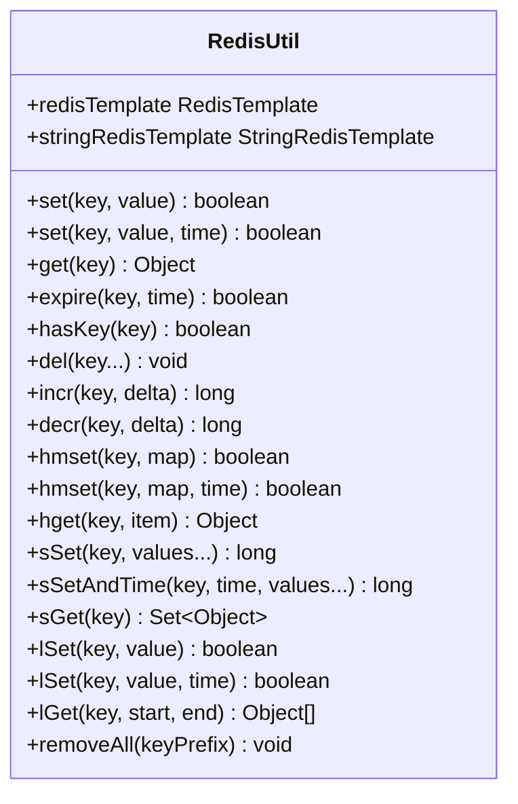
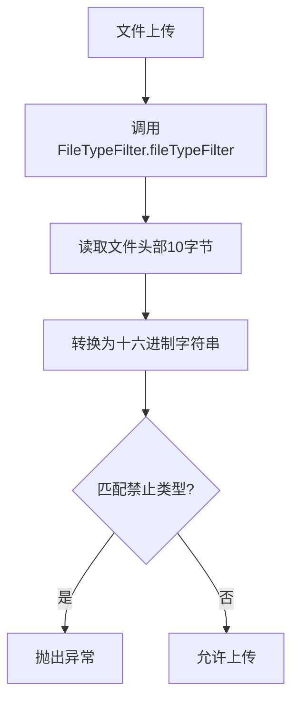
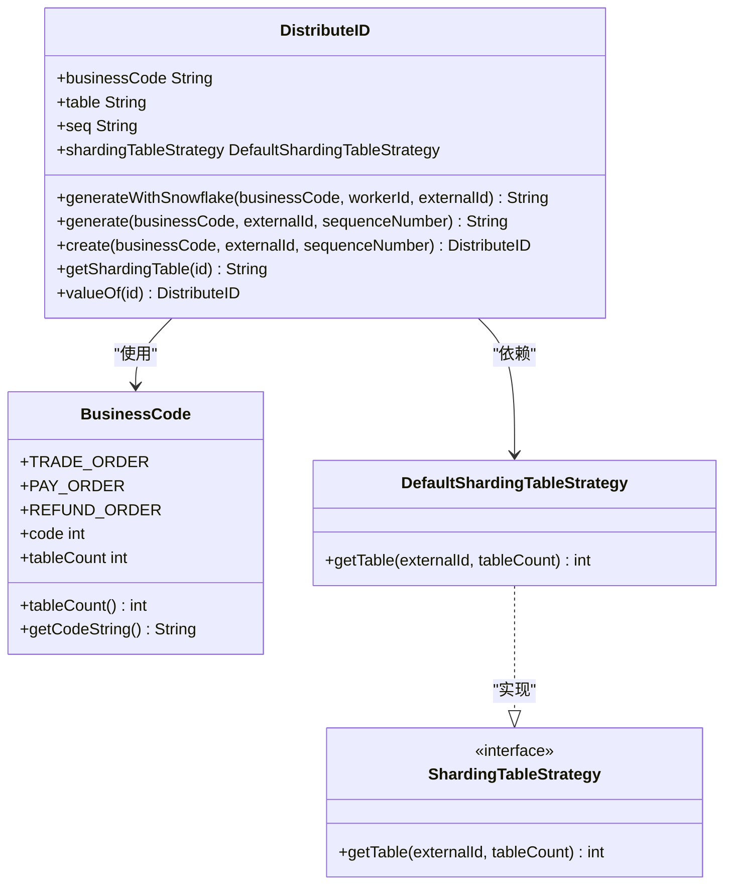

# 工具类库

<cite>
**本文档引用文件**   
- [MD5Util.java](file://yun-docker-common/src/main/java/com/lfc/yundocker/common/util/MD5Util.java)
- [PasswordUtil.java](file://yun-docker-common/src/main/java/com/lfc/yundocker/common/util/PasswordUtil.java)
- [DateUtils.java](file://yun-docker-common/src/main/java/com/lfc/yundocker/common/util/DateUtils.java)
- [IPUtils.java](file://yun-docker-common/src/main/java/com/lfc/yundocker/common/util/IPUtils.java)
- [NetUtils.java](file://yun-docker-common/src/main/java/com/lfc/yundocker/common/util/NetUtils.java)
- [RedisUtil.java](file://yun-docker-common/src/main/java/com/lfc/yundocker/common/util/RedisUtil.java)
- [ResultUtils.java](file://yun-docker-common/src/main/java/com/lfc/yundocker/common/util/ResultUtils.java)
- [CommonUtils.java](file://yun-docker-common/src/main/java/com/lfc/yundocker/common/util/CommonUtils.java)
- [SqlUtils.java](file://yun-docker-common/src/main/java/com/lfc/yundocker/common/util/SqlUtils.java)
- [oConvertUtils.java](file://yun-docker-common/src/main/java/com/lfc/yundocker/common/util/oConvertUtils.java)
- [FileTypeFilter.java](file://yun-docker-common/src/main/java/com/lfc/yundocker/common/util/filter/FileTypeFilter.java)
- [StrAttackFilter.java](file://yun-docker-common/src/main/java/com/lfc/yundocker/common/util/filter/StrAttackFilter.java)
- [DistributeID.java](file://yun-docker-common/src/main/java/com/lfc/yundocker/common/util/id/DistributeID.java)
- [BusinessCode.java](file://yun-docker-common/src/main/java/com/lfc/yundocker/common/util/id/BusinessCode.java)
- [ShardingTableStrategy.java](file://yun-docker-common/src/main/java/com/lfc/yundocker/common/util/strategy/ShardingTableStrategy.java)
- [DefaultShardingTableStrategy.java](file://yun-docker-common/src/main/java/com/lfc/yundocker/common/util/strategy/DefaultShardingTableStrategy.java)
</cite>

## 目录
1. [加密工具类](#加密工具类)
2. [日期与基础工具类](#日期与基础工具类)
3. [Redis工具类](#redis工具类)
4. [统一响应构建工具](#统一响应构建工具)
5. [通用转换方法](#通用转换方法)
6. [安全过滤工具](#安全过滤工具)
7. [分布式ID与分表策略](#分布式id与分表策略)

## 加密工具类

yun-docker-common模块提供了`MD5Util`和`PasswordUtil`两个加密工具类，用于用户密码的安全存储与处理。

`MD5Util`类提供了标准的MD5加密功能，通过`MD5Encode`方法将原始字符串转换为不可逆的哈希值。该方法支持指定字符集编码，确保在不同平台环境下生成一致的哈希结果。在用户注册和登录验证过程中，系统会将用户密码通过MD5加密后存储到数据库中，避免明文密码泄露风险。

`PasswordUtil`类则提供了更高级的PBEWithMD5AndDES加密算法，结合盐值（Salt）和1000次迭代增强安全性。该工具类通过`encrypt`和`decrypt`方法实现密码的加密存储与解密验证。其核心优势在于即使数据库泄露，攻击者也难以通过彩虹表等方式破解密码。在实际应用中，用户密码先通过`PasswordUtil.encrypt`方法加密，然后将密文存储；验证时则使用`decrypt`方法进行比对。

**Section sources**
- [MD5Util.java](file://yun-docker-common/src/main/java/com/lfc/yundocker/common/util/MD5Util.java#L11-L49)
- [PasswordUtil.java](file://yun-docker-common/src/main/java/com/lfc/yundocker/common/util/PasswordUtil.java#L17-L188)

## 日期与基础工具类

模块提供了`DateUtils`、`IPUtils`和`NetUtils`等基础工具类，简化了日期处理和网络信息获取。

`DateUtils`类封装了全面的日期时间操作功能，包括多种格式的日期字符串转换（如"yyyy-MM-dd"、"yyyy-MM-dd HH:mm:ss"等）、时间戳处理、日期计算等。该类通过`ThreadLocal`管理`SimpleDateFormat`实例，避免了多线程环境下的线程安全问题。常用方法如`formatDate`用于将日期格式化为字符串，`parseDate`用于将字符串解析为日期对象，`getTimestamp`用于获取当前时间戳。

`IPUtils`和`NetUtils`类用于获取客户端IP地址。考虑到系统可能部署在Nginx等反向代理之后，这两个工具类通过检查`x-forwarded-for`、`Proxy-Client-IP`等多个HTTP头信息来准确获取真实客户端IP。`IPUtils`会从多个代理头中提取第一个有效的非"unknown"IP地址，而`NetUtils`在获取IP后还会处理多代理情况，提取逗号分隔的第一个IP。

```mermaid
flowchart TD
A[获取客户端IP] --> B{检查x-forwarded-for头}
B --> |存在且有效| C[返回该IP]
B --> |无效| D{检查Proxy-Client-IP头}
D --> |存在且有效| E[返回该IP]
D --> |无效| F{检查WL-Proxy-Client-IP头}
F --> |存在且有效| G[返回该IP]
F --> |无效| H[返回request.getRemoteAddr()]
```

**Diagram sources**
- [IPUtils.java](file://yun-docker-common/src/main/java/com/lfc/yundocker/common/util/IPUtils.java#L23-L54)
- [NetUtils.java](file://yun-docker-common/src/main/java/com/lfc/yundocker/common/util/NetUtils.java#L19-L55)

**Section sources**
- [DateUtils.java](file://yun-docker-common/src/main/java/com/lfc/yundocker/common/util/DateUtils.java#L19-L653)
- [IPUtils.java](file://yun-docker-common/src/main/java/com/lfc/yundocker/common/util/IPUtils.java#L23-L54)
- [NetUtils.java](file://yun-docker-common/src/main/java/com/lfc/yundocker/common/util/NetUtils.java#L19-L55)

## Redis工具类

`RedisUtil`类封装了Redis的常用操作，提供了简洁的API接口，支持字符串、哈希、集合、列表等多种数据结构的操作。

该工具类通过`set`、`get`方法提供基本的键值存储功能，`expire`方法设置键的过期时间，`hasKey`方法检查键是否存在。对于哈希操作，提供了`hset`、`hget`、`hmset`等方法；对于集合操作，提供了`sSet`、`sGet`等方法；对于列表操作，提供了`lSet`、`lGet`等方法。特别地，`incr`和`decr`方法支持原子性递增递减操作，非常适合用于计数场景。

在实际应用中，`RedisUtil`被广泛用于登录态管理和接口限流。登录态管理通过`set`方法将用户会话信息存储在Redis中，并设置合理的过期时间；限流功能则利用`incr`方法对用户请求进行计数，当计数超过阈值时拒绝请求。此外，`removeAll`方法通过`scan`命令而非`keys`命令批量删除指定前缀的键，避免了`keys`命令在大数据量下阻塞Redis服务的风险。



**Diagram sources**
- [RedisUtil.java](file://yun-docker-common/src/main/java/com/lfc/yundocker/common/util/RedisUtil.java#L16-L615)

**Section sources**
- [RedisUtil.java](file://yun-docker-common/src/main/java/com/lfc/yundocker/common/util/RedisUtil.java#L16-L615)

## 统一响应构建工具

`ResultUtils`类提供了统一的API响应体构建功能，确保前后端交互的数据格式一致性。

该工具类基于`BaseResponse`泛型类构建响应体，提供了`success`和`error`两个主要方法。`success`方法用于构建成功的响应，包含状态码0、数据对象和"ok"消息；`error`方法用于构建失败的响应，支持通过`ErrorCode`枚举或直接指定状态码和消息来创建错误响应。这种统一的响应格式简化了前端对API响应的处理逻辑，提高了开发效率。

在实际应用中，控制器层的方法通常会使用`ResultUtils.success`返回查询结果或操作成功信息，使用`ResultUtils.error`返回各种业务或系统错误。前端通过检查响应体中的状态码来判断请求是否成功，并根据数据字段获取实际数据或根据消息字段显示错误提示。

**Section sources**
- [ResultUtils.java](file://yun-docker-common/src/main/java/com/lfc/yundocker/common/util/ResultUtils.java#L12-L56)
- [BaseResponse.java](file://yun-docker-common/src/main/java/com/lfc/yundocker/common/model/dto/BaseResponse.java)

## 通用转换方法

模块提供了`CommonUtils`、`SqlUtils`和`oConvertUtils`三个通用工具类，涵盖了文件处理、SQL安全和数据类型转换等功能。

`CommonUtils`类提供了文件上传相关的工具方法，如`uploadLocal`用于将`MultipartFile`保存到本地指定路径，`getFileName`用于处理文件名中的特殊字符和路径信息。该类还通过`getBaseUrl`方法获取服务器基础URL，支持微服务架构下的网关基础路径。

`SqlUtils`类提供了`validSortField`方法用于校验排序字段的合法性，通过检查字段名是否包含"="、"("、")"、空格等字符来防止SQL注入攻击。该方法在处理用户输入的排序参数时至关重要，确保了数据库查询的安全性。

`oConvertUtils`类是一个功能丰富的通用转换工具，提供了`isEmpty`、`isNotEmpty`等对象空值判断方法，`getInt`、`getDouble`等类型转换方法，`camelName`、`camelToUnderline`等命名转换方法，以及`entityToModel`等对象转换方法。这些方法在数据处理和对象映射场景中被广泛使用，提高了代码的复用性和可读性。

**Section sources**
- [CommonUtils.java](file://yun-docker-common/src/main/java/com/lfc/yundocker/common/util/CommonUtils.java#L24-L297)
- [SqlUtils.java](file://yun-docker-common/src/main/java/com/lfc/yundocker/common/util/SqlUtils.java#L10-L25)
- [oConvertUtils.java](file://yun-docker-common/src/main/java/com/lfc/yundocker/common/util/oConvertUtils.java#L29-L668)

## 安全过滤工具

`FileTypeFilter`和`StrAttackFilter`两个安全过滤工具类用于防御文件上传和字符串攻击风险。

`FileTypeFilter`类通过检查文件头部字节（magic number）来验证文件类型，防止恶意用户上传伪装成图片或其他安全格式的脚本文件（如JSP、PHP）。该类维护了一个文件类型映射表，将常见的文件头部特征与文件扩展名关联。在文件上传时，`fileTypeFilter`方法会读取文件前10个字节，转换为十六进制字符串，并与映射表中的特征进行匹配。如果匹配到禁止的类型（如JSP、PHP），则抛出异常阻止上传。这种方法比单纯检查文件扩展名更安全可靠。

`StrAttackFilter`类用于过滤字符串中的特殊字符，防止XSS攻击和命令注入。其`filter`方法通过正则表达式移除字符串中的各种特殊符号，如`~!@#$%^&*()+=|{}':;',\\[\\].<>?`等。该工具在处理用户输入的文本内容时非常有用，可以有效防止恶意脚本的注入。



**Diagram sources**
- [FileTypeFilter.java](file://yun-docker-common/src/main/java/com/lfc/yundocker/common/util/filter/FileTypeFilter.java#L95-L102)
- [StrAttackFilter.java](file://yun-docker-common/src/main/java/com/lfc/yundocker/common/util/filter/StrAttackFilter.java#L14-L20)

**Section sources**
- [FileTypeFilter.java](file://yun-docker-common/src/main/java/com/lfc/yundocker/common/util/filter/FileTypeFilter.java#L15-L165)
- [StrAttackFilter.java](file://yun-docker-common/src/main/java/com/lfc/yundocker/common/util/filter/StrAttackFilter.java#L12-L27)

## 分布式ID与分表策略

模块通过`DistributeID`、`BusinessCode`和`ShardingTableStrategy`等类实现了基于雪花算法的分布式ID生成和分表策略。

`DistributeID`类利用Hutool的雪花算法生成全局唯一ID，其生成的ID由三部分组成：2位业务码、19位序列号和4位分表号。`generateWithSnowflake`方法结合`BusinessCode`和工作节点ID生成唯一序列号。`BusinessCode`枚举定义了不同业务的编码和分表数量，如订单业务编码为10，分4张表。

分表策略由`ShardingTableStrategy`接口定义，`DefaultShardingTableStrategy`提供默认实现。`getTable`方法根据外部ID和表数量通过取模运算确定分表位置。`DistributeID`类在生成ID时会调用此策略确定分表号，并将其填充为4位字符串。这种设计实现了水平分表，提高了大数据量下的系统扩展能力。



**Diagram sources**
- [DistributeID.java](file://yun-docker-common/src/main/java/com/lfc/yundocker/common/util/id/DistributeID.java#L12-L91)
- [BusinessCode.java](file://yun-docker-common/src/main/java/com/lfc/yundocker/common/util/id/BusinessCode.java#L8-L51)
- [ShardingTableStrategy.java](file://yun-docker-common/src/main/java/com/lfc/yundocker/common/util/strategy/ShardingTableStrategy.java#L8-L19)
- [DefaultShardingTableStrategy.java](file://yun-docker-common/src/main/java/com/lfc/yundocker/common/util/strategy/DefaultShardingTableStrategy.java)

**Section sources**
- [DistributeID.java](file://yun-docker-common/src/main/java/com/lfc/yundocker/common/util/id/DistributeID.java#L12-L91)
- [BusinessCode.java](file://yun-docker-common/src/main/java/com/lfc/yundocker/common/util/id/BusinessCode.java#L8-L51)
- [ShardingTableStrategy.java](file://yun-docker-common/src/main/java/com/lfc/yundocker/common/util/strategy/ShardingTableStrategy.java#L8-L19)
- [DefaultShardingTableStrategy.java](file://yun-docker-common/src/main/java/com/lfc/yundocker/common/util/strategy/DefaultShardingTableStrategy.java)