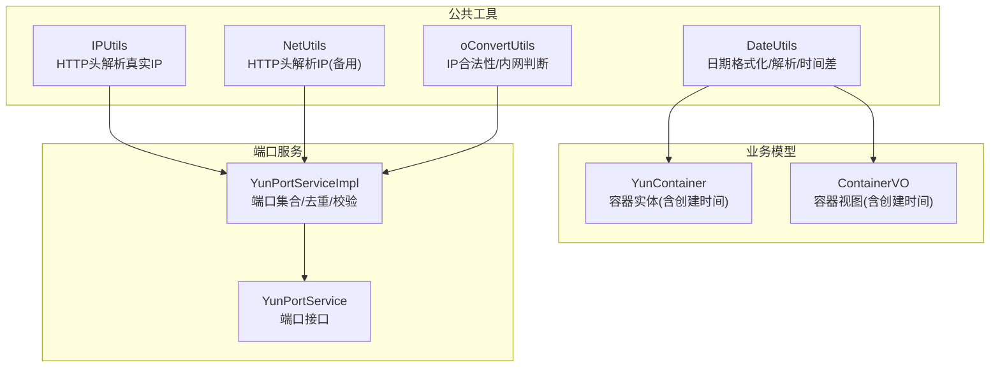
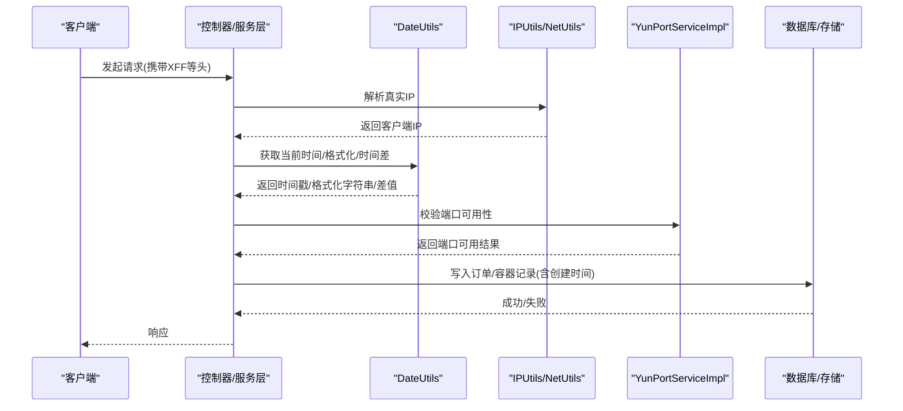
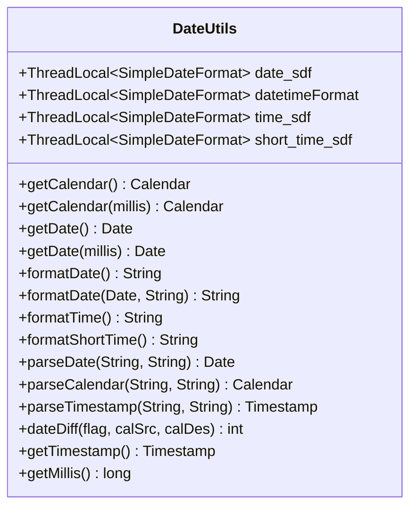
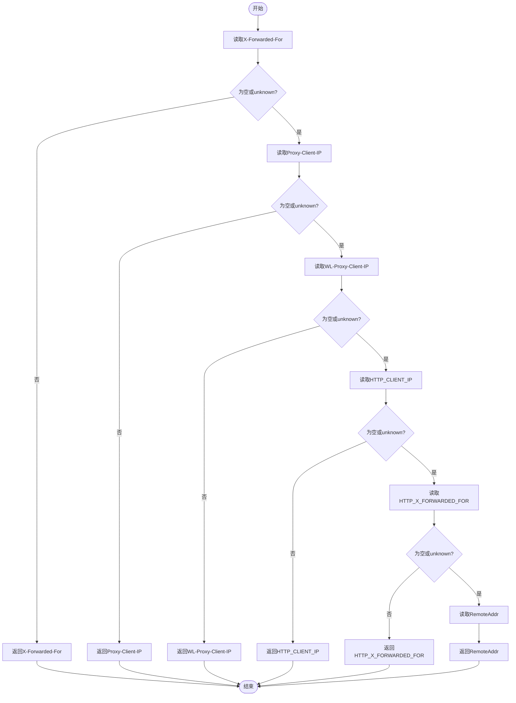
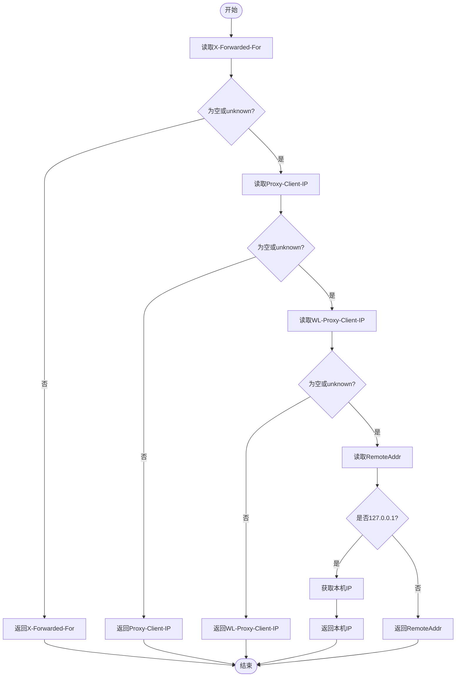
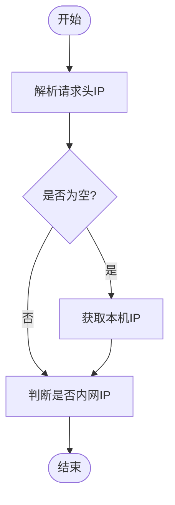
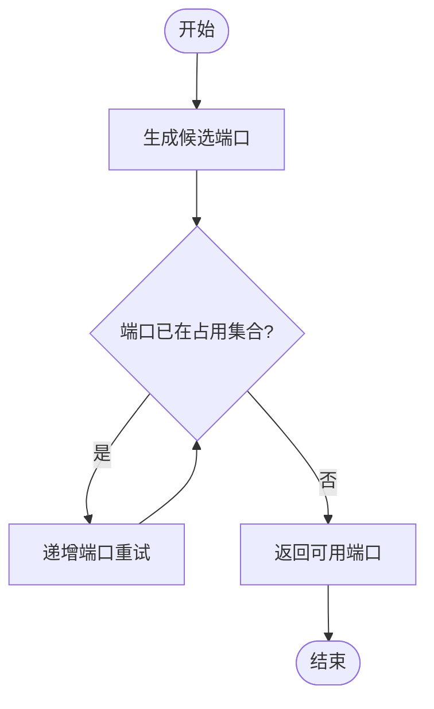
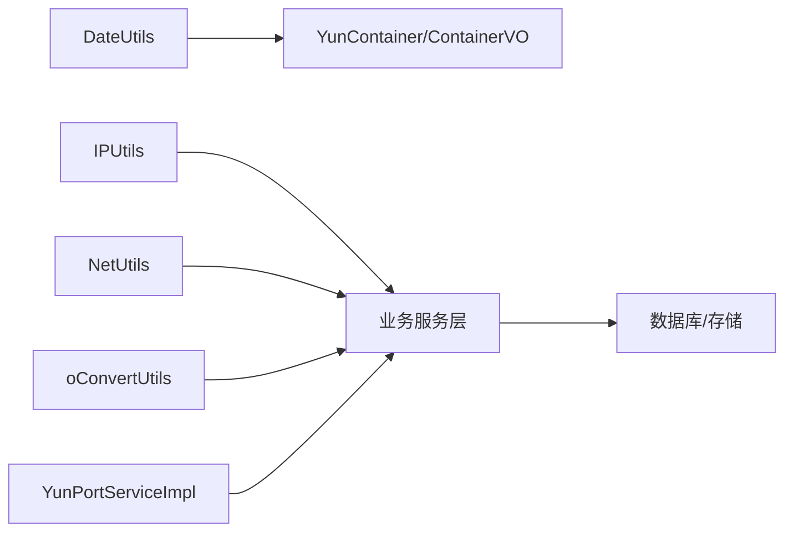

# 日期与网络工具类

<cite>
**本文引用的文件**
- [DateUtils.java](file://yun-docker-common/src/main/java/com/lfc/yundocker/common/util/DateUtils.java)
- [IPUtils.java](file://yun-docker-common/src/main/java/com/lfc/yundocker/common/util/IPUtils.java)
- [NetUtils.java](file://yun-docker-common/src/main/java/com/lfc/yundocker/common/util/NetUtils.java)
- [oConvertUtils.java](file://yun-docker-common/src/main/java/com/lfc/yundocker/common/util/oConvertUtils.java)
- [YunContainer.java](file://yun-docker-master/src/main/java/com/lfc/yundocker/common/model/entity/YunContainer.java)
- [ContainerVO.java](file://yun-docker-master/src/main/java/com/lfc/yundocker/common/model/vo/ContainerVO.java)
- [YunPortService.java](file://yun-docker-master/src/main/java/com/lfc/yundocker/service/YunPortService.java)
- [YunPortServiceImpl.java](file://yun-docker-master/src/main/java/com/lfc/yundocker/service/impl/YunPortServiceImpl.java)
</cite>

## 目录
1. [引言](#引言)
2. [项目结构](#项目结构)
3. [核心组件](#核心组件)
4. [架构总览](#架构总览)
5. [详细组件分析](#详细组件分析)
6. [依赖关系分析](#依赖关系分析)
7. [性能与线程安全](#性能与线程安全)
8. [故障排查指南](#故障排查指南)
9. [结论](#结论)
10. [附录：调用示例与最佳实践](#附录调用示例与最佳实践)

## 引言
本文件聚焦于仓库中的日期与网络工具类，系统性解析以下能力：
- 日期工具 DateUtils：日期格式化、解析、时间差计算、时间戳转换、时区与时钟使用建议
- IP 工具 IPUtils 与 NetUtils：从 HTTP 请求头提取真实客户端 IP，支持多级代理链路
- 端口预检与可达性：结合端口服务与工具类进行容器端口分配前的预检

同时给出在订单创建时间、容器运行时长统计等场景中的应用思路，以及线程安全、性能优化（如 SimpleDateFormat 的 ThreadLocal 封装）与常见问题排查要点。

## 项目结构
- 工具类位于公共模块 yun-docker-common 的 util 包中，提供跨模块复用的日期、IP、网络等基础能力
- 实体与视图模型位于 yun-docker-master 的 common/model 下，包含容器实体与 VO，便于展示运行时长与创建时间
- 端口服务接口与实现位于 yun-docker-master 的 service 层，提供端口生成与有效性校验

图表来源
- [DateUtils.java](file://yun-docker-common/src/main/java/com/lfc/yundocker/common/util/DateUtils.java#L1-L653)
- [IPUtils.java](file://yun-docker-common/src/main/java/com/lfc/yundocker/common/util/IPUtils.java#L1-L57)
- [NetUtils.java](file://yun-docker-common/src/main/java/com/lfc/yundocker/common/util/NetUtils.java#L1-L55)
- [oConvertUtils.java](file://yun-docker-common/src/main/java/com/lfc/yundocker/common/util/oConvertUtils.java#L270-L469)
- [YunContainer.java](file://yun-docker-master/src/main/java/com/lfc/yundocker/common/model/entity/YunContainer.java#L1-L78)
- [ContainerVO.java](file://yun-docker-master/src/main/java/com/lfc/yundocker/common/model/vo/ContainerVO.java#L1-L82)
- [YunPortService.java](file://yun-docker-master/src/main/java/com/lfc/yundocker/service/YunPortService.java#L1-L18)
- [YunPortServiceImpl.java](file://yun-docker-master/src/main/java/com/lfc/yundocker/service/impl/YunPortServiceImpl.java#L78-L94)

章节来源
- [DateUtils.java](file://yun-docker-common/src/main/java/com/lfc/yundocker/common/util/DateUtils.java#L1-L653)
- [IPUtils.java](file://yun-docker-common/src/main/java/com/lfc/yundocker/common/util/IPUtils.java#L1-L57)
- [NetUtils.java](file://yun-docker-common/src/main/java/com/lfc/yundocker/common/util/NetUtils.java#L1-L55)
- [oConvertUtils.java](file://yun-docker-common/src/main/java/com/lfc/yundocker/common/util/oConvertUtils.java#L270-L469)
- [YunContainer.java](file://yun-docker-master/src/main/java/com/lfc/yundocker/common/model/entity/YunContainer.java#L1-L78)
- [ContainerVO.java](file://yun-docker-master/src/main/java/com/lfc/yundocker/common/model/vo/ContainerVO.java#L1-L82)
- [YunPortService.java](file://yun-docker-master/src/main/java/com/lfc/yundocker/service/YunPortService.java#L1-L18)
- [YunPortServiceImpl.java](file://yun-docker-master/src/main/java/com/lfc/yundocker/service/impl/YunPortServiceImpl.java#L78-L94)

## 核心组件
- DateUtils：提供多种常用日期格式的 ThreadLocal 封装，统一的日期/时间戳格式化与解析、时间差计算、当前时间获取等
- IPUtils：从 HTTP 请求头解析真实客户端 IP，覆盖多级代理场景
- NetUtils：与 IPUtils 类似但略有差异的 IP 解析策略，补充“本机回环”处理
- oConvertUtils：提供 IP 合法性与内网判断、本机 IP 获取等辅助能力

章节来源
- [DateUtils.java](file://yun-docker-common/src/main/java/com/lfc/yundocker/common/util/DateUtils.java#L1-L653)
- [IPUtils.java](file://yun-docker-common/src/main/java/com/lfc/yundocker/common/util/IPUtils.java#L1-L57)
- [NetUtils.java](file://yun-docker-common/src/main/java/com/lfc/yundocker/common/util/NetUtils.java#L1-L55)
- [oConvertUtils.java](file://yun-docker-common/src/main/java/com/lfc/yundocker/common/util/oConvertUtils.java#L270-L469)

## 架构总览
DateUtils 作为日期处理中枢，贯穿订单创建时间、容器运行时长统计等场景；IPUtils/NetUtils 为请求侧提供真实客户端 IP，支撑审计与风控；端口服务负责容器端口分配前的冲突检测与合法性校验。

图表来源
- [DateUtils.java](file://yun-docker-common/src/main/java/com/lfc/yundocker/common/util/DateUtils.java#L1-L653)
- [IPUtils.java](file://yun-docker-common/src/main/java/com/lfc/yundocker/common/util/IPUtils.java#L1-L57)
- [NetUtils.java](file://yun-docker-common/src/main/java/com/lfc/yundocker/common/util/NetUtils.java#L1-L55)
- [YunPortServiceImpl.java](file://yun-docker-master/src/main/java/com/lfc/yundocker/service/impl/YunPortServiceImpl.java#L78-L94)

## 详细组件分析

### DateUtils：日期格式化、解析与时间差
- ThreadLocal 封装：针对常用日期格式（如“yyyy-MM-dd”、“yyyy-MM-dd HH:mm:ss”、“HH:mm”等）建立线程局部实例，避免并发下 SimpleDateFormat 的同步开销与潜在问题
- 格式化与解析：
  - 提供 date2Str、formatDate、formatTime、formatShortTime 等多形态格式化
  - 提供 str2Date、parseDate、parseCalendar、parseTimestamp 等解析能力
  - 支持自定义模式格式化与解析
- 时间差计算：dateDiff 支持按年/日/时/分/秒维度计算两日历间差值
- 时间戳与毫秒：getTimestamp/getMillis 提供统一的时间戳与毫秒获取入口
- 时钟与日历：getCalendar/getDate 提供系统当前时间与指定毫秒时间的日历/日期对象

图表来源
- [DateUtils.java](file://yun-docker-common/src/main/java/com/lfc/yundocker/common/util/DateUtils.java#L1-L653)

章节来源
- [DateUtils.java](file://yun-docker-common/src/main/java/com/lfc/yundocker/common/util/DateUtils.java#L1-L653)

### IPUtils：HTTP 请求头解析真实客户端 IP
- 支持多级代理链路：优先从 X-Forwarded-For、Proxy-Client-IP、WL-Proxy-Client-IP、HTTP_CLIENT_IP、HTTP_X_FORWARDED_FOR 获取，最后回退到 request.getRemoteAddr()
- 日志与异常：捕获异常并记录错误日志，避免因代理头缺失导致异常传播
- 注意：注释中提示在多代理情况下取第一个有效 IP，当前实现未强制截取首个，调用方可按需处理

图表来源
- [IPUtils.java](file://yun-docker-common/src/main/java/com/lfc/yundocker/common/util/IPUtils.java#L1-L57)

章节来源
- [IPUtils.java](file://yun-docker-common/src/main/java/com/lfc/yundocker/common/util/IPUtils.java#L1-L57)

### NetUtils：HTTP 请求头解析 IP（备用方案）
- 与 IPUtils 类似，优先读取 X-Forwarded-For、Proxy-Client-IP、WL-Proxy-Client-IP，最后回退到 request.getRemoteAddr()
- 特殊处理：当 RemoteAddr 为 127.0.0.1 时，尝试通过本机网卡获取真实 IP
- 多代理场景：对逗号分隔的多个 IP 取首个作为客户端 IP
- 缺省返回：若仍为空，返回 127.0.0.1

图表来源
- [NetUtils.java](file://yun-docker-common/src/main/java/com/lfc/yundocker/common/util/NetUtils.java#L1-L55)

章节来源
- [NetUtils.java](file://yun-docker-common/src/main/java/com/lfc/yundocker/common/util/NetUtils.java#L1-L55)

### oConvertUtils：IP 合法性与内网判断
- 提供 getIpAddrByRequest：与 IPUtils/NetUtils 类似的代理头解析策略
- 提供 getRealIp：遍历本机网卡，优先返回公网 IP，否则返回内网 IP
- 提供 isInnerIP：基于私有网段范围判断是否内网 IP（含 127.0.0.1）

图表来源
- [oConvertUtils.java](file://yun-docker-common/src/main/java/com/lfc/yundocker/common/util/oConvertUtils.java#L270-L469)

章节来源
- [oConvertUtils.java](file://yun-docker-common/src/main/java/com/lfc/yundocker/common/util/oConvertUtils.java#L270-L469)

### 端口预检与分配前校验
- 端口集合：维护已占用主机端口集合，避免重复
- 生成与校验：提供生成新端口与校验端口是否有效的逻辑
- 分配流程：在创建容器映射端口前，先调用校验确保端口可用

图表来源
- [YunPortServiceImpl.java](file://yun-docker-master/src/main/java/com/lfc/yundocker/service/impl/YunPortServiceImpl.java#L78-L94)
- [YunPortService.java](file://yun-docker-master/src/main/java/com/lfc/yundocker/service/YunPortService.java#L1-L18)

章节来源
- [YunPortServiceImpl.java](file://yun-docker-master/src/main/java/com/lfc/yundocker/service/impl/YunPortServiceImpl.java#L78-L94)
- [YunPortService.java](file://yun-docker-master/src/main/java/com/lfc/yundocker/service/YunPortService.java#L1-L18)

## 依赖关系分析
- DateUtils 与业务实体/视图模型的耦合度低，主要通过时间戳/日期字段参与持久化与展示
- IPUtils/NetUtils 与控制器/服务层的交互集中在请求解析阶段，二者职责互补
- oConvertUtils 与 IPUtils/NetUtils 存在功能重叠，但提供了更底层的本机 IP 与内网判断能力
- 端口服务与工具类解耦，通过集合与校验函数实现端口预检

图表来源
- [DateUtils.java](file://yun-docker-common/src/main/java/com/lfc/yundocker/common/util/DateUtils.java#L1-L653)
- [IPUtils.java](file://yun-docker-common/src/main/java/com/lfc/yundocker/common/util/IPUtils.java#L1-L57)
- [NetUtils.java](file://yun-docker-common/src/main/java/com/lfc/yundocker/common/util/NetUtils.java#L1-L55)
- [oConvertUtils.java](file://yun-docker-common/src/main/java/com/lfc/yundocker/common/util/oConvertUtils.java#L270-L469)
- [YunContainer.java](file://yun-docker-master/src/main/java/com/lfc/yundocker/common/model/entity/YunContainer.java#L1-L78)
- [ContainerVO.java](file://yun-docker-master/src/main/java/com/lfc/yundocker/common/model/vo/ContainerVO.java#L1-L82)
- [YunPortServiceImpl.java](file://yun-docker-master/src/main/java/com/lfc/yundocker/service/impl/YunPortServiceImpl.java#L78-L94)

## 性能与线程安全
- SimpleDateFormat 的 ThreadLocal 封装：DateUtils 为常用日期格式分别提供 ThreadLocal 实例，避免多线程竞争与频繁构造带来的性能损耗
- 时区与时钟：DateUtils 通过 Calendar.getInstance() 获取系统默认时区日历，建议在需要固定时区的场景显式设置时区，避免跨时区环境下的歧义
- 解析与格式化：尽量复用已有的 ThreadLocal 实例，减少临时对象创建
- IP 解析：IPUtils/NetUtils 对代理头的逐项检查为 O(n) 流程，通常 n 很小，影响可忽略；注意异常捕获避免阻断请求

章节来源
- [DateUtils.java](file://yun-docker-common/src/main/java/com/lfc/yundocker/common/util/DateUtils.java#L1-L653)
- [IPUtils.java](file://yun-docker-common/src/main/java/com/lfc/yundocker/common/util/IPUtils.java#L1-L57)
- [NetUtils.java](file://yun-docker-common/src/main/java/com/lfc/yundocker/common/util/NetUtils.java#L1-L55)

## 故障排查指南
- 日期解析失败
  - 现象：parseDate/parseTimestamp 抛出解析异常
  - 排查：确认输入字符串与期望模式一致；使用 dateformat 或自定义模式进行验证
  - 参考路径：[DateUtils.java](file://yun-docker-common/src/main/java/com/lfc/yundocker/common/util/DateUtils.java#L528-L575)
- IP 解析为空或为 127.0.0.1
  - 现象：getIpAddr 返回 null 或 127.0.0.1
  - 排查：确认代理链路是否正确传递 X-Forwarded-For；NetUtils 在回退到 127.0.0.1 时会尝试本机 IP；必要时使用 oConvertUtils.getRealIp 获取本机真实 IP
  - 参考路径：[IPUtils.java](file://yun-docker-common/src/main/java/com/lfc/yundocker/common/util/IPUtils.java#L1-L57)，[NetUtils.java](file://yun-docker-common/src/main/java/com/lfc/yundocker/common/util/NetUtils.java#L1-L55)，[oConvertUtils.java](file://yun-docker-common/src/main/java/com/lfc/yundocker/common/util/oConvertUtils.java#L270-L469)
- 端口冲突
  - 现象：容器映射端口与已有占用冲突
  - 排查：调用 YunPortServiceImpl.isValidPort 检查；若返回 false，需重新生成或选择其他端口
  - 参考路径：[YunPortServiceImpl.java](file://yun-docker-master/src/main/java/com/lfc/yundocker/service/impl/YunPortServiceImpl.java#L78-L94)，[YunPortService.java](file://yun-docker-master/src/main/java/com/lfc/yundocker/service/YunPortService.java#L1-L18)

章节来源
- [DateUtils.java](file://yun-docker-common/src/main/java/com/lfc/yundocker/common/util/DateUtils.java#L528-L575)
- [IPUtils.java](file://yun-docker-common/src/main/java/com/lfc/yundocker/common/util/IPUtils.java#L1-L57)
- [NetUtils.java](file://yun-docker-common/src/main/java/com/lfc/yundocker/common/util/NetUtils.java#L1-L55)
- [oConvertUtils.java](file://yun-docker-common/src/main/java/com/lfc/yundocker/common/util/oConvertUtils.java#L270-L469)
- [YunPortServiceImpl.java](file://yun-docker-master/src/main/java/com/lfc/yundocker/service/impl/YunPortServiceImpl.java#L78-L94)
- [YunPortService.java](file://yun-docker-master/src/main/java/com/lfc/yundocker/service/YunPortService.java#L1-L18)

## 结论
- DateUtils 通过 ThreadLocal 封装 SimpleDateFormat，显著提升日期处理的线程安全性与性能
- IPUtils/NetUtils 提供了多级代理场景下的真实 IP 解析能力，建议在网关/反向代理明确透传 X-Forwarded-For 时优先使用
- oConvertUtils 补充了本机 IP 与内网判断能力，有助于在复杂网络环境下进行 IP 合规性校验
- 端口预检通过集合与校验函数实现，可在容器端口分配前有效避免冲突

[无需章节来源]

## 附录：调用示例与最佳实践

### 日期与时间差（订单创建时间、容器运行时长）
- 订单创建时间
  - 获取当前时间戳并写入订单实体的创建时间字段
  - 参考路径：[DateUtils.java](file://yun-docker-common/src/main/java/com/lfc/yundocker/common/util/DateUtils.java#L250-L265)，[YunContainer.java](file://yun-docker-master/src/main/java/com/lfc/yundocker/common/model/entity/YunContainer.java#L1-L78)
- 容器运行时长统计
  - 使用 dateDiff 计算当前时间与容器创建时间的差值（按日/时/分/秒），用于展示运行时长
  - 参考路径：[DateUtils.java](file://yun-docker-common/src/main/java/com/lfc/yundocker/common/util/DateUtils.java#L581-L615)，[ContainerVO.java](file://yun-docker-master/src/main/java/com/lfc/yundocker/common/model/vo/ContainerVO.java#L1-L82)

### IP 地址解析（真实客户端 IP）
- 从 HTTP 请求头解析真实 IP
  - 优先使用 IPUtils.getIpAddr；若存在多级代理，可按需截取首个有效 IP
  - 参考路径：[IPUtils.java](file://yun-docker-common/src/main/java/com/lfc/yundocker/common/util/IPUtils.java#L1-L57)
- 备用方案与本机 IP
  - 使用 NetUtils.getIpAddress 作为备用；若为 127.0.0.1，可使用 oConvertUtils.getRealIp 获取本机真实 IP
  - 参考路径：[NetUtils.java](file://yun-docker-common/src/main/java/com/lfc/yundocker/common/util/NetUtils.java#L1-L55)，[oConvertUtils.java](file://yun-docker-common/src/main/java/com/lfc/yundocker/common/util/oConvertUtils.java#L270-L469)

### 网络延迟检测（概念性说明）
- 该仓库未提供专用的网络延迟检测工具类；可通过外部探测或第三方库实现
- 建议在容器启动前进行端口可达性预检，避免后续运行期异常

[无需章节来源]

### 线程安全与性能优化
- 使用 DateUtils 中的 ThreadLocal 封装进行日期格式化/解析，避免并发下 SimpleDateFormat 的同步开销
- 在需要固定时区的场景显式设置时区，避免跨时区环境下的歧义
- IP 解析流程短且简单，注意异常捕获与日志记录，避免阻断请求

章节来源
- [DateUtils.java](file://yun-docker-common/src/main/java/com/lfc/yundocker/common/util/DateUtils.java#L1-L653)
- [IPUtils.java](file://yun-docker-common/src/main/java/com/lfc/yundocker/common/util/IPUtils.java#L1-L57)
- [NetUtils.java](file://yun-docker-common/src/main/java/com/lfc/yundocker/common/util/NetUtils.java#L1-L55)