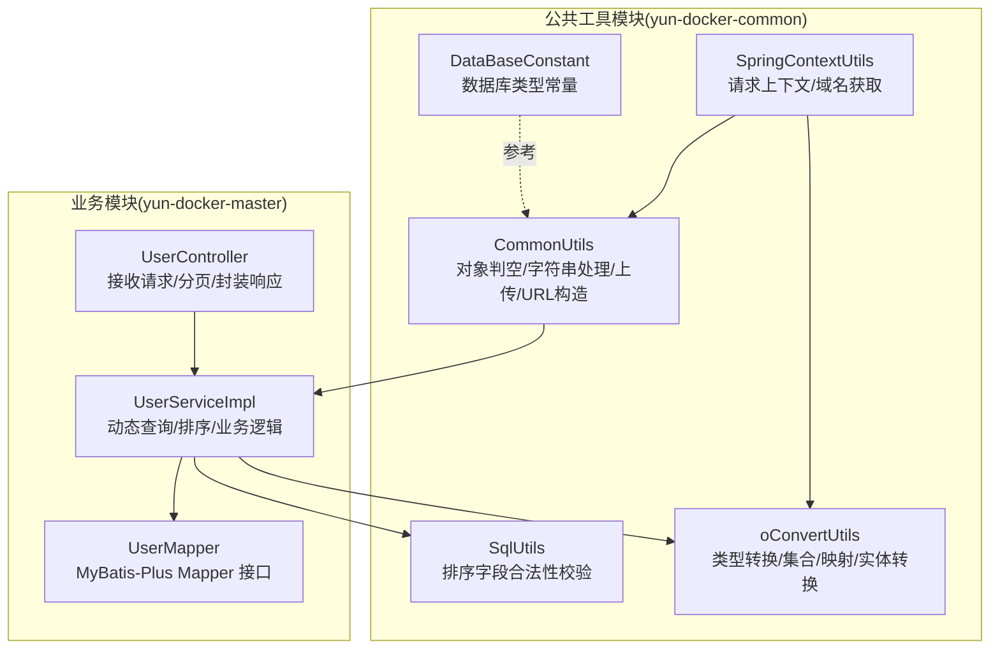
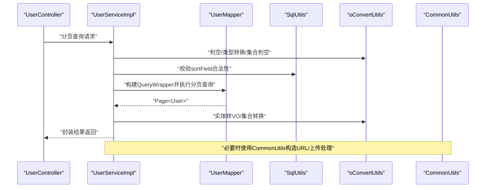
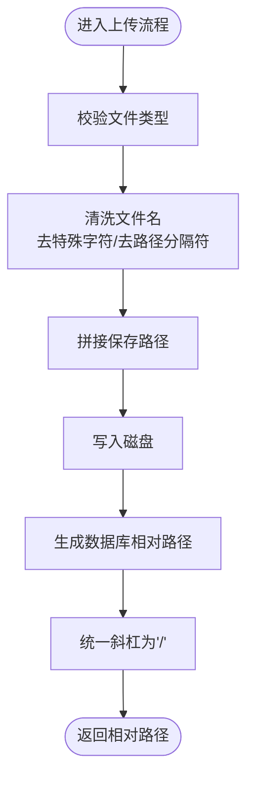
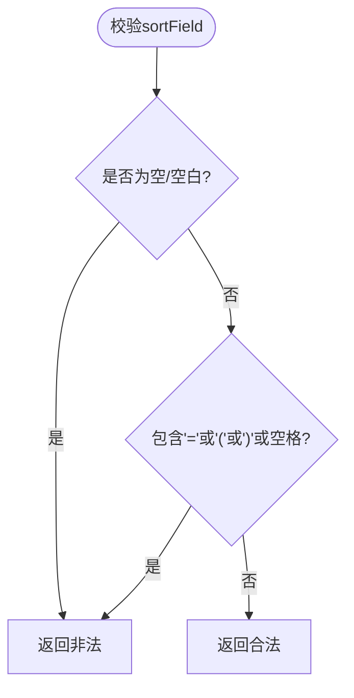
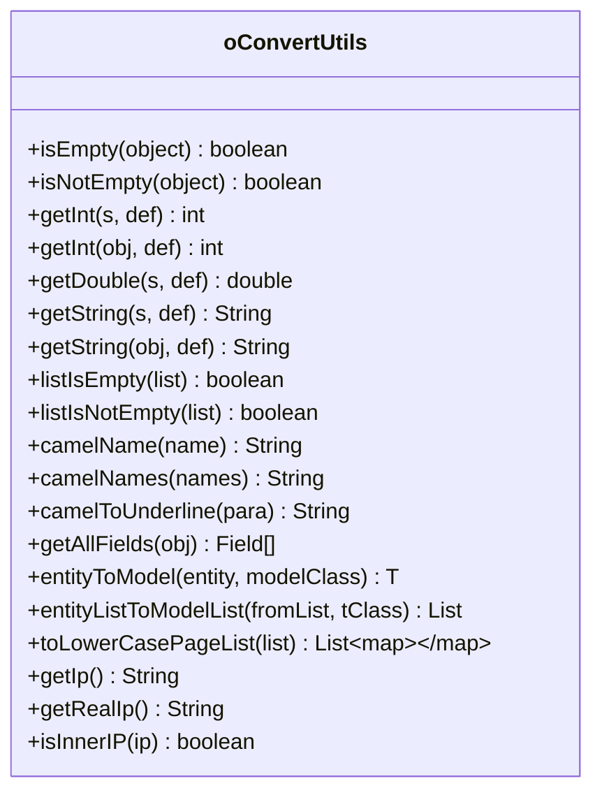
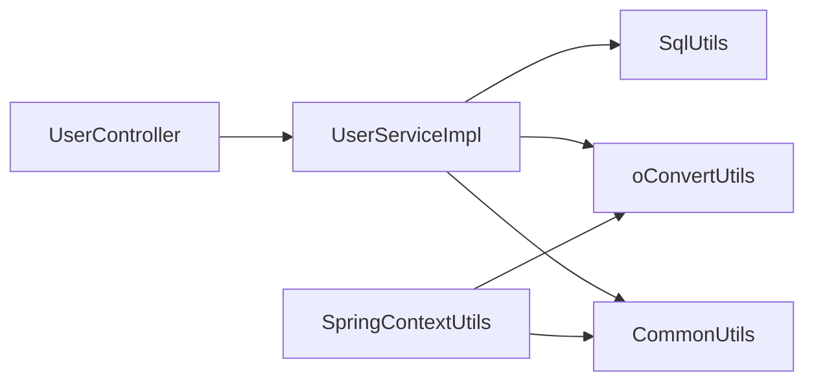

# 通用转换工具类

<cite>
**本文引用的文件**
- [CommonUtils.java](file://yun-docker-common/src/main/java/com/lfc/yundocker/common/util/CommonUtils.java)
- [SqlUtils.java](file://yun-docker-common/src/main/java/com/lfc/yundocker/common/util/SqlUtils.java)
- [oConvertUtils.java](file://yun-docker-common/src/main/java/com/lfc/yundocker/common/util/oConvertUtils.java)
- [UserServiceImpl.java](file://yun-docker-master/src/main/java/com/lfc/yundocker/service/impl/UserServiceImpl.java)
- [UserMapper.java](file://yun-docker-master/src/main/java/com/lfc/yundocker/mapper/UserMapper.java)
- [UserController.java](file://yun-docker-master/src/main/java/com/lfc/yundocker/controller/UserController.java)
- [SpringContextUtils.java](file://yun-docker-common/src/main/java/com/lfc/yundocker/common/util/SpringContextUtils.java)
- [DataBaseConstant.java](file://yun-docker-common/src/main/java/com/lfc/yundocker/common/constant/DataBaseConstant.java)
</cite>

## 目录
1. [简介](#简介)
2. [项目结构](#项目结构)
3. [核心组件](#核心组件)
4. [架构总览](#架构总览)
5. [详细组件分析](#详细组件分析)
6. [依赖关系分析](#依赖关系分析)
7. [性能考量](#性能考量)
8. [故障排查指南](#故障排查指南)
9. [结论](#结论)
10. [附录](#附录)

## 简介
本文件系统梳理并深入分析通用转换工具类在项目中的作用与实现，重点覆盖以下三个方面：
- CommonUtils：对象判空、集合操作、字符串拼接、基础文件上传与URL构造等便捷方法
- SqlUtils：安全校验排序字段，防止SQL注入，支持动态查询构建
- oConvertUtils：类型转换（字符串转整型/浮点/长整型、日期、BigDecimal等）、集合与映射处理、实体模型转换、判空与集合判空等

同时给出DAO层与Service层的实际调用案例，说明如何在动态查询条件组装、空值默认值填充等场景中高效使用这些工具，强调其在提升代码健壮性与开发效率方面的价值，并指出潜在的性能瓶颈（如频繁反射调用）。

## 项目结构
通用工具类位于公共模块，被业务模块广泛复用；Service层通过工具类进行参数校验与动态查询构建；Controller层负责接收请求并调用Service层。

图表来源
- [CommonUtils.java](file://yun-docker-common/src/main/java/com/lfc/yundocker/common/util/CommonUtils.java#L1-L297)
- [SqlUtils.java](file://yun-docker-common/src/main/java/com/lfc/yundocker/common/util/SqlUtils.java#L1-L25)
- [oConvertUtils.java](file://yun-docker-common/src/main/java/com/lfc/yundocker/common/util/oConvertUtils.java#L1-L668)
- [UserServiceImpl.java](file://yun-docker-master/src/main/java/com/lfc/yundocker/service/impl/UserServiceImpl.java#L1-L301)
- [UserMapper.java](file://yun-docker-master/src/main/java/com/lfc/yundocker/mapper/UserMapper.java#L1-L18)
- [UserController.java](file://yun-docker-master/src/main/java/com/lfc/yundocker/controller/UserController.java#L254-L290)
- [SpringContextUtils.java](file://yun-docker-common/src/main/java/com/lfc/yundocker/common/util/SpringContextUtils.java#L1-L108)
- [DataBaseConstant.java](file://yun-docker-common/src/main/java/com/lfc/yundocker/common/constant/DataBaseConstant.java#L1-L37)

章节来源
- [CommonUtils.java](file://yun-docker-common/src/main/java/com/lfc/yundocker/common/util/CommonUtils.java#L1-L297)
- [SqlUtils.java](file://yun-docker-common/src/main/java/com/lfc/yundocker/common/util/SqlUtils.java#L1-L25)
- [oConvertUtils.java](file://yun-docker-common/src/main/java/com/lfc/yundocker/common/util/oConvertUtils.java#L1-L668)
- [UserServiceImpl.java](file://yun-docker-master/src/main/java/com/lfc/yundocker/service/impl/UserServiceImpl.java#L1-L301)
- [UserMapper.java](file://yun-docker-master/src/main/java/com/lfc/yundocker/mapper/UserMapper.java#L1-L18)
- [UserController.java](file://yun-docker-master/src/main/java/com/lfc/yundocker/controller/UserController.java#L254-L290)
- [SpringContextUtils.java](file://yun-docker-common/src/main/java/com/lfc/yundocker/common/util/SpringContextUtils.java#L1-L108)
- [DataBaseConstant.java](file://yun-docker-common/src/main/java/com/lfc/yundocker/common/constant/DataBaseConstant.java#L1-L37)

## 核心组件
- CommonUtils：提供文件名清洗、中文检测、本地文件上传、统一上传入口、数据库类型获取占位、根据数据源键获取属性与连接占位、获取基础URL等能力
- SqlUtils：提供排序字段合法性校验，避免注入风险
- oConvertUtils：提供判空/非空、字符串与数值互转、IP解析、空白字符清理、数组/集合/映射处理、驼峰与下划线命名互转、反射获取字段、实体与模型转换、集合判空等

章节来源
- [CommonUtils.java](file://yun-docker-common/src/main/java/com/lfc/yundocker/common/util/CommonUtils.java#L1-L297)
- [SqlUtils.java](file://yun-docker-common/src/main/java/com/lfc/yundocker/common/util/SqlUtils.java#L1-L25)
- [oConvertUtils.java](file://yun-docker-common/src/main/java/com/lfc/yundocker/common/util/oConvertUtils.java#L1-L668)

## 架构总览
通用工具类贯穿Controller-Service-Mapper三层，典型流程如下：
- Controller接收请求参数，调用Service
- Service使用SqlUtils校验排序字段，使用oConvertUtils进行类型转换与判空，默认值填充，使用CommonUtils进行URL与上传相关处理
- Mapper执行持久化操作

图表来源
- [UserServiceImpl.java](file://yun-docker-master/src/main/java/com/lfc/yundocker/service/impl/UserServiceImpl.java#L276-L292)
- [SqlUtils.java](file://yun-docker-common/src/main/java/com/lfc/yundocker/common/util/SqlUtils.java#L1-L25)
- [oConvertUtils.java](file://yun-docker-common/src/main/java/com/lfc/yundocker/common/util/oConvertUtils.java#L1-L668)
- [CommonUtils.java](file://yun-docker-common/src/main/java/com/lfc/yundocker/common/util/CommonUtils.java#L267-L295)

## 详细组件分析

### CommonUtils 组件分析
- 对象判空与字符串处理
  - 提供文件名清洗与特殊字符过滤，确保上传文件名安全
  - 中文检测用于国际化或合规性判断
  - URL构造：兼容网关与SSL场景，自动适配scheme、host、port与contextPath
- 上传与存储
  - 本地上传：校验文件类型、重命名、写入磁盘、返回相对路径
  - 统一上传入口（占位），便于扩展MinIO/OSS等
- 数据库类型与数据源（占位）
  - 提供数据库类型枚举常量参考与数据源连接获取占位，便于后续扩展

图表来源
- [CommonUtils.java](file://yun-docker-common/src/main/java/com/lfc/yundocker/common/util/CommonUtils.java#L115-L144)

章节来源
- [CommonUtils.java](file://yun-docker-common/src/main/java/com/lfc/yundocker/common/util/CommonUtils.java#L63-L80)
- [CommonUtils.java](file://yun-docker-common/src/main/java/com/lfc/yundocker/common/util/CommonUtils.java#L115-L144)
- [CommonUtils.java](file://yun-docker-common/src/main/java/com/lfc/yundocker/common/util/CommonUtils.java#L267-L295)
- [DataBaseConstant.java](file://yun-docker-common/src/main/java/com/lfc/yundocker/common/constant/DataBaseConstant.java#L1-L37)

### SqlUtils 组件分析
- 核心职责：校验排序字段合法性，防止SQL注入
- 关键策略：
  - 空值判定
  - 排除包含等号、括号、空格等危险字符
- 在Service层的使用：结合MyBatis-Plus的QueryWrapper动态排序

图表来源
- [SqlUtils.java](file://yun-docker-common/src/main/java/com/lfc/yundocker/common/util/SqlUtils.java#L18-L23)
- [UserServiceImpl.java](file://yun-docker-master/src/main/java/com/lfc/yundocker/service/impl/UserServiceImpl.java#L286-L291)

章节来源
- [SqlUtils.java](file://yun-docker-common/src/main/java/com/lfc/yundocker/common/util/SqlUtils.java#L1-L25)
- [UserServiceImpl.java](file://yun-docker-master/src/main/java/com/lfc/yundocker/service/impl/UserServiceImpl.java#L276-L292)

### oConvertUtils 组件分析
- 判空与非空
  - isEmpty/isNotEmpty：统一处理null、空串、字符串"null"
- 类型转换
  - 整数/双精度/长整型：提供默认值兜底，避免抛出异常
  - BigDecimal转整型：安全降级
  - 字符串转基本类型：带异常捕获与默认值
- 字符串与集合
  - 去空白、数组/集合判空、Map键转小写
- 命名转换
  - 下划线转驼峰、驼峰转下划线（支持多字段批量）
- 反射与实体转换
  - 获取对象所有字段（含父类）
  - 实体与模型互相转换（基于BeanUtils）
- 网络与IP
  - 获取本机IP、真实外网IP、内网IP判断

图表来源
- [oConvertUtils.java](file://yun-docker-common/src/main/java/com/lfc/yundocker/common/util/oConvertUtils.java#L30-L667)

章节来源
- [oConvertUtils.java](file://yun-docker-common/src/main/java/com/lfc/yundocker/common/util/oConvertUtils.java#L30-L667)

## 依赖关系分析
- Service层对工具类的依赖
  - UserServiceImpl 使用 SqlUtils 校验排序字段，使用 oConvertUtils 进行判空与类型转换，使用 CommonUtils 构造URL
- Controller层对Service层的依赖
  - UserController 调用 UserService 的分页查询接口，间接复用上述工具能力
- 上下文工具对工具类的依赖
  - SpringContextUtils 使用 oConvertUtils 进行字符串判空与域名获取

图表来源
- [UserServiceImpl.java](file://yun-docker-master/src/main/java/com/lfc/yundocker/service/impl/UserServiceImpl.java#L276-L292)
- [UserController.java](file://yun-docker-master/src/main/java/com/lfc/yundocker/controller/UserController.java#L254-L290)
- [SpringContextUtils.java](file://yun-docker-common/src/main/java/com/lfc/yundocker/common/util/SpringContextUtils.java#L56-L69)

章节来源
- [UserServiceImpl.java](file://yun-docker-master/src/main/java/com/lfc/yundocker/service/impl/UserServiceImpl.java#L276-L292)
- [UserController.java](file://yun-docker-master/src/main/java/com/lfc/yundocker/controller/UserController.java#L254-L290)
- [SpringContextUtils.java](file://yun-docker-common/src/main/java/com/lfc/yundocker/common/util/SpringContextUtils.java#L56-L69)

## 性能考量
- 反射开销
  - oConvertUtils 提供 getAllFields 与实体/模型转换，涉及反射与Bean拷贝，建议在高频路径上缓存字段元数据或减少不必要的拷贝
- 字符串与正则
  - CommonUtils 的中文检测使用正则匹配，大量文本扫描可能带来CPU开销，建议在热点路径做预判或缓存
- 类型转换兜底
  - oConvertUtils 的类型转换均提供默认值，避免异常传播，但频繁的字符串解析仍需注意GC压力
- 排序字段校验
  - SqlUtils 的校验逻辑简单快速，属于O(n)扫描，影响极小

[本节为通用性能讨论，不直接分析具体文件]

## 故障排查指南
- 排序字段导致SQL异常
  - 症状：动态排序报错或异常
  - 排查：确认sortField是否通过 SqlUtils.validSortField 校验
  - 参考位置：[UserServiceImpl.java](file://yun-docker-master/src/main/java/com/lfc/yundocker/service/impl/UserServiceImpl.java#L286-L291)
- 上传文件名异常或路径不一致
  - 症状：文件名包含路径分隔符或特殊字符，返回路径包含反斜杠
  - 排查：确认 CommonUtils.getFileName 与上传路径拼接逻辑
  - 参考位置：[CommonUtils.java](file://yun-docker-common/src/main/java/com/lfc/yundocker/common/util/CommonUtils.java#L63-L80)，[CommonUtils.java](file://yun-docker-common/src/main/java/com/lfc/yundocker/common/util/CommonUtils.java#L134-L144)
- 域名/协议不正确
  - 症状：生成的URL缺少HTTPS或端口不正确
  - 排查：确认 CommonUtils.getBaseUrl 与 SpringContextUtils.getDomain 的兼容性
  - 参考位置：[CommonUtils.java](file://yun-docker-common/src/main/java/com/lfc/yundocker/common/util/CommonUtils.java#L267-L295)，[SpringContextUtils.java](file://yun-docker-common/src/main/java/com/lfc/yundocker/common/util/SpringContextUtils.java#L56-L69)
- 类型转换异常或默认值不符合预期
  - 症状：整数/浮点转换失败返回默认值
  - 排查：核对 oConvertUtils 的getInt/getDouble/getString等方法的默认值策略
  - 参考位置：[oConvertUtils.java](file://yun-docker-common/src/main/java/com/lfc/yundocker/common/util/oConvertUtils.java#L85-L116)，[oConvertUtils.java](file://yun-docker-common/src/main/java/com/lfc/yundocker/common/util/oConvertUtils.java#L130-L146)，[oConvertUtils.java](file://yun-docker-common/src/main/java/com/lfc/yundocker/common/util/oConvertUtils.java#L198-L238)

章节来源
- [UserServiceImpl.java](file://yun-docker-master/src/main/java/com/lfc/yundocker/service/impl/UserServiceImpl.java#L276-L292)
- [CommonUtils.java](file://yun-docker-common/src/main/java/com/lfc/yundocker/common/util/CommonUtils.java#L63-L80)
- [CommonUtils.java](file://yun-docker-common/src/main/java/com/lfc/yundocker/common/util/CommonUtils.java#L134-L144)
- [CommonUtils.java](file://yun-docker-common/src/main/java/com/lfc/yundocker/common/util/CommonUtils.java#L267-L295)
- [SpringContextUtils.java](file://yun-docker-common/src/main/java/com/lfc/yundocker/common/util/SpringContextUtils.java#L56-L69)
- [oConvertUtils.java](file://yun-docker-common/src/main/java/com/lfc/yundocker/common/util/oConvertUtils.java#L85-L116)
- [oConvertUtils.java](file://yun-docker-common/src/main/java/com/lfc/yundocker/common/util/oConvertUtils.java#L130-L146)
- [oConvertUtils.java](file://yun-docker-common/src/main/java/com/lfc/yundocker/common/util/oConvertUtils.java#L198-L238)

## 结论
- CommonUtils、SqlUtils、oConvertUtils三者协同，分别承担“字符串/上传/URL”、“安全排序字段”、“类型转换/集合/实体转换”的职责，显著提升了代码的健壮性与开发效率
- 在DAO层与Service层的实际应用中，动态查询条件组装、空值默认值填充、排序字段安全校验等场景均可通过这些工具类实现简洁可靠的实现
- 需要关注的潜在性能瓶颈在于频繁反射调用与字符串解析，建议在热点路径进行优化与缓存

[本节为总结性内容，不直接分析具体文件]

## 附录

### 实际调用案例（DAO/Service）
- 动态查询条件组装与排序安全
  - Service层根据请求参数动态拼装QueryWrapper，并使用 SqlUtils 校验sortField，再调用Mapper执行分页查询
  - 参考位置：[UserServiceImpl.java](file://yun-docker-master/src/main/java/com/lfc/yundocker/service/impl/UserServiceImpl.java#L276-L292)，[UserMapper.java](file://yun-docker-master/src/main/java/com/lfc/yundocker/mapper/UserMapper.java#L1-L18)
- 空值默认值填充
  - 使用 oConvertUtils 的判空与类型转换方法，避免空指针与格式异常
  - 参考位置：[oConvertUtils.java](file://yun-docker-common/src/main/java/com/lfc/yundocker/common/util/oConvertUtils.java#L30-L667)
- URL与上传处理
  - 使用 CommonUtils 构造基础URL与本地上传路径，确保跨环境兼容
  - 参考位置：[CommonUtils.java](file://yun-docker-common/src/main/java/com/lfc/yundocker/common/util/CommonUtils.java#L267-L295)，[CommonUtils.java](file://yun-docker-common/src/main/java/com/lfc/yundocker/common/util/CommonUtils.java#L115-L144)
- 控制器调用
  - Controller 层接收分页请求，调用Service完成查询并返回封装结果
  - 参考位置：[UserController.java](file://yun-docker-master/src/main/java/com/lfc/yundocker/controller/UserController.java#L254-L290)

章节来源
- [UserServiceImpl.java](file://yun-docker-master/src/main/java/com/lfc/yundocker/service/impl/UserServiceImpl.java#L276-L292)
- [UserMapper.java](file://yun-docker-master/src/main/java/com/lfc/yundocker/mapper/UserMapper.java#L1-L18)
- [UserController.java](file://yun-docker-master/src/main/java/com/lfc/yundocker/controller/UserController.java#L254-L290)
- [CommonUtils.java](file://yun-docker-common/src/main/java/com/lfc/yundocker/common/util/CommonUtils.java#L115-L144)
- [CommonUtils.java](file://yun-docker-common/src/main/java/com/lfc/yundocker/common/util/CommonUtils.java#L267-L295)
- [oConvertUtils.java](file://yun-docker-common/src/main/java/com/lfc/yundocker/common/util/oConvertUtils.java#L30-L667)