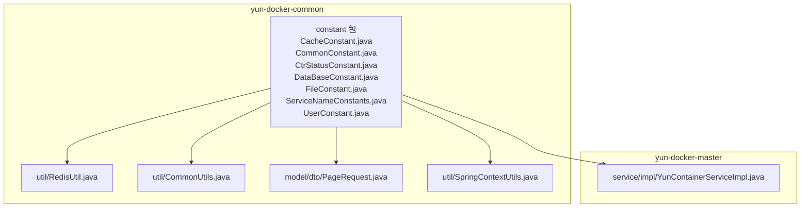
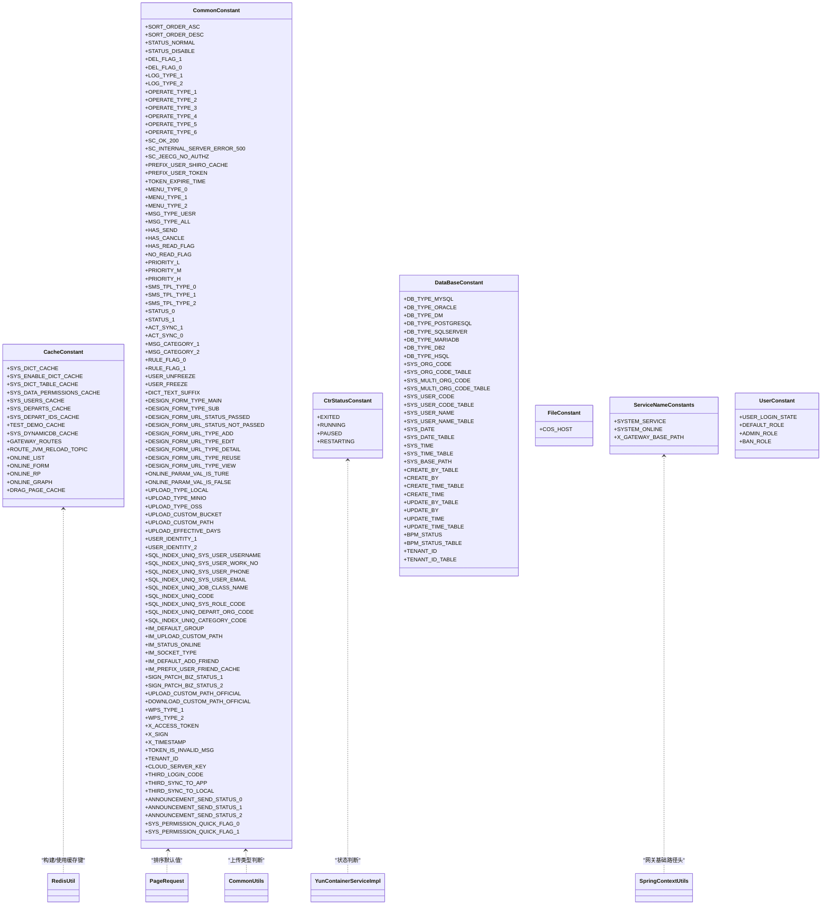
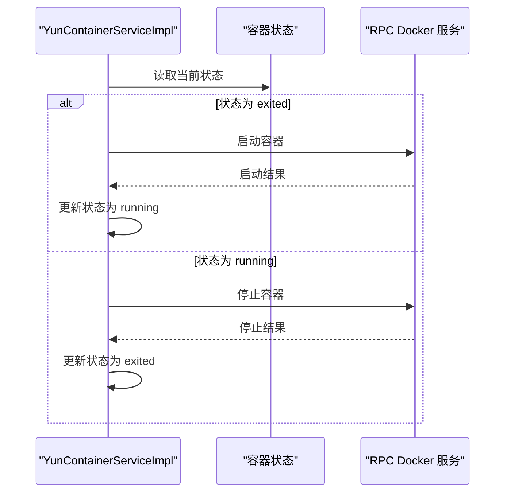
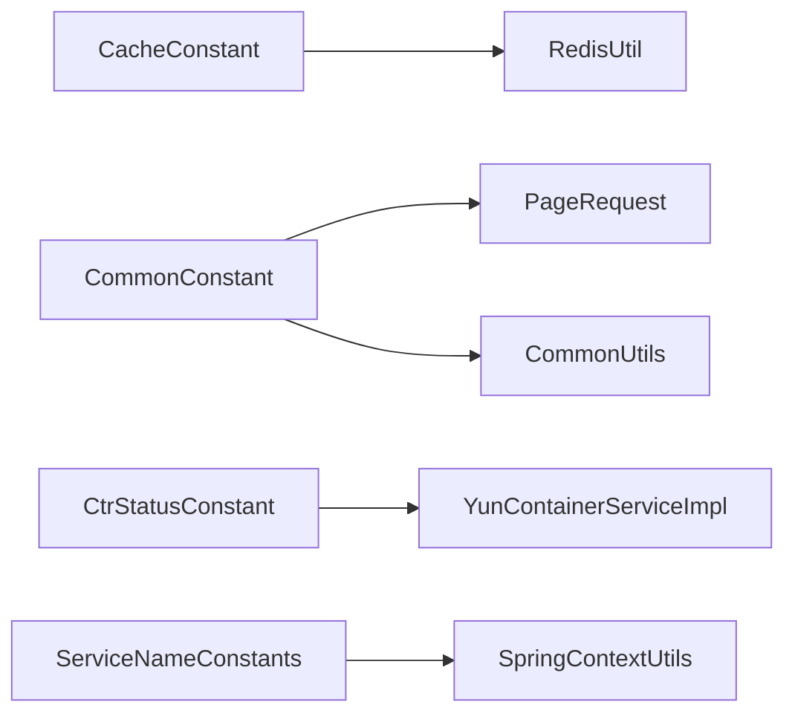

# 常量定义

<cite>
**本文引用的文件**
- [CacheConstant.java](file://yun-docker-common/src/main/java/com/lfc/yundocker/common/constant/CacheConstant.java)
- [CommonConstant.java](file://yun-docker-common/src/main/java/com/lfc/yundocker/common/constant/CommonConstant.java)
- [CtrStatusConstant.java](file://yun-docker-common/src/main/java/com/lfc/yundocker/common/constant/CtrStatusConstant.java)
- [DataBaseConstant.java](file://yun-docker-common/src/main/java/com/lfc/yundocker/common/constant/DataBaseConstant.java)
- [FileConstant.java](file://yun-docker-common/src/main/java/com/lfc/yundocker/common/constant/FileConstant.java)
- [ServiceNameConstants.java](file://yun-docker-common/src/main/java/com/lfc/yundocker/common/constant/ServiceNameConstants.java)
- [UserConstant.java](file://yun-docker-common/src/main/java/com/lfc/yundocker/common/constant/UserConstant.java)
- [YunContainerServiceImpl.java](file://yun-docker-master/src/main/java/com/lfc/yundocker/service/impl/YunContainerServiceImpl.java)
- [RedisUtil.java](file://yun-docker-common/src/main/java/com/lfc/yundocker/common/util/RedisUtil.java)
- [CommonUtils.java](file://yun-docker-common/src/main/java/com/lfc/yundocker/common/util/CommonUtils.java)
- [PageRequest.java](file://yun-docker-common/src/main/java/com/lfc/yundocker/common/model/dto/PageRequest.java)
- [SpringContextUtils.java](file://yun-docker-common/src/main/java/com/lfc/yundocker/common/util/SpringContextUtils.java)
</cite>

## 目录
1. [简介](#简介)
2. [项目结构](#项目结构)
3. [核心组件](#核心组件)
4. [架构总览](#架构总览)
5. [详细组件分析](#详细组件分析)
6. [依赖关系分析](#依赖关系分析)
7. [性能考量](#性能考量)
8. [故障排查指南](#故障排查指南)
9. [结论](#结论)
10. [附录](#附录)

## 简介
本文件系统化梳理 yun-docker-common 模块中 constant 包下的全部常量类，围绕以下主题展开：
- CacheConstant：缓存键命名规范与过期策略配置
- CommonConstant：通用状态码与系统开关、排序、日志、菜单类型、消息分类、上传类型、索引键等
- CtrStatusConstant：容器生命周期状态枚举映射
- DataBaseConstant：数据库字段默认值与索引策略
- FileConstant：文件上传路径与类型限制配置
- ServiceNameConstants：Dubbo 服务注册命名约定
- UserConstant：用户默认头像、角色标识等业务常量

同时结合实际使用场景，如在 YunContainerServiceImpl 中引用 CtrStatusConstant 判断容器状态流转，或在 RedisUtil 中通过 CacheConstant 构建缓存 key，给出最佳实践建议，避免硬编码，提升代码可维护性。

## 项目结构
constant 包位于公共模块 yun-docker-common 下，作为跨模块共享的常量定义中心，供业务层、工具层、控制器层广泛引用。

**图示来源**
- [CacheConstant.java](file://yun-docker-common/src/main/java/com/lfc/yundocker/common/constant/CacheConstant.java#L1-L105)
- [CommonConstant.java](file://yun-docker-common/src/main/java/com/lfc/yundocker/common/constant/CommonConstant.java#L1-L364)
- [CtrStatusConstant.java](file://yun-docker-common/src/main/java/com/lfc/yundocker/common/constant/CtrStatusConstant.java#L1-L30)
- [DataBaseConstant.java](file://yun-docker-common/src/main/java/com/lfc/yundocker/common/constant/DataBaseConstant.java#L1-L137)
- [FileConstant.java](file://yun-docker-common/src/main/java/com/lfc/yundocker/common/constant/FileConstant.java#L1-L16)
- [ServiceNameConstants.java](file://yun-docker-common/src/main/java/com/lfc/yundocker/common/constant/ServiceNameConstants.java#L1-L40)
- [UserConstant.java](file://yun-docker-common/src/main/java/com/lfc/yundocker/common/constant/UserConstant.java#L1-L34)
- [YunContainerServiceImpl.java](file://yun-docker-master/src/main/java/com/lfc/yundocker/service/impl/YunContainerServiceImpl.java#L1-L294)
- [RedisUtil.java](file://yun-docker-common/src/main/java/com/lfc/yundocker/common/util/RedisUtil.java#L1-L200)
- [CommonUtils.java](file://yun-docker-common/src/main/java/com/lfc/yundocker/common/util/CommonUtils.java#L1-L250)
- [PageRequest.java](file://yun-docker-common/src/main/java/com/lfc/yundocker/common/model/dto/PageRequest.java#L1-L34)
- [SpringContextUtils.java](file://yun-docker-common/src/main/java/com/lfc/yundocker/common/util/SpringContextUtils.java#L1-L120)

**章节来源**
- [CacheConstant.java](file://yun-docker-common/src/main/java/com/lfc/yundocker/common/constant/CacheConstant.java#L1-L105)
- [CommonConstant.java](file://yun-docker-common/src/main/java/com/lfc/yundocker/common/constant/CommonConstant.java#L1-L364)
- [CtrStatusConstant.java](file://yun-docker-common/src/main/java/com/lfc/yundocker/common/constant/CtrStatusConstant.java#L1-L30)
- [DataBaseConstant.java](file://yun-docker-common/src/main/java/com/lfc/yundocker/common/constant/DataBaseConstant.java#L1-L137)
- [FileConstant.java](file://yun-docker-common/src/main/java/com/lfc/yundocker/common/constant/FileConstant.java#L1-L16)
- [ServiceNameConstants.java](file://yun-docker-common/src/main/java/com/lfc/yundocker/common/constant/ServiceNameConstants.java#L1-L40)
- [UserConstant.java](file://yun-docker-common/src/main/java/com/lfc/yundocker/common/constant/UserConstant.java#L1-L34)

## 核心组件
- CacheConstant：集中定义各类缓存键，采用层级化命名空间，便于统一管理与清理。
- CommonConstant：涵盖排序、状态、日志、菜单类型、消息分类、上传类型、索引键、请求头、多租户标识等通用常量。
- CtrStatusConstant：容器生命周期状态枚举映射，用于状态判断与流转控制。
- DataBaseConstant：数据库上下文变量、标准字段名、业务流程状态、租户字段等。
- FileConstant：文件上传相关常量，如访问地址等。
- ServiceNameConstants：Dubbo 服务命名与网关传递的基础路径头。
- UserConstant：用户登录态键、默认角色、管理员角色、封号角色等。

**章节来源**
- [CacheConstant.java](file://yun-docker-common/src/main/java/com/lfc/yundocker/common/constant/CacheConstant.java#L1-L105)
- [CommonConstant.java](file://yun-docker-common/src/main/java/com/lfc/yundocker/common/constant/CommonConstant.java#L1-L364)
- [CtrStatusConstant.java](file://yun-docker-common/src/main/java/com/lfc/yundocker/common/constant/CtrStatusConstant.java#L1-L30)
- [DataBaseConstant.java](file://yun-docker-common/src/main/java/com/lfc/yundocker/common/constant/DataBaseConstant.java#L1-L137)
- [FileConstant.java](file://yun-docker-common/src/main/java/com/lfc/yundocker/common/constant/FileConstant.java#L1-L16)
- [ServiceNameConstants.java](file://yun-docker-common/src/main/java/com/lfc/yundocker/common/constant/ServiceNameConstants.java#L1-L40)
- [UserConstant.java](file://yun-docker-common/src/main/java/com/lfc/yundocker/common/constant/UserConstant.java#L1-L34)

## 架构总览
下图展示常量类之间的关系以及与业务/工具类的交互。

**图示来源**
- [CacheConstant.java](file://yun-docker-common/src/main/java/com/lfc/yundocker/common/constant/CacheConstant.java#L1-L105)
- [CommonConstant.java](file://yun-docker-common/src/main/java/com/lfc/yundocker/common/constant/CommonConstant.java#L1-L364)
- [CtrStatusConstant.java](file://yun-docker-common/src/main/java/com/lfc/yundocker/common/constant/CtrStatusConstant.java#L1-L30)
- [DataBaseConstant.java](file://yun-docker-common/src/main/java/com/lfc/yundocker/common/constant/DataBaseConstant.java#L1-L137)
- [FileConstant.java](file://yun-docker-common/src/main/java/com/lfc/yundocker/common/constant/FileConstant.java#L1-L16)
- [ServiceNameConstants.java](file://yun-docker-common/src/main/java/com/lfc/yundocker/common/constant/ServiceNameConstants.java#L1-L40)
- [UserConstant.java](file://yun-docker-common/src/main/java/com/lfc/yundocker/common/constant/UserConstant.java#L1-L34)
- [RedisUtil.java](file://yun-docker-common/src/main/java/com/lfc/yundocker/common/util/RedisUtil.java#L1-L200)
- [CommonUtils.java](file://yun-docker-common/src/main/java/com/lfc/yundocker/common/util/CommonUtils.java#L1-L250)
- [PageRequest.java](file://yun-docker-common/src/main/java/com/lfc/yundocker/common/model/dto/PageRequest.java#L1-L34)
- [YunContainerServiceImpl.java](file://yun-docker-master/src/main/java/com/lfc/yundocker/service/impl/YunContainerServiceImpl.java#L1-L294)
- [SpringContextUtils.java](file://yun-docker-common/src/main/java/com/lfc/yundocker/common/util/SpringContextUtils.java#L1-L120)

## 详细组件分析

### CacheConstant：缓存键命名规范与过期策略
- 命名规范
  - 采用冒号分隔的层级命名，如“sys:cache:dict”、“sys:cache:online:list”，清晰表达业务域与用途。
  - 特殊场景使用前缀区分，如“gateway_jvm_route_reload_topic”用于路由刷新。
- 过期策略
  - 常量本身不直接定义过期时间；过期策略由使用方在 RedisUtil 中按需设置。
  - 建议：对高频读取且实时性要求不高的缓存键（如在线表单、报表、图表）设置合理 TTL；对用户会话、权限等敏感缓存设置较短 TTL 并配合刷新机制。
- 清理与维护
  - 提供统一的缓存键集合，便于批量清理或灰度切换。
  - 对冗余键（如待删除注释标记的插件商城排行榜）应定期审计并清理。

**章节来源**
- [CacheConstant.java](file://yun-docker-common/src/main/java/com/lfc/yundocker/common/constant/CacheConstant.java#L1-L105)
- [RedisUtil.java](file://yun-docker-common/src/main/java/com/lfc/yundocker/common/util/RedisUtil.java#L1-L200)

### CommonConstant：通用状态码与系统开关
- 状态与删除标志
  - 正常/禁用、删除/未删等整型常量，便于数据库条件查询与逻辑判断。
- 日志与操作类型
  - 登录与操作日志类型、查询/添加/更新/删除/导入/导出等操作类型，统一编码便于审计与统计。
- HTTP 状态码
  - 统一返回码常量，避免魔法数字，提升可读性与一致性。
- 排序与菜单类型
  - 升序/降序字符串常量；菜单类型（一级/子菜单/按钮权限），便于前端渲染与权限控制。
- 消息与优先级
  - 通告对象类型（指定用户/全体用户）、发布状态（未发布/已发布/已撤销）、阅读状态、优先级（低/中/高）。
- 短信模板类型
  - 登录、注册、忘记密码模板类型，便于短信模板选择。
- 表单设计器与 Online 参数
  - 主/子表类型、URL 授权状态、Flag 类型（新增/编辑/详情/复用/视图），Online 参数 Y/N。
- 文件上传类型与路径
  - 本地/Minio/OSS 三种上传类型；自定义桶名、路径、外链有效期天数。
- 数据库索引键
  - sys_user、sys_quartz_job、sys_position、sys_role、sys_depart、sys_category 等唯一索引键名，便于异常处理与提示。
- IM（即时通讯）相关
  - 默认分组、图片保存路径、在线状态、Socket 消息类型、默认加好友开关、用户好友缓存前缀。
- 考勤补卡业务状态
  - 同意/不同意状态。
- WPS 存储值类别
  - code 文号与 text（模板）两类。
- 请求头与多租户
  - X-Access-Token、X-Sign、X-TIMESTAMP、Token 失效提示、多租户标识 tenant-id。
- 配置读取与第三方同步方向
  - Nacos 服务地址键、第三方登录操作码、同步方向（本地↔第三方）。
- 系统通告消息状态与快捷操作标志
  - 发布状态三态、菜单权限快捷操作标志。

**章节来源**
- [CommonConstant.java](file://yun-docker-common/src/main/java/com/lfc/yundocker/common/constant/CommonConstant.java#L1-L364)
- [PageRequest.java](file://yun-docker-common/src/main/java/com/lfc/yundocker/common/model/dto/PageRequest.java#L1-L34)
- [CommonUtils.java](file://yun-docker-common/src/main/java/com/lfc/yundocker/common/util/CommonUtils.java#L1-L250)

### CtrStatusConstant：容器生命周期状态枚举映射
- 状态枚举
  - exited（已结束）、running（运行中）、paused（暂停中）、restarting（重启中）。
- 使用场景
  - 在 YunContainerServiceImpl 中根据当前状态判断执行 start/stop/restart/remove 等操作，并更新数据库状态。

**图示来源**
- [YunContainerServiceImpl.java](file://yun-docker-master/src/main/java/com/lfc/yundocker/service/impl/YunContainerServiceImpl.java#L108-L134)
- [CtrStatusConstant.java](file://yun-docker-common/src/main/java/com/lfc/yundocker/common/constant/CtrStatusConstant.java#L1-L30)

**章节来源**
- [YunContainerServiceImpl.java](file://yun-docker-master/src/main/java/com/lfc/yundocker/service/impl/YunContainerServiceImpl.java#L108-L134)
- [CtrStatusConstant.java](file://yun-docker-common/src/main/java/com/lfc/yundocker/common/constant/CtrStatusConstant.java#L1-L30)

### DataBaseConstant：数据库字段默认值与索引策略
- 数据库类型
  - MYSQL、ORACLE、DM（达梦）、POSTGRESQL、SQLSERVER、MARIADB、DB2、HSQL 等。
- 系统上下文变量
  - 机构编码、多机构编码、系统用户编码、真实姓名、系统日期、系统时间、基础路径等。
- 标准字段
  - create_by/create_time/update_by/update_time/bpm_status 及其数据库字段名，统一建模。
- 租户字段
  - 实体字段名与数据库字段名，便于多租户隔离。
- 索引策略
  - 通过统一的索引键名常量，便于在异常处理中识别唯一性约束冲突，快速定位问题。

**章节来源**
- [DataBaseConstant.java](file://yun-docker-common/src/main/java/com/lfc/yundocker/common/constant/DataBaseConstant.java#L1-L137)
- [CommonUtils.java](file://yun-docker-common/src/main/java/com/lfc/yundocker/common/util/CommonUtils.java#L226-L250)

### FileConstant：文件上传路径与类型限制
- 文件上传路径
  - COS 访问地址（当前为占位地址，需替换为实际配置）。
- 类型限制
  - 上传类型（本地/Minio/OSS）与自定义桶名、路径、外链有效期天数等。

**章节来源**
- [FileConstant.java](file://yun-docker-common/src/main/java/com/lfc/yundocker/common/constant/FileConstant.java#L1-L16)
- [CommonConstant.java](file://yun-docker-common/src/main/java/com/lfc/yundocker/common/constant/CommonConstant.java#L224-L242)

### ServiceNameConstants：Dubbo 服务注册命名约定
- 服务名称
  - 系统管理服务与在线服务名称。
- 网关头
  - X_GATEWAY_BASE_PATH：用于网关传递 basePath，便于下游服务统一处理资源路径。

**章节来源**
- [ServiceNameConstants.java](file://yun-docker-common/src/main/java/com/lfc/yundocker/common/constant/ServiceNameConstants.java#L1-L40)
- [SpringContextUtils.java](file://yun-docker-common/src/main/java/com/lfc/yundocker/common/util/SpringContextUtils.java#L60-L66)

### UserConstant：用户默认头像、角色标识等业务常量
- 登录态键
  - user_login：用于标识用户登录态。
- 角色标识
  - 默认角色 user、管理员角色 admin、封号角色 ban。
- 最佳实践
  - 角色常量集中管理，避免散落字符串；登录态键统一命名，便于会话管理。

**章节来源**
- [UserConstant.java](file://yun-docker-common/src/main/java/com/lfc/yundocker/common/constant/UserConstant.java#L1-L34)

## 依赖关系分析
- 常量类之间无直接依赖，均以接口形式暴露静态常量，耦合度低。
- 业务/工具类通过 import 常量类进行引用，形成松耦合的共享常量体系。
- 关键依赖链路
  - RedisUtil 与 CacheConstant：构建/使用缓存键
  - CommonConstant 与 PageRequest：排序默认值
  - CommonConstant 与 CommonUtils：上传类型判断
  - CtrStatusConstant 与 YunContainerServiceImpl：状态判断
  - ServiceNameConstants 与 SpringContextUtils：网关基础路径头

**图示来源**
- [RedisUtil.java](file://yun-docker-common/src/main/java/com/lfc/yundocker/common/util/RedisUtil.java#L1-L200)
- [PageRequest.java](file://yun-docker-common/src/main/java/com/lfc/yundocker/common/model/dto/PageRequest.java#L1-L34)
- [CommonUtils.java](file://yun-docker-common/src/main/java/com/lfc/yundocker/common/util/CommonUtils.java#L1-L250)
- [YunContainerServiceImpl.java](file://yun-docker-master/src/main/java/com/lfc/yundocker/service/impl/YunContainerServiceImpl.java#L108-L134)
- [ServiceNameConstants.java](file://yun-docker-common/src/main/java/com/lfc/yundocker/common/constant/ServiceNameConstants.java#L1-L40)
- [SpringContextUtils.java](file://yun-docker-common/src/main/java/com/lfc/yundocker/common/util/SpringContextUtils.java#L60-L66)

**章节来源**
- [RedisUtil.java](file://yun-docker-common/src/main/java/com/lfc/yundocker/common/util/RedisUtil.java#L1-L200)
- [PageRequest.java](file://yun-docker-common/src/main/java/com/lfc/yundocker/common/model/dto/PageRequest.java#L1-L34)
- [CommonUtils.java](file://yun-docker-common/src/main/java/com/lfc/yundocker/common/util/CommonUtils.java#L1-L250)
- [YunContainerServiceImpl.java](file://yun-docker-master/src/main/java/com/lfc/yundocker/service/impl/YunContainerServiceImpl.java#L108-L134)
- [ServiceNameConstants.java](file://yun-docker-common/src/main/java/com/lfc/yundocker/common/constant/ServiceNameConstants.java#L1-L40)
- [SpringContextUtils.java](file://yun-docker-common/src/main/java/com/lfc/yundocker/common/util/SpringContextUtils.java#L60-L66)

## 性能考量
- 缓存键命名与过期策略
  - 使用 CacheConstant 统一命名，避免分散的字符串拼接导致的维护成本与性能隐患。
  - 对热点数据设置合理的 TTL，避免缓存雪崩与击穿；对敏感数据设置较短 TTL 并配合预热。
- 上传类型与路径
  - 通过 CommonConstant 的上传类型常量统一判断，减少分支判断开销；路径与桶名集中管理，降低错误率。
- 数据库索引与唯一性约束
  - 使用 DataBaseConstant 的索引键常量，便于在异常处理中快速定位唯一性约束冲突，减少排查时间。

[本节为通用指导，无需列出具体文件来源]

## 故障排查指南
- 容器状态流转异常
  - 检查 YunContainerServiceImpl 中的状态判断逻辑与 CtrStatusConstant 的映射是否一致。
  - 确认 RPC Docker 服务返回结果与数据库状态更新是否同步。
- 缓存命中率低或过期异常
  - 核对 RedisUtil 中的过期时间设置与 CacheConstant 的键命名是否匹配。
  - 对高频读取的在线表单/报表/图表键设置合理 TTL，并监控缓存命中率。
- 上传失败或路径错误
  - 检查 CommonConstant 的上传类型与路径常量是否正确；确认文件过滤器与保存路径创建逻辑。
- 网关路径解析错误
  - 检查 ServiceNameConstants 的 X_GATEWAY_BASE_PATH 是否正确传递至下游服务。

**章节来源**
- [YunContainerServiceImpl.java](file://yun-docker-master/src/main/java/com/lfc/yundocker/service/impl/YunContainerServiceImpl.java#L108-L134)
- [RedisUtil.java](file://yun-docker-common/src/main/java/com/lfc/yundocker/common/util/RedisUtil.java#L1-L200)
- [CommonConstant.java](file://yun-docker-common/src/main/java/com/lfc/yundocker/common/constant/CommonConstant.java#L224-L242)
- [ServiceNameConstants.java](file://yun-docker-common/src/main/java/com/lfc/yundocker/common/constant/ServiceNameConstants.java#L1-L40)

## 结论
constant 包通过接口化常量定义，实现了跨模块共享与低耦合的常量管理。结合实际使用场景（容器状态流转、缓存键构建、上传类型判断、网关路径传递），建议：
- 统一使用常量类，避免硬编码；
- 明确缓存键命名规范与过期策略；
- 将业务常量集中管理，提升可维护性与一致性；
- 对关键流程（容器状态、缓存、上传、网关）建立监控与告警机制。

[本节为总结，无需列出具体文件来源]

## 附录
- 最佳实践清单
  - 使用 CacheConstant 构建缓存键，避免字符串拼接；
  - 使用 CommonConstant 的排序、状态、日志、菜单类型、消息分类、上传类型等常量；
  - 在容器服务中使用 CtrStatusConstant 进行状态判断与流转；
  - 在工具类中使用 DataBaseConstant 的数据库类型与字段名常量；
  - 在网关与 Dubbo 服务间使用 ServiceNameConstants 的服务名与网关头；
  - 在用户相关逻辑中使用 UserConstant 的登录态键与角色标识。

[本节为补充说明，无需列出具体文件来源]