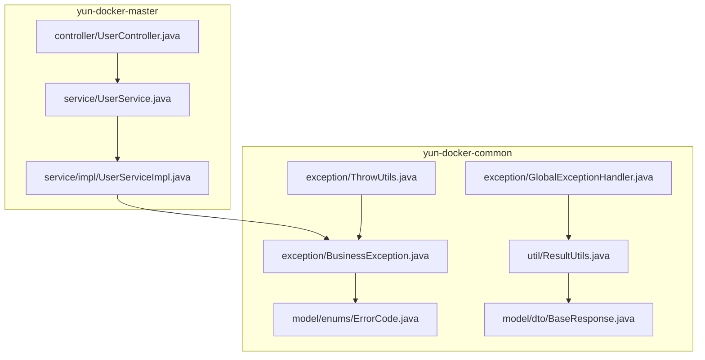
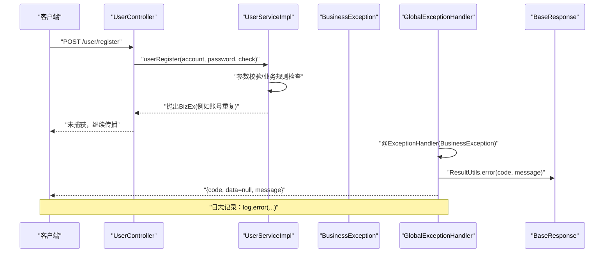
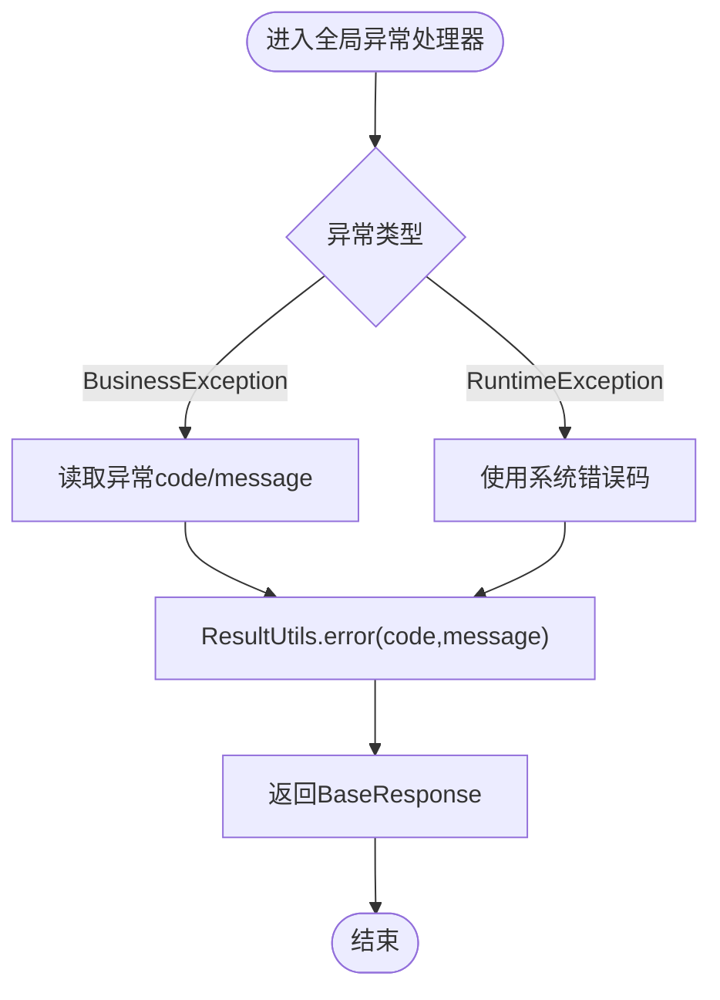
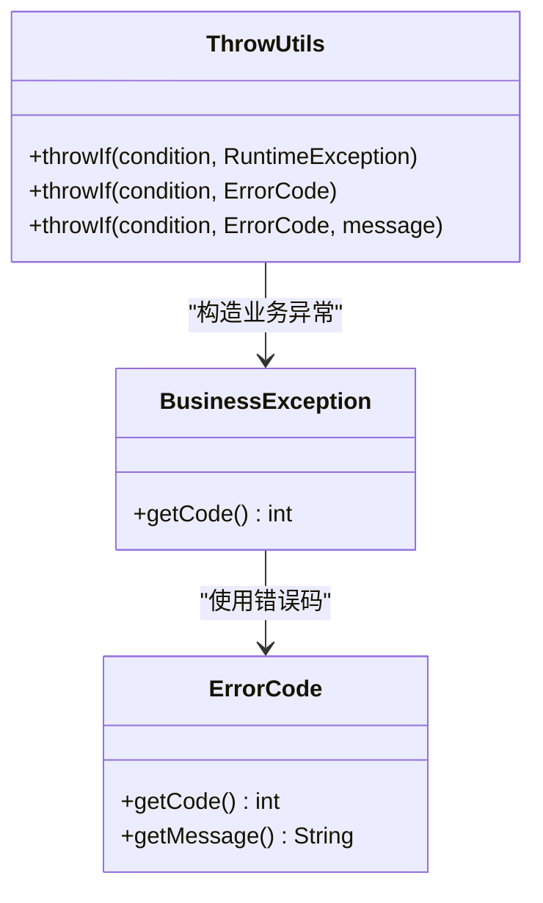
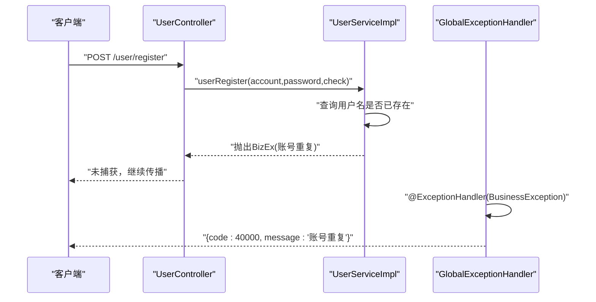
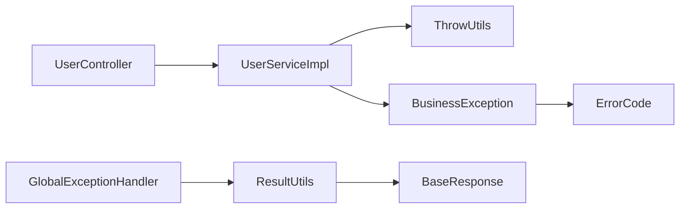

# 异常处理机制

<cite>
**本文引用的文件**
- [BusinessException.java](file://yun-docker-common/src/main/java/com/lfc/yundocker/common/exception/BusinessException.java)
- [GlobalExceptionHandler.java](file://yun-docker-common/src/main/java/com/lfc/yundocker/common/exception/GlobalExceptionHandler.java)
- [ThrowUtils.java](file://yun-docker-common/src/main/java/com/lfc/yundocker/common/exception/ThrowUtils.java)
- [ErrorCode.java](file://yun-docker-common/src/main/java/com/lfc/yundocker/common/model/enums/ErrorCode.java)
- [ResultUtils.java](file://yun-docker-common/src/main/java/com/lfc/yundocker/common/util/ResultUtils.java)
- [BaseResponse.java](file://yun-docker-common/src/main/java/com/lfc/yundocker/common/model/dto/BaseResponse.java)
- [UserService.java](file://yun-docker-master/src/main/java/com/lfc/yundocker/service/UserService.java)
- [UserServiceImpl.java](file://yun-docker-master/src/main/java/com/lfc/yundocker/service/impl/UserServiceImpl.java)
- [UserController.java](file://yun-docker-master/src/main/java/com/lfc/yundocker/controller/UserController.java)
</cite>

## 目录
1. [简介](#简介)
2. [项目结构](#项目结构)
3. [核心组件](#核心组件)
4. [架构总览](#架构总览)
5. [详细组件分析](#详细组件分析)
6. [依赖关系分析](#依赖关系分析)
7. [性能考量](#性能考量)
8. [故障排查指南](#故障排查指南)
9. [结论](#结论)
10. [附录：扩展自定义异常类型](#附录扩展自定义异常类型)

## 简介
本文件系统化解析 yun-docker-common 模块的异常处理体系，重点围绕以下目标展开：
- BusinessException 业务异常基类的设计原则与构造方法
- GlobalExceptionHandler 如何通过 @ControllerAdvice 全局捕获 Exception、RuntimeException 及 BusinessException，结合 ErrorCode 返回标准化 JSON 响应
- ThrowUtils 工具类中 throwIfTrue/throwIfFalse/throwIfNull 等断言方法在服务层参数校验中的便捷应用
- 结合实际代码路径，如 UserService 中注册时用户名重复抛出 BusinessException，被 GlobalExceptionHandler 拦截并返回 400 状态码
- 统一异常处理对前后端协作、日志记录与用户体验的重要性
- 提供自定义异常类型的扩展方法

## 项目结构
异常处理相关代码主要分布在 yun-docker-common 的 exception 与 model 子包，以及 yun-docker-master 的 controller 与 service 层：
- common.exception：业务异常、全局异常处理器、断言工具
- common.model.enums：统一错误码枚举
- common.util：统一返回体工具
- master.controller：控制器层接收请求并调用服务层
- master.service：服务层执行业务逻辑并可能抛出业务异常
- master.service.impl：具体实现，包含大量业务异常抛出点

图表来源
- [BusinessException.java](file://yun-docker-common/src/main/java/com/lfc/yundocker/common/exception/BusinessException.java#L1-L37)
- [GlobalExceptionHandler.java](file://yun-docker-common/src/main/java/com/lfc/yundocker/common/exception/GlobalExceptionHandler.java#L1-L32)
- [ThrowUtils.java](file://yun-docker-common/src/main/java/com/lfc/yundocker/common/exception/ThrowUtils.java#L1-L46)
- [ErrorCode.java](file://yun-docker-common/src/main/java/com/lfc/yundocker/common/model/enums/ErrorCode.java#L1-L49)
- [ResultUtils.java](file://yun-docker-common/src/main/java/com/lfc/yundocker/common/util/ResultUtils.java#L1-L56)
- [BaseResponse.java](file://yun-docker-common/src/main/java/com/lfc/yundocker/common/model/dto/BaseResponse.java#L1-L37)
- [UserController.java](file://yun-docker-master/src/main/java/com/lfc/yundocker/controller/UserController.java#L1-L309)
- [UserService.java](file://yun-docker-master/src/main/java/com/lfc/yundocker/service/UserService.java#L1-L124)
- [UserServiceImpl.java](file://yun-docker-master/src/main/java/com/lfc/yundocker/service/impl/UserServiceImpl.java#L1-L301)

章节来源
- [BusinessException.java](file://yun-docker-common/src/main/java/com/lfc/yundocker/common/exception/BusinessException.java#L1-L37)
- [GlobalExceptionHandler.java](file://yun-docker-common/src/main/java/com/lfc/yundocker/common/exception/GlobalExceptionHandler.java#L1-L32)
- [ThrowUtils.java](file://yun-docker-common/src/main/java/com/lfc/yundocker/common/exception/ThrowUtils.java#L1-L46)
- [ErrorCode.java](file://yun-docker-common/src/main/java/com/lfc/yundocker/common/model/enums/ErrorCode.java#L1-L49)
- [ResultUtils.java](file://yun-docker-common/src/main/java/com/lfc/yundocker/common/util/ResultUtils.java#L1-L56)
- [BaseResponse.java](file://yun-docker-common/src/main/java/com/lfc/yundocker/common/model/dto/BaseResponse.java#L1-L37)
- [UserController.java](file://yun-docker-master/src/main/java/com/lfc/yundocker/controller/UserController.java#L1-L309)
- [UserService.java](file://yun-docker-master/src/main/java/com/lfc/yundocker/service/UserService.java#L1-L124)
- [UserServiceImpl.java](file://yun-docker-master/src/main/java/com/lfc/yundocker/service/impl/UserServiceImpl.java#L1-L301)

## 核心组件
- BusinessException：业务异常基类，携带错误码与消息，便于统一处理与前端识别
- GlobalExceptionHandler：基于 @ControllerAdvice 的全局异常处理器，分别处理业务异常与运行时异常，输出标准化 JSON
- ThrowUtils：断言工具类，提供简洁的条件抛异常方法，减少重复校验代码
- ErrorCode：统一错误码枚举，定义标准的状态码与提示信息
- ResultUtils/BaseResponse：统一响应体封装，确保前后端交互格式一致

章节来源
- [BusinessException.java](file://yun-docker-common/src/main/java/com/lfc/yundocker/common/exception/BusinessException.java#L1-L37)
- [GlobalExceptionHandler.java](file://yun-docker-common/src/main/java/com/lfc/yundocker/common/exception/GlobalExceptionHandler.java#L1-L32)
- [ThrowUtils.java](file://yun-docker-common/src/main/java/com/lfc/yundocker/common/exception/ThrowUtils.java#L1-L46)
- [ErrorCode.java](file://yun-docker-common/src/main/java/com/lfc/yundocker/common/model/enums/ErrorCode.java#L1-L49)
- [ResultUtils.java](file://yun-docker-common/src/main/java/com/lfc/yundocker/common/util/ResultUtils.java#L1-L56)
- [BaseResponse.java](file://yun-docker-common/src/main/java/com/lfc/yundocker/common/model/dto/BaseResponse.java#L1-L37)

## 架构总览
统一异常处理链路如下：
- 控制器层接收请求，进行基础参数校验
- 服务层执行业务逻辑，遇到业务问题抛出 BusinessException
- 全局异常处理器捕获 BusinessException/RuntimeException，按错误码映射返回标准化 JSON
- 日志记录由全局异常处理器负责，便于问题追踪与审计

图表来源
- [UserController.java](file://yun-docker-master/src/main/java/com/lfc/yundocker/controller/UserController.java#L1-L309)
- [UserServiceImpl.java](file://yun-docker-master/src/main/java/com/lfc/yundocker/service/impl/UserServiceImpl.java#L1-L301)
- [BusinessException.java](file://yun-docker-common/src/main/java/com/lfc/yundocker/common/exception/BusinessException.java#L1-L37)
- [GlobalExceptionHandler.java](file://yun-docker-common/src/main/java/com/lfc/yundocker/common/exception/GlobalExceptionHandler.java#L1-L32)
- [ResultUtils.java](file://yun-docker-common/src/main/java/com/lfc/yundocker/common/util/ResultUtils.java#L1-L56)
- [BaseResponse.java](file://yun-docker-common/src/main/java/com/lfc/yundocker/common/model/dto/BaseResponse.java#L1-L37)

## 详细组件分析

### BusinessException 设计原则与构造方法
- 设计原则
  - 继承 RuntimeException，用于表达“可预期”的业务错误，避免强制上抛
  - 内置 code 字段，配合 ErrorCode 枚举，使前后端约定统一的错误码
  - 支持多种构造方式，便于快速构建不同语义的业务异常
- 构造方法
  - 以整型 code 与字符串 message 构造
  - 以 ErrorCode 枚举构造，自动取其 code 与 message
  - 以 ErrorCode 枚举与自定义 message 构造，覆盖默认 message
- 使用建议
  - 在服务层根据业务场景选择合适的 ErrorCode
  - 对于需要向客户端传递更明确信息的场景，使用带 message 的构造

章节来源
- [BusinessException.java](file://yun-docker-common/src/main/java/com/lfc/yundocker/common/exception/BusinessException.java#L1-L37)
- [ErrorCode.java](file://yun-docker-common/src/main/java/com/lfc/yundocker/common/model/enums/ErrorCode.java#L1-L49)

### GlobalExceptionHandler 全局异常处理
- 处理范围
  - @ExceptionHandler(BusinessException.class)：捕获业务异常，返回对应错误码与消息
  - @ExceptionHandler(RuntimeException.class)：捕获运行时异常，统一返回系统错误
- 输出规范
  - 通过 ResultUtils.error(...) 生成 BaseResponse 格式响应
  - 统一字段：code、data、message
- 日志记录
  - 使用 log.error(...) 记录异常堆栈，便于定位问题
- 状态码映射
  - 业务异常返回 200（HTTP 状态码），但 code 字段承载业务错误码
  - 运行时异常返回系统错误码

图表来源
- [GlobalExceptionHandler.java](file://yun-docker-common/src/main/java/com/lfc/yundocker/common/exception/GlobalExceptionHandler.java#L1-L32)
- [ResultUtils.java](file://yun-docker-common/src/main/java/com/lfc/yundocker/common/util/ResultUtils.java#L1-L56)
- [BaseResponse.java](file://yun-docker-common/src/main/java/com/lfc/yundocker/common/model/dto/BaseResponse.java#L1-L37)

章节来源
- [GlobalExceptionHandler.java](file://yun-docker-common/src/main/java/com/lfc/yundocker/common/exception/GlobalExceptionHandler.java#L1-L32)
- [ResultUtils.java](file://yun-docker-common/src/main/java/com/lfc/yundocker/common/util/ResultUtils.java#L1-L56)
- [BaseResponse.java](file://yun-docker-common/src/main/java/com/lfc/yundocker/common/model/dto/BaseResponse.java#L1-L37)

### ThrowUtils 断言工具类
- 方法族
  - throwIf(boolean condition, RuntimeException ex)：条件成立即抛出指定异常
  - throwIf(boolean condition, ErrorCode code)：条件成立即抛出 BusinessException(code)
  - throwIf(boolean condition, ErrorCode code, String message)：条件成立即抛出 BusinessException(code, message)
- 应用场景
  - 服务层保存/更新/删除后判断结果，若失败则抛出业务异常
  - 控制器层对关键参数进行快速校验，不符合要求直接抛异常
- 优势
  - 减少 if-throw 重复代码，提升可读性与一致性
  - 与 ErrorCode 枚举配合，统一错误语义

图表来源
- [ThrowUtils.java](file://yun-docker-common/src/main/java/com/lfc/yundocker/common/exception/ThrowUtils.java#L1-L46)
- [BusinessException.java](file://yun-docker-common/src/main/java/com/lfc/yundocker/common/exception/BusinessException.java#L1-L37)
- [ErrorCode.java](file://yun-docker-common/src/main/java/com/lfc/yundocker/common/model/enums/ErrorCode.java#L1-L49)

章节来源
- [ThrowUtils.java](file://yun-docker-common/src/main/java/com/lfc/yundocker/common/exception/ThrowUtils.java#L1-L46)

### 实战案例：注册时用户名重复
- 控制器层
  - UserController 接收注册请求，进行基础参数校验
- 服务层
  - UserServiceImpl 执行注册逻辑：参数校验、去重检查、加密存储
  - 当检测到用户名重复时，抛出 BusinessException(ErrorCode.PARAMS_ERROR, "账号重复")
- 全局异常处理
  - GlobalExceptionHandler 捕获 BusinessException，记录日志并返回 ResultUtils.error(...)
  - 前端收到 code=40000（或对应业务错误码）、message=“账号重复”的响应

图表来源
- [UserController.java](file://yun-docker-master/src/main/java/com/lfc/yundocker/controller/UserController.java#L1-L309)
- [UserServiceImpl.java](file://yun-docker-master/src/main/java/com/lfc/yundocker/service/impl/UserServiceImpl.java#L1-L301)
- [GlobalExceptionHandler.java](file://yun-docker-common/src/main/java/com/lfc/yundocker/common/exception/GlobalExceptionHandler.java#L1-L32)

章节来源
- [UserServiceImpl.java](file://yun-docker-master/src/main/java/com/lfc/yundocker/service/impl/UserServiceImpl.java#L1-L301)
- [UserController.java](file://yun-docker-master/src/main/java/com/lfc/yundocker/controller/UserController.java#L1-L309)
- [GlobalExceptionHandler.java](file://yun-docker-common/src/main/java/com/lfc/yundocker/common/exception/GlobalExceptionHandler.java#L1-L32)

### 服务层参数校验中的便捷应用
- 控制器层常见做法
  - 对空请求体、非法参数进行 BusinessException 快速拦截
- 服务层常见做法
  - 保存/更新/删除后使用 ThrowUtils.throwIf 判断结果，失败即抛异常
  - 对边界条件（如分页大小）使用 ThrowUtils.throwIf 进行快速校验
- 示例路径
  - 添加用户：ThrowUtils.throwIf(!result, ErrorCode.OPERATION_ERROR)
  - 更新用户：ThrowUtils.throwIf(!result, ErrorCode.OPERATION_ERROR)
  - 获取用户：ThrowUtils.throwIf(user == null, ErrorCode.NOT_FOUND_ERROR)
  - 分页大小限制：ThrowUtils.throwIf(size > 20, ErrorCode.PARAMS_ERROR)

章节来源
- [UserController.java](file://yun-docker-master/src/main/java/com/lfc/yundocker/controller/UserController.java#L1-L309)
- [ThrowUtils.java](file://yun-docker-common/src/main/java/com/lfc/yundocker/common/exception/ThrowUtils.java#L1-L46)

## 依赖关系分析
- 组件耦合
  - BusinessException 依赖 ErrorCode
  - GlobalExceptionHandler 依赖 ResultUtils/BaseResponse
  - ThrowUtils 依赖 BusinessException/ErrorCode
  - 控制器层依赖服务层；服务层依赖断言工具与业务异常
- 关键依赖链
  - Controller -> Service -> BusinessException/ThrowUtils -> GlobalExceptionHandler -> ResultUtils/BaseResponse
- 循环依赖
  - 未发现循环依赖，模块职责清晰

图表来源
- [UserController.java](file://yun-docker-master/src/main/java/com/lfc/yundocker/controller/UserController.java#L1-L309)
- [UserServiceImpl.java](file://yun-docker-master/src/main/java/com/lfc/yundocker/service/impl/UserServiceImpl.java#L1-L301)
- [ThrowUtils.java](file://yun-docker-common/src/main/java/com/lfc/yundocker/common/exception/ThrowUtils.java#L1-L46)
- [BusinessException.java](file://yun-docker-common/src/main/java/com/lfc/yundocker/common/exception/BusinessException.java#L1-L37)
- [ErrorCode.java](file://yun-docker-common/src/main/java/com/lfc/yundocker/common/model/enums/ErrorCode.java#L1-L49)
- [GlobalExceptionHandler.java](file://yun-docker-common/src/main/java/com/lfc/yundocker/common/exception/GlobalExceptionHandler.java#L1-L32)
- [ResultUtils.java](file://yun-docker-common/src/main/java/com/lfc/yundocker/common/util/ResultUtils.java#L1-L56)
- [BaseResponse.java](file://yun-docker-common/src/main/java/com/lfc/yundocker/common/model/dto/BaseResponse.java#L1-L37)

章节来源
- [BusinessException.java](file://yun-docker-common/src/main/java/com/lfc/yundocker/common/exception/BusinessException.java#L1-L37)
- [GlobalExceptionHandler.java](file://yun-docker-common/src/main/java/com/lfc/yundocker/common/exception/GlobalExceptionHandler.java#L1-L32)
- [ThrowUtils.java](file://yun-docker-common/src/main/java/com/lfc/yundocker/common/exception/ThrowUtils.java#L1-L46)
- [ErrorCode.java](file://yun-docker-common/src/main/java/com/lfc/yundocker/common/model/enums/ErrorCode.java#L1-L49)
- [ResultUtils.java](file://yun-docker-common/src/main/java/com/lfc/yundocker/common/util/ResultUtils.java#L1-L56)
- [BaseResponse.java](file://yun-docker-common/src/main/java/com/lfc/yundocker/common/model/dto/BaseResponse.java#L1-L37)
- [UserController.java](file://yun-docker-master/src/main/java/com/lfc/yundocker/controller/UserController.java#L1-L309)
- [UserServiceImpl.java](file://yun-docker-master/src/main/java/com/lfc/yundocker/service/impl/UserServiceImpl.java#L1-L301)

## 性能考量
- 异常开销
  - BusinessException 继承 RuntimeException，避免强制上抛带来的额外成本
  - 全局异常处理器只在异常发生时触发，正常路径不受影响
- 日志开销
  - 全局异常处理器记录错误日志，建议在生产环境合理配置日志级别与采样策略
- 响应体序列化
  - 统一 BaseResponse 格式，减少前后端解析差异，提高传输效率

## 故障排查指南
- 常见问题
  - 业务异常未被捕获：确认控制器层未自行 try-catch 并吞掉异常
  - 错误码不匹配：核对 ErrorCode 定义与业务场景是否一致
  - 响应格式不一致：检查是否通过 ResultUtils/BaseResponse 统一封装
- 排查步骤
  - 查看 GlobalExceptionHandler 的日志输出，定位异常来源
  - 在服务层关键位置补充日志，记录上下文信息
  - 使用单元测试验证异常分支，确保错误码与消息正确

章节来源
- [GlobalExceptionHandler.java](file://yun-docker-common/src/main/java/com/lfc/yundocker/common/exception/GlobalExceptionHandler.java#L1-L32)
- [ResultUtils.java](file://yun-docker-common/src/main/java/com/lfc/yundocker/common/util/ResultUtils.java#L1-L56)
- [BaseResponse.java](file://yun-docker-common/src/main/java/com/lfc/yundocker/common/model/dto/BaseResponse.java#L1-L37)

## 结论
yun-docker-common 的异常处理体系通过“业务异常 + 全局异常处理器 + 统一响应体 + 断言工具”的组合，实现了：
- 前后端协作：统一错误码与响应格式，降低沟通成本
- 日志记录：集中化异常日志，便于问题定位与审计
- 用户体验：明确的错误提示与稳定的接口行为
- 易扩展性：新增业务异常只需选择或扩展 ErrorCode，即可沿用统一处理流程

## 附录：扩展自定义异常类型
- 新增错误码
  - 在 ErrorCode 中添加新的枚举项，定义 code 与 message
- 新增业务异常
  - 若需扩展 BusinessException 的构造方式，可在 BusinessException 中增加更多构造函数
- 新增断言方法
  - 在 ThrowUtils 中增加新的 throwIf* 方法，满足特定断言需求
- 新增全局处理
  - 如需对特定异常类型定制处理逻辑，可在 GlobalExceptionHandler 中新增 @ExceptionHandler

章节来源
- [ErrorCode.java](file://yun-docker-common/src/main/java/com/lfc/yundocker/common/model/enums/ErrorCode.java#L1-L49)
- [BusinessException.java](file://yun-docker-common/src/main/java/com/lfc/yundocker/common/exception/BusinessException.java#L1-L37)
- [ThrowUtils.java](file://yun-docker-common/src/main/java/com/lfc/yundocker/common/exception/ThrowUtils.java#L1-L46)
- [GlobalExceptionHandler.java](file://yun-docker-common/src/main/java/com/lfc/yundocker/common/exception/GlobalExceptionHandler.java#L1-L32)