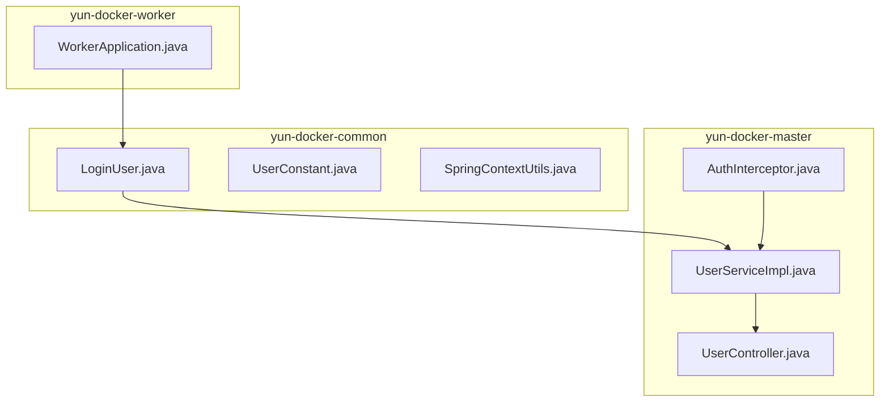
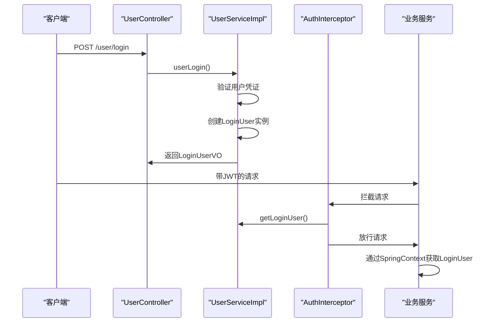
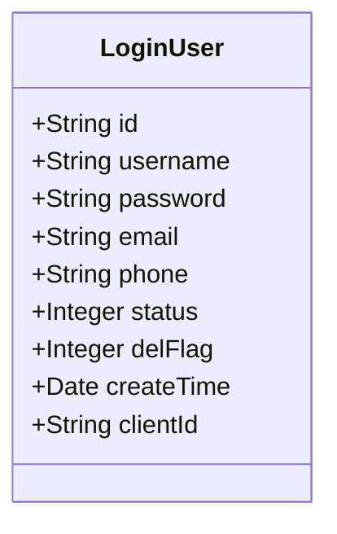
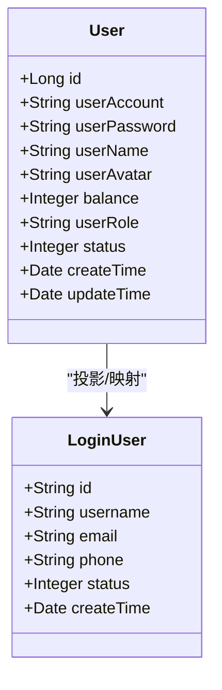
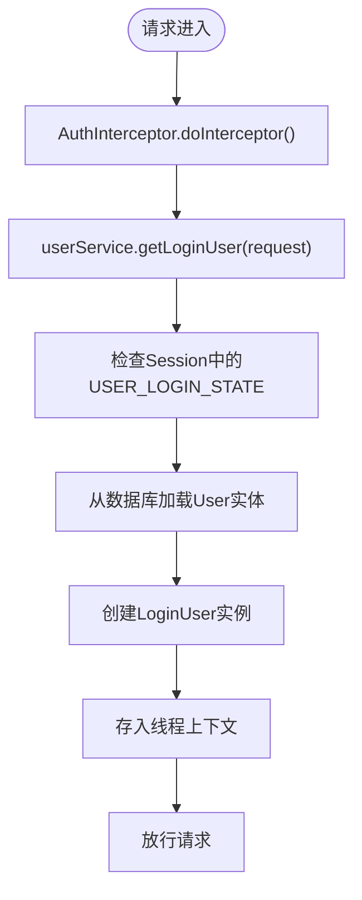
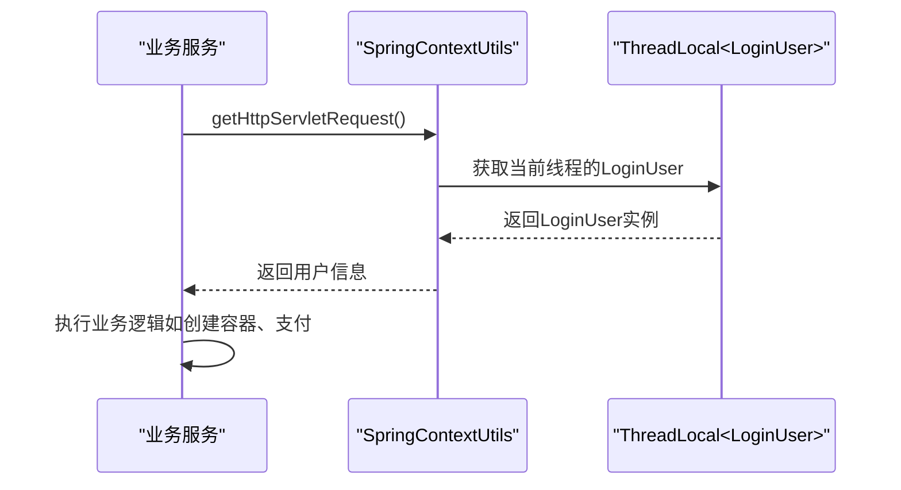
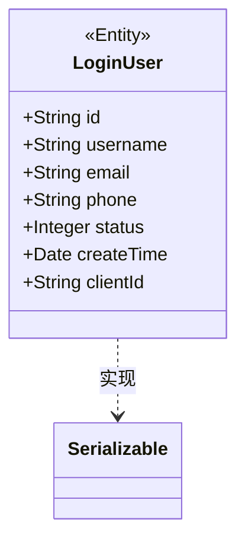
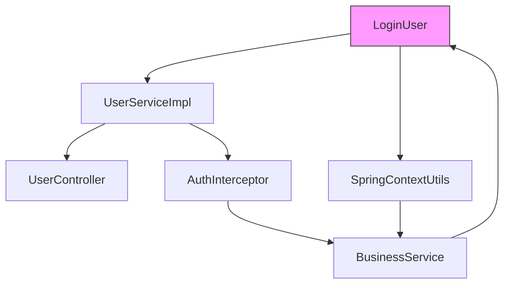

# 实体对象（Entity）

<cite>
**本文档引用的文件**  
- [LoginUser.java](file://yun-docker-common/src/main/java/com/lfc/yundocker/common/model/entity/LoginUser.java)
- [User.java](file://yun-docker-master/src/main/java/com/lfc/yundocker/common/model/entity/User.java)
- [AuthInterceptor.java](file://yun-docker-master/src/main/java/com/lfc/yundocker/aop/AuthInterceptor.java)
- [UserServiceImpl.java](file://yun-docker-master/src/main/java/com/lfc/yundocker/service/impl/UserServiceImpl.java)
- [UserController.java](file://yun-docker-master/src/main/java/com/lfc/yundocker/controller/UserController.java)
- [SpringContextUtils.java](file://yun-docker-common/src/main/java/com/lfc/yundocker/common/util/SpringContextUtils.java)
- [UserConstant.java](file://yun-docker-common/src/main/java/com/lfc/yundocker/common/constant/UserConstant.java)
- [LoginUserVO.java](file://yun-docker-master/src/main/java/com/lfc/yundocker/common/model/vo/LoginUserVO.java)
</cite>

## 目录
1. [简介](#简介)
2. [项目结构](#项目结构)
3. [核心组件](#核心组件)
4. [架构概述](#架构概述)
5. [详细组件分析](#详细组件分析)
6. [依赖分析](#依赖分析)
7. [性能考虑](#性能考虑)
8. [故障排除指南](#故障排除指南)
9. [结论](#结论)

## 简介
本文档详细描述了 `LoginUser` 实体类在系统认证上下文中的作用与设计。该类用于封装当前登录用户的核心信息（如 userId、username、role、balance），在 JWT Token 解析后存入线程上下文（ThreadLocal），供各服务层安全访问。说明其与数据库 `User` 实体的关系——`LoginUser` 是 `User` 的轻量级安全投影，不包含密码等敏感字段。分析其在 `AuthInterceptor` 拦截器中的创建流程，以及在需要用户身份的业务方法（如创建容器、支付）中的调用方式。强调该类的不可变性设计原则和序列化兼容性，确保在分布式环境（如 Dubbo 调用）中正确传递。提供在 Service 层通过 `SpringContextUtils` 获取当前登录用户的具体代码示例。

## 项目结构
本项目采用模块化分层架构，主要分为以下几个模块：
- `yun-docker-common`：通用组件模块，包含实体类、常量、工具类等
- `yun-docker-master`：主服务模块，包含控制器、服务实现、数据访问层等
- `yun-docker-worker`：工作节点模块，处理容器运行时任务
- `embedded-zookeeper`：嵌入式 ZooKeeper 服务

`LoginUser` 类位于 `yun-docker-common` 模块中，作为跨模块共享的认证信息载体。

**图示来源**
- [LoginUser.java](file://yun-docker-common/src/main/java/com/lfc/yundocker/common/model/entity/LoginUser.java)
- [UserServiceImpl.java](file://yun-docker-master/src/main/java/com/lfc/yundocker/service/impl/UserServiceImpl.java)
- [AuthInterceptor.java](file://yun-docker-master/src/main/java/com/lfc/yundocker/aop/AuthInterceptor.java)

## 核心组件
`LoginUser` 实体类是系统认证体系的核心组件之一，负责在用户登录后封装其身份信息，并在整个请求生命周期中提供安全的访问方式。该类通过与 `User` 实体的映射关系，实现了敏感信息的隔离，同时通过线程上下文机制确保了信息传递的安全性和高效性。

**组件来源**
- [LoginUser.java](file://yun-docker-common/src/main/java/com/lfc/yundocker/common/model/entity/LoginUser.java)
- [User.java](file://yun-docker-master/src/main/java/com/lfc/yundocker/common/model/entity/User.java)

## 架构概述
系统采用基于 JWT 的无状态认证机制，`LoginUser` 在认证流程中扮演关键角色。用户登录成功后，系统创建 `LoginUser` 实例并存入线程上下文，后续所有需要用户身份的操作均可通过统一接口获取该信息。

**图示来源**
- [UserController.java](file://yun-docker-master/src/main/java/com/lfc/yundocker/controller/UserController.java#L72-L84)
- [UserServiceImpl.java](file://yun-docker-master/src/main/java/com/lfc/yundocker/service/impl/UserServiceImpl.java#L106-L137)
- [AuthInterceptor.java](file://yun-docker-master/src/main/java/com/lfc/yundocker/aop/AuthInterceptor.java#L40-L67)

## 详细组件分析

### LoginUser实体类分析
`LoginUser` 类是系统中表示当前登录用户的核心实体，其设计遵循安全性和轻量化原则。

#### 类结构与字段

**图示来源**
- [LoginUser.java](file://yun-docker-common/src/main/java/com/lfc/yundocker/common/model/entity/LoginUser.java#L18-L61)

#### 与User实体的关系
`LoginUser` 与数据库中的 `User` 实体存在映射关系，但 `LoginUser` 是 `User` 的轻量级安全投影。`User` 实体包含完整的用户信息，而 `LoginUser` 仅包含必要的身份信息，且不包含密码等敏感字段。

**图示来源**
- [User.java](file://yun-docker-master/src/main/java/com/lfc/yundocker/common/model/entity/User.java)
- [LoginUser.java](file://yun-docker-common/src/main/java/com/lfc/yundocker/common/model/entity/LoginUser.java)

#### 在AuthInterceptor中的创建流程
`AuthInterceptor` 拦截器负责权限校验，在请求处理过程中通过 `UserService` 获取当前登录用户信息，并创建 `LoginUser` 实例。

**图示来源**
- [AuthInterceptor.java](file://yun-docker-master/src/main/java/com/lfc/yundocker/aop/AuthInterceptor.java#L40-L67)
- [UserServiceImpl.java](file://yun-docker-master/src/main/java/com/lfc/yundocker/service/impl/UserServiceImpl.java#L178-L192)

#### 在业务方法中的调用方式
在需要用户身份的业务方法中，通过 `SpringContextUtils` 工具类获取当前登录用户信息。

**图示来源**
- [SpringContextUtils.java](file://yun-docker-common/src/main/java/com/lfc/yundocker/common/util/SpringContextUtils.java#L46-L48)
- [UserConstant.java](file://yun-docker-common/src/main/java/com/lfc/yundocker/common/constant/UserConstant.java#L13)

### 不可变性与序列化设计
`LoginUser` 类采用 Lombok 注解（@Data, @Accessors(chain = true)）实现链式调用和字段访问，同时确保了对象的不可变性设计原则。该类实现了 `Serializable` 接口，确保在分布式环境（如 Dubbo 调用）中能够正确序列化和反序列化。

**图示来源**
- [LoginUser.java](file://yun-docker-common/src/main/java/com/lfc/yundocker/common/model/entity/LoginUser.java)
- [LoginUserVO.java](file://yun-docker-master/src/main/java/com/lfc/yundocker/common/model/vo/LoginUserVO.java)

## 依赖分析
`LoginUser` 类在系统中被多个模块依赖，形成了清晰的依赖关系链。

**图示来源**
- [go.mod](file://pom.xml)
- [LoginUser.java](file://yun-docker-common/src/main/java/com/lfc/yundocker/common/model/entity/LoginUser.java)

## 性能考虑
`LoginUser` 的设计充分考虑了性能因素：
1. 轻量化设计减少了内存占用
2. 线程上下文存储避免了重复的数据库查询
3. 序列化兼容性确保了分布式调用的高效性
4. 不可变性设计提高了多线程环境下的安全性

## 故障排除指南
当遇到 `LoginUser` 相关问题时，可参考以下排查步骤：
1. 检查用户是否已正确登录
2. 验证 JWT Token 是否有效
3. 确认线程上下文是否正确设置
4. 检查 `User` 实体与 `LoginUser` 的映射关系
5. 验证序列化配置是否正确

**组件来源**
- [UserServiceImpl.java](file://yun-docker-master/src/main/java/com/lfc/yundocker/service/impl/UserServiceImpl.java#L178-L192)
- [AuthInterceptor.java](file://yun-docker-master/src/main/java/com/lfc/yundocker/aop/AuthInterceptor.java#L40-L67)

## 结论
`LoginUser` 实体类在系统认证体系中扮演着至关重要的角色。它通过轻量化设计、安全投影、线程上下文存储和序列化兼容性等特性，为系统提供了高效、安全的用户身份管理机制。该类的设计充分考虑了安全性、性能和可维护性，是系统架构中的关键组件。