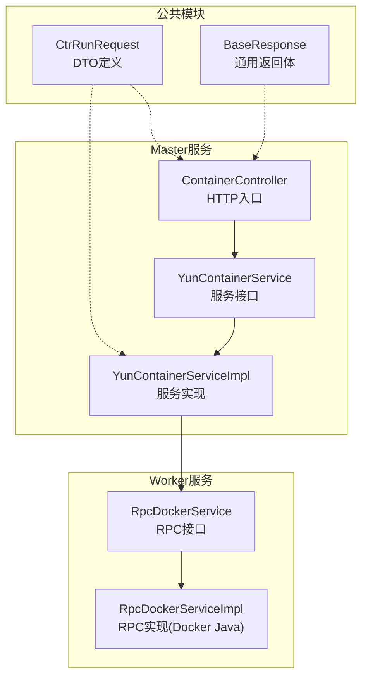
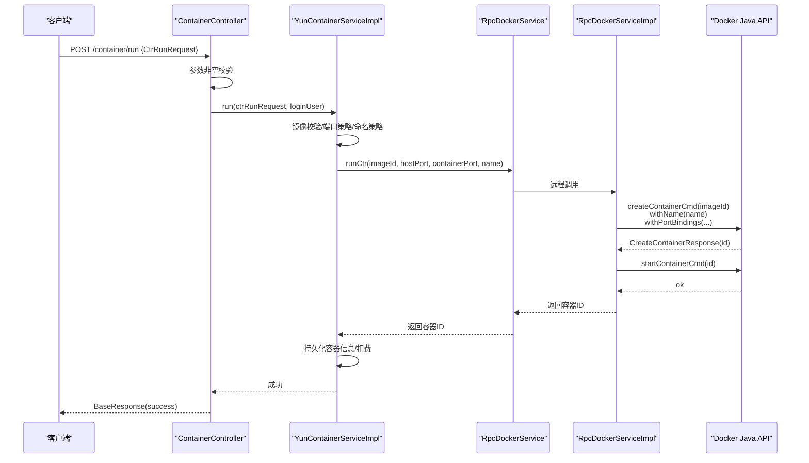
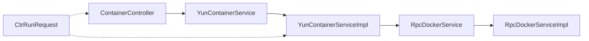

# 容器操作DTO

<cite>
**本文引用的文件**
- [yun-docker-common/src/main/java/com/lfc/yundocker/common/model/dto/CtrRunRequest.java](file://yun-docker-common/src/main/java/com/lfc/yundocker/common/model/dto/CtrRunRequest.java)
- [yun-docker-master/src/main/java/com/lfc/yundocker/controller/ContainerController.java](file://yun-docker-master/src/main/java/com/lfc/yundocker/controller/ContainerController.java)
- [yun-docker-master/src/main/java/com/lfc/yundocker/service/YunContainerService.java](file://yun-docker-master/src/main/java/com/lfc/yundocker/service/YunContainerService.java)
- [yun-docker-master/src/main/java/com/lfc/yundocker/service/impl/YunContainerServiceImpl.java](file://yun-docker-master/src/main/java/com/lfc/yundocker/service/impl/YunContainerServiceImpl.java)
- [yun-docker-api/src/main/java/com/lfc/yundocker/service/RpcDockerService.java](file://yun-docker-api/src/main/java/com/lfc/yundocker/service/RpcDockerService.java)
- [yun-docker-worker/src/main/java/com/lfc/yundocker/worker/rpc/RpcDockerServiceImpl.java](file://yun-docker-worker/src/main/java/com/lfc/yundocker/worker/rpc/RpcDockerServiceImpl.java)
- [yun-docker-common/src/main/java/com/lfc/yundocker/common/model/dto/BaseResponse.java](file://yun-docker-common/src/main/java/com/lfc/yundocker/common/model/dto/BaseResponse.java)
</cite>

## 目录
1. [引言](#引言)
2. [项目结构](#项目结构)
3. [核心组件](#核心组件)
4. [架构总览](#架构总览)
5. [详细组件分析](#详细组件分析)
6. [依赖分析](#依赖分析)
7. [性能考虑](#性能考虑)
8. [故障排查指南](#故障排查指南)
9. [结论](#结论)
10. [附录](#附录)

## 引言
本文件围绕容器运行请求对象 CtrRunRequest 的设计与使用展开，系统梳理其字段语义、约束与校验策略，以及在 Spring MVC 绑定、服务层处理、Dubbo RPC 调用链路中的映射关系。同时结合 ContainerController 中的创建容器接口，说明请求从 Web 层到 Worker 节点执行 Docker 命令的完整流程，并讨论跨服务调用的序列化兼容性及与 Docker Java API 参数的映射。

## 项目结构
- DTO 定义位于公共模块，便于前后端与服务间共享。
- 控制器位于 master 模块，负责接收 HTTP 请求并进行基础校验。
- 服务层位于 master 模块，负责业务编排与 Dubbo RPC 调用。
- Worker 模块通过 Dubbo 实现远程服务，直接对接 Docker Java API 执行容器操作。

图表来源
- [yun-docker-common/src/main/java/com/lfc/yundocker/common/model/dto/CtrRunRequest.java](file://yun-docker-common/src/main/java/com/lfc/yundocker/common/model/dto/CtrRunRequest.java#L1-L35)
- [yun-docker-common/src/main/java/com/lfc/yundocker/common/model/dto/BaseResponse.java](file://yun-docker-common/src/main/java/com/lfc/yundocker/common/model/dto/BaseResponse.java#L1-L37)
- [yun-docker-master/src/main/java/com/lfc/yundocker/controller/ContainerController.java](file://yun-docker-master/src/main/java/com/lfc/yundocker/controller/ContainerController.java#L110-L133)
- [yun-docker-master/src/main/java/com/lfc/yundocker/service/YunContainerService.java](file://yun-docker-master/src/main/java/com/lfc/yundocker/service/YunContainerService.java#L1-L41)
- [yun-docker-master/src/main/java/com/lfc/yundocker/service/impl/YunContainerServiceImpl.java](file://yun-docker-master/src/main/java/com/lfc/yundocker/service/impl/YunContainerServiceImpl.java#L136-L215)
- [yun-docker-api/src/main/java/com/lfc/yundocker/service/RpcDockerService.java](file://yun-docker-api/src/main/java/com/lfc/yundocker/service/RpcDockerService.java#L1-L143)
- [yun-docker-worker/src/main/java/com/lfc/yundocker/worker/rpc/RpcDockerServiceImpl.java](file://yun-docker-worker/src/main/java/com/lfc/yundocker/worker/rpc/RpcDockerServiceImpl.java#L80-L107)

章节来源
- [yun-docker-common/src/main/java/com/lfc/yundocker/common/model/dto/CtrRunRequest.java](file://yun-docker-common/src/main/java/com/lfc/yundocker/common/model/dto/CtrRunRequest.java#L1-L35)
- [yun-docker-master/src/main/java/com/lfc/yundocker/controller/ContainerController.java](file://yun-docker-master/src/main/java/com/lfc/yundocker/controller/ContainerController.java#L110-L133)
- [yun-docker-master/src/main/java/com/lfc/yundocker/service/impl/YunContainerServiceImpl.java](file://yun-docker-master/src/main/java/com/lfc/yundocker/service/impl/YunContainerServiceImpl.java#L136-L215)
- [yun-docker-api/src/main/java/com/lfc/yundocker/service/RpcDockerService.java](file://yun-docker-api/src/main/java/com/lfc/yundocker/service/RpcDockerService.java#L1-L143)
- [yun-docker-worker/src/main/java/com/lfc/yundocker/worker/rpc/RpcDockerServiceImpl.java](file://yun-docker-worker/src/main/java/com/lfc/yundocker/worker/rpc/RpcDockerServiceImpl.java#L80-L107)

## 核心组件
- CtrRunRequest：容器运行请求 DTO，包含镜像标识、宿主机端口、容器端口、容器名称等字段。
- ContainerController.run：接收 HTTP POST 请求，完成基础参数校验与鉴权，调用服务层。
- YunContainerService/YunContainerServiceImpl：服务层编排逻辑，负责镜像校验、端口分配与校验、容器命名策略、调用 RPC 接口并持久化结果。
- RpcDockerService/RpcDockerServiceImpl：Worker 端 RPC 接口与实现，对接 Docker Java API，执行容器创建、启动、日志、统计等操作。

章节来源
- [yun-docker-common/src/main/java/com/lfc/yundocker/common/model/dto/CtrRunRequest.java](file://yun-docker-common/src/main/java/com/lfc/yundocker/common/model/dto/CtrRunRequest.java#L1-L35)
- [yun-docker-master/src/main/java/com/lfc/yundocker/controller/ContainerController.java](file://yun-docker-master/src/main/java/com/lfc/yundocker/controller/ContainerController.java#L110-L133)
- [yun-docker-master/src/main/java/com/lfc/yundocker/service/YunContainerService.java](file://yun-docker-master/src/main/java/com/lfc/yundocker/service/YunContainerService.java#L1-L41)
- [yun-docker-master/src/main/java/com/lfc/yundocker/service/impl/YunContainerServiceImpl.java](file://yun-docker-master/src/main/java/com/lfc/yundocker/service/impl/YunContainerServiceImpl.java#L136-L215)
- [yun-docker-api/src/main/java/com/lfc/yundocker/service/RpcDockerService.java](file://yun-docker-api/src/main/java/com/lfc/yundocker/service/RpcDockerService.java#L1-L143)
- [yun-docker-worker/src/main/java/com/lfc/yundocker/worker/rpc/RpcDockerServiceImpl.java](file://yun-docker-worker/src/main/java/com/lfc/yundocker/worker/rpc/RpcDockerServiceImpl.java#L80-L107)

## 架构总览
下图展示了从 HTTP 请求到 Docker 命令执行的端到端调用链，以及 CtrRunRequest 在各层的流转与映射。

图表来源
- [yun-docker-master/src/main/java/com/lfc/yundocker/controller/ContainerController.java](file://yun-docker-master/src/main/java/com/lfc/yundocker/controller/ContainerController.java#L110-L133)
- [yun-docker-master/src/main/java/com/lfc/yundocker/service/impl/YunContainerServiceImpl.java](file://yun-docker-master/src/main/java/com/lfc/yundocker/service/impl/YunContainerServiceImpl.java#L136-L215)
- [yun-docker-api/src/main/java/com/lfc/yundocker/service/RpcDockerService.java](file://yun-docker-api/src/main/java/com/lfc/yundocker/service/RpcDockerService.java#L28-L40)
- [yun-docker-worker/src/main/java/com/lfc/yundocker/worker/rpc/RpcDockerServiceImpl.java](file://yun-docker-worker/src/main/java/com/lfc/yundocker/worker/rpc/RpcDockerServiceImpl.java#L80-L107)

## 详细组件分析

### CtrRunRequest 字段设计与约束
- 字段概览
  - imageId：镜像标识（注意：注释明确指出不是主键 Long 类型），用于 Worker 端创建容器。
  - hostPort：宿主机端口，若为空或无效将触发端口校验与分配策略。
  - containerPort：容器端口，公共镜像场景下会按仓库映射规则确定。
  - name：自定义容器名称，若为空则按仓库名与随机后缀生成。

- 约束与校验策略
  - 字段层面未声明 JSR-303 注解（如 @NotBlank、@Min 等）。实际约束主要体现在：
    - 控制器层对请求体非空的显式校验。
    - 服务层对 hostPort 的合法性校验与端口占用检测。
    - 对公共镜像的 containerPort 采用仓库映射策略。
    - 对容器名称的默认生成策略。

- 与 Docker Java API 的映射
  - imageId -> createContainerCmd(imageId)
  - name -> withName(name)
  - hostPort/containerPort -> withPortBindings(...)

章节来源
- [yun-docker-common/src/main/java/com/lfc/yundocker/common/model/dto/CtrRunRequest.java](file://yun-docker-common/src/main/java/com/lfc/yundocker/common/model/dto/CtrRunRequest.java#L1-L35)
- [yun-docker-master/src/main/java/com/lfc/yundocker/controller/ContainerController.java](file://yun-docker-master/src/main/java/com/lfc/yundocker/controller/ContainerController.java#L110-L133)
- [yun-docker-master/src/main/java/com/lfc/yundocker/service/impl/YunContainerServiceImpl.java](file://yun-docker-master/src/main/java/com/lfc/yundocker/service/impl/YunContainerServiceImpl.java#L136-L215)
- [yun-docker-worker/src/main/java/com/lfc/yundocker/worker/rpc/RpcDockerServiceImpl.java](file://yun-docker-worker/src/main/java/com/lfc/yundocker/worker/rpc/RpcDockerServiceImpl.java#L80-L107)

### Spring MVC 绑定与控制器处理
- 绑定方式
  - 使用 @RequestBody 将 JSON 请求体绑定为 CtrRunRequest 对象。
- 控制器职责
  - 显式校验请求体非空。
  - 获取登录用户上下文。
  - 调用服务层 run 方法。
  - 返回 BaseResponse 包装的成功消息。

章节来源
- [yun-docker-master/src/main/java/com/lfc/yundocker/controller/ContainerController.java](file://yun-docker-master/src/main/java/com/lfc/yundocker/controller/ContainerController.java#L110-L133)
- [yun-docker-common/src/main/java/com/lfc/yundocker/common/model/dto/BaseResponse.java](file://yun-docker-common/src/main/java/com/lfc/yundocker/common/model/dto/BaseResponse.java#L1-L37)

### 服务层编排与 RPC 调用
- 业务编排
  - 镜像存在性与归属校验。
  - 端口合法性与占用检测，必要时分配新端口。
  - 公共镜像的容器端口映射策略。
  - 容器名称默认生成策略。
  - 调用 Worker 端 RPC 接口执行容器创建与启动。
  - 记录指标与持久化容器信息。
  - 扣减用户余额。

- 与 Docker Java API 的映射
  - runCtr(imageId, hostPort, containerPort, name) -> createContainerCmd(imageId).withName(name).withPortBindings(...).exec() -> startContainerCmd(id)

章节来源
- [yun-docker-master/src/main/java/com/lfc/yundocker/service/impl/YunContainerServiceImpl.java](file://yun-docker-master/src/main/java/com/lfc/yundocker/service/impl/YunContainerServiceImpl.java#L136-L215)
- [yun-docker-api/src/main/java/com/lfc/yundocker/service/RpcDockerService.java](file://yun-docker-api/src/main/java/com/lfc/yundocker/service/RpcDockerService.java#L28-L40)
- [yun-docker-worker/src/main/java/com/lfc/yundocker/worker/rpc/RpcDockerServiceImpl.java](file://yun-docker-worker/src/main/java/com/lfc/yundocker/worker/rpc/RpcDockerServiceImpl.java#L80-L107)

### Worker 端执行与 Docker 命令
- 执行流程
  - 接收 imageId、hostPort、containerPort、name。
  - 创建容器并设置名称与端口绑定。
  - 启动容器并返回容器 ID。
- Docker API 映射
  - createContainerCmd(imageId) -> withName(name) -> withPortBindings(...) -> exec()
  - startContainerCmd(id)

章节来源
- [yun-docker-worker/src/main/java/com/lfc/yundocker/worker/rpc/RpcDockerServiceImpl.java](file://yun-docker-worker/src/main/java/com/lfc/yundocker/worker/rpc/RpcDockerServiceImpl.java#L80-L107)

### 字段校验注解现状与建议
- 现状
  - CtrRunRequest 未使用 JSR-303 注解（如 @NotBlank、@Min、@Max、@NotNull 等）。
  - 实际约束主要通过控制器与服务层显式校验实现。
- 建议
  - 在 DTO 上补充注解以提升契约清晰度与可维护性。
  - 例如：对 imageId 添加 @NotBlank；对 hostPort/containerPort 添加数值范围约束；对 name 添加长度与格式约束。

章节来源
- [yun-docker-common/src/main/java/com/lfc/yundocker/common/model/dto/CtrRunRequest.java](file://yun-docker-common/src/main/java/com/lfc/yundocker/common/model/dto/CtrRunRequest.java#L1-L35)
- [yun-docker-master/src/main/java/com/lfc/yundocker/controller/ContainerController.java](file://yun-docker-master/src/main/java/com/lfc/yundocker/controller/ContainerController.java#L110-L133)
- [yun-docker-master/src/main/java/com/lfc/yundocker/service/impl/YunContainerServiceImpl.java](file://yun-docker-master/src/main/java/com/lfc/yundocker/service/impl/YunContainerServiceImpl.java#L136-L215)

### 序列化兼容性与跨服务调用
- 兼容性要点
  - CtrRunRequest 实现了 Serializable，满足跨模块传输要求。
  - 字段类型均为基础类型或简单字符串，适合 JSON 序列化/反序列化。
- 调用链映射
  - Controller -> Service -> RPC 接口 -> Worker 实现。
  - 字段名与类型保持一致，避免跨语言/跨模块的不匹配问题。

章节来源
- [yun-docker-common/src/main/java/com/lfc/yundocker/common/model/dto/CtrRunRequest.java](file://yun-docker-common/src/main/java/com/lfc/yundocker/common/model/dto/CtrRunRequest.java#L1-L35)
- [yun-docker-api/src/main/java/com/lfc/yundocker/service/RpcDockerService.java](file://yun-docker-api/src/main/java/com/lfc/yundocker/service/RpcDockerService.java#L28-L40)
- [yun-docker-worker/src/main/java/com/lfc/yundocker/worker/rpc/RpcDockerServiceImpl.java](file://yun-docker-worker/src/main/java/com/lfc/yundocker/worker/rpc/RpcDockerServiceImpl.java#L80-L107)

### 与 Docker Java API 的参数映射关系
- 映射清单
  - imageId -> createContainerCmd(imageId)
  - name -> withName(name)
  - hostPort/containerPort -> withPortBindings(PortBinding.parse(hostPort:containerPort))
- 注意事项
  - Worker 端实现中对端口绑定与容器启动进行了显式设置，确保容器可访问。

章节来源
- [yun-docker-worker/src/main/java/com/lfc/yundocker/worker/rpc/RpcDockerServiceImpl.java](file://yun-docker-worker/src/main/java/com/lfc/yundocker/worker/rpc/RpcDockerServiceImpl.java#L80-L107)

## 依赖分析
- 组件耦合
  - Controller 仅依赖服务接口，低耦合。
  - Service 通过 DubboReference 引用 Worker 端 RPC 接口，实现远程调用。
  - DTO 作为跨模块传输载体，无循环依赖。
- 外部依赖
  - Docker Java API：用于容器生命周期管理。
  - Dubbo：用于服务间通信。

图表来源
- [yun-docker-master/src/main/java/com/lfc/yundocker/controller/ContainerController.java](file://yun-docker-master/src/main/java/com/lfc/yundocker/controller/ContainerController.java#L110-L133)
- [yun-docker-master/src/main/java/com/lfc/yundocker/service/impl/YunContainerServiceImpl.java](file://yun-docker-master/src/main/java/com/lfc/yundocker/service/impl/YunContainerServiceImpl.java#L136-L215)
- [yun-docker-api/src/main/java/com/lfc/yundocker/service/RpcDockerService.java](file://yun-docker-api/src/main/java/com/lfc/yundocker/service/RpcDockerService.java#L1-L143)
- [yun-docker-worker/src/main/java/com/lfc/yundocker/worker/rpc/RpcDockerServiceImpl.java](file://yun-docker-worker/src/main/java/com/lfc/yundocker/worker/rpc/RpcDockerServiceImpl.java#L80-L107)

## 性能考虑
- 端口分配策略
  - 若 hostPort 缺省，服务层会生成可用端口，减少冲突概率。
- 资源限制
  - Worker 端实现中对内存与 CPU 有硬编码限制，建议通过配置中心动态下发，以适配不同业务场景。
- 指标采集
  - 服务层记录运行错误次数、响应时间与请求量，有助于容量规划与问题定位。

章节来源
- [yun-docker-master/src/main/java/com/lfc/yundocker/service/impl/YunContainerServiceImpl.java](file://yun-docker-master/src/main/java/com/lfc/yundocker/service/impl/YunContainerServiceImpl.java#L136-L215)
- [yun-docker-worker/src/main/java/com/lfc/yundocker/worker/rpc/RpcDockerServiceImpl.java](file://yun-docker-worker/src/main/java/com/lfc/yundocker/worker/rpc/RpcDockerServiceImpl.java#L80-L107)

## 故障排查指南
- 常见问题
  - 请求体为空：控制器层会抛出参数错误异常。
  - 镜像不存在或不属于用户：服务层抛出未找到错误。
  - 端口占用：服务层提示更换端口。
  - Docker 操作异常：服务层捕获异常并记录指标，返回系统错误。
- 排查步骤
  - 检查请求体字段是否符合服务层校验逻辑。
  - 核对镜像归属与端口映射策略。
  - 查看 Worker 端日志与 Docker Java API 返回状态。
  - 关注指标收集与错误计数，定位热点镜像与失败原因。

章节来源
- [yun-docker-master/src/main/java/com/lfc/yundocker/controller/ContainerController.java](file://yun-docker-master/src/main/java/com/lfc/yundocker/controller/ContainerController.java#L110-L133)
- [yun-docker-master/src/main/java/com/lfc/yundocker/service/impl/YunContainerServiceImpl.java](file://yun-docker-master/src/main/java/com/lfc/yundocker/service/impl/YunContainerServiceImpl.java#L136-L215)
- [yun-docker-worker/src/main/java/com/lfc/yundocker/worker/rpc/RpcDockerServiceImpl.java](file://yun-docker-worker/src/main/java/com/lfc/yundocker/worker/rpc/RpcDockerServiceImpl.java#L80-L107)

## 结论
- CtrRunRequest 作为容器运行的关键输入，虽然未使用 JSR-303 注解，但通过控制器与服务层的显式校验实现了必要的约束。
- 从 HTTP 到 Worker 的调用链清晰，字段映射与 Docker Java API 对应良好，具备良好的扩展性。
- 建议在 DTO 层补充注解以增强契约表达，并将资源限制等参数配置化，以提升灵活性与可维护性。

## 附录
- 字段用途速览
  - imageId：镜像标识，用于创建容器。
  - hostPort：宿主机端口，用于端口绑定。
  - containerPort：容器端口，公共镜像场景下按仓库映射。
  - name：容器名称，缺省时自动生成。