# 数据传输对象（DTO）

<cite>
**本文档引用的文件**  
- [BaseResponse.java](file://yun-docker-common/src/main/java/com/lfc/yundocker/common/model/dto/BaseResponse.java)
- [PageRequest.java](file://yun-docker-common/src/main/java/com/lfc/yundocker/common/model/dto/PageRequest.java)
- [CtrRunRequest.java](file://yun-docker-common/src/main/java/com/lfc/yundocker/common/model/dto/CtrRunRequest.java)
- [LogDTO.java](file://yun-docker-common/src/main/java/com/lfc/yundocker/common/model/dto/LogDTO.java)
- [UploadFileRequest.java](file://yun-docker-common/src/main/java/com/lfc/yundocker/common/model/dto/file/UploadFileRequest.java)
- [UserLoginRequest.java](file://yun-docker-common/src/main/java/com/lfc/yundocker/common/model/dto/user/UserLoginRequest.java)
- [UserRegisterRequest.java](file://yun-docker-common/src/main/java/com/lfc/yundocker/common/model/dto/user/UserRegisterRequest.java)
- [UserQueryRequest.java](file://yun-docker-common/src/main/java/com/lfc/yundocker/common/model/dto/user/UserQueryRequest.java)
- [UserController.java](file://yun-docker-master/src/main/java/com/lfc/yundocker/controller/UserController.java)
- [ContainerController.java](file://yun-docker-master/src/main/java/com/lfc/yundocker/controller/ContainerController.java)
- [YunContainerService.java](file://yun-docker-master/src/main/java/com/lfc/yundocker/service/YunContainerService.java)
- [YunContainerServiceImpl.java](file://yun-docker-master/src/main/java/com/lfc/yundocker/service/impl/YunContainerServiceImpl.java)
- [UserService.java](file://yun-docker-master/src/main/java/com/lfc/yundocker/service/UserService.java)
- [UserServiceImpl.java](file://yun-docker-master/src/main/java/com/lfc/yundocker/service/impl/UserServiceImpl.java)
- [LoginUser.java](file://yun-docker-common/src/main/java/com/lfc/yundocker/common/model/entity/LoginUser.java)
- [LoginUserVO.java](file://yun-docker-master/src/main/java/com/lfc/yundocker/common/model/vo/LoginUserVO.java)
</cite>

## 目录
1. [引言](#引言)
2. [项目结构](#项目结构)
3. [核心组件](#核心组件)
4. [架构概述](#架构概述)
5. [详细组件分析](#详细组件分析)
6. [依赖分析](#依赖分析)
7. [性能考虑](#性能考虑)
8. [故障排除指南](#故障排除指南)
9. [结论](#结论)

## 引言
本文档详细说明 `yun-docker-common` 模块中 `dto` 包的设计与实现。重点阐述数据传输对象（DTO）在服务间通信和接口参数封装中的作用，包括用户认证、分页查询、容器运行、日志记录和文件上传等场景。通过分析具体类的设计与使用，展示 Lombok 注解如何简化代码，并确保与 Jackson JSON 序列化的兼容性。

## 项目结构

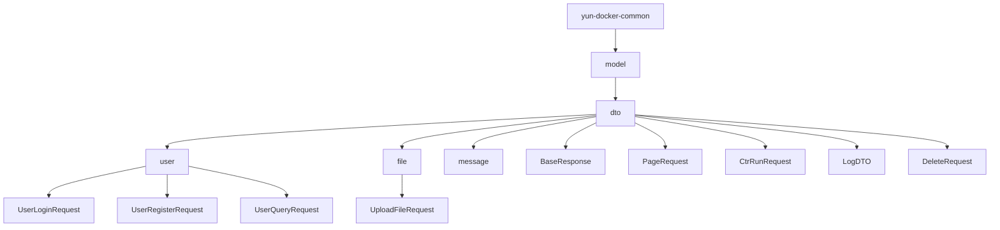

**图示来源**  
- [BaseResponse.java](file://yun-docker-common/src/main/java/com/lfc/yundocker/common/model/dto/BaseResponse.java)
- [PageRequest.java](file://yun-docker-common/src/main/java/com/lfc/yundocker/common/model/dto/PageRequest.java)
- [CtrRunRequest.java](file://yun-docker-common/src/main/java/com/lfc/yundocker/common/model/dto/CtrRunRequest.java)
- [LogDTO.java](file://yun-docker-common/src/main/java/com/lfc/yundocker/common/model/dto/LogDTO.java)
- [UploadFileRequest.java](file://yun-docker-common/src/main/java/com/lfc/yundocker/common/model/dto/file/UploadFileRequest.java)

**本节来源**  
- [yun-docker-common/src/main/java/com/lfc/yundocker/common/model/dto](file://yun-docker-common/src/main/java/com/lfc/yundocker/common/model/dto)

## 核心组件

`dto` 包是 `yun-docker-common` 模块的核心部分，提供统一的数据传输结构，用于前后端交互、服务间通信和接口参数封装。主要包含用户认证、分页查询、容器操作、日志记录和文件上传等场景的请求与响应对象。

**本节来源**  
- [BaseResponse.java](file://yun-docker-common/src/main/java/com/lfc/yundocker/common/model/dto/BaseResponse.java)
- [PageRequest.java](file://yun-docker-common/src/main/java/com/lfc/yundocker/common/model/dto/PageRequest.java)
- [CtrRunRequest.java](file://yun-docker-common/src/main/java/com/lfc/yundocker/common/model/dto/CtrRunRequest.java)
- [LogDTO.java](file://yun-docker-common/src/main/java/com/lfc/yundocker/common/model/dto/LogDTO.java)

## 架构概述

```mermaid
graph LR
Client[客户端] --> |UserLoginRequest| UserController
UserController --> |调用| UserService
UserService --> |返回| LoginUserVO
UserController --> |响应| BaseResponse
Client --> |CtrRunRequest| ContainerController
ContainerController --> |调用| YunContainerService
YunContainerService --> |调用| RpcDockerService
ContainerController --> |响应| BaseResponse
Client --> |PageRequest| UserController
UserController --> |调用| UserService
UserService --> |返回| Page<UserVO>
UserController --> |响应| BaseResponse
```

**图示来源**  
- [UserController.java](file://yun-docker-master/src/main/java/com/lfc/yundocker/controller/UserController.java)
- [ContainerController.java](file://yun-docker-master/src/main/java/com/lfc/yundocker/controller/ContainerController.java)
- [UserService.java](file://yun-docker-master/src/main/java/com/lfc/yundocker/service/UserService.java)
- [YunContainerService.java](file://yun-docker-master/src/main/java/com/lfc/yundocker/service/YunContainerService.java)

## 详细组件分析

### 用户认证相关DTO分析

#### 用户登录请求设计
`UserLoginRequest` 类用于封装用户登录接口的输入参数，包含用户账号和密码两个字段。该类作为 `@RequestBody` 注解的参数，由 Spring MVC 自动进行 JSON 反序列化和数据绑定。

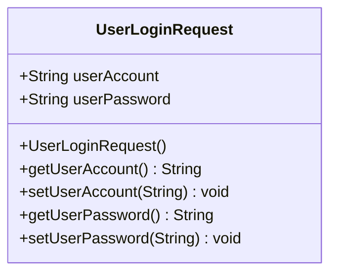

**图示来源**  
- [UserLoginRequest.java](file://yun-docker-common/src/main/java/com/lfc/yundocker/common/model/dto/user/UserLoginRequest.java)

#### 用户注册请求设计
`UserRegisterRequest` 类用于用户注册接口，包含用户账号、密码和确认密码三个字段，用于确保用户输入的密码一致性。

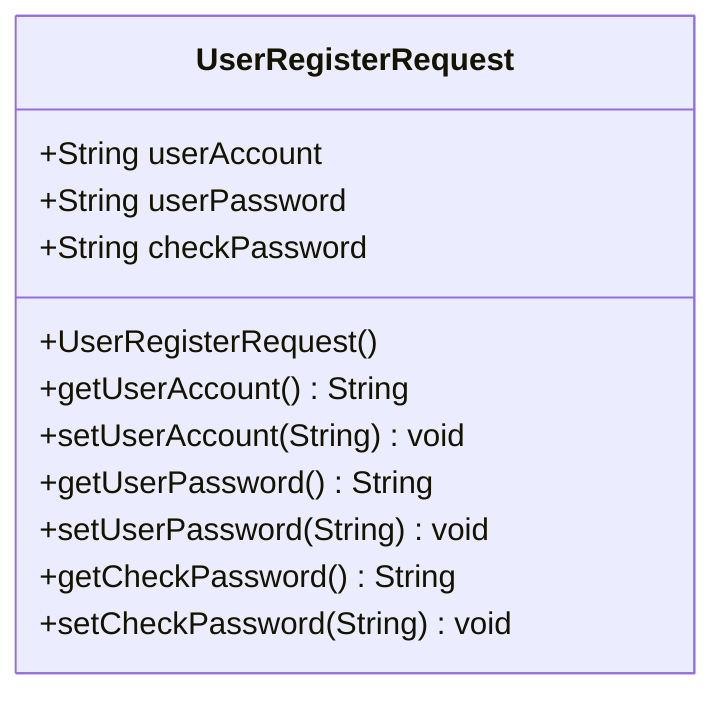

**图示来源**  
- [UserRegisterRequest.java](file://yun-docker-common/src/main/java/com/lfc/yundocker/common/model/dto/user/UserRegisterRequest.java)

#### 登录流程序列图
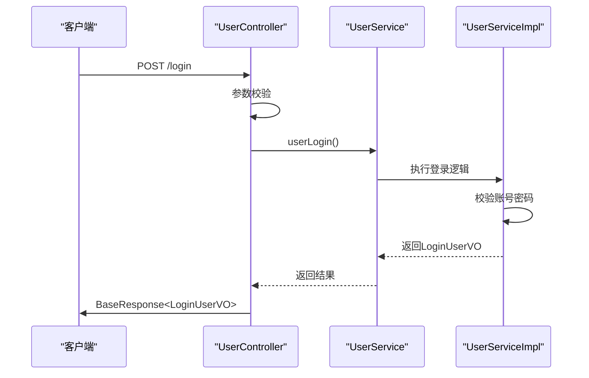

**图示来源**  
- [UserController.java](file://yun-docker-master/src/main/java/com/lfc/yundocker/controller/UserController.java#L72-L83)
- [UserService.java](file://yun-docker-master/src/main/java/com/lfc/yundocker/service/UserService.java#L37)
- [UserServiceImpl.java](file://yun-docker-master/src/main/java/com/lfc/yundocker/service/impl/UserServiceImpl.java#L48)

**本节来源**  
- [UserLoginRequest.java](file://yun-docker-common/src/main/java/com/lfc/yundocker/common/model/dto/user/UserLoginRequest.java)
- [UserRegisterRequest.java](file://yun-docker-common/src/main/java/com/lfc/yundocker/common/model/dto/user/UserRegisterRequest.java)
- [UserController.java](file://yun-docker-master/src/main/java/com/lfc/yundocker/controller/UserController.java)
- [UserServiceImpl.java](file://yun-docker-master/src/main/java/com/lfc/yundocker/service/impl/UserServiceImpl.java)

### 分页与通用响应设计

#### 分页请求设计
`PageRequest` 类作为分页查询的通用请求结构，包含当前页号、页面大小、排序字段和排序顺序等属性，支持灵活的分页和排序功能。

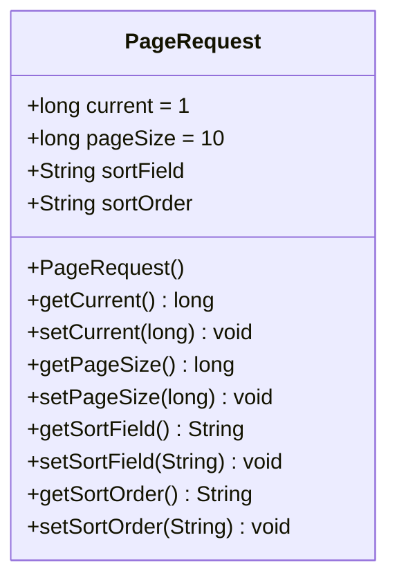

**图示来源**  
- [PageRequest.java](file://yun-docker-common/src/main/java/com/lfc/yundocker/common/model/dto/PageRequest.java)

#### 统一响应封装
`BaseResponse<T>` 类采用泛型设计，作为统一的响应体封装模式，包含状态码、数据和消息三个核心字段，实现类型安全的响应数据封装。

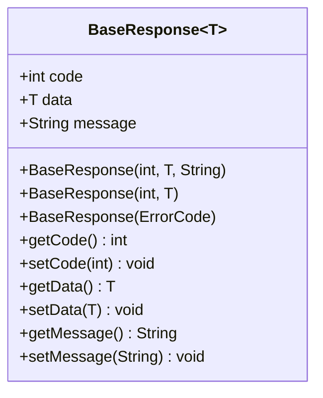

**图示来源**  
- [BaseResponse.java](file://yun-docker-common/src/main/java/com/lfc/yundocker/common/model/dto/BaseResponse.java)

**本节来源**  
- [PageRequest.java](file://yun-docker-common/src/main/java/com/lfc/yundocker/common/model/dto/PageRequest.java)
- [BaseResponse.java](file://yun-docker-common/src/main/java/com/lfc/yundocker/common/model/dto/BaseResponse.java)

### 容器运行参数设计

#### CtrRunRequest字段设计
`CtrRunRequest` 类用于封装容器运行所需的参数，包括镜像ID、宿主机端口、容器端口和自定义容器名称等关键字段，为容器的创建和运行提供完整的配置信息。

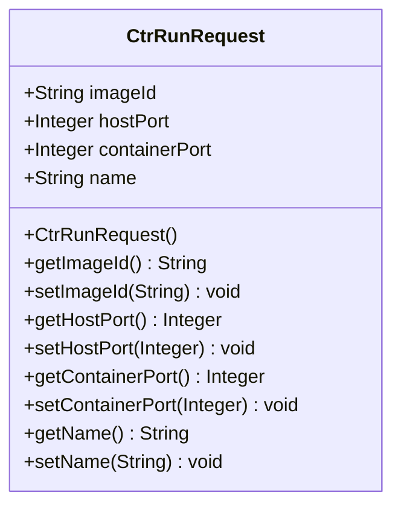

**图示来源**  
- [CtrRunRequest.java](file://yun-docker-common/src/main/java/com/lfc/yundocker/common/model/dto/CtrRunRequest.java)

#### 容器运行流程
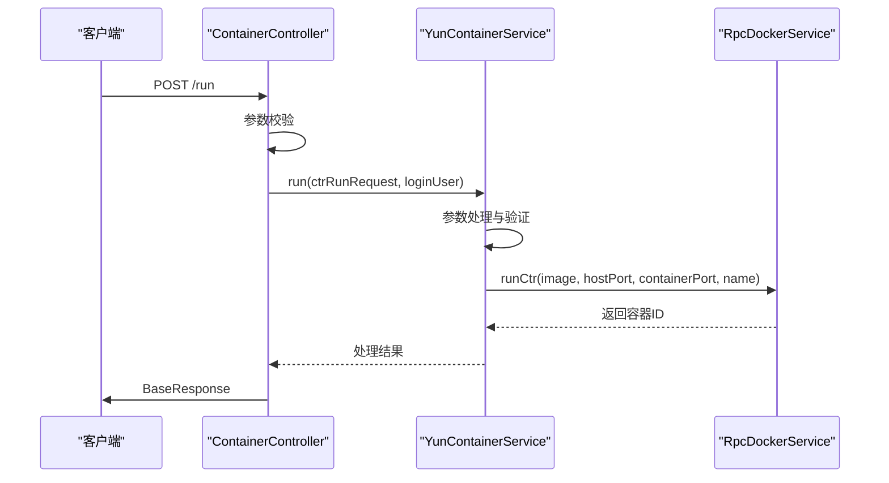

**图示来源**  
- [ContainerController.java](file://yun-docker-master/src/main/java/com/lfc/yundocker/controller/ContainerController.java#L117-L131)
- [YunContainerService.java](file://yun-docker-master/src/main/java/com/lfc/yundocker/service/YunContainerService.java#L27)
- [YunContainerServiceImpl.java](file://yun-docker-master/src/main/java/com/lfc/yundocker/service/impl/YunContainerServiceImpl.java#L137)

**本节来源**  
- [CtrRunRequest.java](file://yun-docker-common/src/main/java/com/lfc/yundocker/common/model/dto/CtrRunRequest.java)
- [ContainerController.java](file://yun-docker-master/src/main/java/com/lfc/yundocker/controller/ContainerController.java)
- [YunContainerServiceImpl.java](file://yun-docker-master/src/main/java/com/lfc/yundocker/service/impl/YunContainerServiceImpl.java)

### 日志与文件上传DTO

#### 日志数据承载
`LogDTO` 类在日志查询中扮演数据承载角色，包含日志内容、类型、操作类型、登录用户、请求参数、IP地址等丰富信息，支持全面的日志记录和查询功能。

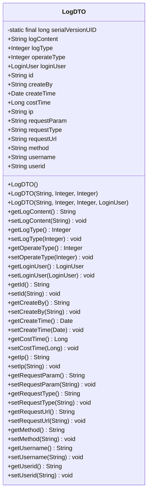

**图示来源**  
- [LogDTO.java](file://yun-docker-common/src/main/java/com/lfc/yundocker/common/model/dto/LogDTO.java)

#### 文件上传请求
`UploadFileRequest` 类用于文件上传场景，包含业务类型字段，用于区分不同业务场景下的文件上传需求。

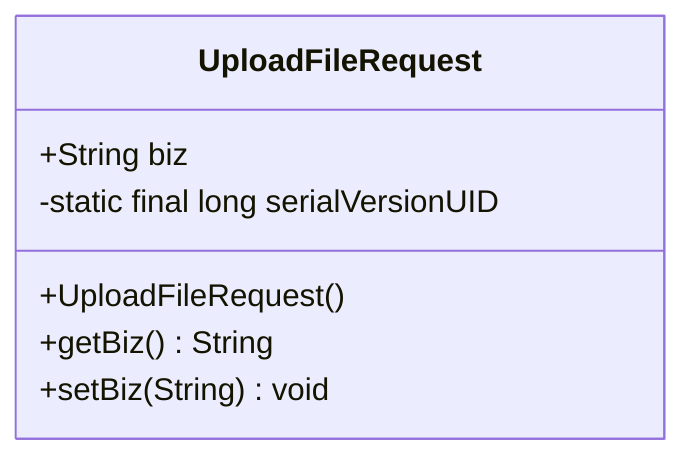

**图示来源**  
- [UploadFileRequest.java](file://yun-docker-common/src/main/java/com/lfc/yundocker/common/model/dto/file/UploadFileRequest.java)

**本节来源**  
- [LogDTO.java](file://yun-docker-common/src/main/java/com/lfc/yundocker/common/model/dto/LogDTO.java)
- [UploadFileRequest.java](file://yun-docker-common/src/main/java/com/lfc/yundocker/common/model/dto/file/UploadFileRequest.java)

## 依赖分析

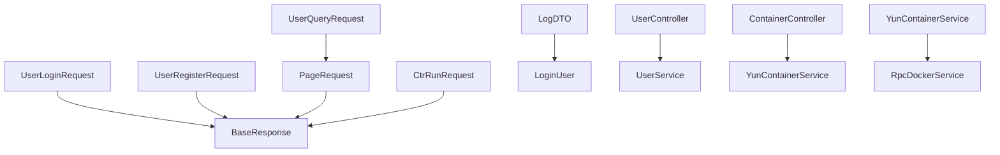

**图示来源**  
- [BaseResponse.java](file://yun-docker-common/src/main/java/com/lfc/yundocker/common/model/dto/BaseResponse.java)
- [UserLoginRequest.java](file://yun-docker-common/src/main/java/com/lfc/yundocker/common/model/dto/user/UserLoginRequest.java)
- [UserRegisterRequest.java](file://yun-docker-common/src/main/java/com/lfc/yundocker/common/model/dto/user/UserRegisterRequest.java)
- [PageRequest.java](file://yun-docker-common/src/main/java/com/lfc/yundocker/common/model/dto/PageRequest.java)
- [CtrRunRequest.java](file://yun-docker-common/src/main/java/com/lfc/yundocker/common/model/dto/CtrRunRequest.java)
- [LogDTO.java](file://yun-docker-common/src/main/java/com/lfc/yundocker/common/model/dto/LogDTO.java)
- [LoginUser.java](file://yun-docker-common/src/main/java/com/lfc/yundocker/common/model/entity/LoginUser.java)
- [UserController.java](file://yun-docker-master/src/main/java/com/lfc/yundocker/controller/UserController.java)
- [ContainerController.java](file://yun-docker-master/src/main/java/com/lfc/yundocker/controller/ContainerController.java)
- [YunContainerService.java](file://yun-docker-master/src/main/java/com/lfc/yundocker/service/YunContainerService.java)

**本节来源**  
- [yun-docker-common/src/main/java/com/lfc/yundocker/common/model/dto](file://yun-docker-common/src/main/java/com/lfc/yundocker/common/model/dto)
- [yun-docker-master/src/main/java/com/lfc/yundocker/controller](file://yun-docker-master/src/main/java/com/lfc/yundocker/controller)
- [yun-docker-master/src/main/java/com/lfc/yundocker/service](file://yun-docker-master/src/main/java/com/lfc/yundocker/service)

## 性能考虑
DTO 设计遵循轻量级原则，仅包含必要的传输字段，避免过度数据传输。通过 Lombok 注解减少样板代码，提高编译效率。泛型 `BaseResponse<T>` 设计避免了类型转换开销，同时保证类型安全。序列化配置中对 Long 类型的特殊处理避免了前端精度丢失问题，提升了用户体验。

## 故障排除指南
当遇到 DTO 相关问题时，可检查以下方面：
1. 确保请求 JSON 结构与 DTO 字段匹配
2. 检查 Jackson 序列化配置是否正确
3. 验证 Lombok 注解处理器是否正常工作
4. 确认泛型类型在响应中正确传递
5. 检查跨服务调用时 DTO 类的版本一致性

**本节来源**  
- [JsonConfig.java](file://yun-docker-master/src/main/java/com/lfc/yundocker/config/JsonConfig.java)
- [BaseResponse.java](file://yun-docker-common/src/main/java/com/lfc/yundocker/common/model/dto/BaseResponse.java)

## 结论
`yun-docker-common` 模块中的 DTO 设计体现了清晰的分层架构思想，通过统一的 `BaseResponse<T>` 响应封装、标准化的请求对象和合理的继承关系，实现了前后端分离架构下的高效数据交互。Lombok 注解的使用显著减少了样板代码，提高了开发效率。DTO 在 Spring MVC 参数绑定和潜在的 Dubbo RPC 调用中都能良好工作，体现了其设计的通用性和可扩展性。