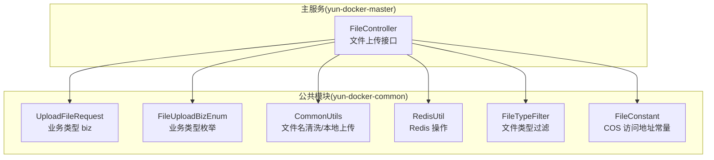
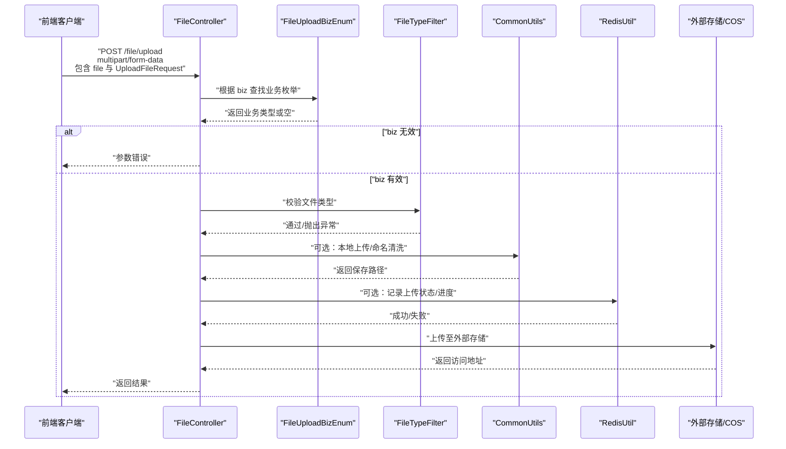
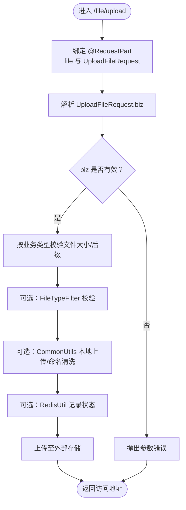
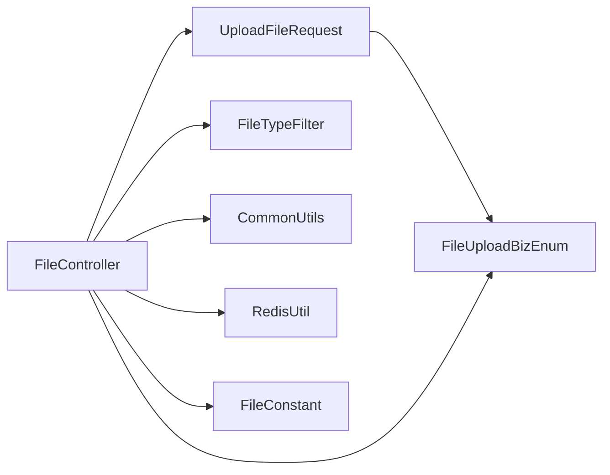

# 文件上传DTO

<cite>
**本文引用的文件**
- [UploadFileRequest.java](file://yun-docker-common/src/main/java/com/lfc/yundocker/common/model/dto/file/UploadFileRequest.java)
- [FileUploadBizEnum.java](file://yun-docker-common/src/main/java/com/lfc/yundocker/common/model/enums/FileUploadBizEnum.java)
- [FileController.java](file://yun-docker-master/src/main/java/com/lfc/yundocker/controller/FileController.java)
- [CommonUtils.java](file://yun-docker-common/src/main/java/com/lfc/yundocker/common/util/CommonUtils.java)
- [RedisUtil.java](file://yun-docker-common/src/main/java/com/lfc/yundocker/common/util/RedisUtil.java)
- [FileTypeFilter.java](file://yun-docker-common/src/main/java/com/lfc/yundocker/common/util/filter/FileTypeFilter.java)
- [FileConstant.java](file://yun-docker-common/src/main/java/com/lfc/yundocker/common/constant/FileConstant.java)
</cite>

## 目录
1. [简介](#简介)
2. [项目结构](#项目结构)
3. [核心组件](#核心组件)
4. [架构总览](#架构总览)
5. [详细组件分析](#详细组件分析)
6. [依赖关系分析](#依赖关系分析)
7. [性能考量](#性能考量)
8. [故障排查指南](#故障排查指南)
9. [结论](#结论)

## 简介
本文件围绕“文件上传请求对象 UploadFileRequest”的设计与应用展开，重点说明：
- DTO 字段定义与用途（业务类型 biz 的取值来源与约束）
- 与 Spring MVC 多部分表单的集成方式（@RequestPart 绑定文件与元数据）
- 在 FileController 中的使用流程与校验逻辑
- 与通用工具类（类型校验、Redis 状态记录）的协作
- 解耦接口参数与内部处理逻辑的设计价值

## 项目结构
- DTO 定义位于公共模块，便于跨模块复用
- 控制器位于 master 模块，负责接收前端请求并编排业务
- 通用工具与常量位于公共模块，提供类型校验、存储路径、Redis 操作等能力

图表来源
- [UploadFileRequest.java](file://yun-docker-common/src/main/java/com/lfc/yundocker/common/model/dto/file/UploadFileRequest.java#L1-L22)
- [FileUploadBizEnum.java](file://yun-docker-common/src/main/java/com/lfc/yundocker/common/model/enums/FileUploadBizEnum.java#L1-L62)
- [FileController.java](file://yun-docker-master/src/main/java/com/lfc/yundocker/controller/FileController.java#L1-L98)
- [CommonUtils.java](file://yun-docker-common/src/main/java/com/lfc/yundocker/common/util/CommonUtils.java#L1-L297)
- [RedisUtil.java](file://yun-docker-common/src/main/java/com/lfc/yundocker/common/util/RedisUtil.java#L1-L615)
- [FileTypeFilter.java](file://yun-docker-common/src/main/java/com/lfc/yundocker/common/util/filter/FileTypeFilter.java#L1-L165)
- [FileConstant.java](file://yun-docker-common/src/main/java/com/lfc/yundocker/common/constant/FileConstant.java#L1-L16)

章节来源
- [UploadFileRequest.java](file://yun-docker-common/src/main/java/com/lfc/yundocker/common/model/dto/file/UploadFileRequest.java#L1-L22)
- [FileController.java](file://yun-docker-master/src/main/java/com/lfc/yundocker/controller/FileController.java#L1-L98)

## 核心组件
- UploadFileRequest：承载上传请求的业务类型标识 biz，作为后续校验与路由的关键输入
- FileUploadBizEnum：统一管理业务类型取值集合，提供按值查找与值列表能力
- FileController：接收前端多部分表单，绑定文件与 UploadFileRequest，执行业务校验与处理
- CommonUtils：提供文件名清洗、本地上传等通用能力
- RedisUtil：提供 Redis 常用操作，可用于上传状态记录与缓存
- FileTypeFilter：基于文件头与后缀的双重校验，提升安全性
- FileConstant：提供外部存储访问地址常量（示例）

章节来源
- [UploadFileRequest.java](file://yun-docker-common/src/main/java/com/lfc/yundocker/common/model/dto/file/UploadFileRequest.java#L1-L22)
- [FileUploadBizEnum.java](file://yun-docker-common/src/main/java/com/lfc/yundocker/common/model/enums/FileUploadBizEnum.java#L1-L62)
- [FileController.java](file://yun-docker-master/src/main/java/com/lfc/yundocker/controller/FileController.java#L1-L98)
- [CommonUtils.java](file://yun-docker-common/src/main/java/com/lfc/yundocker/common/util/CommonUtils.java#L1-L297)
- [RedisUtil.java](file://yun-docker-common/src/main/java/com/lfc/yundocker/common/util/RedisUtil.java#L1-L615)
- [FileTypeFilter.java](file://yun-docker-common/src/main/java/com/lfc/yundocker/common/util/filter/FileTypeFilter.java#L1-L165)
- [FileConstant.java](file://yun-docker-common/src/main/java/com/lfc/yundocker/common/constant/FileConstant.java#L1-L16)

## 架构总览
下图展示从前端到后端的典型上传流程，以及 UploadFileRequest 在其中的角色。

图表来源
- [FileController.java](file://yun-docker-master/src/main/java/com/lfc/yundocker/controller/FileController.java#L1-L98)
- [FileUploadBizEnum.java](file://yun-docker-common/src/main/java/com/lfc/yundocker/common/model/enums/FileUploadBizEnum.java#L1-L62)
- [FileTypeFilter.java](file://yun-docker-common/src/main/java/com/lfc/yundocker/common/util/filter/FileTypeFilter.java#L1-L165)
- [CommonUtils.java](file://yun-docker-common/src/main/java/com/lfc/yundocker/common/util/CommonUtils.java#L1-L297)
- [RedisUtil.java](file://yun-docker-common/src/main/java/com/lfc/yundocker/common/util/RedisUtil.java#L1-L615)
- [FileConstant.java](file://yun-docker-common/src/main/java/com/lfc/yundocker/common/constant/FileConstant.java#L1-L16)

## 详细组件分析

### UploadFileRequest 设计与字段定义
- 字段
  - biz：业务类型标识，用于区分不同上传场景（例如用户头像、资源文件等）
- 设计要点
  - 采用简单 DTO，仅承载必要元数据，降低耦合
  - biz 与 FileUploadBizEnum 的值保持一致，便于统一校验与扩展
- 应用场景
  - 作为 @RequestPart 的一部分被前端提交
  - 由控制器转换为枚举类型，驱动后续校验与存储策略

章节来源
- [UploadFileRequest.java](file://yun-docker-common/src/main/java/com/lfc/yundocker/common/model/dto/file/UploadFileRequest.java#L1-L22)
- [FileUploadBizEnum.java](file://yun-docker-common/src/main/java/com/lfc/yundocker/common/model/enums/FileUploadBizEnum.java#L1-L62)

### FileUploadBizEnum：业务类型枚举
- 能力
  - 提供值列表与按值查找方法
  - 支持根据 value 获取对应枚举实例
- 与 UploadFileRequest 的关系
  - biz 字段的合法值来源于枚举的 value 集合
  - 控制器侧通过 getEnumByValue 校验 biz 是否有效

章节来源
- [FileUploadBizEnum.java](file://yun-docker-common/src/main/java/com/lfc/yundocker/common/model/enums/FileUploadBizEnum.java#L1-L62)

### FileController：上传流程与集成点
- 接口与绑定
  - 使用 @RequestPart 接收 multipart/form-data，分别绑定文件与 UploadFileRequest
  - 通过 biz 字段定位业务类型
- 校验逻辑
  - 校验 biz 是否存在于枚举值集合
  - 根据业务类型对文件大小与后缀进行限制
- 与通用工具协作
  - 可结合 FileTypeFilter 进行更严格的类型校验
  - 可使用 CommonUtils 的文件名清洗与本地上传能力
- 与 Redis 协作
  - 可通过 RedisUtil 记录上传状态、进度或临时元数据
- 与外部存储集成
  - 可参考 FileConstant 中的访问地址常量，拼接最终可访问 URL

图表来源
- [FileController.java](file://yun-docker-master/src/main/java/com/lfc/yundocker/controller/FileController.java#L1-L98)
- [FileUploadBizEnum.java](file://yun-docker-common/src/main/java/com/lfc/yundocker/common/model/enums/FileUploadBizEnum.java#L1-L62)
- [FileTypeFilter.java](file://yun-docker-common/src/main/java/com/lfc/yundocker/common/util/filter/FileTypeFilter.java#L1-L165)
- [CommonUtils.java](file://yun-docker-common/src/main/java/com/lfc/yundocker/common/util/CommonUtils.java#L1-L297)
- [RedisUtil.java](file://yun-docker-common/src/main/java/com/lfc/yundocker/common/util/RedisUtil.java#L1-L615)
- [FileConstant.java](file://yun-docker-common/src/main/java/com/lfc/yundocker/common/constant/FileConstant.java#L1-L16)

章节来源
- [FileController.java](file://yun-docker-master/src/main/java/com/lfc/yundocker/controller/FileController.java#L1-L98)

### 与 Spring 文件上传机制的无缝集成
- 多部分表单支持
  - 控制器通过 @RequestPart 接收文件与 JSON 元数据，天然契合 Spring MVC 的 multipart 解析
- 类型安全与扩展性
  - 通过 FileUploadBizEnum 统一管理业务类型，新增类型只需扩展枚举与校验规则
- 与工具类解耦
  - 业务逻辑集中在控制器，类型校验与存储细节委托给工具类，职责清晰

章节来源
- [FileController.java](file://yun-docker-master/src/main/java/com/lfc/yundocker/controller/FileController.java#L1-L98)
- [FileUploadBizEnum.java](file://yun-docker-common/src/main/java/com/lfc/yundocker/common/model/enums/FileUploadBizEnum.java#L1-L62)
- [FileTypeFilter.java](file://yun-docker-common/src/main/java/com/lfc/yundocker/common/util/filter/FileTypeFilter.java#L1-L165)
- [CommonUtils.java](file://yun-docker-common/src/main/java/com/lfc/yundocker/common/util/CommonUtils.java#L1-L297)

## 依赖关系分析
- UploadFileRequest 与 FileUploadBizEnum
  - UploadFileRequest.biz 作为 FileUploadBizEnum 的输入，二者通过 getEnumByValue 关联
- FileController 与各组件
  - 依赖 FileUploadBizEnum 进行业务类型校验
  - 依赖 FileTypeFilter 执行类型过滤
  - 可选依赖 CommonUtils 与 RedisUtil 完成命名清洗、本地上传与状态记录
  - 依赖 FileConstant 提供访问地址常量
- 耦合与内聚
  - 控制器对 DTO 与枚举存在直接依赖，但通过工具类与常量实现横向解耦
  - 业务类型扩展通过枚举集中管理，避免散落的字符串常量

图表来源
- [UploadFileRequest.java](file://yun-docker-common/src/main/java/com/lfc/yundocker/common/model/dto/file/UploadFileRequest.java#L1-L22)
- [FileUploadBizEnum.java](file://yun-docker-common/src/main/java/com/lfc/yundocker/common/model/enums/FileUploadBizEnum.java#L1-L62)
- [FileController.java](file://yun-docker-master/src/main/java/com/lfc/yundocker/controller/FileController.java#L1-L98)
- [FileTypeFilter.java](file://yun-docker-common/src/main/java/com/lfc/yundocker/common/util/filter/FileTypeFilter.java#L1-L165)
- [CommonUtils.java](file://yun-docker-common/src/main/java/com/lfc/yundocker/common/util/CommonUtils.java#L1-L297)
- [RedisUtil.java](file://yun-docker-common/src/main/java/com/lfc/yundocker/common/util/RedisUtil.java#L1-L615)
- [FileConstant.java](file://yun-docker-common/src/main/java/com/lfc/yundocker/common/constant/FileConstant.java#L1-L16)

章节来源
- [FileController.java](file://yun-docker-master/src/main/java/com/lfc/yundocker/controller/FileController.java#L1-L98)
- [UploadFileRequest.java](file://yun-docker-common/src/main/java/com/lfc/yundocker/common/model/dto/file/UploadFileRequest.java#L1-L22)
- [FileUploadBizEnum.java](file://yun-docker-common/src/main/java/com/lfc/yundocker/common/model/enums/FileUploadBizEnum.java#L1-L62)

## 性能考量
- 文件类型检测
  - FileTypeFilter 通过读取文件头进行匹配，建议仅在必要时启用，避免对大文件造成额外 IO
- 本地上传与存储
  - 本地上传路径与命名策略会影响磁盘 IO 与并发写入性能，建议结合业务场景优化
- Redis 操作
  - 上传状态记录建议使用短 TTL，避免长期占用内存
- 前端分片上传
  - 对于大文件，建议采用分片上传并在 Redis 中维护断点续传状态

## 故障排查指南
- 参数错误
  - biz 不在枚举值集合中会导致参数错误，请检查前端提交的业务类型
- 文件类型错误
  - 后缀不在允许列表或类型检测失败会触发错误，需确认文件实际类型与后缀一致性
- 业务类型扩展
  - 新增业务类型时，需同步更新枚举与控制器校验逻辑
- Redis 写入失败
  - 检查 Redis 连接与权限，确认键空间与 TTL 设置合理
- 本地上传异常
  - 检查磁盘权限、路径是否存在、文件名清洗是否导致冲突

章节来源
- [FileController.java](file://yun-docker-master/src/main/java/com/lfc/yundocker/controller/FileController.java#L1-L98)
- [FileUploadBizEnum.java](file://yun-docker-common/src/main/java/com/lfc/yundocker/common/model/enums/FileUploadBizEnum.java#L1-L62)
- [FileTypeFilter.java](file://yun-docker-common/src/main/java/com/lfc/yundocker/common/util/filter/FileTypeFilter.java#L1-L165)
- [RedisUtil.java](file://yun-docker-common/src/main/java/com/lfc/yundocker/common/util/RedisUtil.java#L1-L615)

## 结论
UploadFileRequest 通过最小化字段设计，将“业务类型”这一关键元数据与 Spring MVC 的多部分表单绑定在一起，配合 FileUploadBizEnum 实现了强类型的业务路由。在 FileController 中，该 DTO 与类型校验、存储策略、Redis 状态记录等形成清晰的职责边界，既保证了接口参数与内部处理逻辑的解耦，又提升了系统的可扩展性与可维护性。建议在新增业务类型时遵循现有模式，统一管理枚举与校验规则，确保上传流程稳定可靠。