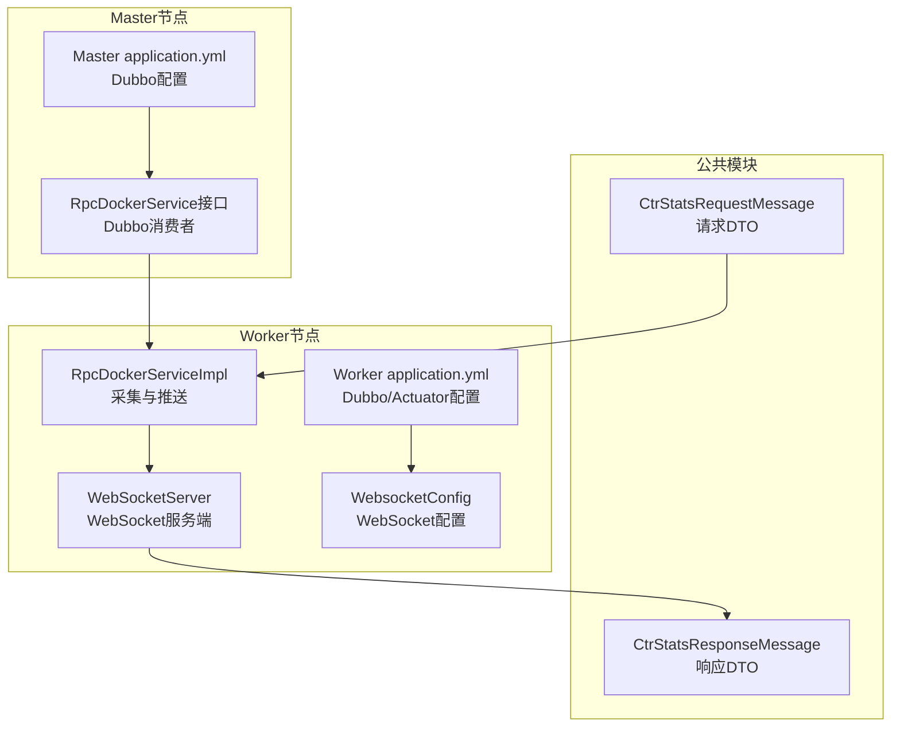
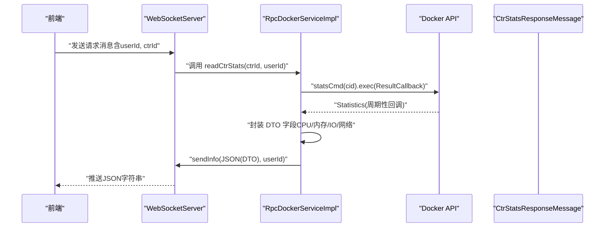
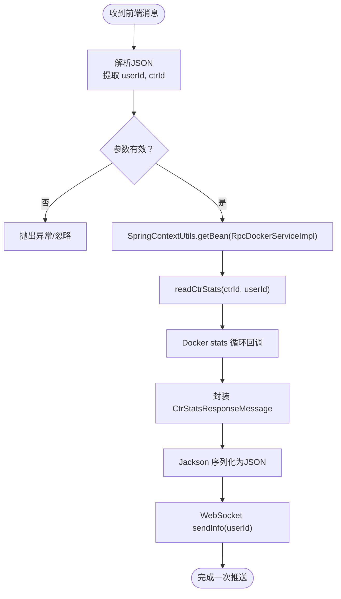
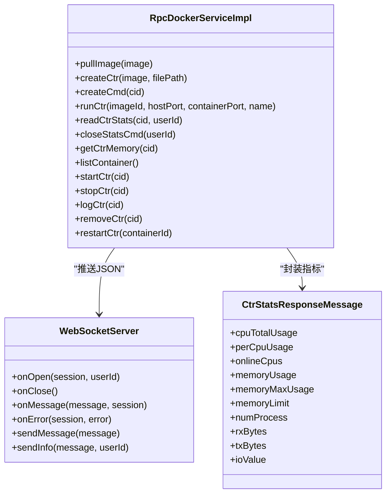
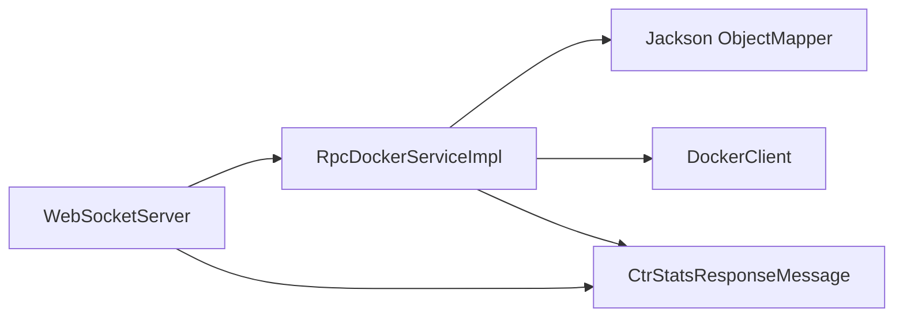

# 消息通信DTO

<cite>
**本文引用的文件**
- [yun-docker-common/src/main/java/com/lfc/yundocker/common/model/dto/message/CtrStatsRequestMessage.java](file://yun-docker-common/src/main/java/com/lfc/yundocker/common/model/dto/message/CtrStatsRequestMessage.java)
- [yun-docker-common/src/main/java/com/lfc/yundocker/common/model/dto/message/CtrStatsResponseMessage.java](file://yun-docker-common/src/main/java/com/lfc/yundocker/common/model/dto/message/CtrStatsResponseMessage.java)
- [yun-docker-worker/src/main/java/com/lfc/yundocker/worker/rpc/RpcDockerServiceImpl.java](file://yun-docker-worker/src/main/java/com/lfc/yundocker/worker/rpc/RpcDockerServiceImpl.java)
- [yun-docker-worker/src/main/java/com/lfc/yundocker/worker/websocket/WebSocketServer.java](file://yun-docker-worker/src/main/java/com/lfc/yundocker/worker/websocket/WebSocketServer.java)
- [yun-docker-worker/src/main/java/com/lfc/yundocker/worker/config/WebsocketConfig.java](file://yun-docker-worker/src/main/java/com/lfc/yundocker/worker/config/WebsocketConfig.java)
- [yun-docker-api/src/main/java/com/lfc/yundocker/service/RpcDockerService.java](file://yun-docker-api/src/main/java/com/lfc/yundocker/service/RpcDockerService.java)
- [yun-docker-worker/src/main/resources/application.yml](file://yun-docker-worker/src/main/resources/application.yml)
- [yun-docker-master/src/main/resources/application.yml](file://yun-docker-master/src/main/resources/application.yml)
- [yun-docker-common/src/main/java/com/lfc/yundocker/common/util/SpringContextUtils.java](file://yun-docker-common/src/main/java/com/lfc/yundocker/common/util/SpringContextUtils.java)
</cite>

## 目录
1. [引言](#引言)
2. [项目结构](#项目结构)
3. [核心组件](#核心组件)
4. [架构总览](#架构总览)
5. [详细组件分析](#详细组件分析)
6. [依赖分析](#依赖分析)
7. [性能考量](#性能考量)
8. [故障排查指南](#故障排查指南)
9. [结论](#结论)

## 引言
本文件围绕容器监控消息DTO在实时通信中的设计与应用展开，重点解析：
- CtrStatsRequestMessage：Worker节点向Master请求容器状态的请求消息结构，包含用户ID与容器ID等关键标识字段。
- CtrStatsResponseMessage：响应消息，封装CPU使用率、内存占用、网络IO、磁盘IO等监控指标，并通过WebSocket或RPC回调返回。
- 结合MetricsCollector监控组件与WebSocketServer实现，说明这些DTO如何在跨节点通信中实现容器资源数据的高效传输。
- 讨论序列化性能考量（如JSON格式）以及与前端监控图表的数据绑定方式。

## 项目结构
该仓库采用多模块结构，消息DTO位于公共模块，Worker侧负责采集与推送，Master侧负责消费与转发（通过Dubbo RPC）。WebSocket用于实时推送，Dubbo用于跨节点调用。

图示来源
- [yun-docker-common/src/main/java/com/lfc/yundocker/common/model/dto/message/CtrStatsRequestMessage.java](file://yun-docker-common/src/main/java/com/lfc/yundocker/common/model/dto/message/CtrStatsRequestMessage.java#L1-L17)
- [yun-docker-common/src/main/java/com/lfc/yundocker/common/model/dto/message/CtrStatsResponseMessage.java](file://yun-docker-common/src/main/java/com/lfc/yundocker/common/model/dto/message/CtrStatsResponseMessage.java#L1-L69)
- [yun-docker-worker/src/main/java/com/lfc/yundocker/worker/rpc/RpcDockerServiceImpl.java](file://yun-docker-worker/src/main/java/com/lfc/yundocker/worker/rpc/RpcDockerServiceImpl.java#L196-L278)
- [yun-docker-worker/src/main/java/com/lfc/yundocker/worker/websocket/WebSocketServer.java](file://yun-docker-worker/src/main/java/com/lfc/yundocker/worker/websocket/WebSocketServer.java#L90-L120)
- [yun-docker-worker/src/main/java/com/lfc/yundocker/worker/config/WebsocketConfig.java](file://yun-docker-worker/src/main/java/com/lfc/yundocker/worker/config/WebsocketConfig.java#L1-L20)
- [yun-docker-worker/src/main/resources/application.yml](file://yun-docker-worker/src/main/resources/application.yml#L1-L51)
- [yun-docker-master/src/main/resources/application.yml](file://yun-docker-master/src/main/resources/application.yml#L1-L60)
- [yun-docker-api/src/main/java/com/lfc/yundocker/service/RpcDockerService.java](file://yun-docker-api/src/main/java/com/lfc/yundocker/service/RpcDockerService.java#L65-L78)

章节来源
- [yun-docker-worker/src/main/resources/application.yml](file://yun-docker-worker/src/main/resources/application.yml#L1-L51)
- [yun-docker-master/src/main/resources/application.yml](file://yun-docker-master/src/main/resources/application.yml#L1-L60)

## 核心组件
- 请求DTO：CtrStatsRequestMessage
  - 字段：用户ID、容器ID
  - 用途：作为请求消息载体，承载Worker侧发起的容器监控请求上下文
- 响应DTO：CtrStatsResponseMessage
  - 字段：CPU总量、每核使用、在线CPU数、内存使用/最大/限制、进程数、网络入/出、磁盘IO
  - 用途：封装容器资源指标，供WebSocket或RPC回调返回

章节来源
- [yun-docker-common/src/main/java/com/lfc/yundocker/common/model/dto/message/CtrStatsRequestMessage.java](file://yun-docker-common/src/main/java/com/lfc/yundocker/common/model/dto/message/CtrStatsRequestMessage.java#L12-L16)
- [yun-docker-common/src/main/java/com/lfc/yundocker/common/model/dto/message/CtrStatsResponseMessage.java](file://yun-docker-common/src/main/java/com/lfc/yundocker/common/model/dto/message/CtrStatsResponseMessage.java#L14-L68)

## 架构总览
Worker侧通过Dubbo接口暴露容器监控能力，Master侧作为消费者调用；Worker侧同时提供WebSocket服务，将实时监控数据推送给前端。整体流程如下：

图示来源
- [yun-docker-worker/src/main/java/com/lfc/yundocker/worker/websocket/WebSocketServer.java](file://yun-docker-worker/src/main/java/com/lfc/yundocker/worker/websocket/WebSocketServer.java#L90-L120)
- [yun-docker-worker/src/main/java/com/lfc/yundocker/worker/rpc/RpcDockerServiceImpl.java](file://yun-docker-worker/src/main/java/com/lfc/yundocker/worker/rpc/RpcDockerServiceImpl.java#L196-L278)
- [yun-docker-common/src/main/java/com/lfc/yundocker/common/model/dto/message/CtrStatsResponseMessage.java](file://yun-docker-common/src/main/java/com/lfc/yundocker/common/model/dto/message/CtrStatsResponseMessage.java#L14-L68)

## 详细组件分析

### 请求消息DTO：CtrStatsRequestMessage
- 设计要点
  - 继承序列化接口，便于在网络上传输
  - 包含用户ID与容器ID，确保监控数据与用户会话关联
- 数据结构与复杂度
  - 字段均为标量或简单集合，序列化/反序列化开销低
  - 作为消息载体，复杂度主要取决于上层解析与路由逻辑
- 错误处理与边界
  - 若缺少用户ID或容器ID，应在上层校验阶段拦截
  - 建议对容器ID做合法性校验，防止非法输入

章节来源
- [yun-docker-common/src/main/java/com/lfc/yundocker/common/model/dto/message/CtrStatsRequestMessage.java](file://yun-docker-common/src/main/java/com/lfc/yundocker/common/model/dto/message/CtrStatsRequestMessage.java#L12-L16)

### 响应消息DTO：CtrStatsResponseMessage
- 字段覆盖范围
  - CPU：总量、每核使用、在线CPU数
  - 内存：当前使用、最大使用、限制
  - IO：进程数、网络入/出、磁盘IO
- 数据封装与转换
  - Worker侧从Docker API的Statistics对象中提取指标，进行单位换算与聚合（如网络/IO按接口聚合）
  - 通过Jackson将DTO序列化为JSON字符串，再经WebSocket推送
- 性能与精度
  - 单次序列化成本低，但高频推送需关注带宽与前端渲染压力
  - 建议前端按需订阅字段，减少冗余传输

章节来源
- [yun-docker-common/src/main/java/com/lfc/yundocker/common/model/dto/message/CtrStatsResponseMessage.java](file://yun-docker-common/src/main/java/com/lfc/yundocker/common/model/dto/message/CtrStatsResponseMessage.java#L14-L68)
- [yun-docker-worker/src/main/java/com/lfc/yundocker/worker/rpc/RpcDockerServiceImpl.java](file://yun-docker-worker/src/main/java/com/lfc/yundocker/worker/rpc/RpcDockerServiceImpl.java#L207-L233)

### WebSocketServer：实时推送通道
- 连接管理
  - 基于用户ID维护WebSocket会话映射，支持重连替换与在线计数
- 消息处理
  - 解析前端发送的JSON请求，提取用户ID与容器ID
  - 通过Spring上下文获取RpcDockerServiceImpl，触发容器统计采集
- 推送机制
  - 将DTO序列化后的JSON字符串通过WebSocket发送至对应用户

图示来源
- [yun-docker-worker/src/main/java/com/lfc/yundocker/worker/websocket/WebSocketServer.java](file://yun-docker-worker/src/main/java/com/lfc/yundocker/worker/websocket/WebSocketServer.java#L90-L120)
- [yun-docker-worker/src/main/java/com/lfc/yundocker/worker/rpc/RpcDockerServiceImpl.java](file://yun-docker-worker/src/main/java/com/lfc/yundocker/worker/rpc/RpcDockerServiceImpl.java#L196-L278)
- [yun-docker-common/src/main/java/com/lfc/yundocker/common/util/SpringContextUtils.java](file://yun-docker-common/src/main/java/com/lfc/yundocker/common/util/SpringContextUtils.java#L76-L95)

章节来源
- [yun-docker-worker/src/main/java/com/lfc/yundocker/worker/websocket/WebSocketServer.java](file://yun-docker-worker/src/main/java/com/lfc/yundocker/worker/websocket/WebSocketServer.java#L25-L174)
- [yun-docker-worker/src/main/java/com/lfc/yundocker/worker/config/WebsocketConfig.java](file://yun-docker-worker/src/main/java/com/lfc/yundocker/worker/config/WebsocketConfig.java#L1-L20)

### RpcDockerServiceImpl：监控采集与推送
- 采集流程
  - 调用Docker statsCmd，注册ResultCallback，周期性接收Statistics
  - 将Statistics映射到CtrStatsResponseMessage，进行单位换算与聚合
- 推送策略
  - 使用Jackson将DTO转为JSON字符串，调用WebSocketServer.sendInfo(userId)推送
  - 维护STATS_CMD_MAP，按用户ID管理统计命令生命周期，支持关闭
- 错误处理
  - onNext/onError回调中记录日志，必要时抛出业务异常
  - 关闭命令时捕获IO异常并转换为业务异常

图示来源
- [yun-docker-worker/src/main/java/com/lfc/yundocker/worker/rpc/RpcDockerServiceImpl.java](file://yun-docker-worker/src/main/java/com/lfc/yundocker/worker/rpc/RpcDockerServiceImpl.java#L196-L278)
- [yun-docker-worker/src/main/java/com/lfc/yundocker/worker/websocket/WebSocketServer.java](file://yun-docker-worker/src/main/java/com/lfc/yundocker/worker/websocket/WebSocketServer.java#L132-L157)
- [yun-docker-common/src/main/java/com/lfc/yundocker/common/model/dto/message/CtrStatsResponseMessage.java](file://yun-docker-common/src/main/java/com/lfc/yundocker/common/model/dto/message/CtrStatsResponseMessage.java#L14-L68)

章节来源
- [yun-docker-worker/src/main/java/com/lfc/yundocker/worker/rpc/RpcDockerServiceImpl.java](file://yun-docker-worker/src/main/java/com/lfc/yundocker/worker/rpc/RpcDockerServiceImpl.java#L196-L278)

### Dubbo接口与跨节点通信
- 接口定义
  - RpcDockerService提供容器监控相关方法，包括readCtrStats与closeStatsCmd
- 调用关系
  - WebSocketServer通过Spring上下文获取实现类，调用readCtrStats
  - Master侧可作为Dubbo消费者调用Worker侧提供的服务（接口定义在API模块）

章节来源
- [yun-docker-api/src/main/java/com/lfc/yundocker/service/RpcDockerService.java](file://yun-docker-api/src/main/java/com/lfc/yundocker/service/RpcDockerService.java#L65-L78)
- [yun-docker-worker/src/main/java/com/lfc/yundocker/worker/websocket/WebSocketServer.java](file://yun-docker-worker/src/main/java/com/lfc/yundocker/worker/websocket/WebSocketServer.java#L110-L115)

## 依赖分析
- 组件耦合
  - WebSocketServer与RpcDockerServiceImpl通过Spring上下文解耦，降低直接依赖
  - DTO作为纯数据载体，不引入业务逻辑，利于复用
- 外部依赖
  - Docker Java SDK：提供statsCmd与Statistics模型
  - Jackson：JSON序列化
  - WebSocket API：javax.websocket
  - Dubbo：跨节点RPC调用

图示来源
- [yun-docker-worker/src/main/java/com/lfc/yundocker/worker/websocket/WebSocketServer.java](file://yun-docker-worker/src/main/java/com/lfc/yundocker/worker/websocket/WebSocketServer.java#L90-L120)
- [yun-docker-worker/src/main/java/com/lfc/yundocker/worker/rpc/RpcDockerServiceImpl.java](file://yun-docker-worker/src/main/java/com/lfc/yundocker/worker/rpc/RpcDockerServiceImpl.java#L196-L278)
- [yun-docker-common/src/main/java/com/lfc/yundocker/common/model/dto/message/CtrStatsResponseMessage.java](file://yun-docker-common/src/main/java/com/lfc/yundocker/common/model/dto/message/CtrStatsResponseMessage.java#L14-L68)

## 性能考量
- 序列化开销
  - 使用Jackson将DTO序列化为JSON字符串，单次开销较低；高频推送建议评估带宽与前端渲染压力
- 数据聚合与单位换算
  - 对网络/IO等指标进行聚合与单位换算，减少前端计算负担
- 生命周期管理
  - STATS_CMD_MAP按用户维度管理统计命令，避免重复创建；关闭时释放资源
- 并发与线程安全
  - WebSocket会话映射使用并发容器；在线计数同步控制

章节来源
- [yun-docker-worker/src/main/java/com/lfc/yundocker/worker/rpc/RpcDockerServiceImpl.java](file://yun-docker-worker/src/main/java/com/lfc/yundocker/worker/rpc/RpcDockerServiceImpl.java#L256-L278)
- [yun-docker-worker/src/main/java/com/lfc/yundocker/worker/websocket/WebSocketServer.java](file://yun-docker-worker/src/main/java/com/lfc/yundocker/worker/websocket/WebSocketServer.java#L30-L80)

## 故障排查指南
- WebSocket连接问题
  - 检查WebSocketServer的连接/关闭回调日志，确认用户ID映射是否正确
  - 确认WebsocketConfig已启用ServerEndpointExporter
- 推送失败
  - 核查sendInfo方法的用户在线状态与会话有效性
  - 捕获并记录IOException，转换为业务异常
- 监控采集异常
  - onNext回调中记录Docker API错误信息
  - 关闭命令时捕获IO异常并转换为业务异常
- 配置检查
  - Worker与Master的Dubbo配置与端口需一致且可达
  - Actuator暴露Prometheus端点，便于外部监控

章节来源
- [yun-docker-worker/src/main/java/com/lfc/yundocker/worker/websocket/WebSocketServer.java](file://yun-docker-worker/src/main/java/com/lfc/yundocker/worker/websocket/WebSocketServer.java#L69-L82)
- [yun-docker-worker/src/main/java/com/lfc/yundocker/worker/websocket/WebSocketServer.java](file://yun-docker-worker/src/main/java/com/lfc/yundocker/worker/websocket/WebSocketServer.java#L132-L157)
- [yun-docker-worker/src/main/java/com/lfc/yundocker/worker/rpc/RpcDockerServiceImpl.java](file://yun-docker-worker/src/main/java/com/lfc/yundocker/worker/rpc/RpcDockerServiceImpl.java#L235-L240)
- [yun-docker-worker/src/main/java/com/lfc/yundocker/worker/rpc/RpcDockerServiceImpl.java](file://yun-docker-worker/src/main/java/com/lfc/yundocker/worker/rpc/RpcDockerServiceImpl.java#L268-L278)
- [yun-docker-worker/src/main/resources/application.yml](file://yun-docker-worker/src/main/resources/application.yml#L41-L51)
- [yun-docker-master/src/main/resources/application.yml](file://yun-docker-master/src/main/resources/application.yml#L1-L60)

## 结论
- CtrStatsRequestMessage与CtrStatsResponseMessage作为轻量级数据载体，清晰地定义了容器监控请求与响应的契约
- Worker侧通过RpcDockerServiceImpl与Docker API交互，将周期性统计数据封装为DTO并通过WebSocket实时推送
- WebSocketServer负责会话管理与消息转发，配合Spring上下文实现非侵入式依赖注入
- 建议在前端按需订阅字段、优化渲染频率，并在高并发场景下考虑限流与缓存策略，以提升整体性能与稳定性