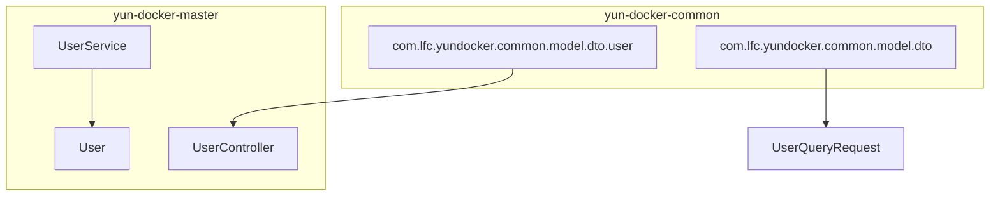
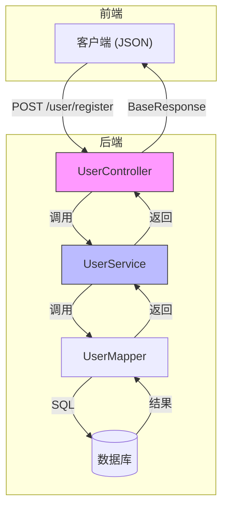
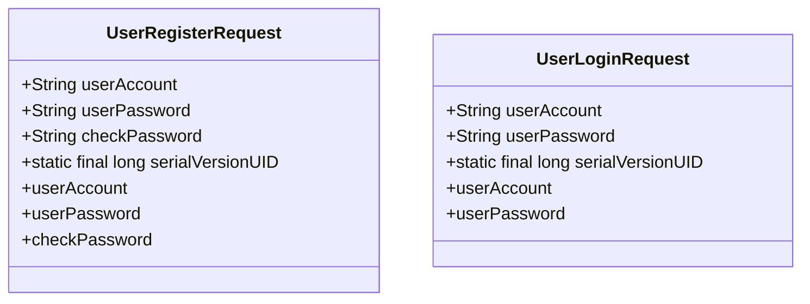
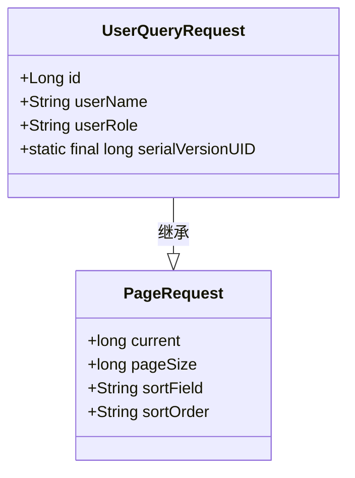
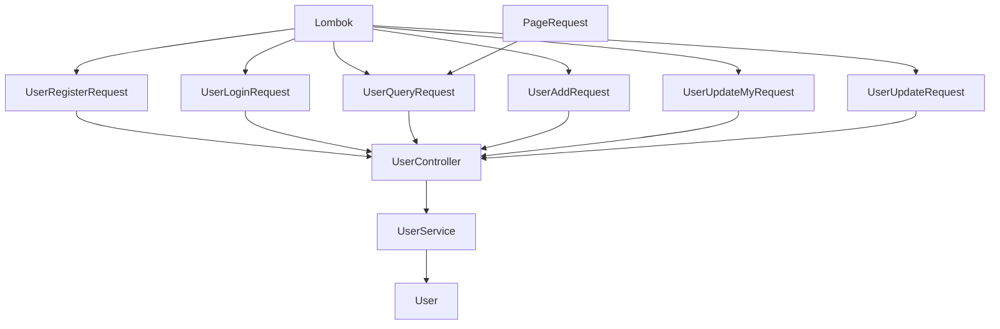

# 用户相关DTO

<cite>
**本文档引用的文件**
- [UserRegisterRequest.java](file://yun-docker-common/src/main/java/com/lfc/yundocker/common/model/dto/user/UserRegisterRequest.java)
- [UserLoginRequest.java](file://yun-docker-common/src/main/java/com/lfc/yundocker/common/model/dto/user/UserLoginRequest.java)
- [UserQueryRequest.java](file://yun-docker-common/src/main/java/com/lfc/yundocker/common/model/dto/user/UserQueryRequest.java)
- [UserAddRequest.java](file://yun-docker-common/src/main/java/com/lfc/yundocker/common/model/dto/user/UserAddRequest.java)
- [UserUpdateMyRequest.java](file://yun-docker-common/src/main/java/com/lfc/yundocker/common/model/dto/user/UserUpdateMyRequest.java)
- [UserUpdateRequest.java](file://yun-docker-common/src/main/java/com/lfc/yundocker/common/model/dto/user/UserUpdateRequest.java)
- [PageRequest.java](file://yun-docker-common/src/main/java/com/lfc/yundocker/common/model/dto/PageRequest.java)
- [UserController.java](file://yun-docker-master/src/main/java/com/lfc/yundocker/controller/UserController.java)
- [UserService.java](file://yun-docker-master/src/main/java/com/lfc/yundocker/service/UserService.java)
- [UserServiceImpl.java](file://yun-docker-master/src/main/java/com/lfc/yundocker/service/impl/UserServiceImpl.java)
- [User.java](file://yun-docker-master/src/main/java/com/lfc/yundocker/common/model/entity/User.java)
- [UserConstant.java](file://yun-docker-common/src/main/java/com/lfc/yundocker/common/constant/UserConstant.java)
</cite>

## 目录
1. [简介](#简介)
2. [项目结构](#项目结构)
3. [核心组件](#核心组件)
4. [架构概述](#架构概述)
5. [详细组件分析](#详细组件分析)
6. [依赖分析](#依赖分析)
7. [性能考虑](#性能考虑)
8. [故障排除指南](#故障排除指南)
9. [结论](#结论)

## 简介
本文档详细说明了云Docker后端项目中用户相关数据传输对象（DTO）的设计与实现。重点解析了用户注册、登录、查询、添加和更新等操作中使用的DTO类，包括它们的参数封装、校验逻辑、权限控制以及与Spring MVC框架的集成方式。文档还阐述了Lombok注解在减少样板代码方面的作用，并说明了这些DTO如何与实体类和控制器协同工作，实现安全、高效的数据传输。

## 项目结构
用户相关的DTO位于`yun-docker-common`模块的`com.lfc.yundocker.common.model.dto.user`包中，这种设计将数据传输对象与业务逻辑和持久层分离，提高了代码的可维护性和复用性。DTO类被`yun-docker-master`模块中的`UserController`直接引用，实现了前后端之间的数据契约。`PageRequest`作为基础分页类被`UserQueryRequest`继承，体现了代码的复用性。



**图示来源**
- [UserRegisterRequest.java](file://yun-docker-common/src/main/java/com/lfc/yundocker/common/model/dto/user/UserRegisterRequest.java)
- [UserQueryRequest.java](file://yun-docker-common/src/main/java/com/lfc/yundocker/common/model/dto/user/UserQueryRequest.java)
- [UserController.java](file://yun-docker-master/src/main/java/com/lfc/yundocker/controller/UserController.java)

**本节来源**
- [UserRegisterRequest.java](file://yun-docker-common/src/main/java/com/lfc/yundocker/common/model/dto/user/UserRegisterRequest.java)
- [UserQueryRequest.java](file://yun-docker-common/src/main/java/com/lfc/yundocker/common/model/dto/user/UserQueryRequest.java)
- [UserController.java](file://yun-docker-master/src/main/java/com/lfc/yundocker/controller/UserController.java)

## 核心组件
核心组件包括六个用户相关的DTO：`UserRegisterRequest`、`UserLoginRequest`、`UserQueryRequest`、`UserAddRequest`、`UserUpdateMyRequest`和`UserUpdateRequest`。这些类均使用Lombok的`@Data`注解自动生成getter、setter、toString等方法，极大地减少了样板代码。它们都实现了`Serializable`接口，确保了对象在网络传输中的可序列化性。每个DTO都专注于单一的业务场景，遵循了单一职责原则。

**本节来源**
- [UserRegisterRequest.java](file://yun-docker-common/src/main/java/com/lfc/yundocker/common/model/dto/user/UserRegisterRequest.java)
- [UserLoginRequest.java](file://yun-docker-common/src/main/java/com/lfc/yundocker/common/model/dto/user/UserLoginRequest.java)
- [UserQueryRequest.java](file://yun-docker-common/src/main/java/com/lfc/yundocker/common/model/dto/user/UserQueryRequest.java)

## 架构概述
系统采用典型的分层架构，DTO位于表现层，作为控制器接收前端请求的载体。当请求到达`UserController`时，Spring MVC框架会自动将JSON请求体反序列化为对应的DTO对象。随后，控制器调用`UserService`进行业务处理，服务层再与`User`实体类和数据库进行交互。这种架构清晰地分离了关注点，DTO负责数据传输和初步校验，服务层负责业务逻辑，实体类负责数据持久化。



**图示来源**
- [UserController.java](file://yun-docker-master/src/main/java/com/lfc/yundocker/controller/UserController.java)
- [UserService.java](file://yun-docker-master/src/main/java/com/lfc/yundocker/service/UserService.java)
- [User.java](file://yun-docker-master/src/main/java/com/lfc/yundocker/common/model/entity/User.java)

## 详细组件分析
本节将深入分析各个用户DTO的设计细节、使用场景及其在系统中的作用。

### 用户注册与登录请求分析
`UserRegisterRequest`和`UserLoginRequest`是用户身份认证流程的入口DTO。`UserRegisterRequest`包含`userAccount`、`userPassword`和`checkPassword`三个字段，分别对应用户账号、密码和密码确认。虽然在当前代码中未直接使用JSR-303注解进行校验，但在`UserController`的`userRegister`方法中，通过`StringUtils.isAnyBlank`手动实现了非空校验，并在`UserServiceImpl`中对密码长度和一致性进行了业务逻辑校验。`UserLoginRequest`结构更简单，仅包含账号和密码，其校验逻辑同样在服务层实现。



**图示来源**
- [UserRegisterRequest.java](file://yun-docker-common/src/main/java/com/lfc/yundocker/common/model/dto/user/UserRegisterRequest.java)
- [UserLoginRequest.java](file://yun-docker-common/src/main/java/com/lfc/yundocker/common/model/dto/user/UserLoginRequest.java)

**本节来源**
- [UserRegisterRequest.java](file://yun-docker-common/src/main/java/com/lfc/yundocker/common/model/dto/user/UserRegisterRequest.java)
- [UserLoginRequest.java](file://yun-docker-common/src/main/java/com/lfc/yundocker/common/model/dto/user/UserLoginRequest.java)
- [UserController.java](file://yun-docker-master/src/main/java/com/lfc/yundocker/controller/UserController.java#L50-L63)
- [UserServiceImpl.java](file://yun-docker-master/src/main/java/com/lfc/yundocker/service/impl/UserServiceImpl.java#L48-L87)

### 用户查询请求分析
`UserQueryRequest`用于管理员分页查询用户列表，它继承了`PageRequest`类，从而获得了分页能力（`current`页码和`pageSize`每页大小）。此外，它还定义了`id`、`userName`和`userRole`三个查询条件字段，允许管理员根据用户ID、昵称或角色进行筛选。在`UserController`的`listUserByPage`方法中，该DTO对象被传递给`UserService`的`getQueryWrapper`方法，由服务层根据DTO中的非空字段动态构建MyBatis Plus的`QueryWrapper`查询条件，实现了灵活的条件查询。



**图示来源**
- [UserQueryRequest.java](file://yun-docker-common/src/main/java/com/lfc/yundocker/common/model/dto/user/UserQueryRequest.java)
- [PageRequest.java](file://yun-docker-common/src/main/java/com/lfc/yundocker/common/model/dto/PageRequest.java)

**本节来源**
- [UserQueryRequest.java](file://yun-docker-common/src/main/java/com/lfc/yundocker/common/model/dto/user/UserQueryRequest.java)
- [PageRequest.java](file://yun-docker-common/src/main/java/com/lfc/yundocker/common/model/dto/PageRequest.java)
- [UserController.java](file://yun-docker-master/src/main/java/com/lfc/yundocker/controller/UserController.java#L249-L258)
- [UserServiceImpl.java](file://yun-docker-master/src/main/java/com/lfc/yundocker/service/impl/UserServiceImpl.java#L276-L292)

### 用户添加与更新请求分析
`UserAddRequest`和`UserUpdateRequest`用于管理员对用户信息的管理。`UserAddRequest`包含创建用户所需的`userName`、`userAccount`、`userAvatar`和`userRole`字段，其中`userRole`允许管理员指定新用户的角色（如admin或user）。`UserUpdateRequest`结构类似，但多了一个`id`字段用于指定要更新的用户。这两个操作都受到`@AuthCheck(mustRole = UserConstant.ADMIN_ROLE)`注解的保护，确保只有管理员才能执行。相比之下，`UserUpdateMyRequest`专为普通用户设计，只允许用户更新自己的`userName`和`userAvatar`，且没有`id`字段，其`id`由`UserService`从当前登录会话中获取，体现了权限的最小化原则。

```mermaid
classDiagram
class UserAddRequest {
+String userName
+String userAccount
+String userAvatar
+String userRole
+static final long serialVersionUID
}
class UserUpdateRequest {
+Long id
+String userName
+String userAvatar
+String userRole
+static final long serialVersionUID
}
class UserUpdateMyRequest {
+String userName
+String userAvatar
+static final long serialVersionUID
}
note right of UserUpdateMyRequest
普通用户只能更新自己的信息
id从登录态中获取
end note
```

**图示来源**
- [UserAddRequest.java](file://yun-docker-common/src/main/java/com/lfc/yundocker/common/model/dto/user/UserAddRequest.java)
- [UserUpdateRequest.java](file://yun-docker-common/src/main/java/com/lfc/yundocker/common/model/dto/user/UserUpdateRequest.java)
- [UserUpdateMyRequest.java](file://yun-docker-common/src/main/java/com/lfc/yundocker/common/model/dto/user/UserUpdateMyRequest.java)

**本节来源**
- [UserAddRequest.java](file://yun-docker-common/src/main/java/com/lfc/yundocker/common/model/dto/user/UserAddRequest.java)
- [UserUpdateRequest.java](file://yun-docker-common/src/main/java/com/lfc/yundocker/common/model/dto/user/UserUpdateRequest.java)
- [UserUpdateMyRequest.java](file://yun-docker-common/src/main/java/com/lfc/yundocker/common/model/dto/user/UserUpdateMyRequest.java)
- [UserController.java](file://yun-docker-master/src/main/java/com/lfc/yundocker/controller/UserController.java#L147-L158)
- [UserController.java](file://yun-docker-master/src/main/java/com/lfc/yundocker/controller/UserController.java#L294-L307)

## 依赖分析
DTO组件的依赖关系清晰且单向。`UserQueryRequest`依赖于`PageRequest`，实现了分页功能的复用。所有DTO类都依赖于Lombok库的`@Data`注解。`UserController`作为高层模块，依赖于这些DTO类作为其方法参数。`UserService`的接口和实现类则依赖于`User`实体类，而DTO与实体类之间的转换通过`BeanUtils.copyProperties`方法完成，这表明DTO与持久层是解耦的。整个依赖流从控制器到服务再到数据访问层，符合依赖倒置原则。



**图示来源**
- [UserRegisterRequest.java](file://yun-docker-common/src/main/java/com/lfc/yundocker/common/model/dto/user/UserRegisterRequest.java)
- [UserQueryRequest.java](file://yun-docker-common/src/main/java/com/lfc/yundocker/common/model/dto/user/UserQueryRequest.java)
- [UserController.java](file://yun-docker-master/src/main/java/com/lfc/yundocker/controller/UserController.java)
- [User.java](file://yun-docker-master/src/main/java/com/lfc/yundocker/common/model/entity/User.java)

**本节来源**
- [UserRegisterRequest.java](file://yun-docker-common/src/main/java/com/lfc/yundocker/common/model/dto/user/UserRegisterRequest.java)
- [UserQueryRequest.java](file://yun-docker-common/src/main/java/com/lfc/yundocker/common/model/dto/user/UserQueryRequest.java)
- [UserController.java](file://yun-docker-master/src/main/java/com/lfc/yundocker/controller/UserController.java)
- [UserServiceImpl.java](file://yun-docker-master/src/main/java/com/lfc/yundocker/service/impl/UserServiceImpl.java)

## 性能考虑
在性能方面，DTO的设计有助于减少网络传输的数据量，只传输接口所需的数据。`UserQueryRequest`支持分页和条件查询，避免了全表扫描，提高了数据库查询效率。`UserController`中的`listUserVOByPage`方法对分页大小进行了限制（`size > 20`时抛出异常），这是一种有效的防爬虫和防滥用措施，保护了后端服务。此外，`UserServiceImpl`中对用户注册和登录的校验逻辑使用了`synchronized`块，虽然保证了线程安全，但也可能成为性能瓶颈，在高并发场景下可能需要考虑使用分布式锁或更高效的并发控制策略。

## 故障排除指南
当遇到与用户DTO相关的问题时，可以按照以下步骤进行排查：
1.  **请求参数错误**：如果收到`PARAMS_ERROR`，检查前端传递的JSON字段名是否与DTO中的属性名完全匹配，并确认必填字段不为空。
2.  **权限不足**：对于`addUser`、`updateUser`等操作，如果收到`FORBIDDEN_ERROR`，请确认调用者是否为管理员角色。
3.  **登录失败**：检查账号密码是否正确，确认密码已按`SALT + password`的方式进行MD5加密。
4.  **未登录状态**：如果操作需要登录态而失败，请检查`USER_LOGIN_STATE`的Session是否已正确设置。
5.  **分页查询无结果**：确认`current`和`pageSize`参数是否合理，以及查询条件（如`userName`）是否准确。

**本节来源**
- [UserController.java](file://yun-docker-master/src/main/java/com/lfc/yundocker/controller/UserController.java)
- [UserServiceImpl.java](file://yun-docker-master/src/main/java/com/lfc/yundocker/service/impl/UserServiceImpl.java)
- [UserConstant.java](file://yun-docker-common/src/main/java/com/lfc/yundocker/common/constant/UserConstant.java)

## 结论
本文档全面分析了云Docker项目中用户相关DTO的设计与实现。这些DTO通过清晰的职责划分和合理的继承关系，有效地支撑了用户管理的各项功能。尽管当前的参数校验主要在服务层实现，但其设计为未来集成JSR-303注解校验提供了良好的基础。整体架构遵循了分层设计原则，确保了系统的可维护性和可扩展性。建议未来可以考虑在DTO上直接使用`@NotBlank`等注解，并结合`@Valid`实现自动校验，以进一步提升开发效率和代码的健壮性。