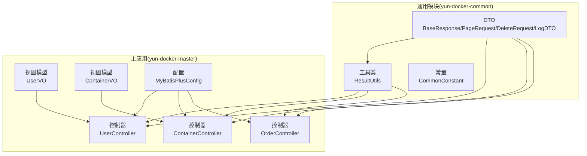
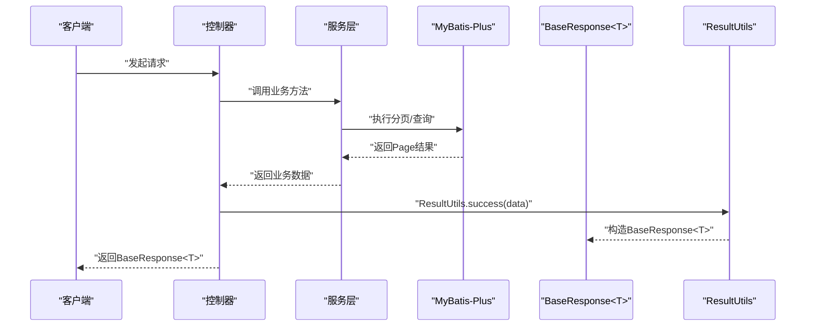
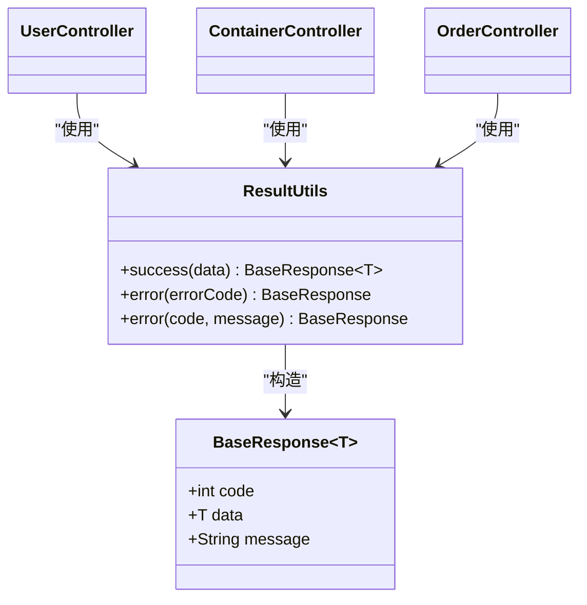
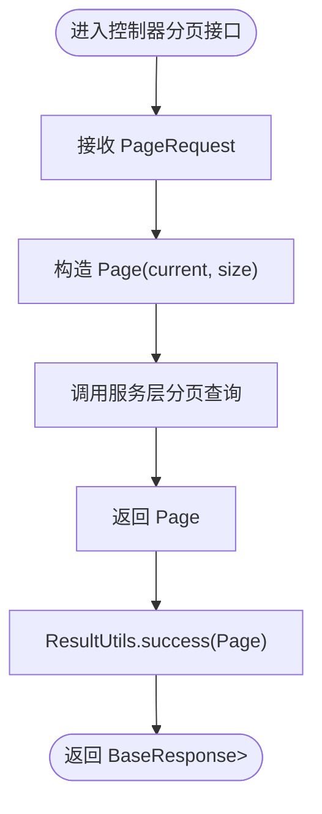
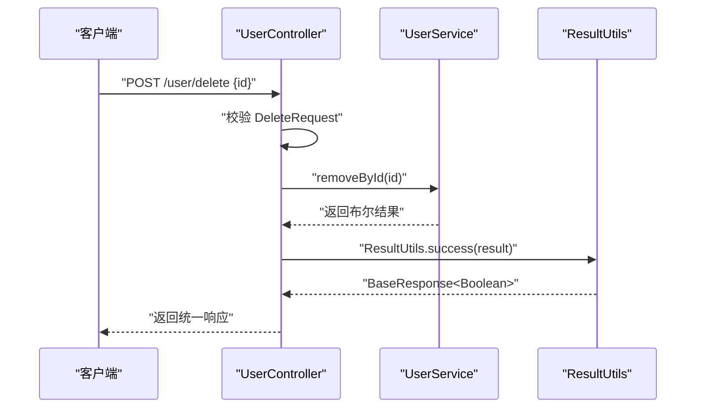
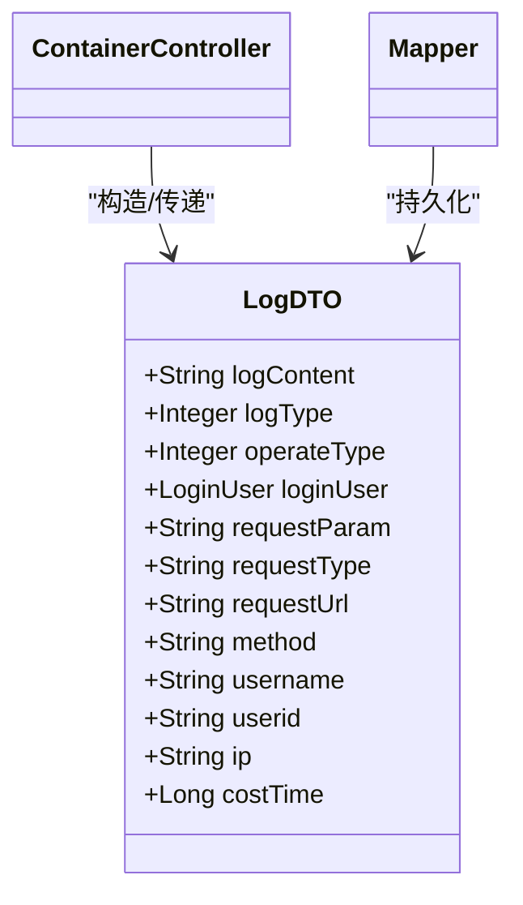
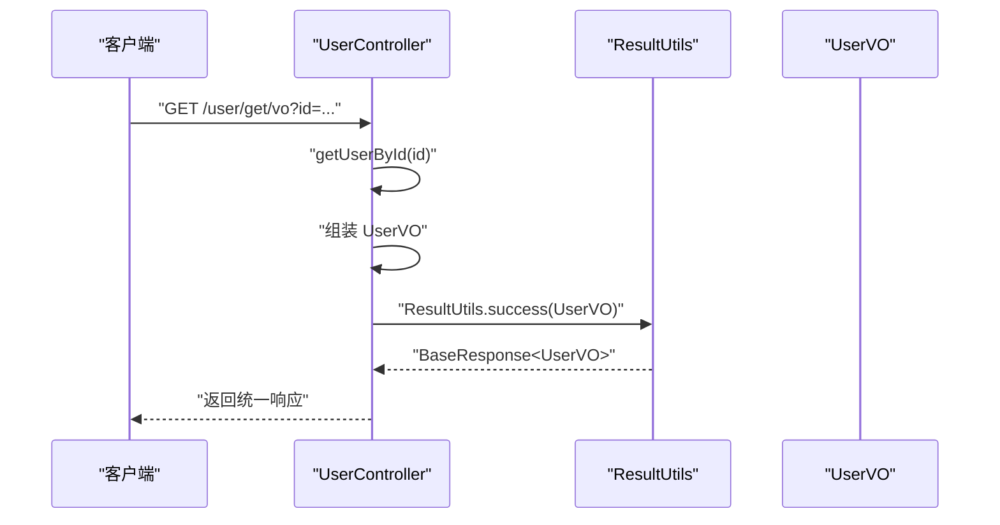
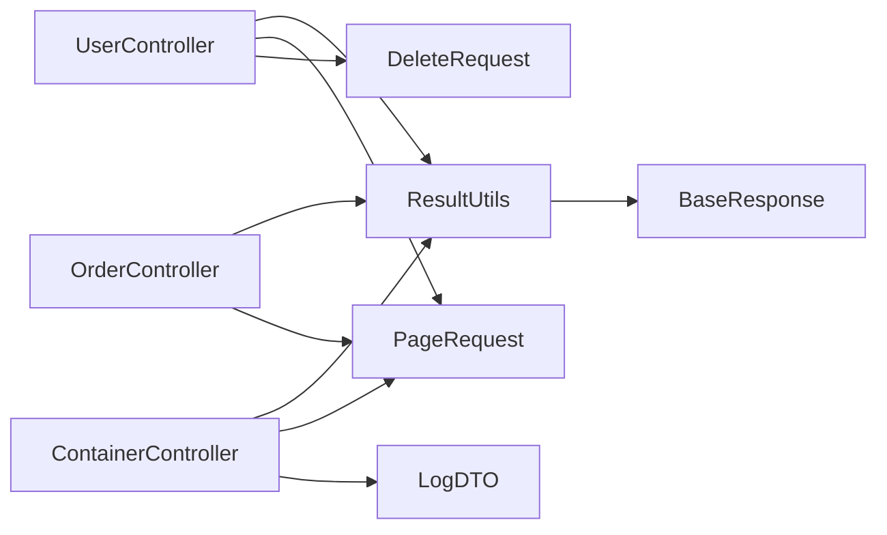

# 通用DTO

<cite>
**本文引用的文件**
- [BaseResponse.java](file://yun-docker-common/src/main/java/com/lfc/yundocker/common/model/dto/BaseResponse.java)
- [ResultUtils.java](file://yun-docker-common/src/main/java/com/lfc/yundocker/common/util/ResultUtils.java)
- [PageRequest.java](file://yun-docker-common/src/main/java/com/lfc/yundocker/common/model/dto/PageRequest.java)
- [DeleteRequest.java](file://yun-docker-common/src/main/java/com/lfc/yundocker/common/model/dto/DeleteRequest.java)
- [LogDTO.java](file://yun-docker-common/src/main/java/com/lfc/yundocker/common/model/dto/LogDTO.java)
- [CommonConstant.java](file://yun-docker-common/src/main/java/com/lfc/yundocker/common/constant/CommonConstant.java)
- [UserController.java](file://yun-docker-master/src/main/java/com/lfc/yundocker/controller/UserController.java)
- [ContainerController.java](file://yun-docker-master/src/main/java/com/lfc/yundocker/controller/ContainerController.java)
- [OrderController.java](file://yun-docker-master/src/main/java/com/lfc/yundocker/controller/OrderController.java)
- [MyBatisPlusConfig.java](file://yun-docker-master/src/main/java/com/lfc/yundocker/config/MyBatisPlusConfig.java)
- [UserVO.java](file://yun-docker-master/src/main/java/com/lfc/yundocker/common/model/vo/UserVO.java)
- [ContainerVO.java](file://yun-docker-master/src/main/java/com/lfc/yundocker/common/model/vo/ContainerVO.java)
</cite>

## 目录
1. [简介](#简介)
2. [项目结构](#项目结构)
3. [核心组件](#核心组件)
4. [架构总览](#架构总览)
5. [详细组件分析](#详细组件分析)
6. [依赖分析](#依赖分析)
7. [性能考虑](#性能考虑)
8. [故障排查指南](#故障排查指南)
9. [结论](#结论)
10. [附录](#附录)

## 简介
本文件系统化阐述通用数据传输对象（DTO）的设计理念与实现，重点围绕以下目标展开：
- 统一响应体 BaseResponse 的泛型封装模式，其 code、message、data 字段如何实现标准化 API 输出，并与 ResultUtils 工具类协同工作。
- 分页查询通用结构 PageRequest 的设计，包含 current、pageSize 等字段，及其在 MyBatis-Plus 分页插件中的使用方式。
- 通用删除请求 DeleteRequest 中 id 字段的通用删除语义。
- 日志 DTO LogDTO 在容器日志查询中作为数据承载模型的字段设计（如 containerId、lines）。
- 结合多个 Controller 的返回值示例，展示 BaseResponse 的泛型用法（如 BaseResponse<UserVO>），并强调这些通用 DTO 在提升代码复用性和接口一致性方面的作用。

## 项目结构
通用 DTO 位于 yun-docker-common 模块的 model/dto 包中；控制器位于 yun-docker-master 模块的 controller 包中；分页配置位于 yun-docker-master 的 config 包中；VO 视图模型位于 yun-docker-master/common/model/vo 包中。

图表来源
- [BaseResponse.java](file://yun-docker-common/src/main/java/com/lfc/yundocker/common/model/dto/BaseResponse.java#L1-L37)
- [ResultUtils.java](file://yun-docker-common/src/main/java/com/lfc/yundocker/common/util/ResultUtils.java#L1-L56)
- [PageRequest.java](file://yun-docker-common/src/main/java/com/lfc/yundocker/common/model/dto/PageRequest.java#L1-L34)
- [DeleteRequest.java](file://yun-docker-common/src/main/java/com/lfc/yundocker/common/model/dto/DeleteRequest.java#L1-L22)
- [LogDTO.java](file://yun-docker-common/src/main/java/com/lfc/yundocker/common/model/dto/LogDTO.java#L1-L72)
- [CommonConstant.java](file://yun-docker-common/src/main/java/com/lfc/yundocker/common/constant/CommonConstant.java#L1-L364)
- [UserController.java](file://yun-docker-master/src/main/java/com/lfc/yundocker/controller/UserController.java#L1-L309)
- [ContainerController.java](file://yun-docker-master/src/main/java/com/lfc/yundocker/controller/ContainerController.java#L1-L173)
- [OrderController.java](file://yun-docker-master/src/main/java/com/lfc/yundocker/controller/OrderController.java#L1-L40)
- [MyBatisPlusConfig.java](file://yun-docker-master/src/main/java/com/lfc/yundocker/config/MyBatisPlusConfig.java#L1-L32)
- [UserVO.java](file://yun-docker-master/src/main/java/com/lfc/yundocker/common/model/vo/UserVO.java#L1-L43)
- [ContainerVO.java](file://yun-docker-master/src/main/java/com/lfc/yundocker/common/model/vo/ContainerVO.java#L1-L83)

章节来源
- [BaseResponse.java](file://yun-docker-common/src/main/java/com/lfc/yundocker/common/model/dto/BaseResponse.java#L1-L37)
- [ResultUtils.java](file://yun-docker-common/src/main/java/com/lfc/yundocker/common/util/ResultUtils.java#L1-L56)
- [PageRequest.java](file://yun-docker-common/src/main/java/com/lfc/yundocker/common/model/dto/PageRequest.java#L1-L34)
- [DeleteRequest.java](file://yun-docker-common/src/main/java/com/lfc/yundocker/common/model/dto/DeleteRequest.java#L1-L22)
- [LogDTO.java](file://yun-docker-common/src/main/java/com/lfc/yundocker/common/model/dto/LogDTO.java#L1-L72)
- [CommonConstant.java](file://yun-docker-common/src/main/java/com/lfc/yundocker/common/constant/CommonConstant.java#L1-L364)
- [UserController.java](file://yun-docker-master/src/main/java/com/lfc/yundocker/controller/UserController.java#L1-L309)
- [ContainerController.java](file://yun-docker-master/src/main/java/com/lfc/yundocker/controller/ContainerController.java#L1-L173)
- [OrderController.java](file://yun-docker-master/src/main/java/com/lfc/yundocker/controller/OrderController.java#L1-L40)
- [MyBatisPlusConfig.java](file://yun-docker-master/src/main/java/com/lfc/yundocker/config/MyBatisPlusConfig.java#L1-L32)
- [UserVO.java](file://yun-docker-master/src/main/java/com/lfc/yundocker/common/model/vo/UserVO.java#L1-L43)
- [ContainerVO.java](file://yun-docker-master/src/main/java/com/lfc/yundocker/common/model/vo/ContainerVO.java#L1-L83)

## 核心组件
- BaseResponse<T>：统一响应体，包含 code、message、data 三要素，支持泛型承载任意业务数据类型，便于前后端一致的契约表达。
- ResultUtils：静态工具类，提供 success/error 等便捷方法，屏蔽具体 code/message 构造细节，简化控制器返回逻辑。
- PageRequest：分页查询通用结构，包含 current、pageSize、sortField、sortOrder 等字段，用于标准化分页请求。
- DeleteRequest：通用删除请求，以 id 字段承载删除目标标识，统一删除语义。
- LogDTO：日志传输对象，承载日志内容、类型、操作类型、登录用户、请求上下文等字段，用于日志记录与审计。

章节来源
- [BaseResponse.java](file://yun-docker-common/src/main/java/com/lfc/yundocker/common/model/dto/BaseResponse.java#L1-L37)
- [ResultUtils.java](file://yun-docker-common/src/main/java/com/lfc/yundocker/common/util/ResultUtils.java#L1-L56)
- [PageRequest.java](file://yun-docker-common/src/main/java/com/lfc/yundocker/common/model/dto/PageRequest.java#L1-L34)
- [DeleteRequest.java](file://yun-docker-common/src/main/java/com/lfc/yundocker/common/model/dto/DeleteRequest.java#L1-L22)
- [LogDTO.java](file://yun-docker-common/src/main/java/com/lfc/yundocker/common/model/dto/LogDTO.java#L1-L72)

## 架构总览
通用 DTO 与控制器、工具类、配置之间的交互如下：

图表来源
- [UserController.java](file://yun-docker-master/src/main/java/com/lfc/yundocker/controller/UserController.java#L249-L283)
- [ContainerController.java](file://yun-docker-master/src/main/java/com/lfc/yundocker/controller/ContainerController.java#L48-L69)
- [OrderController.java](file://yun-docker-master/src/main/java/com/lfc/yundocker/controller/OrderController.java#L40-L40)
- [MyBatisPlusConfig.java](file://yun-docker-master/src/main/java/com/lfc/yundocker/config/MyBatisPlusConfig.java#L1-L32)
- [BaseResponse.java](file://yun-docker-common/src/main/java/com/lfc/yundocker/common/model/dto/BaseResponse.java#L1-L37)
- [ResultUtils.java](file://yun-docker-common/src/main/java/com/lfc/yundocker/common/util/ResultUtils.java#L1-L56)

## 详细组件分析

### BaseResponse 泛型封装与 ResultUtils 协同
- 设计要点
  - code：统一的状态码，便于前端统一处理成功/失败分支。
  - message：统一的消息描述，支持国际化或统一文案策略。
  - data：泛型承载任意业务数据，避免重复定义响应结构。
- 与 ResultUtils 协作
  - success(data)：快速构造成功响应，设置默认 code 和 message。
  - error(errorCode) / error(code, message)：快速构造失败响应，支持枚举或自定义 code/message。
- 控制器中的典型用法
  - BaseResponse<UserVO>：返回用户视图对象。
  - BaseResponse<Page<UserVO>>：返回分页视图对象。
  - BaseResponse<?>：返回非强类型数据（如字符串提示）。

图表来源
- [BaseResponse.java](file://yun-docker-common/src/main/java/com/lfc/yundocker/common/model/dto/BaseResponse.java#L1-L37)
- [ResultUtils.java](file://yun-docker-common/src/main/java/com/lfc/yundocker/common/util/ResultUtils.java#L1-L56)
- [UserController.java](file://yun-docker-master/src/main/java/com/lfc/yundocker/controller/UserController.java#L50-L84)
- [ContainerController.java](file://yun-docker-master/src/main/java/com/lfc/yundocker/controller/ContainerController.java#L117-L133)
- [OrderController.java](file://yun-docker-master/src/main/java/com/lfc/yundocker/controller/OrderController.java#L40-L40)

章节来源
- [BaseResponse.java](file://yun-docker-common/src/main/java/com/lfc/yundocker/common/model/dto/BaseResponse.java#L1-L37)
- [ResultUtils.java](file://yun-docker-common/src/main/java/com/lfc/yundocker/common/util/ResultUtils.java#L1-L56)
- [UserController.java](file://yun-docker-master/src/main/java/com/lfc/yundocker/controller/UserController.java#L50-L84)
- [ContainerController.java](file://yun-docker-master/src/main/java/com/lfc/yundocker/controller/ContainerController.java#L117-L133)
- [OrderController.java](file://yun-docker-master/src/main/java/com/lfc/yundocker/controller/OrderController.java#L40-L40)

### PageRequest 分页查询通用结构与 MyBatis-Plus 集成
- 字段设计
  - current：当前页号，默认 1。
  - pageSize：页面大小，默认 10。
  - sortField：排序字段。
  - sortOrder：排序顺序，默认升序。
- 在控制器中的使用
  - 从请求体接收 PageRequest，构造 Page(current, size)，传递给服务层。
  - 服务层调用分页查询，返回 Page<T>，控制器再通过 ResultUtils.success 返回。
- MyBatis-Plus 分页插件
  - 在配置类中启用分页拦截器，自动对分页查询生效，无需手动拼装分页 SQL。

图表来源
- [PageRequest.java](file://yun-docker-common/src/main/java/com/lfc/yundocker/common/model/dto/PageRequest.java#L1-L34)
- [UserController.java](file://yun-docker-master/src/main/java/com/lfc/yundocker/controller/UserController.java#L249-L283)
- [ContainerController.java](file://yun-docker-master/src/main/java/com/lfc/yundocker/controller/ContainerController.java#L48-L69)
- [OrderController.java](file://yun-docker-master/src/main/java/com/lfc/yundocker/controller/OrderController.java#L40-L40)
- [MyBatisPlusConfig.java](file://yun-docker-master/src/main/java/com/lfc/yundocker/config/MyBatisPlusConfig.java#L1-L32)

章节来源
- [PageRequest.java](file://yun-docker-common/src/main/java/com/lfc/yundocker/common/model/dto/PageRequest.java#L1-L34)
- [UserController.java](file://yun-docker-master/src/main/java/com/lfc/yundocker/controller/UserController.java#L249-L283)
- [ContainerController.java](file://yun-docker-master/src/main/java/com/lfc/yundocker/controller/ContainerController.java#L48-L69)
- [OrderController.java](file://yun-docker-master/src/main/java/com/lfc/yundocker/controller/OrderController.java#L40-L40)
- [MyBatisPlusConfig.java](file://yun-docker-master/src/main/java/com/lfc/yundocker/config/MyBatisPlusConfig.java#L1-L32)

### DeleteRequest 通用删除语义
- 字段设计
  - id：删除目标的标识，统一删除入口。
- 使用场景
  - 控制器接收 DeleteRequest，校验 id 合法性后调用服务层删除逻辑。
  - 返回 BaseResponse<Boolean> 表示删除结果。

图表来源
- [DeleteRequest.java](file://yun-docker-common/src/main/java/com/lfc/yundocker/common/model/dto/DeleteRequest.java#L1-L22)
- [UserController.java](file://yun-docker-master/src/main/java/com/lfc/yundocker/controller/UserController.java#L167-L175)
- [ResultUtils.java](file://yun-docker-common/src/main/java/com/lfc/yundocker/common/util/ResultUtils.java#L1-L56)

章节来源
- [DeleteRequest.java](file://yun-docker-common/src/main/java/com/lfc/yundocker/common/model/dto/DeleteRequest.java#L1-L22)
- [UserController.java](file://yun-docker-master/src/main/java/com/lfc/yundocker/controller/UserController.java#L167-L175)
- [ResultUtils.java](file://yun-docker-common/src/main/java/com/lfc/yundocker/common/util/ResultUtils.java#L1-L56)

### LogDTO 日志承载模型
- 字段设计
  - logContent：日志内容。
  - logType：日志类型（操作日志、登录日志、定时任务等）。
  - operateType：操作类型（添加、修改、删除等）。
  - loginUser：登录用户信息。
  - requestParam、requestType、requestUrl、method、username、userid、ip、costTime 等：请求上下文与元数据。
- 使用场景
  - 控制器或服务层构建 LogDTO，写入日志存储或审计系统。
  - 与容器日志下载等接口配合，记录操作轨迹。

图表来源
- [LogDTO.java](file://yun-docker-common/src/main/java/com/lfc/yundocker/common/model/dto/LogDTO.java#L1-L72)
- [ContainerController.java](file://yun-docker-master/src/main/java/com/lfc/yundocker/controller/ContainerController.java#L161-L170)

章节来源
- [LogDTO.java](file://yun-docker-common/src/main/java/com/lfc/yundocker/common/model/dto/LogDTO.java#L1-L72)
- [ContainerController.java](file://yun-docker-master/src/main/java/com/lfc/yundocker/controller/ContainerController.java#L161-L170)

### 控制器中的 BaseResponse 泛型用法示例
- 用户模块
  - BaseResponse<Long>：注册返回用户 id。
  - BaseResponse<LoginUserVO>：登录返回用户视图。
  - BaseResponse<UserVO>：根据 id 获取用户视图。
  - BaseResponse<Page<User>>：分页返回用户实体。
  - BaseResponse<Page<UserVO>>：分页返回用户视图。
- 容器模块
  - BaseResponse<Page<ContainerVO>>：分页返回容器视图。
  - BaseResponse<String>：运行/启动/重启/删除等返回字符串提示。
  - BaseResponse<?>：运行容器时返回非强类型提示。
- 订单模块
  - BaseResponse<Page<YunOrder>>：分页返回订单实体。

图表来源
- [UserController.java](file://yun-docker-master/src/main/java/com/lfc/yundocker/controller/UserController.java#L223-L230)
- [UserVO.java](file://yun-docker-master/src/main/java/com/lfc/yundocker/common/model/vo/UserVO.java#L1-L43)
- [ResultUtils.java](file://yun-docker-common/src/main/java/com/lfc/yundocker/common/util/ResultUtils.java#L1-L56)

章节来源
- [UserController.java](file://yun-docker-master/src/main/java/com/lfc/yundocker/controller/UserController.java#L50-L84)
- [UserController.java](file://yun-docker-master/src/main/java/com/lfc/yundocker/controller/UserController.java#L223-L230)
- [UserController.java](file://yun-docker-master/src/main/java/com/lfc/yundocker/controller/UserController.java#L249-L283)
- [ContainerController.java](file://yun-docker-master/src/main/java/com/lfc/yundocker/controller/ContainerController.java#L48-L69)
- [OrderController.java](file://yun-docker-master/src/main/java/com/lfc/yundocker/controller/OrderController.java#L40-L40)
- [UserVO.java](file://yun-docker-master/src/main/java/com/lfc/yundocker/common/model/vo/UserVO.java#L1-L43)

## 依赖分析
- 组件耦合
  - 控制器依赖 ResultUtils 进行响应封装，降低重复代码。
  - PageRequest 与 MyBatis-Plus 分页插件解耦，控制器仅负责接收与转发。
  - DeleteRequest 与业务删除流程解耦，统一 id 语义。
  - LogDTO 与日志记录流程解耦，承载上下文信息。
- 可能的循环依赖
  - DTO 与控制器之间为单向依赖，无循环。
  - 工具类 ResultUtils 与 DTO 为单向依赖，无循环。
- 外部依赖
  - MyBatis-Plus 分页插件由配置类启用，控制器无需感知底层实现。

图表来源
- [UserController.java](file://yun-docker-master/src/main/java/com/lfc/yundocker/controller/UserController.java#L1-L309)
- [ContainerController.java](file://yun-docker-master/src/main/java/com/lfc/yundocker/controller/ContainerController.java#L1-L173)
- [OrderController.java](file://yun-docker-master/src/main/java/com/lfc/yundocker/controller/OrderController.java#L1-L40)
- [ResultUtils.java](file://yun-docker-common/src/main/java/com/lfc/yundocker/common/util/ResultUtils.java#L1-L56)
- [BaseResponse.java](file://yun-docker-common/src/main/java/com/lfc/yundocker/common/model/dto/BaseResponse.java#L1-L37)
- [PageRequest.java](file://yun-docker-common/src/main/java/com/lfc/yundocker/common/model/dto/PageRequest.java#L1-L34)
- [DeleteRequest.java](file://yun-docker-common/src/main/java/com/lfc/yundocker/common/model/dto/DeleteRequest.java#L1-L22)
- [LogDTO.java](file://yun-docker-common/src/main/java/com/lfc/yundocker/common/model/dto/LogDTO.java#L1-L72)

章节来源
- [UserController.java](file://yun-docker-master/src/main/java/com/lfc/yundocker/controller/UserController.java#L1-L309)
- [ContainerController.java](file://yun-docker-master/src/main/java/com/lfc/yundocker/controller/ContainerController.java#L1-L173)
- [OrderController.java](file://yun-docker-master/src/main/java/com/lfc/yundocker/controller/OrderController.java#L1-L40)
- [ResultUtils.java](file://yun-docker-common/src/main/java/com/lfc/yundocker/common/util/ResultUtils.java#L1-L56)
- [BaseResponse.java](file://yun-docker-common/src/main/java/com/lfc/yundocker/common/model/dto/BaseResponse.java#L1-L37)
- [PageRequest.java](file://yun-docker-common/src/main/java/com/lfc/yundocker/common/model/dto/PageRequest.java#L1-L34)
- [DeleteRequest.java](file://yun-docker-common/src/main/java/com/lfc/yundocker/common/model/dto/DeleteRequest.java#L1-L22)
- [LogDTO.java](file://yun-docker-common/src/main/java/com/lfc/yundocker/common/model/dto/LogDTO.java#L1-L72)

## 性能考虑
- 分页大小限制：控制器中对 pageSize 进行上限控制，防止过大分页导致数据库压力。
- 序列化开销：BaseResponse 与 VO 类均实现序列化，注意避免不必要的大对象传输。
- 日志字段选择：LogDTO 字段较多，建议按需记录，减少冗余字段写入。

章节来源
- [UserController.java](file://yun-docker-master/src/main/java/com/lfc/yundocker/controller/UserController.java#L273-L277)
- [ContainerController.java](file://yun-docker-master/src/main/java/com/lfc/yundocker/controller/ContainerController.java#L55-L59)
- [LogDTO.java](file://yun-docker-common/src/main/java/com/lfc/yundocker/common/model/dto/LogDTO.java#L1-L72)

## 故障排查指南
- 统一异常处理
  - 控制器中对空参数、越界、余额不足等情况抛出业务异常，由全局异常处理器捕获并返回统一响应。
- 常见问题定位
  - 参数校验失败：检查 PageRequest、DeleteRequest 的必填字段与范围。
  - 分页异常：确认 MyBatis-Plus 分页插件已启用，且控制器正确构造 Page。
  - 日志缺失：检查 LogDTO 字段是否完整，以及日志持久化流程。

章节来源
- [UserController.java](file://yun-docker-master/src/main/java/com/lfc/yundocker/controller/UserController.java#L167-L175)
- [ContainerController.java](file://yun-docker-master/src/main/java/com/lfc/yundocker/controller/ContainerController.java#L117-L133)
- [MyBatisPlusConfig.java](file://yun-docker-master/src/main/java/com/lfc/yundocker/config/MyBatisPlusConfig.java#L1-L32)

## 结论
通用 DTO 体系通过 BaseResponse 的泛型封装与 ResultUtils 的工具化协作，实现了统一、可扩展的响应格式；PageRequest 提供了标准化的分页输入模型，并与 MyBatis-Plus 分页插件无缝集成；DeleteRequest 与 LogDTO 则分别抽象了通用删除语义与日志承载模型。这些设计显著提升了代码复用性、接口一致性与可维护性。

## 附录
- 常量参考：CommonConstant 中包含排序顺序等通用常量，供 PageRequest 默认排序使用。
- 视图模型：UserVO、ContainerVO 作为业务数据的视图层载体，配合 BaseResponse 实现前后端分离的契约。

章节来源
- [CommonConstant.java](file://yun-docker-common/src/main/java/com/lfc/yundocker/common/constant/CommonConstant.java#L1-L364)
- [UserVO.java](file://yun-docker-master/src/main/java/com/lfc/yundocker/common/model/vo/UserVO.java#L1-L43)
- [ContainerVO.java](file://yun-docker-master/src/main/java/com/lfc/yundocker/common/model/vo/ContainerVO.java#L1-L83)