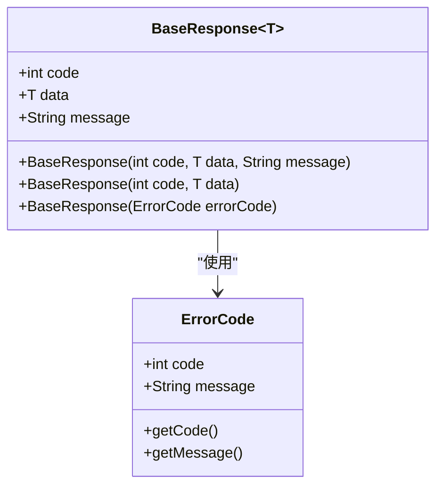
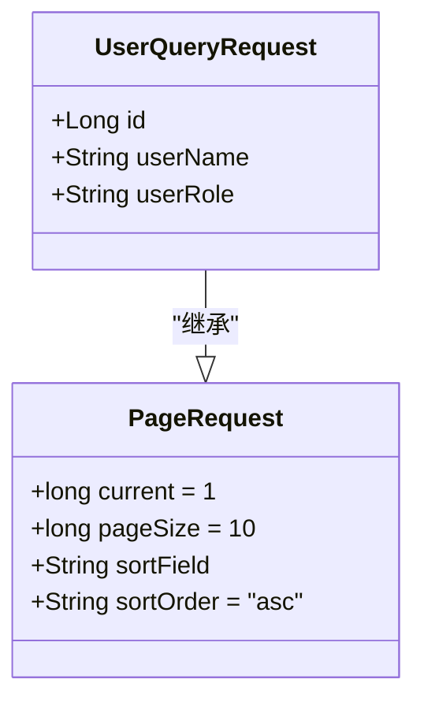
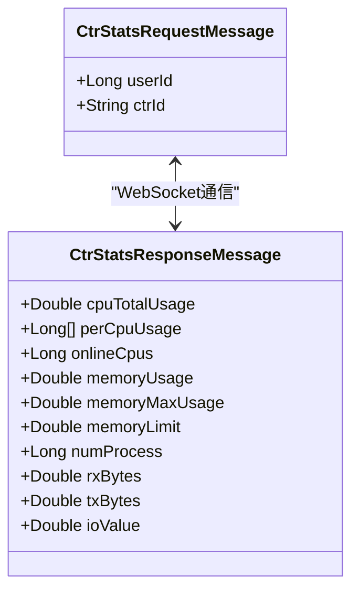

# 数据模型与传输对象

<cite>
**本文档引用文件**  
- [BaseResponse.java](file://yun-docker-common/src/main/java/com/lfc/yundocker/common/model/dto/BaseResponse.java)
- [PageRequest.java](file://yun-docker-common/src/main/java/com/lfc/yundocker/common/model/dto/PageRequest.java)
- [CtrRunRequest.java](file://yun-docker-common/src/main/java/com/lfc/yundocker/common/model/dto/CtrRunRequest.java)
- [UserLoginRequest.java](file://yun-docker-common/src/main/java/com/lfc/yundocker/common/model/dto/user/UserLoginRequest.java)
- [UserRegisterRequest.java](file://yun-docker-common/src/main/java/com/lfc/yundocker/common/model/dto/user/UserRegisterRequest.java)
- [UserAddRequest.java](file://yun-docker-common/src/main/java/com/lfc/yundocker/common/model/dto/user/UserAddRequest.java)
- [UserUpdateRequest.java](file://yun-docker-common/src/main/java/com/lfc/yundocker/common/model/dto/user/UserUpdateRequest.java)
- [UserQueryRequest.java](file://yun-docker-common/src/main/java/com/lfc/yundocker/common/model/dto/user/UserQueryRequest.java)
- [UserUpdateMyRequest.java](file://yun-docker-common/src/main/java/com/lfc/yundocker/common/model/dto/user/UserUpdateMyRequest.java)
- [CtrStatsRequestMessage.java](file://yun-docker-common/src/main/java/com/lfc/yundocker/common/model/dto/message/CtrStatsRequestMessage.java)
- [CtrStatsResponseMessage.java](file://yun-docker-common/src/main/java/com/lfc/yundocker/common/model/dto/message/CtrStatsResponseMessage.java)
- [LoginUser.java](file://yun-docker-common/src/main/java/com/lfc/yundocker/common/model/entity/LoginUser.java)
- [Result.java](file://yun-docker-common/src/main/java/com/lfc/yundocker/common/model/vo/Result.java)
- [SysUserCacheInfo.java](file://yun-docker-common/src/main/java/com/lfc/yundocker/common/model/vo/SysUserCacheInfo.java)
- [CommonConstant.java](file://yun-docker-common/src/main/java/com/lfc/yundocker/common/constant/CommonConstant.java)
- [ErrorCode.java](file://yun-docker-common/src/main/java/com/lfc/yundocker/common/model/enums/ErrorCode.java)
</cite>

## 目录
1. [引言](#引言)
2. [DTO设计与接口数据传输](#dto设计与接口数据传输)
3. [VO设计与前端数据封装](#vo设计与前端数据封装)
4. [统一响应体BaseResponse设计](#统一响应体baseresponse设计)
5. [分页请求PageRequest结构](#分页请求pagerequest结构)
6. [认证上下文中的LoginUser实体](#认证上下文中的loginuser实体)
7. [WebSocket实时监控消息通信](#websocket实时监控消息通信)
8. [Lombok注解与JSON序列化兼容性](#lombok注解与json序列化兼容性)
9. [DTO校验注解应用示例](#dto校验注解应用示例)

## 引言
本模块`yun-docker-common`中的`model`包为整个系统提供了统一的数据结构定义，涵盖数据传输对象（DTO）、值对象（VO）、实体类及枚举类型。这些结构在服务间通信、前后端交互、认证上下文传递以及实时消息通信中发挥关键作用。通过Lombok简化代码、泛型响应设计和标准化命名，提升了系统的可维护性与一致性。

## DTO设计与接口数据传输

`dto`包中的类主要用于接口间的数据传输，确保请求参数的清晰封装与类型安全。

### 用户相关DTO
- `UserLoginRequest`：封装用户登录所需的账号与密码字段，用于认证接口。
- `UserRegisterRequest`：包含用户注册时的账号、密码及确认密码，保障注册流程完整性。
- `UserAddRequest`：用于管理员添加用户，包含用户名、头像、角色等信息。
- `UserUpdateRequest`：支持用户信息更新，包含ID、昵称、头像和角色字段。
- `UserUpdateMyRequest`：专用于用户修改自身信息，仅暴露昵称和头像字段。
- `UserQueryRequest`：继承自`PageRequest`，扩展了ID、用户名、角色等查询条件，支持分页与排序。

### 容器操作DTO
- `CtrRunRequest`：定义容器启动所需配置，包括镜像ID、宿主机端口、容器端口及自定义名称，作为容器服务调用的核心参数载体。

### 通用请求DTO
- `DeleteRequest`：通用删除请求，通常包含资源ID。
- `LogDTO`：日志数据传输对象，用于记录操作日志或系统日志。

**本节来源**  
- [UserLoginRequest.java](file://yun-docker-common/src/main/java/com/lfc/yundocker/common/model/dto/user/UserLoginRequest.java#L1-L21)
- [UserRegisterRequest.java](file://yun-docker-common/src/main/java/com/lfc/yundocker/common/model/dto/user/UserRegisterRequest.java#L1-L23)
- [UserAddRequest.java](file://yun-docker-common/src/main/java/com/lfc/yundocker/common/model/dto/user/UserAddRequest.java#L1-L37)
- [UserUpdateRequest.java](file://yun-docker-common/src/main/java/com/lfc/yundocker/common/model/dto/user/UserUpdateRequest.java#L1-L36)
- [UserUpdateMyRequest.java](file://yun-docker-common/src/main/java/com/lfc/yundocker/common/model/dto/user/UserUpdateMyRequest.java#L1-L27)
- [UserQueryRequest.java](file://yun-docker-common/src/main/java/com/lfc/yundocker/common/model/dto/user/UserQueryRequest.java#L1-L34)
- [CtrRunRequest.java](file://yun-docker-common/src/main/java/com/lfc/yundocker/common/model/dto/CtrRunRequest.java#L1-L35)

## VO设计与前端数据封装

`vo`包中的类用于向客户端返回结构化数据，屏蔽后端实现细节。

### Result统一返回格式
`Result<T>` 是系统统一的接口响应封装类，包含：
- `success`：布尔值，表示请求是否成功
- `message`：返回消息描述
- `code`：状态码（如200表示成功，500表示服务器错误）
- `result`：泛型数据体，承载实际返回数据
- `timestamp`：时间戳，便于前端调试

该类提供静态工厂方法如 `OK()`、`error()` 等，简化成功与失败响应的构建。

### SysUserCacheInfo用户缓存信息
`SysUserCacheInfo` 封装用户在系统中的缓存信息，包括：
- `sysUserCode`：用户编码
- `sysUserName`：用户姓名
- `sysOrgCode`：组织机构编码
- `sysMultiOrgCode`：多组织机构编码列表
- `oneDepart`：是否仅属于一个部门

此类还提供 `getSysDate()` 和 `getSysTime()` 方法，用于获取当前日期与时间字符串，常用于报表或日志展示。

**本节来源**  
- [Result.java](file://yun-docker-common/src/main/java/com/lfc/yundocker/common/model/vo/Result.java#L1-L173)
- [SysUserCacheInfo.java](file://yun-docker-common/src/main/java/com/lfc/yundocker/common/model/vo/SysUserCacheInfo.java#L1-L75)

## 统一响应体BaseResponse设计

`BaseResponse<T>` 是另一个通用响应封装类，采用泛型设计以支持不同类型的数据返回。其核心字段包括：
- `code`：响应码，对应`ErrorCode`枚举
- `data`：泛型数据体
- `message`：响应消息

构造函数支持多种初始化方式：
- `BaseResponse(int code, T data, String message)`：全参数构造
- `BaseResponse(int code, T data)`：省略消息，默认为空字符串
- `BaseResponse(ErrorCode errorCode)`：通过枚举自动填充code和message

此设计实现了响应格式的统一，便于前端统一处理各类接口返回。



**图示来源**  
- [BaseResponse.java](file://yun-docker-common/src/main/java/com/lfc/yundocker/common/model/dto/BaseResponse.java#L1-L37)
- [ErrorCode.java](file://yun-docker-common/src/main/java/com/lfc/yundocker/common/model/enums/ErrorCode.java#L1-L50)

## 分页请求PageRequest结构

`PageRequest` 类定义了分页查询的通用参数结构，包含：
- `current`：当前页码，默认为1
- `pageSize`：每页大小，默认为10
- `sortField`：排序字段
- `sortOrder`：排序顺序，默认为升序（ASC），引用自`CommonConstant.SORT_ORDER_ASC`

此类被 `UserQueryRequest` 等查询类继承，形成标准的分页查询接口规范，提升代码复用性与一致性。



**图示来源**  
- [PageRequest.java](file://yun-docker-common/src/main/java/com/lfc/yundocker/common/model/dto/PageRequest.java#L1-L34)
- [UserQueryRequest.java](file://yun-docker-common/src/main/java/com/lfc/yundocker/common/model/dto/user/UserQueryRequest.java#L1-L34)

## 认证上下文中的LoginUser实体

`LoginUser` 实体用于在认证成功后传递用户上下文信息，贯穿于整个请求生命周期。其字段包括：
- `id`：用户ID
- `username`：登录账号
- `password`：密码（通常不直接使用）
- `email`、`phone`：联系方式
- `status`：账户状态（1正常，2冻结）
- `delFlag`：删除标记
- `createTime`：创建时间
- `clientId`：设备ID，用于Uniapp推送

该类使用Lombok的`@Data`、`@EqualsAndHashCode`和`@Accessors(chain = true)`注解，启用链式调用，提升代码可读性。

**本节来源**  
- [LoginUser.java](file://yun-docker-common/src/main/java/com/lfc/yundocker/common/model/entity/LoginUser.java#L1-L62)

## WebSocket实时监控消息通信

为支持容器实时监控功能，系统定义了专用的WebSocket消息传输对象。

### CtrStatsRequestMessage
客户端发送的请求消息，包含：
- `userId`：用户ID
- `ctrId`：容器ID

用于订阅特定容器的运行状态。

### CtrStatsResponseMessage
服务端返回的响应消息，包含丰富的容器运行指标：
- CPU使用情况：总使用时间、各核心使用率、在线CPU数
- 内存使用：当前占用、最大占用、限制
- 进程数：容器内运行进程数量
- 网络流量：入站（rxBytes）、出站（txBytes）
- 磁盘IO：传输数据量

此类使用`@Accessors(chain = true)`支持链式构建，便于在监控服务中高效组装消息。



**图示来源**  
- [CtrStatsRequestMessage.java](file://yun-docker-common/src/main/java/com/lfc/yundocker/common/model/dto/message/CtrStatsRequestMessage.java#L1-L17)
- [CtrStatsResponseMessage.java](file://yun-docker-common/src/main/java/com/lfc/yundocker/common/model/dto/message/CtrStatsResponseMessage.java#L1-L69)

## Lombok注解与JSON序列化兼容性

所有DTO、VO和实体类广泛使用Lombok注解以减少样板代码：
- `@Data`：自动生成getter、setter、toString、equals、hashCode方法
- `@NoArgsConstructor`：生成无参构造函数（隐含在@Data中）
- `@Accessors(chain = true)`：启用链式调用
- `@EqualsAndHashCode`：控制equals和hashCode生成逻辑

这些注解与Jackson JSON库完全兼容，确保对象能正确序列化与反序列化，同时保持代码简洁。例如`LoginUser`和`CtrStatsResponseMessage`均通过Lombok简化了POJO定义。

**本节来源**  
- [LoginUser.java](file://yun-docker-common/src/main/java/com/lfc/yundocker/common/model/entity/LoginUser.java#L1-L62)
- [CtrStatsResponseMessage.java](file://yun-docker-common/src/main/java/com/lfc/yundocker/common/model/dto/message/CtrStatsResponseMessage.java#L1-L69)
- [BaseResponse.java](file://yun-docker-common/src/main/java/com/lfc/yundocker/common/model/dto/BaseResponse.java#L1-L37)

## DTO校验注解应用示例

虽然当前查看的DTO类未显式添加校验注解（如`@NotBlank`、`@Size`），但在实际业务中，这些类通常会在字段上添加JSR-303校验注解。例如，可对`UserLoginRequest`进行如下增强：

```java
@Data
public class UserLoginRequest implements Serializable {
    @NotBlank(message = "账号不能为空")
    private String userAccount;

    @NotBlank(message = "密码不能为空")
    @Size(min = 6, message = "密码长度不能少于6位")
    private String userPassword;
}
```

此类校验由Spring的`@Valid`注解触发，在Controller层自动执行参数验证，并通过全局异常处理器（`GlobalExceptionHandler`）统一返回错误信息，保障接口输入的合法性。

**本节来源**  
- [UserLoginRequest.java](file://yun-docker-common/src/main/java/com/lfc/yundocker/common/model/dto/user/UserLoginRequest.java#L1-L21)
- [GlobalExceptionHandler.java](file://yun-docker-common/src/main/java/com/lfc/yundocker/common/exception/GlobalExceptionHandler.java#L1-L50)