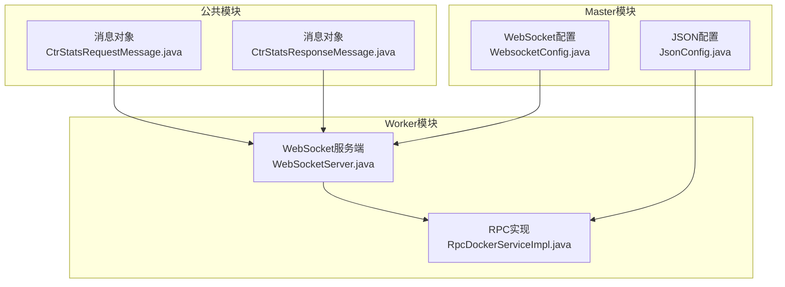
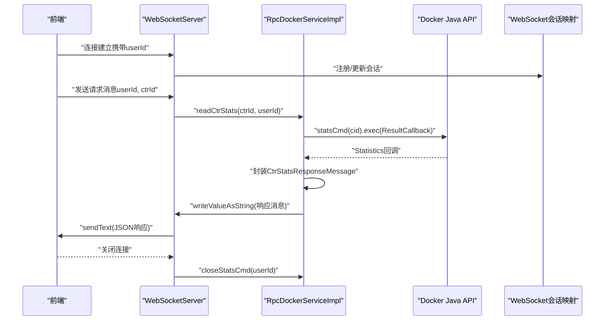
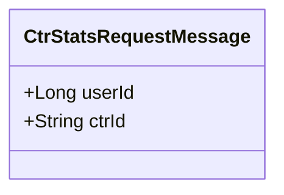
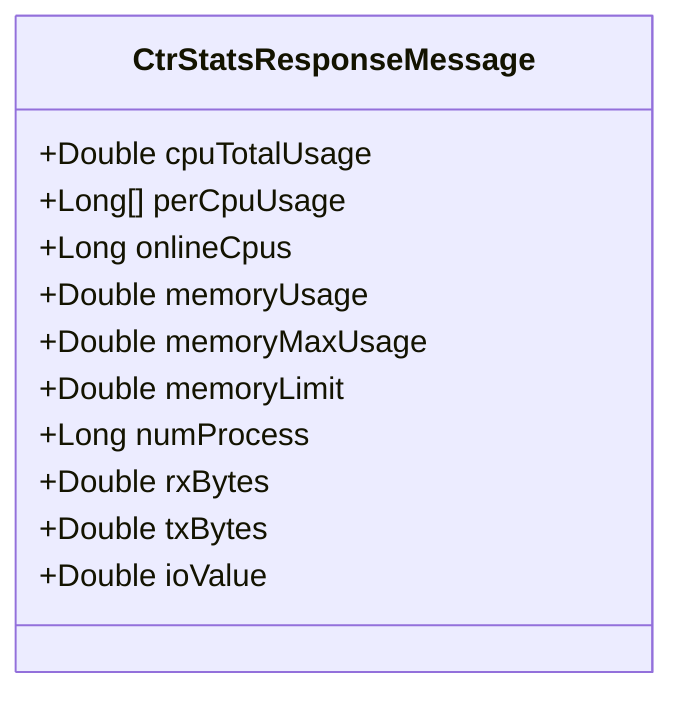
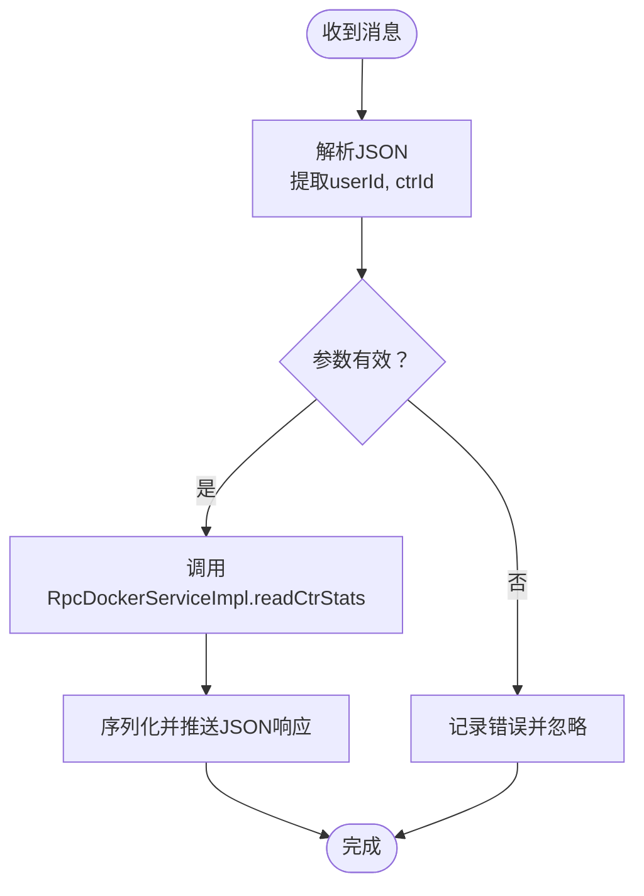
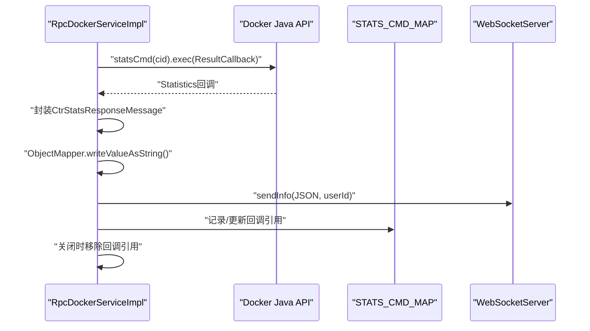
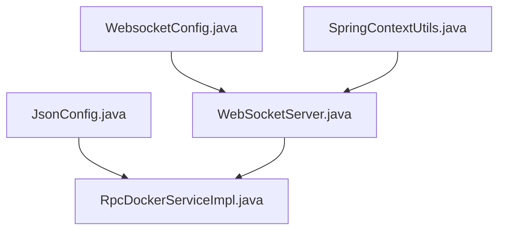

# 消息通信对象

<cite>
**本文引用的文件**
- [yun-docker-common/src/main/java/com/lfc/yundocker/common/model/dto/message/CtrStatsRequestMessage.java](file://yun-docker-common/src/main/java/com/lfc/yundocker/common/model/dto/message/CtrStatsRequestMessage.java)
- [yun-docker-common/src/main/java/com/lfc/yundocker/common/model/dto/message/CtrStatsResponseMessage.java](file://yun-docker-common/src/main/java/com/lfc/yundocker/common/model/dto/message/CtrStatsResponseMessage.java)
- [yun-docker-worker/src/main/java/com/lfc/yundocker/worker/websocket/WebSocketServer.java](file://yun-docker-worker/src/main/java/com/lfc/yundocker/worker/websocket/WebSocketServer.java)
- [yun-docker-worker/src/main/java/com/lfc/yundocker/worker/rpc/RpcDockerServiceImpl.java](file://yun-docker-worker/src/main/java/com/lfc/yundocker/worker/rpc/RpcDockerServiceImpl.java)
- [yun-docker-master/src/main/java/com/lfc/yundocker/config/WebsocketConfig.java](file://yun-docker-master/src/main/java/com/lfc/yundocker/config/WebsocketConfig.java)
- [yun-docker-master/src/main/java/com/lfc/yundocker/config/JsonConfig.java](file://yun-docker-master/src/main/java/com/lfc/yundocker/config/JsonConfig.java)
- [yun-docker-common/src/main/java/com/lfc/yundocker/common/util/SpringContextUtils.java](file://yun-docker-common/src/main/java/com/lfc/yundocker/common/util/SpringContextUtils.java)
</cite>

## 目录
1. [引言](#引言)
2. [项目结构](#项目结构)
3. [核心组件](#核心组件)
4. [架构总览](#架构总览)
5. [详细组件分析](#详细组件分析)
6. [依赖分析](#依赖分析)
7. [性能考虑](#性能考虑)
8. [故障排查指南](#故障排查指南)
9. [结论](#结论)
10. [附录](#附录)

## 引言
本文件系统化说明在WebSocket实时通信中使用的两类消息对象设计：客户端请求容器监控数据的指令消息与服务端推送的容器资源使用数据消息。重点解析：
- CtrStatsRequestMessage：作为客户端请求容器监控数据的指令消息，包含用户ID与容器ID等字段。
- CtrStatsResponseMessage：作为服务端推送的容器资源使用数据消息，涵盖CPU、内存、网络IO等指标，兼顾实时性与带宽效率。
- WebSocketServer中的序列化与反序列化流程，以及消息类型字段（type）的路由机制。
- 结合前端通过WebSocket连接获取容器实时监控图表的场景，说明消息对象的生命周期与推送频率控制。
- 强调Lombok与Jackson注解在保证消息对象高效序列化中的作用，并提供Netty或Spring WebSocket中消息编解码的实际处理代码片段路径。

## 项目结构
该仓库采用多模块结构，消息对象位于公共模块，WebSocket服务端与RPC实现分别位于worker模块，配置位于master模块。整体关系如下图所示：

**图表来源**
- [yun-docker-common/src/main/java/com/lfc/yundocker/common/model/dto/message/CtrStatsRequestMessage.java](file://yun-docker-common/src/main/java/com/lfc/yundocker/common/model/dto/message/CtrStatsRequestMessage.java#L1-L17)
- [yun-docker-common/src/main/java/com/lfc/yundocker/common/model/dto/message/CtrStatsResponseMessage.java](file://yun-docker-common/src/main/java/com/lfc/yundocker/common/model/dto/message/CtrStatsResponseMessage.java#L1-L69)
- [yun-docker-worker/src/main/java/com/lfc/yundocker/worker/websocket/WebSocketServer.java](file://yun-docker-worker/src/main/java/com/lfc/yundocker/worker/websocket/WebSocketServer.java#L1-L175)
- [yun-docker-worker/src/main/java/com/lfc/yundocker/worker/rpc/RpcDockerServiceImpl.java](file://yun-docker-worker/src/main/java/com/lfc/yundocker/worker/rpc/RpcDockerServiceImpl.java#L1-L440)
- [yun-docker-master/src/main/java/com/lfc/yundocker/config/WebsocketConfig.java](file://yun-docker-master/src/main/java/com/lfc/yundocker/config/WebsocketConfig.java#L1-L20)
- [yun-docker-master/src/main/java/com/lfc/yundocker/config/JsonConfig.java](file://yun-docker-master/src/main/java/com/lfc/yundocker/config/JsonConfig.java#L1-L31)

**章节来源**
- [yun-docker-common/src/main/java/com/lfc/yundocker/common/model/dto/message/CtrStatsRequestMessage.java](file://yun-docker-common/src/main/java/com/lfc/yundocker/common/model/dto/message/CtrStatsRequestMessage.java#L1-L17)
- [yun-docker-common/src/main/java/com/lfc/yundocker/common/model/dto/message/CtrStatsResponseMessage.java](file://yun-docker-common/src/main/java/com/lfc/yundocker/common/model/dto/message/CtrStatsResponseMessage.java#L1-L69)
- [yun-docker-worker/src/main/java/com/lfc/yundocker/worker/websocket/WebSocketServer.java](file://yun-docker-worker/src/main/java/com/lfc/yundocker/worker/websocket/WebSocketServer.java#L1-L175)
- [yun-docker-worker/src/main/java/com/lfc/yundocker/worker/rpc/RpcDockerServiceImpl.java](file://yun-docker-worker/src/main/java/com/lfc/yundocker/worker/rpc/RpcDockerServiceImpl.java#L1-L440)
- [yun-docker-master/src/main/java/com/lfc/yundocker/config/WebsocketConfig.java](file://yun-docker-master/src/main/java/com/lfc/yundocker/config/WebsocketConfig.java#L1-L20)
- [yun-docker-master/src/main/java/com/lfc/yundocker/config/JsonConfig.java](file://yun-docker-master/src/main/java/com/lfc/yundocker/config/JsonConfig.java#L1-L31)

## 核心组件
- CtrStatsRequestMessage：客户端请求容器监控数据的指令消息，包含用户ID与容器ID等字段，便于服务端识别目标用户与容器。
- CtrStatsResponseMessage：服务端推送的容器资源使用数据消息，包含CPU总量、每核使用、在线CPU数、内存使用、最大内存、内存限制、进程数、网络入/出站流量、磁盘IO等指标，用于前端绘制实时监控图表。

上述两类消息均实现了序列化接口，便于在网络上传输；同时使用了Lombok注解简化getter/setter与链式调用，提升开发效率与可读性。

**章节来源**
- [yun-docker-common/src/main/java/com/lfc/yundocker/common/model/dto/message/CtrStatsRequestMessage.java](file://yun-docker-common/src/main/java/com/lfc/yundocker/common/model/dto/message/CtrStatsRequestMessage.java#L1-L17)
- [yun-docker-common/src/main/java/com/lfc/yundocker/common/model/dto/message/CtrStatsResponseMessage.java](file://yun-docker-common/src/main/java/com/lfc/yundocker/common/model/dto/message/CtrStatsResponseMessage.java#L1-L69)

## 架构总览
WebSocket实时通信的整体流程如下：
- 前端通过WebSocket连接到服务端，携带用户ID参数。
- 前端发送JSON格式的请求消息（包含用户ID与容器ID）。
- 服务端解析请求消息，调用RPC实现读取容器统计数据。
- RPC实现基于Docker Java API拉取实时统计，封装为响应消息并通过Jackson序列化为JSON。
- 服务端将JSON文本推送给对应用户的WebSocket会话。

**图表来源**
- [yun-docker-worker/src/main/java/com/lfc/yundocker/worker/websocket/WebSocketServer.java](file://yun-docker-worker/src/main/java/com/lfc/yundocker/worker/websocket/WebSocketServer.java#L1-L175)
- [yun-docker-worker/src/main/java/com/lfc/yundocker/worker/rpc/RpcDockerServiceImpl.java](file://yun-docker-worker/src/main/java/com/lfc/yundocker/worker/rpc/RpcDockerServiceImpl.java#L196-L278)
- [yun-docker-master/src/main/java/com/lfc/yundocker/config/WebsocketConfig.java](file://yun-docker-master/src/main/java/com/lfc/yundocker/config/WebsocketConfig.java#L1-L20)

## 详细组件分析

### CtrStatsRequestMessage 分析
- 字段设计：包含用户ID与容器ID，用于唯一标识请求来源与目标容器。
- 注解与序列化：使用Lombok注解简化属性访问器；实现序列化接口以便在网络传输中使用。
- 用途：前端通过WebSocket发送该消息，服务端据此发起容器统计数据采集。

**图表来源**
- [yun-docker-common/src/main/java/com/lfc/yundocker/common/model/dto/message/CtrStatsRequestMessage.java](file://yun-docker-common/src/main/java/com/lfc/yundocker/common/model/dto/message/CtrStatsRequestMessage.java#L1-L17)

**章节来源**
- [yun-docker-common/src/main/java/com/lfc/yundocker/common/model/dto/message/CtrStatsRequestMessage.java](file://yun-docker-common/src/main/java/com/lfc/yundocker/common/model/dto/message/CtrStatsRequestMessage.java#L1-L17)

### CtrStatsResponseMessage 分析
- 字段设计：涵盖CPU总量、每核使用、在线CPU数、内存使用、最大内存、内存限制、进程数、网络入/出站流量、磁盘IO等关键指标，满足前端实时监控图表展示需求。
- 注解与序列化：使用Lombok注解简化属性访问器；使用Jackson注解确保数值精度与序列化一致性。
- 用途：服务端将Docker统计数据封装为该消息并通过WebSocket推送给前端。

**图表来源**
- [yun-docker-common/src/main/java/com/lfc/yundocker/common/model/dto/message/CtrStatsResponseMessage.java](file://yun-docker-common/src/main/java/com/lfc/yundocker/common/model/dto/message/CtrStatsResponseMessage.java#L1-L69)

**章节来源**
- [yun-docker-common/src/main/java/com/lfc/yundocker/common/model/dto/message/CtrStatsResponseMessage.java](file://yun-docker-common/src/main/java/com/lfc/yundocker/common/model/dto/message/CtrStatsResponseMessage.java#L1-L69)

### WebSocketServer 分析
- 连接管理：维护用户ID到WebSocket会话的映射，支持并发安全的在线计数。
- 消息接收与路由：解析前端发送的JSON请求，提取用户ID与容器ID，调用RPC实现读取容器统计数据。
- 消息发送：将序列化后的JSON响应通过WebSocket会话发送给前端。
- 生命周期：在连接关闭时调用RPC实现关闭统计命令，释放资源。

**图表来源**
- [yun-docker-worker/src/main/java/com/lfc/yundocker/worker/websocket/WebSocketServer.java](file://yun-docker-worker/src/main/java/com/lfc/yundocker/worker/websocket/WebSocketServer.java#L90-L120)
- [yun-docker-worker/src/main/java/com/lfc/yundocker/worker/websocket/WebSocketServer.java](file://yun-docker-worker/src/main/java/com/lfc/yundocker/worker/websocket/WebSocketServer.java#L132-L157)

**章节来源**
- [yun-docker-worker/src/main/java/com/lfc/yundocker/worker/websocket/WebSocketServer.java](file://yun-docker-worker/src/main/java/com/lfc/yundocker/worker/websocket/WebSocketServer.java#L1-L175)

### RpcDockerServiceImpl 分析
- 统计采集：基于Docker Java API的statsCmd异步回调，逐条生成统计数据。
- 数据封装：将Docker统计数据映射到CtrStatsResponseMessage，计算网络与IO总和。
- 序列化与推送：使用Jackson ObjectMapper将响应消息序列化为JSON字符串，通过WebSocketServer发送给前端。
- 资源清理：在用户断开连接时关闭统计命令，避免资源泄漏。

**图表来源**
- [yun-docker-worker/src/main/java/com/lfc/yundocker/worker/rpc/RpcDockerServiceImpl.java](file://yun-docker-worker/src/main/java/com/lfc/yundocker/worker/rpc/RpcDockerServiceImpl.java#L196-L278)
- [yun-docker-worker/src/main/java/com/lfc/yundocker/worker/rpc/RpcDockerServiceImpl.java](file://yun-docker-worker/src/main/java/com/lfc/yundocker/worker/rpc/RpcDockerServiceImpl.java#L279-L296)

**章节来源**
- [yun-docker-worker/src/main/java/com/lfc/yundocker/worker/rpc/RpcDockerServiceImpl.java](file://yun-docker-worker/src/main/java/com/lfc/yundocker/worker/rpc/RpcDockerServiceImpl.java#L196-L278)
- [yun-docker-worker/src/main/java/com/lfc/yundocker/worker/rpc/RpcDockerServiceImpl.java](file://yun-docker-worker/src/main/java/com/lfc/yundocker/worker/rpc/RpcDockerServiceImpl.java#L279-L296)

### 消息类型字段与路由机制
- 当前实现：前端发送的请求消息为JSON对象，包含用户ID与容器ID；服务端解析后直接调用RPC实现读取容器统计数据。
- 类型字段（type）：当前代码未显式定义type字段或基于type的路由逻辑。若需扩展多消息类型路由，可在请求消息中增加type字段，并在服务端根据type分派到不同处理器。

建议扩展方案（概念性说明）：
- 在请求消息中增加type字段，例如“ctr_stats_request”。
- 服务端解析type后，按类型分派到不同的处理逻辑（如ctr_stats_request -> readCtrStats）。
- 对于响应消息，可增加type字段标识“ctr_stats_response”，前端据此渲染对应图表。

[本节为概念性扩展说明，不直接分析具体文件，故不添加“章节来源”]

### 前端生命周期与推送频率控制
- 生命周期：前端连接建立后发送请求消息，服务端开始推送统计数据；前端断开连接时，服务端调用RPC实现关闭统计命令。
- 推送频率：当前实现基于Docker Java API的回调推送，频率取决于Docker统计数据的产生间隔。若需更细粒度控制，可在服务端引入定时器或节流策略，减少带宽占用并提升实时性体验。

[本节为概念性说明，不直接分析具体文件，故不添加“章节来源”]

### Lombok与Jackson注解的作用
- Lombok：通过@Data、@Accessors等注解自动生成getter/setter、链式调用等，减少样板代码，提升可读性与开发效率。
- Jackson：通过@JsonComponent与ObjectMapper配置，确保长整型序列化为字符串，避免精度丢失问题，保障前后端数据一致性。

**章节来源**
- [yun-docker-common/src/main/java/com/lfc/yundocker/common/model/dto/message/CtrStatsResponseMessage.java](file://yun-docker-common/src/main/java/com/lfc/yundocker/common/model/dto/message/CtrStatsResponseMessage.java#L1-L69)
- [yun-docker-master/src/main/java/com/lfc/yundocker/config/JsonConfig.java](file://yun-docker-master/src/main/java/com/lfc/yundocker/config/JsonConfig.java#L1-L31)

### Netty或Spring WebSocket中消息编解码的实际处理代码片段
- Spring WebSocket（本项目采用）：使用ServerEndpoint注解与ServerEndpointExporter配置，消息编解码通过Jackson ObjectMapper与FastJSON配合完成。
  - 参考路径：
    - [WebSocketServer.java](file://yun-docker-worker/src/main/java/com/lfc/yundocker/worker/websocket/WebSocketServer.java#L90-L120)
    - [JsonConfig.java](file://yun-docker-master/src/main/java/com/lfc/yundocker/config/JsonConfig.java#L1-L31)
- Netty WebSocket：可参考以下典型处理流程（概念性说明，非本项目实现）：
  - 编码：将消息对象序列化为JSON字符串。
  - 解码：将JSON字符串反序列化为消息对象。
  - 路由：根据消息类型字段进行分发处理。
  - 推送：将序列化后的消息写入WebSocket帧并发送。

[本节为概念性说明，不直接分析具体文件，故不添加“章节来源”]

## 依赖分析
- WebSocket配置：Master模块提供ServerEndpointExporter Bean，使Worker模块的@ServerEndpoint注解生效。
- JSON配置：Master模块提供Jackson ObjectMapper配置，确保长整型序列化精度。
- Spring上下文工具：Common模块提供SpringContextUtils，用于在非Spring管理的WebSocket容器中获取Bean实例。

**图表来源**
- [yun-docker-master/src/main/java/com/lfc/yundocker/config/WebsocketConfig.java](file://yun-docker-master/src/main/java/com/lfc/yundocker/config/WebsocketConfig.java#L1-L20)
- [yun-docker-master/src/main/java/com/lfc/yundocker/config/JsonConfig.java](file://yun-docker-master/src/main/java/com/lfc/yundocker/config/JsonConfig.java#L1-L31)
- [yun-docker-common/src/main/java/com/lfc/yundocker/common/util/SpringContextUtils.java](file://yun-docker-common/src/main/java/com/lfc/yundocker/common/util/SpringContextUtils.java#L1-L109)
- [yun-docker-worker/src/main/java/com/lfc/yundocker/worker/websocket/WebSocketServer.java](file://yun-docker-worker/src/main/java/com/lfc/yundocker/worker/websocket/WebSocketServer.java#L1-L175)
- [yun-docker-worker/src/main/java/com/lfc/yundocker/worker/rpc/RpcDockerServiceImpl.java](file://yun-docker-worker/src/main/java/com/lfc/yundocker/worker/rpc/RpcDockerServiceImpl.java#L1-L440)

**章节来源**
- [yun-docker-master/src/main/java/com/lfc/yundocker/config/WebsocketConfig.java](file://yun-docker-master/src/main/java/com/lfc/yundocker/config/WebsocketConfig.java#L1-L20)
- [yun-docker-master/src/main/java/com/lfc/yundocker/config/JsonConfig.java](file://yun-docker-master/src/main/java/com/lfc/yundocker/config/JsonConfig.java#L1-L31)
- [yun-docker-common/src/main/java/com/lfc/yundocker/common/util/SpringContextUtils.java](file://yun-docker-common/src/main/java/com/lfc/yundocker/common/util/SpringContextUtils.java#L1-L109)
- [yun-docker-worker/src/main/java/com/lfc/yundocker/worker/websocket/WebSocketServer.java](file://yun-docker-worker/src/main/java/com/lfc/yundocker/worker/websocket/WebSocketServer.java#L1-L175)
- [yun-docker-worker/src/main/java/com/lfc/yundocker/worker/rpc/RpcDockerServiceImpl.java](file://yun-docker-worker/src/main/java/com/lfc/yundocker/worker/rpc/RpcDockerServiceImpl.java#L1-L440)

## 性能考虑
- 序列化性能：使用Jackson ObjectMapper进行响应消息序列化，避免频繁的对象创建与拷贝，降低GC压力。
- 数据聚合：在服务端对网络与IO指标进行聚合（如rxBytes、txBytes、ioValue），减少消息体积与前端渲染负担。
- 资源释放：在用户断开连接时及时关闭Docker统计命令，防止资源泄漏与持续的统计开销。
- 带宽优化：根据前端需求调整推送频率，避免过度刷新导致带宽与CPU占用过高。

[本节提供一般性指导，不直接分析具体文件，故不添加“章节来源”]

## 故障排查指南
- 连接异常：检查WebSocket配置是否正确加载，确认ServerEndpointExporter Bean存在。
- 序列化异常：检查Jackson ObjectMapper配置是否生效，确保长整型序列化为字符串。
- 资源未释放：确认在连接关闭时调用了关闭统计命令的方法，避免回调持有引用导致内存泄漏。
- 参数校验：在服务端解析请求消息时增加必要的参数校验与异常处理，避免无效请求导致的异常传播。

**章节来源**
- [yun-docker-worker/src/main/java/com/lfc/yundocker/worker/websocket/WebSocketServer.java](file://yun-docker-worker/src/main/java/com/lfc/yundocker/worker/websocket/WebSocketServer.java#L69-L82)
- [yun-docker-worker/src/main/java/com/lfc/yundocker/worker/rpc/RpcDockerServiceImpl.java](file://yun-docker-worker/src/main/java/com/lfc/yundocker/worker/rpc/RpcDockerServiceImpl.java#L262-L278)
- [yun-docker-master/src/main/java/com/lfc/yundocker/config/JsonConfig.java](file://yun-docker-master/src/main/java/com/lfc/yundocker/config/JsonConfig.java#L1-L31)

## 结论
本项目通过简洁的消息对象设计与成熟的WebSocket+Jackson技术栈，实现了容器监控数据的高效实时推送。CtrStatsRequestMessage与CtrStatsResponseMessage分别承担请求与响应职责，WebSocketServer负责消息路由与推送，RpcDockerServiceImpl负责数据采集与序列化。通过Spring配置与工具类的支持，系统具备良好的可维护性与扩展性。未来可在消息类型字段与推送频率控制方面进一步增强，以满足更复杂的业务场景。

[本节为总结性内容，不直接分析具体文件，故不添加“章节来源”]

## 附录
- 消息对象路径参考：
  - [CtrStatsRequestMessage.java](file://yun-docker-common/src/main/java/com/lfc/yundocker/common/model/dto/message/CtrStatsRequestMessage.java#L1-L17)
  - [CtrStatsResponseMessage.java](file://yun-docker-common/src/main/java/com/lfc/yundocker/common/model/dto/message/CtrStatsResponseMessage.java#L1-L69)
- WebSocket服务端路径参考：
  - [WebSocketServer.java](file://yun-docker-worker/src/main/java/com/lfc/yundocker/worker/websocket/WebSocketServer.java#L1-L175)
- RPC实现路径参考：
  - [RpcDockerServiceImpl.java](file://yun-docker-worker/src/main/java/com/lfc/yundocker/worker/rpc/RpcDockerServiceImpl.java#L196-L278)
- 配置路径参考：
  - [WebsocketConfig.java](file://yun-docker-master/src/main/java/com/lfc/yundocker/config/WebsocketConfig.java#L1-L20)
  - [JsonConfig.java](file://yun-docker-master/src/main/java/com/lfc/yundocker/config/JsonConfig.java#L1-L31)
- Spring上下文工具路径参考：
  - [SpringContextUtils.java](file://yun-docker-common/src/main/java/com/lfc/yundocker/common/util/SpringContextUtils.java#L1-L109)