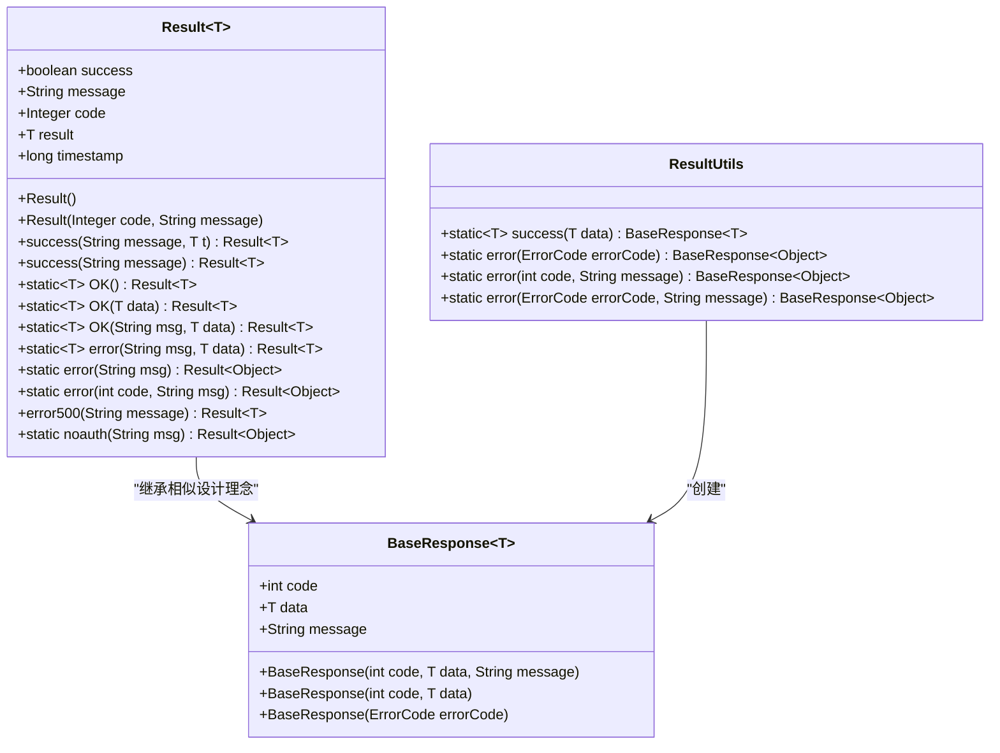
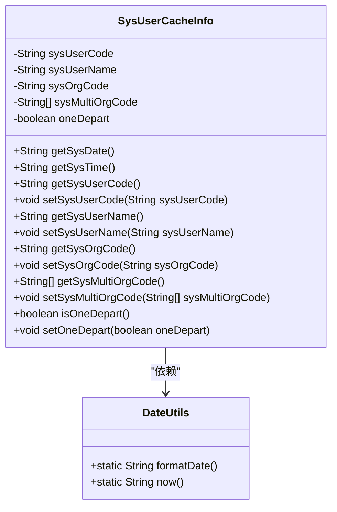
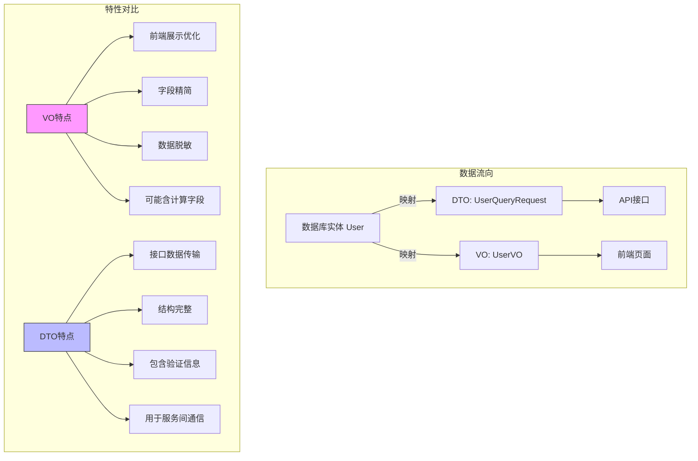
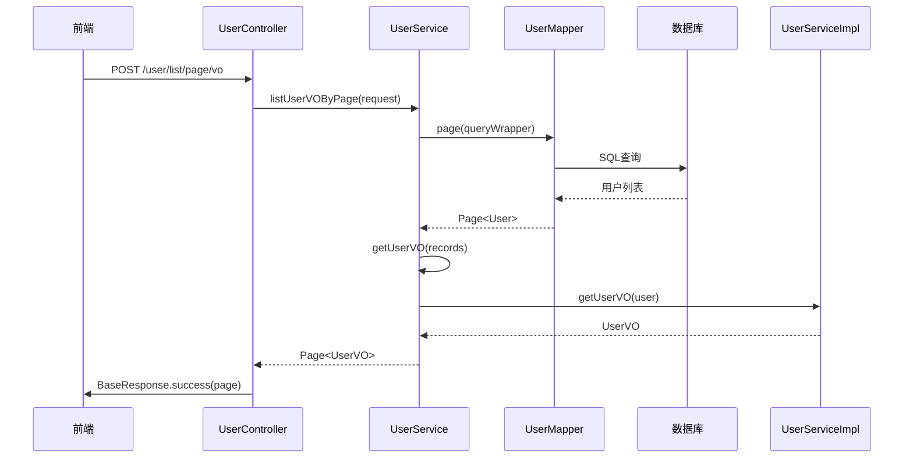

# 视图对象（VO）

<cite>
**本文档引用文件**  
- [Result.java](file://yun-docker-common/src/main/java/com/lfc/yundocker/common/model/vo/Result.java)
- [SysUserCacheInfo.java](file://yun-docker-common/src/main/java/com/lfc/yundocker/common/model/vo/SysUserCacheInfo.java)
- [ResultUtils.java](file://yun-docker-common/src/main/java/com/lfc/yundocker/common/util/ResultUtils.java)
- [UserVO.java](file://yun-docker-master/src/main/java/com/lfc/yundocker/common/model/vo/UserVO.java)
- [UserController.java](file://yun-docker-master/src/main/java/com/lfc/yundocker/controller/UserController.java)
- [UserService.java](file://yun-docker-master/src/main/java/com/lfc/yundocker/service/UserService.java)
- [UserServiceImpl.java](file://yun-docker-master/src/main/java/com/lfc/yundocker/service/impl/UserServiceImpl.java)
- [BaseResponse.java](file://yun-docker-common/src/main/java/com/lfc/yundocker/common/model/dto/BaseResponse.java)
- [CommonConstant.java](file://yun-docker-common/src/main/java/com/lfc/yundocker/common/constant/CommonConstant.java)
</cite>

## 目录
1. [简介](#简介)
2. [Result统一返回结构设计](#result统一返回结构设计)
3. [SysUserCacheInfo用户缓存数据结构](#sysusercacheinfo用户缓存数据结构)
4. [VO与DTO的区别](#vo与dto的区别)
5. [UserVO在接口中的实际应用](#uservo在接口中的实际应用)
6. [VO在RESTful API中的JSON输出示例](#vo在restful-api中的json输出示例)

## 简介
本文深入解析yun-docker-common模块中vo包的视图对象设计，重点分析Result类作为前端统一返回结构的泛型设计模式、SysUserCacheInfo在用户会话缓存中的数据结构，以及VO与DTO的区别。通过UserController中返回UserVO的案例，说明VO如何屏蔽敏感字段并增强安全性。

## Result统一返回结构设计

`Result`类是系统中用于统一API响应格式的核心视图对象，采用泛型设计模式，包含`code`、`msg`、`data`三要素，确保前后端交互的一致性和可预测性。

该类通过`success`和`error`系列静态方法提供便捷的构建方式，支持链式调用。其中`success`方法用于构建成功响应，`error`方法用于构建错误响应。响应中还包含时间戳字段，便于前端调试和性能分析。

`Result`类的泛型设计允许其携带任意类型的数据对象，提高了代码的复用性和类型安全性。结合`ResultUtils`工具类，开发者可以快速构建标准化的响应结果。



**图示来源**
- [Result.java](file://yun-docker-common/src/main/java/com/lfc/yundocker/common/model/vo/Result.java#L1-L173)
- [ResultUtils.java](file://yun-docker-common/src/main/java/com/lfc/yundocker/common/util/ResultUtils.java#L1-L56)
- [BaseResponse.java](file://yun-docker-common/src/main/java/com/lfc/yundocker/common/model/dto/BaseResponse.java#L1-L37)

**本节来源**
- [Result.java](file://yun-docker-common/src/main/java/com/lfc/yundocker/common/model/vo/Result.java#L1-L173)
- [ResultUtils.java](file://yun-docker-common/src/main/java/com/lfc/yundocker/common/util/ResultUtils.java#L1-L56)

## SysUserCacheInfo用户缓存数据结构

`SysUserCacheInfo`类定义了用户在系统中的缓存信息结构，主要用于存储用户会话相关的上下文数据。该对象在Redis中以序列化形式存储，支持快速访问用户基本信息和权限数据。

其核心字段包括：
- `sysUserCode`：用户编码
- `sysUserName`：用户姓名
- `sysOrgCode`：组织机构编码
- `sysMultiOrgCode`：多组织机构编码列表
- `oneDepart`：是否为单一部门标识

该类还提供了`getSysDate`和`getSysTime`方法，通过调用`DateUtils`工具类动态获取当前日期和时间，避免在缓存中存储过期的时间戳。



**图示来源**
- [SysUserCacheInfo.java](file://yun-docker-common/src/main/java/com/lfc/yundocker/common/model/vo/SysUserCacheInfo.java#L1-L75)
- [DateUtils.java](file://yun-docker-common/src/main/java/com/lfc/yundocker/common/util/DateUtils.java)

**本节来源**
- [SysUserCacheInfo.java](file://yun-docker-common/src/main/java/com/lfc/yundocker/common/model/vo/SysUserCacheInfo.java#L1-L75)

## VO与DTO的区别

视图对象（VO）与数据传输对象（DTO）在系统架构中扮演不同角色：

**VO（View Object）**：
- 专为前端展示优化
- 可能包含计算字段或格式化后的数据
- 通常进行脱敏处理，屏蔽敏感信息
- 字段结构根据UI需求定制
- 在`UserVO`中体现为仅包含`id`、`userName`、`userAvatar`等前端需要的字段，而排除密码等敏感信息

**DTO（Data Transfer Object）**：
- 侧重于接口间的数据传输
- 通常与数据库实体或外部系统结构对应
- 包含完整的业务数据
- 用于服务间通信或与外部系统交互
- 如`UserQueryRequest`、`UserRegisterRequest`等请求参数对象

两者的主要区别在于使用场景和数据完整性：VO是面向视图的精简数据结构，DTO是面向传输的完整数据载体。



**图示来源**
- [UserVO.java](file://yun-docker-master/src/main/java/com/lfc/yundocker/common/model/vo/UserVO.java#L1-L43)
- [UserQueryRequest.java](file://yun-docker-common/src/main/java/com/lfc/yundocker/common/model/dto/user/UserQueryRequest.java)
- [UserRegisterRequest.java](file://yun-docker-common/src/main/java/com/lfc/yundocker/common/model/dto/user/UserRegisterRequest.java)

**本节来源**
- [UserVO.java](file://yun-docker-master/src/main/java/com/lfc/yundocker/common/model/vo/UserVO.java#L1-L43)

## UserVO在接口中的实际应用

`UserVO`在`UserController`中被广泛用于返回脱敏的用户信息，有效屏蔽了敏感字段如密码、余额等，增强了系统安全性。

通过`UserService`的`getUserVO`方法，将完整的`User`实体转换为精简的`UserVO`对象。该转换过程使用`BeanUtils.copyProperties`进行字段复制，确保数据一致性。

在`listUserVOByPage`接口中，系统先查询用户分页数据，然后批量转换为`UserVO`列表，最后通过`ResultUtils.success`包装返回。这种设计既保证了数据安全，又提高了接口性能。



**图示来源**
- [UserController.java](file://yun-docker-master/src/main/java/com/lfc/yundocker/controller/UserController.java#L1-L309)
- [UserService.java](file://yun-docker-master/src/main/java/com/lfc/yundocker/service/UserService.java#L1-L124)
- [UserServiceImpl.java](file://yun-docker-master/src/main/java/com/lfc/yundocker/service/impl/UserServiceImpl.java#L1-L301)

**本节来源**
- [UserController.java](file://yun-docker-master/src/main/java/com/lfc/yundocker/controller/UserController.java#L1-L309)
- [UserServiceImpl.java](file://yun-docker-master/src/main/java/com/lfc/yundocker/service/impl/UserServiceImpl.java#L1-L301)

## VO在RESTful API中的JSON输出示例

当调用返回`UserVO`的API接口时，前端接收到的JSON响应格式如下：

```json
{
  "code": 200,
  "data": {
    "id": 12345,
    "userName": "张三",
    "userAvatar": "https://example.com/avatar.jpg",
    "userRole": "user",
    "createTime": "2024-01-01T10:00:00"
  },
  "message": "ok",
  "timestamp": 1704086400000
}
```

或在分页查询场景下：

```json
{
  "code": 200,
  "data": {
    "records": [
      {
        "id": 12345,
        "userName": "张三",
        "userAvatar": "https://example.com/avatar.jpg",
        "userRole": "user",
        "createTime": "2024-01-01T10:00:00"
      },
      {
        "id": 12346,
        "userName": "李四",
        "userAvatar": "https://example.com/avatar2.jpg",
        "userRole": "admin",
        "createTime": "2024-01-02T11:00:00"
      }
    ],
    "total": 2,
    "size": 10,
    "current": 1,
    "searchCount": true,
    "pages": 1
  },
  "message": "ok",
  "timestamp": 1704086400000
}
```

这些响应通过`Result`包装，确保了统一的接口规范，便于前端统一处理。

**本节来源**
- [Result.java](file://yun-docker-common/src/main/java/com/lfc/yundocker/common/model/vo/Result.java#L1-L173)
- [UserVO.java](file://yun-docker-master/src/main/java/com/lfc/yundocker/common/model/vo/UserVO.java#L1-L43)
- [UserController.java](file://yun-docker-master/src/main/java/com/lfc/yundocker/controller/UserController.java#L1-L309)