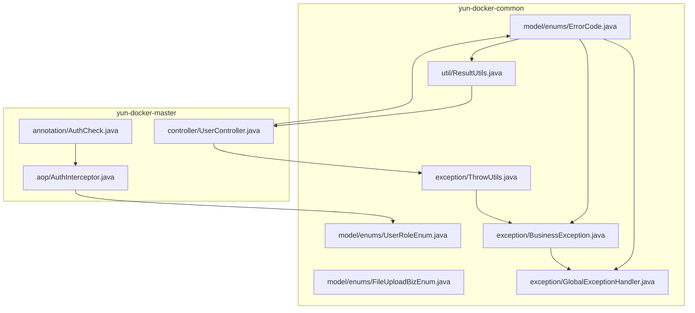
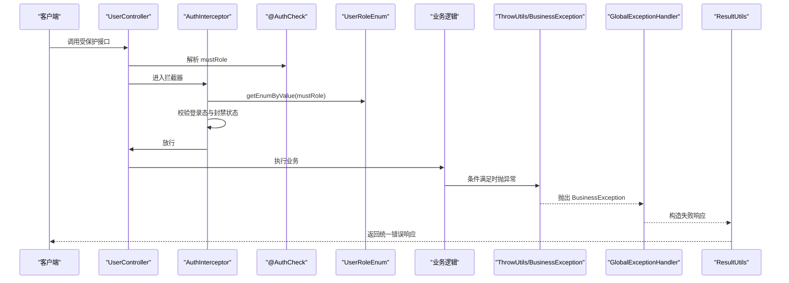
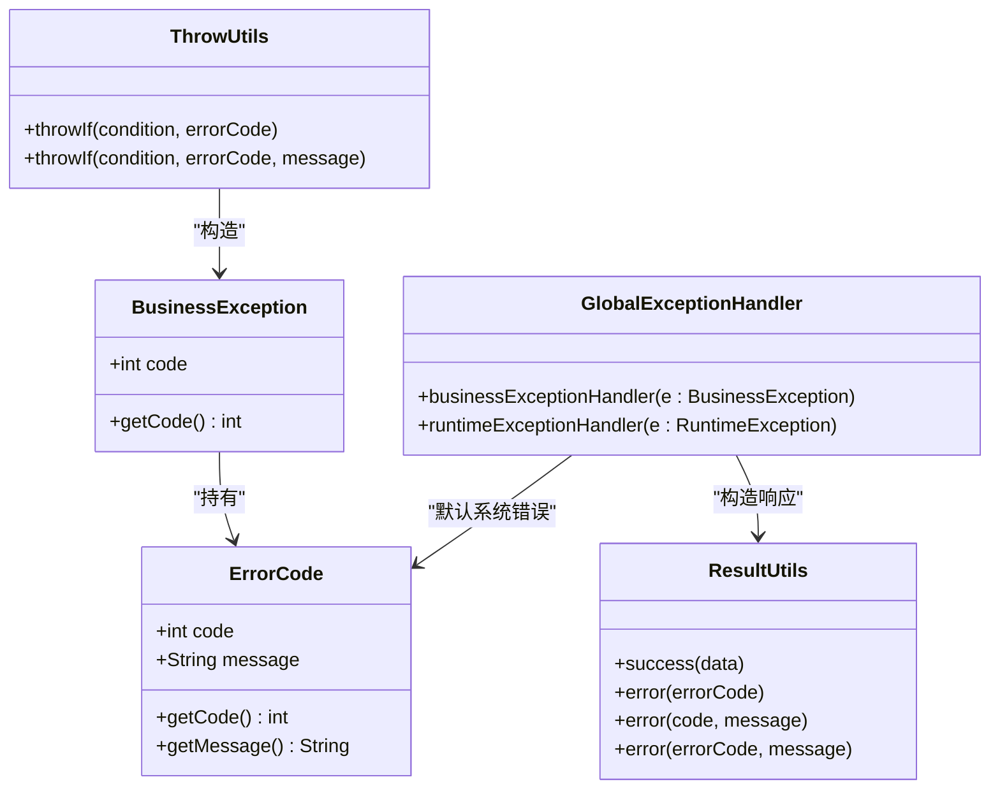
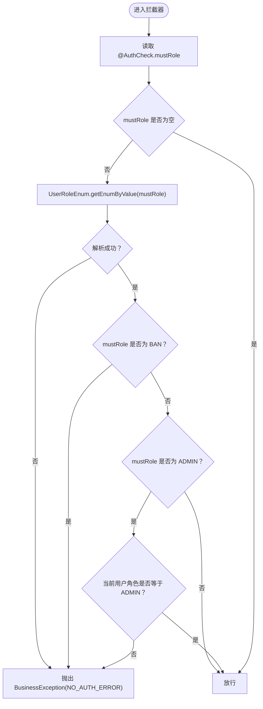
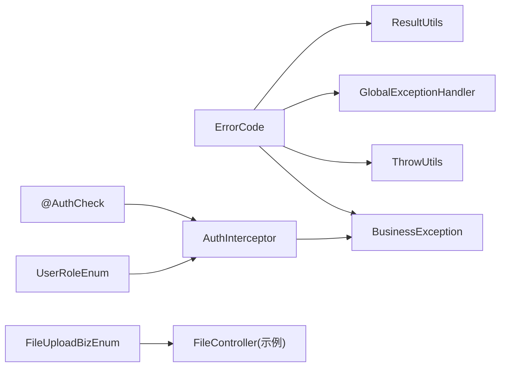

# 枚举与错误码体系

<cite>
**本文引用的文件**
- [ErrorCode.java](file://yun-docker-common/src/main/java/com/lfc/yundocker/common/model/enums/ErrorCode.java)
- [UserRoleEnum.java](file://yun-docker-common/src/main/java/com/lfc/yundocker/common/model/enums/UserRoleEnum.java)
- [FileUploadBizEnum.java](file://yun-docker-common/src/main/java/com/lfc/yundocker/common/model/enums/FileUploadBizEnum.java)
- [ThrowUtils.java](file://yun-docker-common/src/main/java/com/lfc/yundocker/common/exception/ThrowUtils.java)
- [BusinessException.java](file://yun-docker-common/src/main/java/com/lfc/yundocker/common/exception/BusinessException.java)
- [GlobalExceptionHandler.java](file://yun-docker-common/src/main/java/com/lfc/yundocker/common/exception/GlobalExceptionHandler.java)
- [ResultUtils.java](file://yun-docker-common/src/main/java/com/lfc/yundocker/common/util/ResultUtils.java)
- [AuthCheck.java](file://yun-docker-master/src/main/java/com/lfc/yundocker/annotation/AuthCheck.java)
- [AuthInterceptor.java](file://yun-docker-master/src/main/java/com/lfc/yundocker/aop/AuthInterceptor.java)
- [UserController.java](file://yun-docker-master/src/main/java/com/lfc/yundocker/controller/UserController.java)
</cite>

## 目录
1. [引言](#引言)
2. [项目结构](#项目结构)
3. [核心组件](#核心组件)
4. [架构总览](#架构总览)
5. [详细组件分析](#详细组件分析)
6. [依赖分析](#依赖分析)
7. [性能考虑](#性能考虑)
8. [故障排查指南](#故障排查指南)
9. [结论](#结论)
10. [附录：扩展自定义错误码指南](#附录扩展自定义错误码指南)

## 引言
本文件聚焦于 yun-docker-common 模块中 enums 包的三枚举设计：ErrorCode 统一错误码与消息、UserRoleEnum 支持权限校验、FileUploadBizEnum 区分文件上传业务类型。同时梳理 ThrowUtils 抛错工具、BusinessException 异常模型、GlobalExceptionHandler 全局异常处理以及 ResultUtils 统一响应构造之间的协作关系，并结合 UserController 中的权限校验示例，说明枚举在提升可读性与避免魔法值方面的价值。

## 项目结构
- yun-docker-common 提供通用能力：异常体系、枚举、工具类等
- yun-docker-master 提供业务控制器与 AOP 权限校验
- 枚举位于 yun-docker-common/model/enums 下，异常与工具位于 common/exception 与 common/util 下

图表来源
- [ErrorCode.java](file://yun-docker-common/src/main/java/com/lfc/yundocker/common/model/enums/ErrorCode.java#L1-L49)
- [UserRoleEnum.java](file://yun-docker-common/src/main/java/com/lfc/yundocker/common/model/enums/UserRoleEnum.java#L1-L64)
- [FileUploadBizEnum.java](file://yun-docker-common/src/main/java/com/lfc/yundocker/common/model/enums/FileUploadBizEnum.java#L1-L62)
- [ThrowUtils.java](file://yun-docker-common/src/main/java/com/lfc/yundocker/common/exception/ThrowUtils.java#L1-L46)
- [BusinessException.java](file://yun-docker-common/src/main/java/com/lfc/yundocker/common/exception/BusinessException.java#L1-L37)
- [GlobalExceptionHandler.java](file://yun-docker-common/src/main/java/com/lfc/yundocker/common/exception/GlobalExceptionHandler.java#L1-L32)
- [ResultUtils.java](file://yun-docker-common/src/main/java/com/lfc/yundocker/common/util/ResultUtils.java#L1-L56)
- [AuthCheck.java](file://yun-docker-master/src/main/java/com/lfc/yundocker/annotation/AuthCheck.java#L1-L29)
- [AuthInterceptor.java](file://yun-docker-master/src/main/java/com/lfc/yundocker/aop/AuthInterceptor.java#L1-L70)
- [UserController.java](file://yun-docker-master/src/main/java/com/lfc/yundocker/controller/UserController.java#L1-L309)

章节来源
- [ErrorCode.java](file://yun-docker-common/src/main/java/com/lfc/yundocker/common/model/enums/ErrorCode.java#L1-L49)
- [UserRoleEnum.java](file://yun-docker-common/src/main/java/com/lfc/yundocker/common/model/enums/UserRoleEnum.java#L1-L64)
- [FileUploadBizEnum.java](file://yun-docker-common/src/main/java/com/lfc/yundocker/common/model/enums/FileUploadBizEnum.java#L1-L62)
- [ThrowUtils.java](file://yun-docker-common/src/main/java/com/lfc/yundocker/common/exception/ThrowUtils.java#L1-L46)
- [BusinessException.java](file://yun-docker-common/src/main/java/com/lfc/yundocker/common/exception/BusinessException.java#L1-L37)
- [GlobalExceptionHandler.java](file://yun-docker-common/src/main/java/com/lfc/yundocker/common/exception/GlobalExceptionHandler.java#L1-L32)
- [ResultUtils.java](file://yun-docker-common/src/main/java/com/lfc/yundocker/common/util/ResultUtils.java#L1-L56)
- [AuthCheck.java](file://yun-docker-master/src/main/java/com/lfc/yundocker/annotation/AuthCheck.java#L1-L29)
- [AuthInterceptor.java](file://yun-docker-master/src/main/java/com/lfc/yundocker/aop/AuthInterceptor.java#L1-L70)
- [UserController.java](file://yun-docker-master/src/main/java/com/lfc/yundocker/controller/UserController.java#L1-L309)

## 核心组件
- ErrorCode：集中定义业务错误码与消息，作为全局错误语义的唯一来源，贯穿异常抛出、异常处理与响应构造
- ThrowUtils：条件抛错工具，支持基于 ErrorCode 的快速抛异常，避免魔法值
- BusinessException：承载错误码与消息的运行时异常
- GlobalExceptionHandler：统一捕获业务异常与运行时异常，返回标准化响应
- ResultUtils：统一成功/失败响应构造，支持从 ErrorCode 构造失败响应
- UserRoleEnum：角色枚举，配合 AuthCheck 注解与 AuthInterceptor 实现权限校验
- FileUploadBizEnum：文件上传业务类型枚举，用于区分头像、文档等不同业务域

章节来源
- [ErrorCode.java](file://yun-docker-common/src/main/java/com/lfc/yundocker/common/model/enums/ErrorCode.java#L1-L49)
- [ThrowUtils.java](file://yun-docker-common/src/main/java/com/lfc/yundocker/common/exception/ThrowUtils.java#L1-L46)
- [BusinessException.java](file://yun-docker-common/src/main/java/com/lfc/yundocker/common/exception/BusinessException.java#L1-L37)
- [GlobalExceptionHandler.java](file://yun-docker-common/src/main/java/com/lfc/yundocker/common/exception/GlobalExceptionHandler.java#L1-L32)
- [ResultUtils.java](file://yun-docker-common/src/main/java/com/lfc/yundocker/common/util/ResultUtils.java#L1-L56)
- [UserRoleEnum.java](file://yun-docker-common/src/main/java/com/lfc/yundocker/common/model/enums/UserRoleEnum.java#L1-L64)
- [FileUploadBizEnum.java](file://yun-docker-common/src/main/java/com/lfc/yundocker/common/model/enums/FileUploadBizEnum.java#L1-L62)

## 架构总览
下图展示从控制器到权限校验、异常抛出、全局异常处理与响应返回的整体流程。

图表来源
- [UserController.java](file://yun-docker-master/src/main/java/com/lfc/yundocker/controller/UserController.java#L140-L214)
- [AuthInterceptor.java](file://yun-docker-master/src/main/java/com/lfc/yundocker/aop/AuthInterceptor.java#L40-L67)
- [AuthCheck.java](file://yun-docker-master/src/main/java/com/lfc/yundocker/annotation/AuthCheck.java#L16-L28)
- [UserRoleEnum.java](file://yun-docker-common/src/main/java/com/lfc/yundocker/common/model/enums/UserRoleEnum.java#L34-L54)
- [ThrowUtils.java](file://yun-docker-common/src/main/java/com/lfc/yundocker/common/exception/ThrowUtils.java#L19-L45)
- [BusinessException.java](file://yun-docker-common/src/main/java/com/lfc/yundocker/common/exception/BusinessException.java#L11-L37)
- [GlobalExceptionHandler.java](file://yun-docker-common/src/main/java/com/lfc/yundocker/common/exception/GlobalExceptionHandler.java#L19-L31)
- [ResultUtils.java](file://yun-docker-common/src/main/java/com/lfc/yundocker/common/util/ResultUtils.java#L21-L54)

## 详细组件分析

### ErrorCode 枚举：统一错误码与消息
- 设计要点
  - 使用固定整型错误码与人类可读消息，避免魔法值
  - 覆盖常见业务场景：参数错误、未登录、无权限、数据不存在、禁止访问、系统异常、Docker 计算节点异常、操作失败、余额不足、订单状态异常等
  - 提供 code 与 message 的只读访问器，便于在异常与响应中复用
- 在全局异常处理中的作用
  - BusinessException 可携带 ErrorCode，GlobalExceptionHandler 捕获后通过 ResultUtils.error 将错误码与消息映射为统一响应
- 在抛错工具中的作用
  - ThrowUtils.throwIf(condition, ErrorCode) 快速构造 BusinessException 并抛出，简化调用端代码

图表来源
- [ErrorCode.java](file://yun-docker-common/src/main/java/com/lfc/yundocker/common/model/enums/ErrorCode.java#L10-L48)
- [BusinessException.java](file://yun-docker-common/src/main/java/com/lfc/yundocker/common/exception/BusinessException.java#L11-L37)
- [ThrowUtils.java](file://yun-docker-common/src/main/java/com/lfc/yundocker/common/exception/ThrowUtils.java#L19-L45)
- [GlobalExceptionHandler.java](file://yun-docker-common/src/main/java/com/lfc/yundocker/common/exception/GlobalExceptionHandler.java#L19-L31)
- [ResultUtils.java](file://yun-docker-common/src/main/java/com/lfc/yundocker/common/util/ResultUtils.java#L21-L54)

章节来源
- [ErrorCode.java](file://yun-docker-common/src/main/java/com/lfc/yundocker/common/model/enums/ErrorCode.java#L10-L48)
- [BusinessException.java](file://yun-docker-common/src/main/java/com/lfc/yundocker/common/exception/BusinessException.java#L11-L37)
- [ThrowUtils.java](file://yun-docker-common/src/main/java/com/lfc/yundocker/common/exception/ThrowUtils.java#L19-L45)
- [GlobalExceptionHandler.java](file://yun-docker-common/src/main/java/com/lfc/yundocker/common/exception/GlobalExceptionHandler.java#L19-L31)
- [ResultUtils.java](file://yun-docker-common/src/main/java/com/lfc/yundocker/common/util/ResultUtils.java#L21-L54)

### ThrowUtils 与 BusinessException：条件抛错与异常模型
- ThrowUtils.throwIf(condition, ErrorCode[, message])：当条件满足时抛出 BusinessException，避免在各处重复 new 异常
- BusinessException：支持三种构造方式，优先使用 ErrorCode 以确保错误码与消息一致
- 在控制器中的应用
  - UserController 中多处使用 BusinessException 或 ThrowUtils.throwIf(...) 统一抛错，保证错误语义一致

章节来源
- [ThrowUtils.java](file://yun-docker-common/src/main/java/com/lfc/yundocker/common/exception/ThrowUtils.java#L19-L45)
- [BusinessException.java](file://yun-docker-common/src/main/java/com/lfc/yundocker/common/exception/BusinessException.java#L11-L37)
- [UserController.java](file://yun-docker-master/src/main/java/com/lfc/yundocker/controller/UserController.java#L147-L214)

### GlobalExceptionHandler：异常拦截与统一响应
- 捕获 BusinessException：记录日志并使用 ResultUtils.error(code, message) 返回
- 捕获 RuntimeException：默认返回 ErrorCode.SYSTEM_ERROR 对应的系统错误响应
- 与 ResultUtils 协作：将错误码与消息映射为统一响应体

章节来源
- [GlobalExceptionHandler.java](file://yun-docker-common/src/main/java/com/lfc/yundocker/common/exception/GlobalExceptionHandler.java#L19-L31)
- [ResultUtils.java](file://yun-docker-common/src/main/java/com/lfc/yundocker/common/util/ResultUtils.java#L21-L54)

### UserRoleEnum：权限控制中的角色判断
- 角色定义：USER、ADMIN、BAN，提供文本与值字段
- 工具方法：
  - getValues()：返回所有角色值列表
  - getEnumByValue(value)：按值查找对应枚举
- 与 AuthCheck 注解和 AuthInterceptor 协作
  - AuthCheck.mostRole 指定所需角色字符串
  - AuthInterceptor.doInterceptor 读取 mustRole，通过 UserRoleEnum.getEnumByValue 解析目标角色
  - 若 mustRole 为 ADMIN，则要求当前用户角色与之完全一致；若 mustRole 为 BAN，则直接拒绝
  - 未登录或无权限时抛出 BusinessException(ErrorCode.NO_AUTH_ERROR)

图表来源
- [AuthInterceptor.java](file://yun-docker-master/src/main/java/com/lfc/yundocker/aop/AuthInterceptor.java#L40-L67)
- [UserRoleEnum.java](file://yun-docker-common/src/main/java/com/lfc/yundocker/common/model/enums/UserRoleEnum.java#L34-L54)
- [BusinessException.java](file://yun-docker-common/src/main/java/com/lfc/yundocker/common/exception/BusinessException.java#L11-L37)

章节来源
- [AuthCheck.java](file://yun-docker-master/src/main/java/com/lfc/yundocker/annotation/AuthCheck.java#L16-L28)
- [AuthInterceptor.java](file://yun-docker-master/src/main/java/com/lfc/yundocker/aop/AuthInterceptor.java#L40-L67)
- [UserRoleEnum.java](file://yun-docker-common/src/main/java/com/lfc/yundocker/common/model/enums/UserRoleEnum.java#L14-L64)

### FileUploadBizEnum：文件上传业务类型区分
- 当前定义：USER_AVATAR（用户头像）
- 工具方法：getValues()、getEnumByValue(value)
- 使用场景：在文件上传控制器中对业务类型进行校验与分流，例如区分头像与文档等

章节来源
- [FileUploadBizEnum.java](file://yun-docker-common/src/main/java/com/lfc/yundocker/common/model/enums/FileUploadBizEnum.java#L14-L61)

### 控制器示例：权限校验与错误码使用
- 添加用户接口使用 @AuthCheck(mustRole = UserConstant.ADMIN_ROLE)，实现管理员权限校验
- 多处使用 BusinessException 或 ThrowUtils.throwIf(...) 抛出 ErrorCode.PARAMS_ERROR、ErrorCode.NOT_FOUND_ERROR、ErrorCode.OPERATION_ERROR 等

章节来源
- [UserController.java](file://yun-docker-master/src/main/java/com/lfc/yundocker/controller/UserController.java#L147-L214)

## 依赖分析
- 枚举与异常/工具的关系
  - ErrorCode 与 BusinessException、ThrowUtils、GlobalExceptionHandler、ResultUtils 形成闭环，确保错误语义一致且响应统一
- 权限控制链路
  - AuthCheck 注解 + AuthInterceptor + UserRoleEnum + BusinessException 构成权限校验闭环
- 文件上传业务
  - FileUploadBizEnum 与上传控制器配合，用于业务类型识别与校验

图表来源
- [ErrorCode.java](file://yun-docker-common/src/main/java/com/lfc/yundocker/common/model/enums/ErrorCode.java#L10-L48)
- [BusinessException.java](file://yun-docker-common/src/main/java/com/lfc/yundocker/common/exception/BusinessException.java#L11-L37)
- [ThrowUtils.java](file://yun-docker-common/src/main/java/com/lfc/yundocker/common/exception/ThrowUtils.java#L19-L45)
- [GlobalExceptionHandler.java](file://yun-docker-common/src/main/java/com/lfc/yundocker/common/exception/GlobalExceptionHandler.java#L19-L31)
- [ResultUtils.java](file://yun-docker-common/src/main/java/com/lfc/yundocker/common/util/ResultUtils.java#L21-L54)
- [UserRoleEnum.java](file://yun-docker-common/src/main/java/com/lfc/yundocker/common/model/enums/UserRoleEnum.java#L14-L64)
- [AuthInterceptor.java](file://yun-docker-master/src/main/java/com/lfc/yundocker/aop/AuthInterceptor.java#L40-L67)
- [AuthCheck.java](file://yun-docker-master/src/main/java/com/lfc/yundocker/annotation/AuthCheck.java#L16-L28)

## 性能考虑
- 枚举比较与查找：UserRoleEnum.getEnumByValue 采用线性遍历，values() 数量较小，开销可忽略
- 异常路径：异常抛出与捕获成本高于正常分支，应尽量在业务层通过条件判断避免异常
- 全局异常处理：日志记录与响应构造为轻量操作，注意避免在异常处理中执行重 IO

## 故障排查指南
- 参数错误
  - 现象：返回 ErrorCode.PARAMS_ERROR
  - 排查：检查请求参数是否为空或格式不正确
  - 参考：[UserController.java](file://yun-docker-master/src/main/java/com/lfc/yundocker/controller/UserController.java#L147-L214)
- 未登录/无权限
  - 现象：返回 ErrorCode.NO_AUTH_ERROR
  - 排查：确认登录态、mustRole 配置是否正确、用户角色是否为 ADMIN 或 BAN
  - 参考：[AuthInterceptor.java](file://yun-docker-master/src/main/java/com/lfc/yundocker/aop/AuthInterceptor.java#L40-L67)
- 数据不存在
  - 现象：返回 ErrorCode.NOT_FOUND_ERROR
  - 排查：确认查询 ID 是否有效、数据库是否存在对应记录
  - 参考：[UserController.java](file://yun-docker-master/src/main/java/com/lfc/yundocker/controller/UserController.java#L205-L214)
- 操作失败
  - 现象：返回 ErrorCode.OPERATION_ERROR
  - 排查：确认持久化操作是否成功、事务是否提交
  - 参考：[ThrowUtils.java](file://yun-docker-common/src/main/java/com/lfc/yundocker/common/exception/ThrowUtils.java#L19-L45)
- 系统异常
  - 现象：返回 ErrorCode.SYSTEM_ERROR
  - 排查：查看 GlobalExceptionHandler 日志，定位具体异常根因
  - 参考：[GlobalExceptionHandler.java](file://yun-docker-common/src/main/java/com/lfc/yundocker/common/exception/GlobalExceptionHandler.java#L19-L31)

章节来源
- [UserController.java](file://yun-docker-master/src/main/java/com/lfc/yundocker/controller/UserController.java#L147-L214)
- [AuthInterceptor.java](file://yun-docker-master/src/main/java/com/lfc/yundocker/aop/AuthInterceptor.java#L40-L67)
- [ThrowUtils.java](file://yun-docker-common/src/main/java/com/lfc/yundocker/common/exception/ThrowUtils.java#L19-L45)
- [GlobalExceptionHandler.java](file://yun-docker-common/src/main/java/com/lfc/yundocker/common/exception/GlobalExceptionHandler.java#L19-L31)

## 结论
- 枚举设计通过 ErrorCode、UserRoleEnum、FileUploadBizEnum 明确了错误语义、权限模型与业务类型，显著提升了代码可读性与一致性
- ThrowUtils 与 BusinessException 将异常抛出标准化，配合 GlobalExceptionHandler 与 ResultUtils 实现统一响应
- 在控制器中广泛使用枚举与抛错工具，减少魔法值，提高维护性
- 权限控制通过注解与 AOP 切面实现，逻辑清晰、易于扩展

## 附录：扩展自定义错误码指南
- 新增错误码
  - 在 ErrorCode 中添加新的枚举常量，定义唯一的 code 与 message
  - 确保 code 不与其他枚举冲突，建议按类别预留区间段
- 抛错策略
  - 优先使用 ThrowUtils.throwIf(condition, ErrorCode[, message])，保持调用端简洁
  - 对于复杂错误场景，可使用 BusinessException(ErrorCode, message) 指定自定义消息
- 全局处理
  - 无需修改 GlobalExceptionHandler，新增的 ErrorCode 会自动映射到响应
- 权限扩展
  - 如需新增角色，扩展 UserRoleEnum 并在 @AuthCheck.mostRole 中使用新值
  - 如需更复杂的权限规则，可在 AuthInterceptor 中增加分支逻辑
- 文件上传扩展
  - 在 FileUploadBizEnum 中新增业务类型，并在上传控制器中使用 getEnumByValue 进行校验

章节来源
- [ErrorCode.java](file://yun-docker-common/src/main/java/com/lfc/yundocker/common/model/enums/ErrorCode.java#L10-L48)
- [ThrowUtils.java](file://yun-docker-common/src/main/java/com/lfc/yundocker/common/exception/ThrowUtils.java#L19-L45)
- [BusinessException.java](file://yun-docker-common/src/main/java/com/lfc/yundocker/common/exception/BusinessException.java#L11-L37)
- [GlobalExceptionHandler.java](file://yun-docker-common/src/main/java/com/lfc/yundocker/common/exception/GlobalExceptionHandler.java#L19-L31)
- [UserRoleEnum.java](file://yun-docker-common/src/main/java/com/lfc/yundocker/common/model/enums/UserRoleEnum.java#L14-L64)
- [FileUploadBizEnum.java](file://yun-docker-common/src/main/java/com/lfc/yundocker/common/model/enums/FileUploadBizEnum.java#L14-L61)