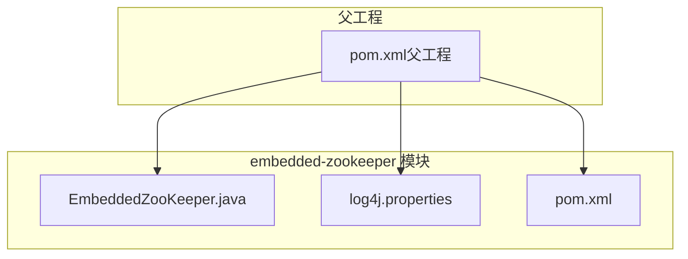
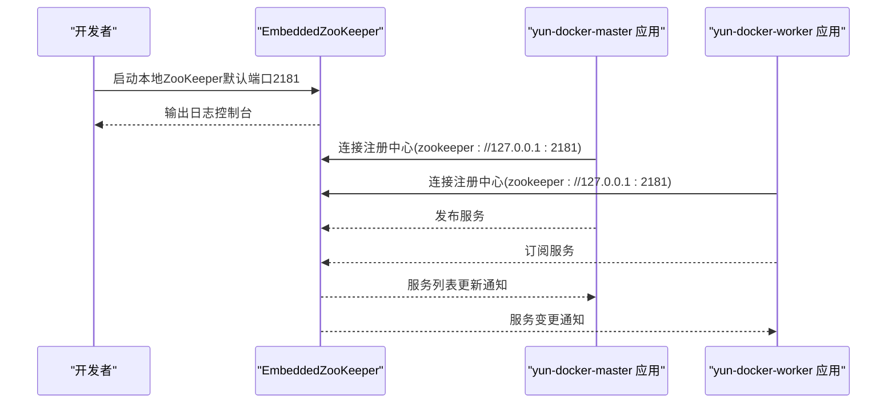
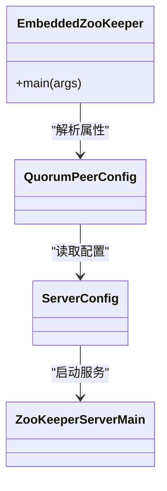
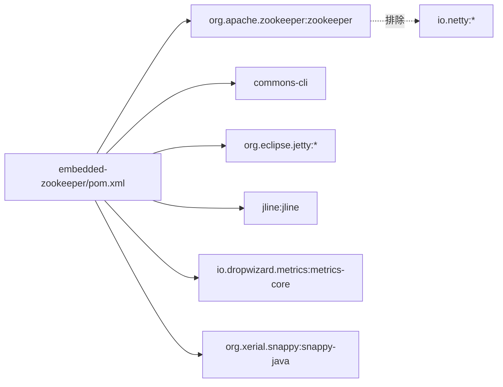

# 内嵌ZooKeeper模块

<cite>
**本文引用的文件**
- [EmbeddedZooKeeper.java](file://embedded-zookeeper/src/main/java/com/lfc/zookeeper/EmbeddedZooKeeper.java)
- [log4j.properties](file://embedded-zookeeper/src/main/resources/log4j.properties)
- [pom.xml](file://embedded-zookeeper/pom.xml)
- [pom.xml（父工程）](file://pom.xml)
- [application.yml（master）](file://yun-docker-master/src/main/resources/application.yml)
- [application-dev.yml（master）](file://yun-docker-master/src/main/resources/application-dev.yml)
- [application-prod.yml（master）](file://yun-docker-master/src/main/resources/application-prod.yml)
- [application.yml（worker）](file://yun-docker-worker/src/main/resources/application.yml)
- [application-dev.yml（worker）](file://yun-docker-worker/src/main/resources/application-dev.yml)
</cite>

## 目录
1. [简介](#简介)
2. [项目结构](#项目结构)
3. [核心组件](#核心组件)
4. [架构总览](#架构总览)
5. [详细组件分析](#详细组件分析)
6. [依赖关系分析](#依赖关系分析)
7. [性能与资源特性](#性能与资源特性)
8. [故障排查指南](#故障排查指南)
9. [结论与最佳实践](#结论与最佳实践)
10. [附录：配置切换指南](#附录配置切换指南)

## 简介
本文件面向“embedded-zookeeper”模块的技术文档，旨在说明该模块如何在开发测试环境中提供内嵌的ZooKeeper服务，帮助开发者在本地快速启动一个轻量级ZooKeeper实例，用于Dubbo服务注册与发现等场景。文档将从系统架构、组件职责、数据流与处理逻辑、依赖关系、性能与资源特性、故障排查以及生产环境替代方案等方面进行深入解析，并给出配置切换的实操建议。

## 项目结构
embedded-zookeeper是一个独立的子模块，位于仓库根目录下的embedded-zookeeper目录中，采用标准Maven多模块结构组织。其核心由以下部分组成：
- Java源码：EmbeddedZooKeeper类，负责通过ZooKeeper原生API启动本地ZooKeeper实例。
- 资源：log4j.properties，定义模块内部的日志级别与输出格式。
- 构建脚本：pom.xml，声明ZooKeeper依赖、编译参数与执行入口。

图表来源
- [pom.xml（父工程）](file://pom.xml#L18-L24)
- [EmbeddedZooKeeper.java](file://embedded-zookeeper/src/main/java/com/lfc/zookeeper/EmbeddedZooKeeper.java#L1-L40)
- [log4j.properties](file://embedded-zookeeper/src/main/resources/log4j.properties#L1-L9)
- [pom.xml](file://embedded-zookeeper/pom.xml#L1-L104)

章节来源
- [pom.xml（父工程）](file://pom.xml#L18-L24)
- [pom.xml](file://embedded-zookeeper/pom.xml#L1-L104)

## 核心组件
- EmbeddedZooKeeper：通过ZooKeeper原生API启动本地ZooKeeper实例，支持端口参数化，默认端口为2181；数据目录位于临时目录下并随进程退出自动清理。
- log4j.properties：定义模块内部日志级别与控制台输出格式，便于本地调试观察ZooKeeper运行状态。
- ZooKeeper依赖与构建：通过Maven引入ZooKeeper核心依赖，并排除部分Netty相关传递依赖以避免冲突；同时配置exec插件指向Dubbo示例的主类，但当前模块主类为EmbeddedZooKeeper。

章节来源
- [EmbeddedZooKeeper.java](file://embedded-zookeeper/src/main/java/com/lfc/zookeeper/EmbeddedZooKeeper.java#L13-L39)
- [log4j.properties](file://embedded-zookeeper/src/main/resources/log4j.properties#L1-L9)
- [pom.xml](file://embedded-zookeeper/pom.xml#L17-L21)
- [pom.xml](file://embedded-zookeeper/pom.xml#L35-L79)
- [pom.xml](file://embedded-zookeeper/pom.xml#L81-L101)

## 架构总览
embedded-zookeeper在开发测试中的作用是作为本地ZooKeeper服务提供者，供上层应用（如master/worker模块）通过Dubbo注册中心进行服务注册与发现。其典型交互流程如下：

图表来源
- [EmbeddedZooKeeper.java](file://embedded-zookeeper/src/main/java/com/lfc/zookeeper/EmbeddedZooKeeper.java#L13-L39)
- [application-dev.yml（master）](file://yun-docker-master/src/main/resources/application-dev.yml#L10-L11)
- [application-dev.yml（worker）](file://yun-docker-worker/src/main/resources/application-dev.yml#L8-L9)

## 详细组件分析

### EmbeddedZooKeeper 类分析
EmbeddedZooKeeper通过ZooKeeper原生API启动本地实例，关键行为包括：
- 端口参数化：支持通过命令行传入端口号，默认2181。
- 数据目录：在系统临时目录下创建随机UUID命名的目录作为数据目录，并在进程退出时自动清理。
- 配置装配：使用QuorumPeerConfig读取属性，再由ServerConfig读取配置，最终交由ZooKeeperServerMain启动。
- 错误处理：捕获异常并打印堆栈，随后退出进程，保证本地调试时能快速定位问题。

图表来源
- [EmbeddedZooKeeper.java](file://embedded-zookeeper/src/main/java/com/lfc/zookeeper/EmbeddedZooKeeper.java#L13-L39)

章节来源
- [EmbeddedZooKeeper.java](file://embedded-zookeeper/src/main/java/com/lfc/zookeeper/EmbeddedZooKeeper.java#L13-L39)

### 日志配置与输出
- 日志级别：rootLogger设置为debug级别，输出到控制台。
- 控制台输出：ConsoleAppender，目标为System.out。
- 输出格式：PatternLayout，包含时间戳、线程、日志级别、类名与消息内容，便于快速定位ZooKeeper运行状态。

章节来源
- [log4j.properties](file://embedded-zookeeper/src/main/resources/log4j.properties#L1-L9)

### Dubbo注册中心配置（与ZooKeeper集成）
- master模块：开发环境默认连接本地ZooKeeper（zookeeper://127.0.0.1:2181），可通过zookeeper.address占位符覆盖。
- worker模块：开发环境同样默认连接本地ZooKeeper（zookeeper://127.0.0.1:2181），可通过zookeeper.address占位符覆盖。
- 生产环境：配置文件中保留了zookeeper.address占位符，便于在CI/CD或部署时注入真实集群地址。

章节来源
- [application.yml（master）](file://yun-docker-master/src/main/resources/application.yml#L1-L60)
- [application-dev.yml（master）](file://yun-docker-master/src/main/resources/application-dev.yml#L10-L11)
- [application-prod.yml（master）](file://yun-docker-master/src/main/resources/application-prod.yml#L9-L12)
- [application.yml（worker）](file://yun-docker-worker/src/main/resources/application.yml#L1-L51)
- [application-dev.yml（worker）](file://yun-docker-worker/src/main/resources/application-dev.yml#L8-L9)

## 依赖关系分析
embedded-zookeeper模块的依赖与构建要点：
- 依赖管理：通过导入ZooKeeper Parent POM进行版本统一管理。
- 核心依赖：zookeeper（含必要传递依赖），并显式排除了部分Netty相关传递依赖以避免冲突。
- 编译参数：Java 8兼容。
- 执行入口：exec插件配置了Dubbo示例的主类，但当前模块主类为EmbeddedZooKeeper；若需直接运行EmbeddedZooKeeper，可调整exec插件的mainClass或使用Java命令直接启动。

图表来源
- [pom.xml](file://embedded-zookeeper/pom.xml#L23-L33)
- [pom.xml](file://embedded-zookeeper/pom.xml#L35-L79)

章节来源
- [pom.xml](file://embedded-zookeeper/pom.xml#L17-L21)
- [pom.xml](file://embedded-zookeeper/pom.xml#L35-L79)
- [pom.xml](file://embedded-zookeeper/pom.xml#L81-L101)

## 性能与资源特性
- 单机轻量：EmbeddedZooKeeper以单机模式运行，适合本地开发与集成测试，不建议用于高并发或生产环境。
- 临时数据目录：数据目录位于系统临时目录，随进程退出自动清理，避免磁盘占用与残留。
- 端口占用：默认监听2181端口，若被占用可通过命令行参数切换端口。
- 日志开销：debug级别输出有助于调试，但在高负载下可能带来额外IO开销。

章节来源
- [EmbeddedZooKeeper.java](file://embedded-zookeeper/src/main/java/com/lfc/zookeeper/EmbeddedZooKeeper.java#L13-L39)
- [log4j.properties](file://embedded-zookeeper/src/main/resources/log4j.properties#L1-L9)

## 故障排查指南
- 端口冲突：若2181端口被占用，可通过命令行参数传入新的端口启动。
- 权限与路径：确保临时目录可写且有足够权限，避免因权限不足导致数据目录创建失败。
- 异常退出：若启动过程中抛出异常，程序会打印堆栈并退出。请结合控制台输出定位具体原因。
- 日志级别：若需要更详细的诊断信息，可在log4j.properties中调整rootLogger级别或布局格式。

章节来源
- [EmbeddedZooKeeper.java](file://embedded-zookeeper/src/main/java/com/lfc/zookeeper/EmbeddedZooKeeper.java#L13-L39)
- [log4j.properties](file://embedded-zookeeper/src/main/resources/log4j.properties#L1-L9)

## 结论与最佳实践
- embedded-zookeeper模块为本地开发提供了即开即用的ZooKeeper服务，显著降低了服务注册与发现的部署门槛。
- 在非生产环境下，建议优先使用该模块进行联调与集成测试；生产环境应使用独立部署的ZooKeeper集群，确保高可用与稳定性。
- 建议在团队内约定统一的ZooKeeper端口与数据目录策略，避免冲突；同时在CI/CD中通过环境变量注入zookeeper.address，实现配置集中化管理。

## 附录：配置切换指南
- 本地开发（默认）：master/worker模块均使用zookeeper://127.0.0.1:2181，可通过zookeeper.address占位符覆盖。
- 生产环境：在部署时通过环境变量或配置中心注入zookeeper.address的真实集群地址，确保服务注册与发现指向生产集群。

章节来源
- [application-dev.yml（master）](file://yun-docker-master/src/main/resources/application-dev.yml#L10-L11)
- [application-dev.yml（worker）](file://yun-docker-worker/src/main/resources/application-dev.yml#L8-L9)
- [application-prod.yml（master）](file://yun-docker-master/src/main/resources/application-prod.yml#L9-L12)