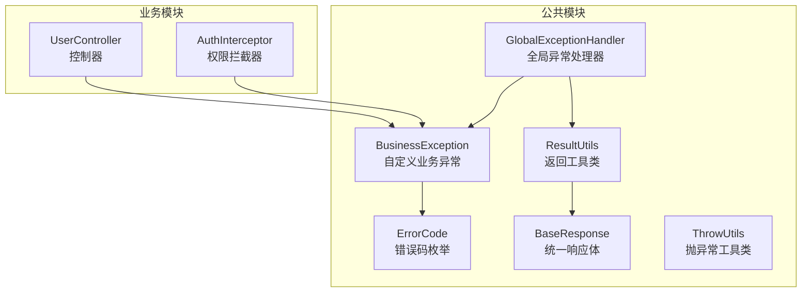
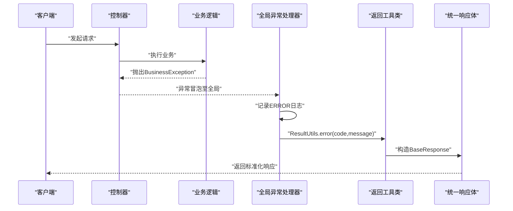
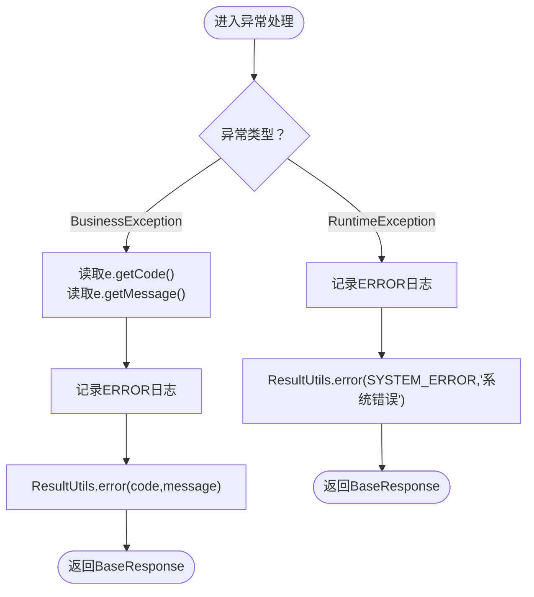
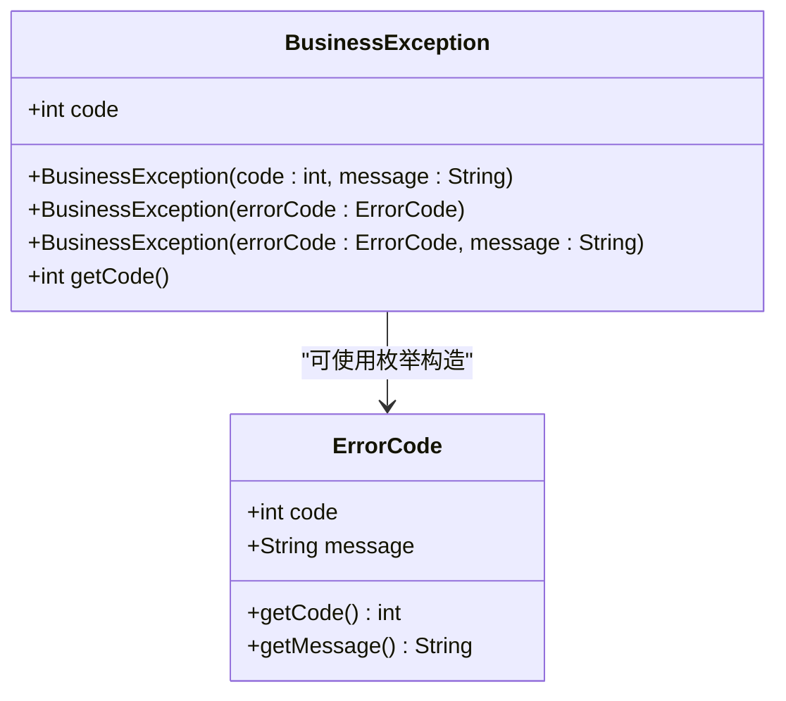
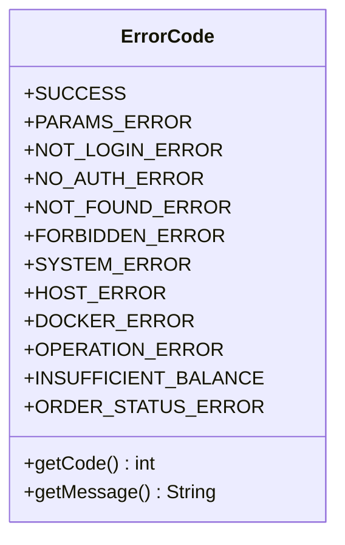
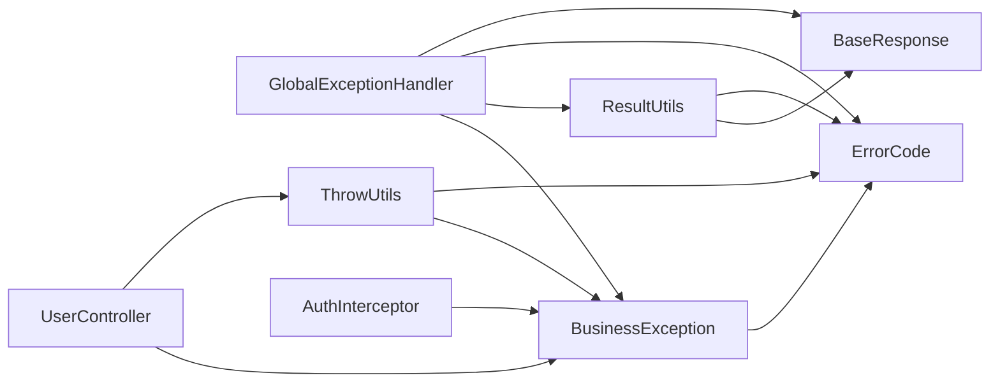

# 全局异常处理

<cite>
**本文引用的文件**
- [GlobalExceptionHandler.java](file://yun-docker-common/src/main/java/com/lfc/yundocker/common/exception/GlobalExceptionHandler.java)
- [BusinessException.java](file://yun-docker-common/src/main/java/com/lfc/yundocker/common/exception/BusinessException.java)
- [ErrorCode.java](file://yun-docker-common/src/main/java/com/lfc/yundocker/common/model/enums/ErrorCode.java)
- [BaseResponse.java](file://yun-docker-common/src/main/java/com/lfc/yundocker/common/model/dto/BaseResponse.java)
- [ResultUtils.java](file://yun-docker-common/src/main/java/com/lfc/yundocker/common/util/ResultUtils.java)
- [ThrowUtils.java](file://yun-docker-common/src/main/java/com/lfc/yundocker/common/exception/ThrowUtils.java)
- [UserController.java](file://yun-docker-master/src/main/java/com/lfc/yundocker/controller/UserController.java)
- [AuthInterceptor.java](file://yun-docker-master/src/main/java/com/lfc/yundocker/aop/AuthInterceptor.java)
</cite>

## 目录
1. [简介](#简介)
2. [项目结构](#项目结构)
3. [核心组件](#核心组件)
4. [架构总览](#架构总览)
5. [详细组件分析](#详细组件分析)
6. [依赖关系分析](#依赖关系分析)
7. [性能考量](#性能考量)
8. [故障排查指南](#故障排查指南)
9. [结论](#结论)
10. [附录](#附录)

## 简介
本文件系统化说明基于@RestControllerAdvice的全局异常处理机制，重点覆盖：
- GlobalExceptionHandler如何捕获BusinessException并返回包含错误码与错误信息的标准BaseResponse响应，同时记录ERROR日志
- 对RuntimeException的兜底处理策略：统一返回SYSTEM_ERROR码与“系统错误”提示，防止敏感信息泄露
- 结合ErrorCode枚举类说明错误码设计规范（如PARAMS_ERROR、NO_AUTH_ERROR等）及其在业务逻辑中的抛出场景
- 提供自定义业务异常的抛出与处理示例
- 讨论异常信息本地化、堆栈信息脱敏及监控告警集成方案

## 项目结构
全局异常处理相关代码集中在公共模块中，配合控制器与AOP拦截器在各业务层触发异常，最终由全局处理器统一收敛为标准响应。

图表来源
- [GlobalExceptionHandler.java](file://yun-docker-common/src/main/java/com/lfc/yundocker/common/exception/GlobalExceptionHandler.java#L1-L31)
- [BusinessException.java](file://yun-docker-common/src/main/java/com/lfc/yundocker/common/exception/BusinessException.java#L1-L36)
- [ErrorCode.java](file://yun-docker-common/src/main/java/com/lfc/yundocker/common/model/enums/ErrorCode.java#L1-L48)
- [BaseResponse.java](file://yun-docker-common/src/main/java/com/lfc/yundocker/common/model/dto/BaseResponse.java#L1-L36)
- [ResultUtils.java](file://yun-docker-common/src/main/java/com/lfc/yundocker/common/util/ResultUtils.java#L1-L55)
- [ThrowUtils.java](file://yun-docker-common/src/main/java/com/lfc/yundocker/common/exception/ThrowUtils.java#L1-L45)
- [UserController.java](file://yun-docker-master/src/main/java/com/lfc/yundocker/controller/UserController.java#L150-L309)
- [AuthInterceptor.java](file://yun-docker-master/src/main/java/com/lfc/yundocker/aop/AuthInterceptor.java#L45-L66)

章节来源
- [GlobalExceptionHandler.java](file://yun-docker-common/src/main/java/com/lfc/yundocker/common/exception/GlobalExceptionHandler.java#L1-L31)
- [BusinessException.java](file://yun-docker-common/src/main/java/com/lfc/yundocker/common/exception/BusinessException.java#L1-L36)
- [ErrorCode.java](file://yun-docker-common/src/main/java/com/lfc/yundocker/common/model/enums/ErrorCode.java#L1-L48)
- [BaseResponse.java](file://yun-docker-common/src/main/java/com/lfc/yundocker/common/model/dto/BaseResponse.java#L1-L36)
- [ResultUtils.java](file://yun-docker-common/src/main/java/com/lfc/yundocker/common/util/ResultUtils.java#L1-L55)
- [ThrowUtils.java](file://yun-docker-common/src/main/java/com/lfc/yundocker/common/exception/ThrowUtils.java#L1-L45)
- [UserController.java](file://yun-docker-master/src/main/java/com/lfc/yundocker/controller/UserController.java#L150-L309)
- [AuthInterceptor.java](file://yun-docker-master/src/main/java/com/lfc/yundocker/aop/AuthInterceptor.java#L45-L66)

## 核心组件
- 全局异常处理器：统一捕获业务异常与运行时异常，输出标准化响应并记录日志
- 业务异常类：承载错误码与消息，便于前端识别与展示
- 错误码枚举：定义标准错误码与文案，确保前后端一致
- 统一响应体：封装code、data、message字段，形成统一契约
- 返回工具类：提供success/error静态方法，简化响应构造
- 抛异常工具类：提供条件抛异常便捷方法，减少重复判断

章节来源
- [GlobalExceptionHandler.java](file://yun-docker-common/src/main/java/com/lfc/yundocker/common/exception/GlobalExceptionHandler.java#L1-L31)
- [BusinessException.java](file://yun-docker-common/src/main/java/com/lfc/yundocker/common/exception/BusinessException.java#L1-L36)
- [ErrorCode.java](file://yun-docker-common/src/main/java/com/lfc/yundocker/common/model/enums/ErrorCode.java#L1-L48)
- [BaseResponse.java](file://yun-docker-common/src/main/java/com/lfc/yundocker/common/model/dto/BaseResponse.java#L1-L36)
- [ResultUtils.java](file://yun-docker-common/src/main/java/com/lfc/yundocker/common/util/ResultUtils.java#L1-L55)
- [ThrowUtils.java](file://yun-docker-common/src/main/java/com/lfc/yundocker/common/exception/ThrowUtils.java#L1-L45)

## 架构总览
@RestControllerAdvice作为Spring MVC的全局异常切面，对控制器抛出的异常进行集中处理。业务层通过抛出BusinessException或使用ThrowUtils进行条件抛异常；全局处理器根据异常类型选择不同的处理策略，并通过ResultUtils构造BaseResponse返回给客户端。

图表来源
- [GlobalExceptionHandler.java](file://yun-docker-common/src/main/java/com/lfc/yundocker/common/exception/GlobalExceptionHandler.java#L1-L31)
- [ResultUtils.java](file://yun-docker-common/src/main/java/com/lfc/yundocker/common/util/ResultUtils.java#L1-L55)
- [BaseResponse.java](file://yun-docker-common/src/main/java/com/lfc/yundocker/common/model/dto/BaseResponse.java#L1-L36)
- [BusinessException.java](file://yun-docker-common/src/main/java/com/lfc/yundocker/common/exception/BusinessException.java#L1-L36)

## 详细组件分析

### 全局异常处理器（GlobalExceptionHandler）
- 捕获BusinessException：从异常对象读取错误码与消息，记录ERROR日志，返回ResultUtils.error(code,message)
- 捕获RuntimeException：记录ERROR日志，统一返回ErrorCode.SYSTEM_ERROR与“系统错误”，避免泄露内部细节
- 采用@RestControllerAdvice，自动将异常转换为JSON响应

图表来源
- [GlobalExceptionHandler.java](file://yun-docker-common/src/main/java/com/lfc/yundocker/common/exception/GlobalExceptionHandler.java#L1-L31)
- [ResultUtils.java](file://yun-docker-common/src/main/java/com/lfc/yundocker/common/util/ResultUtils.java#L1-L55)
- [ErrorCode.java](file://yun-docker-common/src/main/java/com/lfc/yundocker/common/model/enums/ErrorCode.java#L1-L48)

章节来源
- [GlobalExceptionHandler.java](file://yun-docker-common/src/main/java/com/lfc/yundocker/common/exception/GlobalExceptionHandler.java#L1-L31)

### 业务异常类（BusinessException）
- 支持三种构造方式：整型错误码+消息、ErrorCode枚举、ErrorCode枚举+自定义消息
- 提供getCode()用于全局处理器读取错误码
- 继承RuntimeException，便于在业务流程中快速中断

图表来源
- [BusinessException.java](file://yun-docker-common/src/main/java/com/lfc/yundocker/common/exception/BusinessException.java#L1-L36)
- [ErrorCode.java](file://yun-docker-common/src/main/java/com/lfc/yundocker/common/model/enums/ErrorCode.java#L1-L48)

章节来源
- [BusinessException.java](file://yun-docker-common/src/main/java/com/lfc/yundocker/common/exception/BusinessException.java#L1-L36)
- [ErrorCode.java](file://yun-docker-common/src/main/java/com/lfc/yundocker/common/model/enums/ErrorCode.java#L1-L48)

### 错误码枚举（ErrorCode）
- 定义标准错误码与文案，涵盖参数错误、未登录、无权限、数据不存在、禁止访问、系统内部异常、计算节点异常、Docker异常、操作失败、余额不足、订单状态异常等
- 提供getCode()/getMessage()，便于统一消费

图表来源
- [ErrorCode.java](file://yun-docker-common/src/main/java/com/lfc/yundocker/common/model/enums/ErrorCode.java#L1-L48)

章节来源
- [ErrorCode.java](file://yun-docker-common/src/main/java/com/lfc/yundocker/common/model/enums/ErrorCode.java#L1-L48)

### 统一响应体（BaseResponse）
- 字段：code、data、message
- 提供多种构造函数，支持直接使用ErrorCode初始化

章节来源
- [BaseResponse.java](file://yun-docker-common/src/main/java/com/lfc/yundocker/common/model/dto/BaseResponse.java#L1-L36)

### 返回工具类（ResultUtils）
- 提供success(data)与error(...)重载，简化响应构造
- error(code,message)与error(errorCode,message)用于业务异常统一返回

章节来源
- [ResultUtils.java](file://yun-docker-common/src/main/java/com/lfc/yundocker/common/util/ResultUtils.java#L1-L55)

### 抛异常工具类（ThrowUtils）
- 提供throwIf(condition, errorCode[, message])，在条件满足时抛出对应BusinessException
- 减少重复的if-throw逻辑，提升代码一致性

章节来源
- [ThrowUtils.java](file://yun-docker-common/src/main/java/com/lfc/yundocker/common/exception/ThrowUtils.java#L1-L45)

### 业务层抛出与处理示例
- 控制器中直接抛出BusinessException：例如参数为空、分页size过大、更新/保存失败、数据不存在等
- AOP拦截器中抛出BusinessException：例如权限不足、角色不匹配等
- 使用ThrowUtils进行条件抛异常：例如校验结果、校验用户是否存在等

章节来源
- [UserController.java](file://yun-docker-master/src/main/java/com/lfc/yundocker/controller/UserController.java#L150-L309)
- [AuthInterceptor.java](file://yun-docker-master/src/main/java/com/lfc/yundocker/aop/AuthInterceptor.java#L45-L66)
- [ThrowUtils.java](file://yun-docker-common/src/main/java/com/lfc/yundocker/common/exception/ThrowUtils.java#L1-L45)

## 依赖关系分析
- GlobalExceptionHandler依赖BusinessException、ErrorCode、ResultUtils、BaseResponse
- BusinessException依赖ErrorCode
- ResultUtils依赖BaseResponse与ErrorCode
- ThrowUtils依赖BusinessException与ErrorCode
- 业务控制器与拦截器依赖BusinessException与ThrowUtils

图表来源
- [GlobalExceptionHandler.java](file://yun-docker-common/src/main/java/com/lfc/yundocker/common/exception/GlobalExceptionHandler.java#L1-L31)
- [BusinessException.java](file://yun-docker-common/src/main/java/com/lfc/yundocker/common/exception/BusinessException.java#L1-L36)
- [ErrorCode.java](file://yun-docker-common/src/main/java/com/lfc/yundocker/common/model/enums/ErrorCode.java#L1-L48)
- [BaseResponse.java](file://yun-docker-common/src/main/java/com/lfc/yundocker/common/model/dto/BaseResponse.java#L1-L36)
- [ResultUtils.java](file://yun-docker-common/src/main/java/com/lfc/yundocker/common/util/ResultUtils.java#L1-L55)
- [ThrowUtils.java](file://yun-docker-common/src/main/java/com/lfc/yundocker/common/exception/ThrowUtils.java#L1-L45)
- [UserController.java](file://yun-docker-master/src/main/java/com/lfc/yundocker/controller/UserController.java#L150-L309)
- [AuthInterceptor.java](file://yun-docker-master/src/main/java/com/lfc/yundocker/aop/AuthInterceptor.java#L45-L66)

章节来源
- [GlobalExceptionHandler.java](file://yun-docker-common/src/main/java/com/lfc/yundocker/common/exception/GlobalExceptionHandler.java#L1-L31)
- [BusinessException.java](file://yun-docker-common/src/main/java/com/lfc/yundocker/common/exception/BusinessException.java#L1-L36)
- [ErrorCode.java](file://yun-docker-common/src/main/java/com/lfc/yundocker/common/model/enums/ErrorCode.java#L1-L48)
- [BaseResponse.java](file://yun-docker-common/src/main/java/com/lfc/yundocker/common/model/dto/BaseResponse.java#L1-L36)
- [ResultUtils.java](file://yun-docker-common/src/main/java/com/lfc/yundocker/common/util/ResultUtils.java#L1-L55)
- [ThrowUtils.java](file://yun-docker-common/src/main/java/com/lfc/yundocker/common/exception/ThrowUtils.java#L1-L45)
- [UserController.java](file://yun-docker-master/src/main/java/com/lfc/yundocker/controller/UserController.java#L150-L309)
- [AuthInterceptor.java](file://yun-docker-master/src/main/java/com/lfc/yundocker/aop/AuthInterceptor.java#L45-L66)

## 性能考量
- 全局异常处理仅在异常发生时介入，正常路径不受影响
- 日志记录为ERROR级别，建议结合异步日志与限流策略，避免异常风暴导致I/O瓶颈
- 统一响应体序列化开销极低，主要成本在异常链路与日志写入

## 故障排查指南
- 排查BusinessException未被捕获：确认是否在业务层正确抛出，或是否被上层try-catch吞掉
- 排查RuntimeException兜底：检查是否出现未预期的运行时异常，确保所有异常路径均被覆盖
- 排查日志缺失：确认日志配置与级别设置，确保ERROR日志可采集
- 排查响应格式异常：确认ResultUtils与BaseResponse构造参数是否正确

章节来源
- [GlobalExceptionHandler.java](file://yun-docker-common/src/main/java/com/lfc/yundocker/common/exception/GlobalExceptionHandler.java#L1-L31)
- [ResultUtils.java](file://yun-docker-common/src/main/java/com/lfc/yundocker/common/util/ResultUtils.java#L1-L55)
- [BaseResponse.java](file://yun-docker-common/src/main/java/com/lfc/yundocker/common/model/dto/BaseResponse.java#L1-L36)

## 结论
本项目的全局异常处理机制通过@RestControllerAdvice实现，将业务异常与运行时异常统一收敛为标准响应，既保证了前端可读性，也提升了系统的安全性与可观测性。配合ErrorCode枚举与ThrowUtils，实现了错误码与异常抛出的一致化管理。

## 附录

### 错误码设计规范与抛出场景
- 参数错误：请求参数非法或缺失时抛出
- 未登录/无权限：鉴权失败或权限不足时抛出
- 数据不存在：查询资源不存在时抛出
- 禁止访问：业务规则禁止访问时抛出
- 系统内部异常：未知异常兜底，避免泄露细节
- 计算节点异常/Docker异常：底层节点或容器异常时抛出
- 操作失败：持久化或外部调用失败时抛出
- 余额不足/订单状态异常：业务状态异常时抛出

章节来源
- [ErrorCode.java](file://yun-docker-common/src/main/java/com/lfc/yundocker/common/model/enums/ErrorCode.java#L1-L48)

### 异常信息本地化、堆栈脱敏与监控告警
- 本地化：在ErrorCode中维护多语言文案映射，或在网关/服务侧按Accept-Language路由到对应文案
- 堆栈脱敏：仅记录ERROR日志，不在响应体中返回堆栈详情；生产环境建议关闭调试信息输出
- 监控告警：将ERROR日志接入统一监控平台，设置阈值告警；对SYSTEM_ERROR与关键业务异常建立专项告警

[本节为通用实践建议，无需具体文件引用]