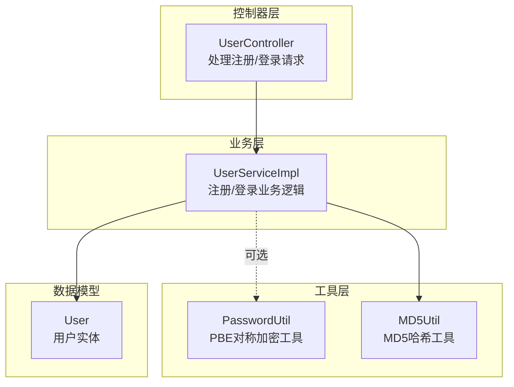
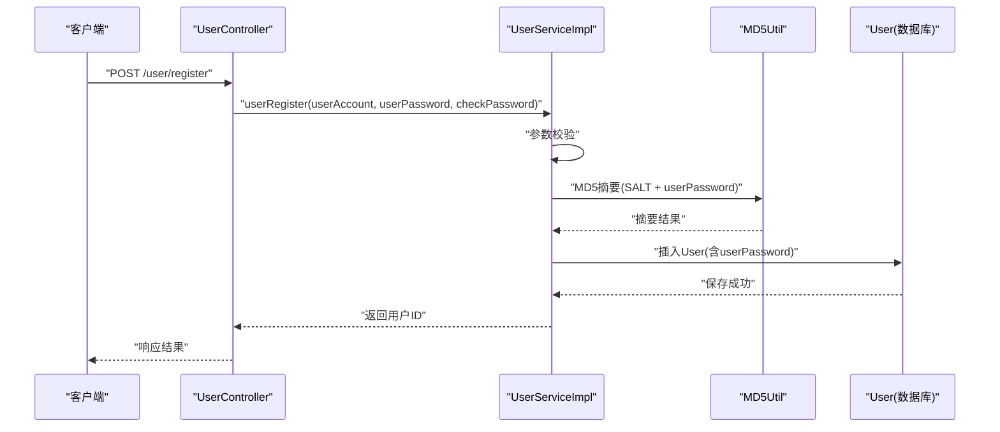
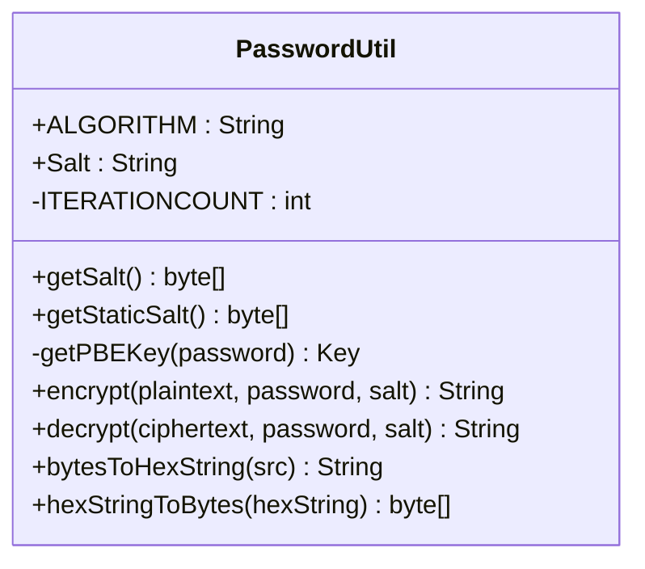
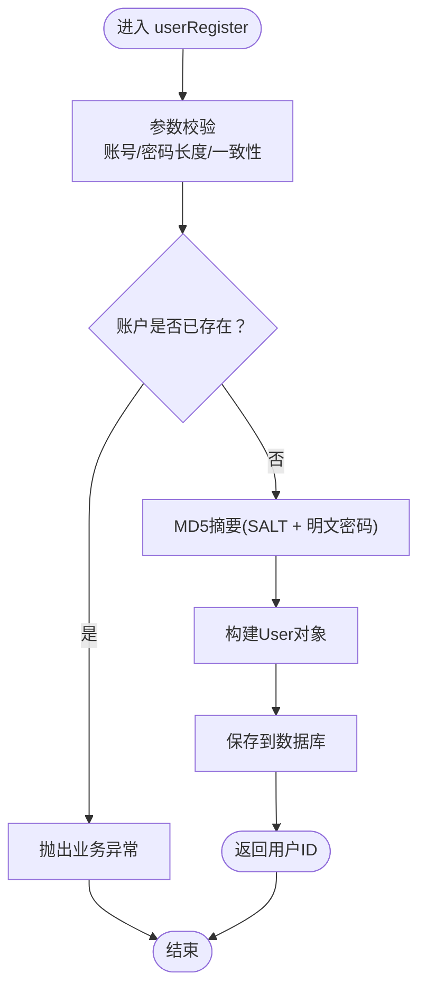
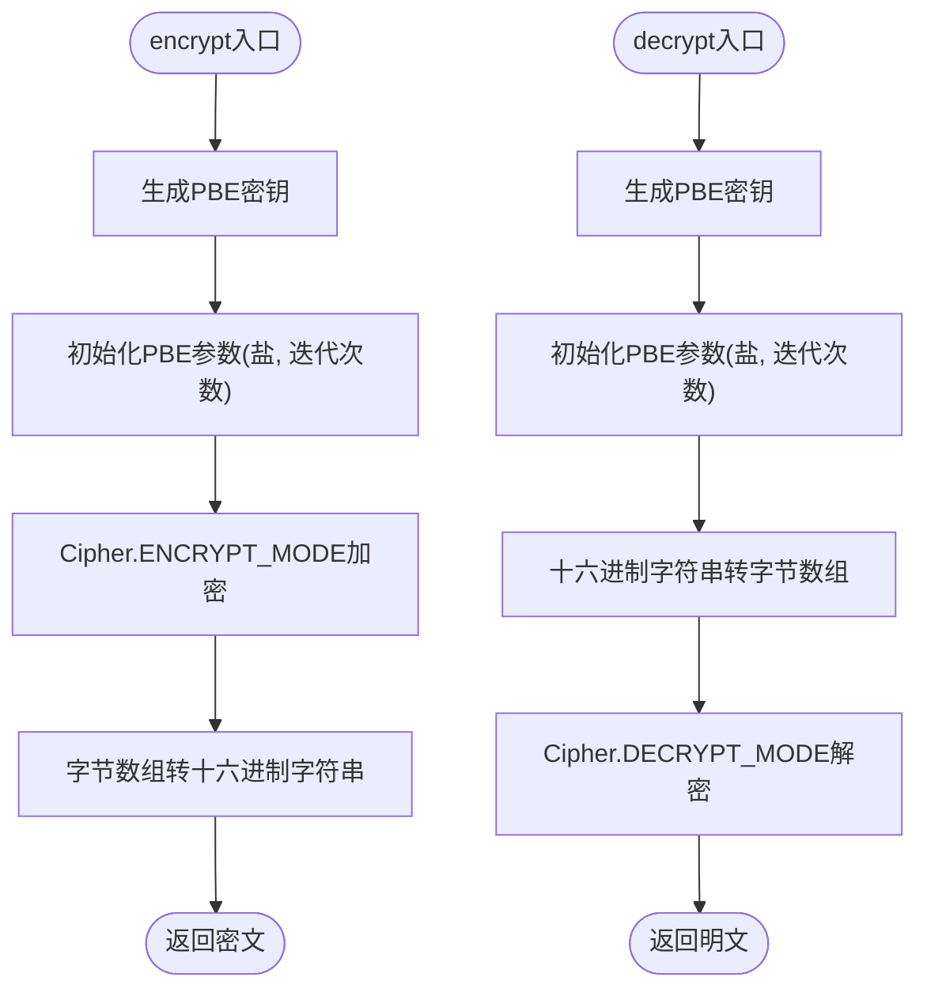
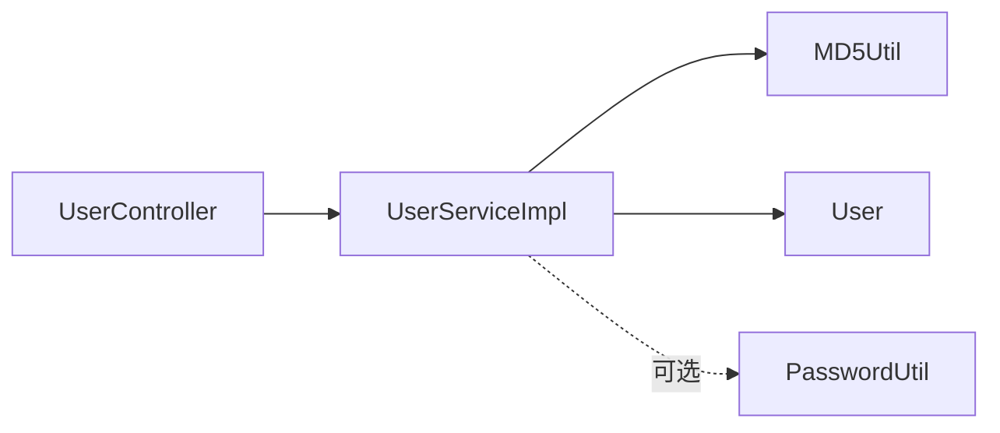

# 密码安全存储

<cite>
**本文引用的文件**
- [PasswordUtil.java](file://yun-docker-common/src/main/java/com/lfc/yundocker/common/util/PasswordUtil.java)
- [UserServiceImpl.java](file://yun-docker-master/src/main/java/com/lfc/yundocker/service/impl/UserServiceImpl.java)
- [UserController.java](file://yun-docker-master/src/main/java/com/lfc/yundocker/controller/UserController.java)
- [User.java](file://yun-docker-master/src/main/java/com/lfc/yundocker/common/model/entity/User.java)
- [UserServiceTest.java](file://yun-docker-master/src/test/java/com/lfc/yundocker/service/UserServiceTest.java)
- [MD5Util.java](file://yun-docker-common/src/main/java/com/lfc/yundocker/common/util/MD5Util.java)
</cite>

## 目录
1. [简介](#简介)
2. [项目结构](#项目结构)
3. [核心组件](#核心组件)
4. [架构总览](#架构总览)
5. [详细组件分析](#详细组件分析)
6. [依赖关系分析](#依赖关系分析)
7. [性能考量](#性能考量)
8. [故障排查指南](#故障排查指南)
9. [结论](#结论)
10. [附录](#附录)

## 简介
本文件围绕用户密码的加密存储方案进行深入解析，重点说明：
- PasswordUtil工具类采用PBEWithMD5AndDES算法进行“加解密”（注意：此处为对称加密，非单向哈希）；
- 使用静态盐值“Salt = 63293188”与1000次迭代增强破解难度；
- encrypt方法如何将明文密码、密钥和盐值作为输入生成十六进制密文，并通过bytesToHexString转换输出；
- decrypt方法如何逆向解析密文；
- 对比BCrypt或PBKDF2等现代单向哈希/密钥派生方案的安全性局限；
- 在UserService.userRegister注册流程中密码加密的具体调用时机；
- 提供密码加解密的单元测试用例建议；
- 讨论未来升级为更安全哈希算法的迁移路径。

## 项目结构
与密码安全相关的关键模块分布如下：
- 工具层：PasswordUtil（对称加密）、MD5Util（MD5哈希）
- 业务层：UserServiceImpl（注册/登录逻辑）
- 控制器层：UserController（对外接口）
- 数据模型：User（用户实体）

图表来源
- [UserController.java](file://yun-docker-master/src/main/java/com/lfc/yundocker/controller/UserController.java#L45-L63)
- [UserServiceImpl.java](file://yun-docker-master/src/main/java/com/lfc/yundocker/service/impl/UserServiceImpl.java#L48-L87)
- [PasswordUtil.java](file://yun-docker-common/src/main/java/com/lfc/yundocker/common/util/PasswordUtil.java#L17-L34)
- [MD5Util.java](file://yun-docker-common/src/main/java/com/lfc/yundocker/common/util/MD5Util.java#L11-L49)
- [User.java](file://yun-docker-master/src/main/java/com/lfc/yundocker/common/model/entity/User.java#L14-L38)

章节来源
- [UserController.java](file://yun-docker-master/src/main/java/com/lfc/yundocker/controller/UserController.java#L45-L63)
- [UserServiceImpl.java](file://yun-docker-master/src/main/java/com/lfc/yundocker/service/impl/UserServiceImpl.java#L48-L87)
- [PasswordUtil.java](file://yun-docker-common/src/main/java/com/lfc/yundocker/common/util/PasswordUtil.java#L17-L34)
- [MD5Util.java](file://yun-docker-common/src/main/java/com/lfc/yundocker/common/util/MD5Util.java#L11-L49)
- [User.java](file://yun-docker-master/src/main/java/com/lfc/yundocker/common/model/entity/User.java#L14-L38)

## 核心组件
- PasswordUtil：提供PBEWithMD5AndDES对称加密/解密能力，包含静态盐值与迭代次数常量，以及字节数组与十六进制字符串互转工具。
- MD5Util：提供MD5哈希工具，用于当前注册/登录流程中的密码摘要。
- UserServiceImpl：在注册时对明文密码进行MD5摘要（含固定盐），在登录时同样对提交密码进行MD5摘要并与数据库存储的摘要比较。
- UserController：对外暴露注册/登录接口，将请求参数传递给UserService。
- User：持久化用户信息，包含userPassword字段。

章节来源
- [PasswordUtil.java](file://yun-docker-common/src/main/java/com/lfc/yundocker/common/util/PasswordUtil.java#L17-L34)
- [MD5Util.java](file://yun-docker-common/src/main/java/com/lfc/yundocker/common/util/MD5Util.java#L11-L49)
- [UserServiceImpl.java](file://yun-docker-master/src/main/java/com/lfc/yundocker/service/impl/UserServiceImpl.java#L48-L87)
- [UserController.java](file://yun-docker-master/src/main/java/com/lfc/yundocker/controller/UserController.java#L45-L63)
- [User.java](file://yun-docker-master/src/main/java/com/lfc/yundocker/common/model/entity/User.java#L14-L38)

## 架构总览
下图展示用户注册时密码处理的端到端流程，包括控制器、业务层、工具层与数据模型之间的交互。

图表来源
- [UserController.java](file://yun-docker-master/src/main/java/com/lfc/yundocker/controller/UserController.java#L45-L63)
- [UserServiceImpl.java](file://yun-docker-master/src/main/java/com/lfc/yundocker/service/impl/UserServiceImpl.java#L48-L87)
- [MD5Util.java](file://yun-docker-common/src/main/java/com/lfc/yundocker/common/util/MD5Util.java#L11-L49)
- [User.java](file://yun-docker-master/src/main/java/com/lfc/yundocker/common/model/entity/User.java#L14-L38)

## 详细组件分析

### PasswordUtil组件分析
- 算法与常量
  - 算法：PBEWithMD5AndDES
  - 盐值：静态字符串“63293188”
  - 迭代次数：1000
- 关键方法
  - encrypt(明文, 密钥, 盐)：生成对称密钥，初始化PBE参数，执行加密，再将密文字节序列转换为十六进制字符串。
  - decrypt(密文, 密钥, 盐)：反向流程，先将十六进制字符串还原为字节数组，再执行解密。
  - bytesToHexString/hexStringToBytes：字节与十六进制字符串互转。
  - getSalt/getStaticSalt：动态盐与静态盐生成。
- 复杂度与性能
  - 对称加密的时间复杂度主要由Cipher.doFinal决定，空间复杂度与明文长度线性相关。
  - 迭代次数提升计算成本，但对称加密仍非密码学意义上的“哈希”。

图表来源
- [PasswordUtil.java](file://yun-docker-common/src/main/java/com/lfc/yundocker/common/util/PasswordUtil.java#L17-L34)
- [PasswordUtil.java](file://yun-docker-common/src/main/java/com/lfc/yundocker/common/util/PasswordUtil.java#L89-L135)
- [PasswordUtil.java](file://yun-docker-common/src/main/java/com/lfc/yundocker/common/util/PasswordUtil.java#L144-L184)

章节来源
- [PasswordUtil.java](file://yun-docker-common/src/main/java/com/lfc/yundocker/common/util/PasswordUtil.java#L17-L34)
- [PasswordUtil.java](file://yun-docker-common/src/main/java/com/lfc/yundocker/common/util/PasswordUtil.java#L89-L135)
- [PasswordUtil.java](file://yun-docker-common/src/main/java/com/lfc/yundocker/common/util/PasswordUtil.java#L144-L184)

### UserService.userRegister注册流程分析
- 注册入口：UserController.userRegister接收请求体并调用UserService.userRegister。
- 参数校验：账号长度、密码长度、两次密码一致性等。
- 密码处理：使用MD5Util对“固定盐 + 明文密码”进行摘要，得到userPassword后写入数据库。
- 数据持久化：构造User对象，设置userAccount、userPassword、userName等字段并保存。

图表来源
- [UserController.java](file://yun-docker-master/src/main/java/com/lfc/yundocker/controller/UserController.java#L45-L63)
- [UserServiceImpl.java](file://yun-docker-master/src/main/java/com/lfc/yundocker/service/impl/UserServiceImpl.java#L48-L87)
- [MD5Util.java](file://yun-docker-common/src/main/java/com/lfc/yundocker/common/util/MD5Util.java#L11-L49)
- [User.java](file://yun-docker-master/src/main/java/com/lfc/yundocker/common/model/entity/User.java#L14-L38)

章节来源
- [UserController.java](file://yun-docker-master/src/main/java/com/lfc/yundocker/controller/UserController.java#L45-L63)
- [UserServiceImpl.java](file://yun-docker-master/src/main/java/com/lfc/yundocker/service/impl/UserServiceImpl.java#L48-L87)
- [MD5Util.java](file://yun-docker-common/src/main/java/com/lfc/yundocker/common/util/MD5Util.java#L11-L49)
- [User.java](file://yun-docker-master/src/main/java/com/lfc/yundocker/common/model/entity/User.java#L14-L38)

### PasswordUtil.encrypt/decrypt算法流程
- encrypt流程要点
  - 生成PBE密钥（基于算法与密钥材料）
  - 初始化PBE参数（盐+迭代次数）
  - 使用Cipher.ENCRYPT_MODE执行加密
  - 将密文字节序列转换为十六进制字符串
- decrypt流程要点
  - 生成PBE密钥
  - 初始化PBE参数
  - 将十六进制字符串还原为字节数组
  - 使用Cipher.DECRYPT_MODE执行解密

图表来源
- [PasswordUtil.java](file://yun-docker-common/src/main/java/com/lfc/yundocker/common/util/PasswordUtil.java#L89-L135)
- [PasswordUtil.java](file://yun-docker-common/src/main/java/com/lfc/yundocker/common/util/PasswordUtil.java#L144-L184)

章节来源
- [PasswordUtil.java](file://yun-docker-common/src/main/java/com/lfc/yundocker/common/util/PasswordUtil.java#L89-L135)
- [PasswordUtil.java](file://yun-docker-common/src/main/java/com/lfc/yundocker/common/util/PasswordUtil.java#L144-L184)

### 安全性对比与局限性
- 当前实现（MD5摘要 + 固定盐）
  - 使用MD5作为摘要算法，抗彩虹表能力弱，易被暴力破解；
  - 固定盐值降低随机性，不利于对抗批量破解；
  - 未使用自适应参数（如迭代次数可配置），难以抵御算力增长。
- PasswordUtil（PBEWithMD5AndDES）
  - 采用对称加密，具备可逆性，适合需要“解密”的场景；
  - 但对密码存储而言，通常应使用不可逆的单向哈希（如BCrypt、PBKDF2）；
  - 若用于密码存储，应改为单向派生函数而非对称加密。
- 建议
  - 注册/登录流程应采用BCrypt或PBKDF2等现代算法；
  - 为每个用户生成唯一盐值（随机盐）；
  - 自适应成本因子（如迭代次数）随硬件性能调整。

章节来源
- [UserServiceImpl.java](file://yun-docker-master/src/main/java/com/lfc/yundocker/service/impl/UserServiceImpl.java#L48-L87)
- [PasswordUtil.java](file://yun-docker-common/src/main/java/com/lfc/yundocker/common/util/PasswordUtil.java#L17-L34)

## 依赖关系分析
- 控制器依赖业务层，业务层依赖工具层与数据模型。
- 注册流程依赖MD5Util；PasswordUtil当前未在注册/登录流程中直接使用。
- User实体承载userPassword字段，用于持久化。

图表来源
- [UserController.java](file://yun-docker-master/src/main/java/com/lfc/yundocker/controller/UserController.java#L45-L63)
- [UserServiceImpl.java](file://yun-docker-master/src/main/java/com/lfc/yundocker/service/impl/UserServiceImpl.java#L48-L87)
- [MD5Util.java](file://yun-docker-common/src/main/java/com/lfc/yundocker/common/util/MD5Util.java#L11-L49)
- [User.java](file://yun-docker-master/src/main/java/com/lfc/yundocker/common/model/entity/User.java#L14-L38)
- [PasswordUtil.java](file://yun-docker-common/src/main/java/com/lfc/yundocker/common/util/PasswordUtil.java#L17-L34)

章节来源
- [UserController.java](file://yun-docker-master/src/main/java/com/lfc/yundocker/controller/UserController.java#L45-L63)
- [UserServiceImpl.java](file://yun-docker-master/src/main/java/com/lfc/yundocker/service/impl/UserServiceImpl.java#L48-L87)
- [MD5Util.java](file://yun-docker-common/src/main/java/com/lfc/yundocker/common/util/MD5Util.java#L11-L49)
- [User.java](file://yun-docker-master/src/main/java/com/lfc/yundocker/common/model/entity/User.java#L14-L38)
- [PasswordUtil.java](file://yun-docker-common/src/main/java/com/lfc/yundocker/common/util/PasswordUtil.java#L17-L34)

## 性能考量
- MD5摘要开销极低，适合高并发场景；但安全性不足。
- PasswordUtil的PBEWithMD5AndDES在1000次迭代下会增加CPU成本，但仍属于对称加密范畴，不适合作为密码存储方案。
- 建议采用BCrypt/PBKDF2时，将成本因子（如轮数/迭代次数）作为可配置参数，以平衡安全与性能。

[本节为通用指导，无需列出具体文件来源]

## 故障排查指南
- 注册失败
  - 检查参数校验逻辑（账号/密码长度、一致性）。
  - 确认MD5摘要生成是否正确（固定盐+SALT）。
  - 核对数据库字段类型与长度，确保userPassword可容纳摘要结果。
- 登录失败
  - 确保登录时对提交密码执行相同的MD5摘要（固定盐）。
  - 检查数据库中存储的userPassword是否与摘要一致。
- PasswordUtil使用问题
  - 盐值长度与算法要求一致（静态盐为8字节）。
  - 加密/解密时使用的盐与密钥需与生成时一致。
  - 异常处理：当前实现对异常有吞吐倾向，建议在生产环境完善日志与异常传播。

章节来源
- [UserServiceImpl.java](file://yun-docker-master/src/main/java/com/lfc/yundocker/service/impl/UserServiceImpl.java#L48-L87)
- [UserController.java](file://yun-docker-master/src/main/java/com/lfc/yundocker/controller/UserController.java#L72-L83)
- [PasswordUtil.java](file://yun-docker-common/src/main/java/com/lfc/yundocker/common/util/PasswordUtil.java#L89-L135)

## 结论
- 当前注册/登录流程采用MD5摘要（固定盐），实现简单但安全性较低，不适合长期使用。
- PasswordUtil提供PBEWithMD5AndDES对称加密能力，适合需要可逆场景，但不适用于密码存储。
- 建议尽快迁移至BCrypt或PBKDF2等现代单向哈希/密钥派生算法，采用随机盐与自适应成本因子，提升抗攻击能力。

[本节为总结性内容，无需列出具体文件来源]

## 附录

### 单元测试用例建议
- 测试目标
  - 验证注册流程中MD5摘要生成正确性（固定盐+SALT）。
  - 验证登录流程中摘要匹配逻辑。
  - 验证异常分支（空参数、账号重复、密码不一致、账号不存在等）。
  - 可选：验证PasswordUtil.encrypt/decrypt在对称场景下的正确性（若后续启用）。
- 建议用例清单
  - userRegister：正常注册、参数为空、账号过短、密码过短、两次密码不一致、账号重复。
  - userLogin：正常登录、账号不存在、密码错误。
  - PasswordUtil：encrypt/decrypt正向与边界条件（空输入、非法十六进制等）。

章节来源
- [UserServiceTest.java](file://yun-docker-master/src/test/java/com/lfc/yundocker/service/UserServiceTest.java#L1-L34)
- [UserServiceImpl.java](file://yun-docker-master/src/main/java/com/lfc/yundocker/service/impl/UserServiceImpl.java#L48-L87)
- [UserController.java](file://yun-docker-master/src/main/java/com/lfc/yundocker/controller/UserController.java#L45-L63)
- [PasswordUtil.java](file://yun-docker-common/src/main/java/com/lfc/yundocker/common/util/PasswordUtil.java#L89-L135)

### 迁移路径建议（从MD5到BCrypt/PBKDF2）
- 短期（兼容期）
  - 保持现有注册/登录逻辑不变，同时在新用户注册时采用BCrypt/PBKDF2。
  - 对老用户登录时，若发现MD5摘要，触发一次性重算并更新为BCrypt/PBKDF2摘要。
- 中期
  - 渐进替换：新增字段存储新摘要，逐步迁移旧数据。
  - 引入随机盐与自适应成本因子，统一管理。
- 长期
  - 全面采用BCrypt/PBKDF2，移除MD5相关逻辑与遗留代码。

[本节为迁移策略建议，无需列出具体文件来源]