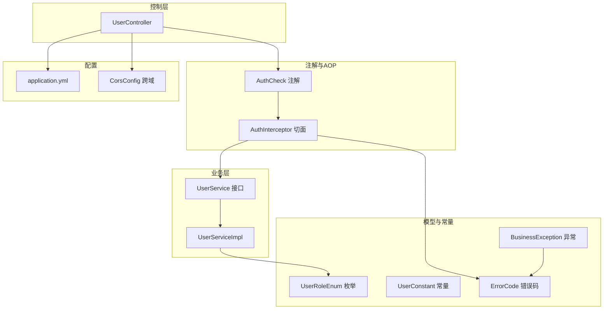
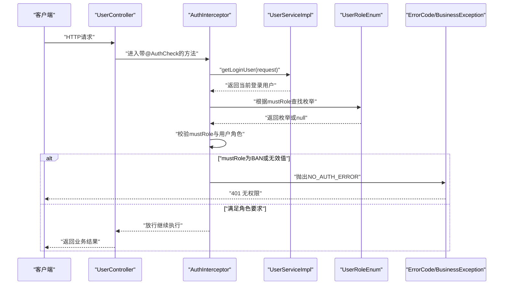
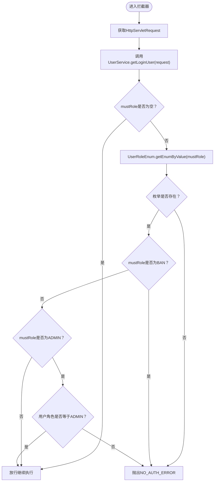
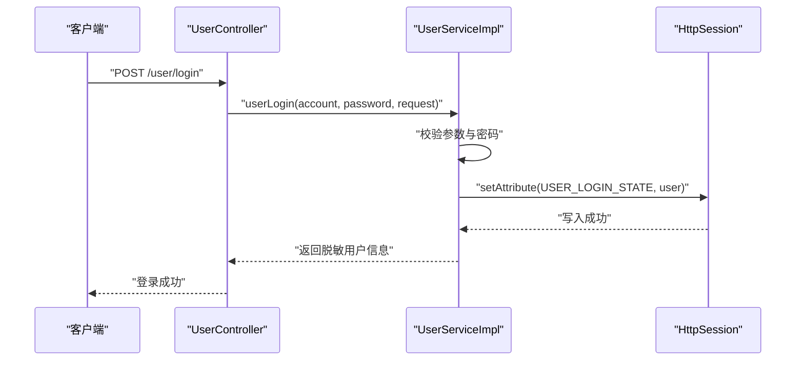
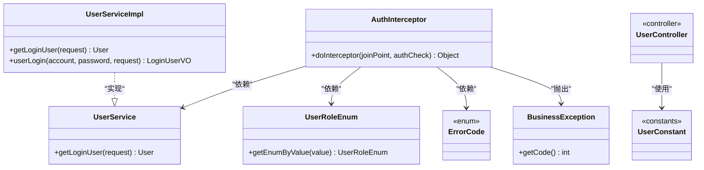

# 认证与授权机制

<cite>
**本文引用的文件**
- [AuthCheck.java](file://yun-docker-master/src/main/java/com/lfc/yundocker/annotation/AuthCheck.java)
- [AuthInterceptor.java](file://yun-docker-master/src/main/java/com/lfc/yundocker/aop/AuthInterceptor.java)
- [UserRoleEnum.java](file://yun-docker-common/src/main/java/com/lfc/yundocker/common/model/enums/UserRoleEnum.java)
- [UserConstant.java](file://yun-docker-common/src/main/java/com/lfc/yundocker/common/constant/UserConstant.java)
- [ErrorCode.java](file://yun-docker-common/src/main/java/com/lfc/yundocker/common/model/enums/ErrorCode.java)
- [BusinessException.java](file://yun-docker-common/src/main/java/com/lfc/yundocker/common/exception/BusinessException.java)
- [UserService.java](file://yun-docker-master/src/main/java/com/lfc/yundocker/service/UserService.java)
- [UserServiceImpl.java](file://yun-docker-master/src/main/java/com/lfc/yundocker/service/impl/UserServiceImpl.java)
- [UserController.java](file://yun-docker-master/src/main/java/com/lfc/yundocker/controller/UserController.java)
- [application.yml](file://yun-docker-master/src/main/resources/application.yml)
- [CorsConfig.java](file://yun-docker-master/src/main/java/com/lfc/yundocker/config/CorsConfig.java)
- [LogInterceptor.java](file://yun-docker-master/src/main/java/com/lfc/yundocker/aop/LodInterceptor.java)
</cite>

## 目录
1. [简介](#简介)
2. [项目结构](#项目结构)
3. [核心组件](#核心组件)
4. [架构总览](#架构总览)
5. [详细组件分析](#详细组件分析)
6. [依赖关系分析](#依赖关系分析)
7. [性能考量](#性能考量)
8. [故障排查指南](#故障排查指南)
9. [结论](#结论)
10. [附录](#附录)

## 简介
本文件系统化阐述基于Spring AOP的认证与授权体系，重点说明AuthCheck注解如何通过mustRole属性定义接口访问角色（如ADMIN、USER、BAN），并结合AuthInterceptor切面在运行时进行拦截校验。拦截器通过UserService.getLoginUser(request)获取当前登录用户，并校验其userRole是否满足mustRole要求；当不满足时抛出NO_AUTH_ERROR异常。文档还解析角色枚举UserRoleEnum的值映射机制以及封禁用户（BAN）的特殊处理逻辑，给出在Controller方法上使用@AuthCheck的示例，并对比与Spring Security的差异，最后讨论Token传递机制、会话管理策略及潜在越权风险点。

## 项目结构
该认证与授权体系主要分布在以下模块：
- 注解层：AuthCheck用于声明式标注接口访问角色
- AOP层：AuthInterceptor围绕带注解的方法执行前置校验
- 业务层：UserService与UserServiceImpl负责登录态与角色判定
- 控制层：UserController在具体接口上使用@AuthCheck
- 常量与枚举：UserConstant与UserRoleEnum提供角色值映射
- 异常与错误码：ErrorCode与BusinessException统一异常语义
- 配置：application.yml与CorsConfig支撑会话与跨域

图表来源
- [AuthCheck.java](file://yun-docker-master/src/main/java/com/lfc/yundocker/annotation/AuthCheck.java#L1-L29)
- [AuthInterceptor.java](file://yun-docker-master/src/main/java/com/lfc/yundocker/aop/AuthInterceptor.java#L1-L70)
- [UserService.java](file://yun-docker-master/src/main/java/com/lfc/yundocker/service/UserService.java#L1-L124)
- [UserServiceImpl.java](file://yun-docker-master/src/main/java/com/lfc/yundocker/service/impl/UserServiceImpl.java#L1-L200)
- [UserRoleEnum.java](file://yun-docker-common/src/main/java/com/lfc/yundocker/common/model/enums/UserRoleEnum.java#L1-L64)
- [UserConstant.java](file://yun-docker-common/src/main/java/com/lfc/yundocker/common/constant/UserConstant.java#L1-L34)
- [ErrorCode.java](file://yun-docker-common/src/main/java/com/lfc/yundocker/common/model/enums/ErrorCode.java#L1-L49)
- [BusinessException.java](file://yun-docker-common/src/main/java/com/lfc/yundocker/common/exception/BusinessException.java#L1-L37)
- [application.yml](file://yun-docker-master/src/main/resources/application.yml#L1-L60)
- [CorsConfig.java](file://yun-docker-master/src/main/java/com/lfc/yundocker/config/CorsConfig.java#L1-L28)

章节来源
- [application.yml](file://yun-docker-master/src/main/resources/application.yml#L1-L60)
- [CorsConfig.java](file://yun-docker-master/src/main/java/com/lfc/yundocker/config/CorsConfig.java#L1-L28)

## 核心组件
- AuthCheck注解：通过mustRole属性声明接口所需角色，默认空字符串表示无需特定角色
- AuthInterceptor切面：环绕带@AuthCheck的方法，读取mustRole并执行校验
- UserService/UserServiceImpl：提供getLoginUser(request)获取当前登录用户，并在登录时写入会话
- UserRoleEnum：定义角色值映射（user/admin/ban），并提供按值查找
- UserConstant：提供角色常量值（user/admin/ban）
- ErrorCode/BusinessException：统一异常语义，NO_AUTH_ERROR用于无权限场景

章节来源
- [AuthCheck.java](file://yun-docker-master/src/main/java/com/lfc/yundocker/annotation/AuthCheck.java#L1-L29)
- [AuthInterceptor.java](file://yun-docker-master/src/main/java/com/lfc/yundocker/aop/AuthInterceptor.java#L1-L70)
- [UserService.java](file://yun-docker-master/src/main/java/com/lfc/yundocker/service/UserService.java#L1-L124)
- [UserServiceImpl.java](file://yun-docker-master/src/main/java/com/lfc/yundocker/service/impl/UserServiceImpl.java#L1-L200)
- [UserRoleEnum.java](file://yun-docker-common/src/main/java/com/lfc/yundocker/common/model/enums/UserRoleEnum.java#L1-L64)
- [UserConstant.java](file://yun-docker-common/src/main/java/com/lfc/yundocker/common/constant/UserConstant.java#L1-L34)
- [ErrorCode.java](file://yun-docker-common/src/main/java/com/lfc/yundocker/common/model/enums/ErrorCode.java#L1-L49)
- [BusinessException.java](file://yun-docker-common/src/main/java/com/lfc/yundocker/common/exception/BusinessException.java#L1-L37)

## 架构总览
下图展示从Controller方法到AOP拦截再到业务层校验的整体流程。

图表来源
- [AuthInterceptor.java](file://yun-docker-master/src/main/java/com/lfc/yundocker/aop/AuthInterceptor.java#L1-L70)
- [UserServiceImpl.java](file://yun-docker-master/src/main/java/com/lfc/yundocker/service/impl/UserServiceImpl.java#L1-L200)
- [UserRoleEnum.java](file://yun-docker-common/src/main/java/com/lfc/yundocker/common/model/enums/UserRoleEnum.java#L1-L64)
- [ErrorCode.java](file://yun-docker-common/src/main/java/com/lfc/yundocker/common/model/enums/ErrorCode.java#L1-L49)
- [BusinessException.java](file://yun-docker-common/src/main/java/com/lfc/yundocker/common/exception/BusinessException.java#L1-L37)

## 详细组件分析

### AuthCheck注解与mustRole语义
- 作用域：方法级注解
- mustRole默认值：空字符串，表示无需特定角色
- 使用方式：在Controller方法上标注@AuthCheck(mustRole = UserConstant.ADMIN_ROLE)，即可限定仅管理员可访问

章节来源
- [AuthCheck.java](file://yun-docker-master/src/main/java/com/lfc/yundocker/annotation/AuthCheck.java#L1-L29)
- [UserConstant.java](file://yun-docker-common/src/main/java/com/lfc/yundocker/common/constant/UserConstant.java#L1-L34)

### AuthInterceptor拦截逻辑
- 切点表达式：@annotation(authCheck)，匹配带@AuthCheck的方法
- 关键步骤：
  - 从RequestContextHolder获取当前请求
  - 调用UserService.getLoginUser(request)获取当前登录用户
  - 若mustRole非空，将其转换为UserRoleEnum
  - 若枚举不存在或mustRole为BAN，则抛出NO_AUTH_ERROR
  - 若mustRole为ADMIN，要求用户角色与之完全相等
  - 放行继续执行

图表来源
- [AuthInterceptor.java](file://yun-docker-master/src/main/java/com/lfc/yundocker/aop/AuthInterceptor.java#L1-L70)
- [UserRoleEnum.java](file://yun-docker-common/src/main/java/com/lfc/yundocker/common/model/enums/UserRoleEnum.java#L1-L64)
- [ErrorCode.java](file://yun-docker-common/src/main/java/com/lfc/yundocker/common/model/enums/ErrorCode.java#L1-L49)
- [BusinessException.java](file://yun-docker-common/src/main/java/com/lfc/yundocker/common/exception/BusinessException.java#L1-L37)

章节来源
- [AuthInterceptor.java](file://yun-docker-master/src/main/java/com/lfc/yundocker/aop/AuthInterceptor.java#L1-L70)

### UserService与会话管理
- getLoginUser(request)：从HttpSession中读取登录态键，校验用户是否存在并重新从数据库加载最新信息
- userLogin(...)：登录成功后将用户对象写入Session，作为后续鉴权依据
- 会话配置：application.yml中配置了Session超时与Cookie过期时间，支持分布式会话（需启用Redis）

图表来源
- [UserServiceImpl.java](file://yun-docker-master/src/main/java/com/lfc/yundocker/service/impl/UserServiceImpl.java#L1-L200)
- [application.yml](file://yun-docker-master/src/main/resources/application.yml#L1-L60)

章节来源
- [UserService.java](file://yun-docker-master/src/main/java/com/lfc/yundocker/service/UserService.java#L1-L124)
- [UserServiceImpl.java](file://yun-docker-master/src/main/java/com/lfc/yundocker/service/impl/UserServiceImpl.java#L1-L200)
- [application.yml](file://yun-docker-master/src/main/resources/application.yml#L1-L60)

### 角色枚举与值映射
- UserRoleEnum包含USER("用户","user")、ADMIN("管理员","admin")、BAN("被封号","ban")
- 提供getEnumByValue(value)按值查找枚举，用于mustRole字符串到枚举的映射
- BAN作为mustRole时，拦截器直接拒绝，体现“封禁用户不可访问”的特殊处理

章节来源
- [UserRoleEnum.java](file://yun-docker-common/src/main/java/com/lfc/yundocker/common/model/enums/UserRoleEnum.java#L1-L64)
- [AuthInterceptor.java](file://yun-docker-master/src/main/java/com/lfc/yundocker/aop/AuthInterceptor.java#L1-L70)

### 在Controller上使用@AuthCheck的示例
- 示例一：仅管理员可创建用户
  - 在UserController.addUser方法上标注@AuthCheck(mustRole = UserConstant.ADMIN_ROLE)
- 示例二：仅管理员可删除用户
  - 在UserController.deleteUser方法上标注@AuthCheck(mustRole = UserConstant.ADMIN_ROLE)
- 示例三：仅管理员可分页查询用户列表
  - 在UserController.listUserByPage方法上标注@AuthCheck(mustRole = UserConstant.ADMIN_ROLE)

章节来源
- [UserController.java](file://yun-docker-master/src/main/java/com/lfc/yundocker/controller/UserController.java#L1-L309)
- [UserConstant.java](file://yun-docker-common/src/main/java/com/lfc/yundocker/common/constant/UserConstant.java#L1-L34)

### 与Spring Security的对比优势
- 声明式简单：通过@AuthCheck即可在方法级快速声明角色要求，无需复杂的WebSecurity配置
- 低侵入：仅在需要的地方添加注解，不影响其他接口
- 与现有会话体系兼容：基于HttpSession，无需引入额外的Token机制
- 便于扩展：可在拦截器中灵活扩展更多校验规则（如白名单、IP限制等）

[本节为概念性对比，不直接分析具体文件，故不附“章节来源”]

## 依赖关系分析
- AuthInterceptor依赖UserService获取当前登录用户
- AuthInterceptor依赖UserRoleEnum进行角色值映射
- AuthInterceptor依赖ErrorCode/BusinessException抛出统一异常
- UserController依赖UserConstant常量值
- application.yml与CorsConfig影响跨域与会话行为

图表来源
- [AuthInterceptor.java](file://yun-docker-master/src/main/java/com/lfc/yundocker/aop/AuthInterceptor.java#L1-L70)
- [UserService.java](file://yun-docker-master/src/main/java/com/lfc/yundocker/service/UserService.java#L1-L124)
- [UserServiceImpl.java](file://yun-docker-master/src/main/java/com/lfc/yundocker/service/impl/UserServiceImpl.java#L1-L200)
- [UserRoleEnum.java](file://yun-docker-common/src/main/java/com/lfc/yundocker/common/model/enums/UserRoleEnum.java#L1-L64)
- [UserConstant.java](file://yun-docker-common/src/main/java/com/lfc/yundocker/common/constant/UserConstant.java#L1-L34)
- [ErrorCode.java](file://yun-docker-common/src/main/java/com/lfc/yundocker/common/model/enums/ErrorCode.java#L1-L49)
- [BusinessException.java](file://yun-docker-common/src/main/java/com/lfc/yundocker/common/exception/BusinessException.java#L1-L37)
- [UserController.java](file://yun-docker-master/src/main/java/com/lfc/yundocker/controller/UserController.java#L1-L309)

章节来源
- [AuthInterceptor.java](file://yun-docker-master/src/main/java/com/lfc/yundocker/aop/AuthInterceptor.java#L1-L70)
- [UserService.java](file://yun-docker-master/src/main/java/com/lfc/yundocker/service/UserService.java#L1-L124)
- [UserServiceImpl.java](file://yun-docker-master/src/main/java/com/lfc/yundocker/service/impl/UserServiceImpl.java#L1-L200)
- [UserRoleEnum.java](file://yun-docker-common/src/main/java/com/lfc/yundocker/common/model/enums/UserRoleEnum.java#L1-L64)
- [UserConstant.java](file://yun-docker-common/src/main/java/com/lfc/yundocker/common/constant/UserConstant.java#L1-L34)
- [ErrorCode.java](file://yun-docker-common/src/main/java/com/lfc/yundocker/common/model/enums/ErrorCode.java#L1-L49)
- [BusinessException.java](file://yun-docker-common/src/main/java/com/lfc/yundocker/common/exception/BusinessException.java#L1-L37)
- [UserController.java](file://yun-docker-master/src/main/java/com/lfc/yundocker/controller/UserController.java#L1-L309)

## 性能考量
- 拦截器开销：每次带@AuthCheck的方法都会执行一次会话读取与角色枚举解析，建议在高频接口上谨慎使用
- 数据库刷新：UserServiceImpl.getLoginUser会重新从数据库加载用户，确保角色一致性但带来一定延迟
- 缓存优化：可考虑在拦截器或Service层引入缓存（如Redis）存储用户角色，降低数据库压力
- 日志AOP：LogInterceptor会对所有控制器方法进行日志记录，注意在高并发场景下的日志输出成本

[本节提供一般性指导，不直接分析具体文件，故不附“章节来源”]

## 故障排查指南
- 401 无权限（NO_AUTH_ERROR）
  - 可能原因：mustRole为BAN或无效值；用户角色不满足ADMIN要求；用户未登录
  - 排查要点：确认mustRole值与UserConstant一致；检查Session中是否已写入登录态
- 未登录（NOT_LOGIN_ERROR）
  - 可能原因：Session中缺少登录态键
  - 排查要点：确认登录接口已正确写入Session；检查application.yml中的Session配置
- 跨域问题
  - 可能原因：浏览器CORS限制导致预检失败
  - 排查要点：确认CorsConfig已生效；allowCredentials与allowedOriginPatterns配置正确

章节来源
- [AuthInterceptor.java](file://yun-docker-master/src/main/java/com/lfc/yundocker/aop/AuthInterceptor.java#L1-L70)
- [UserServiceImpl.java](file://yun-docker-master/src/main/java/com/lfc/yundocker/service/impl/UserServiceImpl.java#L1-L200)
- [ErrorCode.java](file://yun-docker-common/src/main/java/com/lfc/yundocker/common/model/enums/ErrorCode.java#L1-L49)
- [application.yml](file://yun-docker-master/src/main/resources/application.yml#L1-L60)
- [CorsConfig.java](file://yun-docker-master/src/main/java/com/lfc/yundocker/config/CorsConfig.java#L1-L28)

## 结论
该认证与授权体系以最小侵入的方式实现了基于角色的访问控制：通过@AuthCheck声明角色需求，借助AuthInterceptor在运行时完成校验，结合UserService的会话管理与UserRoleEnum的值映射，形成清晰、可维护的权限边界。BAN角色的特殊处理体现了对封禁用户的严格限制。整体方案与Spring Security相比更轻量、易集成，适合中小型项目或已有会话体系的场景；若需更细粒度的安全控制与Token机制，可考虑逐步引入Spring Security或JWT。

[本节为总结性内容，不直接分析具体文件，故不附“章节来源”]

## 附录

### Token传递机制与会话管理策略
- 当前实现采用HttpSession进行会话管理，登录成功后将用户对象写入Session，后续通过Session键读取登录态
- application.yml中配置了Session超时与Cookie过期时间，支持分布式会话（需启用Redis）
- 跨域场景通过CorsConfig允许携带Cookie，确保前后端交互顺畅

章节来源
- [UserServiceImpl.java](file://yun-docker-master/src/main/java/com/lfc/yundocker/service/impl/UserServiceImpl.java#L1-L200)
- [application.yml](file://yun-docker-master/src/main/resources/application.yml#L1-L60)
- [CorsConfig.java](file://yun-docker-master/src/main/java/com/lfc/yundocker/config/CorsConfig.java#L1-L28)

### 潜在越权访问风险点
- Session劫持：若Session未妥善保护，可能被窃取导致越权
- 角色枚举不一致：mustRole值与UserRoleEnum映射不一致会导致误判
- 未登录绕过：若前端未携带Cookie或跨域配置不当，可能导致未登录访问
- BAN用户绕过：mustRole为BAN时直接拒绝，但需确保BAN状态在登录时也得到校验

章节来源
- [AuthInterceptor.java](file://yun-docker-master/src/main/java/com/lfc/yundocker/aop/AuthInterceptor.java#L1-L70)
- [UserServiceImpl.java](file://yun-docker-master/src/main/java/com/lfc/yundocker/service/impl/UserServiceImpl.java#L1-L200)
- [UserRoleEnum.java](file://yun-docker-common/src/main/java/com/lfc/yundocker/common/model/enums/UserRoleEnum.java#L1-L64)