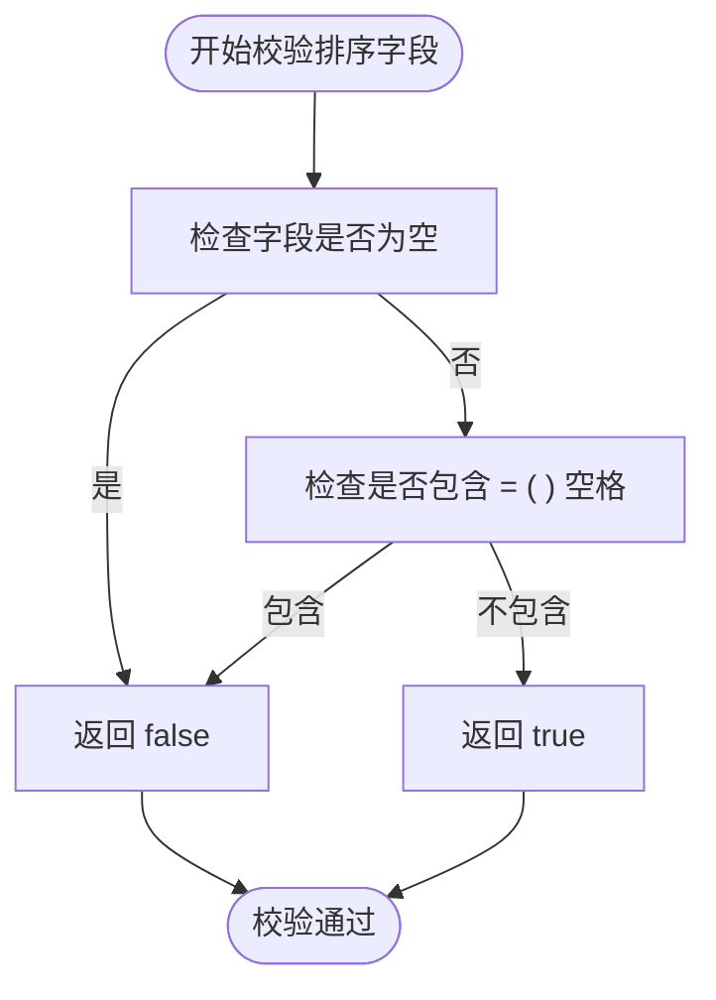
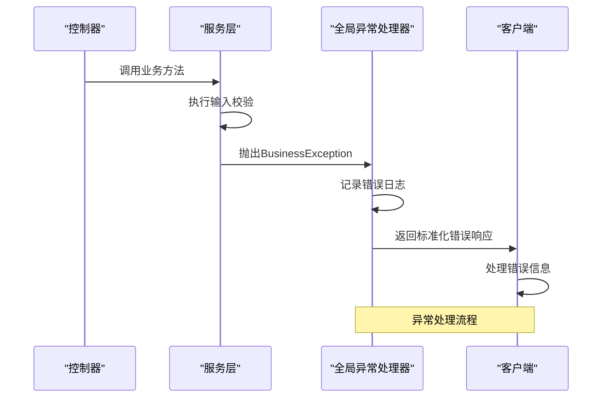
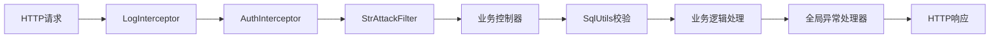
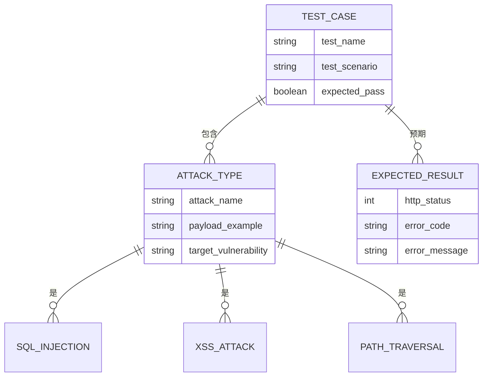
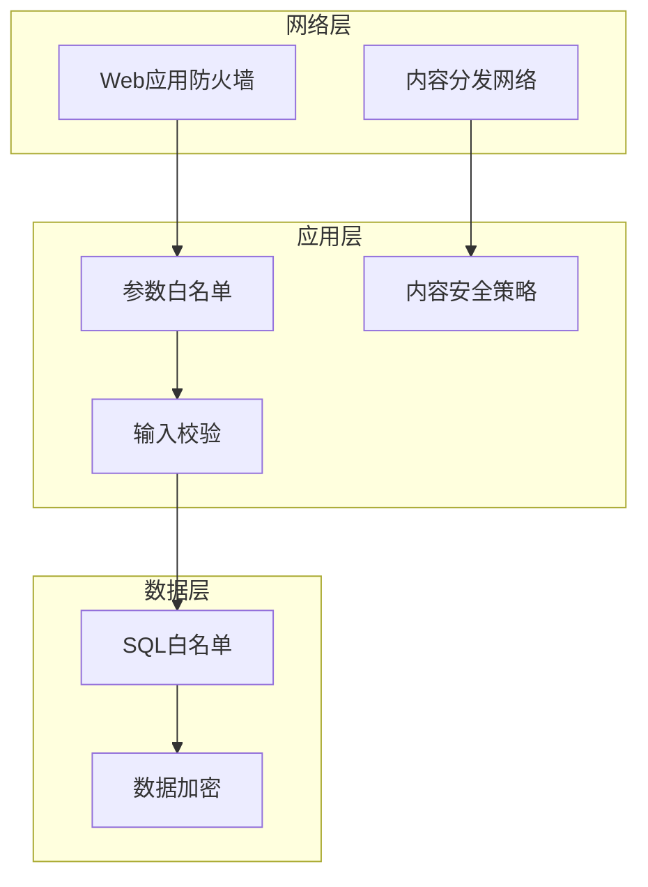

# 输入校验与防护

<cite>
**本文档引用的文件**   
- [StrAttackFilter.java](file://yun-docker-common/src/main/java/com/lfc/yundocker/common/util/filter/StrAttackFilter.java)
- [SqlUtils.java](file://yun-docker-common/src/main/java/com/lfc/yundocker/common/util/SqlUtils.java)
- [GlobalExceptionHandler.java](file://yun-docker-common/src/main/java/com/lfc/yundocker/common/exception/GlobalExceptionHandler.java)
- [UserController.java](file://yun-docker-master/src/main/java/com/lfc/yundocker/controller/UserController.java)
- [UserServiceImpl.java](file://yun-docker-master/src/main/java/com/lfc/yundocker/service/impl/UserServiceImpl.java)
- [UserQueryRequest.java](file://yun-docker-common/src/main/java/com/lfc/yundocker/common/model/dto/user/UserQueryRequest.java)
- [PageRequest.java](file://yun-docker-common/src/main/java/com/lfc/yundocker/common/model/dto/PageRequest.java)
- [AuthInterceptor.java](file://yun-docker-master/src/main/java/com/lfc/yundocker/aop/AuthInterceptor.java)
- [LogInterceptor.java](file://yun-docker-master/src/main/java/com/lfc/yundocker/aop/LogInterceptor.java)
- [BusinessException.java](file://yun-docker-common/src/main/java/com/lfc/yundocker/common/exception/BusinessException.java)
- [ThrowUtils.java](file://yun-docker-common/src/main/java/com/lfc/yundocker/common/exception/ThrowUtils.java)
</cite>

## 目录
1. [系统安全防护概述](#系统安全防护概述)
2. [StrAttackFilter请求参数过滤机制](#strattackfilter请求参数过滤机制)
3. [SqlUtils排序字段白名单校验](#sqlutils排序字段白名单校验)
4. [全局异常处理协同机制](#全局异常处理协同机制)
5. [请求处理链执行顺序分析](#请求处理链执行顺序分析)
6. [安全防护测试案例](#安全防护测试案例)
7. [纵深防御建议](#纵深防御建议)
8. [总结](#总结)

## 系统安全防护概述

本系统构建了多层次的安全防护体系，通过输入校验、参数过滤、权限控制和异常处理等机制保障Web层安全。系统采用StrAttackFilter过滤器拦截恶意字符串，SqlUtils工具类防止SQL注入，结合全局异常处理器实现统一的错误响应。这些安全组件在请求处理链中按特定顺序执行，形成完整的防护闭环。

**本节来源**
- [StrAttackFilter.java](file://yun-docker-common/src/main/java/com/lfc/yundocker/common/util/filter/StrAttackFilter.java)
- [SqlUtils.java](file://yun-docker-common/src/main/java/com/lfc/yundocker/common/util/SqlUtils.java)
- [GlobalExceptionHandler.java](file://yun-docker-common/src/main/java/com/lfc/yundocker/common/exception/GlobalExceptionHandler.java)

## StrAttackFilter请求参数过滤机制

StrAttackFilter过滤器专门用于文件上传场景中的字符串特殊字符过滤。该过滤器通过正则表达式匹配并清除请求参数中的各种特殊字符，有效防御SQL注入和XSS攻击。

```mermaid
classDiagram
class StrAttackFilter {
+static String filter(String str)
}
StrAttackFilter : String regEx = "[`_《》~!@#$%^&*()+=|{}' : ;',\\[\\].<>?~！@#￥%……&*——+|{}【】‘；：”“’。，、？]"
StrAttackFilter : Pattern p
StrAttackFilter : Matcher m
```

**图示来源**
- [StrAttackFilter.java](file://yun-docker-common/src/main/java/com/lfc/yundocker/common/util/filter/StrAttackFilter.java#L14-L20)

**本节来源**
- [StrAttackFilter.java](file://yun-docker-common/src/main/java/com/lfc/yundocker/common/util/filter/StrAttackFilter.java)

## SqlUtils排序字段白名单校验

SqlUtils工具类提供了针对动态查询中排序字段的白名单校验机制，防止order by注入攻击。该机制通过检查排序字段是否包含危险字符来确保SQL安全。



**图示来源**
- [SqlUtils.java](file://yun-docker-common/src/main/java/com/lfc/yundocker/common/util/SqlUtils.java#L18-L23)

**本节来源**
- [SqlUtils.java](file://yun-docker-common/src/main/java/com/lfc/yundocker/common/util/SqlUtils.java)
- [UserServiceImpl.java](file://yun-docker-master/src/main/java/com/lfc/yundocker/service/impl/UserServiceImpl.java#L276-L291)

## 全局异常处理协同机制

系统通过GlobalExceptionHandler实现全局异常处理，与输入校验机制协同工作。当安全校验失败时，抛出的异常会被全局处理器捕获并转换为标准化的错误响应。



**图示来源**
- [GlobalExceptionHandler.java](file://yun-docker-common/src/main/java/com/lfc/yundocker/common/exception/GlobalExceptionHandler.java#L20-L30)
- [BusinessException.java](file://yun-docker-common/src/main/java/com/lfc/yundocker/common/exception/BusinessException.java)

**本节来源**
- [GlobalExceptionHandler.java](file://yun-docker-common/src/main/java/com/lfc/yundocker/common/exception/GlobalExceptionHandler.java)
- [BusinessException.java](file://yun-docker-common/src/main/java/com/lfc/yundocker/common/exception/BusinessException.java)
- [ThrowUtils.java](file://yun-docker-common/src/main/java/com/lfc/yundocker/common/exception/ThrowUtils.java)

## 请求处理链执行顺序分析

系统的请求处理链按照特定顺序执行各个安全组件，确保防护措施的有效性。从请求进入系统到最终响应，各组件按序协同工作。



**图示来源**
- [LogInterceptor.java](file://yun-docker-master/src/main/java/com/lfc/yundocker/aop/LogInterceptor.java)
- [AuthInterceptor.java](file://yun-docker-master/src/main/java/com/lfc/yundocker/aop/AuthInterceptor.java)
- [StrAttackFilter.java](file://yun-docker-common/src/main/java/com/lfc/yundocker/common/util/filter/StrAttackFilter.java)
- [SqlUtils.java](file://yun-docker-common/src/main/java/com/lfc/yundocker/common/util/SqlUtils.java)

**本节来源**
- [LogInterceptor.java](file://yun-docker-master/src/main/java/com/lfc/yundocker/aop/LogInterceptor.java)
- [AuthInterceptor.java](file://yun-docker-master/src/main/java/com/lfc/yundocker/aop/AuthInterceptor.java)
- [UserController.java](file://yun-docker-master/src/main/java/com/lfc/yundocker/controller/UserController.java)

## 安全防护测试案例

系统通过实际测试案例验证安全防护措施的有效性。测试覆盖了各种恶意输入场景，确保防护机制能够正确拦截攻击。



**图示来源**
- [UserServiceTest.java](file://yun-docker-master/src/test/java/com/lfc/yundocker/service/UserServiceTest.java)
- [UserServiceImpl.java](file://yun-docker-master/src/main/java/com/lfc/yundocker/service/impl/UserServiceImpl.java)

**本节来源**
- [UserServiceTest.java](file://yun-docker-master/src/test/java/com/lfc/yundocker/service/UserServiceTest.java)
- [UserServiceImpl.java](file://yun-docker-master/src/main/java/com/lfc/yundocker/service/impl/UserServiceImpl.java)

## 纵深防御建议

为增强系统安全性，建议实施多层次的纵深防御策略，包括WAF集成、参数白名单和内容安全策略等。



**图示来源**
- [StrAttackFilter.java](file://yun-docker-common/src/main/java/com/lfc/yundocker/common/util/filter/StrAttackFilter.java)
- [SqlUtils.java](file://yun-docker-common/src/main/java/com/lfc/yundocker/common/util/SqlUtils.java)

**本节来源**
- [StrAttackFilter.java](file://yun-docker-common/src/main/java/com/lfc/yundocker/common/util/filter/StrAttackFilter.java)
- [SqlUtils.java](file://yun-docker-common/src/main/java/com/lfc/yundocker/common/util/SqlUtils.java)
- [GlobalExceptionHandler.java](file://yun-docker-common/src/main/java/com/lfc/yundocker/common/exception/GlobalExceptionHandler.java)

## 总结

本系统通过StrAttackFilter、SqlUtils和全局异常处理器等组件构建了完整的安全防护体系。StrAttackFilter有效拦截SQL注入和XSS攻击的恶意字符串，SqlUtils通过白名单机制防止order by注入，全局异常处理器确保错误信息的安全返回。这些组件在请求处理链中按序执行，形成了多层次的防护机制。建议进一步集成WAF、实施严格的参数白名单和内容安全策略，以实现更全面的纵深防御。