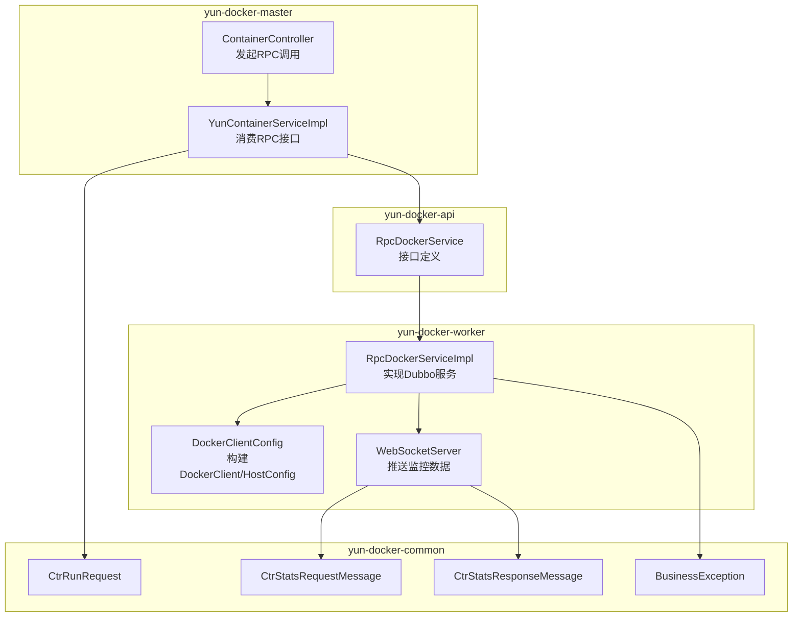
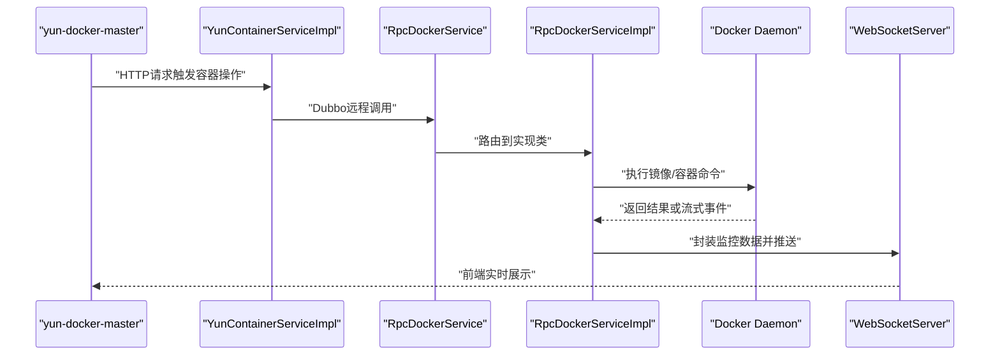
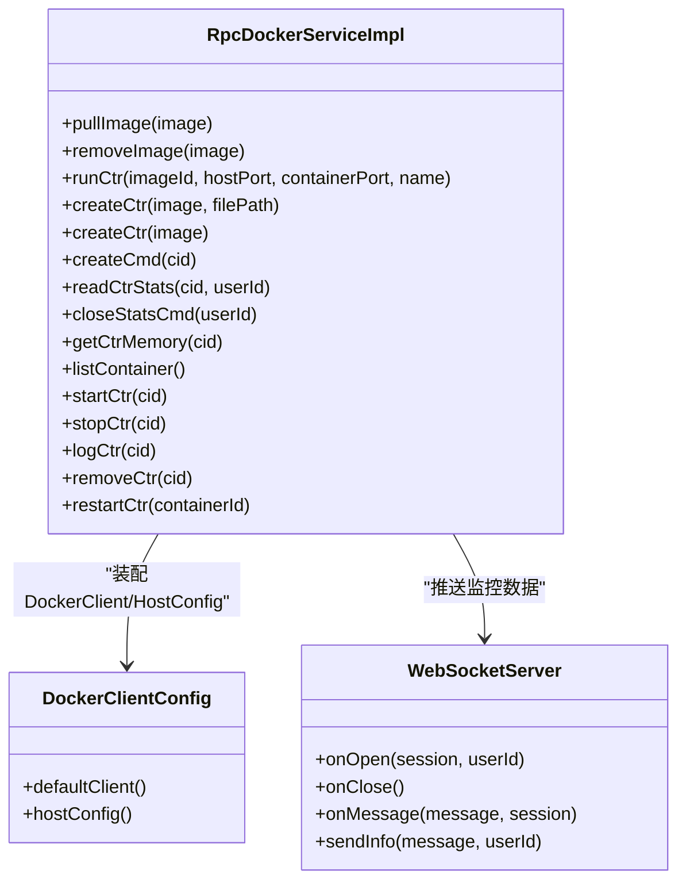
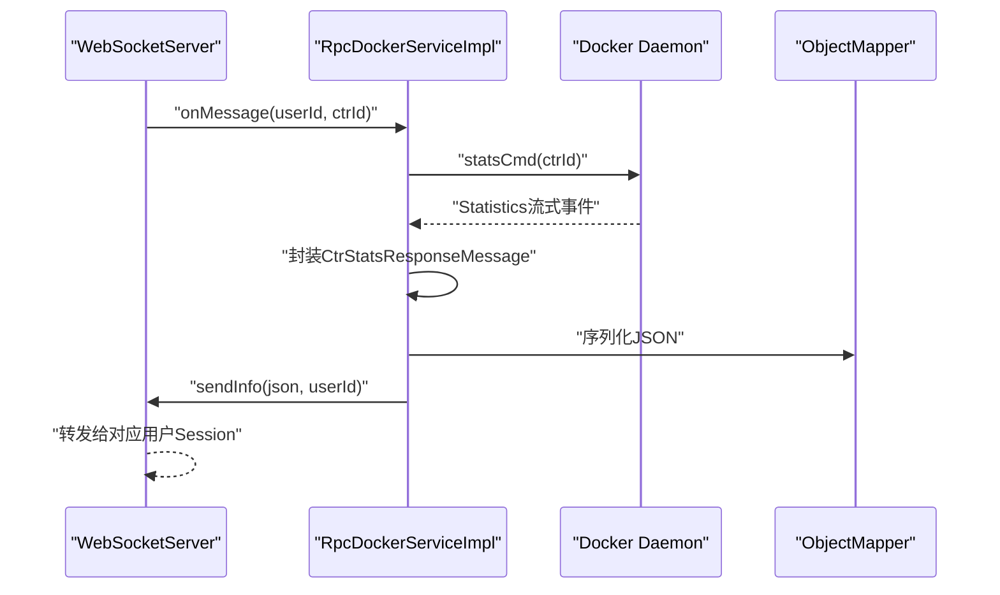
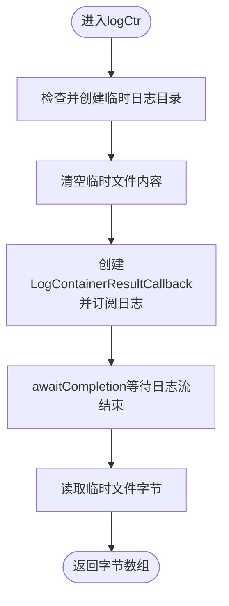
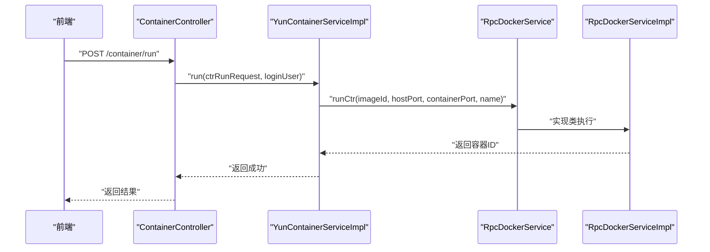
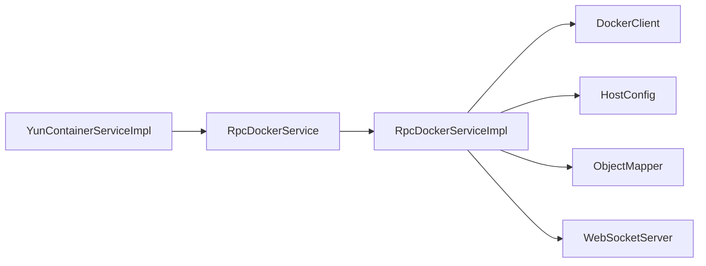

# RPC服务实现

<cite>
**本文引用的文件**
- [RpcDockerServiceImpl.java](file://yun-docker-worker/src/main/java/com/lfc/yundocker/worker/rpc/RpcDockerServiceImpl.java)
- [RpcDockerService.java](file://yun-docker-api/src/main/java/com/lfc/yundocker/service/RpcDockerService.java)
- [DockerClientConfig.java](file://yun-docker-worker/src/main/java/com/lfc/yundocker/worker/config/DockerClientConfig.java)
- [WebSocketServer.java](file://yun-docker-worker/src/main/java/com/lfc/yundocker/worker/websocket/WebSocketServer.java)
- [CtrRunRequest.java](file://yun-docker-common/src/main/java/com/lfc/yundocker/common/model/dto/CtrRunRequest.java)
- [CtrStatsRequestMessage.java](file://yun-docker-common/src/main/java/com/lfc/yundocker/common/model/dto/message/CtrStatsRequestMessage.java)
- [CtrStatsResponseMessage.java](file://yun-docker-common/src/main/java/com/lfc/yundocker/common/model/dto/message/CtrStatsResponseMessage.java)
- [BusinessException.java](file://yun-docker-common/src/main/java/com/lfc/yundocker/common/exception/BusinessException.java)
- [YunContainerServiceImpl.java](file://yun-docker-master/src/main/java/com/lfc/yundocker/service/impl/YunContainerServiceImpl.java)
- [ContainerController.java](file://yun-docker-master/src/main/java/com/lfc/yundocker/controller/ContainerController.java)
- [application.yml](file://yun-docker-worker/src/main/resources/application.yml)
</cite>

## 目录
1. [引言](#引言)
2. [项目结构](#项目结构)
3. [核心组件](#核心组件)
4. [架构总览](#架构总览)
5. [详细组件分析](#详细组件分析)
6. [依赖关系分析](#依赖关系分析)
7. [性能考量](#性能考量)
8. [故障排查指南](#故障排查指南)
9. [结论](#结论)

## 引言
本文件围绕 RpcDockerServiceImpl 类展开，系统性阐述其作为 Dubbo RPC 服务提供者如何接收来自 yun-docker-master 模块的远程调用指令，并通过 Docker Java API 与本地 Docker Daemon 交互。文档重点覆盖以下方面：
- 镜像与容器生命周期管理：pullImage、runCtr、createCtr、startCtr、stopCtr、removeCtr、restartCtr、listContainer、removeImage
- 容器资源监控：readCtrStats 通过 StatsCmd 持续获取资源使用数据并通过 WebSocket 推送给指定用户
- 日志采集：logCtr 异步读取容器日志并写入临时文件供前端下载
- 命令执行：createCmd 在容器内创建并执行命令
- HostConfig 配置：内存限制、端口绑定、目录挂载
- 异步回调与错误处理：PullImageResultCallback、LogContainerResultCallback、ResultCallback<Statistics> 的使用与异常捕获
- 与 yun-docker-common 中 DTO 和异常类的协作

## 项目结构
- yun-docker-worker：RPC 服务提供者，包含 RpcDockerServiceImpl、DockerClientConfig、WebSocketServer
- yun-docker-api：RPC 接口定义 RpcDockerService
- yun-docker-common：通用 DTO、枚举、异常类与工具
- yun-docker-master：RPC 消费者，通过 Dubbo 调用 RpcDockerService 并暴露 HTTP 接口

图表来源
- [ContainerController.java](file://yun-docker-master/src/main/java/com/lfc/yundocker/controller/ContainerController.java#L110-L133)
- [YunContainerServiceImpl.java](file://yun-docker-master/src/main/java/com/lfc/yundocker/service/impl/YunContainerServiceImpl.java#L136-L200)
- [RpcDockerService.java](file://yun-docker-api/src/main/java/com/lfc/yundocker/service/RpcDockerService.java#L1-L143)
- [RpcDockerServiceImpl.java](file://yun-docker-worker/src/main/java/com/lfc/yundocker/worker/rpc/RpcDockerServiceImpl.java#L32-L440)
- [DockerClientConfig.java](file://yun-docker-worker/src/main/java/com/lfc/yundocker/worker/config/DockerClientConfig.java#L1-L32)
- [WebSocketServer.java](file://yun-docker-worker/src/main/java/com/lfc/yundocker/worker/websocket/WebSocketServer.java#L1-L175)
- [CtrRunRequest.java](file://yun-docker-common/src/main/java/com/lfc/yundocker/common/model/dto/CtrRunRequest.java#L1-L35)
- [CtrStatsRequestMessage.java](file://yun-docker-common/src/main/java/com/lfc/yundocker/common/model/dto/message/CtrStatsRequestMessage.java#L1-L17)
- [CtrStatsResponseMessage.java](file://yun-docker-common/src/main/java/com/lfc/yundocker/common/model/dto/message/CtrStatsResponseMessage.java#L1-L69)
- [BusinessException.java](file://yun-docker-common/src/main/java/com/lfc/yundocker/common/exception/BusinessException.java#L1-L37)

章节来源
- [application.yml](file://yun-docker-worker/src/main/resources/application.yml#L1-L51)

## 核心组件
- RpcDockerServiceImpl：Dubbo 服务实现，负责镜像与容器操作、资源监控推送、日志采集、命令执行
- RpcDockerService：RPC 接口，定义了镜像与容器相关能力
- DockerClientConfig：装配 DockerClient 与 HostConfig
- WebSocketServer：基于 javax.websocket 的服务端，按用户维度推送监控数据
- DTO 与异常：CtrRunRequest、CtrStatsRequestMessage、CtrStatsResponseMessage、BusinessException

章节来源
- [RpcDockerServiceImpl.java](file://yun-docker-worker/src/main/java/com/lfc/yundocker/worker/rpc/RpcDockerServiceImpl.java#L32-L440)
- [RpcDockerService.java](file://yun-docker-api/src/main/java/com/lfc/yundocker/service/RpcDockerService.java#L1-L143)
- [DockerClientConfig.java](file://yun-docker-worker/src/main/java/com/lfc/yundocker/worker/config/DockerClientConfig.java#L1-L32)
- [WebSocketServer.java](file://yun-docker-worker/src/main/java/com/lfc/yundocker/worker/websocket/WebSocketServer.java#L1-L175)
- [CtrRunRequest.java](file://yun-docker-common/src/main/java/com/lfc/yundocker/common/model/dto/CtrRunRequest.java#L1-L35)
- [CtrStatsRequestMessage.java](file://yun-docker-common/src/main/java/com/lfc/yundocker/common/model/dto/message/CtrStatsRequestMessage.java#L1-L17)
- [CtrStatsResponseMessage.java](file://yun-docker-common/src/main/java/com/lfc/yundocker/common/model/dto/message/CtrStatsResponseMessage.java#L1-L69)
- [BusinessException.java](file://yun-docker-common/src/main/java/com/lfc/yundocker/common/exception/BusinessException.java#L1-L37)

## 架构总览
yun-docker-master 通过 Dubbo 调用 yun-docker-worker 提供的 RpcDockerService，后者基于 Docker Java API 与 Docker Daemon 交互；同时，通过 WebSocketServer 将容器资源监控数据实时推送到前端。

图表来源
- [YunContainerServiceImpl.java](file://yun-docker-master/src/main/java/com/lfc/yundocker/service/impl/YunContainerServiceImpl.java#L136-L200)
- [RpcDockerService.java](file://yun-docker-api/src/main/java/com/lfc/yundocker/service/RpcDockerService.java#L1-L143)
- [RpcDockerServiceImpl.java](file://yun-docker-worker/src/main/java/com/lfc/yundocker/worker/rpc/RpcDockerServiceImpl.java#L32-L440)
- [WebSocketServer.java](file://yun-docker-worker/src/main/java/com/lfc/yundocker/worker/websocket/WebSocketServer.java#L1-L175)

## 详细组件分析

### RpcDockerServiceImpl 类分析
- 角色定位：Dubbo 服务提供者，面向 yun-docker-master 的 RPC 调用
- 依赖注入：
  - DockerClient：用于与 Docker Daemon 通信
  - HostConfig：容器运行时的主机配置（内存、端口、卷挂载等）
  - ObjectMapper：JSON 序列化监控数据
- 静态映射：STATS_CMD_MAP 用于按用户维度管理 StatsCmd 的 ResultCallback，便于关闭监控

图表来源
- [RpcDockerServiceImpl.java](file://yun-docker-worker/src/main/java/com/lfc/yundocker/worker/rpc/RpcDockerServiceImpl.java#L32-L440)
- [DockerClientConfig.java](file://yun-docker-worker/src/main/java/com/lfc/yundocker/worker/config/DockerClientConfig.java#L1-L32)
- [WebSocketServer.java](file://yun-docker-worker/src/main/java/com/lfc/yundocker/worker/websocket/WebSocketServer.java#L1-L175)

章节来源
- [RpcDockerServiceImpl.java](file://yun-docker-worker/src/main/java/com/lfc/yundocker/worker/rpc/RpcDockerServiceImpl.java#L32-L440)

### 镜像与容器生命周期
- 拉取镜像 pullImage
  - 使用 PullImageCmd 执行拉取，通过 PullImageResultCallback 订阅进度事件
  - awaitCompletion 等待完成后再 inspect 镜像获取详细信息
- 删除镜像 removeImage
  - 使用 RemoveImageCmd 并强制删除
- 运行容器 runCtr
  - CreateContainerCmd 创建容器，设置名称、HostConfig（内存、端口绑定）
  - 立即启动容器并返回容器 ID
- 创建容器 createCtr
  - 重载方法一：传入镜像与挂载路径，设置 Bind（/app），限制内存
  - 重载方法二：仅传入镜像，无挂载
- 启动/停止/重启/删除容器
  - startCtr/stopCtr/restartCtr/removeCtr 分别对应相应命令
- 列出容器 listContainer
  - 使用 ListContainersCmd 并返回容器列表
- 删除镜像 removeImage
  - 使用 RemoveImageCmd 并强制删除

章节来源
- [RpcDockerServiceImpl.java](file://yun-docker-worker/src/main/java/com/lfc/yundocker/worker/rpc/RpcDockerServiceImpl.java#L53-L107)
- [RpcDockerServiceImpl.java](file://yun-docker-worker/src/main/java/com/lfc/yundocker/worker/rpc/RpcDockerServiceImpl.java#L116-L135)
- [RpcDockerServiceImpl.java](file://yun-docker-worker/src/main/java/com/lfc/yundocker/worker/rpc/RpcDockerServiceImpl.java#L174-L186)
- [RpcDockerServiceImpl.java](file://yun-docker-worker/src/main/java/com/lfc/yundocker/worker/rpc/RpcDockerServiceImpl.java#L303-L308)
- [RpcDockerServiceImpl.java](file://yun-docker-worker/src/main/java/com/lfc/yundocker/worker/rpc/RpcDockerServiceImpl.java#L320-L337)
- [RpcDockerServiceImpl.java](file://yun-docker-worker/src/main/java/com/lfc/yundocker/worker/rpc/RpcDockerServiceImpl.java#L339-L346)
- [RpcDockerServiceImpl.java](file://yun-docker-worker/src/main/java/com/lfc/yundocker/worker/rpc/RpcDockerServiceImpl.java#L415-L438)

### HostConfig 配置详解
- 内存限制：通过 hostConfig.withMemory 设置容器内存上限
- 端口绑定：通过 PortBinding 绑定宿主端口到容器端口
- 卷挂载：通过 Bind 将宿主路径挂载到容器路径（如 /app）

章节来源
- [RpcDockerServiceImpl.java](file://yun-docker-worker/src/main/java/com/lfc/yundocker/worker/rpc/RpcDockerServiceImpl.java#L83-L107)
- [RpcDockerServiceImpl.java](file://yun-docker-worker/src/main/java/com/lfc/yundocker/worker/rpc/RpcDockerServiceImpl.java#L116-L135)
- [DockerClientConfig.java](file://yun-docker-worker/src/main/java/com/lfc/yundocker/worker/config/DockerClientConfig.java#L1-L32)

### 容器内命令执行 createCmd
- 使用 ExecCreateCmd 创建执行上下文，attach 标准输入/输出/错误
- 通过 ExecStartCmd 启动执行，并使用 ExecStartResultCallback 监听完成事件

章节来源
- [RpcDockerServiceImpl.java](file://yun-docker-worker/src/main/java/com/lfc/yundocker/worker/rpc/RpcDockerServiceImpl.java#L137-L164)

### 资源监控 readCtrStats 与 WebSocket 推送
- 通过 StatsCmd 获取容器统计信息，ResultCallback<Statistics> 订阅每帧数据
- 将关键指标（CPU、内存、网络、磁盘 IO、进程数）封装为 CtrStatsResponseMessage
- 使用 ObjectMapper 序列化后通过 WebSocketServer.sendInfo 推送至指定用户
- STATS_CMD_MAP 保存每个用户的 ResultCallback，onClose 或显式 closeStatsCmd 调用时关闭订阅

图表来源
- [WebSocketServer.java](file://yun-docker-worker/src/main/java/com/lfc/yundocker/worker/websocket/WebSocketServer.java#L90-L120)
- [RpcDockerServiceImpl.java](file://yun-docker-worker/src/main/java/com/lfc/yundocker/worker/rpc/RpcDockerServiceImpl.java#L196-L259)
- [CtrStatsResponseMessage.java](file://yun-docker-common/src/main/java/com/lfc/yundocker/common/model/dto/message/CtrStatsResponseMessage.java#L1-L69)

章节来源
- [RpcDockerServiceImpl.java](file://yun-docker-worker/src/main/java/com/lfc/yundocker/worker/rpc/RpcDockerServiceImpl.java#L196-L259)
- [WebSocketServer.java](file://yun-docker-worker/src/main/java/com/lfc/yundocker/worker/websocket/WebSocketServer.java#L90-L120)
- [CtrStatsRequestMessage.java](file://yun-docker-common/src/main/java/com/lfc/yundocker/common/model/dto/message/CtrStatsRequestMessage.java#L1-L17)
- [CtrStatsResponseMessage.java](file://yun-docker-common/src/main/java/com/lfc/yundocker/common/model/dto/message/CtrStatsResponseMessage.java#L1-L69)

### 日志采集 logCtr 与前端下载
- 异步读取容器日志：使用 LogContainerResultCallback 订阅日志帧
- 将日志写入临时文件（用户目录下的 yun-docker-master/tempLog/log.txt）
- 读取文件内容返回字节数组，供上层控制器下载

图表来源
- [RpcDockerServiceImpl.java](file://yun-docker-worker/src/main/java/com/lfc/yundocker/worker/rpc/RpcDockerServiceImpl.java#L346-L413)

章节来源
- [RpcDockerServiceImpl.java](file://yun-docker-worker/src/main/java/com/lfc/yundocker/worker/rpc/RpcDockerServiceImpl.java#L346-L413)

### 参数传递与调用链路
- yun-docker-master 的 ContainerController 接收前端请求，封装 CtrRunRequest 并调用 YunContainerServiceImpl.run
- YunContainerServiceImpl 通过 @DubboReference 注入 RpcDockerService 并调用 runCtr
- RpcDockerServiceImpl 执行 Docker 命令并返回容器 ID

图表来源
- [ContainerController.java](file://yun-docker-master/src/main/java/com/lfc/yundocker/controller/ContainerController.java#L110-L133)
- [YunContainerServiceImpl.java](file://yun-docker-master/src/main/java/com/lfc/yundocker/service/impl/YunContainerServiceImpl.java#L136-L200)
- [RpcDockerService.java](file://yun-docker-api/src/main/java/com/lfc/yundocker/service/RpcDockerService.java#L28-L38)
- [RpcDockerServiceImpl.java](file://yun-docker-worker/src/main/java/com/lfc/yundocker/worker/rpc/RpcDockerServiceImpl.java#L83-L107)
- [CtrRunRequest.java](file://yun-docker-common/src/main/java/com/lfc/yundocker/common/model/dto/CtrRunRequest.java#L1-L35)

章节来源
- [ContainerController.java](file://yun-docker-master/src/main/java/com/lfc/yundocker/controller/ContainerController.java#L110-L133)
- [YunContainerServiceImpl.java](file://yun-docker-master/src/main/java/com/lfc/yundocker/service/impl/YunContainerServiceImpl.java#L136-L200)
- [CtrRunRequest.java](file://yun-docker-common/src/main/java/com/lfc/yundocker/common/model/dto/CtrRunRequest.java#L1-L35)

## 依赖关系分析
- 组件耦合
  - RpcDockerServiceImpl 依赖 DockerClient 与 HostConfig，耦合 Docker Java API
  - 通过 ObjectMapper 与 WebSocketServer 解耦监控数据序列化与推送
- 外部依赖
  - Docker Daemon：所有容器与镜像操作的基础
  - ZooKeeper/注册中心：Dubbo 服务发现与注册（由 yun-docker-worker 的 application.yml 配置体现）
- 循环依赖
  - 未见循环依赖迹象；RPC 接口与实现分离清晰

图表来源
- [RpcDockerServiceImpl.java](file://yun-docker-worker/src/main/java/com/lfc/yundocker/worker/rpc/RpcDockerServiceImpl.java#L32-L440)
- [DockerClientConfig.java](file://yun-docker-worker/src/main/java/com/lfc/yundocker/worker/config/DockerClientConfig.java#L1-L32)
- [YunContainerServiceImpl.java](file://yun-docker-master/src/main/java/com/lfc/yundocker/service/impl/YunContainerServiceImpl.java#L53-L54)

章节来源
- [application.yml](file://yun-docker-worker/src/main/resources/application.yml#L1-L51)

## 性能考量
- 异步回调
  - 拉取镜像、日志读取、监控统计均采用异步 ResultCallback，避免阻塞主线程
- 流式处理
  - 监控数据与日志以帧为单位推送/写入，降低内存峰值
- 资源限制
  - 通过 HostConfig 限制容器内存与 CPU，防止资源滥用
- 缓存与复用
  - STATS_CMD_MAP 按用户缓存 ResultCallback，减少重复订阅成本

[本节为通用指导，无需特定文件引用]

## 故障排查指南
- 镜像拉取失败
  - 检查镜像名称与仓库可达性；查看 PullImageResultCallback 的 onError 回调
- 容器启动失败
  - 检查端口冲突、卷挂载路径、权限问题；查看容器状态与日志
- 监控推送异常
  - 确认 WebSocket 连接建立与用户 ID 正确；检查 ObjectMapper 序列化与 sendInfo 调用
- 日志下载为空
  - 确认临时日志目录存在且可写；检查 awaitCompletion 是否正常完成
- 错误处理策略
  - 统一抛出 BusinessException，携带 ErrorCode；在 WebSocketServer 与 RpcDockerServiceImpl 中均有捕获与转换

章节来源
- [RpcDockerServiceImpl.java](file://yun-docker-worker/src/main/java/com/lfc/yundocker/worker/rpc/RpcDockerServiceImpl.java#L53-L72)
- [RpcDockerServiceImpl.java](file://yun-docker-worker/src/main/java/com/lfc/yundocker/worker/rpc/RpcDockerServiceImpl.java#L346-L413)
- [WebSocketServer.java](file://yun-docker-worker/src/main/java/com/lfc/yundocker/worker/websocket/WebSocketServer.java#L140-L158)
- [BusinessException.java](file://yun-docker-common/src/main/java/com/lfc/yundocker/common/exception/BusinessException.java#L1-L37)

## 结论
RpcDockerServiceImpl 以 Dubbo 服务形式承接 yun-docker-master 的容器编排需求，通过 Docker Java API 完成镜像与容器全生命周期管理，并以异步回调与 WebSocket 推送实现资源监控与日志采集的高并发场景。配合 yun-docker-common 的 DTO 与异常体系，形成清晰的契约与错误处理规范。建议后续关注：
- 监控命令的生命周期管理与异常恢复
- 日志采集的断点续传与压缩存储
- HostConfig 的动态配置与模板化管理
- WebSocket 断线重连与消息去重