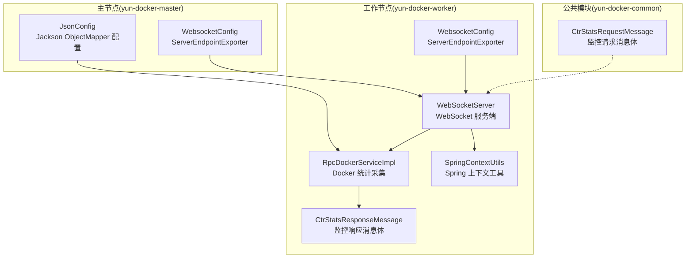
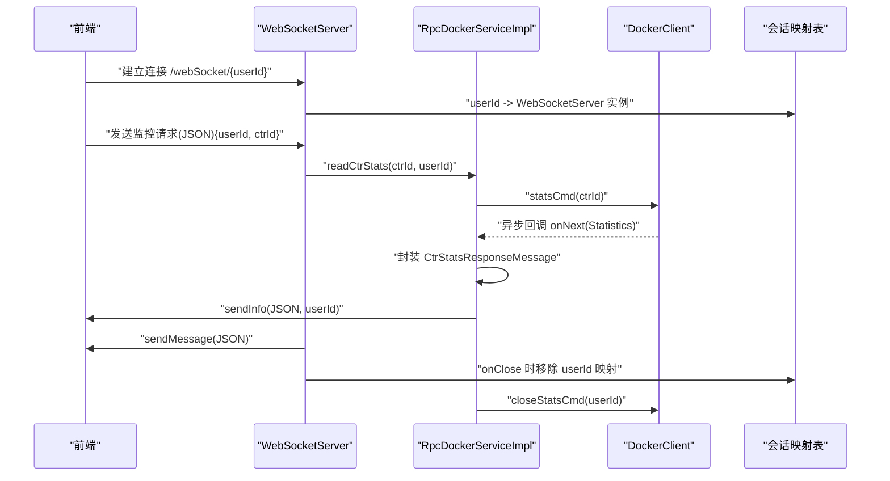
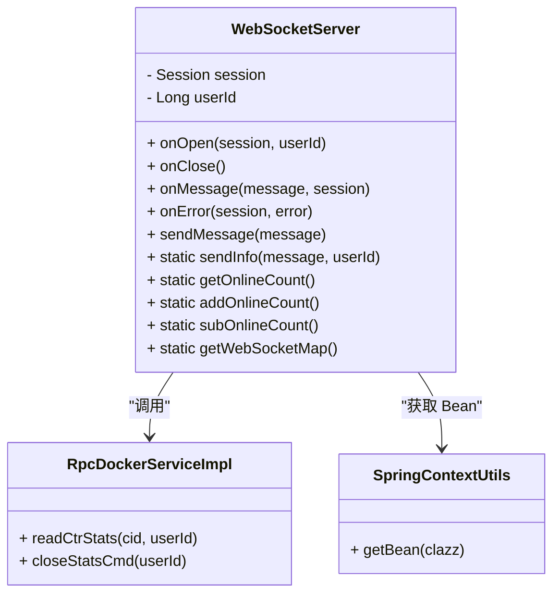
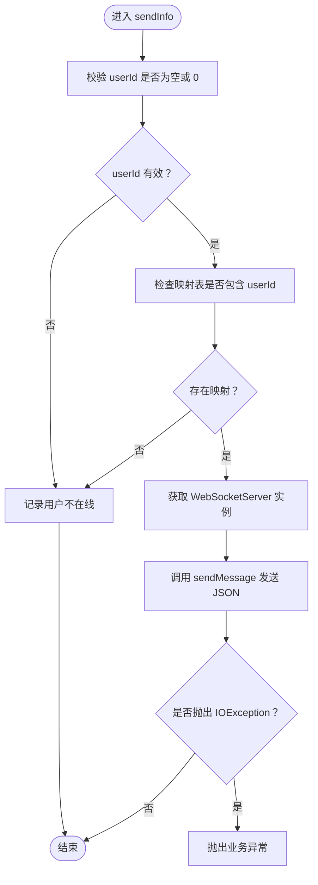
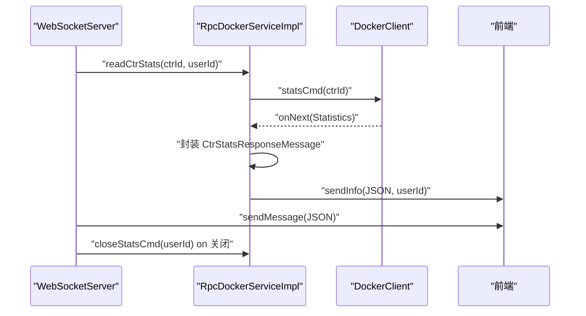
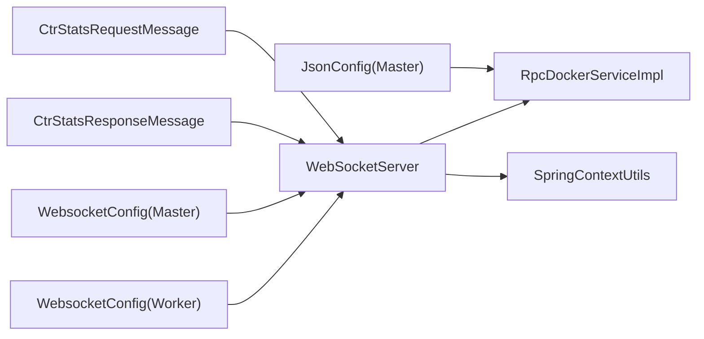

# WebSocket实时通信

<cite>
**本文引用的文件列表**
- [WebSocketServer.java](file://yun-docker-worker/src/main/java/com/lfc/yundocker/worker/websocket/WebSocketServer.java)
- [RpcDockerServiceImpl.java](file://yun-docker-worker/src/main/java/com/lfc/yundocker/worker/rpc/RpcDockerServiceImpl.java)
- [WebsocketConfig.java（Worker）](file://yun-docker-worker/src/main/java/com/lfc/yundocker/worker/config/WebsocketConfig.java)
- [WebsocketConfig.java（Master）](file://yun-docker-master/src/main/java/com/lfc/yundocker/config/WebsocketConfig.java)
- [CtrStatsResponseMessage.java](file://yun-docker-common/src/main/java/com/lfc/yundocker/common/model/dto/message/CtrStatsResponseMessage.java)
- [CtrStatsRequestMessage.java](file://yun-docker-common/src/main/java/com/lfc/yundocker/common/model/dto/message/CtrStatsRequestMessage.java)
- [SpringContextUtils.java](file://yun-docker-common/src/main/java/com/lfc/yundocker/common/util/SpringContextUtils.java)
- [application.yml（Worker）](file://yun-docker-worker/src/main/resources/application.yml)
- [JsonConfig.java（Master）](file://yun-docker-master/src/main/java/com/lfc/yundocker/config/JsonConfig.java)
</cite>

## 目录
1. [引言](#引言)
2. [项目结构](#项目结构)
3. [核心组件](#核心组件)
4. [架构总览](#架构总览)
5. [组件详解](#组件详解)
6. [依赖关系分析](#依赖关系分析)
7. [性能与并发特性](#性能与并发特性)
8. [故障排查指南](#故障排查指南)
9. [结论](#结论)

## 引言
本文件围绕工作节点中的 WebSocketServer 类展开，系统性阐述其在工作节点与前端之间进行实时通信的设计与实现。重点包括：
- 基于 Java WebSocket API 的端点注册与生命周期回调（连接建立、关闭、消息接收、异常处理）
- 会话管理策略（ConcurrentHashMap 存储 userId 到 WebSocketServer 实例映射）
- 静态方法 sendInfo 的实现机制：通过 userId 精准定位 Session 并安全推送消息
- 从 Docker 容器采集监控数据 readCtrStats 的调用场景与流程，以及将 CtrStatsResponseMessage 对象序列化为 JSON 后通过 WebSocket 推送至前端
- 连接异常处理、会话超时管理、消息格式规范（JSON）以及性能考量（避免阻塞主线程）

## 项目结构
工作节点（yun-docker-worker）包含 WebSocket 服务端实现、Docker RPC 服务实现、WebSocket 配置以及公共消息模型。整体结构如下图所示：

图表来源
- [WebSocketServer.java](file://yun-docker-worker/src/main/java/com/lfc/yundocker/worker/websocket/WebSocketServer.java#L1-L175)
- [RpcDockerServiceImpl.java](file://yun-docker-worker/src/main/java/com/lfc/yundocker/worker/rpc/RpcDockerServiceImpl.java#L1-L440)
- [WebsocketConfig.java（Worker）](file://yun-docker-worker/src/main/java/com/lfc/yundocker/worker/config/WebsocketConfig.java#L1-L20)
- [WebsocketConfig.java（Master）](file://yun-docker-master/src/main/java/com/lfc/yundocker/config/WebsocketConfig.java#L1-L19)
- [CtrStatsResponseMessage.java](file://yun-docker-common/src/main/java/com/lfc/yundocker/common/model/dto/message/CtrStatsResponseMessage.java#L1-L69)
- [CtrStatsRequestMessage.java](file://yun-docker-common/src/main/java/com/lfc/yundocker/common/model/dto/message/CtrStatsRequestMessage.java#L1-L17)
- [SpringContextUtils.java](file://yun-docker-common/src/main/java/com/lfc/yundocker/common/util/SpringContextUtils.java#L1-L109)
- [JsonConfig.java（Master）](file://yun-docker-master/src/main/java/com/lfc/yundocker/config/JsonConfig.java#L1-L30)

章节来源
- [WebSocketServer.java](file://yun-docker-worker/src/main/java/com/lfc/yundocker/worker/websocket/WebSocketServer.java#L1-L175)
- [WebsocketConfig.java（Worker）](file://yun-docker-worker/src/main/java/com/lfc/yundocker/worker/config/WebsocketConfig.java#L1-L20)
- [WebsocketConfig.java（Master）](file://yun-docker-master/src/main/java/com/lfc/yundocker/config/WebsocketConfig.java#L1-L19)

## 核心组件
- WebSocketServer：基于 Java WebSocket API 的服务端，负责连接生命周期管理、消息接收与主动推送；通过静态 ConcurrentHashMap 维护 userId 到会话实例的映射。
- RpcDockerServiceImpl：工作节点侧的 Docker RPC 实现，负责从 Docker 容器拉取统计信息，封装为 CtrStatsResponseMessage，并通过 Jackson 序列化为 JSON，再调用 WebSocketServer.sendInfo 推送给前端。
- WebsocketConfig：在 Worker 和 Master 两端分别注册 ServerEndpointExporter，使 @ServerEndpoint 注解生效。
- CtrStatsResponseMessage/CtrStatsRequestMessage：前后端通信的消息载体，前者为监控响应数据结构，后者为监控请求数据结构。
- SpringContextUtils：提供非 Spring 管理的 @ServerEndpoint 实例访问 Spring Bean 的能力。

章节来源
- [WebSocketServer.java](file://yun-docker-worker/src/main/java/com/lfc/yundocker/worker/websocket/WebSocketServer.java#L1-L175)
- [RpcDockerServiceImpl.java](file://yun-docker-worker/src/main/java/com/lfc/yundocker/worker/rpc/RpcDockerServiceImpl.java#L1-L440)
- [WebsocketConfig.java（Worker）](file://yun-docker-worker/src/main/java/com/lfc/yundocker/worker/config/WebsocketConfig.java#L1-L20)
- [WebsocketConfig.java（Master）](file://yun-docker-master/src/main/java/com/lfc/yundocker/config/WebsocketConfig.java#L1-L19)
- [CtrStatsResponseMessage.java](file://yun-docker-common/src/main/java/com/lfc/yundocker/common/model/dto/message/CtrStatsResponseMessage.java#L1-L69)
- [CtrStatsRequestMessage.java](file://yun-docker-common/src/main/java/com/lfc/yundocker/common/model/dto/message/CtrStatsRequestMessage.java#L1-L17)
- [SpringContextUtils.java](file://yun-docker-common/src/main/java/com/lfc/yundocker/common/util/SpringContextUtils.java#L1-L109)

## 架构总览
WebSocketServer 作为工作节点与前端之间的桥梁，采用以下交互模式：
- 前端通过 WebSocket 连接到 /webSocket/{userId}，建立长连接
- 前端发送监控请求（包含 userId、ctrId）触发工作节点采集 Docker 统计
- 工作节点通过 DockerClient.statsCmd 异步回调收集统计数据，封装为 CtrStatsResponseMessage
- 使用 Jackson 将对象序列化为 JSON 字符串，调用 WebSocketServer.sendInfo(userId, message) 将消息推送到对应用户的会话
- 会话关闭时，工作节点释放资源并停止统计采集

图表来源
- [WebSocketServer.java](file://yun-docker-worker/src/main/java/com/lfc/yundocker/worker/websocket/WebSocketServer.java#L51-L120)
- [RpcDockerServiceImpl.java](file://yun-docker-worker/src/main/java/com/lfc/yundocker/worker/rpc/RpcDockerServiceImpl.java#L196-L278)
- [CtrStatsResponseMessage.java](file://yun-docker-common/src/main/java/com/lfc/yundocker/common/model/dto/message/CtrStatsResponseMessage.java#L1-L69)

## 组件详解

### WebSocketServer 设计与实现
- 端点与生命周期
  - 使用 @ServerEndpoint("/webSocket/{userId}") 注册端点，路径参数 userId 用于会话映射
  - @OnOpen：建立连接时将 WebSocketServer 实例按 userId 存入 ConcurrentHashMap，并维护在线计数
  - @OnClose：断开连接时移除映射并调用 RpcDockerServiceImpl.closeStatsCmd(userId) 停止统计采集
  - @OnMessage：解析前端 JSON 请求，提取 userId、ctrId，调用 readCtrStats 执行监控采集
  - @OnError：记录错误日志
- 主动推送
  - sendMessage：通过 Session.getBasicRemote().sendText 发送文本消息
  - sendInfo：静态方法，根据 userId 从映射表获取对应 WebSocketServer 实例并推送消息；若用户不在线则记录错误
- 会话管理
  - 使用 ConcurrentHashMap<Long, WebSocketServer> 作为会话映射表，键为 userId，值为 WebSocketServer 实例
  - 使用静态 synchronized 方法维护在线计数，保证并发安全

图表来源
- [WebSocketServer.java](file://yun-docker-worker/src/main/java/com/lfc/yundocker/worker/websocket/WebSocketServer.java#L51-L174)
- [RpcDockerServiceImpl.java](file://yun-docker-worker/src/main/java/com/lfc/yundocker/worker/rpc/RpcDockerServiceImpl.java#L196-L278)
- [SpringContextUtils.java](file://yun-docker-common/src/main/java/com/lfc/yundocker/common/util/SpringContextUtils.java#L76-L95)

章节来源
- [WebSocketServer.java](file://yun-docker-worker/src/main/java/com/lfc/yundocker/worker/websocket/WebSocketServer.java#L51-L174)

### sendInfo 静态方法实现机制
- 参数与目标：接收 message（JSON 字符串）与 userId
- 定位会话：通过 ConcurrentHashMap 查询 userId 对应的 WebSocketServer 实例
- 安全推送：若存在映射且 userId 非空且非 0，则调用 sendMessage 发送；否则记录“用户不在线”错误
- 异常处理：sendMessage 抛出的 IOException 被捕获并转换为业务异常，便于上层统一处理

图表来源
- [WebSocketServer.java](file://yun-docker-worker/src/main/java/com/lfc/yundocker/worker/websocket/WebSocketServer.java#L140-L157)

章节来源
- [WebSocketServer.java](file://yun-docker-worker/src/main/java/com/lfc/yundocker/worker/websocket/WebSocketServer.java#L140-L157)

### 客户端会话管理（ConcurrentHashMap）
- 数据结构：ConcurrentHashMap<Long, WebSocketServer>，键为 userId，值为 WebSocketServer 实例
- 并发安全：对在线计数与映射表操作均采用 synchronized 静态方法，避免竞态条件
- 生命周期同步：onOpen/onClose 中对映射表与在线计数进行增删与更新，确保状态一致

章节来源
- [WebSocketServer.java](file://yun-docker-worker/src/main/java/com/lfc/yundocker/worker/websocket/WebSocketServer.java#L35-L64)
- [WebSocketServer.java](file://yun-docker-worker/src/main/java/com/lfc/yundocker/worker/websocket/WebSocketServer.java#L72-L82)

### readCtrStats 调用场景与流程
- 触发条件：前端发送包含 userId、ctrId 的监控请求，WebSocketServer.onMessage 解析后调用 RpcDockerServiceImpl.readCtrStats
- 采集过程：通过 DockerClient.statsCmd 执行异步统计回调，每条统计记录 onNext 中封装为 CtrStatsResponseMessage
- 序列化与推送：使用 Jackson ObjectMapper 将对象序列化为 JSON 字符串，调用 WebSocketServer.sendInfo(userId, message) 推送
- 资源清理：onClose 中调用 closeStatsCmd(userId) 关闭统计命令，防止资源泄漏

图表来源
- [WebSocketServer.java](file://yun-docker-worker/src/main/java/com/lfc/yundocker/worker/websocket/WebSocketServer.java#L90-L120)
- [RpcDockerServiceImpl.java](file://yun-docker-worker/src/main/java/com/lfc/yundocker/worker/rpc/RpcDockerServiceImpl.java#L196-L278)
- [CtrStatsResponseMessage.java](file://yun-docker-common/src/main/java/com/lfc/yundocker/common/model/dto/message/CtrStatsResponseMessage.java#L1-L69)

章节来源
- [WebSocketServer.java](file://yun-docker-worker/src/main/java/com/lfc/yundocker/worker/websocket/WebSocketServer.java#L90-L120)
- [RpcDockerServiceImpl.java](file://yun-docker-worker/src/main/java/com/lfc/yundocker/worker/rpc/RpcDockerServiceImpl.java#L196-L278)

### 消息格式规范（JSON）
- 响应消息：CtrStatsResponseMessage 提供 CPU、内存、网络、磁盘 IO 等指标字段，用于前端展示
- 请求消息：CtrStatsRequestMessage 包含 userId、ctrId，用于前端发起监控请求
- 序列化配置：Master 端 JsonConfig 中配置 Jackson ObjectMapper，将 Long 类型序列化为字符串，避免精度丢失问题

章节来源
- [CtrStatsResponseMessage.java](file://yun-docker-common/src/main/java/com/lfc/yundocker/common/model/dto/message/CtrStatsResponseMessage.java#L1-L69)
- [CtrStatsRequestMessage.java](file://yun-docker-common/src/main/java/com/lfc/yundocker/common/model/dto/message/CtrStatsRequestMessage.java#L1-L17)
- [JsonConfig.java（Master）](file://yun-docker-master/src/main/java/com/lfc/yundocker/config/JsonConfig.java#L1-L30)

### 连接异常处理与会话超时管理
- 异常处理：@OnError 记录错误日志；sendMessage 抛出的 IOException 被捕获并转换为业务异常
- 会话超时：应用层未显式配置 WebSocket 超时参数；当前通过 onClose 清理资源，避免长时间无效会话占用
- 资源释放：onClose 中调用 closeStatsCmd(userId) 关闭 Docker 统计命令，防止资源泄漏

章节来源
- [WebSocketServer.java](file://yun-docker-worker/src/main/java/com/lfc/yundocker/worker/websocket/WebSocketServer.java#L122-L130)
- [WebSocketServer.java](file://yun-docker-worker/src/main/java/com/lfc/yundocker/worker/websocket/WebSocketServer.java#L72-L82)
- [RpcDockerServiceImpl.java](file://yun-docker-worker/src/main/java/com/lfc/yundocker/worker/rpc/RpcDockerServiceImpl.java#L262-L278)

## 依赖关系分析
- WebSocketServer 依赖
  - RpcDockerServiceImpl：通过 SpringContextUtils 获取 Bean 并调用 readCtrStats/closeStatsCmd
  - SpringContextUtils：提供非 Spring 管理的 @ServerEndpoint 实例访问 Spring Bean 的能力
- WebSocket 配置
  - Worker 与 Master 端均注册 ServerEndpointExporter，确保 @ServerEndpoint 生效
- 消息模型
  - CtrStatsResponseMessage/CtrStatsRequestMessage 位于公共模块，供前后端共享
- JSON 序列化
  - Master 端 JsonConfig 配置 Jackson ObjectMapper，避免 Long 精度丢失

图表来源
- [WebSocketServer.java](file://yun-docker-worker/src/main/java/com/lfc/yundocker/worker/websocket/WebSocketServer.java#L1-L175)
- [RpcDockerServiceImpl.java](file://yun-docker-worker/src/main/java/com/lfc/yundocker/worker/rpc/RpcDockerServiceImpl.java#L1-L440)
- [WebsocketConfig.java（Worker）](file://yun-docker-worker/src/main/java/com/lfc/yundocker/worker/config/WebsocketConfig.java#L1-L20)
- [WebsocketConfig.java（Master）](file://yun-docker-master/src/main/java/com/lfc/yundocker/config/WebsocketConfig.java#L1-L19)
- [CtrStatsResponseMessage.java](file://yun-docker-common/src/main/java/com/lfc/yundocker/common/model/dto/message/CtrStatsResponseMessage.java#L1-L69)
- [CtrStatsRequestMessage.java](file://yun-docker-common/src/main/java/com/lfc/yundocker/common/model/dto/message/CtrStatsRequestMessage.java#L1-L17)
- [JsonConfig.java（Master）](file://yun-docker-master/src/main/java/com/lfc/yundocker/config/JsonConfig.java#L1-L30)

章节来源
- [WebSocketServer.java](file://yun-docker-worker/src/main/java/com/lfc/yundocker/worker/websocket/WebSocketServer.java#L1-L175)
- [RpcDockerServiceImpl.java](file://yun-docker-worker/src/main/java/com/lfc/yundocker/worker/rpc/RpcDockerServiceImpl.java#L1-L440)
- [WebsocketConfig.java（Worker）](file://yun-docker-worker/src/main/java/com/lfc/yundocker/worker/config/WebsocketConfig.java#L1-L20)
- [WebsocketConfig.java（Master）](file://yun-docker-master/src/main/java/com/lfc/yundocker/config/WebsocketConfig.java#L1-L19)
- [JsonConfig.java（Master）](file://yun-docker-master/src/main/java/com/lfc/yundocker/config/JsonConfig.java#L1-L30)

## 性能与并发特性
- 避免阻塞主线程
  - Docker 统计采用异步 ResultCallback onNext 回调，避免阻塞 WebSocket 主线程
  - WebSocketServer.onMessage 中仅解析请求并触发 readCtrStats，不进行重计算或 I/O 密集操作
- 并发安全
  - 会话映射表使用 ConcurrentHashMap，线程安全
  - 在线计数与映射表更新使用 synchronized 静态方法，保证原子性
- 序列化与网络
  - 使用 Jackson ObjectMapper 进行 JSON 序列化，Master 端配置 Long 序列化为字符串，减少精度问题
  - sendMessage 通过 Session.getBasicRemote().sendText 发送文本消息，避免阻塞调用线程
- 资源管理
  - onClose 中关闭 Docker 统计命令，防止资源泄漏
  - 会话映射表在 onClose 中移除，避免内存泄漏

章节来源
- [WebSocketServer.java](file://yun-docker-worker/src/main/java/com/lfc/yundocker/worker/websocket/WebSocketServer.java#L90-L120)
- [RpcDockerServiceImpl.java](file://yun-docker-worker/src/main/java/com/lfc/yundocker/worker/rpc/RpcDockerServiceImpl.java#L196-L278)
- [JsonConfig.java（Master）](file://yun-docker-master/src/main/java/com/lfc/yundocker/config/JsonConfig.java#L1-L30)

## 故障排查指南
- 用户不在线
  - 现象：sendInfo 调用后记录“用户不在线”
  - 排查：确认前端是否已建立 /webSocket/{userId} 连接；检查 userId 是否正确传递
- 序列化异常
  - 现象：onNext 中 JSON 序列化失败抛出业务异常
  - 排查：检查 CtrStatsResponseMessage 字段类型与 Jackson 配置；确认 ObjectMapper 正常初始化
- Docker 统计异常
  - 现象：onError 回调打印错误日志
  - 排查：检查容器是否存在、权限是否足够、Docker daemon 是否正常
- 资源未释放
  - 现象：长时间运行后内存占用上升
  - 排查：确认 onClose 是否被调用；closeStatsCmd 是否成功关闭统计命令

章节来源
- [WebSocketServer.java](file://yun-docker-worker/src/main/java/com/lfc/yundocker/worker/websocket/WebSocketServer.java#L122-L130)
- [WebSocketServer.java](file://yun-docker-worker/src/main/java/com/lfc/yundocker/worker/websocket/WebSocketServer.java#L72-L82)
- [RpcDockerServiceImpl.java](file://yun-docker-worker/src/main/java/com/lfc/yundocker/worker/rpc/RpcDockerServiceImpl.java#L235-L240)
- [RpcDockerServiceImpl.java](file://yun-docker-worker/src/main/java/com/lfc/yundocker/worker/rpc/RpcDockerServiceImpl.java#L262-L278)

## 结论
WebSocketServer 通过 Java WebSocket API 与 Spring 集成，实现了工作节点与前端的高效实时通信。其核心优势包括：
- 基于 userId 的精准会话映射，确保消息投递准确
- 异步采集与推送，避免阻塞主线程
- 统一的消息模型与 JSON 序列化配置，保障前后端一致性
- 完善的生命周期管理与异常处理，提升系统稳定性

建议后续可考虑：
- 显式配置 WebSocket 超时参数，增强会话健壮性
- 增加心跳保活机制，降低网络波动导致的连接中断
- 对 Docker 统计异常进行更细粒度的错误分类与反馈