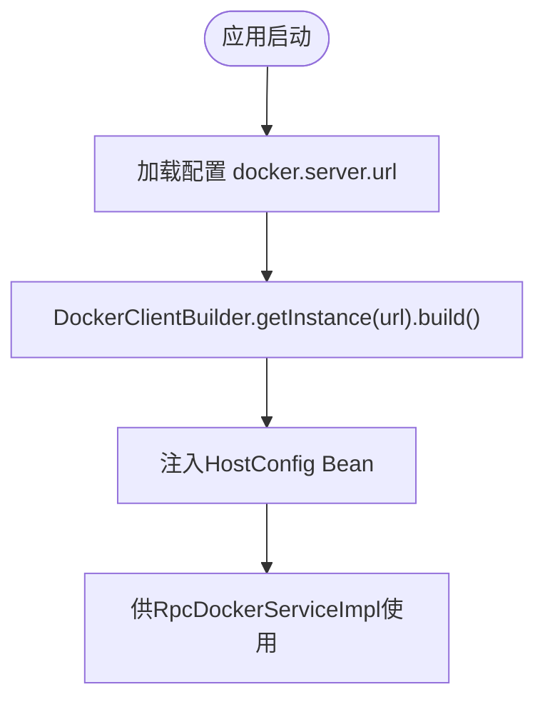

# 工作节点模块（yun-docker-worker）

<cite>
**本文引用的文件列表**
- [RpcDockerServiceImpl.java](file://yun-docker-worker/src/main/java/com/lfc/yundocker/worker/rpc/RpcDockerServiceImpl.java)
- [WebSocketServer.java](file://yun-docker-worker/src/main/java/com/lfc/yundocker/worker/websocket/WebSocketServer.java)
- [DockerClientConfig.java](file://yun-docker-worker/src/main/java/com/lfc/yundocker/worker/config/DockerClientConfig.java)
- [WebsocketConfig.java](file://yun-docker-worker/src/main/java/com/lfc/yundocker/worker/config/WebsocketConfig.java)
- [RpcDockerService.java](file://yun-docker-api/src/main/java/com/lfc/yundocker/service/RpcDockerService.java)
- [WorkerApplication.java](file://yun-docker-worker/src/main/java/com/lfc/yundocker/worker/WorkerApplication.java)
- [application.yml](file://yun-docker-worker/src/main/resources/application.yml)
- [application-dev.yml](file://yun-docker-worker/src/main/resources/application-dev.yml)
- [application-prod.yml](file://yun-docker-worker/src/main/resources/application-prod.yml)
</cite>

## 目录
1. [简介](#简介)
2. [项目结构](#项目结构)
3. [核心组件](#核心组件)
4. [架构总览](#架构总览)
5. [组件详解](#组件详解)
6. [依赖关系分析](#依赖关系分析)
7. [性能与资源管理](#性能与资源管理)
8. [故障排查指南](#故障排查指南)
9. [结论](#结论)
10. [附录](#附录)

## 简介
本文件面向yun-docker-worker工作节点模块，系统性阐述其作为执行节点的关键职责与技术实现：
- 接收来自master的Dubbo RPC指令，调用本地Docker Daemon执行容器生命周期与运维操作；
- 通过WebSocket将容器日志与运行状态实时推送给前端；
- 深入解析RpcDockerServiceImpl中使用Docker Java API完成镜像拉取、容器创建/启动/停止/重启/删除、日志采集、统计监控等能力；
- 解释WebSocketServer如何管理客户端会话、绑定容器ID与连接关系，实现精准的消息推送；
- 分析DockerClientConfig中的Docker主机连接配置方式（tcp://或socket），并结合实际调用场景说明异步处理机制与资源释放逻辑。

## 项目结构
工作节点模块位于yun-docker-worker子工程，采用按功能分层组织：
- config：Docker客户端与WebSocket配置
- rpc：Dubbo服务实现，对接Docker Java API
- websocket：WebSocket服务端，负责会话管理与消息推送
- resources：应用配置与环境配置
- WorkerApplication：引导类，启用Dubbo、WebSocket、AOP等

图表来源
- [WorkerApplication.java](file://yun-docker-worker/src/main/java/com/lfc/yundocker/worker/WorkerApplication.java#L1-L23)
- [DockerClientConfig.java](file://yun-docker-worker/src/main/java/com/lfc/yundocker/worker/config/DockerClientConfig.java#L1-L32)
- [WebsocketConfig.java](file://yun-docker-worker/src/main/java/com/lfc/yundocker/worker/config/WebsocketConfig.java#L1-L20)
- [RpcDockerServiceImpl.java](file://yun-docker-worker/src/main/java/com/lfc/yundocker/worker/rpc/RpcDockerServiceImpl.java#L1-L440)
- [WebSocketServer.java](file://yun-docker-worker/src/main/java/com/lfc/yundocker/worker/websocket/WebSocketServer.java#L1-L175)
- [RpcDockerService.java](file://yun-docker-api/src/main/java/com/lfc/yundocker/service/RpcDockerService.java#L1-L143)
- [application.yml](file://yun-docker-worker/src/main/resources/application.yml#L1-L51)
- [application-dev.yml](file://yun-docker-worker/src/main/resources/application-dev.yml#L1-L65)
- [application-prod.yml](file://yun-docker-worker/src/main/resources/application-prod.yml#L1-L65)

章节来源
- [WorkerApplication.java](file://yun-docker-worker/src/main/java/com/lfc/yundocker/worker/WorkerApplication.java#L1-L23)
- [application.yml](file://yun-docker-worker/src/main/resources/application.yml#L1-L51)

## 核心组件
- RpcDockerServiceImpl：Dubbo服务实现，封装Docker Java API调用，提供镜像与容器全生命周期操作、日志采集、统计监控、命令执行等能力。
- WebSocketServer：基于JSR-356的WebSocket服务端，维护用户会话映射，接收前端订阅请求，向指定用户推送容器统计与日志。
- DockerClientConfig：构建DockerClient与HostConfig，配置Docker主机连接地址（tcp://或Unix socket）。
- WebsocketConfig：注册ServerEndpointExporter，启用WebSocket端点扫描。
- RpcDockerService：Dubbo服务接口，定义工作节点对外暴露的操作契约。

章节来源
- [RpcDockerServiceImpl.java](file://yun-docker-worker/src/main/java/com/lfc/yundocker/worker/rpc/RpcDockerServiceImpl.java#L1-L440)
- [WebSocketServer.java](file://yun-docker-worker/src/main/java/com/lfc/yundocker/worker/websocket/WebSocketServer.java#L1-L175)
- [DockerClientConfig.java](file://yun-docker-worker/src/main/java/com/lfc/yundocker/worker/config/DockerClientConfig.java#L1-L32)
- [WebsocketConfig.java](file://yun-docker-worker/src/main/java/com/lfc/yundocker/worker/config/WebsocketConfig.java#L1-L20)
- [RpcDockerService.java](file://yun-docker-api/src/main/java/com/lfc/yundocker/service/RpcDockerService.java#L1-L143)

## 架构总览
工作节点整体架构围绕“RPC指令—Docker操作—WebSocket推送”展开：
- master侧通过Dubbo调用工作节点的RpcDockerService；
- 工作节点内部使用Docker Java API与本地Docker Daemon交互；
- WebSocketServer负责与前端建立长连接，按用户维度推送容器统计与日志；
- DockerClientConfig与配置文件决定Docker主机连接方式（tcp://或socket）。

图表来源
- [RpcDockerService.java](file://yun-docker-api/src/main/java/com/lfc/yundocker/service/RpcDockerService.java#L1-L143)
- [RpcDockerServiceImpl.java](file://yun-docker-worker/src/main/java/com/lfc/yundocker/worker/rpc/RpcDockerServiceImpl.java#L1-L440)
- [WebSocketServer.java](file://yun-docker-worker/src/main/java/com/lfc/yundocker/worker/websocket/WebSocketServer.java#L1-L175)

## 组件详解

### RpcDockerServiceImpl：Docker操作与监控
该实现类承担工作节点的核心职责，使用Docker Java API完成以下关键能力：
- 镜像管理：拉取镜像、删除镜像；拉取过程通过回调打印进度，完成后查询镜像详情。
- 容器管理：创建容器（可挂载目录、限制内存/CPU）、启动/停止/重启/删除容器、列出容器、查看日志。
- 命令执行：在指定容器内创建并启动命令，支持标准输入/输出/错误流。
- 统计监控：持续读取容器CPU/内存/网络/IO统计，封装为消息并通过WebSocket推送给前端；提供关闭统计命令的能力，确保资源释放。
- 异步处理：日志采集与统计均采用异步ResultCallback，避免阻塞主线程；统计命令通过静态映射按用户维度管理，便于关闭。

关键参数与策略：
- 容器创建与端口绑定：通过HostConfig设置端口绑定与容器名称；示例中对容器内存进行限制。
- 日志采集：将容器日志写入本地临时文件，再读取为字节数组返回；避免一次性输出导致阻塞。
- 统计监控：将原始指标换算为更易读的单位（如KB/MB/kbps），并聚合网络IO与块IO统计。
- 错误处理：捕获异常并抛出业务异常，统一错误码；统计命令关闭时捕获IO异常并转换为业务异常。

图表来源
- [RpcDockerServiceImpl.java](file://yun-docker-worker/src/main/java/com/lfc/yundocker/worker/rpc/RpcDockerServiceImpl.java#L1-L440)
- [RpcDockerService.java](file://yun-docker-api/src/main/java/com/lfc/yundocker/service/RpcDockerService.java#L1-L143)

章节来源
- [RpcDockerServiceImpl.java](file://yun-docker-worker/src/main/java/com/lfc/yundocker/worker/rpc/RpcDockerServiceImpl.java#L52-L107)
- [RpcDockerServiceImpl.java](file://yun-docker-worker/src/main/java/com/lfc/yundocker/worker/rpc/RpcDockerServiceImpl.java#L109-L164)
- [RpcDockerServiceImpl.java](file://yun-docker-worker/src/main/java/com/lfc/yundocker/worker/rpc/RpcDockerServiceImpl.java#L189-L278)
- [RpcDockerServiceImpl.java](file://yun-docker-worker/src/main/java/com/lfc/yundocker/worker/rpc/RpcDockerServiceImpl.java#L280-L318)
- [RpcDockerServiceImpl.java](file://yun-docker-worker/src/main/java/com/lfc/yundocker/worker/rpc/RpcDockerServiceImpl.java#L319-L340)
- [RpcDockerServiceImpl.java](file://yun-docker-worker/src/main/java/com/lfc/yundocker/worker/rpc/RpcDockerServiceImpl.java#L340-L413)
- [RpcDockerServiceImpl.java](file://yun-docker-worker/src/main/java/com/lfc/yundocker/worker/rpc/RpcDockerServiceImpl.java#L414-L440)

### WebSocketServer：会话管理与精准推送
WebSocketServer负责：
- 建立与前端的长连接，按userId维护会话映射；
- 接收前端订阅消息，触发工作节点读取容器统计；
- 将统计与日志消息按userId精准推送到对应连接；
- 在连接关闭时清理统计命令，避免资源泄漏。

会话管理要点：
- 使用ConcurrentHashMap维护userId到WebSocketServer实例的映射；
- OnClose时通过Spring上下文获取RpcDockerServiceImpl并关闭对应用户的统计命令；
- sendInfo静态方法根据userId查找会话并发送消息，若用户不在线则记录错误。

图表来源
- [WebSocketServer.java](file://yun-docker-worker/src/main/java/com/lfc/yundocker/worker/websocket/WebSocketServer.java#L1-L175)
- [RpcDockerServiceImpl.java](file://yun-docker-worker/src/main/java/com/lfc/yundocker/worker/rpc/RpcDockerServiceImpl.java#L189-L278)

章节来源
- [WebSocketServer.java](file://yun-docker-worker/src/main/java/com/lfc/yundocker/worker/websocket/WebSocketServer.java#L25-L174)

### DockerClientConfig：Docker主机连接配置
- 通过配置项docker.server.url决定Docker主机连接方式：
  - tcp://host:port：连接远端Docker守护进程（示例使用tcp://192.168.254.128:2375）；
  - Unix socket：可通过配置为Unix socket路径（例如unix:///var/run/docker.sock）。
- 使用DockerClientBuilder.getInstance(url).build()构建DockerClient；
- HostConfig通过@Bean注入，用于容器创建时的资源限制与端口绑定等。

图表来源
- [DockerClientConfig.java](file://yun-docker-worker/src/main/java/com/lfc/yundocker/worker/config/DockerClientConfig.java#L1-L32)
- [application-dev.yml](file://yun-docker-worker/src/main/resources/application-dev.yml#L1-L65)
- [application-prod.yml](file://yun-docker-worker/src/main/resources/application-prod.yml#L1-L65)

章节来源
- [DockerClientConfig.java](file://yun-docker-worker/src/main/java/com/lfc/yundocker/worker/config/DockerClientConfig.java#L1-L32)
- [application-dev.yml](file://yun-docker-worker/src/main/resources/application-dev.yml#L1-L65)
- [application-prod.yml](file://yun-docker-worker/src/main/resources/application-prod.yml#L1-L65)

### WebsocketConfig：WebSocket端点启用
- 注册ServerEndpointExporter，使@ServerEndpoint注解生效；
- WebSocketServer通过@ServerEndpoint("/webSocket/{userId}")暴露端点。

章节来源
- [WebsocketConfig.java](file://yun-docker-worker/src/main/java/com/lfc/yundocker/worker/config/WebsocketConfig.java#L1-L20)
- [WebSocketServer.java](file://yun-docker-worker/src/main/java/com/lfc/yundocker/worker/websocket/WebSocketServer.java#L25-L30)

## 依赖关系分析
- WorkerApplication启用Dubbo、WebSocket、AOP，作为工作节点主入口；
- RpcDockerServiceImpl依赖DockerClient与HostConfig，实现容器与镜像操作；
- WebSocketServer依赖Spring上下文获取RpcDockerServiceImpl，实现统计命令的关闭；
- RpcDockerService为接口契约，被master侧Dubbo消费；
- DockerClientConfig与配置文件共同决定Docker连接方式。

图表来源
- [WorkerApplication.java](file://yun-docker-worker/src/main/java/com/lfc/yundocker/worker/WorkerApplication.java#L1-L23)
- [DockerClientConfig.java](file://yun-docker-worker/src/main/java/com/lfc/yundocker/worker/config/DockerClientConfig.java#L1-L32)
- [WebsocketConfig.java](file://yun-docker-worker/src/main/java/com/lfc/yundocker/worker/config/WebsocketConfig.java#L1-L20)
- [RpcDockerServiceImpl.java](file://yun-docker-worker/src/main/java/com/lfc/yundocker/worker/rpc/RpcDockerServiceImpl.java#L1-L440)
- [WebSocketServer.java](file://yun-docker-worker/src/main/java/com/lfc/yundocker/worker/websocket/WebSocketServer.java#L1-L175)
- [RpcDockerService.java](file://yun-docker-api/src/main/java/com/lfc/yundocker/service/RpcDockerService.java#L1-L143)

章节来源
- [WorkerApplication.java](file://yun-docker-worker/src/main/java/com/lfc/yundocker/worker/WorkerApplication.java#L1-L23)
- [RpcDockerService.java](file://yun-docker-api/src/main/java/com/lfc/yundocker/service/RpcDockerService.java#L1-L143)

## 性能与资源管理
- 异步回调：日志与统计均采用异步ResultCallback，避免阻塞主线程，提升吞吐；
- 统计命令管理：通过静态映射按userId管理统计命令，连接关闭时显式关闭，防止资源泄漏；
- I/O优化：日志先落盘再读取，避免超大日志一次性输出导致内存压力；
- 资源限制：容器创建时设置内存限制，降低资源争用风险；
- 并发安全：会话映射使用ConcurrentHashMap，保证多线程下的会话管理一致性。

章节来源
- [WebSocketServer.java](file://yun-docker-worker/src/main/java/com/lfc/yundocker/worker/websocket/WebSocketServer.java#L35-L82)
- [RpcDockerServiceImpl.java](file://yun-docker-worker/src/main/java/com/lfc/yundocker/worker/rpc/RpcDockerServiceImpl.java#L189-L278)
- [RpcDockerServiceImpl.java](file://yun-docker-worker/src/main/java/com/lfc/yundocker/worker/rpc/RpcDockerServiceImpl.java#L340-L413)

## 故障排查指南
- Docker连接失败
  - 检查docker.server.url是否正确（tcp://或unix socket），确认Docker守护进程监听端口与权限；
  - 若使用tcp，确认防火墙与安全组放通端口；若使用socket，确认Docker服务已启动且路径正确。
- 统计监控异常
  - 某些容器（如redis）在特定条件下可能出现连接超时，需检查容器健康状态与资源限制；
  - 确认WebSocket连接正常，关闭连接时是否触发closeStatsCmd清理。
- 日志推送失败
  - 确认WebSocketServer的sendInfo方法能够找到对应userId的会话；
  - 检查消息序列化是否异常（JSON序列化），以及前端是否正确订阅。
- 资源泄漏
  - 确保每次连接关闭时都会调用closeStatsCmd；
  - 定期检查统计命令映射表，避免残留未关闭的回调。

章节来源
- [DockerClientConfig.java](file://yun-docker-worker/src/main/java/com/lfc/yundocker/worker/config/DockerClientConfig.java#L1-L32)
- [WebSocketServer.java](file://yun-docker-worker/src/main/java/com/lfc/yundocker/worker/websocket/WebSocketServer.java#L72-L82)
- [RpcDockerServiceImpl.java](file://yun-docker-worker/src/main/java/com/lfc/yundocker/worker/rpc/RpcDockerServiceImpl.java#L189-L278)

## 结论
yun-docker-worker模块通过清晰的分层设计与稳健的异步处理机制，实现了工作节点的核心职责：
- 以RpcDockerServiceImpl为核心，完整覆盖镜像与容器生命周期、命令执行、日志与统计监控；
- 以WebSocketServer为桥梁，实现按用户维度的精准消息推送；
- 通过DockerClientConfig与配置文件灵活适配不同Docker连接方式；
- 在异步回调与资源管理方面具备良好的性能与稳定性，适合在生产环境中长期运行。

## 附录
- 关键调用场景示例（无代码片段，仅说明流程）
  - 启动容器后持续推送日志：工作节点在创建容器后启动容器，同时通过日志回调将日志写入本地文件，前端通过WebSocket订阅统计，工作节点周期性推送CPU/内存/网络/IO指标。
  - 命令执行：在指定容器内创建并启动命令，标准输入/输出/错误流通过回调返回，前端可实时查看执行结果。
  - 资源释放：前端断开连接时，WebSocketServer调用closeStatsCmd关闭对应统计命令，避免资源泄漏。