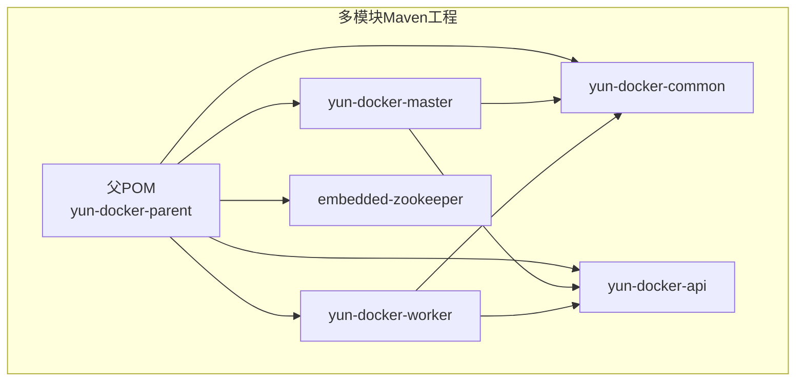
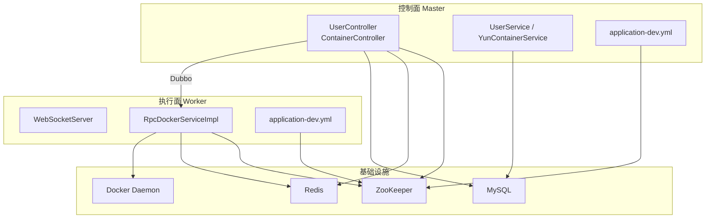
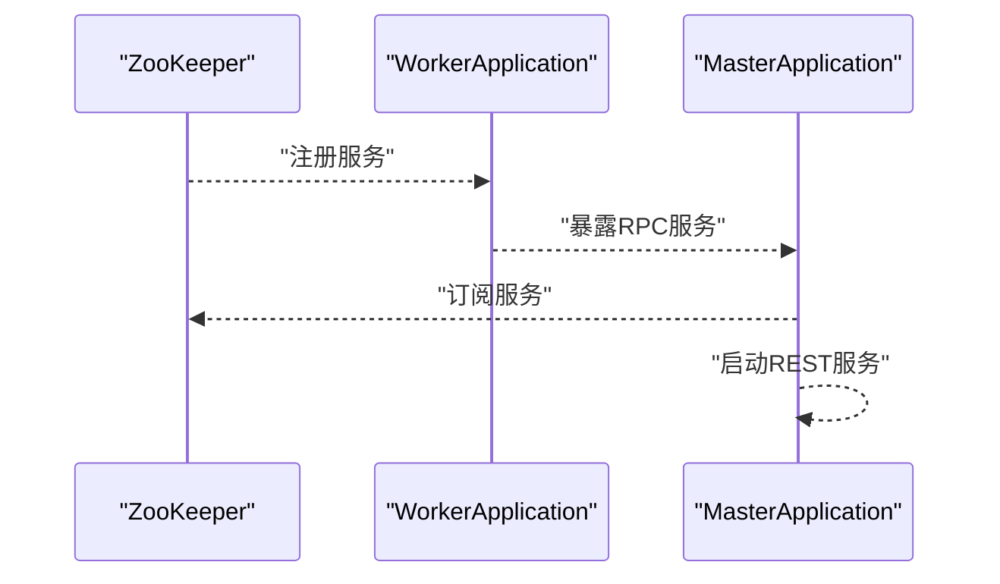
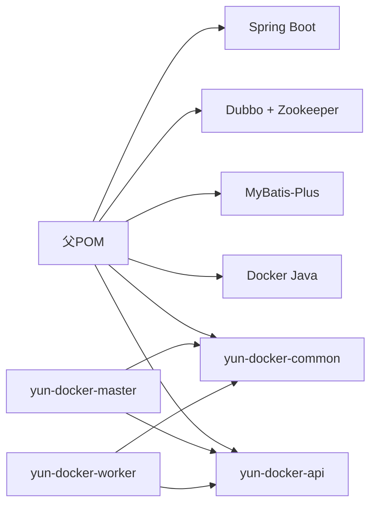

# 快速入门

<cite>
**本文引用的文件**
- [README.md](file://README.md)
- [pom.xml](file://pom.xml)
- [sql/yun_docker.sql](file://sql/yun_docker.sql)
- [embedded-zookeeper/src/main/java/com/lfc/zookeeper/EmbeddedZooKeeper.java](file://embedded-zookeeper/src/main/java/com/lfc/zookeeper/EmbeddedZooKeeper.java)
- [yun-docker-master/src/main/java/com/lfc/yundocker/MasterApplication.java](file://yun-docker-master/src/main/java/com/lfc/yundocker/MasterApplication.java)
- [yun-docker-worker/src/main/java/com/lfc/yundocker/worker/WorkerApplication.java](file://yun-docker-worker/src/main/java/com/lfc/yundocker/worker/WorkerApplication.java)
- [yun-docker-master/src/main/resources/application-dev.yml](file://yun-docker-master/src/main/resources/application-dev.yml)
- [yun-docker-worker/src/main/resources/application-dev.yml](file://yun-docker-worker/src/main/resources/application-dev.yml)
- [yun-docker-master/src/main/java/com/lfc/yundocker/controller/UserController.java](file://yun-docker-master/src/main/java/com/lfc/yundocker/controller/UserController.java)
- [yun-docker-master/src/main/java/com/lfc/yundocker/controller/ContainerController.java](file://yun-docker-master/src/main/java/com/lfc/yundocker/controller/ContainerController.java)
- [yun-docker-api/src/main/java/com/lfc/yundocker/service/RpcDockerService.java](file://yun-docker-api/src/main/java/com/lfc/yundocker/service/RpcDockerService.java)
- [yun-docker-master/src/test/java/com/lfc/yundocker/service/UserServiceTest.java](file://yun-docker-master/src/test/java/com/lfc/yundocker/service/UserServiceTest.java)
</cite>

## 目录
1. [简介](#简介)
2. [项目结构](#项目结构)
3. [核心组件](#核心组件)
4. [架构总览](#架构总览)
5. [详细步骤指南](#详细步骤指南)
6. [依赖关系分析](#依赖关系分析)
7. [性能与并发注意事项](#性能与并发注意事项)
8. [故障排查清单](#故障排查清单)
9. [结论](#结论)
10. [附录](#附录)

## 简介
本指南面向新手开发者，目标是在约30分钟内完成项目的本地运行与首次体验。你将完成环境准备、数据库初始化、配置修改、模块启动顺序、接口测试以及创建第一个容器并查看日志。文档同时引用了README.md中的项目背景与功能说明，并提供图形化调试建议（如IDEA断点调试UserServiceTest）。

**章节来源**
- [README.md](file://README.md#L1-L7)

## 项目结构
该项目采用多模块Maven工程组织，包含公共模块、Master控制面、Worker执行面、API接口定义以及嵌入式ZooKeeper模块。核心模块如下：
- yun-docker-common：公共模型、常量、异常与工具
- yun-docker-api：RPC接口定义（Docker相关）
- yun-docker-master：控制面服务（用户、容器、订单、支付等）
- yun-docker-worker：执行面服务（Docker客户端、WebSocket、RPC实现）
- embedded-zookeeper：嵌入式ZooKeeper，便于本地开发

**图表来源**
- [pom.xml](file://pom.xml#L1-L40)

**章节来源**
- [pom.xml](file://pom.xml#L1-L40)

## 核心组件
- 控制面（Master）：提供REST API，负责用户认证、容器生命周期管理、订单与支付、WebSocket推送等。
- 执行面（Worker）：负责与Docker守护进程交互，实现镜像拉取、容器运行、日志与状态采集。
- RPC接口：统一抽象Docker操作，供Master调用。
- 注册中心：基于ZooKeeper（可使用嵌入式ZooKeeper）。
- 数据源：MySQL（含用户、容器、镜像、订单等表）。
- 缓存：Redis（默认禁用，按需启用）。

**章节来源**
- [yun-docker-master/src/main/java/com/lfc/yundocker/MasterApplication.java](file://yun-docker-master/src/main/java/com/lfc/yundocker/MasterApplication.java#L1-L25)
- [yun-docker-worker/src/main/java/com/lfc/yundocker/worker/WorkerApplication.java](file://yun-docker-worker/src/main/java/com/lfc/yundocker/worker/WorkerApplication.java#L1-L23)
- [yun-docker-api/src/main/java/com/lfc/yundocker/service/RpcDockerService.java](file://yun-docker-api/src/main/java/com/lfc/yundocker/service/RpcDockerService.java#L1-L143)

## 架构总览
下图展示了Master与Worker之间的Dubbo通信、ZooKeeper注册发现、MySQL与Redis的关系，以及容器创建的关键流程。

**图表来源**
- [yun-docker-master/src/main/resources/application-dev.yml](file://yun-docker-master/src/main/resources/application-dev.yml#L1-L81)
- [yun-docker-worker/src/main/resources/application-dev.yml](file://yun-docker-worker/src/main/resources/application-dev.yml#L1-L65)
- [embedded-zookeeper/src/main/java/com/lfc/zookeeper/EmbeddedZooKeeper.java](file://embedded-zookeeper/src/main/java/com/lfc/zookeeper/EmbeddedZooKeeper.java#L1-L41)
- [yun-docker-api/src/main/java/com/lfc/yundocker/service/RpcDockerService.java](file://yun-docker-api/src/main/java/com/lfc/yundocker/service/RpcDockerService.java#L1-L143)

## 详细步骤指南

### 步骤一：环境准备（JDK 8+、Maven、Docker、MySQL）
- JDK 8+：确保本地安装JDK 8及以上版本，Java版本与项目属性一致。
- Maven：使用Maven 3.6+构建项目。
- Docker：确保Docker守护进程可用，Worker侧配置指向Docker守护进程URL。
- MySQL：准备MySQL 5.7+或8.0，后续用于初始化数据库与表。

提示：项目根POM声明了Java 1.8与Spring Boot 2.7.2，建议使用对应版本工具链。

**章节来源**
- [pom.xml](file://pom.xml#L27-L33)
- [yun-docker-worker/src/main/resources/application-dev.yml](file://yun-docker-worker/src/main/resources/application-dev.yml#L1-L10)

### 步骤二：数据库初始化（执行yun_docker.sql创建表）
- 在MySQL中创建数据库（例如名为 yun_docker），然后执行 sql/yun_docker.sql 脚本以创建用户、容器、镜像、订单等表。
- 可参考脚本中的表结构与示例数据，确认字段与索引符合预期。

**章节来源**
- [sql/yun_docker.sql](file://sql/yun_docker.sql#L1-L139)

### 步骤三：配置修改（调整application-dev.yml中的数据库与Redis连接信息）
- Master侧配置要点：
  - 数据库连接：检查驱动、URL、用户名、密码。
  - Redis连接：若启用缓存，取消注释并填写数据库、主机、端口、超时、密码等。
  - Dubbo注册中心：默认使用ZooKeeper地址为127.0.0.1:2181。
- Worker侧配置要点：
  - Docker守护进程URL：指向本机Docker守护进程（例如tcp://host:2375）。
  - Dubbo注册中心：同上。
  - 若未启用Redis，保持默认排除配置即可。

**章节来源**
- [yun-docker-master/src/main/resources/application-dev.yml](file://yun-docker-master/src/main/resources/application-dev.yml#L1-L81)
- [yun-docker-worker/src/main/resources/application-dev.yml](file://yun-docker-worker/src/main/resources/application-dev.yml#L1-L65)

### 步骤四：模块启动顺序（先启动ZooKeeper，再启动worker，最后启动master）
- 启动嵌入式ZooKeeper（本地开发推荐）：
  - 运行 embedded-zookeeper 模块中的 EmbeddedZooKeeper.main，监听默认端口2181。
- 启动Worker：
  - 运行 yun-docker-worker 的 WorkerApplication.main，等待Dubbo暴露服务。
- 启动Master：
  - 运行 yun-docker-master 的 MasterApplication.main，注册到ZooKeeper并启动REST服务。

**图表来源**
- [embedded-zookeeper/src/main/java/com/lfc/zookeeper/EmbeddedZooKeeper.java](file://embedded-zookeeper/src/main/java/com/lfc/zookeeper/EmbeddedZooKeeper.java#L1-L41)
- [yun-docker-worker/src/main/java/com/lfc/yundocker/worker/WorkerApplication.java](file://yun-docker-worker/src/main/java/com/lfc/yundocker/worker/WorkerApplication.java#L1-L23)
- [yun-docker-master/src/main/java/com/lfc/yundocker/MasterApplication.java](file://yun-docker-master/src/main/java/com/lfc/yundocker/MasterApplication.java#L1-L25)

### 步骤五：接口测试（使用curl或Postman调用用户注册/登录接口获取token）
- 用户注册接口：POST /user/register
  - 请求体包含 userAccount、userPassword、checkPassword。
- 用户登录接口：POST /user/login
  - 请求体包含 userAccount、userPassword。
- 登录成功后，服务端会返回登录用户信息（包含token等），请保存以便后续调用受保护接口。

提示：接口定义位于 UserController，支持注册、登录、登出、获取当前登录用户等。

**章节来源**
- [yun-docker-master/src/main/java/com/lfc/yundocker/controller/UserController.java](file://yun-docker-master/src/main/java/com/lfc/yundocker/controller/UserController.java#L44-L84)

### 步骤六：创建第一个容器（调用容器创建API并查看日志）
- 创建容器接口：POST /container/run
  - 请求体包含镜像信息、端口映射、容器名称等（具体字段见 CtrRunRequest）。
  - 调用前请确保已登录并携带有效token。
- 查看日志接口：GET /container/downloadLog
  - 参数 containerId，返回容器日志文件字节流，可下载查看。

注意：容器创建会消耗用户积分，余额不足将被拒绝。

**章节来源**
- [yun-docker-master/src/main/java/com/lfc/yundocker/controller/ContainerController.java](file://yun-docker-master/src/main/java/com/lfc/yundocker/controller/ContainerController.java#L110-L133)
- [yun-docker-master/src/main/java/com/lfc/yundocker/controller/ContainerController.java](file://yun-docker-master/src/main/java/com/lfc/yundocker/controller/ContainerController.java#L155-L171)

### 图形化调试建议（IDEA断点调试UserServiceTest）
- 在 IDE 中打开 yun-docker-master 模块的 UserServiceTest，设置断点于 userRegister 测试方法处，运行测试。
- 观察 UserService 的注册逻辑与返回值，有助于理解用户注册流程与参数校验。

**章节来源**
- [yun-docker-master/src/test/java/com/lfc/yundocker/service/UserServiceTest.java](file://yun-docker-master/src/test/java/com/lfc/yundocker/service/UserServiceTest.java#L1-L34)

## 依赖关系分析
- 父POM统一管理Spring Boot、Dubbo、MyBatis-Plus、Docker Java、MySQL驱动等依赖版本。
- Master依赖Redis、WebSocket、Knife4j、Actuator、Prometheus等；Worker依赖Dubbo、Zookeeper、WebSocket。
- Master与Worker均依赖 yun-docker-api 与 yun-docker-common。

**图表来源**
- [pom.xml](file://pom.xml#L34-L121)
- [yun-docker-master/pom.xml](file://yun-docker-master/pom.xml#L1-L194)
- [yun-docker-worker/pom.xml](file://yun-docker-worker/pom.xml#L1-L60)

**章节来源**
- [pom.xml](file://pom.xml#L34-L121)
- [yun-docker-master/pom.xml](file://yun-docker-master/pom.xml#L1-L194)
- [yun-docker-worker/pom.xml](file://yun-docker-worker/pom.xml#L1-L60)

## 性能与并发注意事项
- Docker操作可能阻塞，建议在Worker侧对容器状态查询与日志读取进行异步处理。
- Redis启用后可提升会话与缓存性能，但需关注连接池与序列化开销。
- Prometheus指标与Actuator端点可用于运行时监控，建议在生产环境开启。

[本节为通用建议，不直接分析具体文件]

## 故障排查清单
- 端口占用
  - ZooKeeper默认端口：2181
  - Docker守护进程URL：确认 Worker 配置的URL与宿主机Docker守护进程一致
  - MySQL默认端口：3306
- 依赖缺失
  - 确认已安装并正确配置JDK 8+、Maven、Docker、MySQL
  - 确认数据库已创建并执行 yun_docker.sql
- 配置错误
  - Master/Worker 的 application-dev.yml 中数据库、Redis、ZooKeeper、Docker URL 是否正确
- 权限问题
  - Docker守护进程访问权限（必要时加入docker组）
- 网络问题
  - Worker与Master能否连通ZooKeeper
  - Master能否连通MySQL与Redis

[本节为通用建议，不直接分析具体文件]

## 结论
按照本指南，你可以在30分钟内完成环境准备、数据库初始化、配置修改、模块启动与接口测试，并成功创建第一个容器与查看日志。建议在本地开发阶段优先使用嵌入式ZooKeeper与默认端口，逐步扩展至Redis与生产级配置。

[本节为总结性内容，不直接分析具体文件]

## 附录

### 接口一览（路径与用途）
- 用户相关
  - POST /user/register：用户注册
  - POST /user/login：用户登录
  - GET /user/get/login：获取当前登录用户
- 容器相关
  - POST /container/run：创建容器
  - GET /container/downloadLog：下载容器日志
  - GET /container/startOrStop：启动/停止容器
  - GET /container/restart：重启容器
  - GET /container/remove：删除容器

**章节来源**
- [yun-docker-master/src/main/java/com/lfc/yundocker/controller/UserController.java](file://yun-docker-master/src/main/java/com/lfc/yundocker/controller/UserController.java#L44-L84)
- [yun-docker-master/src/main/java/com/lfc/yundocker/controller/ContainerController.java](file://yun-docker-master/src/main/java/com/lfc/yundocker/controller/ContainerController.java#L41-L171)