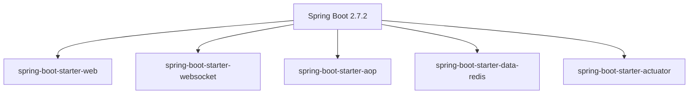
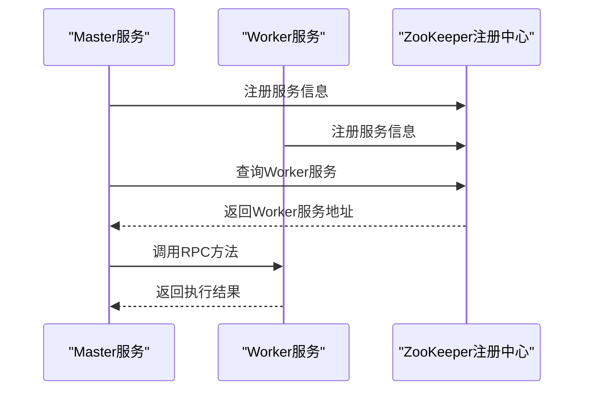
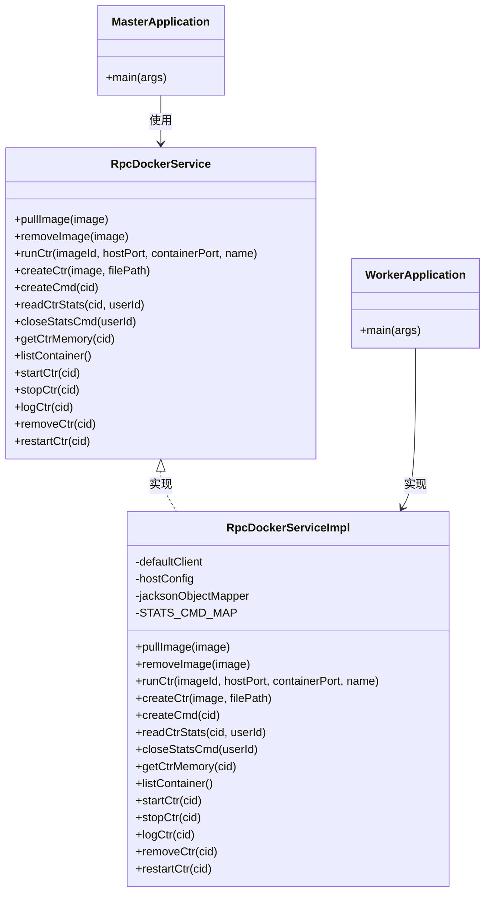
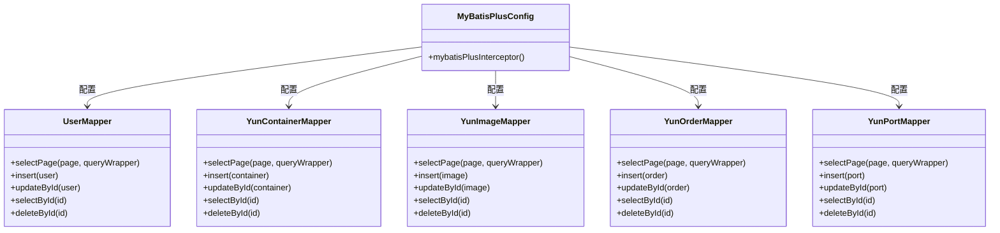
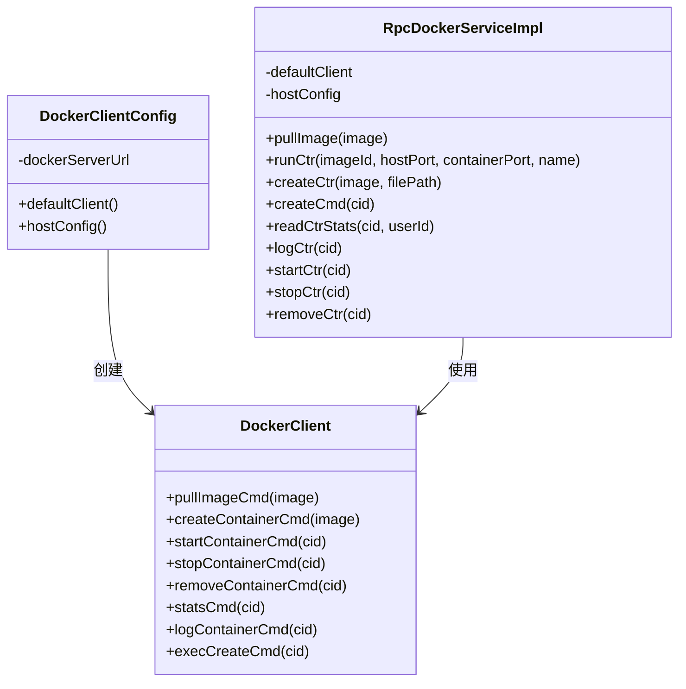
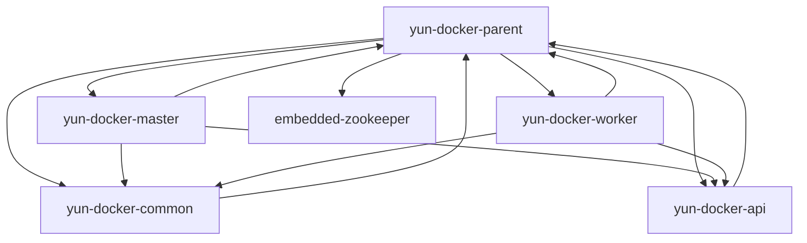

# 技术栈与依赖

<cite>
**本文档引用的文件**
- [pom.xml](file://pom.xml)
- [yun-docker-master/pom.xml](file://yun-docker-master/pom.xml)
- [yun-docker-worker/pom.xml](file://yun-docker-worker/pom.xml)
- [yun-docker-api/pom.xml](file://yun-docker-api/pom.xml)
- [yun-docker-common/pom.xml](file://yun-docker-common/pom.xml)
- [MasterApplication.java](file://yun-docker-master/src/main/java/com/lfc/yundocker/MasterApplication.java)
- [WorkerApplication.java](file://yun-docker-worker/src/main/java/com/lfc/yundocker/worker/WorkerApplication.java)
- [RpcDockerService.java](file://yun-docker-api/src/main/java/com/lfc/yundocker/service/RpcDockerService.java)
- [RpcDockerServiceImpl.java](file://yun-docker-worker/src/main/java/com/lfc/yundocker/worker/rpc/RpcDockerServiceImpl.java)
- [MyBatisPlusConfig.java](file://yun-docker-master/src/main/java/com/lfc/yundocker/config/MyBatisPlusConfig.java)
- [ServiceNameConstants.java](file://yun-docker-common/src/main/java/com/lfc/yundocker/common/constant/ServiceNameConstants.java)
- [RedisUtil.java](file://yun-docker-common/src/main/java/com/lfc/yundocker/common/util/RedisUtil.java)
- [DockerClientConfig.java](file://yun-docker-worker/src/main/java/com/lfc/yundocker/worker/config/DockerClientConfig.java)
- [application.yml](file://yun-docker-master/src/main/resources/application.yml)
- [application.yml](file://yun-docker-worker/src/main/resources/application.yml)
</cite>

## 目录
1. [技术栈概览](#技术栈概览)
2. [核心框架与组件](#核心框架与组件)
3. [微服务架构与RPC通信](#微服务架构与rpc通信)
4. [数据访问层实现](#数据访问层实现)
5. [Docker引擎交互](#docker引擎交互)
6. [关键依赖库](#关键依赖库)
7. [模块依赖关系](#模块依赖关系)
8. [版本兼容性与升级风险](#版本兼容性与升级风险)

## 技术栈概览

yun-docker-backend项目采用Spring Boot作为核心框架构建微服务架构，通过Dubbo与ZooKeeper实现服务注册发现与RPC调用，使用MyBatis-Plus作为数据访问层框架，并通过Docker Java API与Docker引擎进行交互。项目采用多模块结构，包含master、worker、api、common和embedded-zookeeper等模块，形成了完整的分布式系统架构。

**本节来源**
- [pom.xml](file://pom.xml)
- [yun-docker-master/pom.xml](file://yun-docker-master/pom.xml)
- [yun-docker-worker/pom.xml](file://yun-docker-worker/pom.xml)

## 核心框架与组件

项目以Spring Boot 2.7.2为核心框架，为微服务构建提供了全面的支持。Spring Boot的自动配置机制简化了应用的初始化和配置过程，使得开发者能够快速搭建和部署服务。项目中使用了多个Spring Boot Starter组件，包括web、websocket、aop、data-redis等，为系统提供了Web服务、WebSocket通信、面向切面编程和Redis数据访问等基础功能。



**图示来源**
- [yun-docker-master/pom.xml](file://yun-docker-master/pom.xml)
- [yun-docker-worker/pom.xml](file://yun-docker-worker/pom.xml)

**本节来源**
- [yun-docker-master/pom.xml](file://yun-docker-master/pom.xml)
- [yun-docker-worker/pom.xml](file://yun-docker-worker/pom.xml)
- [MasterApplication.java](file://yun-docker-master/src/main/java/com/lfc/yundocker/MasterApplication.java)
- [WorkerApplication.java](file://yun-docker-worker/src/main/java/com/lfc/yundocker/worker/WorkerApplication.java)

## 微服务架构与RPC通信

项目采用Dubbo作为RPC框架，结合ZooKeeper实现服务注册与发现。系统由master和worker两个主要服务组成，通过Dubbo进行远程调用。master服务作为控制中心，worker服务作为执行节点，两者通过定义在api模块中的RPC接口进行通信。

### 服务注册与发现机制

Dubbo使用ZooKeeper作为注册中心，实现了服务的自动注册与发现。在pom.xml中，项目引入了dubbo-spring-boot-starter和dubbo-dependencies-zookeeper-curator5依赖，版本分别为2.7.21和3.1.5。当服务启动时，会自动向ZooKeeper注册自己的服务信息，包括服务名称、IP地址和端口等。消费者服务则从ZooKeeper获取提供者的服务信息，建立连接并进行远程调用。



**图示来源**
- [pom.xml](file://pom.xml)
- [yun-docker-master/pom.xml](file://yun-docker-master/pom.xml)
- [yun-docker-worker/pom.xml](file://yun-docker-worker/pom.xml)

### RPC调用实现

项目在yun-docker-api模块中定义了RpcDockerService接口，该接口声明了与Docker引擎交互的各种操作方法，如拉取镜像、运行容器、查看日志等。yun-docker-worker模块实现了该接口，提供了具体的功能实现。yun-docker-master模块通过Dubbo的@DubboReference注解引用该服务，实现远程调用。



**图示来源**
- [yun-docker-api/src/main/java/com/lfc/yundocker/service/RpcDockerService.java](file://yun-docker-api/src/main/java/com/lfc/yundocker/service/RpcDockerService.java)
- [yun-docker-worker/src/main/java/com/lfc/yundocker/worker/rpc/RpcDockerServiceImpl.java](file://yun-docker-worker/src/main/java/com/lfc/yundocker/worker/rpc/RpcDockerServiceImpl.java)
- [MasterApplication.java](file://yun-docker-master/src/main/java/com/lfc/yundocker/MasterApplication.java)
- [WorkerApplication.java](file://yun-docker-worker/src/main/java/com/lfc/yundocker/worker/WorkerApplication.java)

**本节来源**
- [pom.xml](file://pom.xml)
- [yun-docker-api/pom.xml](file://yun-docker-api/pom.xml)
- [yun-docker-worker/pom.xml](file://yun-docker-worker/pom.xml)
- [yun-docker-master/pom.xml](file://yun-docker-master/pom.xml)
- [RpcDockerService.java](file://yun-docker-api/src/main/java/com/lfc/yundocker/service/RpcDockerService.java)
- [RpcDockerServiceImpl.java](file://yun-docker-worker/src/main/java/com/lfc/yundocker/worker/rpc/RpcDockerServiceImpl.java)
- [MasterApplication.java](file://yun-docker-master/src/main/java/com/lfc/yundocker/MasterApplication.java)
- [WorkerApplication.java](file://yun-docker-worker/src/main/java/com/lfc/yundocker/worker/WorkerApplication.java)

## 数据访问层实现

项目使用MyBatis-Plus作为数据访问层框架，版本为3.4.3.1。MyBatis-Plus在MyBatis的基础上提供了丰富的功能增强，极大地简化了数据库操作。在yun-docker-master模块中，通过MyBatisPlusConfig配置类启用了分页插件，支持MySQL数据库的分页查询。



**图示来源**
- [yun-docker-master/src/main/java/com/lfc/yundocker/config/MyBatisPlusConfig.java](file://yun-docker-master/src/main/java/com/lfc/yundocker/config/MyBatisPlusConfig.java)
- [yun-docker-master/src/main/java/com/lfc/yundocker/mapper/UserMapper.java](file://yun-docker-master/src/main/java/com/lfc/yundocker/mapper/UserMapper.java)
- [yun-docker-master/src/main/java/com/lfc/yundocker/mapper/YunContainerMapper.java](file://yun-docker-master/src/main/java/com/lfc/yundocker/mapper/YunContainerMapper.java)
- [yun-docker-master/src/main/java/com/lfc/yundocker/mapper/YunImageMapper.java](file://yun-docker-master/src/main/java/com/lfc/yundocker/mapper/YunImageMapper.java)
- [yun-docker-master/src/main/java/com/lfc/yundocker/mapper/YunOrderMapper.java](file://yun-docker-master/src/main/java/com/lfc/yundocker/mapper/YunOrderMapper.java)
- [yun-docker-master/src/main/java/com/lfc/yundocker/mapper/YunPortMapper.java](file://yun-docker-master/src/main/java/com/lfc/yundocker/mapper/YunPortMapper.java)

MyBatis-Plus的应用优势主要体现在以下几个方面：
1. **简化CRUD操作**：通过继承BaseMapper接口，实体类自动获得基本的增删改查方法，无需编写XML或注解
2. **分页支持**：内置分页插件，通过Page对象即可实现分页查询，无需手动编写分页SQL
3. **条件构造器**：提供QueryWrapper等条件构造器，以链式编程方式构建复杂查询条件
4. **自动填充**：支持字段自动填充功能，如创建时间、更新时间等字段的自动设置
5. **逻辑删除**：支持逻辑删除功能，通过配置即可实现软删除，避免数据物理删除

**本节来源**
- [pom.xml](file://pom.xml)
- [yun-docker-master/pom.xml](file://yun-docker-master/pom.xml)
- [MyBatisPlusConfig.java](file://yun-docker-master/src/main/java/com/lfc/yundocker/config/MyBatisPlusConfig.java)

## Docker引擎交互

项目通过Docker Java API与Docker引擎进行交互，实现了对Docker容器的全生命周期管理。在yun-docker-worker模块中，通过DockerClientConfig配置类创建DockerClient实例，该实例作为与Docker守护进程通信的客户端。



**图示来源**
- [yun-docker-worker/src/main/java/com/lfc/yundocker/worker/config/DockerClientConfig.java](file://yun-docker-worker/src/main/java/com/lfc/yundocker/worker/config/DockerClientConfig.java)
- [yun-docker-worker/src/main/java/com/lfc/yundocker/worker/rpc/RpcDockerServiceImpl.java](file://yun-docker-worker/src/main/java/com/lfc/yundocker/worker/rpc/RpcDockerServiceImpl.java)

Docker Java API的封装主要体现在RpcDockerServiceImpl类中，该类实现了RpcDockerService接口，提供了以下功能：
- **镜像管理**：拉取、删除Docker镜像
- **容器管理**：创建、启动、停止、删除容器
- **容器监控**：读取容器的CPU、内存、网络等统计信息
- **日志管理**：获取容器的日志输出
- **命令执行**：在容器中执行命令

通过Docker Java API的封装，项目实现了对Docker引擎的编程式控制，使得master服务能够通过RPC调用远程管理worker节点上的Docker容器。

**本节来源**
- [pom.xml](file://pom.xml)
- [yun-docker-worker/pom.xml](file://yun-docker-worker/pom.xml)
- [yun-docker-api/pom.xml](file://yun-docker-api/pom.xml)
- [DockerClientConfig.java](file://yun-docker-worker/src/main/java/com/lfc/yundocker/worker/config/DockerClientConfig.java)
- [RpcDockerServiceImpl.java](file://yun-docker-worker/src/main/java/com/lfc/yundocker/worker/rpc/RpcDockerServiceImpl.java)

## 关键依赖库

项目使用了多个关键依赖库，每个库在项目中都有特定的用途：

### Hutool工具库

Hutool是一个Java工具包，提供了丰富的工具类，简化了Java开发中的常见操作。在项目中，Hutool被用于文件操作、数字处理等。例如，在RpcDockerServiceImpl类中，使用Hutool的FileUtil类进行文件的创建、写入和读取操作。

```xml
<dependency>
    <groupId>cn.hutool</groupId>
    <artifactId>hutool-all</artifactId>
    <version>5.8.22</version>
</dependency>
```

### Lombok

Lombok通过注解的方式简化了Java代码，减少了样板代码的编写。在项目中，Lombok被广泛用于实体类和配置类中，通过@Data、@Slf4j等注解自动生成getter、setter、toString方法和日志对象。

```xml
<dependency>
    <groupId>org.projectlombok</groupId>
    <artifactId>lombok</artifactId>
</dependency>
```

### Alipay SDK

Alipay SDK用于集成支付宝支付功能。在yun-docker-master模块中，通过AlipayTemplate类封装了支付宝支付的相关操作，支持订单创建、支付请求、异步通知处理等功能。

```xml
<dependency>
    <groupId>com.alipay.sdk</groupId>
    <artifactId>alipay-sdk-java</artifactId>
    <version>4.9.28.ALL</version>
</dependency>
```

### 其他工具库

- **Fastjson**：用于JSON序列化和反序列化，版本1.2.78
- **Knife4j**：Swagger增强工具，用于API文档的生成和展示，版本3.0.3
- **Commons-IO**：Apache Commons IO工具库，用于文件和流的操作，版本2.11.0
- **Gson**：Google的JSON库，用于JSON处理，版本2.9.1

这些依赖库共同构成了项目的技术基础，提供了从底层工具到上层功能的全面支持。

**本节来源**
- [pom.xml](file://pom.xml)
- [yun-docker-master/pom.xml](file://yun-docker-master/pom.xml)
- [yun-docker-common/pom.xml](file://yun-docker-common/pom.xml)

## 模块依赖关系

项目采用多模块结构，各模块之间存在明确的依赖关系。通过分析pom.xml文件，可以清晰地了解模块间的依赖图谱。



**图示来源**
- [pom.xml](file://pom.xml)
- [yun-docker-master/pom.xml](file://yun-docker-master/pom.xml)
- [yun-docker-worker/pom.xml](file://yun-docker-worker/pom.xml)
- [yun-docker-api/pom.xml](file://yun-docker-api/pom.xml)
- [yun-docker-common/pom.xml](file://yun-docker-common/pom.xml)

具体依赖关系如下：
- **yun-docker-master**模块依赖于yun-docker-common和yun-docker-api模块，作为系统的控制中心，需要使用公共组件和RPC接口
- **yun-docker-worker**模块依赖于yun-docker-common和yun-docker-api模块，作为执行节点，需要实现RPC接口并使用公共组件
- **yun-docker-common**模块包含项目中的公共类、常量、工具类等，被其他模块广泛依赖
- **yun-docker-api**模块定义了RPC接口，供master和worker模块使用
- **embedded-zookeeper**模块提供了嵌入式ZooKeeper服务，支持本地开发和测试

这种模块化的设计使得代码结构清晰，职责分离明确，便于维护和扩展。

**本节来源**
- [pom.xml](file://pom.xml)
- [yun-docker-master/pom.xml](file://yun-docker-master/pom.xml)
- [yun-docker-worker/pom.xml](file://yun-docker-worker/pom.xml)
- [yun-docker-api/pom.xml](file://yun-docker-api/pom.xml)
- [yun-docker-common/pom.xml](file://yun-docker-common/pom.xml)

## 版本兼容性与升级风险

项目中各组件的版本需要保持兼容性，避免因版本不匹配导致的问题。以下是关键组件的版本信息：

| 组件 | 版本 | 说明 |
|------|------|------|
| Spring Boot | 2.7.2 | 核心框架版本 |
| Dubbo | 2.7.21 | RPC框架版本 |
| ZooKeeper | 3.1.5 | 服务注册中心版本 |
| MyBatis-Plus | 3.4.3.1 | 数据访问层框架版本 |
| Docker Java | 3.3.0 | Docker引擎交互库版本 |
| Hutool | 5.8.22 | 工具类库版本 |

潜在的升级风险点包括：
1. **Spring Boot版本升级**：从2.7.x升级到3.x版本会有较大的API变化，需要评估兼容性
2. **Dubbo版本升级**：Dubbo 3.x版本在服务发现、协议等方面有重大变更，需要重新评估架构设计
3. **MyBatis-Plus版本升级**：新版本可能引入不兼容的API变更，需要测试验证
4. **Docker Java API版本升级**：新版本可能改变API设计，影响现有代码

在进行版本升级时，建议先在测试环境中进行全面测试，确保功能正常后再部署到生产环境。

**本节来源**
- [pom.xml](file://pom.xml)
- [yun-docker-master/pom.xml](file://yun-docker-master/pom.xml)
- [yun-docker-worker/pom.xml](file://yun-docker-worker/pom.xml)