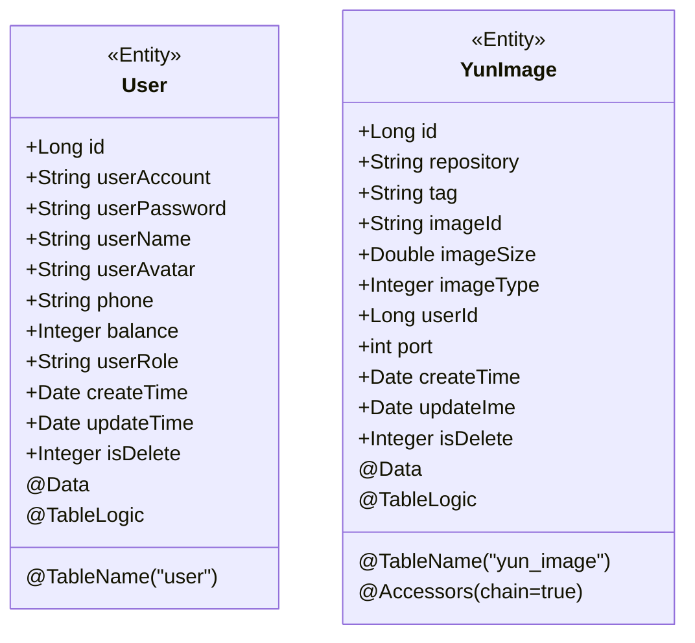
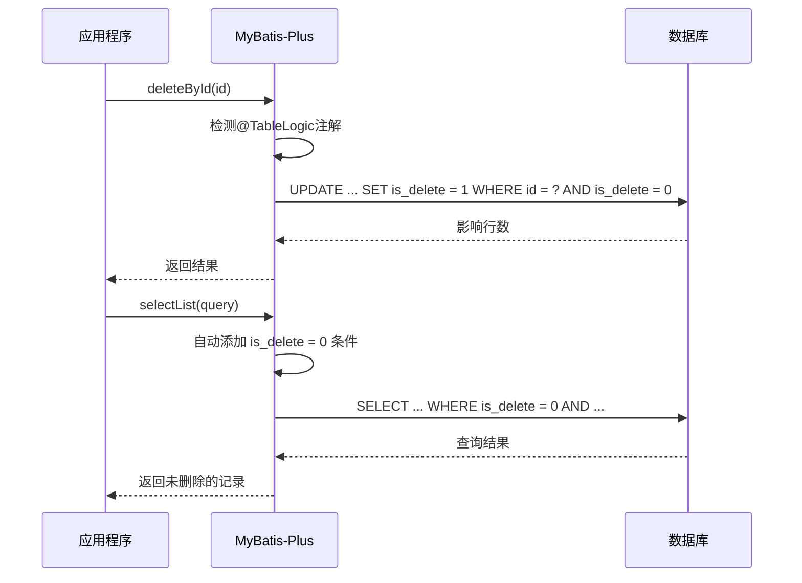
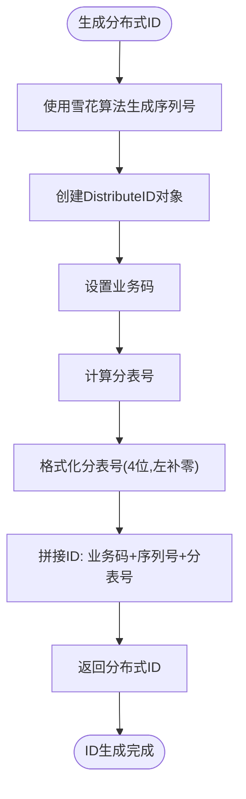

# Java实体类映射

<cite>
**本文档引用的文件**   
- [User.java](file://yun-docker-master/src/main/java/com/lfc/yundocker/common/model/entity/User.java)
- [YunContainer.java](file://yun-docker-master/src/main/java/com/lfc/yundocker/common/model/entity/YunContainer.java)
- [YunImage.java](file://yun-docker-master/src/main/java/com/lfc/yundocker/common/model/entity/YunImage.java)
- [YunOrder.java](file://yun-docker-master/src/main/java/com/lfc/yundocker/common/model/entity/YunOrder.java)
- [DistributeID.java](file://yun-docker-common/src/main/java/com/lfc/yundocker/common/util/id/DistributeID.java)
- [MyBatisPlusConfig.java](file://yun-docker-master/src/main/java/com/lfc/yundocker/config/MyBatisPlusConfig.java)
- [DataBaseConstant.java](file://yun-docker-common/src/main/java/com/lfc/yundocker/common/constant/DataBaseConstant.java)
- [create_table.sql](file://sql/create_table.sql)
</cite>

## 目录
1. [引言](#引言)
2. [核心实体类结构](#核心实体类结构)
3. [表与字段映射机制](#表与字段映射机制)
4. [数据类型对应关系](#数据类型对应关系)
5. [实体类特性与注解应用](#实体类特性与注解应用)
6. [高级功能实现](#高级功能实现)
7. [分布式ID生成策略](#分布式id生成策略)

## 引言
本文档深入解析云Docker后端项目中数据库表与MyBatis-Plus Java实体类之间的映射关系。通过分析User.java和YunContainer.java等核心实体类，阐述MyBatis-Plus框架在实际项目中的应用，包括表名映射、字段映射、数据类型对应、自动填充、逻辑删除等高级特性。

## 核心实体类结构

本文档分析的核心实体类包括用户实体（User）和容器实体（YunContainer），这些类位于项目的实体模型包中，是系统数据持久化的基础。

**本节来源**
- [User.java](file://yun-docker-master/src/main/java/com/lfc/yundocker/common/model/entity/User.java#L1-L79)
- [YunContainer.java](file://yun-docker-master/src/main/java/com/lfc/yundocker/common/model/entity/YunContainer.java#L1-L79)

## 表与字段映射机制

### 表名映射
MyBatis-Plus通过`@TableName`注解实现Java实体类与数据库表的映射。在User实体类中，`@TableName(value = "user")`注解明确指定了该实体类对应数据库中的"user"表。同样，YunContainer实体类通过`@TableName("yun_container")`注解映射到"yun_container"表。

### 字段映射
MyBatis-Plus默认采用驼峰命名法到下划线命名法的自动转换，即Java实体类中的`userName`字段会自动映射到数据库表中的`user_name`字段。对于特殊情况，可以使用`@TableField`注解进行显式映射。

`@TableField`注解还用于处理非数据库字段，如在User实体类中，`@TableField(exist = false)`注解用于标记`serialVersionUID`字段，表明该字段不是数据库表的列，不会参与数据库操作。

```mermaid
classDiagram
class User {
+Long id
+String userAccount
+String userPassword
+String userName
+String userAvatar
+String phone
+Integer balance
+String userRole
+Date createTime
+Date updateTime
+Integer isDelete
-static final long serialVersionUID
}
class YunContainer {
+String id
+Long imageId
+Long userId
+String containerId
+String command
+String status
+String ports
+String containerName
+Date createTime
+Date updateTime
}
User --> "1" : 映射到
User : @TableName("user")
YunContainer --> "1" : 映射到
YunContainer : @TableName("yun_container")
```

**图表来源**
- [User.java](file://yun-docker-master/src/main/java/com/lfc/yundocker/common/model/entity/User.java#L14-L78)
- [YunContainer.java](file://yun-docker-master/src/main/java/com/lfc/yundocker/common/model/entity/YunContainer.java#L19-L78)
- [create_table.sql](file://sql/create_table.sql#L10-L23)

**本节来源**
- [User.java](file://yun-docker-master/src/main/java/com/lfc/yundocker/common/model/entity/User.java#L14-L78)
- [YunContainer.java](file://yun-docker-master/src/main/java/com/lfc/yundocker/common/model/entity/YunContainer.java#L19-L78)
- [create_table.sql](file://sql/create_table.sql#L10-L23)

## 数据类型对应关系

### 基本数据类型映射
实体类中的Java基本数据类型与数据库类型有明确的对应关系：

| Java类型 | 数据库类型 | 说明 |
|---------|----------|------|
| Long | BIGINT | 用于主键和长整型字段 |
| String | VARCHAR | 用于字符串字段 |
| Integer | INT | 用于整型字段 |
| Double | DOUBLE | 用于浮点型字段 |
| BigDecimal | DECIMAL | 用于精确数值 |

### 日期时间类型映射
实体类中使用`java.util.Date`类型与数据库的`DATETIME`类型进行映射。在User实体类中，`createTime`和`updateTime`字段都是`Date`类型，对应数据库表中的`create_time`和`update_time`字段。

系统通过`DateUtils`工具类和Spring的`PropertyEditorSupport`机制实现日期时间的自动转换和格式化，确保Java对象与数据库之间的日期时间数据能够正确转换。

**本节来源**
- [User.java](file://yun-docker-master/src/main/java/com/lfc/yundocker/common/model/entity/User.java#L63-L68)
- [YunContainer.java](file://yun-docker-master/src/main/java/com/lfc/yundocker/common/model/entity/YunContainer.java#L72-L77)
- [create_table.sql](file://sql/create_table.sql#L20-L21)

## 实体类特性与注解应用

### 序列化支持
所有实体类都实现了`Serializable`接口，这是Java对象持久化和网络传输的基础。序列化机制允许对象在不同JVM之间传输，或在内存与存储介质之间转换。

### Lombok注解
实体类广泛使用Lombok注解来减少样板代码：
- `@Data`：自动生成getter、setter、toString、equals和hashCode方法
- `@EqualsAndHashCode`：自定义equals和hashCode方法的生成规则
- `@Accessors(chain = true)`：启用链式调用模式

这些注解显著减少了代码量，提高了开发效率，同时保持了代码的可读性。



**图表来源**
- [User.java](file://yun-docker-master/src/main/java/com/lfc/yundocker/common/model/entity/User.java#L15-L78)
- [YunImage.java](file://yun-docker-master/src/main/java/com/lfc/yundocker/common/model/entity/YunImage.java#L18-L78)

**本节来源**
- [User.java](file://yun-docker-master/src/main/java/com/lfc/yundocker/common/model/entity/User.java#L15-L78)
- [YunImage.java](file://yun-docker-master/src/main/java/com/lfc/yundocker/common/model/entity/YunImage.java#L7-L8)

## 高级功能实现

### 自动填充
系统通过数据库表结构实现了创建时间和更新时间的自动填充。在user表和yun_container表中，`create_time`字段的默认值为`CURRENT_TIMESTAMP`，`update_time`字段的默认值为`CURRENT_TIMESTAMP`并在更新时自动更新。这种数据库层面的自动填充机制确保了时间字段的准确性和一致性。

### 逻辑删除
MyBatis-Plus的逻辑删除功能通过`@TableLogic`注解实现。在User、YunImage和YunOrder实体类中，`isDelete`字段都使用了`@TableLogic`注解。当执行删除操作时，MyBatis-Plus会自动将`isDelete`字段的值从0更新为1，而不是真正从数据库中删除记录。查询操作时，框架会自动添加`is_delete = 0`的条件，确保只返回未删除的记录。



**图表来源**
- [User.java](file://yun-docker-master/src/main/java/com/lfc/yundocker/common/model/entity/User.java#L73-L74)
- [YunImage.java](file://yun-docker-master/src/main/java/com/lfc/yundocker/common/model/entity/YunImage.java#L76-L77)
- [YunOrder.java](file://yun-docker-master/src/main/java/com/lfc/yundocker/common/model/entity/YunOrder.java#L74-L75)
- [create_table.sql](file://sql/create_table.sql#L22-L23)

**本节来源**
- [User.java](file://yun-docker-master/src/main/java/com/lfc/yundocker/common/model/entity/User.java#L73-L74)
- [YunImage.java](file://yun-docker-master/src/main/java/com/lfc/yundocker/common/model/entity/YunImage.java#L76-L77)
- [YunOrder.java](file://yun-docker-master/src/main/java/com/lfc/yundocker/common/model/entity/YunOrder.java#L74-L75)
- [create_table.sql](file://sql/create_table.sql#L22-L23)

## 分布式ID生成策略

### DistributeID实现
系统采用自定义的分布式ID生成策略，通过`DistributeID`类实现。该类结合了业务码、序列号和分表信息，生成全局唯一的ID。

ID结构为：`业务码(2位) + 序列号 + 分表号(4位)`。这种设计既保证了ID的全局唯一性，又支持了数据库的分表策略。

### 雪花算法集成
`DistributeID`类提供了`generateWithSnowflake`方法，利用Hutool工具库的雪花算法生成基础序列号。雪花算法生成的ID具有时间有序性，适合用作数据库主键。

### 分表策略
系统通过`DefaultShardingTableStrategy`实现分表策略，根据外部ID和业务码的表数量计算目标表。分表号采用4位数字，左补零对齐，确保ID格式的一致性。



**图表来源**
- [DistributeID.java](file://yun-docker-common/src/main/java/com/lfc/yundocker/common/util/id/DistributeID.java#L40-L53)
- [DistributeID.java](file://yun-docker-common/src/main/java/com/lfc/yundocker/common/util/id/DistributeID.java#L60-L68)

**本节来源**
- [DistributeID.java](file://yun-docker-common/src/main/java/com/lfc/yundocker/common/util/id/DistributeID.java#L1-L91)
- [DataBaseConstant.java](file://yun-docker-common/src/main/java/com/lfc/yundocker/common/constant/DataBaseConstant.java#L84-L115)